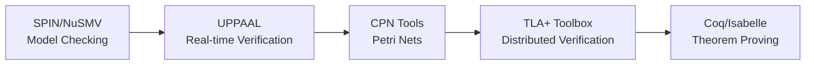

# Distributed Systems Formal Methods - Learning Path Guide

> **Document**: Personalized learning path recommendations for readers with different backgrounds

---

## 🎓 Path 1: Theoretical Research Path

**Target Audience**: Computer science theory researchers, PhD students in formal methods

**Goal**: Deep understanding of mathematical foundations of formal methods, mastery of rigorous proof techniques

### Stage 1: Mathematical Foundations (2-3 weeks)

| No. | Document | Focus | Exercise |
|-----|----------|-------|----------|
| 1.1 | [Order Theory](01-foundations/01-order-theory-EN.md) | CPO, Fixed Points | Prove Kleene's Theorem |
| 1.2 | [Category Theory](01-foundations/02-category-theory-EN.md) | Coalgebra, Bisimulation | Construct stream bisimulation |
| 1.3 | [Logic Foundations](01-foundations/03-logic-foundations-EN.md) | LTL, Hoare Logic | Write temporal formulas |

### Stage 2: Process Calculi (3-4 weeks)

| No. | Document | Focus | Exercise |
|-----|----------|-------|----------|
| 2.1 | [π-calculus Basics](02-calculi/02-pi-calculus/01-pi-calculus-basics-EN.md) | Syntax, Semantics, Bisimulation | Encode λ-calculus |
| 2.2 | [Stream Calculus](02-calculi/03-stream-calculus/01-stream-calculus-EN.md) | Coinduction, Convolution | Solve stream equations |
| 2.3 | [Kahn Process Networks](02-calculi/03-stream-calculus/03-kahn-process-networks-EN.md) | Continuity, Monotonicity | Prove network determinism |

### Stage 3: Model Taxonomy (2 weeks)

| No. | Document | Focus |
|-----|----------|-------|
| 3.1 | [Process Algebra Family](03-model-taxonomy/02-computation-models/01-process-algebras-EN.md) | CCS/CSP/π comparison |
| 3.2 | [Consistency Models](03-model-taxonomy/04-consistency/01-consistency-spectrum-EN.md) | CAP trade-offs |

### Stage 4: Advanced Verification (3-4 weeks)

| No. | Document | Focus | Practice |
|-----|----------|-------|----------|
| 4.1 | [TLA+](05-verification/01-logic/01-tla-plus-EN.md) | Specification Writing | Write Paxos specification |
| 4.2 | [Theorem Proving](05-verification/03-theorem-proving/01-coq-isabelle-EN.md) | Coq/Isabelle | Prove list properties |

---

## 🏗️ Path 2: Engineering Practice Path

**Target Audience**: Distributed systems engineers, architects, SREs

**Goal**: Master the application of formal methods in practical system design and verification

### Stage 1: Quick Start (1 week)

| No. | Document | Focus | Output |
|-----|----------|-------|--------|
| 1.1 | [Logic Foundations](01-foundations/03-logic-foundations-EN.md) | LTL properties | Write monitoring rules |
| 1.2 | [System Models](03-model-taxonomy/01-system-models/01-sync-async-EN.md) | Asynchronous assumptions | Understand system design constraints |

### Stage 2: Workflow and Stream Computing (2 weeks)

| No. | Document | Focus | Practice |
|-----|----------|-------|----------|
| 2.1 | [Workflow Formalization](04-application-layer/01-workflow/01-workflow-formalization-EN.md) | BPMN Semantics | Verify business processes |
| 2.2 | [Stream Processing Formalization](04-application-layer/02-stream-processing/01-stream-formalization-EN.md) | Determinism guarantees | Design stream topologies |

### Stage 3: Cloud Native and Containers (2 weeks)

| No. | Document | Focus | Practice |
|-----|----------|-------|----------|
| 3.1 | [Kubernetes Verification](04-application-layer/03-cloud-native/02-kubernetes-verification-EN.md) | Scheduling correctness | Analyze scheduling policies |
| 3.2 | [Industrial Cases](04-application-layer/03-cloud-native/03-industrial-cases-EN.md) | AWS/Azure practices | Apply best practices |

### Stage 4: Tool Practice (2 weeks)

| No. | Tool | Document | Project |
|-----|------|----------|---------|
| 4.1 | TLA+ | [TLA+ Toolbox](06-tools/academic/04-tla-toolbox-EN.md) | Verify distributed algorithms |
| 4.2 | UPPAAL | [UPPAAL](06-tools/academic/02-uppaal-EN.md) | Verify real-time systems |

---

## 🔧 Path 3: Tool Expert Path

**Target Audience**: Formal verification engineers, tool developers

**Goal**: Master the use and extension of mainstream formal verification tools

### Academic Toolchain (4 weeks)

| Tool | Document | Focus Area | Certification Project |
|------|----------|------------|----------------------|
| SPIN | [spin-nusmv.md](06-tools/academic/01-spin-nusmv-EN.md) | Protocol verification | Communication protocols |
| UPPAAL | [uppaal.md](06-tools/academic/02-uppaal-EN.md) | Real-time systems | Embedded scheduling |
| CPN Tools | [cpn-tools.md](06-tools/academic/03-cpn-tools-EN.md) | Workflows | Business processes |
| TLA+ | [tla-toolbox.md](06-tools/academic/04-tla-toolbox-EN.md) | Distributed systems | Consensus algorithms |
| Coq | [coq-isabelle.md](06-tools/academic/05-coq-isabelle-EN.md) | Program verification | Data structures |

### Industrial Toolchain (3 weeks)

| Tool | Document | Application Scenario |
|------|----------|---------------------|
| AWS Zelkova/Tiros | [aws-zelkova-tiros.md](06-tools/industrial/01-aws-zelkova-tiros-EN.md) | Cloud security policies |
| Azure Verification | [azure-verification.md](06-tools/industrial/02-azure-verification-EN.md) | Database consistency |
| K8s Verification | [google-kubernetes.md](06-tools/industrial/03-google-kubernetes-EN.md) | Container orchestration |

---

## 🌐 Path 4: Cross-Domain Application Path

### Sub-path A: Blockchain and Smart Contracts

**Prerequisites**: Path 1 Stages 1-2

**Specialized Documents**:

- [Separation Logic](05-verification/01-logic/03-separation-logic-EN.md) - Smart contract verification
- [Hybrid Automata](03-model-taxonomy/02-computation-models/02-automata-EN.md) - DeFi protocols

### Sub-path B: IoT and Edge Computing

**Prerequisites**: Path 2 Stages 1-2

**Specialized Documents**:

- [ω-calculus](02-calculi/01-w-calculus-family/01-omega-calculus-EN.md) - MANET modeling
- [Resource-Constrained Petri Nets](03-model-taxonomy/03-resource-deployment/03-elasticity-EN.md)

### Sub-path C: AI System Verification

**Prerequisites**: Path 1 Stages 1-3

**Specialized Documents**:

- [Future Trends](07-future/02-future-trends-EN.md) - AI-assisted formalization
- [Uncertainty](07-future/01-current-challenges-EN.md) - Neural network verification

---

## 📊 Learning Progress Tracking

### Self-Assessment Checklist

#### Foundational Knowledge

- [ ] Understanding CPOs and fixed points
- [ ] Mastering LTL/CTL semantics
- [ ] Familiar with process calculus syntax

#### Intermediate Skills

- [ ] Ability to write π-calculus processes
- [ ] Ability to prove simple bisimulations
- [ ] Understanding Kahn semantics

#### Advanced Applications

- [ ] Ability to write TLA+ specifications
- [ ] Ability to perform model checking
- [ ] Ability to apply formal methods to real problems

---

## 🔗 Recommended Learning Resources

### Classic Books

| Book | Author | Applicable Path |
|------|--------|-----------------|
| *Communicating and Mobile Systems* | Milner | Path 1, 2 |
| *Specifying Systems* | Lamport | Path 2, 3 |
| *Logic in Computer Science* | Huth & Ryan | Path 1 |
| *Principles of Model Checking* | Baier & Katoen | Path 3 |
| *Distributed Algorithms* | Nancy Lynch | Path 1, 2 |
| *Understanding Distributed Systems* | Roberto Vitillo | Path 2 |
| *Formal Reasoning About Programs* | Adam Chlipala | Path 1, 3 |

### Online Courses

| Course | Platform | Content |
|--------|----------|---------|
| TLA+ Video Course | lamport.azurewebsites.net | TLA+ Introduction |
| Formal Methods | Coursera | Formal Methods Overview |
| Distributed Systems | MIT OpenCourseWare (6.824) | Distributed Systems Theory |
| Category Theory | Bartosz Milewski (YouTube) | Category Theory for Programmers |
| Coq Proof Assistant | Software Foundations | Interactive theorem proving |
| Model Checking | TU Munich (YouTube) | Spin and model checking |

### English-Specific Learning Resources

#### Academic Journals and Publications

| Resource | Publisher | Focus Area |
|----------|-----------|------------|
| *Formal Aspects of Computing* | Springer | Formal methods research |
| *Journal of Automated Reasoning* | Springer | Automated theorem proving |
| *ACM Transactions on Programming Languages* | ACM | Programming language theory |
| *Information and Computation* | Elsevier | Theoretical computer science |
| CAV Conference Proceedings | Springer | Computer-aided verification |
| TACAS Conference Proceedings | Springer | Tools and algorithms |
| POPL Conference Proceedings | ACM | Principles of programming |

#### Online Communities and Forums

| Community | Platform | Description |
|-----------|----------|-------------|
| TLA+ Google Group | Google Groups | TLA+ discussions and Q&A |
| Coq Discourse | Discourse | Coq proof assistant community |
| r/formalmethods | Reddit | Formal methods general discussion |
| Lean Zulip Chat | Zulip | Lean theorem prover community |
| Isabelle Mailing List | Mailman | Isabelle/HOL discussions |
| Formal Methods Stack Exchange | Stack Exchange | Q&A for formal verification |

#### Open-Source Tools and Frameworks

| Tool/Framework | Language | Use Case |
|----------------|----------|----------|
| Ivy | Python | Verification of distributed protocols |
| Verdi | Coq | Distributed system verification framework |
| Irmin | OCaml | Mergeable distributed data structures |
| Awerbis | Rust | Byzantine fault tolerance verification |
| F* | F# | Dependently typed verification language |
| Dafny | C# | Verification-aware programming |

#### University Course Materials (English)

| Course | Institution | Level |
|--------|-------------|-------|
| CS 263 (Foundations of Programming) | Harvard | Graduate |
| CS 356 (Computer Systems Security) | Stanford | Graduate |
| 6.826 (Principles of Computer Systems) | MIT | Graduate |
| CS 421 (Programming Languages) | UIUC | Undergraduate/Graduate |
| CSE 507 (Computer-Aided Verification) | University of Washington | Graduate |
| COMP 302 (Programming Languages and Paradigms) | McGill | Undergraduate |

#### Video Lectures and Tutorials

| Series | Lecturer | Platform |
|--------|----------|----------|
| *Introduction to TLA+* | Leslie Lamport | Microsoft Research |
| *Practical Coq* | Benjamin Pierce | YouTube |
| *Formal Methods in Software Engineering* | John Harrison | YouTube |
| *Advanced Topics in Types and Programming Languages* | Various | OPLSS Summer School |
| *Category Theory* | Eugenia Cheng | YouTube (The Catsters) |
| *Model Checking* | Edmund Clarke (Legacy) | Carnegie Mellon |

#### Documentation and Specifications

| Document | Source | Description |
|----------|--------|-------------|
| TLA+ Hyperbook | Leslie Lamport | Comprehensive TLA+ learning resource |
| Software Foundations | UPenn/Bedrock Systems | Coq-based formal methods course |
| Concrete Semantics | Tobias Nipkow | Isabelle/HOL semantics textbook |
| Certified Programming with Dependent Types | Adam Chlipala | Advanced Coq techniques |
| Types and Programming Languages | Benjamin Pierce | Type theory foundation |

---

## 💡 Learning Advice

### Combining Theory and Practice

1. For every theoretical document read, try to verify it with tools
2. Start with simple examples and gradually increase complexity
3. Participate in open-source formal verification projects

### Active Learning Strategies

1. **Proof Reconstruction**: Reconstruct proofs from papers on your own before reading the original
2. **Tool Experimentation**: Implement small examples in multiple tools (TLA+, Coq, Isabelle) to compare approaches
3. **Peer Review**: Join study groups to review each other's specifications and proofs
4. **Bug Hunting**: Deliberately introduce bugs in algorithms and observe how verification tools catch them

### Research Skills Development

1. **Reading Academic Papers**: Practice reading conference papers from CAV, TACAS, and POPL
2. **Literature Review**: Maintain a bibliography of relevant papers with your own notes
3. **Reproduction**: Attempt to reproduce published verification results
4. **Tool Comparison**: Create comparison matrices for different verification approaches

### Industry Application Preparation

1. **Case Study Analysis**: Study verification reports from AWS (S3, DynamoDB) and Azure
2. **Integration Practice**: Practice integrating formal specs with existing codebases
3. **Stakeholder Communication**: Learn to explain formal methods benefits to non-technical stakeholders
4. **Cost-Benefit Analysis**: Understand when formal methods provide ROI vs. testing

### Community Engagement

- **TLA+ Google Group**: Participate in specification reviews and discussions
- **Coq Discourse**: Contribute answers and ask questions about proof techniques
- **r/formalmethods (Reddit)**: Share resources and discuss trends
- **Formal Methods Conferences**: Attend CAV, FM, TACAS for networking and learning
- **Discord/Slack Groups**: Join real-time chat communities for quick questions
- **GitHub Repositories**: Contribute to verification projects and tools

### Career Development

| Role | Recommended Paths | Additional Skills |
|------|-------------------|-------------------|
| Formal Methods Researcher | Path 1 → 3 | Academic writing, grant applications |
| Distributed Systems Engineer | Path 2 → 4 | Kubernetes, AWS/Azure, Go/Rust |
| Verification Engineer | Path 3 → 2 | CI/CD integration, property-based testing |
| Security Specialist | Path 1 → 4 (A) | Cryptography, secure coding |
| Blockchain Developer | Path 4 (A) | Solidity, Move, consensus algorithms |
| Systems Architect | Path 2 → 3 | Technical leadership, system design |

### Time Management Recommendations

| Commitment Level | Weekly Hours | Suggested Path |
|------------------|--------------|----------------|
| Casual Learner | 3-5 hours | Path 2 only |
| Part-Time Student | 10-15 hours | Path 1 or 2 |
| Full-Time Student | 20-30 hours | Path 1 + 3 |
| Professional Development | 5-10 hours | Path 2 + specific sections |
| Research Preparation | 30+ hours | Complete all paths |

### Assessment Milestones

**Month 1**: Complete Path 1 Stage 1 or Path 2 Stage 1
**Month 3**: Complete first full path + begin tool practice
**Month 6**: Complete two paths + complete one certification project
**Month 12**: Achieve proficiency in chosen specialization + community contributions

---

> **Note**: Learning paths are not strictly linear sequences. You can adjust flexibly based on your background and interests. The key is to maintain a balance between theory and practice.

> **For English Learners**: Many foundational papers in formal methods are written in English. We recommend reading original papers alongside this guide to build technical vocabulary. Key terminology is maintained in its original English form throughout this document to ensure compatibility with international literature.
