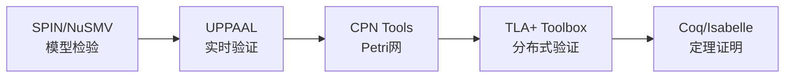

# 分布式系统形式化方法 - 学习路径指南

> **本文档**: 为不同背景的读者提供个性化的学习路径建议

---

## 🎓 路径一：理论研究路径

**适合人群**: 计算机科学理论研究者、形式化方法博士生

**目标**: 深入理解形式化方法的数学基础，掌握严格的证明技术

### 阶段1: 数学基础 (2-3周)

| 序号 | 文档 | 重点 | 练习 |
|------|------|------|------|
| 1.1 | [序理论](01-foundations/01-order-theory.md) | CPO、不动点 | 证明Kleene定理 |
| 1.2 | [范畴论](01-foundations/02-category-theory.md) | 余代数、双模拟 | 构造流的双模拟 |
| 1.3 | [逻辑基础](01-foundations/03-logic-foundations.md) | LTL、霍尔逻辑 | 编写时序公式 |

### 阶段2: 计算演算 (3-4周)

| 序号 | 文档 | 重点 | 练习 |
|------|------|------|------|
| 2.1 | [π-calculus基础](02-calculi/02-pi-calculus/01-pi-calculus-basics.md) | 语法、语义、互模拟 | 编码λ-calculus |
| 2.2 | [Stream Calculus](02-calculi/03-stream-calculus/01-stream-calculus.md) | 共归纳、卷积 | 流方程求解 |
| 2.3 | [Kahn进程网](02-calculi/03-stream-calculus/03-kahn-process-networks.md) | 连续性、单调性 | 证明网络确定性 |

### 阶段3: 模型分类 (2周)

| 序号 | 文档 | 重点 |
|------|------|------|
| 3.1 | [进程代数家族](03-model-taxonomy/02-computation-models/01-process-algebras.md) | CCS/CSP/π对比 |
| 3.2 | [一致性模型](03-model-taxonomy/04-consistency/01-consistency-spectrum.md) | CAP权衡 |

### 阶段4: 高级验证 (3-4周)

| 序号 | 文档 | 重点 | 实践 |
|------|------|------|------|
| 4.1 | [TLA+](05-verification/01-logic/01-tla-plus.md) | 规范编写 | 编写Paxos规范 |
| 4.2 | [定理证明](05-verification/03-theorem-proving/01-coq-isabelle.md) | Coq/Isabelle | 证明列表性质 |

---

## 🏗️ 路径二：工程实践路径

**适合人群**: 分布式系统工程师、架构师、SRE

**目标**: 掌握形式化方法在实际系统设计和验证中的应用

### 阶段1: 快速入门 (1周)

| 序号 | 文档 | 重点 | 产出 |
|------|------|------|------|
| 1.1 | [逻辑基础](01-foundations/03-logic-foundations.md) | LTL性质 | 编写监控规则 |
| 1.2 | [系统模型](03-model-taxonomy/01-system-models/01-sync-async.md) | 异步假设 | 理解系统设计约束 |

### 阶段2: 工作流与流计算 (2周)

| 序号 | 文档 | 重点 | 实践 |
|------|------|------|------|
| 2.1 | [工作流形式化](04-application-layer/01-workflow/01-workflow-formalization.md) | BPMN语义 | 验证业务流程 |
| 2.2 | [流计算形式化](04-application-layer/02-stream-processing/01-stream-formalization.md) | 确定性保证 | 设计流拓扑 |

### 阶段3: 云原生与容器 (2周)

| 序号 | 文档 | 重点 | 实践 |
|------|------|------|------|
| 3.1 | [Kubernetes验证](04-application-layer/03-cloud-native/02-kubernetes-verification.md) | 调度正确性 | 分析调度策略 |
| 3.2 | [工业案例](04-application-layer/03-cloud-native/03-industrial-cases.md) | AWS/Azure实践 | 应用最佳实践 |

### 阶段4: 工具实践 (2周)

| 序号 | 工具 | 文档 | 实践项目 |
|------|------|------|----------|
| 4.1 | TLA+ | [TLA+ Toolbox](06-tools/academic/04-tla-toolbox.md) | 验证分布式算法 |
| 4.2 | UPPAAL | [UPPAAL](06-tools/academic/02-uppaal.md) | 验证实时系统 |

---

## 🔧 路径三：工具专家路径

**适合人群**: 形式化验证工程师、工具开发者

**目标**: 精通主流形式化验证工具的使用和扩展

### 学术工具链 (4周)

| 工具 | 文档 | 专注领域 | 认证项目 |
|------|------|----------|----------|
| SPIN | [spin-nusmv.md](06-tools/academic/01-spin-nusmv.md) | 协议验证 | 通信协议 |
| UPPAAL | [uppaal.md](06-tools/academic/02-uppaal.md) | 实时系统 | 嵌入式调度 |
| CPN Tools | [cpn-tools.md](06-tools/academic/03-cpn-tools.md) | 工作流 | 业务流程 |
| TLA+ | [tla-toolbox.md](06-tools/academic/04-tla-toolbox.md) | 分布式系统 | 共识算法 |
| Coq | [coq-isabelle.md](06-tools/academic/05-coq-isabelle.md) | 程序验证 | 数据结构 |

### 工业工具链 (3周)

| 工具 | 文档 | 应用场景 |
|------|------|----------|
| AWS Zelkova/Tiros | [aws-zelkova-tiros.md](06-tools/industrial/01-aws-zelkova-tiros.md) | 云安全策略 |
| Azure验证 | [azure-verification.md](06-tools/industrial/02-azure-verification.md) | 数据库一致性 |
| K8s验证 | [google-kubernetes.md](06-tools/industrial/03-google-kubernetes.md) | 容器编排 |

---

## 🌐 路径四：跨领域应用路径

### 子路径A: 区块链与智能合约

**前置**: 路径一阶段1-2

**专项文档**:

- [分离逻辑](05-verification/01-logic/03-separation-logic.md) - 智能合约验证
- [Hybrid Automata](03-model-taxonomy/02-computation-models/02-automata.md) - DeFi协议

### 子路径B: IoT与边缘计算

**前置**: 路径二阶段1-2

**专项文档**:

- [ω-calculus](02-calculi/01-w-calculus-family/01-omega-calculus.md) - MANET建模
- [资源约束Petri网](03-model-taxonomy/03-resource-deployment/03-elasticity.md)

### 子路径C: AI系统验证

**前置**: 路径一阶段1-3

**专项文档**:

- [未来趋势](07-future/02-future-trends.md) - AI辅助形式化
- [不确定性](07-future/01-current-challenges.md) - 神经网络验证

---

## 📊 学习进度跟踪

### 自测清单

#### 基础知识

- [ ] 理解CPO和不动点
- [ ] 掌握LTL/CTL语义
- [ ] 熟悉进程代数语法

#### 中级技能

- [ ] 能编写π-calculus进程
- [ ] 能证明简单的双模拟
- [ ] 理解Kahn语义

#### 高级应用

- [ ] 能用TLA+写规范
- [ ] 能进行模型检验
- [ ] 能应用形式化方法解决实际问题

---

## 🔗 推荐学习资源

### 经典书籍

| 书名 | 作者 | 适用路径 |
|------|------|----------|
| *Communicating and Mobile Systems* | Milner | 路径一、二 |
| *Specifying Systems* | Lamport | 路径二、三 |
| *Logic in Computer Science* | Huth & Ryan | 路径一 |
| *Principles of Model Checking* | Baier & Katoen | 路径三 |

### 在线课程

| 课程 | 平台 | 内容 |
|------|------|------|
| TLA+ Video Course | lamport.azurewebsites.net | TLA+入门 |
| Formal Methods | Coursera | 形式化方法导论 |

---

## 💡 学习建议

### 理论与实践结合

1. 每读一个理论文档，尝试用工具验证
2. 从简单例子开始，逐步增加复杂度
3. 参与开源形式化验证项目

### 社区参与

- TLA+ Google Group
- Coq Discourse
- r/formalmethods (Reddit)

---

> **提示**: 学习路径不是严格的线性序列，可以根据自己的背景和兴趣灵活调整。关键是保持理论与实践的平衡。
