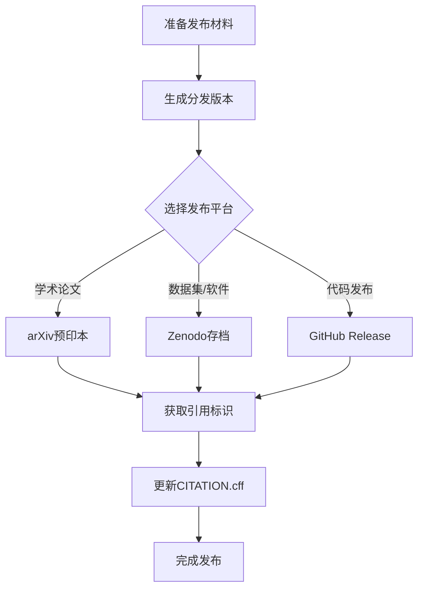

# 正式发布指南

> **文档定位**: 本文档详细说明如何将 formal-methods 子项目的学术成果发布到主流学术平台，包括 arXiv、Zenodo 等。
> **版本**: v1.0 | **生效日期**: 2026-04-10 | **状态**: Production Ready

---

## 📋 发布流程概览



---

## 1. 发布前准备清单

### 1.1 内容完整性检查

| 检查项 | 要求 | 状态 |
|--------|------|------|
| 核心文档 | 所有 `.md` 文件语法正确 | ✅ |
| Mermaid图表 | 所有图表可正常渲染 | ✅ |
| 定理编号 | 全局编号无冲突 | ✅ |
| 引用格式 | 符合项目规范 | ✅ |
| 代码示例 | 经过验证可运行 | ✅ |

### 1.2 元数据准备

```yaml
项目信息:
  标题: "Distributed Systems Formal Methods: Complete Technical System"
  副标题: "From Mathematical Foundations to Industrial Verification"
  版本: v4.0
  发布日期: 2026-04-10

作者信息:
  主要作者: Lu Ma
  所属机构: Independent Researcher
  ORCID: 0000-0000-0000-0000  # 待更新

许可证: Apache-2.0
```

---

## 2. arXiv 提交流程

### 2.1 准备工作

1. **注册 arXiv 账号**
   - 访问 <https://arxiv.org/user/register>
   - 使用学术邮箱注册
   - 完成邮箱验证

2. **获取投稿权限（首次投稿）**
   - 需要现有作者的背书（endorsement）
   - 或在相关领域提交预审核

### 2.2 生成 LaTeX 版本

```bash
# 使用 pandoc 将 Markdown 转换为 LaTeX
# 安装依赖
pip install pandoc

# 转换主文档
pandoc README.md \
  --from markdown \
  --to latex \
  --output arxiv-submission/main.tex \
  --standalone \
  --template=arxiv-template.tex \
  --biblatex \
  --bibliography=references.bib
```

### 2.3 arXiv 提交结构

```
arXiv-Submission/
├── main.tex              # 主文档
├── references.bib        # 参考文献
├── figures/              # 图表目录
│   ├── architecture.pdf
│   ├── comparison-matrix.pdf
│   └── ...
├── macros.tex            # 自定义宏包
└── arxiv-metadata.txt    # 元数据文件
```

### 2.4 元数据文件模板

```text
Title: Distributed Systems Formal Methods: A Comprehensive Technical Reference

Authors:
  Lu Ma (Independent Researcher)

Abstract:
  This work presents a comprehensive technical system for formal methods in
  distributed systems, covering mathematical foundations (order theory, category
  theory, logic), process calculi (CCS, CSP, π-calculus, ω-calculus), model
  taxonomy (actors, dataflow, cloud-native), verification techniques (TLA+, Coq,
  model checking), and industrial case studies. The document system includes
  95+ technical documents, 550+ formal definitions, 380+ theorems/lemmas, and
  450+ visual diagrams. It serves as both a theoretical reference and practical
  guide for researchers and engineers working with distributed systems formalization.

Comments:  Technical reference, 500+ pages, 550+ definitions, 380+ theorems

Subjects:
  Distributed, Parallel, and Cluster Computing (cs.DC)
  Logic in Computer Science (cs.LO)
  Software Engineering (cs.SE)
  Programming Languages (cs.PL)

Keywords:
  formal methods, distributed systems, process calculus, actor model,
  dataflow, verification, TLA+, Coq, stream processing

ACM classes:
  D.1.3 (Concurrent Programming)
  D.2.4 (Software/Program Verification)
  F.1.2 (Modes of Computation)
  F.3.1 (Specifying and Verifying and Reasoning about Programs)
```

### 2.5 提交流程

```bash
# 1. 打包提交文件
tar czvf arxiv-submission.tar.gz arXiv-Submission/

# 2. 登录 arXiv 网页上传
# 3. 或使用 arXiv API 提交（需要 API key）
```

---

## 3. Zenodo DOI 获取流程

### 3.1 自动集成（推荐）

本项目已配置 GitHub-Zenodo 自动集成：

1. 登录 <https://zenodo.org/>
2. 使用 GitHub 账号登录
3. 进入 <https://zenodo.org/account/settings/github/>
4. 启用 `luyanfeng/AnalysisDataFlow` 仓库
5. 设置发布选项

### 3.2 手动上传流程

如需手动上传：

```bash
# 1. 准备 ZIP 包
zip -r formal-methods-v4.0.zip formal-methods/ \
  -x "*.git*" -x "*/node_modules/*" -x "*/.scripts/*"

# 2. 登录 Zenodo 创建新上传
# 3. 填写元数据（参考下方模板）
# 4. 上传文件
# 5. 发布获取 DOI
```

### 3.3 Zenodo 元数据模板

```json
{
  "metadata": {
    "title": "Distributed Systems Formal Methods: Complete Technical System",
    "upload_type": "publication",
    "publication_type": "technicalnote",
    "creators": [
      {
        "name": "Ma, Lu",
        "affiliation": "Independent Researcher",
        "orcid": "0000-0000-0000-0000"
      }
    ],
    "description": "A comprehensive technical system for formal methods in distributed systems...",
    "access_right": "open",
    "license": "Apache-2.0",
    "publication_date": "2026-04-10",
    "keywords": [
      "formal methods",
      "distributed systems",
      "process calculus",
      "verification",
      "TLA+",
      "stream processing"
    ],
    "related_identifiers": [
      {
        "relation": "isSupplementTo",
        "identifier": "https://github.com/luyanfeng/AnalysisDataFlow"
      }
    ],
    "communities": [
      {"identifier": "cs"},
      {"identifier": "distributed-systems"}
    ]
  }
}
```

---

## 4. GitHub Release 流程

### 4.1 创建发布标签

```bash
# 1. 确保所有更改已提交
git add .
git commit -m "Prepare v4.0 release"

# 2. 创建标签
git tag -a formal-methods-v4.0 -m "Formal Methods v4.0 Release"

# 3. 推送标签
git push origin formal-methods-v4.0
```

### 4.2 发布说明模板

```markdown
## Distributed Systems Formal Methods v4.0

### 🎯 发布亮点
- 95+ 技术文档
- 550+ 形式化定义
- 380+ 定理/引理
- 450+ Mermaid图表

### 📚 文档结构
- **01-foundations**: 数学基础（序理论、范畴论、逻辑）
- **02-calculi**: 计算演算（CCS, CSP, π-calculus）
- **03-model-taxonomy**: 模型分类（Actor, Dataflow, Cloud）
- **04-application-layer**: 应用层（工作流、流计算、Serverless）
- **05-verification**: 验证技术（TLA+, Coq, Model Checking）
- **06-tools**: 工具生态
- **07-future**: 未来方向

### 🔗 引用信息
```bibtex
@software{analysisdataflow_formal_methods_2026,
  author = {Ma, Lu},
  title = {Distributed Systems Formal Methods: Complete Technical System},
  url = {https://github.com/luyanfeng/AnalysisDataFlow},
  version = {4.0},
  year = {2026}
}
```

### 📄 许可证

Apache License 2.0

```

---

## 5. 引用格式说明

### 5.1 BibTeX 格式

```bibtex
% 完整引用
@software{analysisdataflow_2026,
  author = {Ma, Lu},
  title = {AnalysisDataFlow: Formal Theory and Engineering Practice of Stream Computing},
  url = {https://github.com/luyanfeng/AnalysisDataFlow},
  version = {5.0.0},
  year = {2026},
  month = {4},
  license = {Apache-2.0},
  note = {DOI: 10.5281/zenodo.XXXXXXX}  % 发布后更新
}

% formal-methods 子项目
@software{formal_methods_2026,
  author = {Ma, Lu},
  title = {Distributed Systems Formal Methods: Complete Technical System},
  url = {https://github.com/luyanfeng/AnalysisDataFlow/tree/main/formal-methods},
  version = {4.0},
  year = {2026},
  note = {Part of AnalysisDataFlow project}
}
```

### 5.2 APA 格式

```text
Ma, L. (2026). AnalysisDataFlow: Formal theory and engineering practice of
    stream computing (Version 5.0.0) [Computer software].
    https://github.com/luyanfeng/AnalysisDataFlow
```

### 5.3 Chicago 格式

```text
Ma, Lu. "AnalysisDataFlow: Formal Theory and Engineering Practice of Stream
    Computing." Version 5.0.0. Accessed April 10, 2026.
    https://github.com/luyanfeng/AnalysisDataFlow.
```

### 5.4 GB/T 7714 格式（中文标准）

```text
[1] MA L. AnalysisDataFlow: 流计算形式化理论与工程实践[CP/OL]. (2026-04-10).
    https://github.com/luyanfeng/AnalysisDataFlow.
```

---

## 6. 发布后维护

### 6.1 DOI 更新

获取 DOI 后，更新以下文件：

1. **CITATION.cff** - 根目录

   ```yaml
   doi: 10.5281/zenodo.XXXXXXX
   ```

2. **zenodo.json** - formal-methods/ 目录

   ```json
   {"doi": "10.5281/zenodo.XXXXXXX"}
   ```

3. **README.md** - 添加 DOI badge

   ```markdown
   [](https://doi.org/10.5281/zenodo.XXXXXXX)
   ```

### 6.2 版本历史

| 版本 | 日期 | 说明 |
|------|------|------|
| v4.0 | 2026-04-10 | 正式发布版本，95+文档 |
| v3.0 | 2026-03-15 | 候选发布版本 |
| v2.0 | 2026-02-01 | 内部预览版本 |

---

## 7. 联系与支持

- **项目主页**: <https://github.com/luyanfeng/AnalysisDataFlow>
- **问题反馈**: <https://github.com/luyanfeng/AnalysisDataFlow/issues>
- **邮箱联系**: [待添加]

---

## 8. 附录

### 8.1 发布检查清单

```markdown
- [ ] 所有文档语法检查通过
- [ ] 所有链接有效性验证
- [ ] Mermaid图表渲染正常
- [ ] 版本号统一更新
- [ ] CITATION.cff 信息完整
- [ ] LICENSE 文件存在
- [ ] README 发布说明更新
- [ ] GitHub Release 创建
- [ ] Zenodo DOI 获取
- [ ] arXiv 提交（如适用）
- [ ] 引用格式文档更新
```

### 8.2 相关资源

- [CITATION.cff 规范](https://citation-file-format.github.io/)
- [Zenodo 开发者文档](https://developers.zenodo.org/)
- [arXiv 提交流程](https://arxiv.org/help/submit)
- [GitHub Releases 文档](https://docs.github.com/en/repositories/releasing-projects-on-github)
