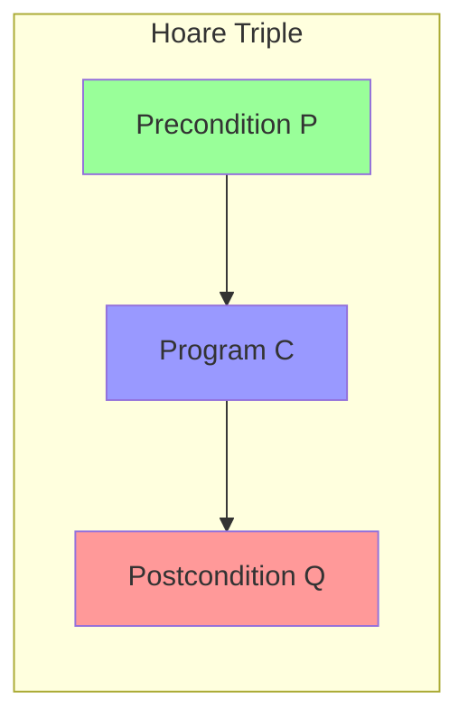
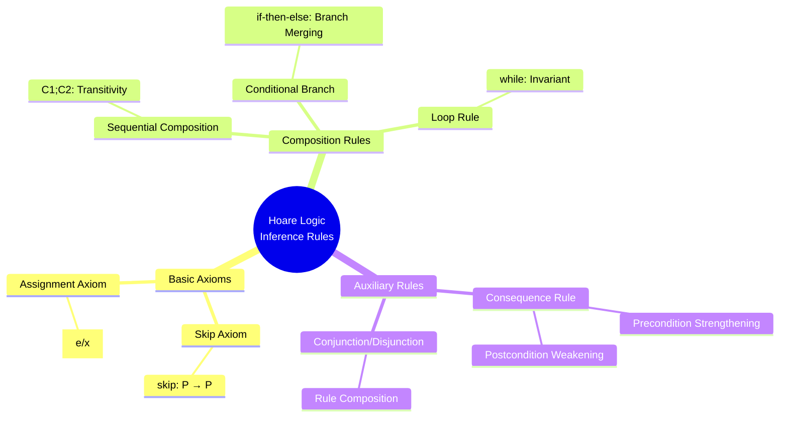
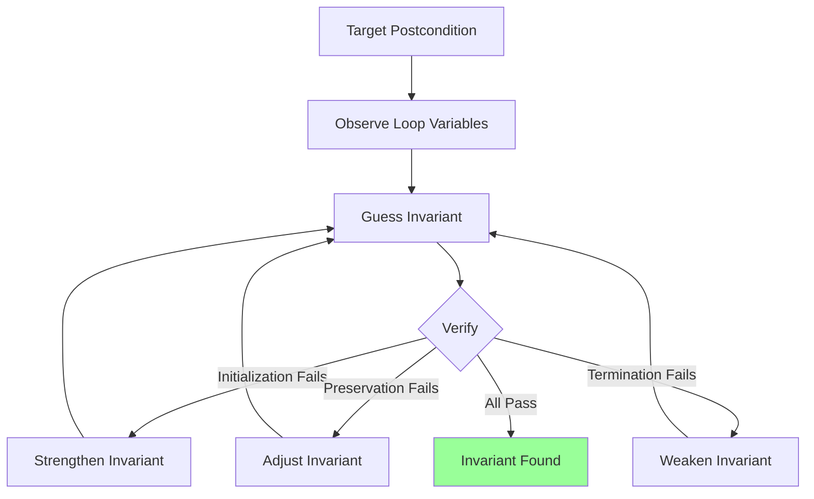
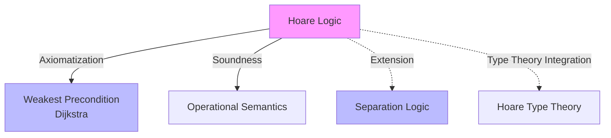
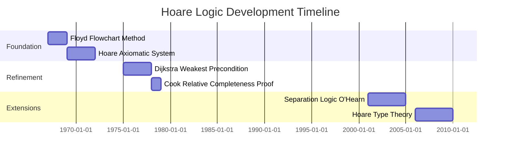
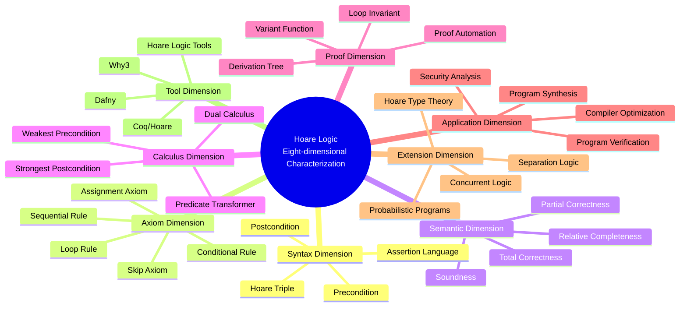

# Program Correctness (Hoare Logic)

> **Stage**: Struct | **Prerequisites**: First-order Logic, Operational Semantics | **Formalization Level**: L5
>
> **Wikipedia Standard Definition**: Hoare logic (also known as Floyd-Hoare logic or Hoare rules) is a formal system with a set of logical rules for reasoning rigorously about the correctness of computer programs.
>
> **Source**: <https://en.wikipedia.org/wiki/Hoare_logic>

---

## 1. Definitions

### 1.1 Wikipedia Standard Definition

**English Definition** (Wikipedia):
> *Hoare logic (also known as Floyd-Hoare logic or Hoare rules) is a formal system with a set of logical rules for reasoning rigorously about the correctness of computer programs. It was proposed in 1969 by Tony Hoare, and subsequently refined by Hoare and other researchers. The original ideas were seeded by the work of Robert Floyd, who had published a similar system for flowcharts.*

---

### 1.2 Formal Definitions

#### Def-S-HL-01: Hoare Triple

**Definition**: A Hoare triple is an assertion of the form $\{P\}\, C\, \{Q\}$, where:

- $P$: Precondition — properties that must hold before program execution
- $C$: Program Command — the program statement to be executed
- $Q$: Postcondition — properties that must hold after program execution

$$\text{Def-S-HL-01}: \{P\}\, C\, \{Q\}$$

**Partial Correctness**: If $P$ holds in the initial state and $C$ terminates, then $Q$ holds in the final state.

**Total Correctness**: If $P$ holds in the initial state, then $C$ terminates and $Q$ holds in the final state.

---

#### Def-S-HL-02: Assertion Language

**Definition**: Assertions $P, Q, \ldots$ are first-order logic formulas, which may contain:

- Program variables: $x, y, z \in Var$
- Constants: $0, 1, 2, \ldots$
- Arithmetic operations: $+, -, *, /, \bmod$
- Comparisons: $<, \leq, =, \neq, >, \geq$
- Logical connectives: $\land, \lor, \neg, \rightarrow$
- Quantifiers: $\forall, \exists$
- **Special symbol**: $P[e/x]$ denotes substituting all free occurrences of $x$ in $P$ with $e$

---

#### Def-S-HL-03: Program Syntax (Simple Imperative Language IMP)

**Definition**: IMP language syntax:

$$\begin{aligned}
C ::=&\ x := e \quad \text{(Assignment)} \\
     & \mid \mathbf{skip} \quad \text{(No-op)} \\
     & \mid C_1; C_2 \quad \text{(Sequential)} \\
     & \mid \mathbf{if}\, b\, \mathbf{then}\, C_1\, \mathbf{else}\, C_2 \quad \text{(Conditional)} \\
     & \mid \mathbf{while}\, b\, \mathbf{do}\, C \quad \text{(Loop)} \\
     & \mid C_1 \oplus C_2 \quad \text{(Non-deterministic Choice, Optional)}
\end{aligned}$$

---

#### Def-S-HL-04: Weakest Precondition

**Definition** (Dijkstra, 1975): For program $C$ and postcondition $Q$, the weakest precondition $wp(C, Q)$ is the weakest assertion satisfying:

$$\forall P: \left( \{P\}\, C\, \{Q\} \text{ is provable} \right) \leftrightarrow \left( P \rightarrow wp(C, Q) \right)$$

That is: $wp(C, Q)$ is the weakest among all preconditions that can ensure $Q$ holds after execution of $C$.

---

### 1.3 Hoare Inference Rules

#### Def-S-HL-05: Hoare Inference System

**Axioms and Rules**:

| Rule Name | Rule Form |
|-----------|-----------|
| **Skip Axiom** | $\{P\}\, \mathbf{skip}\, \{P\}$ |
| **Assignment Axiom** | $\{P[e/x]\}\, x := e\, \{P\}$ |
| **Sequential Rule** | $\frac{\{P\}\, C_1\, \{R\}, \quad \{R\}\, C_2\, \{Q\}}{\{P\}\, C_1; C_2\, \{Q\}}$ |
| **Conditional Rule** | $\frac{\{P \land b\}\, C_1\, \{Q\}, \quad \{P \land \neg b\}\, C_2\, \{Q\}}{\{P\}\, \mathbf{if}\, b\, \mathbf{then}\, C_1\, \mathbf{else}\, C_2\, \{Q\}}$ |
| **While Rule** | $\frac{\{I \land b\}\, C\, \{I\}}{\{I\}\, \mathbf{while}\, b\, \mathbf{do}\, C\, \{I \land \neg b\}}$ |
| **Consequence Rule** | $\frac{P \rightarrow P', \quad \{P'\}\, C\, \{Q'\}, \quad Q' \rightarrow Q}{\{P\}\, C\, \{Q\}}$ |

---

## 2. Properties

### 2.1 Rule-Derived Properties

#### Lemma-S-HL-01: Precondition Strengthening

**Lemma**: If $P_1 \rightarrow P_2$ and $\{P_2\}\, C\, \{Q\}$ is provable, then $\{P_1\}\, C\, \{Q\}$ is provable.

**Proof**: Directly use the consequence rule:

$$\frac{P_1 \rightarrow P_2, \quad \{P_2\}\, C\, \{Q\}, \quad Q \rightarrow Q}{\{P_1\}\, C\, \{Q\}} \quad \text{(Consequence)}$$

∎

---

#### Lemma-S-HL-02: Postcondition Weakening

**Lemma**: If $\{P\}\, C\, \{Q_1\}$ is provable and $Q_1 \rightarrow Q_2$, then $\{P\}\, C\, \{Q_2\}$ is provable.

**Proof**: Similar to Lemma 1, using the consequence rule. ∎

---

#### Lemma-S-HL-03: Weakest Precondition Calculation

**Lemma**: For IMP language constructs, $wp$ is calculated as follows:

| Construct | Weakest Precondition |
|-----------|---------------------|
| $\mathbf{skip}$ | $wp(\mathbf{skip}, Q) = Q$ |
| $x := e$ | $wp(x := e, Q) = Q[e/x]$ |
| $C_1; C_2$ | $wp(C_1; C_2, Q) = wp(C_1, wp(C_2, Q))$ |
| $\mathbf{if}\, b\, \mathbf{then}\, C_1\, \mathbf{else}\, C_2$ | $wp(\mathbf{if}\, b\, \mathbf{then}\, C_1\, \mathbf{else}\, C_2, Q) = (b \rightarrow wp(C_1, Q)) \land (\neg b \rightarrow wp(C_2, Q))$ |
| $\mathbf{while}\, b\, \mathbf{do}\, C$ | $wp(\mathbf{while}\, b\, \mathbf{do}\, C, Q) = \exists k: L_k$, where $L_0 = \neg b \land Q$, $L_{k+1} = L_k \lor (b \land wp(C, L_k))$ |

---

## 3. Relations

### 3.1 Relation with Operational Semantics

#### Prop-S-HL-01: Soundness of Hoare Logic

**Proposition**: Hoare logic is sound with respect to operational semantics:

$$\vdash \{P\}\, C\, \{Q\} \implies \models \{P\}\, C\, \{Q\}$$

That is: All provable triples hold under operational semantics.

---

### 3.2 Relation with Weakest Precondition Calculus

#### Prop-S-HL-02: Equivalence of Axiomatization and $wp$

**Proposition**:
1. $\vdash \{P\}\, C\, \{Q\}$ if and only if $P \rightarrow wp(C, Q)$
2. $\{wp(C, Q)\}\, C\, \{Q\}$ is always provable and is the weakest

---

### 3.3 Relation with Separation Logic

Hoare logic is the foundation of separation logic. Separation logic extends Hoare logic to handle heap memory:

| Hoare Logic | Separation Logic Extension |
|-------------|---------------------------|
| Assertions | Assertions with heap (e.g., $x \mapsto v$) |
| Assignment | Pointer operations (allocation, deallocation, read/write) |
| Frame Rule | Addition: Modular Reasoning |

---

## 4. Argumentation

### 4.1 Loop Invariant Discovery

#### Argument: Systematic Method for Loop Invariant Discovery

**Problem**: How to discover appropriate loop invariant $I$?

**Strategies**:

1. **Backward Derivation**: Start from target postcondition
2. **Variable Change Observation**: Identify properties that remain unchanged during the loop
3. **Weakening Strategy**: Find properties weaker than $Q$ but maintained by the loop

**Example**: Factorial calculation `while i < n do i := i+1; f := f*i`
- Target: $f = n!$
- Candidate invariant: $f = i! \land i \leq n$
- Verification:
  - Initialization: $i=0, f=1$ satisfies $f = i! = 1$
  - Preservation: If $f = i!$, after execution $f' = f \cdot (i+1) = (i+1)! = (i')!$

---

### 4.2 Total Correctness Extension

**Extended Hoare Triple**: $[P]\, C\, [Q]$ denotes total correctness

**Additional Rules**:

| Rule | Form |
|------|------|
| While Total Correctness | $\frac{[P \land b \land t=z]\, C\, [P \land t<z], \quad P \rightarrow t \geq 0}{[P]\, \mathbf{while}\, b\, \mathbf{do}\, C\, [P \land \neg b]}$ |

Where $t$ is the variant function, which must decrease and have a lower bound.

---

## 5. Formal Proofs

### 5.1 Theorem: Soundness of Hoare Logic

#### Thm-S-HL-01: Soundness Theorem

**Theorem**: Hoare logic is sound with respect to small-step operational semantics.

**Formal Statement**: For all $P, C, Q$:

$$\vdash \{P\}\, C\, \{Q\} \implies \forall s, s': \left( \langle C, s \rangle \rightarrow^* \langle \mathbf{skip}, s' \rangle \land s \models P \right) \rightarrow s' \models Q$$

**Proof** (By structural induction on derivation):

**Base Cases**:

1. **Skip Axiom**: $\{P\}\, \mathbf{skip}\, \{P\}$
   - Semantics: $\langle \mathbf{skip}, s \rangle \rightarrow \langle \checkmark, s \rangle$
   - If $s \models P$, clearly the final state also satisfies $P$.

2. **Assignment Axiom**: $\{P[e/x]\}\, x := e\, \{P\}$
   - Semantics: $\langle x := e, s \rangle \rightarrow \langle \checkmark, s[x \mapsto \mathcal{E}[e]s] \rangle$
   - By substitution lemma: $s[x \mapsto \mathcal{E}[e]s] \models P$ iff $s \models P[e/x]$.

**Inductive Steps**:

3. **Sequential Rule**: Assume holds for $C_1, C_2$
   - Given $\langle C_1; C_2, s \rangle \rightarrow^* \langle \checkmark, s' \rangle$
   - There must exist an intermediate state $s''$ such that $\langle C_1, s \rangle \rightarrow^* \langle \checkmark, s'' \rangle$ and $\langle C_2, s'' \rangle \rightarrow^* \langle \checkmark, s' \rangle$
   - By induction hypothesis: $s'' \models R$ (where $R$ is the intermediate assertion)
   - By induction hypothesis: $s' \models Q$

4. **Conditional Rule**: Consider cases where $b$ is true/false, handled similarly.

5. **While Rule**: By induction on number of loop iterations.
   - Base case: 0 iterations, $I \land \neg b$ directly satisfied
   - Inductive step: Assume $k$ iterations are preserved, prove $k+1$ iterations are preserved

6. **Consequence Rule**: Directly follows from monotonicity of first-order logic.

∎

---

### 5.2 Theorem: Relative Completeness of Hoare Logic

#### Thm-S-HL-02: Cook Relative Completeness

**Theorem** (Cook, 1978): If the first-order assertion language is expressive enough for all $wp$ calculations, then Hoare logic is relatively complete:

$$\models \{P\}\, C\, \{Q\} \implies \vdash \{P\}\, C\, \{Q\}$$

**Relativity**: Completeness is relative to the expressiveness of assertion language $L$.

**Proof Outline**:

**Key Lemma**: For any $C, Q$, there exists assertion $\phi_{C,Q}$ in $L$ such that:
$$\vdash \{\phi_{C,Q}\}\, C\, \{Q\} \quad \text{and} \quad \models \{P\}\, C\, \{Q\} \implies P \rightarrow \phi_{C,Q}$$

**Construction** (By structural induction on program):

1. **Skip**: $\phi_{\mathbf{skip},Q} = Q$

2. **Assignment**: $\phi_{x:=e,Q} = Q[e/x]$

3. **Sequential**: $\phi_{C_1;C_2,Q} = \phi_{C_1, \phi_{C_2,Q}}$

4. **Conditional**: $\phi_{\mathbf{if}\,b\,\mathbf{then}\,C_1\,\mathbf{else}\,C_2,Q} = (b \land \phi_{C_1,Q}) \lor (\neg b \land \phi_{C_2,Q})$

5. **While**: This is the key and difficult point

   Define: $\phi_{\mathbf{while}\,b\,\mathbf{do}\,C,Q} = \exists k: I_k$, where:
   - $I_0 = \neg b \land Q$
   - $I_{k+1} = I_k \lor (b \land \phi_{C,I_k})$

   $I_k$ represents "terminating and satisfying $Q$ after at most $k$ iterations".

   **Proof**: If the assertion language can express the above construction, the correctness of the While rule can be proved.

**Completeness Derivation**:

Assume $\models \{P\}\, C\, \{Q\}$, then:
1. $P \rightarrow \phi_{C,Q}$ (by semantics)
2. $\vdash \{\phi_{C,Q}\}\, C\, \{Q\}$ (by construction and induction)
3. By consequence rule: $\vdash \{P\}\, C\, \{Q\}$

∎

---

### 5.3 Theorem: Uniqueness of Weakest Precondition

#### Thm-S-HL-03: Uniqueness of $wp$

**Theorem**: For given program $C$ and postcondition $Q$, the weakest precondition $wp(C, Q)$ is unique up to logical equivalence.

**Proof**:

**Existence**: Define $wp(C, Q) = \{s \mid \forall s': \langle C, s \rangle \rightarrow^* \langle \checkmark, s' \rangle \rightarrow s' \models Q\}$

**Weakestness**: For any $P$ such that $\models \{P\}\, C\, \{Q\}$:
- If $s \models P$, then for all executions terminating in $s'$, $s' \models Q$
- Therefore $s \in wp(C, Q)$
- That is $P \rightarrow wp(C, Q)$

**Uniqueness**: Assume $W_1, W_2$ are both weakest preconditions:
- $W_1 \rightarrow W_2$ ($W_2$ is the weakest, $W_1$ is a precondition)
- $W_2 \rightarrow W_1$ (symmetric)
- Therefore $W_1 \leftrightarrow W_2$ (logical equivalence)

∎

---

## 6. Examples

### 6.1 Swapping Two Variables

**Program**:
```
{t := x; x := y; y := t}
```

**Specification**: $\{x = a \land y = b\}\, C\, \{x = b \land y = a\}$

**Proof**:

$$\frac{\{x = a \land y = b\}\, t := x\, \{t = a \land y = b\} \quad \text{(Assignment)}}{\{t = a \land y = b\}\, x := y\, \{t = a \land x = b\} \quad \text{(Assignment)}}$$
$$\frac{\{t = a \land x = b\}\, y := t\, \{y = a \land x = b\} = \{x = b \land y = a\} \quad \text{(Assignment)}}{\{x = a \land y = b\}\, C\, \{x = b \land y = a\}}$$

---

### 6.2 Factorial Calculation

**Program**:
```
{f := 1; i := 0; while i < n do (i := i+1; f := f*i)}
```

**Specification**: $\{n \geq 0\}\, C\, \{f = n!\}$

**Loop Invariant**: $I \equiv f = i! \land i \leq n$

**Proof Sketch**:

1. **Initialization**: $\{n \geq 0\}\, f := 1; i := 0\, \{f = i! = 1 \land i = 0 \leq n\}$ ✓

2. **Preservation**: Assume $I \land i < n$ holds
   - Execute $i := i+1$: $f = (i-1)! \land i \leq n$
   - Execute $f := f*i$: $f = i! \land i \leq n = I'$ ✓

3. **Termination**: $I \land \neg(i < n) \equiv f = i! \land i = n \rightarrow f = n!$ ✓

---

### 6.3 Array Summation

**Program**:
```
{i := 0; s := 0; while i < n do (s := s + a[i]; i := i+1)}
```

**Specification**: $\{n \geq 0\}\, C\, \{s = \sum_{j=0}^{n-1} a[j]\}$

**Loop Invariant**: $I \equiv s = \sum_{j=0}^{i-1} a[j] \land i \leq n$

---

## 7. Visualizations

### 7.1 Hoare Triple Structure



### 7.2 Hoare Inference Rule System



### 7.3 Proof Derivation Tree Example

```mermaid
graph TD
    Root[{x≥0} C {x≥5}]
    Root --> R1[{x≥0} x:=x+3 {x≥3}]
    Root --> R2[{x≥3} x:=x+2 {x≥5}]

    R1 --> A1[x:=x+3<br/>Assignment Axiom<br/>P[3/x]=x≥0]
    R2 --> A2[x:=x+2<br/>Assignment Axiom<br/>P[5/x]=x≥3]

    Root --> C[Consequence Rule<br/>x≥5 → x≥5]

    style Root fill:#f9f
    style A1 fill:#9f9
    style A2 fill:#9f9
```

### 7.4 Weakest Precondition Calculation

```mermaid
flowchart TD
    Q[Postcondition Q] --> C{Program Structure}
    C -->|skip| Q1[Q]
    C -->|x:=e| Q2[Q[e/x]]
    C -->|C1;C2| Q3[wpC1[wpC2[Q]]]
    C -->|if b| Q4[(b→wpC1[Q])∧(¬b→wpC2[Q])]
    C -->|while b| Q5[Fixed Point Calculation]

    Q5 --> Q6[L0 = ¬b∧Q]
    Q5 --> Q7[Lk+1 = Lk ∨ (b∧wpC[Lk])]

    style Q fill:#f99
    style Q1 fill:#9f9
    style Q2 fill:#9f9
    style Q3 fill:#9f9
    style Q4 fill:#9f9
    style Q5 fill:#bbf
```

### 7.5 Loop Invariant Discovery Flow



### 7.6 Hoare Logic and Related Theories



### 7.7 Development Timeline



### 7.8 Eight-dimensional Characterization Overview



---

## 8. Relations

### Relation with Separation Logic

Hoare Logic is the theoretical foundation of Separation Logic. Separation logic extends Hoare logic, specifically designed for formal verification of heap memory and pointer operations.

- See details: [Separation Logic](../../05-verification/01-logic/03-separation-logic.md)

Evolution from Hoare Logic to Separation Logic:

| Feature | Hoare Logic | Separation Logic |
|---------|-------------|------------------|
| **Foundation** | Imperative Program Verification | Heap Memory Operation Verification |
| **Assertions** | First-order Logic Formulas | Assertions with Heap (e.g., $x \mapsto v$) |
| **Core Rules** | Assignment, Sequential, Conditional, Loop | Extensions: Allocation, Deallocation, Read/Write |
| **Key Extension** | - | Frame Rule (Locality Principle) |
| **Concurrency Support** | Limited | Concurrent Separation Logic (CSL) |

### Separation Logic's Extension of Hoare Logic

**Core Extension Points**:
1. **Heap Model**: Introduce Heap as part of program state
2. **Separating Conjunction ($*$)**: Indicates two assertions act on disjoint heap regions
3. **Separating Implication ($\wand$)**: Magic Wand, represents resource passing
4. **Frame Rule**: Allows modular reasoning, focusing only on relevant state

**Evolution Relationship Diagram**:
```
┌─────────────────────────────────────────────────────────┐
│  Hoare Logic (1969)                                      │
│  ├── Foundation: Hoare Triple {P} C {Q}                  │
│  ├── Rules: Assignment, Sequential, Conditional, Loop   │
│  └── Application: Imperative Program Verification        │
│                                                          │
│  ↓ Extension with Heap Model (2001)                      │
│                                                          │
│  Separation Logic (Reynolds, O'Hearn)                    │
│  ├── Addition: Heap Assertions (x ↦ v)                   │
│  ├── Addition: Separating Conjunction (*), Frame Rule    │
│  ├── Extension: Concurrent Separation Logic (CSL)        │
│  └── Application: Memory Safety, Data-race-free Verify   │
└─────────────────────────────────────────────────────────┘
```

---

## 9. References

[^1]: Wikipedia, "Hoare logic", https://en.wikipedia.org/wiki/Hoare_logic

[^2]: C.A.R. Hoare, "An Axiomatic Basis for Computer Programming", CACM 1969. https://doi.org/10.1145/363235.363259

[^3]: R.W. Floyd, "Assigning Meanings to Programs", Proceedings of Symposia in Applied Mathematics, 1967.

[^4]: E.W. Dijkstra, "Guarded Commands, Nondeterminacy and Formal Derivation of Programs", CACM 1975. https://doi.org/10.1145/361082.361317

[^5]: S. Cook, "Soundness and Completeness of an Axiom System for Program Verification", SIAM Journal on Computing, 1978. https://doi.org/10.1137/0207013

[^6]: K.R. Apt, "Ten Years of Hoare's Logic: A Survey — Part I", ACM TOPLAS, 1981.

[^7]: P.W. O'Hearn, J.C. Reynolds, H. Yang, "Local Reasoning about Programs that Alter Data Structures", CSL 2001.

[^8]: N. Benton, "Simple Relational Correctness Proofs for Static Analyses and Program Transformations", POPL 2004.

---

*Document Version: v1.0 | Creation Date: 2026-04-10 | Last Updated: 2026-04-10*
