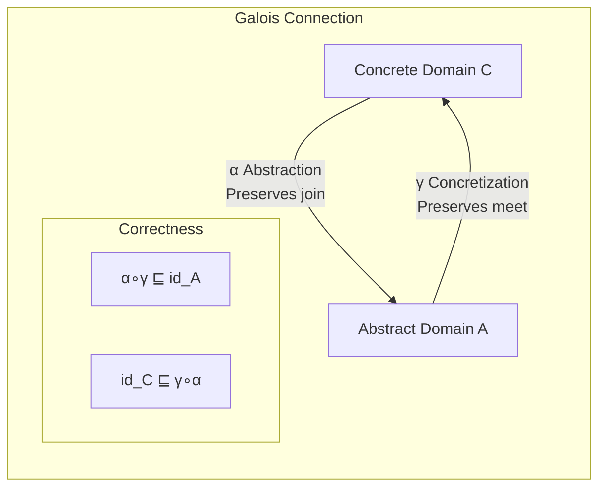
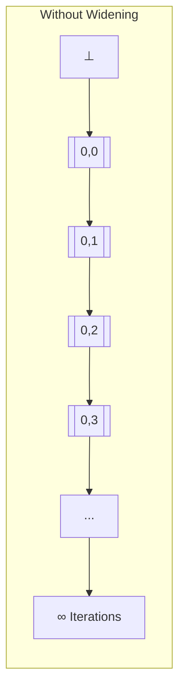
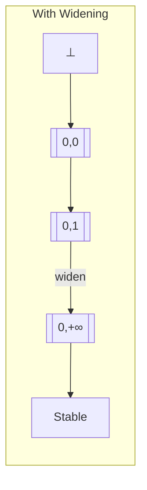
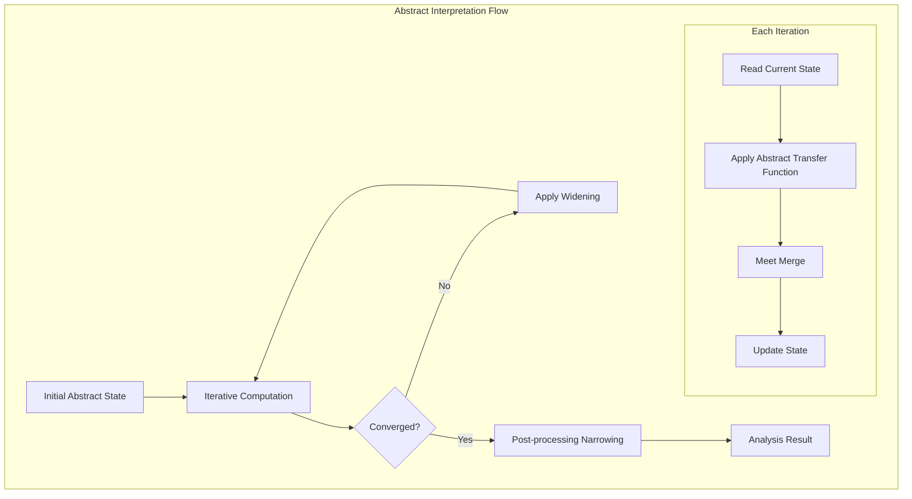
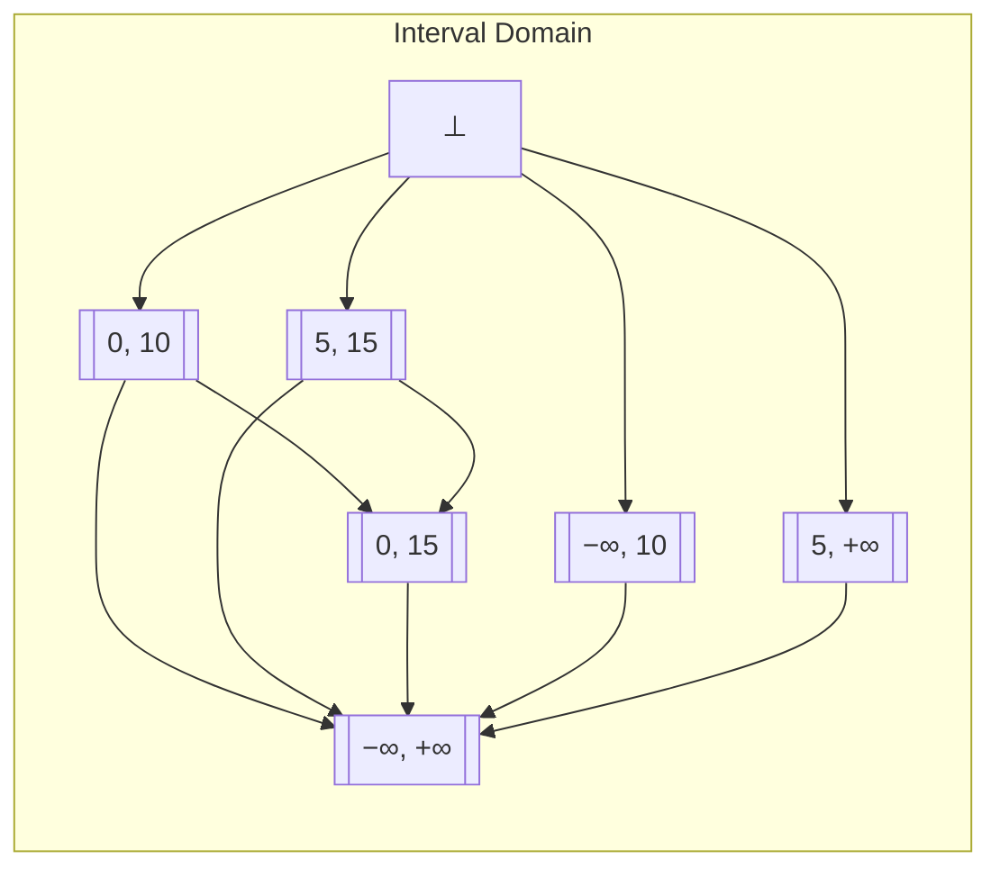

# Abstract Interpretation Theory

> **Stage**: 03-model-taxonomy/02-computation-models | **Prerequisites**: [01-order-theory.md](../../01-foundations/01-order-theory.md), [dataflow-analysis-formal.md](../../03-model-taxonomy/02-computation-models/dataflow-analysis-formal.md) | **Formalization Level**: L5-L6

## 1. Definitions

### 1.1 Galois Connection

**Def-F-AI-01: Galois Connection**

Let $(C, \sqsubseteq_C)$ and $(A, \sqsubseteq_A)$ be two posets. The function pair $(\alpha, \gamma)$ forms a Galois connection, denoted:
$$(C, \sqsubseteq_C) \xtofrom[\gamma]{\alpha} (A, \sqsubseteq_A)$$

if and only if one of the following equivalent conditions holds:

1. **Primary Definition**: $\forall c \in C, a \in A: \alpha(c) \sqsubseteq_A a \Leftrightarrow c \sqsubseteq_C \gamma(a)$
2. **Adjunction Property**: $\alpha$ and $\gamma$ are both monotonic, and $\alpha \circ \gamma \sqsubseteq \text{id}_A$, $\text{id}_C \sqsubseteq \gamma \circ \alpha$
3. **Abstraction is Optimal Upper Approximation**: $\alpha(c) = \sqcap\{a \in A \mid c \sqsubseteq \gamma(a)\}$
4. **Concretization is Optimal Lower Approximation**: $\gamma(a) = \sqcup\{c \in C \mid \alpha(c) \sqsubseteq a\}$

**Def-F-AI-02: Galois Insertion**

When $\alpha \circ \gamma = \text{id}_A$, it is called a Galois insertion, where the abstract domain has no redundancy:
$$\forall a \in A: \alpha(\gamma(a)) = a$$

**Def-F-AI-03: Composition of Galois Connections**

Given two Galois connections:
$$(C) \xtofrom[\gamma_1]{\alpha_1} (A_1) \xtofrom[\gamma_2]{\alpha_2} (A_2)$$

Their composition is:
$$(C) \xtofrom[\gamma_1 \circ \gamma_2]{\alpha_2 \circ \alpha_1} (A_2)$$

### 1.2 Abstract Domain Design

**Def-F-AI-04: Abstract Domain**

An abstract domain is a quadruple $(A, \sqsubseteq_A, \bot_A, \top_A)$, where:

- $A$: set of abstract values
- $\sqsubseteq_A$: partial order relation (information order)
- $\bot_A$: least element (no information)
- $\top_A$: greatest element (unknown)

**Def-F-AI-05: Common Abstract Domains**

| Abstract Domain | Description | Application |
|-----------------|-------------|-------------|
| Sign Domain | $\{\bot, -, 0, +, \top\}$ | Sign analysis |
| Constant Domain | $\mathbb{C} \cup \{\bot, \top\}$ | Constant propagation |
| Interval Domain | $[l, u]$ where $l, u \in \mathbb{Z} \cup \{-\infty, +\infty\}$ | Range analysis |
| Octagon Domain | $\pm x_i \pm x_j \leq c$ | Relational analysis |
| Polyhedron Domain | Linear inequality constraints | Linear relational analysis |
| Pointer Domain | Points-to sets | Alias analysis |

**Def-F-AI-06: Interval Abstract Domain**

The interval domain is defined as:
$$\text{Interval} = \{[l, u] \mid l \in \mathbb{Z} \cup \{-\infty\}, u \in \mathbb{Z} \cup \{+\infty\}, l \leq u\} \cup \{\bot\}$$

Order relation: $[l_1, u_1] \sqsubseteq [l_2, u_2] \Leftrightarrow l_2 \leq l_1 \land u_1 \leq u_2$

Meet operation: $[l_1, u_1] \sqcap [l_2, u_2] = [\max(l_1, l_2), \min(u_1, u_2)]$ (if valid)

Join operation: $[l_1, u_1] \sqcup [l_2, u_2] = [\min(l_1, l_2), \max(u_1, u_2)]$

### 1.3 Widening and Narrowing

**Def-F-AI-07: Widening Operator ($\nabla$)**

The widening operator $\nabla: A \times A \to A$ satisfies:

1. **Extensivity**: $\forall a, b: a \sqsubseteq a \nabla b$ and $b \sqsubseteq a \nabla b$
2. **Termination**: For any increasing sequence $(a_n)$, the sequence $b_0 = a_0$, $b_{n+1} = b_n \nabla a_{n+1}$ stabilizes in finite steps

**Def-F-AI-08: Standard Interval Widening**

For the interval domain, standard widening:
$$[l_1, u_1] \nabla [l_2, u_2] = [\text{widen}_L(l_1, l_2), \text{widen}_U(u_1, u_2)]$$

where:
$$\text{widen}_L(l_1, l_2) = \begin{cases} l_1 & \text{if } l_1 \leq l_2 \\ -\infty & \text{if } l_2 < l_1 \end{cases}$$

$$\text{widen}_U(u_1, u_2) = \begin{cases} u_1 & \text{if } u_2 \leq u_1 \\ +\infty & \text{if } u_1 < u_2 \end{cases}$$

**Def-F-AI-09: Narrowing Operator ($\Delta$)**

The narrowing operator $\Delta: A \times A \to A$ satisfies:

1. **Intensivity**: $\forall a, b: a \Delta b \sqsubseteq a$
2. **Preservation**: If $b \sqsubseteq a$, then $a \Delta b \sqsupseteq b$
3. **Termination**: Stabilizes for decreasing sequences

**Def-F-AI-10: Standard Interval Narrowing**

$$[l_1, u_1] \Delta [l_2, u_2] = [\text{narrow}_L(l_1, l_2), \text{narrow}_U(u_1, u_2)]$$

where:
$$\text{narrow}_L(l_1, l_2) = \begin{cases} l_2 & \text{if } l_1 = -\infty \\ l_1 & \text{otherwise} \end{cases}$$

$$\text{narrow}_U(u_1, u_2) = \begin{cases} u_2 & \text{if } u_1 = +\infty \\ u_1 & \text{otherwise} \end{cases}$$

### 1.4 Soundness of Abstract Interpretation

**Def-F-AI-11: Best Abstract**

A function $f^\#: A \to A$ is the **best abstraction** of $f: C \to C$ if and only if:
$$f^\# = \alpha \circ f \circ \gamma$$

**Def-F-AI-12: Correct Abstract**

$f^\#$ is a **correct abstraction** of $f$ if and only if:
$$\alpha \circ f \sqsubseteq f^\# \circ \alpha$$

or equivalently:
$$f \circ \gamma \sqsubseteq \gamma \circ f^\#$$

**Def-F-AI-13: Computational Abstract**

Three elements of abstract interpretation:

1. **Value abstraction**: $\alpha_V: \text{concrete values} \to \text{abstract values}$
2. **Operation abstraction**: Each concrete operation $op$ has an abstract version $op^\#$
3. **Control flow abstraction**: Abstraction of loops, conditionals, and other control structures

## 2. Properties

### 2.1 Basic Properties of Galois Connections

**Lemma-F-AI-01: Basic Properties of Galois Connections**

For Galois connection $(C) \xtofrom[\gamma]{\alpha} (A)$:

1. $\alpha$ preserves least upper bounds (join): $\alpha(\sqcup_C S) = \sqcup_A \{\alpha(c) \mid c \in S\}$
2. $\gamma$ preserves greatest lower bounds (meet): $\gamma(\sqcap_A T) = \sqcap_C \{\gamma(a) \mid a \in T\}$
3. $\alpha$ is surjective $\Leftrightarrow$ $\gamma$ is injective $\Leftrightarrow$ is a Galois insertion

*Proof Sketch*: Derived directly from the definition and adjunction property of Galois connections. ∎

**Lemma-F-AI-02: Uniqueness of Abstract Functions**

Given $\alpha$, the corresponding $\gamma$ is unique:
$$\gamma(a) = \sqcup\{c \in C \mid \alpha(c) \sqsubseteq a\}$$

Similarly, given $\gamma$, $\alpha$ is also unique.

### 2.2 Correctness of Abstract Interpretation

**Lemma-F-AI-03: Correctness of Best Abstraction**

The best abstraction $f^\# = \alpha \circ f \circ \gamma$ is always correct.

*Proof*:
$$\alpha \circ f \sqsubseteq \alpha \circ f \circ \gamma \circ \alpha = f^\# \circ \alpha$$

From $\text{id} \sqsubseteq \gamma \circ \alpha$. ∎

**Prop-F-AI-01: Transitivity of Correct Abstraction**

If $f^\#$ correctly abstracts $f$, and $g^\#$ correctly abstracts $g$, then $g^\# \circ f^\#$ correctly abstracts $g \circ f$.

### 2.3 Properties of Widening

**Lemma-F-AI-04: Widening Guarantees Convergence**

For any increasing sequence $a_0 \sqsubseteq a_1 \sqsubseteq \cdots$, the sequence constructed by widening:
$$b_0 = a_0, \quad b_{n+1} = b_n \nabla a_{n+1}$$

stabilizes in finite steps.

**Prop-F-AI-02: Over-approximation Introduced by Widening**

Widening may introduce over-approximation:
$$\text{lfp}(f) \sqsubseteq \text{lfp}_\nabla(f^\#)$$

where $\text{lfp}_\nabla$ denotes the fixed point computed using widening.

### 2.4 Precision Comparison of Abstract Domains

**Prop-F-AI-03: Precision Hierarchy of Abstract Domains**

Precision relationships among different abstract domains:

$$\text{Sign} \prec \text{Constant} \prec \text{Interval} \prec \text{Octagon} \prec \text{Polyhedron} \prec \text{Congruence}$$

where $\prec$ denotes "coarser than".

**Prop-F-AI-04: Precision-Efficiency Trade-off**

| Abstract Domain | Precision | Computational Complexity | Application Scenario |
|-----------------|-----------|-------------------------|----------------------|
| Sign Domain | Low | O(1) | Fast coarse analysis |
| Interval Domain | Medium | O(n) | Array bounds checking |
| Octagon Domain | Medium-High | O(n²) | Simple relational analysis |
| Polyhedron Domain | High | Exponential | Precise linear relations |

## 3. Relations

### 3.1 Abstract Interpretation and Dataflow Analysis

**Prop-F-AI-05: Dataflow Analysis as a Special Case of Abstract Interpretation**

Dataflow analysis framework:

- Concrete domain: powerset of program state sets
- Abstract domain: dataflow lattice $L$
- Abstraction: aggregating equivalent states
- Merge: abstraction of path aggregation

### 3.2 Abstract Interpretation and Type Systems

**Prop-F-AI-06: Types as Abstract Interpretation**

| Type System | Abstract Interpretation Correspondence |
|-------------|----------------------------------------|
| Type | Abstract value |
| Type inference | Abstract computation |
| Type checking | Correctness verification |
| Subtyping | Partial order relation |
| Polymorphism | Parametric abstraction |

### 3.3 Relations Among Different Abstract Domains

**Prop-F-AI-07: Reduced Product of Abstract Domains**

Given abstract domains $A_1$ and $A_2$, their reduced product $A_1 \times_r A_2$ is:

$$A_1 \times_r A_2 = \{(a_1, a_2) \mid \gamma_1(a_1) \cap \gamma_2(a_2) \neq \emptyset\}$$

The reduction operation eliminates inconsistent combinations.

### 3.4 Applications of Abstract Interpretation in Verification

| Application Domain | Abstract Domain Used | Tools |
|-------------------|----------------------|-------|
| Array bounds checking | Interval domain | Astree |
| Division by zero checking | Interval domain | Polyspace |
| Null pointer checking | Pointer domain | Infer |
| Resource leaks | Linear types | Rust compiler |
| Concurrency safety | Shape analysis | Facebook Infer |

## 4. Argumentation

### 4.1 Why Abstract Interpretation?

**Problem**: Program analysis is generally undecidable (halting problem).

**Solution**: Abstract interpretation provides:

1. **Systematic approximation methods**
2. **Adjustable precision analysis**
3. **Soundness guarantees**

### 4.2 Importance of Galois Connections

**Optimal Approximation**: Galois connections guarantee that abstraction is the optimal upper approximation, and concretization is the optimal lower approximation.

**Composability**: Galois connections can be composed, supporting hierarchical abstraction.

### 4.3 Design Considerations for Widening

**Design Principles**:

1. **Fast convergence**: Reduce number of iterations
2. **Preserve precision**: Avoid excessive over-approximation
3. **Generality**: Applicable to different program patterns

**Common Strategies**:

- Threshold widening: Expand at predefined thresholds
- Delayed widening: Use after several iterations
- Selective widening: Use only at loop headers

### 4.4 Abstract Domain Selection Strategy

**Selection Dimensions**:

1. **Precision requirements**: Properties to be proved
2. **Performance budget**: Time and space constraints
3. **Program characteristics**: Numerical computation, pointer operations, etc.

**Combination Strategies**:

- Use simple abstract domains to quickly eliminate impossible paths
- Use refined abstract domains for critical paths

## 5. Formal Proofs / Engineering Argument

### 5.1 Soundness Theorem of Abstract Interpretation

**Thm-F-AI-01: Soundness of Abstract Interpretation**

Let $(\alpha, \gamma)$ be a Galois connection, and $f^\#$ be a correct abstraction of $f$. Then:
$$\forall c \in C: \alpha(f(c)) \sqsubseteq f^\#(\alpha(c))$$

*Proof*:

From the definition of correct abstraction: $\alpha \circ f \sqsubseteq f^\# \circ \alpha$

For any $c \in C$:
$$\alpha(f(c)) \sqsubseteq f^\#(\alpha(c))$$

This is exactly the soundness condition. ∎

**Corollary**: If $f^\#(a) \sqsubseteq a'$, then $f(\gamma(a)) \sqsubseteq \gamma(a')$.

### 5.2 Termination of Widening

**Thm-F-AI-02: Widening Guarantees Termination**

Let $(A, \sqsubseteq)$ be a complete lattice of finite height or satisfying ACC (ascending chain condition), and $\nabla$ be a widening operator.

For any increasing sequence $a_0 \sqsubseteq a_1 \sqsubseteq \cdots$, construct:
$$b_0 = a_0, \quad b_{n+1} = b_n \nabla a_{n+1}$$

Then there exists $N$ such that $\forall n \geq N: b_n = b_N$.

*Proof Sketch*:

From the termination property of widening, the sequence $(b_n)$ must stabilize.

Standard proof uses transfinite induction:

- If $a_{n+1} \sqsubseteq b_n$, then $b_{n+1} = b_n \nabla a_{n+1} = b_n$
- If $a_{n+1} \not\sqsubseteq b_n$, then $b_n \sqsubset b_{n+1}$
- By ascending chain condition, strictly increasing sequences are finite

∎

### 5.3 Existence of Best Abstraction

**Thm-F-AI-03: Existence of Best Abstraction**

For any concrete function $f: C \to C$ and Galois connection $(\alpha, \gamma)$, the best abstraction:
$$f^\# = \alpha \circ f \circ \gamma$$

exists and is unique.

*Proof*:

**Existence**: Defined by function composition.

**Uniqueness**: Suppose $g^\#$ is also a best abstraction, then:
$$g^\# = \alpha \circ f \circ \gamma = f^\#$$

**Optimality**: For any correct abstraction $h^\#$:
$$f^\# = \alpha \circ f \circ \gamma \sqsubseteq h^\# \circ \alpha \circ \gamma \sqsubseteq h^\#$$

∎

### 5.4 Soundness of Interval Analysis

**Thm-F-AI-04: Soundness of Interval Analysis**

Interval abstraction is sound: if interval analysis infers variable $x$ has value $[l, u]$, then the actual runtime value $v$ of $x$ satisfies $l \leq v \leq u$.

*Proof Sketch*:

Verify for basic operations:

1. **Constant**: $\alpha(c) = [c, c]$
2. **Addition**: $[l_1, u_1] +^\# [l_2, u_2] = [l_1 + l_2, u_1 + u_2]$
   - If $v_1 \in [l_1, u_1]$, $v_2 \in [l_2, u_2]$, then $v_1 + v_2 \in [l_1 + l_2, u_1 + u_2]$
3. **Multiplication**: Consider sign cases

By induction, all operations preserve soundness. ∎

## 6. Examples

### 6.1 Sign Abstraction Example

**Sign Domain**: $\{\bot, -, 0, +, \top\}$

Abstraction:

```
α(n) = ⊥  if n is undefined
α(n) = -  if n < 0
α(n) = 0  if n = 0
α(n) = +  if n > 0
α(n) = ⊤  if unknown
```

**Operation Abstraction** (Addition):

```
- + - = -
- + 0 = -
- + + = ⊤
0 + x = x
...
```

### 6.2 Interval Analysis Example

```
1: x = [0, 0]
2: y = [10, 10]
3: while (x < y)
4:   x = x + 1
5: return x
```

Iteration process:

| Iteration | x (loop entry) | x (loop exit) |
|-----------|----------------|---------------|
| 0 | ⊥ | ⊥ |
| 1 | [0, 0] | [1, 1] |
| 2 | [0, 1] | [1, 2] |
| ... | ... | ... |
| ∞ | [0, 10] | [1, 11] |

Using Widening accelerates convergence to [0, +∞].

### 6.3 Widening Application Example

**Without Widening**:

```
x = 0
while (true):
  x = x + 1
```

Iterations: [0,0], [0,1], [0,2], [0,3], ... never converges

**Using Widening**:

```
b₀ = [0, 0]
b₁ = [0, 0] ∇ [0, 1] = [0, 1]
b₂ = [0, 1] ∇ [0, 2] = [0, 2]
     = [0, +∞)  (upper bound widens to +∞)
```

Converges to [0, +∞] in two steps.

### 6.4 Array Bounds Checking Example

```c
void process(int n) {
  int arr[100];
  for (int i = 0; i < n; i++) {
    arr[i] = i;  // Need to prove i ∈ [0, 99]
  }
}
```

Interval analysis:

- $i$ at loop entry: [0, n-1]
- Range of $n$: if $n \leq 100$, then safe
- Analysis can infer: if $n \leq 100$, no out-of-bounds

### 6.5 Multiple Abstract Domain Combination Example

```
Use sign domain for quick judgment: x is positive
Use interval domain for precise calculation: x ∈ [10, 100]
Use octagon domain to infer relations: x - y ≤ 5
```

Combined result: $x \in [10, 100]$, $x > 0$, $y \geq x - 5$

## 7. Visualizations

### Galois Connection Structure



### Abstract Domain Precision Hierarchy

```mermaid
graph BT
    subgraph Abstract Domain Precision Hierarchy
    Sign[Sign Domain<br/>{-,0,+}]
    Const[Constant Domain<br/>{c₁,c₂,...}]
    Interval[Interval Domain<br/>[l,u]]
    Octagon[Octagon Domain<br/>±xᵢ±xⱼ≤c]
    Poly[Polyhedron Domain<br/>Linear Constraints]

    Sign --> Const
    Const --> Interval
    Interval --> Octagon
    Octagon --> Poly
    end
```

### Widening Effect Diagram





### Abstract Interpretation Computation Flow



### Interval Domain Structure



## 8. References


---

*Document Version: v1.0 | Created: 2026-04-10 | Last Updated: 2026-04-10*
