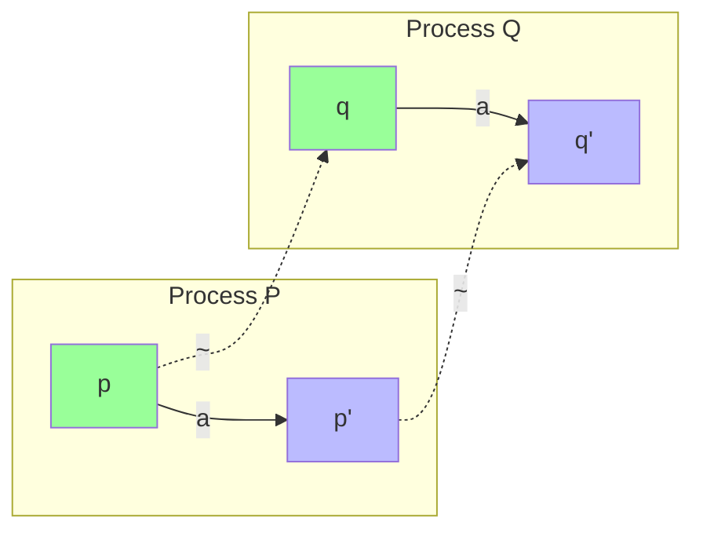
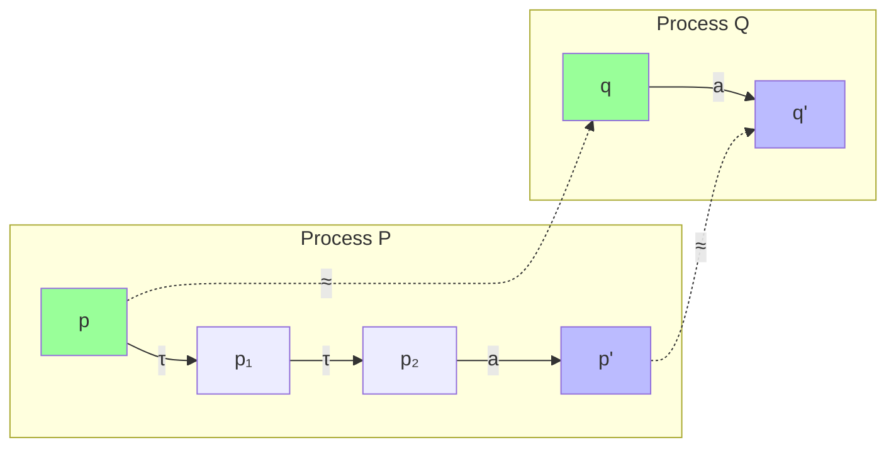
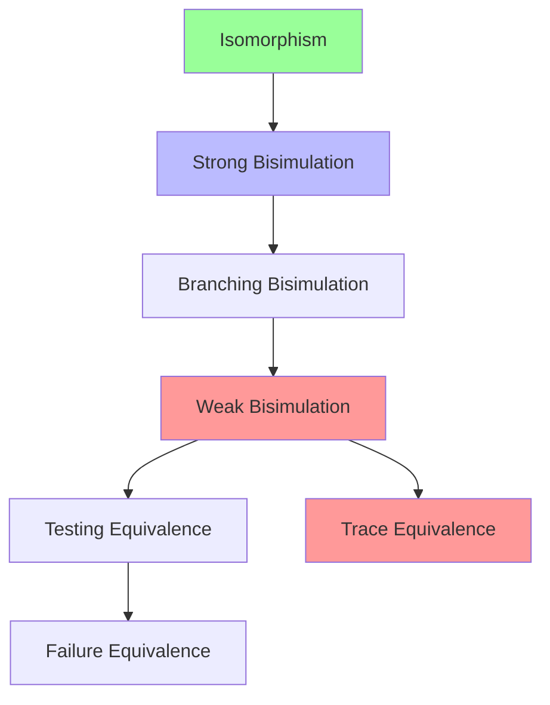
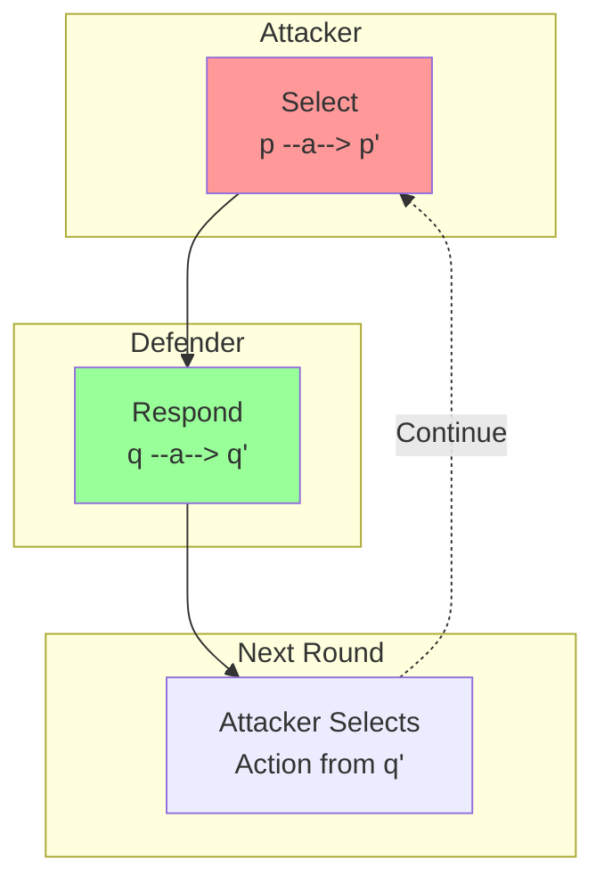
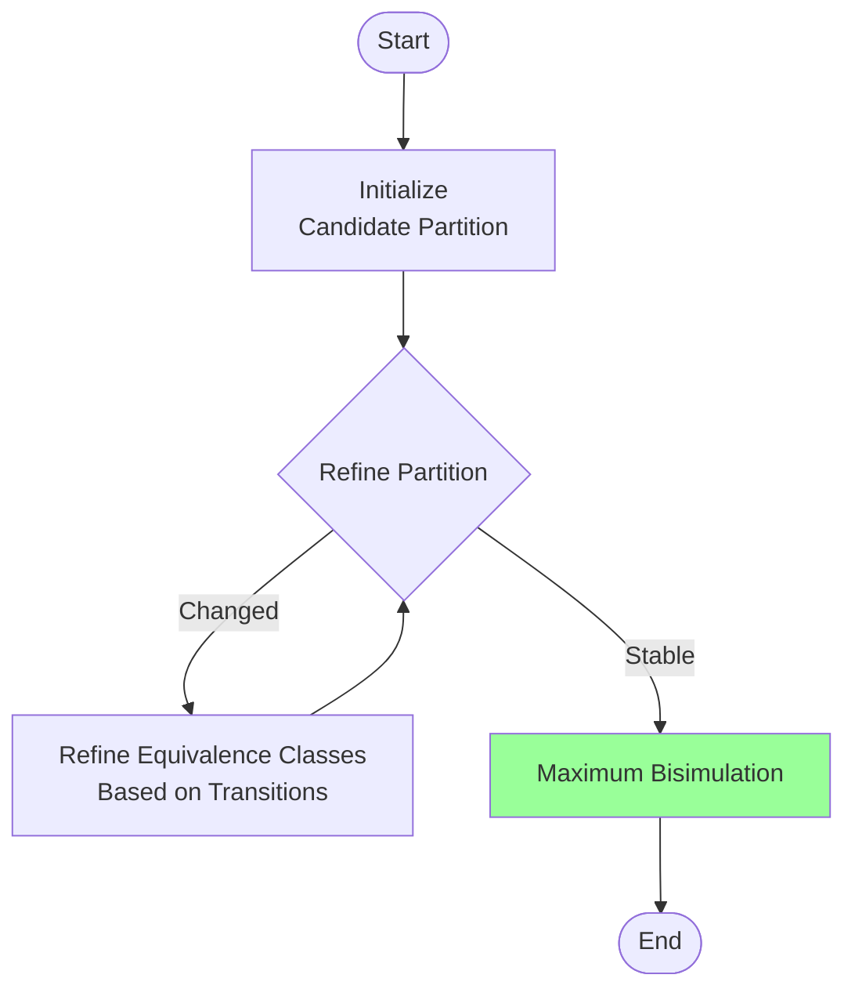
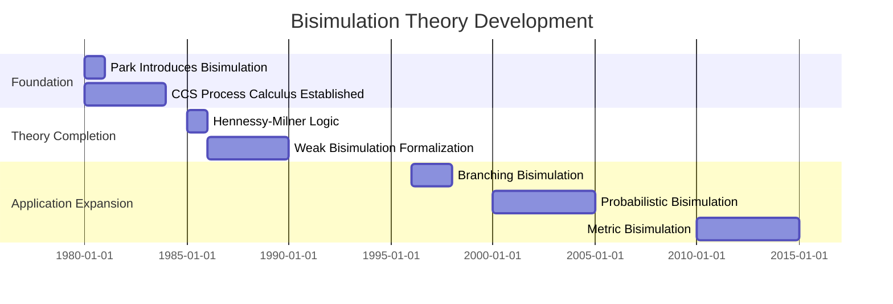
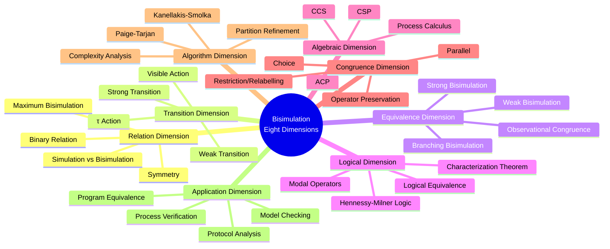

# Bisimulation

> **Stage**: Struct | **Prerequisites**: [Process Calculus](../../99-references/by-topic/process-algebra.md), [Labeled Transition System](../01-foundations/lts.md) | **Formalization Level**: L5

---

## 1. Definitions

### 1.1 Wikipedia Standard Definition

**English Definition** (Wikipedia):
> *In theoretical computer science a bisimulation is a binary relation between state transition systems, associating systems that behave in the same way in the sense that one system simulates the other and vice versa. Bisimulation is an important concept in concurrency theory and model checking.*

**Chinese Definition** (Wikipedia):
> *Bisimulation is a binary relation between state transition systems in theoretical computer science, associating systems with identical behavior where one system simulates the other and vice versa. Bisimulation is an important concept in concurrency theory and model checking.*

---

### 1.2 Formal Definitions

#### Def-S-BIS-01: Labeled Transition System (LTS)

**Definition**: A Labeled Transition System (LTS) is a triple $\mathcal{L} = (S, Act, \rightarrow)$, where:

- $S$: non-empty set of states
- $Act$: set of actions (labels)
- $\rightarrow \subseteq S \times Act \times S$: transition relation, denoted $s \xrightarrow{a} s'$

$$\text{Def-S-BIS-01}: \mathcal{L} = (S, Act, \rightarrow)$$

---

#### Def-S-BIS-02: Strong Bisimulation

**Definition** (Park 1980): Given LTS $\mathcal{L} = (S, Act, \rightarrow)$, a relation $\mathcal{R} \subseteq S \times S$ is a strong bisimulation if and only if:

If $(p, q) \in \mathcal{R}$, then for all $a \in Act$:

1. **Forward Condition**: If $p \xrightarrow{a} p'$, then there exists $q'$ such that $q \xrightarrow{a} q'$ and $(p', q') \in \mathcal{R}$
2. **Backward Condition**: If $q \xrightarrow{a} q'$, then there exists $p'$ such that $p \xrightarrow{a} p'$ and $(p', q') \in \mathcal{R}$

**Strong Bisimulation Equivalence** $\sim$:
$$p \sim q \iff \exists \mathcal{R}: \mathcal{R} \text{ is a strong bisimulation and } (p, q) \in \mathcal{R}$$

---

#### Def-S-BIS-03: Weak Bisimulation

**Definition**: A relation $\mathcal{R}$ is a weak bisimulation if and only if when $(p, q) \in \mathcal{R}$, then for all $a \in Act$:

1. If $p \xrightarrow{a} p'$, then there exists $q'$ such that $q \xRightarrow{a} q'$ and $(p', q') \in \mathcal{R}$
2. If $q \xrightarrow{a} q'$, then there exists $p'$ such that $p \xRightarrow{a} p'$ and $(p', q') \in \mathcal{R}$

where $\xRightarrow{a}$ denotes weak transition:

- $\xRightarrow{\tau} = (\xrightarrow{\tau})^*$ (any number of internal actions)
- $\xRightarrow{a} = (\xrightarrow{\tau})^* \xrightarrow{a} (\xrightarrow{\tau})^*$ ($a \neq \tau$)

**Weak Bisimulation Equivalence** $\approx$:
$$p \approx q \iff \exists \mathcal{R}: \mathcal{R} \text{ is a weak bisimulation and } (p, q) \in \mathcal{R}$$

---

#### Def-S-BIS-04: Branching Bisimulation

**Definition** (van Glabbeek & Weijland): A relation $\mathcal{R}$ is a branching bisimulation if and only if when $(p, q) \in \mathcal{R}$ and $p \xrightarrow{a} p'$, then:

- Either $a = \tau$ and $(p', q) \in \mathcal{R}$
- Or there exist $q', q''$ such that $q \xRightarrow{\tau} q'' \xrightarrow{a} q'$, $(p, q'') \in \mathcal{R}$, and $(p', q') \in \mathcal{R}$

(Requires that intermediate states during matching are also related to the original state)

---

#### Def-S-BIS-05: Hennessy-Milner Logic

**Definition**: Formulas $\phi$ of Hennessy-Milner (HM) logic are defined as:

$$\phi ::= \top \mid \neg\phi \mid \phi \land \phi \mid \langle a \rangle \phi$$

where $\langle a \rangle \phi$ means "there exists an $a$-transition to a state satisfying $\phi$".

**Semantics**:

- $s \models \langle a \rangle \phi \iff \exists s': s \xrightarrow{a} s' \land s' \models \phi$
- Dual operator: $[a]\phi \equiv \neg\langle a \rangle\neg\phi$

---

## 2. Properties

### 2.1 Basic Properties of Bisimulation

#### Lemma-S-BIS-01: Strong Bisimulation is an Equivalence Relation

**Lemma**: $\sim$ is reflexive, symmetric, and transitive.

**Proof**:

- **Reflexive**: The identity relation $\{(s, s) \mid s \in S\}$ is a bisimulation
- **Symmetric**: Directly from the symmetry of conditions in the definition
- **Transitive**: If $\mathcal{R}_1, \mathcal{R}_2$ are bisimulations, then their composition $\mathcal{R}_1 \circ \mathcal{R}_2$ is also a bisimulation ∎

---

#### Lemma-S-BIS-02: Existence of Maximum Bisimulation

**Lemma**: $\sim = \bigcup\{\mathcal{R} \mid \mathcal{R} \text{ is a strong bisimulation}\}$ is the maximum strong bisimulation.

**Proof**: The arbitrary union of bisimulations is still a bisimulation (verify definition conditions). ∎

---

#### Lemma-S-BIS-03: Transitivity of Weak Bisimulation

**Lemma**: Weak bisimulation $\approx$ is also an equivalence relation.

**Note**: The proof is more complex than strong bisimulation, as the composition of weak transitions requires careful handling. ∎

---

### 2.2 Congruence Lemmas

#### Lemma-S-BIS-04: Congruence of Strong Bisimulation

**Lemma**: Strong bisimulation is a congruence for CCS operators:

- If $p \sim q$, then $p + r \sim q + r$
- If $p \sim q$, then $p \mid r \sim q \mid r$
- If $p \sim q$, then $\alpha.p \sim \alpha.q$
- If $p \sim q$, then $p[f] \sim q[f]$ (relabelling)
- If $p \sim q$, then $p \backslash L \sim q \backslash L$ (restriction)

---

## 3. Relations

### 3.1 Bisimulation and Other Equivalence Relations

| Equivalence Relation | Strength | Characteristics |
|---------------------|----------|-----------------|
| Isomorphism $\cong$ | Strongest | Identical structure |
| Strong Bisimulation $\sim$ | Very Strong | Step-by-step exact matching |
| Branching Bisimulation | Strong | Preserves branching structure |
| Weak Bisimulation $\approx$ | Medium | Ignores $\tau$ actions |
| Testing Equivalence | Weak | Distinguished by tests |
| Trace Equivalence | Weaker | Only compares action sequences |
| Failure Equivalence | Even Weaker | Considers refusal sets |
| Observation Equivalence | Weak | Observer's perspective |

**Hierarchy Relation**:
$$p \cong q \implies p \sim q \implies p \approx_b q \implies p \approx q \implies p \sim_t q$$

---

### 3.2 Relation with Modal Logic

#### Prop-S-BIS-01: Hennessy-Milner Theorem

**Proposition**: For finitely branching LTS,

$$p \sim q \iff \forall \phi \in \text{HM}: (p \models \phi \leftrightarrow q \models \phi)$$

That is: strong bisimulation equivalence is equivalent to satisfying the same HM formulas.

---

### 3.3 Relation with Coalgebra

#### Prop-S-BIS-02: Bisimulation as Coalgebra Homomorphism

**Proposition**: In the categorical context, strong bisimulation corresponds to a span between coalgebras of the functor $F(X) = \mathcal{P}(Act \times X)$.

---

## 4. Argumentation

### 4.1 Bisimulation vs Trace Equivalence

#### Argument: Why Bisimulation is More Refined than Trace Equivalence

**Trace Equivalence**: $p \sim_t q$ if and only if $p$ and $q$ produce the same set of action sequences.

**Counterexample**:

- $p = a.b + a.c$
- $q = a.(b + c)$

Both have trace set $\{\varepsilon, a, ab, ac\}$, hence trace equivalent.

**But**:

- $p$ faces a branching choice after $a$
- $q$ makes the choice after $a$

**Bisimulation distinguishes**:

- $p \xrightarrow{a} b$ must be matched by $q$
- $q \xrightarrow{a} b+c$, but $b \not\sim b+c$ (because $b+c \xrightarrow{c}$ while $b$ cannot)

Therefore $p \not\sim q$.

---

### 4.2 Justification of Weak Bisimulation

**Motivation**: Internal actions $\tau$ should not be directly visible to external observers.

**Problem**: Simply ignoring $\tau$ leads to overly coarse equivalence.

**Solution**: Branching bisimulation preserves that "states passed through when making choices" are also equivalent.

---

## 5. Formal Proofs

### 5.1 Theorem: Hennessy-Milner Characterization Theorem

#### Thm-S-BIS-01: Modal Characterization Theorem

**Theorem** (Hennessy & Milner, 1985): For finitely branching LTS (no infinite paths or finite branching):

$$p \sim q \iff \forall \phi \in \text{HM}: p \models \phi \leftrightarrow q \models \phi$$

**Proof**:

**($\Rightarrow$) Direction**: If $p \sim q$, then for any HM formula $\phi$, $p \models \phi \iff q \models \phi$

Structural induction on $\phi$:

- $\top$: Trivial
- $\phi_1 \land \phi_2$: By induction hypothesis
- $\neg\phi$: By induction hypothesis
- $\langle a \rangle \phi$: If $p \models \langle a \rangle \phi$, then $\exists p': p \xrightarrow{a} p' \land p' \models \phi$
  - By $p \sim q$, $\exists q': q \xrightarrow{a} q' \land p' \sim q'$
  - By induction hypothesis: $q' \models \phi$
  - Therefore $q \models \langle a \rangle \phi$

**($\Leftarrow$) Direction**: If $p$ and $q$ satisfy the same HM formulas, then $p \sim q$

Construct relation:
$$\mathcal{R} = \{(s, t) \mid \forall \phi: s \models \phi \leftrightarrow t \models \phi\}$$

Prove $\mathcal{R}$ is a strong bisimulation:

Assume $(p, q) \in \mathcal{R}$ and $p \xrightarrow{a} p'$.

**Assertion**: There exists $q'$ such that $q \xrightarrow{a} q'$ and $(p', q') \in \mathcal{R}$.

**Proof by contradiction**: Assume no such $q'$ exists.

For each $q_i$ satisfying $q \xrightarrow{a} q_i$:

- Since $(p', q_i) \notin \mathcal{R}$, there exists formula $\phi_i$ such that $p' \models \phi_i$ but $q_i \not\models \phi_i$
- (Or vice versa, handle symmetrically)

Let $\phi = \bigwedge_i \phi_i$ (finite branching guarantees finite conjunction)

Then:

- $p \models \langle a \rangle \phi$ (through $p'$)
- But for all $q_i$, $q_i \not\models \phi$, so $q \not\models \langle a \rangle \phi$

This contradicts $(p, q) \in \mathcal{R}$!

Therefore $\mathcal{R}$ is a strong bisimulation, and $(p, q) \in \mathcal{R} \implies p \sim q$. ∎

---

### 5.2 Theorem: Congruence Theorem for Strong Bisimulation

#### Thm-S-BIS-02: Congruence for CCS Operators

**Theorem**: Strong bisimulation $\sim$ is a congruence for all CCS operators.

**Proof** (Key operators):

**Choice Operator $+$**:

If $p \sim q$, need to prove $p + r \sim q + r$.

Construct: $\mathcal{R} = \{(p + r, q + r) \mid p \sim q\} \cup \sim$

Verify bisimulation conditions:

- If $p + r \xrightarrow{a} s$, case analysis:
  - $p \xrightarrow{a} s$: By $p \sim q$, $\exists q': q \xrightarrow{a} q' \land s \sim q'$
    - Therefore $q + r \xrightarrow{a} q'$ and $(s, q') \in \mathcal{R}$
  - $r \xrightarrow{a} s$: Then $q + r \xrightarrow{a} s$, and $(s, s) \in \mathcal{R}$

**Parallel Composition $|$**:

If $p \sim q$, need to prove $p \mid r \sim q \mid r$.

Construct: $\mathcal{R} = \{(p \mid r, q \mid r) \mid p \sim q\} \cup \sim$

Verify involving multiple transition types (left component, right component, synchronization), each using $p \sim q$ to find matching transitions.

**Restriction $\backslash L$** and **Relabelling $[f]$**: Similar constructions. ∎

---

### 5.3 Theorem: Soundness of Weak Bisimulation

#### Thm-S-BIS-03: Weak Bisimulation Preserves Observational Equivalence

**Theorem**: If $p \approx q$, then $p$ and $q$ are indistinguishable to any environment that only observes visible actions.

**Formalization**: Let $\mathcal{O}$ be the set of observation contexts that only check visible actions,

$$p \approx q \implies \forall O \in \mathcal{O}: O[p] \Downarrow \iff O[q] \Downarrow$$

where $\Downarrow$ denotes success/acceptance.

**Proof Sketch**:

By induction on observation depth, prove $p \approx q$ implies:

1. **Basic Observation**: $p \xRightarrow{a}$ if and only if $q \xRightarrow{a}$
2. **Inductive Step**: If $p \xRightarrow{a} p'$, then $\exists q': q \xRightarrow{a} q' \land p' \approx q'$

Therefore no finite observation sequence can distinguish $p$ and $q$. ∎

---

## 6. Examples

### 6.1 CCS Process Bisimulation Verification

**Process Definitions**:

- $p = a.b + a.c$
- $q = a.(b + c)$

**Verification of $p \not\sim q$**:

1. Assume $\mathcal{R}$ is a bisimulation containing $(p, q)$
2. $p \xrightarrow{a} b$
3. $q$ must respond with $a$: $q \xrightarrow{a} b+c$
4. Need $(b, b+c) \in \mathcal{R}$
5. But $b+c \xrightarrow{c}$ while $b$ cannot
6. Contradiction! Hence $p \not\sim q$

---

### 6.2 Bisimulation of Buffers

**Single-slot Buffer**:

```
B1 = in.out.B1
```

**Double-slot Buffer**:

```
B2 = in.B2'
B2' = in.out.B2'' + out.in.out.B2''
B2'' = out.B2'
```

**Verification**: $B1 \not\sim B2$ (different capacity)

But they may be weakly bisimilar under appropriate abstraction.

---

### 6.3 Peterson's Mutual Exclusion Algorithm

**Verification Goal**: Prove mutual exclusion property of two processes

**Method**:

1. Construct LTS model of Peterson's algorithm
2. Define specification process (ideal mutual exclusion behavior)
3. Prove the two are bisimilar

---

## 7. Visualizations

### 7.1 Strong Bisimulation Diagram



### 7.2 Weak Bisimulation (Hiding τ)



### 7.3 Equivalence Relation Hierarchy



### 7.4 Bisimulation Game



### 7.5 CCS Operator Congruence

```mermaid
graph TB
    subgraph "Choice +"
        P1[p ~ q]
        P2[p + r ~ q + r]
    end

    subgraph "Parallel |"
        Q1[p ~ q]
        Q2[p | r ~ q | r]
    end

    subgraph "Restriction \\L"
        R1[p ~ q]
        R2[p \\ L ~ q \\ L]
    end

    subgraph "Prefix a."
        S1[p ~ q]
        S2[a.p ~ a.q]
    end

    style P2 fill:#bbf
    style Q2 fill:#bbf
    style R2 fill:#bbf
    style S2 fill:#bbf
```

### 7.6 Bisimulation Checking Algorithm Flow



### 7.7 Development Timeline



### 7.8 Eight-Dimensional Characterization



---

## 8. References


---

*Document Version: v1.0 | Created: 2026-04-10 | Last Updated: 2026-04-10*
