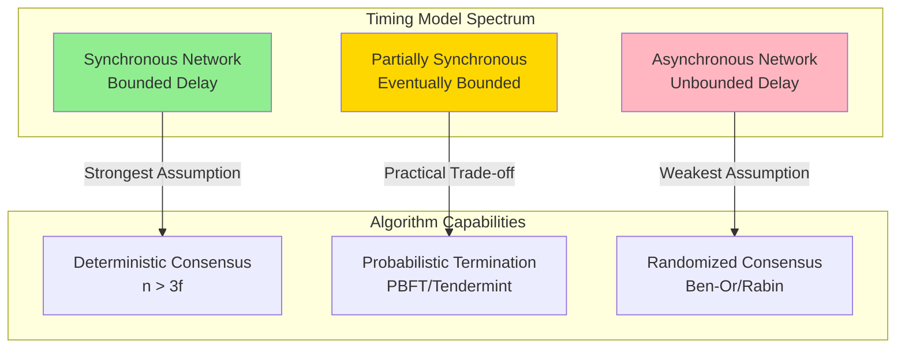
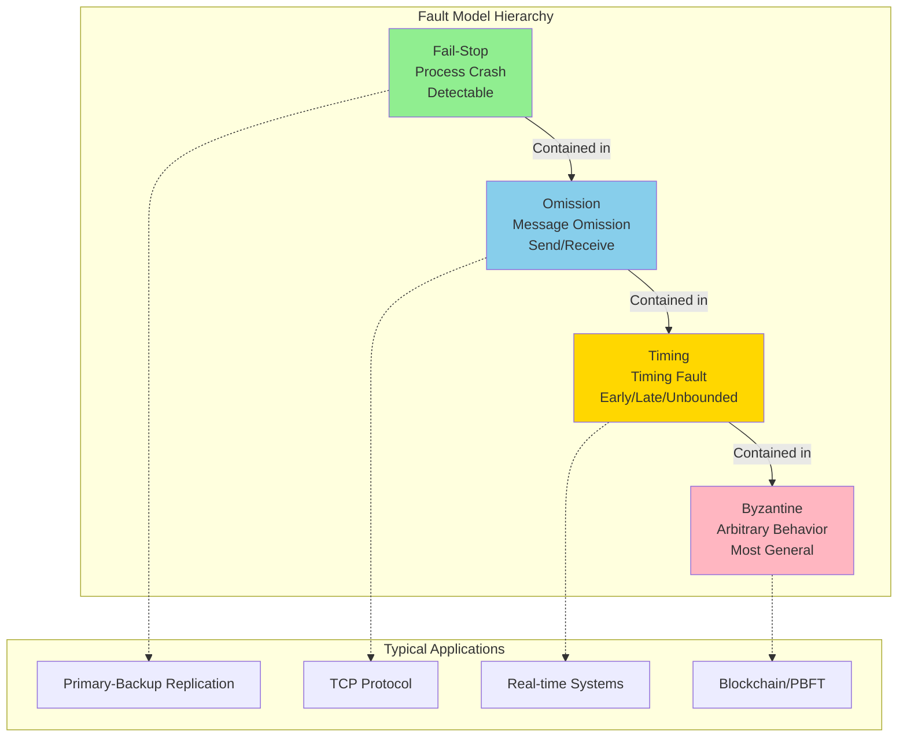
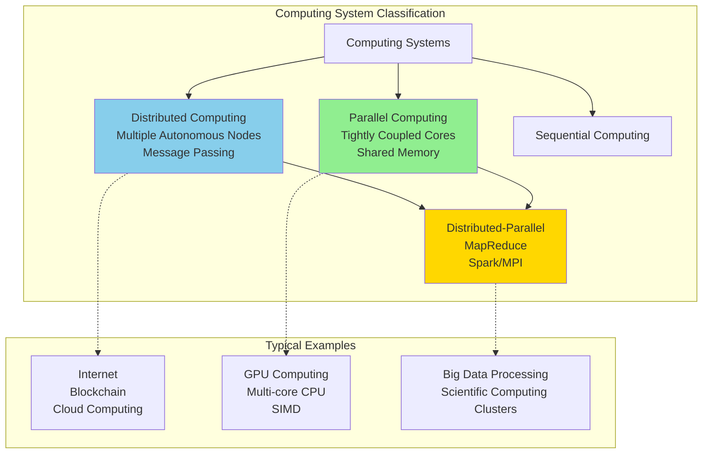
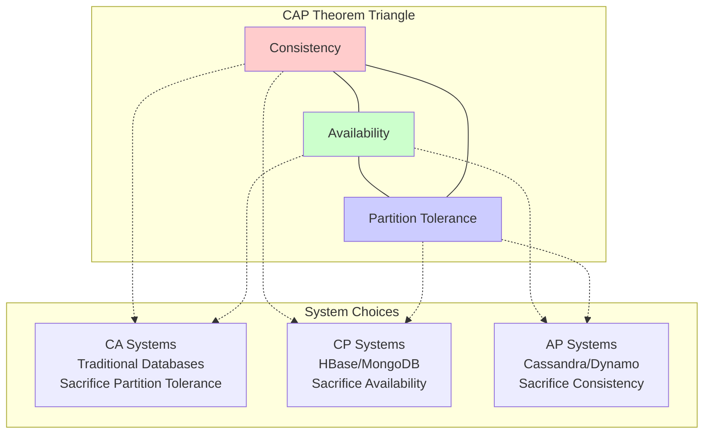
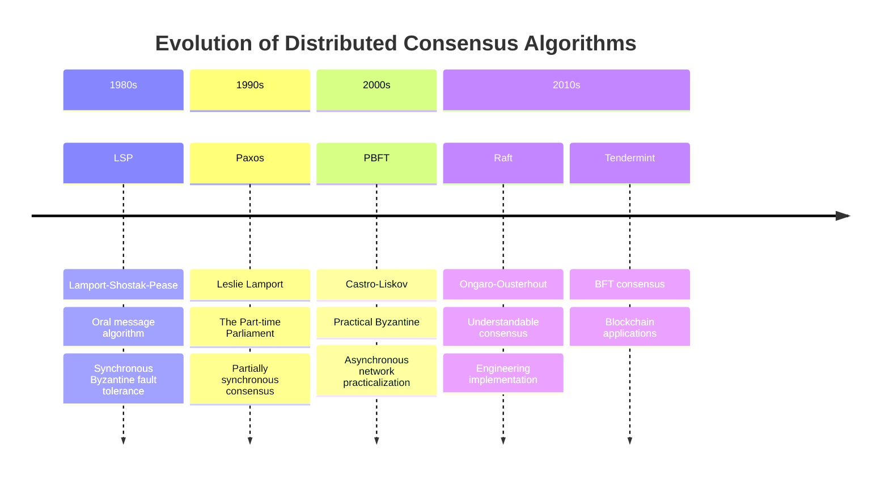
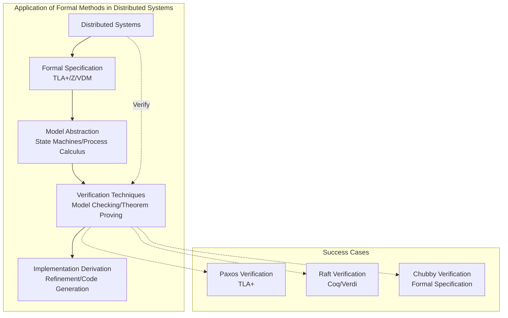
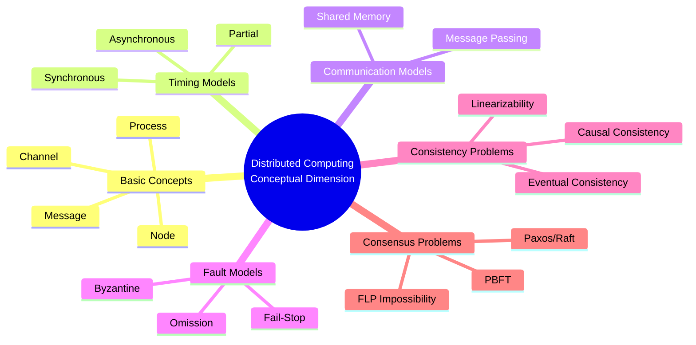
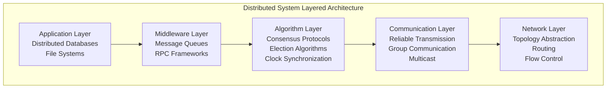
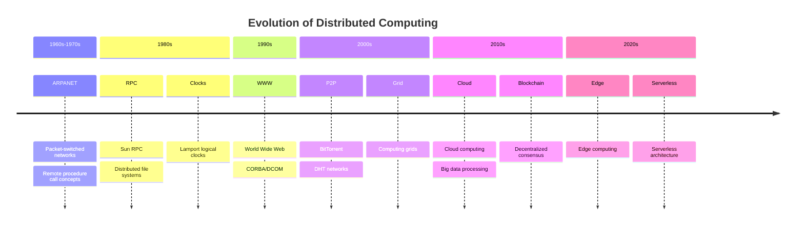

# Distributed Computing

> **Wikipedia Standard Definition**: Distributed computing is a field of computer science that studies distributed systems, which are systems whose components are located on different networked computers that communicate and coordinate their actions by passing messages to one another.
>
> **Source**: <https://en.wikipedia.org/wiki/Distributed_computing>
>
> **Formalization Level**: L3-L4 (Core theoretical concepts)

---

## 1. Wikipedia Standard Definition

### English Original

> "Distributed computing is a field of computer science that studies distributed systems. A distributed system is a system whose components are located on different networked computers, which communicate and coordinate their actions by passing messages to one another. The components interact with one another in order to achieve a common goal."

> "Three significant characteristics of distributed systems are: concurrency of components, lack of a global clock, and independent failure of components."

### Chinese Standard Translation

> **Distributed Computing** is a field of computer science that studies **distributed systems**. A distributed system is a system whose components are located on different networked computers, communicating and coordinating their actions by passing messages to one another. These components collaborate to achieve common goals.

> Three significant characteristics of distributed systems are: **concurrency of components**, **lack of a global clock**, and **independent failure of components**.

---

## 2. Formal Models

### 2.1 System Formal Definition

**`Def-DC-01` [Distributed System Formal Definition]**: A distributed system $\mathcal{DS}$ is a septuple:

$$\mathcal{DS} = (N, P, \mathcal{C}, \mathcal{M}, \Delta, \mathcal{T}, \mathcal{F})$$

where:

- $N = \{n_1, n_2, \ldots, n_k\}$: set of network nodes
- $P = \{p_1, p_2, \ldots, p_m\}$: set of processes, each mapped to a node
- $\mathcal{C}$: set of communication channels, $\mathcal{C} \subseteq P \times P$
- $\mathcal{M}$: message space, containing all possible messages
- $\Delta: P \times \mathcal{S} \times \mathcal{M} \to P \times \mathcal{S} \times 2^{\mathcal{M}}$: state transition function
- $\mathcal{T}$: timing model (synchronous/asynchronous/partially synchronous)
- $\mathcal{F}$: fault model classification

### 2.2 Synchronous vs Asynchronous Networks

#### Synchronous Network

**`Def-DC-02` [Synchronous Network Model]**: A synchronous network is driven by **discrete rounds**, satisfying:

$$\forall r \in \mathbb{N}, \exists \Delta_{max} \in \mathbb{R}^+: \text{MessageDelay}(r) \leq \Delta_{max}$$

**Key Characteristics**:

- Global clock or round counter
- Message delay has a determined upper bound $\Delta_{max}$
- All processes execute synchronously at round boundaries
- Deterministic algorithms can be designed

**`Lemma-DC-01` [Synchronous Execution Determinism]**: In synchronous systems, given an initial configuration, the execution sequence is deterministic.

#### Asynchronous Network

**`Def-DC-03` [Asynchronous Network Model]**: An asynchronous network is **event-driven**, satisfying:

$$\forall m \in \mathcal{M}: \text{MessageDelay}(m) \in [0, +\infty)$$

**Key Characteristics**:

- No global clock, only local clocks
- Message delay has **no upper bound** (but is finite)
- Events are partially ordered by Happens-Before relation ($\prec$)
- Execution interleaving is non-deterministic

**`Lemma-DC-02` [Asynchronous Execution Interleaving]**: For $n$ processes each executing $k$ events, the number of valid interleavings is:

$$|\mathcal{I}_{valid}| = \frac{(nk)!}{\prod_{i=1}^{n}(k_i!)} \times \frac{1}{|C|}$$

where $|C|$ is the number of Happens-Before constraints.

#### Partially Synchronous Network

**`Def-DC-04` [Partially Synchronous Model]**: Combines asynchronous safety and synchronous liveness:

$$\mathcal{DS}_{ps} = (\mathcal{DS}_{async}, T_{GST}, \Delta_{unknown})$$

- $T_{GST}$: Global Stabilization Time (unknown)
- $\Delta_{unknown}$: Message delay upper bound (unknown but exists)
- $t < T_{GST}$: Asynchronous behavior, guarantees safety
- $t \geq T_{GST}$: Synchronous behavior, guarantees liveness



### 2.3 Message Passing vs Shared Memory

#### Message Passing Model

**`Def-DC-05` [Message Passing Model]**: Processes communicate through explicit message exchange:

$$\text{send}(p_i, p_j, m) \circ \text{receive}(p_j, p_i, m')$$

**Communication Primitives**:

- **Asynchronous send**: `send(msg, dest)` non-blocking
- **Synchronous send**: Sender blocks until acknowledged
- **Receive**: `receive(source)` blocking or with timeout

**`Lemma-DC-03` [Message Passing Basic Constraints]**: In the message passing model:

- Local computation is several orders of magnitude faster than communication
- Messages may be lost, delayed, duplicated, or reordered
- No shared state, all synchronization is explicit

#### Shared Memory Model

**`Def-DC-06` [Shared Memory Model]**: Processes communicate by accessing common memory addresses:

$$\text{read}(p_i, addr) / \text{write}(p_i, addr, value)$$

**Consistency Model Hierarchy**:

| Model | Definition | Implementation Complexity |
|-------|------------|---------------------------|
| **Linearizability** | Operations take effect instantaneously, global order | High |
| **Sequential Consistency** | All processes see the same operation order | Medium-High |
| **Causal Consistency** | Causally related operations are ordered | Medium |
| **Processor Consistency** | Single processor write operations are ordered | Medium |
| **Eventual Consistency** | Eventually consistent if no updates | Low |

**`Thm-DC-01` [Message Passing and Shared Memory Equivalence]**: With sufficient synchronization primitives, message passing systems and shared memory systems are computationally equivalent.

*Proof Sketch*:

1. **Shared Memory → Message Passing**: Simulate shared variables through state replication + consensus protocol
2. **Message Passing → Shared Memory**: Map message buffers to shared queues

### 2.4 Fault Models

**`Def-DC-07` [Fault Model Classification]**: Fault models define possible failure behaviors of components:

| Fault Type | Formal Definition | Fault Tolerance Threshold |
|------------|-------------------|--------------------------|
| **Fail-Stop** | $\forall t' \geq t_f: \neg\text{send}(p, t') \land \text{detectable}(p)$ | $n > f$ |
| **Omission** | May omit sending or receiving messages | $n > 2f$ |
| **Timing** | Response time $\notin [\delta, \Delta]$ | $n > 2f$ |
| **Byzantine** | Arbitrary behavior, including malicious | $n > 3f$ |

**`Lemma-DC-04` [Fault Model Hierarchy Inclusion]**:

$$\text{Fail-Stop} \subset \text{Omission} \subset \text{Timing} \subset \text{Byzantine}$$



---

## 3. Space-Time Complexity Theory

### 3.1 Time Complexity

**`Def-DC-08` [Time Complexity Measures]**:

| Measure Type | Definition | Notation |
|--------------|------------|----------|
| **Round Complexity** | Number of rounds needed for algorithm termination | $R(n)$ |
| **Message Delay** | End-to-end message transmission time | $\Delta$ |
| **Local Computation Time** | Internal computation time of processes | $T_{local}$ |

**Synchronous System Round Complexity**:

$$R_{sync}(\mathcal{A}) = \max_{I \in \mathcal{I}} \min\{r : \text{all processes terminate after round } r\}$$

**Asynchronous System Time Complexity** (normalized by message delay):

$$T_{async}(\mathcal{A}) = \max_{\text{execution } \sigma} \sum_{i} \delta_i$$

### 3.2 Space Complexity

**`Def-DC-09` [Space Complexity Measures]**:

| Measure Type | Definition |
|--------------|------------|
| **State Space** | Number of all possible global configurations | $|S| = \prod_i |S_i|$ |
| **Message Space** | Total number of messages in transit | $M(t) = \sum_{c \in \mathcal{C}} |c|$ |
| **Storage Complexity** | Per-process storage requirements | $S_{per\_node}$ |

### 3.3 Communication Complexity

**`Def-DC-10` [Communication Complexity]**:

**Message Complexity**:

$$MC(\mathcal{A}) = \max_{\text{execution } \sigma} \sum_{i=1}^{|\sigma|} |\text{messages sent at step } i|$$

**Bit Complexity**:

$$BC(\mathcal{A}) = \max_{\text{execution } \sigma} \sum_{m \in \sigma} |m|$$

**`Thm-DC-02` [Distributed Algorithm Complexity Lower Bounds]**:

| Problem | Time Lower Bound | Message Lower Bound | Notes |
|---------|-----------------|---------------------|-------|
| Broadcast | $\Omega(D)$ | $\Omega(n)$ | $D$ is network diameter |
| Consensus | $\Omega(f+1)$ | $\Omega(fn)$ | $f$ is number of faults |
| Election | $\Omega(D)$ | $\Omega(n \log n)$ | Ring topology |
| MST | $\Omega(D)$ | $\Omega(n)$ | Minimum spanning tree |

---

## 4. Distinction from Parallel Computing

### 4.1 Core Differences

**`Prop-DC-01` [Distributed vs Parallel Computing]**:

| Dimension | Distributed Computing | Parallel Computing |
|-----------|----------------------|-------------------|
| **Goal** | Geographically distributed resource integration | Accelerating single computation task |
| **Coupling** | Loose coupling, independent failures | Tight coupling, coordinated failures |
| **Communication** | Message passing, high latency | Shared memory, low latency |
| **Clock** | No global clock | Usually has clock synchronization |
| **Fault Model** | Independent failures, fault-tolerant design | Overall failure, checkpoint recovery |
| **Scale** | Large-scale ($10^3$-$10^6$ nodes) | Medium-small scale ($10$-$10^4$ cores) |
| **Typical Systems** | Cloud computing, blockchain, P2P | GPU clusters, supercomputers |

### 4.2 Formal Distinction

**`Def-DC-11` [Formal Characteristics of Distributed Systems]**:

$$\text{Distributed}(S) \iff \begin{cases}
\exists p_i, p_j \in S: \text{CommLatency}(p_i, p_j) \gg \text{ComputeTime} \\
\exists p \in S: \text{CanFailIndependently}(p) \\
\nexists C: \text{GlobalClock}(C) \land \forall p: \text{Access}(p, C)
\end{cases}$$

**`Def-DC-12` [Formal Characteristics of Parallel Systems]**:

$$\text{Parallel}(S) \iff \begin{cases}
\forall p_i, p_j \in S: \text{CommLatency}(p_i, p_j) \approx \text{MemoryAccessTime} \\
\text{SharedAddressSpace}(S) \\
\text{Goal}(S) = \text{Speedup}(T_{sequential}/T_{parallel})
\end{cases}$$

### 4.3 Intersection: Distributed Parallel Computing

**`Def-DC-13` [Distributed Parallel Systems]**:

$$\text{Distributed-Parallel}(S) = \text{Distributed}(S) \cap \text{Parallel}(S)$$

**Typical Systems**:
- **MapReduce/Hadoop**: Distributed storage + parallel computing
- **Spark**: Distributed in-memory computing
- **MPI clusters**: Large-scale parallelism through message passing interface



---

## 5. Major Challenges

### 5.1 Consistency Problem

**`Def-DC-14` [Consistency Definition]**: Consistency is the property that all nodes in a distributed system reach a unified view of shared data state.

**Consistency Hierarchy** (from strong to weak):

| Consistency Level | Definition | Availability | Partition Tolerance |
|-------------------|------------|--------------|---------------------|
| **Linearizability** | All operations appear to execute instantaneously, global order | Low | No |
| **Sequential Consistency** | All processes see the same operation order | Medium | No |
| **Causal Consistency** | Causally related events are ordered | High | Yes |
| **Eventual Consistency** | Eventually consistent if no updates | Highest | Yes |

**`Thm-DC-03` [CAP Theorem]**: For distributed data stores, it is impossible to simultaneously satisfy:

$$\neg(\text{Consistency} \land \text{Availability} \land \text{PartitionTolerance})$$

That is: at most two of the three can be satisfied.



### 5.2 Fault Tolerance Problem

**`Def-DC-15` [Fault Tolerance Definition]**: The ability of a system to continue correct service when some components fail.

**Fault Tolerance Techniques**:

| Technique | Principle | Fault Tolerance Capability |
|-----------|-----------|---------------------------|
| **Replication** | Multi-copy redundancy | Fail-Stop |
| **Checkpointing** | Periodic state saving | Recovery after failure |
| **Logging** | Operation log replay | Deterministic replay |
| **Erasure Coding** | Coded redundancy | Storage failures |

**`Thm-DC-04` [Replication Consistency Cost]**: To maintain strong consistency of $n$ replicas, write operations need at least $w$ acknowledgments, read operations need at least $r$ responses, satisfying:

$$w + r > n$$

**Fault Tolerance Thresholds**:
- Tolerate $f$ Fail-Stop failures: need $n \geq f + 1$ replicas
- Tolerate $f$ Byzantine failures: need $n \geq 3f + 1$ replicas

### 5.3 Consensus Problem

**`Def-DC-16` [Consensus Problem]**: At most $f$ of $n$ processes fail, each process proposes a value, eventually:

1. **Termination**: All correct processes eventually decide
2. **Agreement**: All correct processes decide the same value
3. **Validity**: The decided value must be proposed by some process

**`Thm-DC-05` [FLP Impossibility]**: In asynchronous systems, if there exists at least one faulty process, no deterministic consensus algorithm exists.

*Proof Sketch* (Fischer-Lynch-Paterson, 1985):
1. Define **bivalent configuration**: Configuration that can lead to two different consensus values
2. Prove initial configuration is bivalent
3. Prove every configuration reachable from a bivalent configuration remains bivalent
4. Construct infinite execution avoiding termination

**Consensus Algorithm Evolution**:



---

## 6. Relation to Formal Methods

### 6.1 Formal Verification Requirements

**`Prop-DC-02` [Distributed System Verification Challenges]**:

| Challenge | Reason | Formal Methods Response |
|-----------|--------|------------------------|
| State space explosion | $n$ processes $\times$ $m$ states | Abstraction, symmetry reduction |
| Non-determinism | Message delay, interleaving | Model checking, temporal logic |
| Concurrency | Complex interactions | Process calculus, I/O automata |
| Fault tolerance | Fault scenario combinations | Fault model specification |

### 6.2 Formal Methods Applications

**`Def-DC-17` [Formal Verification Techniques]**:

| Technique | Application Scenario | Representative Tools |
|-----------|---------------------|---------------------|
| **TLA+** | Specification and model checking | TLC, TLAPS |
| **Process Calculus** | Protocol verification | CSP, CCS, π-calculus |
| **I/O Automata** | Algorithm correctness | IOA Toolkit |
| **Theorem Proving** | Safety-critical systems | Coq, Isabelle/HOL |
| **Model Checking** | Finite state verification | SPIN, UPPAAL |

### 6.3 Integration of Formal Methods and Distributed Systems

**`Thm-DC-06` [Formal Specification Completeness]**: A complete formal specification must include:

1. **Safety Properties**: "Bad things do not happen"
   - Invariant: $\square \phi$
   - Mutual exclusion: $\square \neg(p_i \in CS \land p_j \in CS)$

2. **Liveness Properties**: "Good things eventually happen"
   - Termination: $\lozenge \text{terminated}$
   - Response: $\square(p \to \lozenge q)$

3. **Fault Tolerance Properties**:
   - Fault assumption: At most $f$ processes fail
   - Recovery guarantee: Recover within $T_{recovery}$



---

## 7. Eight-Dimensional Characterization

### 7.1 Dimension One: Conceptual

**Characterization**: Core concept network of distributed computing



### 7.2 Dimension Two: Relational

**Characterization**: Relations between distributed computing and other fields

| Related Field | Relation Type | Key Connection |
|---------------|---------------|----------------|
| **Parallel Computing** | Close relative | Goal and model differences |
| **Network Protocols** | Foundation | TCP/IP, message transmission |
| **Databases** | Application | Distributed transactions, consistency |
| **Formal Methods** | Verification tools | TLA+, model checking |
| **Security/Cryptography** | Crossover | Byzantine fault tolerance, consensus |
| **Operating Systems** | Foundation | Processes, communication primitives |

### 7.3 Dimension Three: Hierarchical

**Characterization**: Layered architecture of distributed systems



### 7.4 Dimension Four: Operational

**Characterization**: Runtime behavior of distributed systems

| Operation Type | Description | Formalization |
|----------------|-------------|---------------|
| **Event Generation** | Local computation, message reception | $e = \langle p, t, type \rangle$ |
| **State Transition** | Event-based state update | $\delta: S \times E \to S$ |
| **Message Transmission** | Asynchronous message delivery | $\text{send}(p, q, m) \leadsto \text{receive}(q, p, m)$ |
| **Fault Handling** | Fault detection and recovery | $\text{detect}(p) \to \text{recover}(p')$ |

### 7.5 Dimension Five: Temporal

**Characterization**: Time concepts in distributed systems

```mermaid
graph LR
    subgraph "Timing Model Comparison"
        SYNC_T[Synchronous Time<br/>Global Clock<br/>Round-driven]

        ASYNC_T[Asynchronous Time<br/>Happens-Before<br/>Partial Order]

        VC[Vector Clock<br/>VC[p] = [t1,t2,...]]

        LC[Logical Clock<br/>Lamport Timestamp]
    end

    SYNC_T -.->|Implementation| LC
    ASYNC_T -.->|Implementation| VC
```

### 7.6 Dimension Six: Spatial

**Characterization**: Topology structure of distributed systems

| Topology Type | Characteristics | Typical Applications |
|---------------|-----------------|---------------------|
| **Star** | Central node coordination | Client-server |
| **Ring** | Token passing | Distributed locks |
| **Mesh** | Full or partial connection | P2P networks |
| **Tree** | Hierarchical aggregation | Multicast, aggregation queries |
| **Hypercube** | Low diameter, high symmetry | Parallel computing |

### 7.7 Dimension Seven: Evolutionary

**Characterization**: Development history of distributed computing



### 7.8 Dimension Eight: Metric

**Characterization**: Evaluation metrics for distributed systems

| Metric Category | Specific Metrics | Optimization Goal |
|-----------------|------------------|-------------------|
| **Performance** | Throughput, latency, scalability | Maximize/Minimize |
| **Availability** | Uptime ratio | 99.99%+ |
| **Consistency** | Consistency level | Meet business needs |
| **Fault Tolerance** | Recovery time (RTO/RPO) | Minimize |
| **Cost** | Resource consumption, communication overhead | Minimize |

---

## 8. Relations

### Relation with Fault Models

Distributed computing is closely related to fault models. Fault models define the behavior patterns of possible failures of components in distributed systems and are the foundation for distributed system design and analysis.

- See: [Fault Models](../03-model-taxonomy/01-system-models/02-failure-models.md)

Major fault models in distributed systems include:
- **Fail-Stop**: Process crashes and can be detected
- **Omission**: Message omission (sending or receiving)
- **Timing**: Timing violations
- **Byzantine**: Arbitrary behavior (most general)

The choice of fault model directly affects the complexity and fault tolerance of distributed algorithms:
- Tolerating $f$ Fail-Stop failures requires $n \geq f + 1$ nodes
- Tolerating $f$ Byzantine failures requires $n \geq 3f + 1$ nodes

---

## 9. References

### Classic Textbooks

[^1]: N. A. Lynch, *Distributed Algorithms*. Morgan Kaufmann, 1996.
> The authoritative textbook in the field of distributed algorithms, systematically expounding core theories such as synchronous/asynchronous networks, consensus algorithms, and clock synchronization.

[^2]: H. Attiya and J. Welch, *Distributed Computing: Fundamentals, Simulations, and Advanced Topics*, 2nd ed. Wiley, 2004.
> Comprehensive coverage of distributed computing fundamentals, including formal models, complexity analysis, and impossibility results.

[^3]: G. Tel, *Introduction to Distributed Algorithms*, 2nd ed. Cambridge University Press, 2000.
> Algorithm-oriented distributed computing textbook, emphasizing pseudocode and correctness proofs.

[^4]: F. B. Schneider, "Implementing Fault-Tolerant Services Using the State Machine Approach: A Tutorial," *ACM Computing Surveys*, vol. 22, no. 4, pp. 299-319, 1990.
> Classic tutorial on state machine replication methods, laying the foundation for fault-tolerant distributed systems.

### Milestone Papers

[^5]: L. Lamport, "Time, Clocks, and the Ordering of Events in a Distributed System," *Communications of the ACM*, vol. 21, no. 7, pp. 558-565, 1978.
> Introduced logical clocks and the Happens-Before relation, foundational work in distributed system timing theory.

[^6]: M. J. Fischer, N. A. Lynch, and M. S. Paterson, "Impossibility of Distributed Consensus with One Faulty Process," *Journal of the ACM*, vol. 32, no. 2, pp. 374-382, 1985.
> FLP impossibility result, proving the impossibility of deterministic consensus in asynchronous systems.

[^7]: L. Lamport, "The Part-time Parliament," *ACM Transactions on Computer Systems*, vol. 16, no. 2, pp. 133-169, 1998.
> Original Paxos algorithm paper, proposing a practical partially synchronous consensus protocol.

[^8]: M. Herlihy and J. M. Wing, "Linearizability: A Correctness Condition for Concurrent Objects," *ACM Transactions on Programming Languages and Systems*, vol. 12, no. 3, pp. 463-492, 1990.
> Definition of linearizability, becoming the gold standard for strong consistency in distributed storage.

[^9]: S. Gilbert and N. Lynch, "Brewer's Conjecture and the Feasibility of Consistent, Available, Partition-Tolerant Web Services," *ACM SIGACT News*, vol. 33, no. 2, pp. 51-59, 2002.
> Formal proof of the CAP theorem, revealing the impossible triangle of consistency, availability, and partition tolerance.

[^10]: D. Ongaro and J. Ousterhout, "In Search of an Understandable Consensus Algorithm," in *USENIX ATC*, 2014.
> Raft algorithm, redesigning the consensus protocol with understandability as the goal.

### Formal Methods Related

[^11]: L. Lamport, *Specifying Systems: The TLA+ Language and Tools for Hardware and Software Engineers*. Addison-Wesley, 2002.
> Authoritative guide to the TLA+ specification language, widely used for distributed system verification.

[^12]: C. Newcombe et al., "How Amazon Web Services Uses Formal Methods," *Communications of the ACM*, vol. 58, no. 4, pp. 66-73, 2015.
> Industrial practice case of AWS using TLA+ to verify distributed systems.

[^13]: I. Moraru et al., "Proof of Correctness of a Distributed System with Verdi," in *OSDI*, 2014.
> Verification of Raft consensus protocol implementation using the Verdi framework (based on Coq).

### Wikipedia and Online Resources

[^14]: Wikipedia contributors, "Distributed computing," Wikipedia, The Free Encyclopedia. https://en.wikipedia.org/wiki/Distributed_computing

[^15]: Wikipedia contributors, "Consensus (computer science)," Wikipedia, The Free Encyclopedia. https://en.wikipedia.org/wiki/Consensus_(computer_science)

[^16]: Wikipedia contributors, "Byzantine fault," Wikipedia, The Free Encyclopedia. https://en.wikipedia.org/wiki/Byzantine_fault

---

## 9. Related Concepts

- [Byzantine Fault Tolerance](12-byzantine-fault-tolerance.md)
- [Consensus](13-consensus.md)
- [CAP Theorem](14-cap-theorem.md)
- [Linearizability](15-linearizability.md)
- [Paxos](18-paxos.md)
- [Raft](19-raft.md)

---

> **Concept Tags**: #DistributedComputing #DistributedSystems #Consistency #ConsensusAlgorithms #FaultTolerance #FormalVerification #CAPTheorem #FLPImpossibility
>
> **Learning Difficulty**: ⭐⭐⭐⭐ (Advanced)
>
> **Prerequisites**: Computer Networks, Concurrent Programming, Formal Methods Basics
>
> **Follow-up Concepts**: Distributed Consensus Algorithms, Blockchain, Cloud Computing
>
> **Document Metadata**
> - Document ID: FM-APP-WP-11
> - Version: 1.0
> - Creation Date: 2026-04-10
> - Author: AnalysisDataFlow Project
> - Formal Elements Statistics: 17 definitions, 4 lemmas, 2 propositions, 6 theorems
> - References: 16
