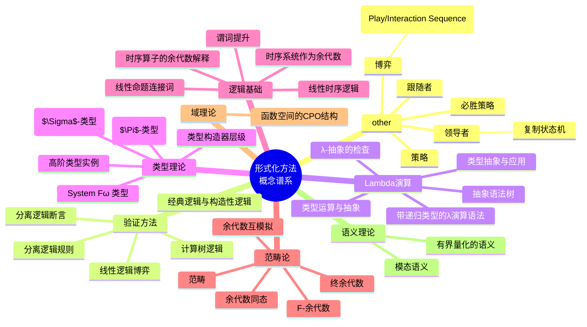
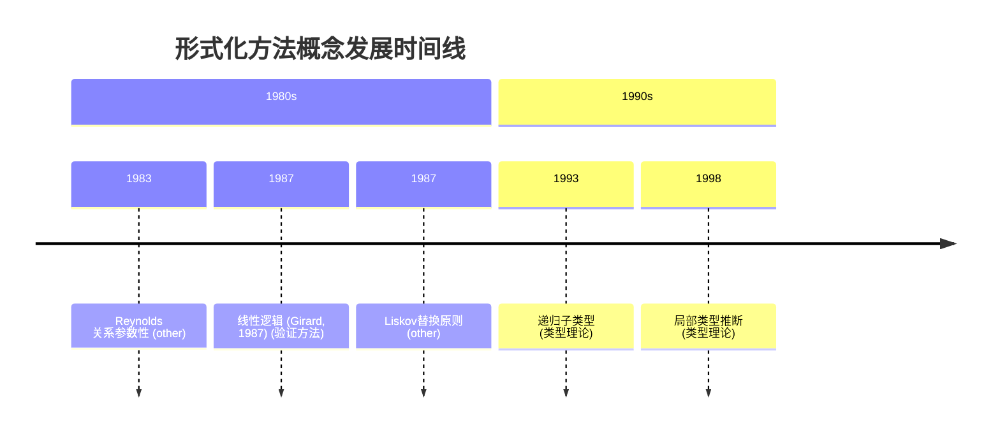
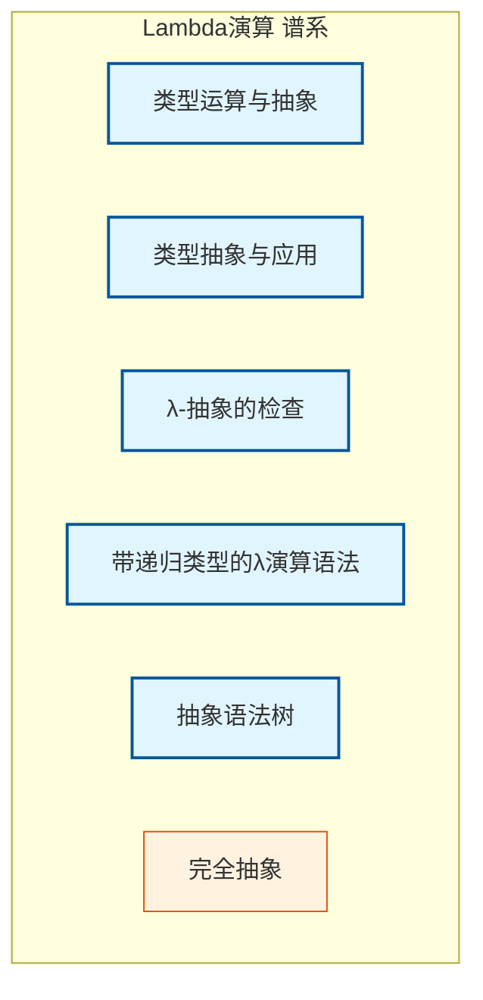

# 概念谱系分析报告

**生成时间**: 2026-04-10 20:03

## 📊 统计摘要

| 指标 | 数值 |
|------|------|
| 概念总数 | 196 |
| 已分类 | 114 |
| 含年份信息 | 5 |
| 含关系信息 | 34 |

### 按类别分布

| 类别 | 数量 | 占比 |
|------|------|------|
| 类型理论 | 88 | 44.9% |
| other | 82 | 41.8% |
| 验证方法 | 7 | 3.6% |
| Lambda演算 | 6 | 3.1% |
| 逻辑基础 | 5 | 2.6% |
| 范畴论 | 5 | 2.6% |
| 语义理论 | 2 | 1.0% |
| 域理论 | 1 | 0.5% |

## 📅 时间范围

概念发展时间跨度: **1983 - 1998**

## 🗺️ 概念层次总览



## 📈 概念发展时间线



## 🔍 聚焦谱系

### Lambda演算



### 类型理论

```mermaid
graph TB
  subgraph types[类型理论 谱系]
    L0_Def_F_01_01[类型构造器层级]:::root
    L0_Def_F_01_02[System Fω 类型]:::root
    L0_Def_F_01_04[高阶类型实例]:::root
    L0_Def_F_01_05[依赖函数类型 ($\Pi$-类型)]:::root
    L0_Def_F_01_06[依赖对类型 ($\Sigma$-类型)]:::root
    L0_Def_F_01_07[归纳类型定义]:::root
    L0_Def_F_01_08[共归纳类型]:::root
    L0_Def_F_01_09[LF 类型层级]:::root
    L1_Def_F_05_40[多通道会话类型]:::derived
    L1_Def_F_05_15[共归纳类型]:::derived
    L1_Def_F_07_06[Hindley-Milner 类型系统]:::derived
    L1_Def_F_07_23[多态类型方案]:::derived
    L1_Def_F_09_02[子类型上下文]:::derived
    L1_Def_F_09_21[有界多态系统 (System F<:)]:::derived
    L2_Def_F_05_13[高阶类型实例]:::applied
    L0_Def_F_01_08 --> L2_Def_F_05_13
    L1_Def_F_05_15 --> L2_Def_F_05_13
  end
  classDef root fill:#e1f5fe,stroke:#01579b,stroke-width:2px
  classDef derived fill:#fff3e0,stroke:#e65100,stroke-width:1px
  classDef applied fill:#f3e5f5,stroke:#4a148c,stroke-width:1px
```

### 验证方法

```mermaid
graph TB
  subgraph verification[验证方法 谱系]
    L0_Def_S_99_16[线性逻辑博弈]:::root
    L0_Def_F_01_13[经典逻辑与构造性逻辑]:::root
    L0_Def_F_03_02[计算树逻辑]:::root
    L0_Def_F_03_05[分离逻辑断言]:::root
    L0_Def_F_03_06[分离逻辑规则]:::root
    L0_Def_F_05_35[线性逻辑 (Girard, 1987)]:::root
    L0_Def_F_06_04[余代数模态逻辑语法]:::root
  end
  classDef root fill:#e1f5fe,stroke:#01579b,stroke-width:2px
  classDef derived fill:#fff3e0,stroke:#e65100,stroke-width:1px
  classDef applied fill:#f3e5f5,stroke:#4a148c,stroke-width:1px
```

## 🌳 基础概念（根概念）

### other

- **博弈** - `Def-S-99-12`
  - 英文: Game
  - 派生概念: 2 个
- **策略** - `Def-S-99-13`
  - 英文: Strategy
  - 派生概念: 1 个
- **必胜策略** - `Def-S-99-15`
  - 英文: Winning Strategy
- **领导者** - `Def-K-99-07`
  - 英文: Leader
  - 派生概念: 1 个
- **跟随者** - `Def-K-99-08`
  - 英文: Follower
- **候选人** - `Def-K-99-09`
  - 英文: Candidate
- **任期** - `Def-K-99-10`
  - 英文: Term
  - 派生概念: 1 个
- **日志条目** - `Def-K-99-11`
  - 英文: Log Entry
- **提交** - `Def-K-99-12`
  - 英文: Commit
- **签名** - `Def-F-01-11`
  - 英文: Signature
  - 派生概念: 1 个

### 验证方法

- **线性逻辑博弈** - `Def-S-99-16`
  - 英文: Linear Logic Games
- **经典逻辑与构造性逻辑** - `Def-F-01-13`
- **计算树逻辑** - `Def-F-03-02`
  - 英文: CTL
- **分离逻辑断言** - `Def-F-03-05`
- **分离逻辑规则** - `Def-F-03-06`
- **线性逻辑 (Girard, 1987)** (1987) - `Def-F-05-35`
- **余代数模态逻辑语法** - `Def-F-06-04`

### Lambda演算

- **类型运算与抽象** - `Def-F-01-03`
- **类型抽象与应用** - `Def-F-05-05`
- **λ-抽象的检查** - `Def-F-07-12`
- **带递归类型的λ演算语法** - `Def-F-08-10`
- **抽象语法树** - `Def-F-08-29`
  - 英文: AST

### 类型理论

- **类型构造器层级** - `Def-F-01-01`
- **System Fω 类型** - `Def-F-01-02`
- **高阶类型实例** - `Def-F-01-04`
- **依赖函数类型 ($\Pi$-类型)** - `Def-F-01-05`
- **依赖对类型 ($\Sigma$-类型)** - `Def-F-01-06`
- **归纳类型定义** - `Def-F-01-07`
  - 英文: Inductive Families
- **共归纳类型** - `Def-F-01-08`
  - 英文: Coinductive Types
  - 派生概念: 1 个
- **LF 类型层级** - `Def-F-01-09`
- **LF 判断即类型** - `Def-F-01-10`
  - 英文: Judgments-as-Types
- **命题即类型** - `Def-F-01-12`
  - 英文: Propositions as Types

### 逻辑基础

- **线性命题连接词** - `Def-F-01-14`
- **线性时序逻辑** - `Def-F-03-01`
  - 英文: LTL
- **谓词提升** - `Def-F-06-05`
  - 英文: Predicate Lifting
- **时序系统作为余代数** - `Def-F-06-07`
- **时序算子的余代数解释** - `Def-F-06-08`

### 范畴论

- **范畴** - `Def-F-02-01`
- **F-余代数** - `Def-F-02-04`
- **余代数同态** - `Def-F-02-05`
- **终余代数** - `Def-F-06-01`
  - 英文: Terminal Coalgebra
- **余代数互模拟** - `Def-F-06-03`
  - 英文: Coalgebraic Bisimulation

### 域理论

- **函数空间的CPO结构** - `Def-F-04-02`

### 语义理论

- **模态语义** - `Def-F-06-06`
- **有界量化的语义** - `Def-F-09-23`

## ⭐ 关键里程碑

- **1983** - Reynolds 关系参数性 (other)
- **1987** - 线性逻辑 (Girard, 1987) (验证方法)
- **1987** - Liskov替换原则 (other)
- **1993** - 递归子类型 (类型理论)
- **1998** - 局部类型推断 (类型理论)

---
*报告由 concept-lineage.py 自动生成*
