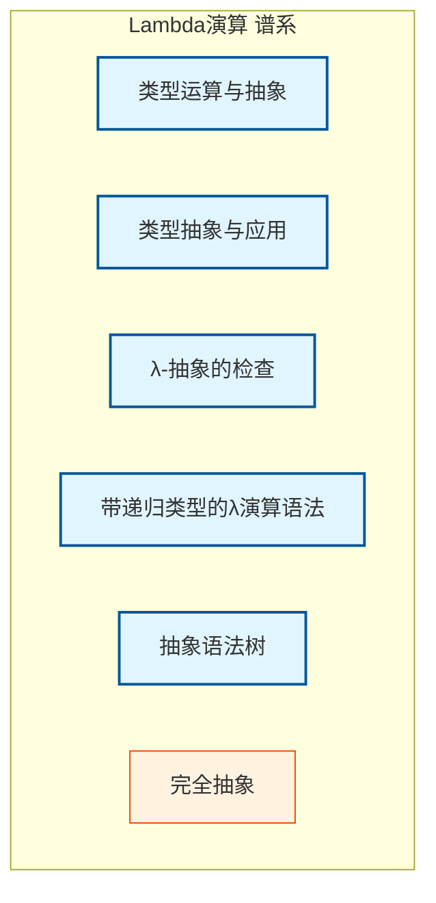

```mermaid
graph TB
  subgraph lambda[Lambda演算 谱系]
    L0_Def_F_01_03[类型运算与抽象]:::root
    L0_Def_F_05_05[类型抽象与应用]:::root
    L0_Def_F_07_12[λ-抽象的检查]:::root
    L0_Def_F_08_10[带递归类型的λ演算语法]:::root
    L0_Def_F_08_29[抽象语法树]:::root
    L1_Def_S_99_17[完全抽象]:::derived
  end
  classDef root fill:#e1f5fe,stroke:#01579b,stroke-width:2px
  classDef derived fill:#fff3e0,stroke:#e65100,stroke-width:1px
  classDef applied fill:#f3e5f5,stroke:#4a148c,stroke-width:1px
```
