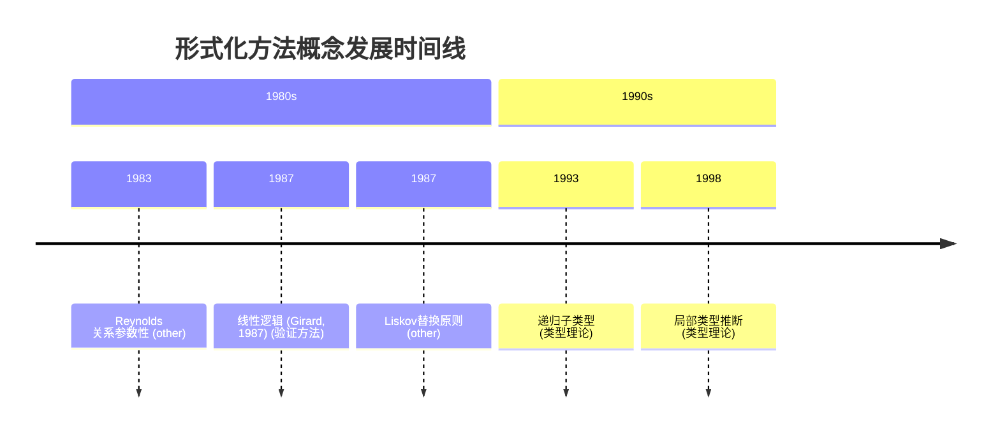

```mermaid
timeline
  title 形式化方法概念发展时间线
  section 1980s
    1983 : Reynolds 关系参数性 (other)
    1987 : 线性逻辑 (Girard, 1987) (验证方法)
    1987 : Liskov替换原则 (other)
  section 1990s
    1993 : 递归子类型 (类型理论)
    1998 : 局部类型推断 (类型理论)
```
