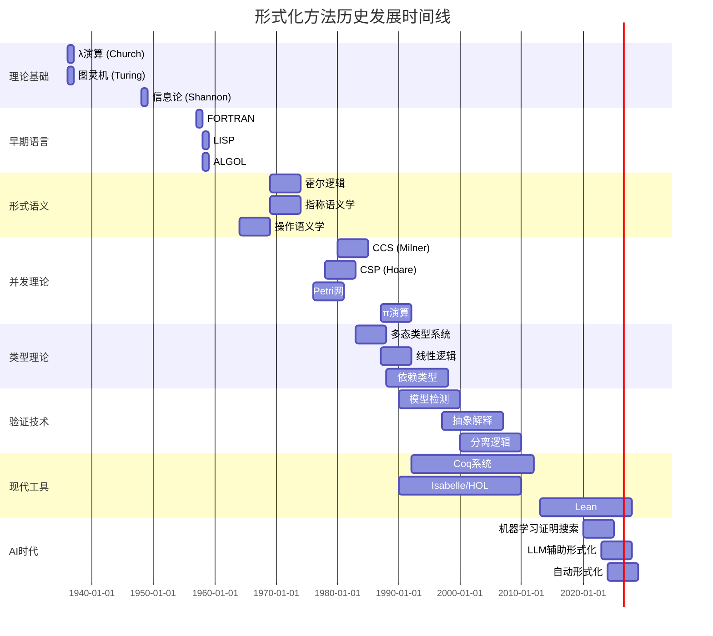

# 形式化方法历史发展时间线

> 所属阶段: formal-methods | 形式化等级: L1

本文档记录形式化方法领域从1930年代至今的重要里程碑事件、关键人物和技术突破。

---

## 1930s: 计算理论基础

### 里程碑事件

| 年份 | 事件 | 关键人物 | 重要性 |
|------|------|----------|--------|
| 1936 | λ演算发表 | Alonzo Church | 函数式编程和类型理论的基础 |
| 1936 | 图灵机模型 | Alan Turing | 可计算性理论的基石 |
| 1936 | 停机问题不可判定性证明 | Alan Turing / Alonzo Church | 计算理论的根本限制 |

### 关键论文/书籍

- **Church, A.** (1936). "An unsolvable problem of elementary number theory." *American Journal of Mathematics*, 58(2), 345-363.
- **Turing, A.M.** (1936). "On computable numbers, with an application to the Entscheidungsproblem." *Proceedings of the London Mathematical Society*, 42(2), 230-265.

### 技术突破

- 定义了"可计算性"的精确数学含义
- 建立了λ演算与图灵机的等价性（Church-Turing论题）
- 为后续的编程语言语义学奠定基础

---

## 1940s: 逻辑与自动机

### 里程碑事件

| 年份 | 事件 | 关键人物 | 重要性 |
|------|------|----------|--------|
| 1943 | 神经网络的逻辑演算 | McCulloch & Pitts | 连接主义与逻辑的结合 |
| 1944 | 博弈论与经济行为 | von Neumann & Morgenstern | 决策理论的数学基础 |
| 1948 | 通信的数学理论 | Claude Shannon | 信息论诞生 |

### 关键论文/书籍

- **McCulloch, W.S. & Pitts, W.** (1943). "A logical calculus of the ideas immanent in nervous activity." *Bulletin of Mathematical Biophysics*, 5, 115-133.
- **Shannon, C.E.** (1948). "A mathematical theory of communication." *Bell System Technical Journal*, 27, 379-423.

### 技术突破

- 布尔逻辑在电路设计中的应用
- 有限状态自动机的早期概念
- 信息熵的数学定义

---

## 1950s: 编程语言萌芽

### 里程碑事件

| 年份 | 事件 | 关键人物 | 重要性 |
|------|------|----------|--------|
| 1957 | FORTRAN语言发布 | John Backus (IBM) | 第一个高级编程语言 |
| 1958 | LISP语言发布 | John McCarthy (MIT) | 函数式编程的先驱 |
| 1958 | ALGOL 58发布 | 国际委员会 | 结构化程序设计的起源 |
| 1959 | COBOL语言发布 | Grace Hopper等 | 商业计算的标准 |

### 关键论文/书籍

- **Backus, J.W.** et al. (1957). "The FORTRAN automatic coding system." *Proceedings of the Western Joint Computer Conference*.
- **McCarthy, J.** (1960). "Recursive functions of symbolic expressions and their computation by machine." *Communications of the ACM*, 3(4), 184-195.

### 技术突破

- 高级编程语言取代机器码
- 递归函数的数学表达
- BNF文法用于语言规范（ALGOL 60报告）

---

## 1960s: 形式语义学诞生

### 里程碑事件

| 年份 | 事件 | 关键人物 | 重要性 |
|------|------|----------|--------|
| 1963 | 操作语义学初步 | Peter Landin | SECD机器和ISWIM语言 |
| 1964 | 公理语义学/霍尔逻辑 | C.A.R. Hoare | 程序正确性的形式化推理 |
| 1967 | Simula 67发布 | Ole-Johan Dahl & Kristen Nygaard | 面向对象编程的起源 |
| 1969 | 指称语义学 | Dana Scott & Christopher Strachey | 程序的数学语义 |

### 关键论文/书籍

- **Hoare, C.A.R.** (1969). "An axiomatic basis for computer programming." *Communications of the ACM*, 12(10), 576-580.
- **Scott, D.** & **Strachey, C.** (1971). "Toward a mathematical semantics for computer languages." *Programming Research Group Technical Monograph PRG-6*.
- **Landin, P.J.** (1964). "The mechanical evaluation of expressions." *Computer Journal*, 6(4), 308-320.

### 技术突破

- 霍尔三元组 {P} C {Q} 的提出
- 完备格上的不动点理论
- 程序作为数学函数的数学解释

**相关文档**: [3.1-hoare-logic.md](../3.1-hoare-logic.md), [1.1-denotational-semantics.md](../1.1-denotational-semantics.md)

---

## 1970s: 并发理论奠基

### 里程碑事件

| 年份 | 事件 | 关键人物 | 重要性 |
|------|------|----------|--------|
| 1973 | CSP诞生 | C.A.R. Hoare | 通信顺序进程 |
| 1974 | 谓词变换器 | Edsger W. Dijkstra | 最弱前置条件演算 |
| 1976 | 有限状态并发模型 | Carl Adam Petri | Petri网理论 |
| 1978 | 分布式系统时钟 | Leslie Lamport | 逻辑时钟与事件排序 |
| 1980 | CCS发表 | Robin Milner | 通信系统演算 |

### 关键论文/书籍

- **Hoare, C.A.R.** (1978). "Communicating sequential processes." *Communications of the ACM*, 21(8), 666-677.
- **Milner, R.** (1980). "A Calculus of Communicating Systems." *LNCS 92*, Springer.
- **Dijkstra, E.W.** (1976). "A Discipline of Programming." *Prentice-Hall*.
- **Lamport, L.** (1978). "Time, clocks, and the ordering of events in a distributed system." *Communications of the ACM*, 21(7), 558-565.

### 技术突破

- 并发系统的代数描述
- 互斥与同步的形式化
- 进程等价关系（双模拟）
- 时序逻辑的引入

**相关文档**: [2.1-ccs.md](../2.1-ccs.md), [2.2-csp.md](../2.2-csp.md), [3.2-temporal-logic.md](../3.2-temporal-logic.md)

---

## 1980s: 类型理论革命

### 里程碑事件

| 年份 | 事件 | 关键人物 | 重要性 |
|------|------|----------|--------|
| 1983 | 关系参数性 | John Reynolds | 多态的类型抽象 |
| 1984 | LF框架 | Harper, Honsell, Plotkin | 逻辑框架基础 |
| 1987 | 线性逻辑 | Jean-Yves Girard | 资源敏感推理 |
| 1987 | Liskov替换原则 | Barbara Liskov | 子类型的行为约束 |
| 1987 | π演算 | Robin Milner | 移动进程理论 |
| 1988 | 归纳类型 | Coquand & Paulin-Mohring | 构造演算的扩展 |

### 关键论文/书籍

- **Reynolds, J.C.** (1983). "Types, abstraction and parametric polymorphism." *IFIP Congress*.
- **Girard, J.Y.** (1987). "Linear logic." *Theoretical Computer Science*, 50, 1-102.
- **Milner, R.** (1992). "Functions as processes." *Mathematical Structures in Computer Science*, 2(2), 119-141.
- **Liskov, B.** & **Wing, J.** (1994). "A behavioral notion of subtyping." *ACM TOPLAS*, 16(6).

### 技术突破

- Curry-Howard对应的深化理解
- 依赖类型与证明即程序
- 线性逻辑与资源管理
- 进程演算的移动性扩展

**相关文档**: [1.2-type-theory.md](../1.2-type-theory.md), [2.3-pi-calculus.md](../2.3-pi-calculus.md), [4.1-linear-logic.md](../4.1-linear-logic.md)

---

## 1990s: 模型检测与验证

### 里程碑事件

| 年份 | 事件 | 关键人物 | 重要性 |
|------|------|----------|--------|
| 1990 | 模型检测应用 | Clarke, Emerson, Sifakis | 自动验证的实用化 |
| 1992 | Coq系统发布 | INRIA团队 | 交互式定理证明器 |
| 1994 | 隐式类型推断 | Pierce & Turner | 局部类型推断 |
| 1997 | 抽象解释 | Patrick & Radhia Cousot | 静态分析的数学基础 |
| 1998 | 程序分析框架 | Flemming Nielson等 | 程序分析的系统性方法 |
| 1999 | 软件模型检测 | SPIN, SMV等工具 | 工业级验证工具 |

### 关键论文/书籍

- **Clarke, E.M.**, **Emerson, E.A.**, & **Sistla, A.P.** (1986). "Automatic verification of finite-state concurrent systems using temporal logic specifications." *ACM TOPLAS*, 8(2), 244-263.
- **Cousot, P.** & **Cousot, R.** (1977/1996). "Abstract interpretation: A unified lattice model for static analysis." *POPL 1977* / 系统阐述 1996.
- **Nielson, F.**, **Nielson, H.R.**, & **Hankin, C.** (1999). "Principles of Program Analysis." *Springer*.

### 技术突破

- BDD（二叉决策图）用于高效状态空间搜索
- 符号模型检测
- 抽象解释框架
- 定理证明器的工程化

**相关文档**: [3.3-model-checking.md](../3.3-model-checking.md), [5.1-abstract-interpretation.md](../5.1-abstract-interpretation.md)

---

## 2000s: 现代类型理论与验证

### 里程碑事件

| 年份 | 事件 | 关键人物 | 重要性 |
|------|------|----------|--------|
| 2000 | 分离逻辑 | John Reynolds | 堆内存推理的革命 |
| 2004 | 依赖类型系统 | Epigram, Agda | 编程与证明的统一 |
| 2005 | F*框架启动 | Microsoft Research | 验证导向的编程 |
| 2006 | 高阶分离逻辑 | Birkedal等 | 高阶程序的模块化验证 |
| 2009 | Iris项目启动 | MPI-SWS团队 | 并发高阶分离逻辑 |
| 2010 | CompCert发布 | Xavier Leroy | 完全验证的编译器 |

### 关键论文/书籍

- **Reynolds, J.C.** (2002). "Separation logic: A logic for shared mutable data structures." *LICS 2002*.
- **O'Hearn, P.W.**, **Reynolds, J.C.**, & **Yang, H.** (2001). "Local reasoning about programs that alter data structures." *CSL 2001*.
- **Leroy, X.** (2009). "A formally verified compiler back-end." *Journal of Automated Reasoning*, 43(4), 363-446.

### 技术突破

- 堆内存的局部推理
- 并发程序的组合验证
- 模块化程序规范
- 形式化验证的编译器

**相关文档**: [4.2-separation-logic.md](../4.2-separation-logic.md), [5.2-iris.md](../5.2-iris.md)

---

## 2010s: 证明助手与形式化数学

### 里程碑事件

| 年份 | 事件 | 关键人物 | 重要性 |
|------|------|----------|--------|
| 2012 | 四色定理完全形式化 | Georges Gonthier (Coq) | 数学证明的机械化 |
| 2013 | Homotopy Type Theory | Voevodsky等 | 新的类型理论基础 |
| 2013 | Lean证明助手发布 | Leonardo de Moura (MSR) | 现代化定理证明 |
| 2014 | seL4验证完成 | Klein等 | 操作系统内核验证 |
| 2017 | 奇点定理形式化 | 数学物理学家团队 | 物理定理的验证 |

### 关键论文/书籍

- **The Univalent Foundations Program.** (2013). "Homotopy Type Theory: Univalent Foundations of Mathematics." *IAS*.
- **de Moura, L.**, **Kong, S.**, et al. (2015). "The Lean theorem prover." *CADE 2015*.
- **Klein, G.** et al. (2014). "Comprehensive formal verification of an OS microkernel." *ACM TOCS*, 32(1).

### 技术突破

- 高阶归纳类型
- 同伦类型理论的公理化
- 证明助手的用户友好化
- 大规模软件系统的形式化验证

**相关文档**: [6.1-hott.md](../6.1-hott.md), [6.2-lean.md](../6.2-lean.md)

---

## 2020s: AI辅助与前沿探索

### 里程碑事件

| 年份 | 事件 | 关键人物/机构 | 重要性 |
|------|------|---------------|--------|
| 2021 | Lean 4发布 | Leonardo de Moura (Amazon) | 高效可扩展的证明助手 |
| 2022 | 机器学习证明搜索 | OpenAI, DeepMind | AI辅助定理证明 |
| 2023 | LLM用于形式化 | Meta, Google Research | 大语言模型与形式方法 |
| 2024 | 量子程序验证 | 多机构研究 | 量子计算的形式化 |
| 2025 | Autoformalization | 学术界/工业界 | 自动形式化技术 |

### 关键论文/书籍

- **de Moura, L.** & **Ullrich, S.** (2021). "The Lean 4 theorem prover and programming language." *CADE 2021*.
- **Polu, S.** & **Sutskever, I.** (2020). "Generative language modeling for automated theorem proving." *arXiv:2009.03393*.
- **First, E.** et al. (2023). "Baldur: Whole-proof generation and repair with large language models." *FSE 2023*.

### 技术突破

- 神经网络引导的证明搜索
- 自然语言到形式规范的自动转换
- 量子程序的形式化语义
- 混合人机协同验证流程

**相关文档**: [7.1-ai-formalization.md](../7.1-ai-formalization.md), [7.2-quantum-verification.md](../7.2-quantum-verification.md)

---

## 可视化: 甘特图时间线



---

## 关键主题演进路线

### 1. 程序正确性证明

```
1960s: 霍尔逻辑 (Hoare Logic)
   ↓
1970s: 谓词变换器 (Dijkstra)
   ↓
1990s: 细化演算 (Morgan/VDM)
   ↓
2000s: 分离逻辑 (Reynolds/O'Hearn)
   ↓
2010s: 高阶分离逻辑 (Iris)
   ↓
2020s: AI辅助证明合成
```

### 2. 并发系统验证

```
1970s: 互斥与同步原语
   ↓
1980s: 进程代数 (CCS/CSP)
   ↓
1990s: 时序逻辑与模型检测
   ↓
2000s: 并发分离逻辑
   ↓
2010s: Iris高阶并发逻辑
   ↓
2020s: 弱内存模型验证
```

### 3. 类型理论发展

```
1930s: 简单类型λ演算 (Church)
   ↓
1970s: 多态类型 (ML/Girard/Reynolds)
   ↓
1980s: 依赖类型与构造演算
   ↓
1990s: 子类型与面向对象类型
   ↓
2000s: 依赖类型编程语言
   ↓
2010s: 同伦类型理论 (HoTT)
   ↓
2020s: 立方类型理论
```

---

## 引用参考
