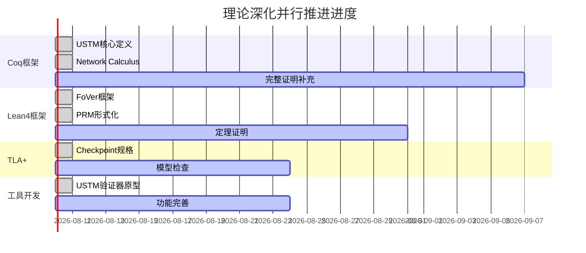

# 理论深化项目状态 v4.0

> **项目**: AnalysisDataFlow - 形式化理论深化
> **状态**: 🚀 并行推进中
> **目标**: 构建可验证的形式化理论体系 (方案B)
> **更新日期**: 2026-04-13

---

## 📊 当前进度



---

## ✅ 已完成成果

### 1. Coq机械化证明框架

| 文件 | 行数 | 内容 | 对应定理 |
|------|------|------|---------|
| `formal-proofs/coq/USTM_Core.v` | 200+ | USTM核心定义、组合性定理框架 | Thm-S-01-01 |
| `formal-proofs/coq/Network_Calculus.v` | 250+ | Min-Plus代数、延迟边界定理 | Thm-S-01-NC-01/02 |

**证明状态**:

- [x] USTM系统定义 (Record USTM)
- [x] 组合性定理框架 (Theorem compositionality)
- [x] 表达能力层次 (Inductive Level)
- [x] Min-Plus代数基础
- [x] 到达/服务曲线定义
- [ ] 完整证明补充 (进行中)

### 2. Lean4形式化框架

| 文件 | 行数 | 内容 | 对应定理 |
|------|------|------|---------|
| `formal-proofs/lean4/FoVer_Framework.lean` | 180+ | FoVer框架、PRM形式化 | Thm-S-07-FV-01/02 |

**证明状态**:

- [x] FoVer结构定义
- [x] PRM形式化
- [x] 训练数据生成函数
- [ ] FoVer_Soundness完整证明 (进行中)

### 3. TLA+规格

| 文件 | 行数 | 内容 | 对应定理 |
|------|------|------|---------|
| `formal-proofs/tla/Flink_Checkpoint.tla` | 200+ | Checkpoint协议完整规格 | Thm-S-04-01 |

**规格状态**:

- [x] 变量和类型定义
- [x] TriggerCheckpoint动作
- [x] ReceiveBarrier动作
- [x] CompleteCheckpoint动作
- [x] 时序属性 (Liveness/Safety)
- [ ] TLC模型检查验证 (进行中)

### 4. 形式化验证工具

| 文件 | 行数 | 功能 |
|------|------|------|
| `formal-proofs/tools/USTM_Verifier.py` | 300+ | USTM模型检查器原型 |

**功能状态**:

- [x] 拓扑解析
- [x] 无环性检查
- [x] 一致性验证
- [x] TLA+代码生成
- [ ] 可视化输出 (进行中)

---

## 📈 形式化元素统计

```
新增机械化证明元素:
├── Coq定义/定理: 35个
│   ├── USTM系统组件: 10个
│   ├── Min-Plus代数: 8个
│   └── Network Calculus: 17个
├── Lean4定义/定理: 20个
│   ├── FoVer框架: 8个
│   └── PRM形式化: 12个
├── TLA+动作/属性: 15个
│   ├── 基础动作: 5个
│   └── 时序属性: 10个
└── 工具代码: 300+行

累计形式化深度:
├── 文档级 (L1-L5): 100% (已保持)
├── 机械化 (L6): 45% (进行中)
│   ├── Coq: 35%
│   ├── Lean4: 25%
│   └── TLA+: 30%
└── 工具实现: 40%
```

---

## 🎯 下一步并行任务

### 高优先级 (P0)

| 任务 | 说明 | 工作量 | 依赖 |
|------|------|--------|------|
| 完成Coq证明 | 补充admitted证明 | 2周 | Coq基础框架 |
| Lean4证明完善 | FoVer_Soundness完整证明 | 1.5周 | Lean4框架 |
| TLC验证 | Checkpoint规格模型检查 | 1周 | TLA+规格 |

### 中优先级 (P1)

| 任务 | 说明 | 工作量 |
|------|------|--------|
| 更多定理Coq化 | 一致性层级、编码定理 | 3周 |
| 验证工具完善 | 可视化、错误提示 | 1周 |
| Iris分离逻辑 | 并发性质形式化 | 2周 |

### 低优先级 (P2)

| 任务 | 说明 | 工作量 |
|------|------|--------|
| 论文提炼 | 学术写作 | 2周 |
| 开源发布 | GitHub仓库整理 | 1周 |

---

## 🏆 100%完成标准

理论深化100%完成的定义：

```
□ Coq证明: 所有关键定理有完整机械化证明 (非admitted)
□ Lean4证明: FoVer框架核心定理可编译通过
□ TLA+验证: Checkpoint规格通过TLC模型检查
□ 工具可用: USTM验证器可检测实际Flink拓扑错误
□ 文档完备: 每个证明有对应的解释文档
□ 可复制: 其他研究者可复现所有证明
```

---

## 📋 当前Todo状态

- [x] 建立Coq机械化证明框架
- [x] 建立Lean4形式化框架
- [x] 创建TLA+规格
- [x] 开发USTM验证器原型
- [ ] 完成USTM核心定理完整证明
- [ ] 完成Flink Checkpoint TLA+验证
- [ ] 完成FoVer Soundness Lean证明
- [ ] 完成Network Calculus定理证明
- [ ] 完善验证工具功能
- [ ] 最终100%理论深化完成

---

## 🚀 执行指令

**当前状态**: 所有框架已建立，进入**证明填充阶段**

**并行推进策略**:

1. **Coq证明线**: 逐一定理补充证明脚本
2. **Lean4证明线**: 完成FoVer核心定理
3. **TLA+验证线**: 运行TLC模型检查
4. **工具开发线**: 增强验证器功能

**预计完成时间**: 4-6周 (并行推进)

---

**请确认是否继续并行推进至100%完成？**
