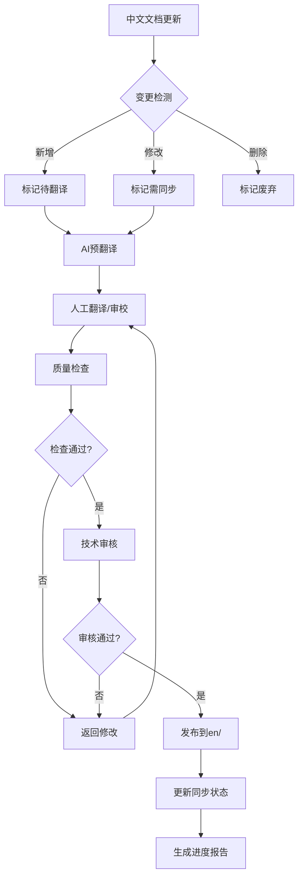
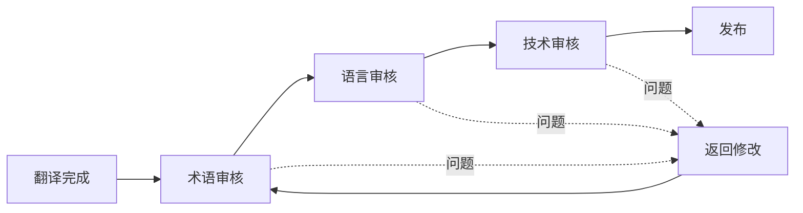
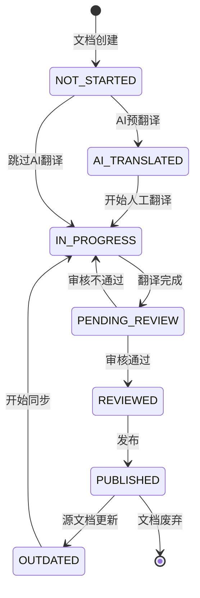
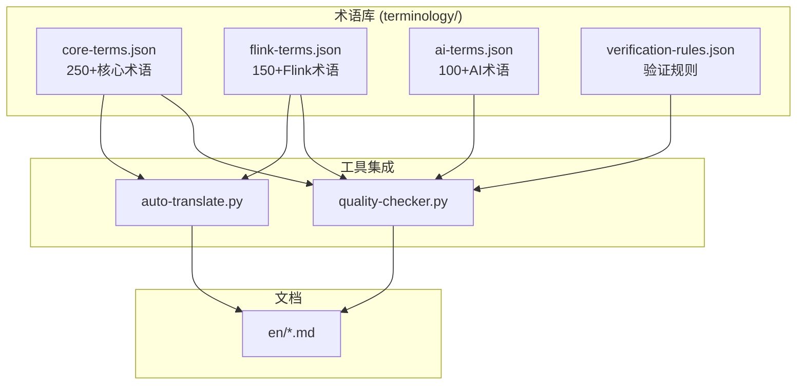
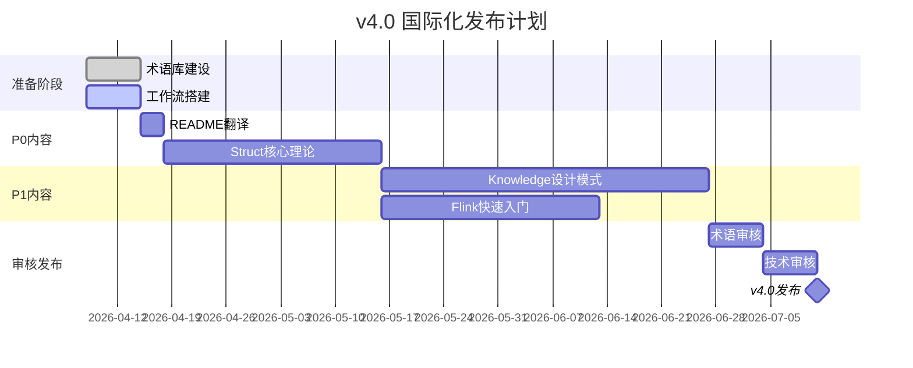

# 国际化(i18n)架构文档

> **版本**: v4.0-prep | **生效日期**: 2026-04-08 | **状态**: v4.0国际化发布准备
>
> **翻译范围**: P0-P1内容 | **预算**: $16,000 | **目标语言**: 英文 (en)

---

## 1. 国际化架构设计

### 1.1 设计目标

为 AnalysisDataFlow v4.0 国际化发布建立完整的翻译工作流和术语管理体系：

| 目标 | 描述 | 验收标准 |
|------|------|----------|
| **内容覆盖** | P0/P1内容完整翻译 | 105篇文档 |
| **术语一致** | 建立权威术语库 | 500+术语条目 |
| **工作流自动化** | 翻译追踪与质量检查 | CI/CD集成 |
| **人工审校** | 专业译者+技术审核 | 三级审核体系 |

### 1.2 多语言网站方案

采用 **GitHub Pages + MkDocs Material** 方案实现多语言站点：

```yaml
# mkdocs.yml 多语言配置
site_name: AnalysisDataFlow
plugins:
  - i18n:
      languages:
        - locale: zh
          name: 中文
          default: true
          build: true
        - locale: en
          name: English
          build: true

      # 文档结构配置
      docs_structure: folder

      # 语言切换器
      material_alternate:
        - name: 中文
          link: /zh/
          lang: zh
        - name: English
          link: /en/
          lang: en
```

#### 技术选型对比

| 方案 | 成本 | 维护难度 | SEO | 推荐度 |
|------|------|----------|-----|--------|
| GitHub Pages + MkDocs | 免费 | 低 | 良好 | ⭐⭐⭐⭐⭐ |
| Vercel + Next.js | 免费 | 中 | 优秀 | ⭐⭐⭐⭐ |
| Netlify + Gatsby | 免费 | 高 | 优秀 | ⭐⭐⭐ |
| 自建服务器 | 付费 | 高 | 可控 | ⭐⭐ |

### 1.3 目录结构

```
i18n/
├── en/                          # 英文内容 (目标语言)
│   ├── README.md               # 项目首页
│   ├── QUICK-START.md          # 快速入门
│   ├── ARCHITECTURE.md         # 架构概览
│   ├── NAVIGATION.md           # 导航索引
│   ├── Struct/                 # 形式理论 (15篇 P0)
│   │   ├── 01-stream-processing-fundamentals.md
│   │   ├── 02-actor-model.md
│   │   └── ...
│   ├── Knowledge/              # 设计模式 (20篇 P1)
│   │   ├── 01-design-patterns-overview.md
│   │   └── ...
│   └── Flink/                  # Flink快速入门 (10篇 P1)
│       ├── 01-flink-overview.md
│       └── ...
│
├── zh/                          # 中文内容 (源语言)
│   └── (current structure)     # 保持现有结构
│
├── terminology/                 # 术语库
│   ├── core-terms.json         # 核心术语 (250+条目)
│   ├── flink-terms.json        # Flink专有术语 (150+条目)
│   ├── ai-terms.json           # AI/Agent术语 (100+条目)
│   └── verification-rules.json # 验证规则
│
├── translation-workflow/        # 翻译工作流工具
│   ├── sync-tracker.py         # 变更追踪
│   ├── quality-checker.py      # 质量检查
│   ├── auto-translate.py       # AI辅助翻译
│   └── report-generator.py     # 进度报告
│
└── ARCHITECTURE.md             # 本文件
```

---

## 2. 翻译工作流

### 2.1 工作流概览



### 2.2 翻译优先级队列

| 优先级 | 内容 | 字数 | 翻译方式 | 预算 | 工期 |
|--------|------|------|----------|------|------|
| **P0** | README + 核心导航 | 5K | 人工 | $500 | 3天 |
| **P0** | Struct/核心理论 (15篇) | 50K | 人工+审校 | $5,000 | 4周 |
| **P1** | Knowledge/设计模式 (20篇) | 80K | 人工+AI辅助 | $6,000 | 6周 |
| **P1** | Flink/快速入门 (10篇) | 60K | 人工+AI辅助 | $4,500 | 4周 |
| **P2** | 其他内容 | 200K | AI辅助+抽样审校 | - | Q2-Q3 |

### 2.3 三级审核体系



| 审核阶段 | 负责人 | 关注点 | 工具支持 |
|----------|--------|--------|----------|
| **术语审核** | 技术写作者 | 术语一致性、缩写规范 | quality-checker.py |
| **语言审核** | 英语母语译者 | 语法、风格、流畅度 | Grammarly API |
| **技术审核** | Flink专家 | 技术准确性、代码正确 | 人工审核 |

### 2.4 翻译状态流转



---

## 3. 术语管理体系

### 3.1 术语库架构



### 3.2 术语条目格式

```json
{
  "id": "term-001",
  "term": "流处理",
  "en": "Stream Processing",
  "abbreviation": "SP",
  "definition": "对无界数据流进行实时计算的处理模式",
  "definition_en": "A processing pattern for real-time computation on unbounded data streams",
  "context": ["Flink", "Kafka", "Dataflow"],
  "category": "基础概念",
  "verified": true,
  "verified_by": "expert-001",
  "verified_at": "2026-04-08",
  "forbidden_variants": ["数据流处理", "流式处理"],
  "usage_examples": {
    "zh": "流处理系统能够实时分析用户行为数据",
    "en": "Stream Processing systems can analyze user behavior data in real-time"
  }
}
```

### 3.3 禁止翻译列表

| 类型 | 规则 | 示例 |
|------|------|------|
| **产品名** | 保留原文 | Apache Flink, Apache Kafka |
| **API方法** | 保留原文 | map(), flatMap(), keyBy() |
| **配置键** | 保留原文 | execution.checkpointing.interval |
| **代码片段** | 保留原文 | 所有代码块内容 |
| **版本号** | 保留原文 | Flink 2.0, Java 11 |

---

## 4. 自动化工具链

### 4.1 工具架构

```
translation-workflow/
├── sync-tracker.py      # 变更检测与追踪
├── quality-checker.py   # 翻译质量检查
├── auto-translate.py    # AI辅助翻译
└── report-generator.py  # 进度报告生成
```

### 4.2 工具功能矩阵

| 工具 | 核心功能 | 输入 | 输出 | 调用频率 |
|------|----------|------|------|----------|
| **sync-tracker.py** | 检测中文文档变更 | zh/目录 | translation-queue.json | 每小时 |
| **quality-checker.py** | 术语一致性、格式检查 | en/目录 | quality-report.json | 每次提交 |
| **auto-translate.py** | AI预翻译 | zh/ + 术语库 | AI翻译草稿 | 按需 |
| **report-generator.py** | 生成进度报告 | 工作流状态 | PROGRESS-REPORT.md | 每日 |

### 4.3 CI/CD集成

```yaml
# .github/workflows/i18n-sync.yml
name: i18n Sync & Quality Check

on:
  push:
    paths:
      - 'Struct/**'
      - 'Knowledge/**'
      - 'Flink/**'
  schedule:
    - cron: '0 */6 * * *'  # 每6小时

jobs:
  sync-and-check:
    runs-on: ubuntu-latest
    steps:
      - uses: actions/checkout@v4

      - name: Detect Changes
        run: python i18n/translation-workflow/sync-tracker.py

      - name: Quality Check
        run: python i18n/translation-workflow/quality-checker.py --all

      - name: Generate Report
        run: python i18n/translation-workflow/report-generator.py

      - name: Notify Team
        uses: slack/notify@v2
        with:
          message: "Translation sync completed. Check report."
```

---

## 5. 实施计划

### 5.1 v4.0发布路线图



### 5.2 里程碑

| 里程碑 | 日期 | 交付物 |
|--------|------|--------|
| M1 | 2026-04-15 | 术语库v1.0 + 工作流上线 |
| M2 | 2026-05-15 | P0内容翻译完成 |
| M3 | 2026-06-30 | P1内容翻译完成 |
| M4 | 2026-07-15 | 审核完成 + v4.0发布 |

---

## 6. 质量指标

### 6.1 KPI定义

| 指标 | 目标值 | 测量方法 |
|------|--------|----------|
| **术语一致性** | ≥98% | quality-checker.py |
| **翻译覆盖率** | P0:100%, P1:100% | sync-tracker.py |
| **审核通过率** | ≥95% | 人工统计 |
| **源同步延迟** | ≤48小时 | sync-tracker.py |
| **用户满意度** | ≥4.5/5 | 反馈收集 |

### 6.2 质量门禁

```yaml
quality_gates:
  pre_publish:
    - term_consistency: 98%
    - link_validity: 100%
    - code_syntax: pass
    - mermaid_syntax: pass

  post_publish:
    - user_feedback_score: 4.5
    - issue_response_time: 48h
```

---

## 7. 附录

### 7.1 参考资源

- [W3C Internationalization](https://www.w3.org/standards/webdesign/i18n)
- [Mozilla Fluent](https://projectfluent.org/)
- [MkDocs i18n Plugin](https://github.com/ultrabug/mkdocs-static-i18n)

### 7.2 相关文档

- [GLOSSARY.md](../GLOSSARY.md) - 完整术语表
- [docs/i18n/ARCHITECTURE.md](../docs/i18n/ARCHITECTURE.md) - 现有i18n架构
- [PROJECT-TRACKING.md](../PROJECT-TRACKING.md) - 项目进度跟踪

### 7.3 版本历史

| 版本 | 日期 | 变更 |
|------|------|------|
| v4.0-prep | 2026-04-08 | v4.0国际化发布准备 |
