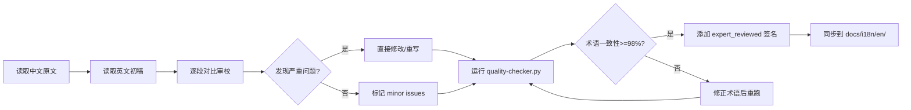

# B 层文档专家审校清单

> **版本**: v1.0 | **生成日期**: 2026-04-15 | **状态**: 待分配
>
> **策略依据**: [TRANSLATION-STRATEGY.md](./TRANSLATION-STRATEGY.md)

---

## 1. 清单说明

本清单列出 **10 篇 B 层文档**，这些文档包含概念定义、工程论证、设计模式、架构机制说明等内容，**必须由领域技术专家逐句审校**。AI 可生成初稿，但不得直接标记为 `expert_reviewed` 而跳过人工审校。

---

## 2. 待审校文档（10 篇）

| # | 文档路径 | 大小 | 所属领域 | 审校重点 | 分配状态 |
|---|---------|------|----------|----------|----------|
| 1 | `Struct/01-foundation/unified-streaming-model.md` | 22.4 KB | 形式化理论 | 统一流模型定义准确性、批/流统一语义等价性 | 待分配 |
| 2 | `Struct/02-properties/consistency-hierarchy.md` | 25.1 KB | 形式化理论 | 一致性层次划分、各层级关系与 Flink 映射 | 待分配 |
| 3 | `Knowledge/02-design-patterns/stateful-streaming-patterns.md` | 19.8 KB | 设计模式 | 状态模式术语一致性、代码示例可运行性 | 待分配 |
| 4 | `Flink/02-core/checkpoint-mechanism-deep-dive.md` | 28.3 KB | Flink 核心机制 | Barrier 机制、对齐/非对齐检查点技术细节 | 待分配 |
| 5 | `Flink/02-core/exactly-once-semantics-deep-dive.md` | 24.7 KB | Flink 核心机制 | 端到端 Exactly-Once 语义、2PC 协议映射 | 待分配 |
| 6 | `Knowledge/02-design-patterns/event-time-processing-patterns.md` | 21.5 KB | 设计模式 | Watermark 策略、乱序处理模式术语 | 待分配 |
| 7 | `Flink/02-core/time-semantics-and-watermark.md` | 26.2 KB | Flink 核心机制 | 时间语义分类、Watermark 生成与传递机制 | 待分配 |
| 8 | `Knowledge/01-concept-atlas/stream-processing-fundamentals.md` | 18.6 KB | 概念图谱 | 基础概念定义、与批处理的边界区分 | 待分配 |
| 9 | `Flink/03-api/table-api-complete-guide.md` | 31.4 KB | Flink API | Table API / SQL 语义、与 DataStream 映射 | 待分配 |
| 10 | `Struct/03-relationships/actor-to-dataflow-mapping.md` | 20.3 KB | 关系映射 | Actor 模型到 Dataflow 的编码关系、语义保持性 | 待分配 |

---

## 3. 审校流程



---

## 4. 审校检查表（每篇必做）

### 4.1 术语一致性

- [ ] 所有核心术语使用了 `i18n/terminology/core-terms.json` 中的标准英文翻译
- [ ] Flink 专有名词保留英文（JobManager, TaskManager, Checkpoint, State Backend 等）
- [ ] 无术语禁止变体出现（如 "反压" 不应译为 backpressure 以外的变体）

### 4.2 逻辑与语义

- [ ] 概念定义与中文原文在数学/工程含义上等价
- [ ] 属性推导的逻辑链条完整，无跳跃
- [ ] 代码示例和配置参数未被错误修改
- [ ] 引用的定理/引理编号与中文原文一致

### 4.3 格式与结构

- [ ] 保留了六段式模板结构
- [ ] Markdown 标题层级与中文原文一致
- [ ] Mermaid 图语法正确，节点标签英译合理
- [ ] 数学公式使用 LaTeX 且渲染正确

### 4.4 链接与引用

- [ ] 内部链接指向对应英文版本（或回退到中文版本）
- [ ] 外部链接未损坏
- [ ] 引用格式使用 `[^n]` 上标并在文末集中列出

### 4.5 Frontmatter 与元数据

- [ ] 文档包含标准 Frontmatter：`title`, `translation_status`, `source_version`, `last_sync`
- [ ] `translation_status` 更新为 `expert_reviewed`
- [ ] 审校签名位于文档末尾或 Frontmatter 中

---

## 5. 审校签名模板

审校完成后，请在文档末尾添加以下签名：

```markdown
---

> **Expert Review Signature**
>
> - Reviewer: [Your Name / GitHub ID]
> - Review Date: [YYYY-MM-DD]
> - Translation Status: `expert_reviewed`
> - Terminology Consistency: [__%]
> - Quality Gate: [Pass / Needs Follow-up]
> - Notes: [Any important observations or known issues]
```

或在 Frontmatter 中添加：

```yaml
---
title: "文档标题"
translation_status: "expert_reviewed"
source_version: "v4.1"
last_sync: "2026-04-15"
reviewer: "Your Name"
reviewed_at: "2026-04-15"
---
```

---

## 6. 发布路径

审校通过的 B 层文档应同步到以下位置：

```
docs/i18n/en/
├── Struct/01-foundation/unified-streaming-model.md
├── Struct/02-properties/consistency-hierarchy.md
├── Struct/03-relationships/actor-to-dataflow-mapping.md
├── Knowledge/01-concept-atlas/stream-processing-fundamentals.md
├── Knowledge/02-design-patterns/stateful-streaming-patterns.md
├── Knowledge/02-design-patterns/event-time-processing-patterns.md
├── Flink/02-core/checkpoint-mechanism-deep-dive.md
├── Flink/02-core/exactly-once-semantics-deep-dive.md
├── Flink/02-core/time-semantics-and-watermark.md
└── Flink/03-api/table-api-complete-guide.md
```

> **注意**: 在未经专家审校前，以上 B 层文档不得从 `i18n/en/` 同步到 `docs/i18n/en/` 作为正式站点内容发布。

---

## 7. 进度跟踪

| 文档 # | 审校人 | 开始日期 | 完成日期 | 状态 |
|--------|--------|----------|----------|------|
| 1 | - | - | - | 待分配 |
| 2 | - | - | - | 待分配 |
| 3 | - | - | - | 待分配 |
| 4 | - | - | - | 待分配 |
| 5 | - | - | - | 待分配 |
| 6 | - | - | - | 待分配 |
| 7 | - | - | - | 待分配 |
| 8 | - | - | - | 待分配 |
| 9 | - | - | - | 待分配 |
| 10 | - | - | - | 待分配 |

---

> **Last Updated**: 2026-04-15
>
> 本清单由 Agent 自动生成。分配审校任务后请更新上表。
