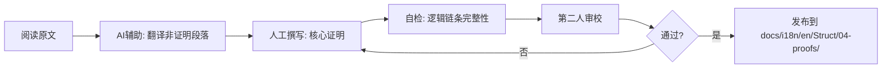

# C 层内容人工翻译试点计划

> **层级**: C (Human-Dominant) | **状态**: 规划中 | **更新日期**: 2026-04-15
>
> **策略依据**: [TRANSLATION-STRATEGY.md](./TRANSLATION-STRATEGY.md)

---

## 1. 试点目标

验证人工主导翻译流程在核心形式化证明文档上的可行性与输出质量标准，为后续大规模 C 层内容翻译建立可复用的工作模板。

---

## 2. 选定的试点文档

从 `Struct/04-proofs/` 中选择 **3 篇**核心证明文档作为首批试点：

| 优先级 | 中文源文档 | 路径 | 选择理由 | 当前状态 |
|--------|-----------|------|----------|----------|
| P0 | Flink Checkpoint 正确性证明 | `Struct/04-proofs/04.01-flink-checkpoint-correctness.md` | 与工程实践结合最紧密，读者覆盖面广 | `docs/i18n/en/Struct/04-proofs/` 中存在 AI 翻译版本（628 行），需专家验证/改写 |
| P0 | Flink Exactly-Once 正确性证明 | `Struct/04-proofs/04.02-flink-exactly-once-correctness.md` | 工业界高度关注，语义精度要求极高 | `docs/i18n/en/Struct/04-proofs/` 中存在 AI 翻译版本，需专家验证/改写 |
| P1 | 类型安全 FG/FGG 证明 | `Struct/04-proofs/04.05-type-safety-fg-fgg.md` | 篇幅较短（20.91 KB），适合作为首个完整人工翻译试点 | 尚无英文版本 |

**已清理的劣质 AI 翻译**:

- `i18n/en/core-docs/04.01-flink-checkpoint-correctness-en.md` 已被归档至 `archive/deprecated/`（该文档仅 120 行，内容为泛泛而谈的介绍，完全缺失具体证明，是 AI 翻译形式化内容的典型失败案例）。

---

## 3. 翻译人员要求

负责 C 层翻译的人员需满足以下条件之一：

- 熟悉进程演算（CCS, CSP, π-calculus）与并发语义
- 具备类型理论（FG, FGG, DOT, Session Types）研究或学习背景
- 熟练使用 Coq / Lean / TLA+ 等证明辅助工具
- 有分布式系统形式化建模经验

---

## 4. 验收标准

每篇试点文档必须满足：

1. **语义等价**: 英文版本与中文原文在数学含义上严格等价
2. **术语一致**: 使用项目术语库标准翻译（如 双模拟→Bisimulation, 迹等价→Trace Equivalence）
3. **格式完整**: 保留所有 `Def-*`、`Lemma-*`、`Thm-*` 编号，数学公式使用 LaTeX
4. **证明可验证**: 证明步骤的逻辑链条可被独立验证，无跳跃或隐含假设
5. **审校签名**: 必须由至少一位第二人进行交叉审校，并留下签名

---

## 5. 工作流程



---

## 6. 输出位置

试点完成后的英文版本应发布至：

```
docs/i18n/en/Struct/04-proofs/
├── 04.01-flink-checkpoint-correctness.md      # 人工验证/改写版
├── 04.02-flink-exactly-once-correctness.md    # 人工验证/改写版
└── 04.05-type-safety-fg-fgg.md                # 人工翻译版
```

Frontmatter 要求：

```yaml
---
title: "文档标题"
translation_status: "formally_verified_human_translation"
source_version: "v4.1"
last_sync: "2026-MM-DD"
translator: "[Name]"
reviewer: "[Name]"
---
```

---

## 7. 进度跟踪

| 文档 | 负责人 | 计划开始 | 计划完成 | 实际状态 |
|------|--------|----------|----------|----------|
| 04.01 Checkpoint 正确性 | TBD | 2026-04 | 2026-05 | 等待分配 |
| 04.02 Exactly-Once 正确性 | TBD | 2026-05 | 2026-06 | 等待分配 |
| 04.05 类型安全 FG/FGG | TBD | 2026-04 | 2026-05 | 等待分配 |

---

> **注意**: C 层内容是项目知识库权威性的根基。任何 AI 翻译的 C 层文档在未经过上述人工验证流程前，必须在文档顶部添加以下警告：
>
> ```markdown
> > ⚠️ **Warning**: This document contains formal proofs translated by AI. It has not yet undergone human expert verification. Use with caution.
> ```
