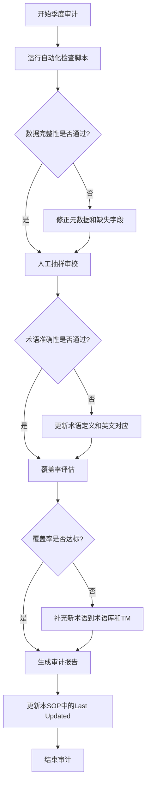

# 季度术语库审计标准操作流程 (SOP)

> **版本**: 1.0.0 | **生效日期**: 2026-04-15 | **频率**: 每季度一次
>
> **关联文档**: [TRANSLATION-STRATEGY.md](./TRANSLATION-STRATEGY.md)

---

## 1. 审计目标

确保术语库与项目实际使用保持一致，防止术语漂移、定义过时或覆盖率不足影响翻译质量。

---

## 2. 审计周期

- **常规审计**: 每季度最后一个月（3月、6月、9月、12月）
- **触发审计**: 当发生以下情况时，不受季度限制，立即执行
  - 新增重大技术方向（如新增 AI Agent、Rust Native 等专题）
  - 上游技术版本升级导致术语变更（如 Flink 2.0 -> 2.5）
  - 收到社区或审校者关于术语一致性的严重反馈

---

## 3. 审计范围

| 资源 | 路径 | 审计重点 |
|------|------|----------|
| 核心术语库 | `i18n/terminology/core-terms.json` | 条目准确性、定义清晰度、英文对应是否权威 |
| Flink 术语库 | `i18n/terminology/flink-terms.json` | 与 Flink 官方文档英文用词的对齐 |
| 翻译记忆库 | `i18n/terminology/translation-memory.json` | 句对完整性、上下文适用性 |
| 验证规则 | `i18n/terminology/verification-rules.json` | 规则是否仍然适用、阈值是否合理 |
| CSV 术语表 | `i18n/terminology-glossary.csv` | 与 JSON 术语库的一致性 |

---

## 4. 审计检查清单

### 4.1 数据完整性检查

- [ ] `total_terms` 字段与实际条目数一致（参考历史问题：标称 258/156，实际仅 30）
- [ ] 所有术语条目包含完整字段：`term`、`en`、`definition`、`definition_en`、`category`
- [ ] 无重复的 `id` 或 `term`
- [ ] 翻译记忆库中的 `source` 和 `target` 无空值

### 4.2 内容准确性检查

- [ ] 核心术语的英文翻译与学术界/工业界主流用法一致
- [ ] Flink 专有名词与 Apache Flink 官方文档英文用词一致
- [ ] `forbidden_variants` 列表覆盖了常见的错误用法
- [ ] 定义和示例反映了当前项目内容的实际含义（而非过时版本）

### 4.3 覆盖率检查

- [ ] 抽样 10 篇最新中文文档，检查是否有未入库的新术语
- [ ] 抽样 10 篇英文翻译文档，检查是否有术语使用与术语库冲突的情况
- [ ] 新领域（如最近 3 个月新增的内容方向）是否有对应术语覆盖

### 4.4 工具链有效性检查

- [ ] `quality-checker.py` 能正确加载术语库并执行检查
- [ ] `auto-translate.py` 在 prompt 中正确引用了术语库
- [ ] CI 中的 `i18n-quality-gate.yml` 能正常触发术语检查

---

## 5. 审计工作流程



---

## 6. 自动化检查脚本

可使用以下 Python 脚本快速执行基础审计：

```python
# i18n/translation-workflow/terminology-audit.py
import json
from pathlib import Path

def audit():
    issues = []

    # 检查 core-terms
    core = json.loads(Path("i18n/terminology/core-terms.json").read_text())
    actual = len(core.get("terms", []))
    claimed = core.get("total_terms", 0)
    if actual != claimed:
        issues.append(f"core-terms.json: total_terms ({claimed}) != actual ({actual})")

    # 检查 flink-terms
    flink = json.loads(Path("i18n/terminology/flink-terms.json").read_text())
    actual = len(flink.get("terms", []))
    claimed = flink.get("total_terms", 0)
    if actual != claimed:
        issues.append(f"flink-terms.json: total_terms ({claimed}) != actual ({actual})")

    # 检查重复 id
    ids = [t["id"] for t in core.get("terms", []) + flink.get("terms", [])]
    if len(ids) != len(set(ids)):
        issues.append("Duplicate term IDs found")

    if issues:
        print("AUDIT FAILED:")
        for i in issues:
            print(f"  - {i}")
    else:
        print("AUDIT PASSED")

if __name__ == "__main__":
    audit()
```

---

## 7. 审计报告模板

每次审计完成后，应在 `i18n/translation-workflow/reports/` 下生成报告：

```markdown
# Terminology Audit Report - QX 2026

**Auditor**: [Name]
**Date**: [YYYY-MM-DD]
**Scope**: core-terms.json, flink-terms.json, translation-memory.json

## Summary

- Total core terms: [N]
- Total Flink terms: [N]
- New terms added this quarter: [N]
- Terms updated/modified: [N]
- Issues found: [N]
- Audit result: [PASS / NEEDS ATTENTION / FAIL]

## Findings

### Issue 1: [Title]
**Severity**: High/Medium/Low
**Description**: ...
**Action Taken**: ...

## Recommendations

1. ...
2. ...
```

---

## 8. 职责

| 角色 | 职责 |
|------|------|
| **术语库维护者** | 执行季度审计、更新术语定义、补充新术语 |
| **领域专家** | 审校术语准确性（尤其是 Flink 专有名和形式化术语） |
| **CI 维护者** | 确保自动化检查脚本与 CI 集成正常 |

---

> **Last Updated**: 2026-04-15
