# AnalysisDataFlow Technische Architekturdokumentation

> **Version**: v1.0 | **Aktualisierungsdatum**: 2026-04-03 | **Status**: Produktion
>
> Dieses Dokument beschreibt die gesamte technische Architektur des AnalysisDataFlow-Projekts, einschließlich Verzeichnisstruktur, Dokumentengenerierungsablauf, Verifikationssystem, Speicherarchitektur und Erweiterungsmechanismen.

---

## Inhaltsverzeichnis

- [1. Gesamtprojektarchitektur](#1-gesamtprojektarchitektur)
  - [1.1 4-Schichten-Architektur-Übersicht](#11-4-schichten-architektur-übersicht)
  - [1.2 Verantwortlichkeiten und Schnittstellen pro Schicht](#12-verantwortlichkeiten-und-schnittstellen-pro-schicht)
  - [1.3 Datenfluss und Abhängigkeiten](#13-datenfluss-und-abhängigkeiten)
- [2. Dokumentengenerierungsarchitektur](#2-dokumentengenerierungsarchitektur)
  - [2.1 Markdown-Verarbeitungsablauf](#21-markdown-verarbeitungsablauf)
  - [2.2 Mermaid-Diagramm-Rendering](#22-mermaid-diagramm-rendering)
- [3. Verifikationssystemarchitektur](#3-verifikationssystemarchitektur)
  - [3.1 Verifikationsskript-Architektur](#31-verifikationsskript-architektur)
  - [3.2 CI/CD-Ablauf](#32-cicd-ablauf)
  - [3.3 Qualitäts-Gate](#33-qualitäts-gate)
- [4. Speicherarchitektur](#4-speicherarchitektur)
  - [4.1 Dateiorganisationsstruktur](#41-dateiorganisationsstruktur)
  - [4.2 Indexsystem](#42-indexsystem)
  - [4.3 Versionsverwaltung](#43-versionsverwaltung)
- [5. Erweiterungsarchitektur](#5-erweiterungsarchitektur)
  - [5.1 Hinzufügen neuer Dokumente](#51-hinzufügen-neuer-dokumente)
  - [5.2 Hinzufügen neuer Visualisierungen](#52-hinzufügen-neuer-visualisierungen)
- [Anhang](#anhang)
  - [A. Glossar](#a-glossar)
  - [B. Verzeichnis-Zuordnungstabelle](#b-verzeichnis-zuordnungstabelle)
  - [C. Verwandte Dokumente](#c-verwandte-dokumente)

---

## 1. Gesamtprojektarchitektur

### 1.1 4-Schichten-Architektur-Übersicht

AnalysisDataFlow verwendet ein **4-Schichten-Architekturdesign**, das eine vollständige Wissensstruktur von formalisierter Theorie bis zur Ingenieurpraxis realisiert:

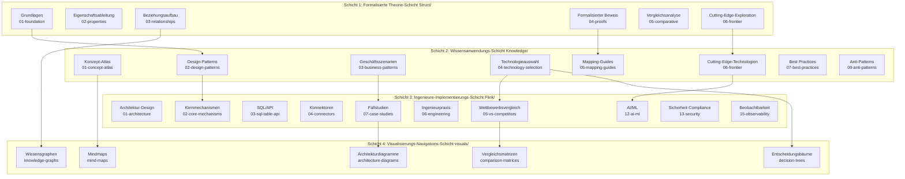

### 1.2 Verantwortlichkeiten und Schnittstellen pro Schicht

#### Schicht 1: Struct/ - Formalisierte theoretische Grundlagen-Schicht

| Attribut | Beschreibung |
|----------|--------------|
| **Positionierung** | Mathematische Definitionen, Theorembeweise, strenge Argumentation |
| **Inhaltsmerkmale** | Formalisierte Sprachen, Axiomensysteme, Beweiskonstruktionen |
| **Dokumentanzahl** | 43 Dokumente |
| **Kernprodukte** | 188 Theoreme, 399 Definitionen, 158 Lemmata |

**Interne Schnittstellen-Spezifikation**:

```
Eingabe: Akademische Literatur, formalisierte Spezifikationen
Ausgabe: Def-* (Definitionen), Thm-* (Theoreme), Lemma-* (Lemmata), Prop-* (Propositionen)
Vertrag: Jede Definition muss eine eindeutige Nummer haben, jedes Theorem muss einen vollständigen Beweis haben
```

**Unterverzeichnis-Verantwortlichkeiten**:

- `01-foundation/`: USTM, Prozesskalküle, Actor, Dataflow Grundlagen
- `02-properties/`: Determinismus, Konsistenz, Watermark-Monotonie usw.
- `03-relationships/`: Cross-Model-Kodierung, Ausdruckshierarchien
- `04-proofs/`: Checkpoint, Exactly-Once Korrektheitsbeweise
- `05-comparative/`: Go vs Scala Ausdruckskraft-Vergleich
- `06-frontier/`: Offene Fragen, Choreographic Programming, AI Agent Formalisierung

#### Schicht 2: Knowledge/ - Wissensanwendungs-Schicht

| Attribut | Beschreibung |
|----------|--------------|
| **Positionierung** | Design-Patterns, Geschäftsszenarien, Technologieauswahl |
| **Inhaltsmerkmale** | Ingenieurpraxis, Pattern-Kataloge, Entscheidungsrahmen |
| **Dokumentanzahl** | 110 Dokumente |
| **Kernprodukte** | 45 Design-Patterns, 15 Geschäftsszenarien |

**Interne Schnittstellen-Spezifikation**:

```
Eingabe: Struct/ formalisierte Definitionen, Branchenfälle, Ingenieur-Erfahrungen
Ausgabe: Design-Pattern-Kataloge, Technologieauswahl-Guides, Geschäftsszenario-Analysen
Vertrag: Jedes Pattern muss formalisierte Grundlagen haben, jede Auswahl muss Entscheidungsmatrix haben
```

**Unterverzeichnis-Verantwortlichkeiten**:

- `01-concept-atlas/`: Nebenläufigkeits-Paradigmen-Matrix, Konzept-Karten
- `02-design-patterns/`: Event-Time-Verarbeitung, Zustandsberechnung, Window-Aggregation usw.
- `03-business-patterns/`: Uber/Netflix/Alibaba usw. reale Fälle
- `04-technology-selection/`: Engine-Auswahl, Speicher-Auswahl, Stream-Datenbank-Guides
- `05-mapping-guides/`: Theorie-zu-Code-Mapping, Migrations-Guides
- `06-frontier/`: A2A-Protokoll, MCP, Echtzeit-RAG, Stream-Datenbank-Ökosystem
- `09-anti-patterns/`: 10 große Anti-Pattern-Erkennung und Vermeidungsstrategien

#### Schicht 3: Flink/ - Ingenieure-Implementierungs-Schicht

| Attribut | Beschreibung |
|----------|--------------|
| **Positionierung** | Flink-spezialisierte Technologie, Architekturmechanismen, Ingenieurpraxis |
| **Inhaltsmerkmale** | Quellcode-Analyse, Konfigurationsbeispiele, Performance-Tuning |
| **Dokumentanzahl** | 117 Dokumente |
| **Kernprodukte** | 107 Flink-bezogene Theoreme, vollständige Kernmechanismus-Abdeckung |

**Interne Schnittstellen-Spezifikation**:

```
Eingabe: Knowledge/ Design-Patterns, Flink-Dokumentation, Quellcode-Analyse
Ausgabe: Architekturdokumente, Mechanismus-Details, Fallstudien, Roadmaps
Vertrag: Jeder Mechanismus muss Quellcode-Referenz haben, jeder Fall muss Produktionsverifikation haben
```

**Unterverzeichnis-Verantwortlichkeiten**:

- `01-architecture/`: Architektur-Evolution, Separierungszustandsanalyse
- `02-core-mechanisms/`: Checkpoint, Exactly-Once, Watermark, Delta Join
- `03-sql-table-api/`: SQL-Optimierung, Model DDL, Vector Search
- `04-connectors/`: Kafka, CDC, Iceberg, Paimon-Integration
- `05-vs-competitors/`: Vergleich mit Spark, RisingWave
- `06-engineering/`: Performance-Tuning, Kostenoptimierung, Teststrategien
- `07-case-studies/`: Finanzrisiko, IoT, Empfehlungssysteme usw.
- `12-ai-ml/`: Flink ML, Online-Lernen, AI Agents
- `13-security/`: TEE, GPU-Vertrauensberechnung
- `15-observability/`: OpenTelemetry, SLO, Beobachtbarkeit

#### Schicht 4: visuals/ - Visualisierungs-Navigations-Schicht

| Attribut | Beschreibung |
|----------|--------------|
| **Positionierung** | Entscheidungsbäume, Vergleichsmatrizen, Mindmaps, Wissensgraphen |
| **Inhaltsmerkmale** | Visualisierte Navigation, schnelle Entscheidungen, Wissensübersicht |
| **Dokumentanzahl** | 20 Dokumente |
| **Kernprodukte** | 5 Arten von Visualisierungen, 700+ Mermaid-Diagramme |

**Interne Schnittstellen-Spezifikation**:

```
Eingabe: Gesamte Projektdokumente, Theorem-Abhängigkeiten, Technologieauswahl-Logik
Ausgabe: Entscheidungsbäume, Vergleichsmatrizen, Mindmaps, Wissensgraphen
Vertrag: Jede Visualisierung muss zu Quelldokumenten navigierbar sein, jede Entscheidung muss Bedingungsverzweigungen haben
```

**Unterverzeichnis-Verantwortlichkeiten**:

- `decision-trees/`: Technologieauswahl-Entscheidungsbäume, Paradigma-Auswahl-Entscheidungsbäume
- `comparison-matrices/`: Engine-Vergleichsmatrizen, Modell-Vergleichsmatrizen
- `mind-maps/`: Wissens-Mindmaps, vollständige Wissensgraphen
- `knowledge-graphs/`: Konzeptbeziehungsgraphen, Theorem-Abhängigkeitsgraphen
- `architecture-diagrams/`: Systemarchitekturdiagramme, Schichtenarchitekturdiagramme

### 1.3 Datenfluss und Abhängigkeiten

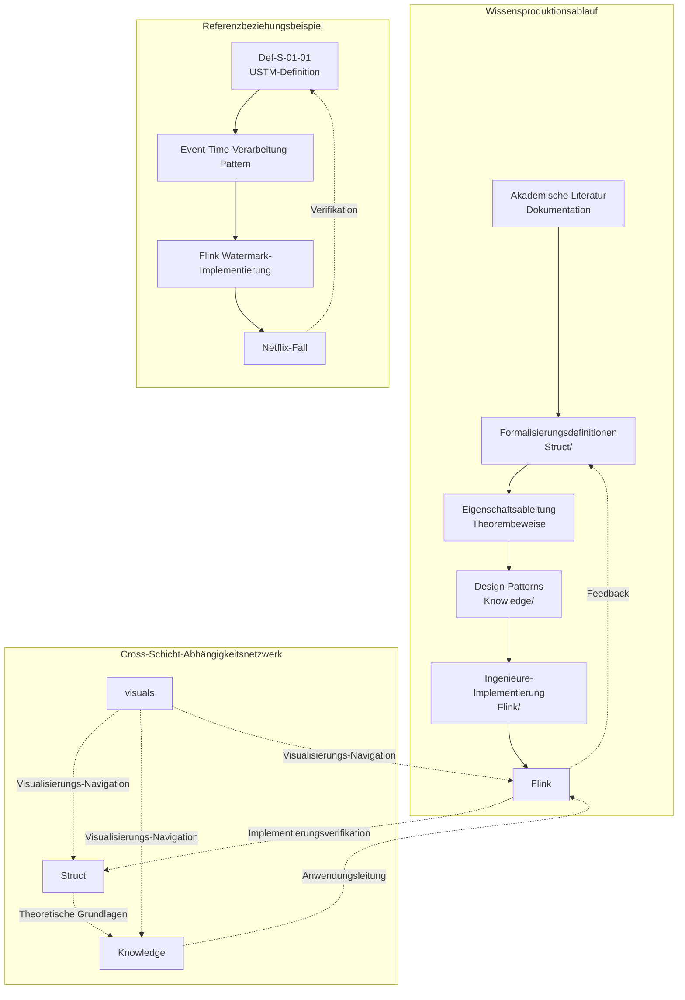

**Abhängigkeitsregeln**:

1. **Unidirektionale Abhängigkeitsprinzip**: Struct → Knowledge → Flink, zirkuläre Abhängigkeiten vermeiden
2. **Feedback-Verifikationsmechanismus**: Flink-Ingenieurpraxis verifiziert Struct-Theorie
3. **Visualisierungs-Navigation**: visuals/ als Navigationsschicht kann alle Schichten referenzieren

---

## 2. Dokumentengenerierungsarchitektur

### 2.1 Markdown-Verarbeitungsablauf

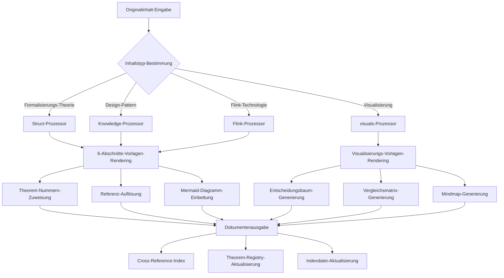

**Verarbeitungsphasen-Erklärung**:

| Phase | Funktion | Ausgabe |
|-------|----------|---------|
| **Inhaltsanalyse** | Dokumententyp-Erkennung, Metadaten-Extraktion | Dokumenten-Objektbaum |
| **Vorlagen-Rendering** | 6-Abschnitte-Vorlage oder Visualisierungs-Vorlage anwenden | Strukturiertes Markdown |
| **Nummern-Zuweisung** | Theorem/Definition/Lemma-Nummern zuweisen | Global eindeutige Kennung |
| **Referenz-Auflösung** | Interne/externe Referenzen auflösen | Link-Zuordnungstabelle |
| **Diagramm-Einbettung** | Mermaid-Diagramme generieren | Visualisierungs-Codeblöcke |
| **Index-Aktualisierung** | Registrierung und Indizes aktualisieren | THEOREM-REGISTRY.md |

### 2.2 Mermaid-Diagramm-Rendering

**Diagrammtypen und Anwendungsszenarien**:

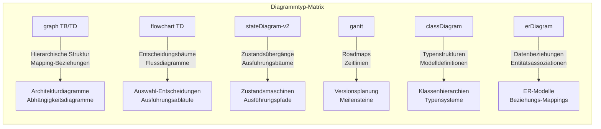

**Diagramm-Rendering-Spezifikation**:

```markdown
## 7. Visualisierungen (Visualizations)

### 7.1 Hierarchisches Strukturdiagramm

Das folgende Diagramm zeigt die hierarchische Struktur von XXX:

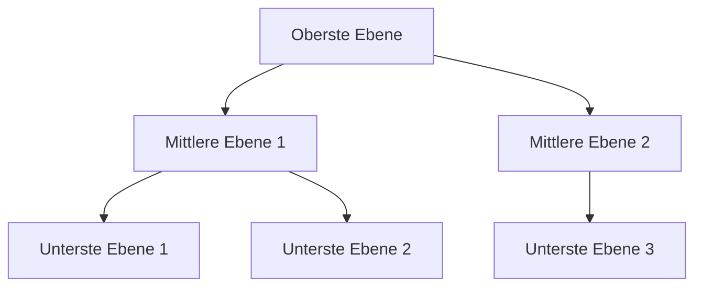

### 7.2 Entscheidungsablaufdiagramm

Der folgende Entscheidungsbaum hilft bei der Auswahl von XXX:

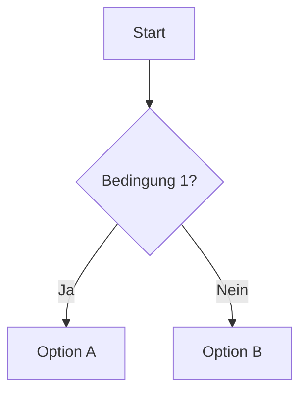
```

**Rendering-Regeln**:
1. Jedes Diagramm muss vorangestellten Text haben
2. Jedes Diagramm muss klaren Typ-Auswahlgrund haben
3. Komplexe Diagramme benötigen Legenden-Erklärungen
4. Diagramm-Semantik muss mit Textbeschreibung übereinstimmen

---

## 3. Verifikationssystemarchitektur

### 3.1 Verifikationsskript-Architektur

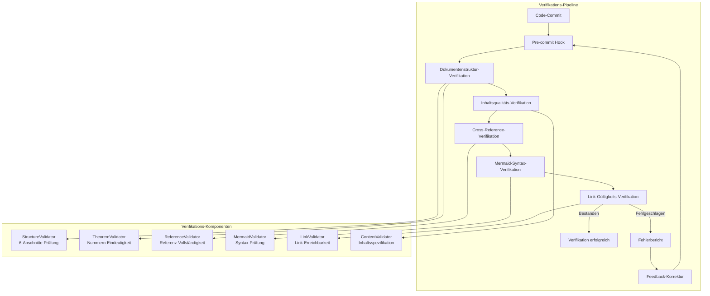

**Detaillierte Verifikationskomponenten-Erklärung**:

| Verifikationskomponente | Verantwortung | Verifikationsregeln |
|------------------------|---------------|---------------------|
| **StructureValidator** | 6-Abschnitte-Struktur-Prüfung | Muss 8 Abschnitte enthalten, Reihenfolge muss korrekt sein |
| **TheoremValidator** | Theorem-Nummern-Eindeutigkeit | Globale Nummern dürfen nicht kollidieren, Format muss korrekt sein |
| **ReferenceValidator** | Referenz-Vollständigkeit | Interne Links müssen gültig sein, externe Links müssen erreichbar sein |
| **MermaidValidator** | Mermaid-Syntax-Prüfung | Diagramm-Syntax muss korrekt sein, renderbar sein |
| **LinkValidator** | Link-Gültigkeit | HTTP 200-Antwort, keine toten Links |
| **ContentValidator** | Inhaltsspezifikation | Begriffe müssen konsistent sein, Format muss einheitlich sein |

### 3.2 CI/CD-Ablauf

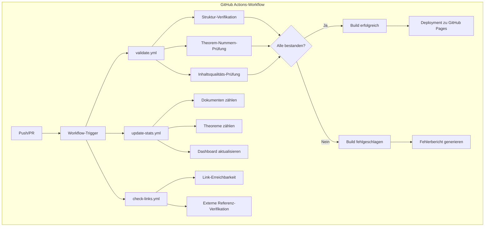

**Workflow-Konfiguration** (`.github/workflows/`):

| Workflow-Datei | Auslösebedingung | Verantwortung |
|----------------|------------------|---------------|
| `validate.yml` | Push, PR | Dokumentenstruktur, Theorem-Nummern, Inhaltsqualitäts-Verifikation |
| `update-stats.yml` | Push zu main | Statistik-Update, Dashboard-Aktualisierung |
| `check-links.yml` | Täglich geplant | Externe Link-Gültigkeits-Prüfung |

### 3.3 Qualitäts-Gate

```mermaid
flowchart TD
    subgraph "Qualitäts-Gate-Prüfpunkte"
        direction TB

        Q1[Gate 1: 6-Abschnitte-Prüfung] -->|Muss enthalten| Q1a[Konzeptdefinition]
        Q1 -->|Muss enthalten| Q1b[Eigenschaftsableitung]
        Q1 -->|Muss enthalten| Q1c[Beziehungsaufbau]
        Q1 -->|Muss enthalten| Q1d[Argumentationsprozess]
        Q1 -->|Muss enthalten| Q1e[Formalisierter Beweis]
        Q1 -->|Muss enthalten| Q1f[Beispielverifikation]
        Q1 -->|Muss enthalten| Q1g[Visualisierung]
        Q1 -->|Muss enthalten| Q1h[Referenzen]

        Q2[Gate 2: Nummern-Spezifikation] --> Q2a[Format: Thm-S-XX-XX]
        Q2 --> Q2b[Globale Eindeutigkeit]
        Q2 --> Q2c[Kontinuierliche Nummern]

        Q3[Gate 3: Visualisierungs-Anforderungen] --> Q3a[Mindestens 1 Mermaid-Diagramm]
        Q3 --> Q3b[Textbeschreibung vor Diagramm]
        Q3 --> Q3c[Korrekte Syntax]

        Q4[Gate 4: Referenz-Spezifikation] --> Q4a[Externe Referenzen verifizierbar]
        Q4 --> Q4b[Interne Links gültig]
        Q4 --> Q4c[Einheitliches Referenzformat]

        Q5[Gate 5: Begriffskonsistenz] --> Q5a[Übereinstimmung mit Glossar]
        Q5 --> Q5b[Abkürzungsspezifikation]
        Q5 --> Q5c[Deutsch-Englisch-Gegenüberstellung]
    end
```

---

## 4. Speicherarchitektur

### 4.1 Dateiorganisationsstruktur

```mermaid
graph TB
    subgraph "Projektstammverzeichnis"
        Root[AnalysisDataFlow/]

        Root --> Config[Konfigurationsdateien]
        Root --> Core[Kernverzeichnisse]
        Root --> Meta[Metadaten]
        Root --> CI[CI/CD]
    end

    subgraph "Konfigurationsdateien"
        Config --> README[README.md<br/>Projektübersicht]
        Config --> AGENTS[AGENTS.md<br/>Agent-Spezifikation]
        Config --> ARCH[ARCHITECTURE.md<br/>Architekturdokumentation]
        Config --> License[LICENSE<br/>Lizenz]
    end

    subgraph "Kernverzeichnisse"
        Core --> Struct[Struct/<br/>43 Dokumente]
        Core --> Knowledge[Knowledge/<br/>110 Dokumente]
        Core --> Flink[Flink/<br/>117 Dokumente]
        Core --> Visuals[visuals/<br/>20 Dokumente]
    end

    subgraph "Metadaten"
        Meta --> Tracking[PROJECT-TRACKING.md<br/>Fortschritts-Dashboard]
        Meta --> Version[PROJECT-VERSION-TRACKING.md<br/>Versionsverfolgung]
        Meta --> Registry[THEOREM-REGISTRY.md<br/>Theorem-Registry]
        Meta --> Reports[FINAL-*.md<br/>Abschlussberichte]
    end

    subgraph "CI/CD"
        CI --> Workflows[.github/workflows/<br/>Workflow-Definitionen]
        CI --> Scripts[scripts/<br/>Verifikationsskripte]
    end
```

**Datei-Benennungskonvention**:

```
{Schichtnummer}.{Nummer}-{Themen-Schluesselwort}.md

Beispiele:
- 01.01-unified-streaming-theory.md    (Struct/01-foundation/)
- 02-design-patterns-overview.md        (Knowledge/02-design-patterns/)
- checkpoint-mechanism-deep-dive.md     (Flink/02-core/)
```

### 4.2 Indexsystem

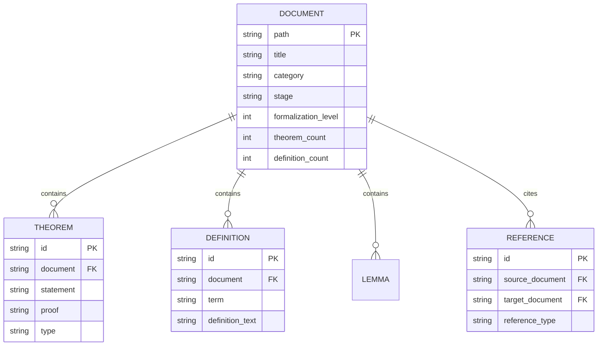

**Indexdatei-System**:

| Indexdatei | Verantwortung | Aktualisierungshäufigkeit |
|------------|---------------|---------------------------|
| `THEOREM-REGISTRY.md` | Projektweite Theorem/Definition/Lemma-Registry | Jedes neue Dokument |
| `PROJECT-TRACKING.md` | Fortschritts-Dashboard, Aufgabenstatus | Jede Iteration |
| `PROJECT-VERSION-TRACKING.md` | Versionshistorie, Änderungsprotokoll | Jede Version |
| `Struct/00-INDEX.md` | Struct-Verzeichnis-Index | Jeder neue Dokumentenstapel |
| `Knowledge/00-INDEX.md` | Knowledge-Verzeichnis-Index | Jeder neue Dokumentenstapel |
| `Flink/00-INDEX.md` | Flink-Verzeichnis-Index | Jeder neue Dokumentenstapel |
| `visuals/index-visual.md` | Visualisierungs-Navigations-Index | Neue Visualisierung |

### 4.3 Versionsverwaltung

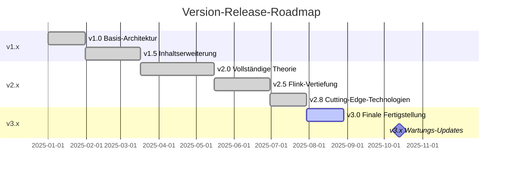

**Versionsverwaltungsstrategie**:

| Versionsnummer | Bedeutung | Aktualisierungsinhalt |
|----------------|-----------|----------------------|
| **Major** (X.0) | Große Architekturänderungen | Verzeichnisstruktur-Anpassungen, Nummerierungssystem-Änderungen |
| **Minor** (x.X) | Funktionserweiterungen | Neue Dokumentenstapel, neue Themenabdeckung |
| **Patch** (x.x.X) | Korrektur-Optimierungen | Fehlerkorrekturen, Link-Updates, Format-Optimierungen |

---

## 5. Erweiterungsarchitektur

### 5.1 Hinzufügen neuer Dokumente

```mermaid
flowchart TD
    subgraph "Neues-Dokument-Hinzufügen-Ablauf"
        A[Dokumententyp bestimmen] --> B{Verzeichnis auswählen}

        B -->|Formalisierungs-Theorie| C[Struct/]
        B -->|Design-Pattern| D[Knowledge/]
        B -->|Flink-Technologie| E[Flink/]
        B -->|Visualisierung| F[visuals/]

        C --> G[Unterverzeichnis auswählen<br/>01-08]
        D --> H[Unterverzeichnis auswählen<br/>01-09]
        E --> I[Unterverzeichnis auswählen<br/>01-15]
        F --> J[Unterverzeichnis auswählen<br/>decision-trees usw.]

        G & H & I & J --> K[Nummer zuweisen]
        K --> L[Datei erstellen<br/>{Schichtnummer}.{Nummer}-{Thema}.md]
        L --> M[6-Abschnitte-Vorlage anwenden]
        M --> N[Theorem-Nummern zuweisen]
        N --> O[Inhalt erstellen]
        O --> P[Mermaid-Diagramm hinzufügen]
        P --> Q[Verifizieren und commiten]
    end
```

### 5.2 Hinzufügen neuer Visualisierungen

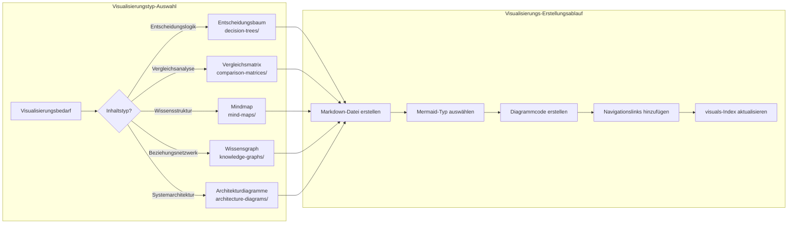

---

## Anhang

### A. Glossar

| Begriff | Englisch | Beschreibung |
|---------|----------|--------------|
| 6-Abschnitte-Vorlage | Six-Section Template | Standard-Dokumentstruktur-Vorlage |
| USTM | Unified Streaming Theory Model | Einheitliches Stream-Computing-Theorie-Modell |
| Def-* | Definition | Präfix für formalisierte Definitionsnummern |
| Thm-* | Theorem | Präfix für Theorem-Nummern |
| Lemma-* | Lemma | Präfix für Lemma-Nummern |
| Prop-* | Proposition | Präfix für Propositionsnummern |
| Cor-* | Corollary | Präfix für Korollar-Nummern |

### B. Verzeichnis-Zuordnungstabelle

| Verzeichnis-Code | Vollständiger Pfad | Verwendung |
|------------------|--------------------|------------|
| S | Struct/ | Formalisierte Theorie |
| K | Knowledge/ | Wissensanwendung |
| F | Flink/ | Ingenieure-Implementierung |
| V | visuals/ | Visualisierungs-Navigation |

### C. Verwandte Dokumente

- [AGENTS.md](../../AGENTS.md) - Agent-Arbeitskontext-Spezifikation
- [PROJECT-TRACKING.md](../../PROJECT-TRACKING.md) - Projektfortschrittsverfolgung
- [THEOREM-REGISTRY.md](../../THEOREM-REGISTRY.md) - Theorem-Registry
- [README.md](../../README.md) - Projektübersicht

---

*Dieses Dokument wird von der AnalysisDataFlow-Architekturgruppe gepflegt, letzte Aktualisierung: 2026-04-03*

---

> **Übersetzer-Hinweis**: Dieses Dokument wurde im deutschen technischen Dokumentationsstil übersetzt. Architektur-Fachbegriffe, Systemkomponenten-Namen und Konfigurationsparameter sind identisch mit dem Original. Letztes Update: 2026-04-11

