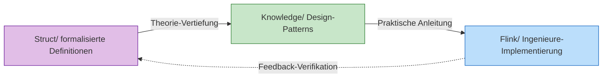
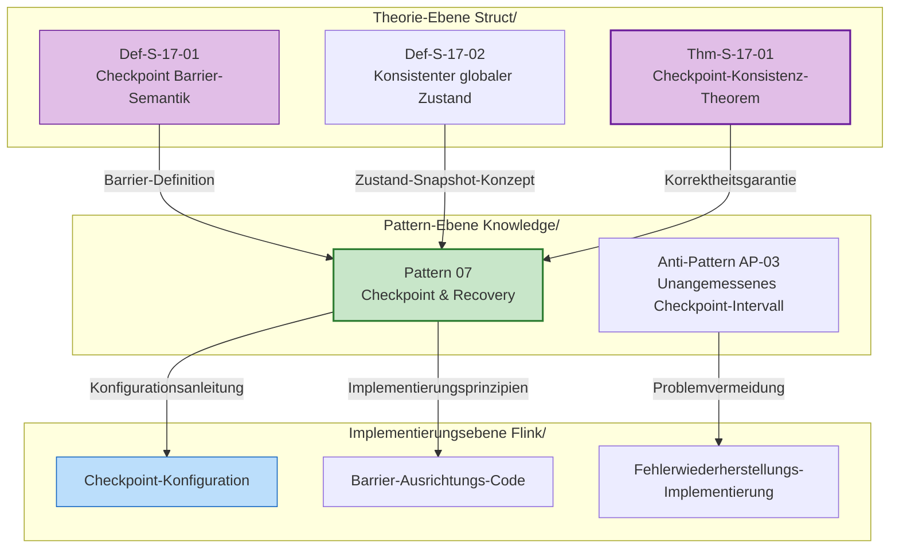

# AnalysisDataFlow Schnellstart-Leitfaden

> **Projekt in 5 Minuten verstehen | Rollen-basierte Pfade | Schneller Problemindex**
>
> 📊 **254 Dokumente | 945 formalisierte Elemente | 100% Fertigstellung**

---

## 1. Schnelles Verständnis in 5 Minuten

### 1.1 Was ist das Projekt

**AnalysisDataFlow** ist die **einheitliche Wissensdatenbank** im Bereich Stream-Computing – eine Full-Stack-Wissensstruktur von formalisierter Theorie bis zur Ingenieurpraxis.

```
┌─────────────────────────────────────────────────────────────┐
│                    Wissenshierarchie-Pyramide               │
├─────────────────────────────────────────────────────────────┤
│  L6 Produktions-Implementierung │ Flink/ Code, Config, Cases│
├────────────────────────────────┼────────────────────────────┤
│  L4-L5 Patterns                │ Knowledge/ Design-Patterns │
├────────────────────────────────┼────────────────────────────┤
│  L1-L3 Theorie                 │ Struct/ Theoreme, Beweise  │
└────────────────────────────────┴────────────────────────────┘
```

**Kernwerte**:

- 🔬 **Theoretische Fundierung**: Formalisierte Theoreme garantieren die Korrekheit ingenieurtechnischer Entscheidungen
- 🛠️ **Praktische Anleitung**: Vollständiger Mapping-Pfad vom Theorem zum Code
- 🔍 **Problemdiagnose**: Schnelle Lokalisierung von Lösungen nach Symptomen

---

### 1.2 Drei-Hauptverzeichnis-Struktur

| Verzeichnis | Positionierung | Inhaltsmerkmale | Für wen |
|-------------|----------------|-----------------|---------|
| **Struct/** | Formalisierte theoretische Grundlagen | Mathematische Definitionen, Theorembeweise, strenge Argumentation | Forscher, Architekten |
| **Knowledge/** | Ingenieurpraxis-Wissen | Design-Patterns, Geschäftsszenarien, Technologieauswahl | Architekten, Ingenieure |
| **Flink/** | Flink-spezialisierte Technologie | Architekturmechanismen, SQL/API, Ingenieurpraxis | Entwicklungsingenieure |

**Wissensfluss-Beziehungen**:



---

### 1.3 Kernmerkmale

#### Sechs-Abschnitte-Dokumentenvorlage (Pflichtstruktur)

Jedes Kerndokument muss enthalten:

| Abschnitt | Inhalt | Beispiel |
|-----------|--------|----------|
| 1. Konzeptdefinition | Strikte formalisierte Definition + Intuitive Erklärung | `Def-S-04-04` Watermark-Semantik |
| 2. Eigenschaftsableitung | Aus Definitionen abgeleitete Lemmata und Eigenschaften | `Lemma-S-04-02` Monotonie-Lemma |
| 3. Beziehungsaufbau | Verbindungen zu anderen Konzepten/Modellen | Flink→Prozesskalkül-Kodierung |
| 4. Argumentationsprozess | Hilfstheoreme, Gegenbeispielanalyse | Grenzbedingungsdiskussion |
| 5. Formalisierter Beweis | Vollständiger Beweis des Haupttheorems | `Thm-S-17-01` Checkpoint-Konsistenz |
| 6. Beispielverifizierung | Vereinfachte Beispiele, Code-Snippets | Flink-Konfigurationsbeispiel |
| 7. Visualisierung | Mermaid-Diagramme | Architekturdiagramme, Flussdiagramme |
| 8. Referenzen | Zitate aus maßgeblichen Quellen | VLDB/SOSP-Papers |

#### Theorem-Nummerierungssystem

Global einheitliche Nummerierung: `{Typ}-{Stufe}-{Dokumentennummer}-{Sequenznummer}`

| Nummerierungsbeispiel | Bedeutung | Position |
|-----------------------|-----------|----------|
| `Thm-S-17-01` | Struct-Stufe, Dokument 17, 1. Theorem | Checkpoint-Korrektheitsbeweis |
| `Def-K-02-01` | Knowledge-Stufe, Dokument 02, 1. Definition | Event-Time-Processing-Pattern |
| `Thm-F-12-01` | Flink-Stufe, Dokument 12, 1. Theorem | Online-Learning-Parameter-Konvergenz |

**Schnelle Merkhilfe**:

- **Thm** = Theorem | **Def** = Definition | **Lemma** = Lemma | **Prop** = Proposition
- **S** = Struct (Theorie) | **K** = Knowledge (Wissen) | **F** = Flink (Implementierung)

---

## 2. Rollen-basierte Lesepfade

### 2.1 Architektenpfad (3-5 Tage)

**Ziel**: Systemdesign-Methodologie beherrschen, Technologieauswahl und Architekturentscheidungen treffen

```
Tag 1-2: Konzept-Fundierung
├── Struct/01-foundation/01.01-unified-streaming-theory.md
│   └── Fokus: Sechs-Schichten-Ausdruckshierarchie (L1-L6)
├── Knowledge/01-concept-atlas/concurrency-paradigms-matrix.md
│   └── Fokus: Fünf-Nebenläufigkeits-Paradigmen-Vergleichsmatrix
└── Knowledge/01-concept-atlas/streaming-models-mindmap.md
    └── Fokus: Stream-Computing-Modell 6-Dimensional-Vergleich

Tag 3-4: Patterns und Auswahl
├── Knowledge/02-design-patterns/ (alles durchsehen)
│   └── Fokus: Beziehungsdiagramm der 7 Kern-Patterns
├── Knowledge/04-technology-selection/engine-selection-guide.md
│   └── Fokus: Stream-Processing-Engine-Auswahl-Entscheidungsbaum
└── Knowledge/04-technology-selection/streaming-database-guide.md
    └── Fokus: Stream-Datenbank-Vergleichsmatrix

Tag 5: Architekturentscheidungen
├── Flink/01-architecture/flink-1.x-vs-2.0-comparison.md
│   └── Fokus: Architektur-Evolution und Migrationsentscheidungen
└── Struct/03-relationships/03.03-expressiveness-hierarchy.md
    └── Fokus: Ausdruckskraft und Ingenieur-Beschränkungen
```

---

### 2.2 Entwicklungsingenieur-Pfad (1-2 Wochen)

**Ziel**: Flink-Kerntechnologien beherrschen, produktionsreife Stream-Processing-Anwendungen entwickeln können

```
Woche 1: Schnellstart
├── Tag 1: Flink/05-vs-competitors/flink-vs-spark-streaming.md
│   └── Flink-Positionierung und Stärken
├── Tag 2-3: Flink/02-core-mechanisms/time-semantics-and-watermark.md
│   └── Event-Time, Watermark-Mechanismus
├── Tag 4: Knowledge/02-design-patterns/pattern-event-time-processing.md
│   └── Event-Time-Processing-Pattern
└── Tag 5: Flink/04-connectors/kafka-integration-patterns.md
    └── Kafka-Integration Best Practices

Woche 2: Kernmechanismen vertiefen
├── Tag 1-2: Flink/02-core-mechanisms/checkpoint-mechanism-deep-dive.md
│   └── Checkpoint-Mechanismus, Fehlerwiederherstellung
├── Tag 3: Flink/02-core-mechanisms/exactly-once-end-to-end.md
│   └── Exactly-Once-Implementierungsprinzipien
├── Tag 4: Flink/02-core-mechanisms/backpressure-and-flow-control.md
│   └── Backpressure-Behandlung und Flusskontrolle
└── Tag 5: Flink/06-engineering/performance-tuning-guide.md
    └── Performance-Tuning in der Praxis
```

---

### 2.3 Forscherpfad (2-4 Wochen)

**Ziel**: Theoretische Grundlagen verstehen, Formalisierungsmethoden beherrschen, innovative Forschung betreiben können

```
Woche 1-2: Theoretische Grundlagen
├── Struct/01-foundation/01.02-process-calculus-primer.md
│   └── CCS/CSP/π-Kalkül Grundlagen
├── Struct/01-foundation/01.04-dataflow-model-formalization.md
│   └── Dataflow strikte Formalisierung
├── Struct/01-foundation/01.03-actor-model-formalization.md
│   └── Actor-Modell formale Semantik
└── Struct/02-properties/02.03-watermark-monotonicity.md
    └── Watermark-Monotonie-Theorem

Woche 3: Modellbeziehungen und Kodierung
├── Struct/03-relationships/03.01-actor-to-csp-encoding.md
│   └── Actor→CSP-Kodierungserhaltung
├── Struct/03-relationships/03.02-flink-to-process-calculus.md
│   └── Flink→Prozesskalkül-Kodierung
└── Struct/03-relationships/03.03-expressiveness-hierarchy.md
    └── Sechs-Schichten-Ausdruckshierarchie-Theorem

Woche 4: Formalisierte Beweise und Cutting-Edge
├── Struct/04-proofs/04.01-flink-checkpoint-correctness.md
│   └── Checkpoint-Konsistenzbeweis
├── Struct/04-proofs/04.02-flink-exactly-once-correctness.md
│   └── Exactly-Once-Korrektheitsbeweis
└── Struct/06-frontier/06.02-choreographic-streaming-programming.md
    └── Choreographic-Programming Cutting-Edge
```

---

### 2.4 Studentenpfad (1-2 Monate)

**Ziel**: Schrittweise Aufbau einer vollständigen Wissensstruktur, von Einsteiger bis Experte

```
Monat 1: Grundlagenaufbau
├── Woche 1: Nebenläufigkeits-Computing-Modelle
│   ├── Struct/01-foundation/01.02-process-calculus-primer.md
│   ├── Struct/01-foundation/01.03-actor-model-formalization.md
│   └── Struct/01-foundation/01.05-csp-formalization.md
├── Woche 2: Stream-Computing Grundlagen
│   ├── Struct/01-foundation/01.04-dataflow-model-formalization.md
│   ├── Knowledge/01-concept-atlas/streaming-models-mindmap.md
│   └── Flink/02-core-mechanisms/time-semantics-and-watermark.md
├── Woche 3: Kerneigenschaften
│   ├── Struct/02-properties/02.01-determinism-in-streaming.md
│   ├── Struct/02-properties/02.02-consistency-hierarchy.md
│   └── Knowledge/02-design-patterns/pattern-event-time-processing.md
└── Woche 4: Pattern-Praxis
    ├── Knowledge/02-design-patterns/ (alle)
    └── Knowledge/03-business-patterns/ (Auswahl)

Monat 2: Vertiefung und Erweiterung
├── Woche 5-6: Flink-Ingenieurpraxis
│   ├── Flink/02-core-mechanisms/ (alle Kern-Dokumente)
│   └── Flink/06-engineering/performance-tuning-guide.md
├── Woche 7: Einführung in formalisierte Beweise
│   ├── Struct/04-proofs/04.01-flink-checkpoint-correctness.md
│   └── Struct/04-proofs/04.03-chandy-lamport-consistency.md
└── Woche 8: Cutting-Edge-Exploration
    ├── Knowledge/06-frontier/streaming-databases.md
    └── Knowledge/06-frontier/rust-streaming-ecosystem.md
```

---

## 3. Schnell-Suchindex

### 3.1 Themen-basierter Index

#### Stream-Processing Grundlagen

| Thema | Pflichtlektüre | Formalisierte Grundlagen |
|-------|----------------|--------------------------|
| **Event-Time-Verarbeitung** | Knowledge/02-design-patterns/pattern-event-time-processing.md | `Def-S-04-04` Watermark-Semantik |
| **Window-Berechnung** | Knowledge/02-design-patterns/pattern-windowed-aggregation.md | `Def-S-04-05` Window-Operator |
| **Zustandsverwaltung** | Knowledge/02-design-patterns/pattern-stateful-computation.md | `Thm-S-17-01` Checkpoint-Konsistenz |
| **Checkpoint** | Knowledge/02-design-patterns/pattern-checkpoint-recovery.md | `Thm-S-18-01` Exactly-Once-Korrektheit |
| **Konsistenzebenen** | Struct/02-properties/02.02-consistency-hierarchy.md | `Def-S-08-01~04` AM/AL/EO-Semantik |

#### Design-Patterns

| Pattern | Anwendungsszenario | Komplexität | Dokument |
|---------|-------------------|-------------|----------|
| P01 Event Time | Ungeordnete Datenverarbeitung | ★★★☆☆ | pattern-event-time-processing.md |
| P02 Windowed Aggregation | Window-Aggregationsberechnung | ★★☆☆☆ | pattern-windowed-aggregation.md |
| P03 CEP | Komplexe Event-Erkennung | ★★★★☆ | pattern-cep-complex-event.md |
| P04 Async I/O | Externe Datenverknüpfung | ★★★☆☆ | pattern-async-io-enrichment.md |
| P05 State Management | Zustandsbehaftete Berechnung | ★★★★☆ | pattern-stateful-computation.md |
| P06 Side Output | Datenabzweigung | ★★☆☆☆ | pattern-side-output.md |
| P07 Checkpoint | Fehlertoleranz | ★★★★★ | pattern-checkpoint-recovery.md |

#### Cutting-Edge-Technologien

| Technologie-Richtung | Kerndokumente | Technologie-Stack |
|---------------------|---------------|-------------------|
| **Stream-Datenbanken** | Knowledge/06-frontier/streaming-databases.md | RisingWave, Materialize |
| **Rust-Stream-Ökosystem** | Knowledge/06-frontier/rust-streaming-ecosystem.md | Arroyo, Timeplus |
| **Echtzeit-RAG** | Knowledge/06-frontier/real-time-rag-architecture.md | Flink + Vektordatenbanken |
| **Streaming Lakehouse** | Knowledge/06-frontier/streaming-lakehouse-iceberg-delta.md | Flink + Iceberg/Paimon |
| **Edge-Stream-Processing** | Knowledge/06-frontier/edge-streaming-patterns.md | Edge-Computing-Architektur |
| **Streaming Materialized Views** | Knowledge/06-frontier/streaming-materialized-view-architecture.md | Echtzeit-Data-Warehouse |

---

### 3.2 Problem-basierter Index

#### Checkpoint-bezogene Probleme

| Problemsymptom | Lösung | Referenzdokument |
|----------------|--------|------------------|
| Checkpoint häufige Zeitüberschreitung | Inkrementellen Checkpoint aktivieren, RocksDB verwenden | checkpoint-mechanism-deep-dive.md |
| Ausrichtungszeit zu lang | Unaligned Checkpoint aktivieren, Debloating anpassen | checkpoint-mechanism-deep-dive.md |
| Langsame Wiederherstellung | Lokale Wiederherstellung, inkrementelle Wiederherstellung | checkpoint-mechanism-deep-dive.md |
| Zustand zu groß | Inkrementeller Checkpoint, Zustands-TTL | flink-state-ttl-best-practices.md |

#### Backpressure-Behandlung

| Problemsymptom | Lösung | Referenzdokument |
|----------------|--------|------------------|
| Starker Backpressure | Credit-basierte Flusskontrolle optimieren, Parallelität erhöhen | backpressure-and-flow-control.md |
| Source-Backpressure | Langsame Downstream-Verarbeitung, Parallelität hinzufügen oder optimieren | performance-tuning-guide.md |
| Sink-Backpressure | Batch-Optimierung, asynchrone Schreibvorgänge | performance-tuning-guide.md |

#### Daten-Skew

| Problemsymptom | Lösung | Referenzdokument |
|----------------|--------|------------------|
| Hot-Key | Salting, Zwei-Phasen-Aggregation, benutzerdefinierter Partitionierer | performance-tuning-guide.md |
| Window-Skew | Benutzerdefinierter Window-Assigner, Verzögerungserlaubnis | pattern-windowed-aggregation.md |

#### Exactly-Once-Probleme

| Problemsymptom | Lösung | Referenzdokument |
|----------------|--------|------------------|
| Datenduplizierung | Sink-Idempotenz prüfen, 2PC-Konfiguration | exactly-once-end-to-end.md |
| Datenverlust | Source-Wiedergabefähigkeit prüfen, Checkpoint-Intervall | exactly-once-end-to-end.md |

---

### 3.3 Häufig verwendete Dokumente – Schnelllinks

#### Kernindex-Seiten

| Index | Verwendung | Pfad |
|-------|------------|------|
| **Projektübersicht** | Gesamtes Projektverständnis | [README.md](../../README.md) |
| **Struct-Index** | Formalisierte Theorie-Navigation | [Struct/00-INDEX.md](../../Struct/00-INDEX.md) |
| **Knowledge-Index** | Ingenieurpraxis-Wissen-Navigation | [Knowledge/00-INDEX.md](../../Knowledge/00-INDEX.md) |
| **Flink-Index** | Flink-spezialisierte Technologie-Navigation | [Flink/00-INDEX.md](../../Flink/00-INDEX.md) |
| **Theorem-Registry** | Formalisierte Elemente Global-Index | [THEOREM-REGISTRY.md](../../THEOREM-REGISTRY.md) |
| **Fortschrittsverfolgung** | Projektfortschritt und Statistiken | [PROJECT-TRACKING.md](../../PROJECT-TRACKING.md) |

#### Schnelle Entscheidungshilfen

| Entscheidungstyp | Referenzdokument |
|------------------|------------------|
| Stream-Processing-Engine-Auswahl | Knowledge/04-technology-selection/engine-selection-guide.md |
| Flink vs Spark Auswahl | Flink/05-vs-competitors/flink-vs-spark-streaming.md |
| Flink vs RisingWave Auswahl | Knowledge/04-technology-selection/flink-vs-risingwave.md |
| SQL vs DataStream API | Flink/03-sql-table-api/sql-vs-datastream-comparison.md |
| State-Backend-Auswahl | Flink/06-engineering/state-backend-selection.md |
| Stream-Datenbank-Auswahl | Knowledge/04-technology-selection/streaming-database-guide.md |

#### Produktions-Fehlerbehebung

| Fehlertyp | Fehlerbehebungsdokument |
|-----------|-------------------------|
| Checkpoint-Probleme | Flink/02-core-mechanisms/checkpoint-mechanism-deep-dive.md |
| Backpressure-Probleme | Flink/02-core-mechanisms/backpressure-and-flow-control.md |
| Performance-Tuning | Flink/06-engineering/performance-tuning-guide.md |
| Speicherüberlauf | Flink/06-engineering/performance-tuning-guide.md |
| Exactly-Once-Ausfall | Flink/02-core-mechanisms/exactly-once-end-to-end.md |

---

## 4. Beispiel: Von der Theorie zur Praxis

### Wissensfluss-Beispiel: Checkpoint-Konsistenz



### Vollständiger Wissenslink

```
┌─────────────────────────────────────────────────────────────────────┐
│                        Checkpoint-Wissenslink                        │
├─────────────────────────────────────────────────────────────────────┤
│                                                                     │
│  1. Formalisierte Definitionen (Struct/)                            │
│     Def-S-17-01: Checkpoint Barrier Semantik                       │
│     Def-S-17-02: Konsistenter globaler Zustand G = <𝒮, 𝒞>          │
│     Def-S-17-03: Checkpoint Ausrichtungsdefinition                  │
│                                                                     │
│           ↓ Theorem-Garantie                                        │
│                                                                     │
│  2. Formalisierte Beweise (Struct/)                                 │
│     Thm-S-17-01: Flink Checkpoint-Konsistenz-Theorem                │
│     Lemma-S-17-01: Barrier-Propagations-Invariante                  │
│     Lemma-S-17-02: Zustandskonsistenz-Lemma                         │
│                                                                     │
│           ↓ Pattern-Extraktion                                      │
│                                                                     │
│  3. Design-Patterns (Knowledge/)                                    │
│     Pattern 07: Checkpoint & Recovery Pattern                       │
│     - Checkpoint-Intervall-Auswahlanleitung                         │
│     - State-Backend-Auswahl-Matrix                                  │
│     - Wiederherstellungsstrategie-Entscheidungsbaum                 │
│                                                                     │
│           ↓ Ingenieure-Implementierung                              │
│                                                                     │
│  4. Flink-Implementierung (Flink/)                                  │
│     - Checkpoint-Konfigurationsparameter                            │
│     - RocksDB State-Backend-Konfiguration                           │
│     - Inkrementellen Checkpoint aktivieren                          │
│     - Unaligned Checkpoint-Konfiguration                            │
│                                                                     │
│           ↓ Produktionsverifizierung                                │
│                                                                     │
│  5. Fehlerbehebung                                                  │
│     - Checkpoint-Zeitüberschreitungsdiagnose                        │
│     - Ausrichtungszeit-Überschreitungsbehandlung                    │
│     - Anti-Pattern-Checkliste                                       │
│                                                                     │
└─────────────────────────────────────────────────────────────────────┘
```

### Code-Mapping-Beispiel

**Theorem** `Thm-S-17-01`: Barrier-Ausrichtung garantiert konsistenten Cut-Set

↓ Mapping

**Pattern** Pattern 07: Checkpoint-Intervall = max(Verarbeitungsverzögerungstoleranz, Zustandsgröße/Bandbreite)

↓ Mapping

**Flink-Konfiguration**:

```yaml
# flink-conf.yaml
execution.checkpointing.interval: 10s      # Basierend auf Theorem berechnet
execution.checkpointing.timeout: 60s       # Zustandsgröße/Bandbreite + Puffer
execution.checkpointing.mode: EXACTLY_ONCE # Thm-S-17-01-Garantie
state.backend: rocksdb                     # Großer Zustand-Szenario
state.backend.incremental: true            # Übertragungsoptimierung
```

---

## 5. Häufige Fragen – Schnellsuche

### 5.1 Wie finde ich bestimmte Themen

**Methode 1: Index-Navigation**

1. Zuerst [Struct/00-INDEX.md](../../Struct/00-INDEX.md) für theoretische Grundlagen konsultieren
2. Dann [Knowledge/00-INDEX.md](../../Knowledge/00-INDEX.md) für Design-Patterns
3. Schließlich [Flink/00-INDEX.md](../../Flink/00-INDEX.md) für Ingenieure-Implementierung

**Methode 2: Theorem-Nummern-Tracking**

1. Theorem-Nummer in [THEOREM-REGISTRY.md](../../THEOREM-REGISTRY.md) suchen
2. Dokument basierend auf Nummer lokalisieren (z.B. `Thm-S-17-01` → Struct/04-proofs/04.01)
3. Kreuzreferenzen zu verwandten Definitionen und Lemmata

**Methode 3: Problem-getrieben**

1. Abschnitt 3.2 „Problem-basierter Index" konsultieren
2. Lösung nach Symptom auswählen
3. Empfohlene Dokumente vertiefen lesen

---

### 5.2 Wie verstehe ich Theorem-Nummern

**Nummerierungsformat**: `{Typ}-{Stufe}-{Dokumentennummer}-{Sequenznummer}`

| Komponente | Wert | Bedeutung |
|------------|------|-----------|
| Typ | Thm/Def/Lemma/Prop/Cor | Theorem/Definition/Lemma/Proposition/Korollar |
| Stufe | S/K/F | Struct/Knowledge/Flink |
| Dokumentennummer | 01-99 | Dokumentennummer im Verzeichnis |
| Sequenznummer | 01-99 | Elementsequenz im Dokument |

**Beispielanalyse**:

- `Thm-S-17-01`: Struct-Stufe 04-proofs Verzeichnis, Dokument 17, 1. Theorem → Checkpoint-Konsistenz-Theorem
- `Def-K-02-01`: Knowledge-Stufe 02-design-patterns Verzeichnis, 1. Definition → Event-Time-Processing-Pattern
- `Lemma-F-12-02`: Flink-Stufe 12-ai-ml Verzeichnis, 2. Lemma → Online-Learning-bezogenes Lemma

---

### 5.3 Wie kann ich Inhalte beitragen

**Beitragsprinzipien**:

1. **Sechs-Abschnitte-Vorlage folgen**: Konzeptdefinition → Eigenschaftsableitung → Beziehungsaufbau → Argumentationsprozess → Formalisierter Beweis → Beispielverifizierung
2. **Einheitliche Nummerierung verwenden**: Neue Theoreme/Definitionen nach Regeln nummerieren, Konflikte vermeiden
3. **Cross-Directory-Referenzen aufrechterhalten**: Struct-Definitionen → Knowledge-Patterns → Flink-Implementierung
4. **Mermaid-Diagramme hinzufügen**: Jedes Dokument enthält mindestens eine Visualisierung

---

## Anhang: Schnellreferenz

### Sechs-Schichten-Ausdruckshierarchie

```
L₆: Turing-Complete (vollständig unentscheidbar) ── λ-Kalkül, Turing-Maschine
L₅: Higher-Order (meist unentscheidbar) ── HOπ, Ambient
L₄: Mobile (teilweise unentscheidbar) ── π-Kalkül, Actor
L₃: Prozess-Algebra (EXPTIME) ── CSP, CCS
L₂: Kontextfrei (PSPACE) ── PDA, BPA
L₁: Regulär (P-Complete) ── FSM, Regex
```

### Konsistenzebenen – Schnellreferenz

| Ebene | Definition | Implementierungsmechanismus | Anwendungsszenarien |
|-------|------------|----------------------------|---------------------|
| At-Most-Once (AM) | Effektzählung ≤ 1 | Deduplizierung/Idempotenz | Log-Aggregation, Monitoring |
| At-Least-Once (AL) | Effektzählung ≥ 1 | Retry/Wiedergabe | Empfehlungssysteme, Statistiken |
| Exactly-Once (EO) | Effektzählung = 1 | Source+Checkpoint+Transaktions-Sink | Finanztransaktionen, Bestellungen |

---

> 📌 **Hinweis**: Dieses Dokument ist ein Schnellstart-Leitfaden. Detaillierte Inhalte finden Sie in den jeweiligen Verzeichnis-Indexen und konkreten Dokumenten.
>
> 📅 **Letztes Update**: 2026-04-03 | 📝 **Version**: v1.0

---

> **Übersetzer-Hinweis**: Dieses Dokument wurde im deutschen technischen Dokumentationsstil übersetzt. Formalisierte Notationen, Theorem-Nummern und Code-Beispiele sind identisch mit dem Original. Letztes Update: 2026-04-11
