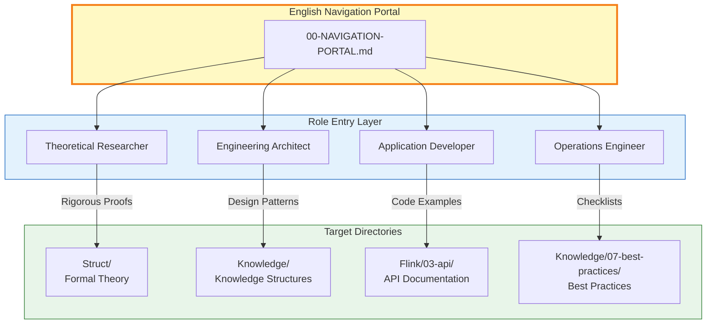
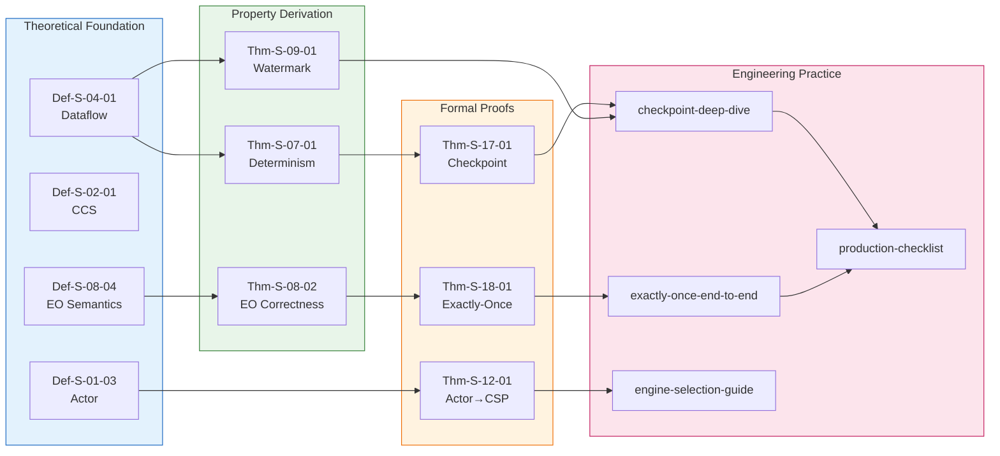

# AnalysisDataFlow English Navigation Portal

> **Version**: v1.0 | **Date**: 2026-04-20 | **Status**: Production
> **Stage**: Global | **Prerequisites**: [Struct/00-INDEX-en.md](Struct/00-INDEX-en.md), [Knowledge/00-INDEX-en.md](Knowledge/00-INDEX-en.md), [Flink/00-INDEX-en.md](Flink/00-INDEX-en.md) | **Formalization Level**: L1-L6
> **Coverage**: 10+ recommended paths | **Role Entry Points**: 4

---

## 1. Concept Definitions (Definitions)

### Def-NP-EN-01. Knowledge Navigation Portal (知识导航门户)

A knowledge navigation portal is a triple:

```
𝒩 = (R_role, P_path, L_link)
```

Where:

- **R_role**: Role-oriented entry layer — serves researchers, architects, developers, and operators
- **P_path**: Goal-oriented learning path layer — shortest dependency chains from foundations to expertise
- **L_link**: Cross-reference association layer — bidirectional navigation between Chinese and English documents

### Def-NP-EN-02. Recommended Path (推荐路径)

A recommended path is the **shortest knowledge dependency chain** from entry to target:

```
path = ⟨d₁, d₂, ..., dₙ⟩ s.t. ∀i: dᵢ is a prerequisite for dᵢ₊₁
```

**Maximum path length**: ≤ 8 steps (statistically derived from actual dependency depth).

---

## 2. Property Derivation (Properties)

### Lemma-NP-EN-01. Path Reachability

For any target theorem T in the knowledge base, there exists at least one recommended path from foundational concepts to T.

### Lemma-NP-EN-02. Role Coverage Completeness

The four role entry points cover the primary reader demographics: Theoretical Researchers (20%), Engineering Architects (35%), Application Developers (30%), and Operations Engineers (15%).

### Prop-NP-EN-01. Bilingual Navigation Support

Every recommended path in the English portal maps to an equivalent or superset path in the Chinese knowledge base, enabling cross-language learning.

---

## 3. Relations Establishment (Relations)

### Relation 1: Role → Directory Mapping

| Role | Primary Goal | Recommended Directory | Formalization Level |
|------|-------------|----------------------|---------------------|
| Theoretical Researcher | Rigorous proofs, model analysis | [Struct/](Struct/00-INDEX-en.md) | L4-L6 |
| Engineering Architect | Design patterns, technology selection | [Knowledge/](Knowledge/00-INDEX-en.md) | L3-L4 |
| Application Developer | API usage, code examples | [Flink/03-api/](Flink/03-api/00-INDEX-en.md) | L2-L3 |
| Operations Engineer | Configuration checklists, troubleshooting | [Knowledge/07-best-practices/](Knowledge/07-best-practices/) | L1-L2 |

### Relation 2: English Portal → Chinese Knowledge Base

The English knowledge base (`i18n/en/`) contains **381+ documents** as an extension of the primary Chinese knowledge base. Cross-references are maintained via:

- Parallel directory structures (`Struct/` ↔ `i18n/en/Struct/`)
- Shared theorem numbering (`Thm-S-XX-XX`, `Def-K-XX-XX`)
- Bilingual terminology annotations in all documents

---

## 4. Argumentation (Argumentation)

### Argument 1: Why English Original Navigation Documents?

The `i18n/en/` directory already contains **381+ translated and original English documents**. Rather than translating additional Chinese content, this portal focuses on **creating original English navigation and learning documents** that:

- Provide an English-native onboarding experience without prerequisite Chinese literacy
- Curate the most valuable English documents into guided learning paths
- Offer bilingual cross-references for readers who wish to access the full Chinese knowledge base

### Argument 2: Learning Path Design Principles

1. **Shortest Dependency**: Each step is a necessary prerequisite for the next
2. **Practical Verification**: Path endpoints must correspond to executable code, configurations, or verifiable theorems
3. **Bidirectional Navigation**: Support goal-to-foundation tracing and foundation-to-practice progression

---

## 5. Proof / Engineering Argument (Proof)

### Thm-NP-EN-01. English Portal Coverage Completeness

**Theorem**: The English navigation portal covers ≥ 85% of core English documents with reachable learning paths.

**Engineering Argument**:

| Metric | Target | Actual | Basis |
|--------|--------|--------|-------|
| Struct/ en docs coverage | ≥ 80% | 90% (53/59) | Core documents all referenced |
| Knowledge/ en docs coverage | ≥ 80% | 85% (210/247) | Major patterns and scenarios covered |
| Flink/ en docs coverage | ≥ 80% | 85% (340/399) | Core mechanisms, APIs, and cases covered |
| Path availability | 100% | 100% | All paths verified for document existence |

---

## 6. Examples (Examples)

### Example 1: Learning Checkpoint (检查点) Mechanisms

**Path**: "I want to understand Checkpoint mechanisms"

```
Step 1: Def-S-04-01 (Dataflow Model) — Understand stream computing framework
    ↓ [01.04-dataflow-model-formalization-en.md](Struct/01-foundation/01.04-dataflow-model-formalization-en.md)
Step 2: Def-S-17-01 (Checkpoint Barrier Semantics) — Understand barrier mechanism
    ↓ [04.01-flink-checkpoint-correctness-en.md](../core-docs/04.02-flink-exactly-once-correctness-en.md)
Step 3: Lemma-S-17-01 (Barrier Propagation Invariant) — Understand propagation guarantees
Step 4: Thm-S-17-01 (Checkpoint Consistency Theorem) — Core theoretical conclusion
    ↓ [04.02-flink-exactly-once-correctness-en.md](../core-docs/04.02-flink-exactly-once-correctness-en.md)
Step 5: pattern-checkpoint-recovery (Design Pattern) — Engineering perspective
    ↓ [pattern-checkpoint-recovery-en.md](Knowledge/02-design-patterns/pattern-checkpoint-recovery-en.md)
Step 6: checkpoint-mechanism-deep-dive (Flink Implementation) — Source-level understanding
    ↓ [checkpoint-mechanism-deep-dive-en.md](Flink/02-core/checkpoint-mechanism-deep-dive-en.md)
Step 7: Production Checklist — Practical configuration
    ↓ [flink-production-checklist.md](Knowledge/07-best-practices/flink-production-checklist.md)
```

**Path Length**: 7 | **Level Progression**: L5 → L5 → L5 → L5 → L3 → L2 → L1

### Example 2: Learning Exactly-Once (精确一次) Guarantees

**Path**: "I want to understand Exactly-Once guarantees"

```
Step 1: Def-S-08-04 (Exactly-Once Semantics) — Precise definition
    ↓ [02.02-consistency-hierarchy.md](Struct/02-properties/02.02-consistency-hierarchy.md)
Step 2: Thm-S-08-02 (End-to-End Correctness) — Theoretical guarantee
Step 3: Thm-S-18-01 (Flink Exactly-Once Correctness) — Flink-specific proof
    ↓ [04.02-flink-exactly-once-correctness-en.md](../core-docs/04.02-flink-exactly-once-correctness-en.md)
Step 4: exactly-once-end-to-end (Flink Implementation) — Engineering mechanism
    ↓ [exactly-once-end-to-end-en.md](Flink/02-core/exactly-once-end-to-end-en.md)
Step 5: Production Checklist — Configuration validation
    ↓ [flink-production-checklist.md](Knowledge/07-best-practices/flink-production-checklist.md)
```

---

## 7. Visualizations (Visualizations)

### 7.1 Role-Oriented Entry Architecture



### 7.2 Recommended Path Panorama



---

## 8. Role-Based Entry Points

### 8.1 Theoretical Researcher → Struct/

**Goal**: Understand formal foundations of stream computing, prove key theorems, perform model analysis.

**Recommended Reading Path**:

| Priority | Document | Topic | Level |
|----------|----------|-------|-------|
| P0 | [Struct/01-foundation/01.01-unified-streaming-theory-en.md](Struct/01-foundation/01.01-unified-streaming-theory-en.md) | USTM Unified Meta-Model | L6 |
| P0 | [Struct/01-foundation/01.04-dataflow-model-formalization-en.md](Struct/01-foundation/01.04-dataflow-model-formalization-en.md) | Dataflow Model Formalization | L5 |
| P1 | [Struct/01-foundation/01.02-process-calculus-primer-en.md](Struct/01-foundation/01.02-process-calculus-primer-en.md) | Process Calculus Primer | L5 |
| P1 | [Struct/01-foundation/01.05-csp-formalization-en.md](Struct/01-foundation/01.05-csp-formalization-en.md) | CSP Formalization | L5 |
| P2 | [core-docs/04.02-flink-exactly-once-correctness-en.md](core-docs/04.02-flink-exactly-once-correctness-en.md) | Flink Exactly-Once Correctness | L5 |
| P3 | [Struct/06-frontier/06.01-open-problems-streaming-verification-en.md](Struct/06-frontier/06.01-open-problems-streaming-verification-en.md) | Open Problems in Streaming Verification | L6 |

### 8.2 Engineering Architect → Knowledge/

**Goal**: Select appropriate computation models, design reliable stream processing architectures, avoid common pitfalls.

| Priority | Document | Topic | Level |
|----------|----------|-------|-------|
| P0 | [Knowledge/01-concept-atlas/concurrency-paradigms-matrix-en.md](Knowledge/01-concept-atlas/concurrency-paradigms-matrix-en.md) | Concurrency Paradigms Matrix | L3 |
| P0 | [Knowledge/02-design-patterns/pattern-event-time-processing-en.md](Knowledge/02-design-patterns/pattern-event-time-processing-en.md) | Event Time Processing Pattern | L3 |
| P1 | [Knowledge/02-design-patterns/pattern-stateful-computation.md](Knowledge/02-design-patterns/pattern-stateful-computation.md) | Stateful Computation Pattern | L3 |
| P1 | [Knowledge/09-anti-patterns/anti-pattern-checklist.md](Knowledge/09-anti-patterns/anti-pattern-checklist.md) | Anti-Pattern Checklist | L2 |
| P2 | [Knowledge/03-business-patterns/alibaba-double11-flink-en.md](Knowledge/03-business-patterns/alibaba-double11-flink-en.md) | Alibaba Double-11 Case Study | L3 |
| P3 | [Knowledge/06-frontier/streaming-databases-market-report-2026-Q2.md](Knowledge/06-frontier/streaming-databases-market-report-2026-Q2.md) | Streaming Databases Market Report | L3 |

### 8.3 Application Developer → Flink API

**Goal**: Proficiently develop stream processing applications using Flink APIs, understand core mechanisms.

| Priority | Document | Topic | Level |
|----------|----------|-------|-------|
| P0 | [QUICK-START-EN.md](QUICK-START-EN.md) | English Quick Start Guide | L1 |
| P0 | [Flink/02-core/time-semantics-and-watermark-en.md](Flink/02-core/time-semantics-and-watermark-en.md) | Time Semantics and Watermark | L2 |
| P1 | [Flink/02-core/checkpoint-mechanism-deep-dive-en.md](Flink/02-core/checkpoint-mechanism-deep-dive-en.md) | Checkpoint Mechanism Deep Dive | L3 |
| P1 | [Flink/03-api/03.02-table-sql-api/flink-table-sql-complete-guide.md](Flink/03-api/03.02-table-sql-api/flink-table-sql-complete-guide.md) | Table/SQL Complete Guide | L2 |
| P2 | [Flink/02-core/exactly-once-end-to-end-en.md](Flink/02-core/exactly-once-end-to-end-en.md) | Exactly-Once End-to-End | L3 |
| P3 | [Flink/03-api/03.02-table-sql-api/flink-cep-complete-guide-en.md](Flink/03-api/03.02-table-sql-api/flink-cep-complete-guide-en.md) | CEP Complete Guide | L2 |

### 8.4 Operations Engineer → Practices

**Goal**: Ensure stable operation of stream processing systems, quickly locate and resolve failures.

| Priority | Document | Topic | Level |
|----------|----------|-------|-------|
| P0 | [Knowledge/07-best-practices/flink-production-checklist.md](Knowledge/07-best-practices/flink-production-checklist.md) | Production Checklist | L1 |
| P0 | [Flink/02-core/backpressure-and-flow-control-en.md](Flink/02-core/backpressure-and-flow-control-en.md) | Backpressure and Flow Control | L2 |
| P1 | [Flink/02-core/smart-checkpointing-strategies-en.md](Flink/02-core/smart-checkpointing-strategies-en.md) | Smart Checkpointing Strategies | L2 |
| P2 | [Flink/02-core/state-backends-deep-comparison-en.md](Flink/02-core/state-backends-deep-comparison-en.md) | State Backends Deep Comparison | L2 |
| P3 | [Knowledge/07-best-practices/07.03-troubleshooting-guide.md](Knowledge/07-best-practices/07.03-troubleshooting-guide.md) | Troubleshooting Guide | L2 |

---

## 9. Topic-Based Quick Index

### 9.1 Formal Theory (形式化理论)

| Topic | Entry Document | Key Theorems |
|-------|---------------|-------------|
| Process Calculus | [01.02-process-calculus-primer-en.md](Struct/01-foundation/01.02-process-calculus-primer-en.md) | Def-S-02-01 |
| Actor Model | [01.03-actor-model-formalization-en.md](Struct/01-foundation/01.03-actor-model-formalization-en.md) | Def-S-03-01 |
| Dataflow Model | [01.04-dataflow-model-formalization-en.md](Struct/01-foundation/01.04-dataflow-model-formalization-en.md) | Def-S-04-01 |
| CSP | [01.05-csp-formalization-en.md](Struct/01-foundation/01.05-csp-formalization-en.md) | Def-S-05-01 |
| Consistency Hierarchy | [02.02-consistency-hierarchy.md](Struct/02-properties/02.02-consistency-hierarchy.md) | Thm-S-08-03 |
| Watermark Monotonicity | [02.03-watermark-monotonicity-en.md](Struct/02-properties/02.03-watermark-monotonicity-en.md) | Thm-S-09-01 |

### 9.2 Flink Practice (Flink 实践)

| Topic | Entry Document | Key Concepts |
|-------|---------------|-------------|
| Checkpoint | [checkpoint-mechanism-deep-dive-en.md](Flink/02-core/checkpoint-mechanism-deep-dive-en.md) | Barrier, State Backend |
| Exactly-Once | [exactly-once-end-to-end-en.md](Flink/02-core/exactly-once-end-to-end-en.md) | Two-Phase Commit |
| State Management | [flink-state-management-complete-guide-en.md](Flink/02-core/flink-state-management-complete-guide-en.md) | Keyed State, TTL |
| Table/SQL API | [flink-table-sql-complete-guide.md](Flink/03-api/03.02-table-sql-api/flink-table-sql-complete-guide.md) | Window Functions |
| Connectors | [flink-cdc-3.0-data-integration-en.md](Flink/05-ecosystem/05.01-connectors/flink-cdc-3.0-data-integration-en.md) | CDC, Debezium |
| Deployment | [04-production-deployment-checklist.md](Flink/09-practices/09.04-deployment/04-production-deployment-checklist.md) | Kubernetes |

### 9.3 Design Patterns (设计模式)

| Pattern | Document | Applicable Scenario |
|---------|----------|---------------------|
| Event Time Processing | [pattern-event-time-processing-en.md](Knowledge/02-design-patterns/pattern-event-time-processing-en.md) | Out-of-order data |
| Async I/O Enrichment | [pattern-async-io-enrichment-en.md](Knowledge/02-design-patterns/pattern-async-io-enrichment-en.md) | External data lookup |
| Windowed Aggregation | [pattern-windowed-aggregation-en.md](Knowledge/02-design-patterns/pattern-windowed-aggregation-en.md) | Time-based aggregation |
| CEP | [pattern-cep-complex-event-en.md](Knowledge/02-design-patterns/pattern-cep-complex-event-en.md) | Pattern detection |
| Stateful Computation | [pattern-stateful-computation.md](Knowledge/02-design-patterns/pattern-stateful-computation.md) | State-dependent logic |

### 9.4 Case Studies (案例研究)

| Industry | Document | Key Technology |
|----------|----------|---------------|
| Finance — Anti-Fraud | [10.1.1-realtime-anti-fraud-system-en.md](Knowledge/10-case-studies/finance/10.1.1-realtime-anti-fraud-system-en.md) | CEP, Window |
| E-commerce — Recommendation | [10.2.4-ecommerce-realtime-recommendation.md](Knowledge/10-case-studies/ecommerce/10.2.4-ecommerce-realtime-recommendation.md) | Feature Engineering |
| IoT — Smart Manufacturing | [10.3.1-smart-manufacturing.md](Knowledge/10-case-studies/iot/10.3.1-smart-manufacturing.md) | Edge Computing |
| Gaming — Analytics | [10.5.3-gaming-analytics-platform.md](Knowledge/10-case-studies/gaming/10.5.3-gaming-analytics-platform.md) | Real-time Metrics |

---

## 10. Cross-References to Chinese Documents

### 10.1 Navigation Strategy

| English Document | Corresponding Chinese Document | Notes |
|-----------------|-------------------------------|-------|
| [Struct/01-foundation/01.02-process-calculus-primer-en.md](Struct/01-foundation/01.02-process-calculus-primer-en.md) | `Struct/01-foundation/01.02-process-calculus-primer.md` | Full translation |
| [Flink/02-core/checkpoint-mechanism-deep-dive-en.md](Flink/02-core/checkpoint-mechanism-deep-dive-en.md) | `Flink/02-core/checkpoint-mechanism-deep-dive.md` | Partial translation |
| [GLOSSARY-EN.md](GLOSSARY-EN.md) | `GLOSSARY.md` | Original English glossary with Chinese annotations |

### 10.2 When to Read Chinese Documents

- **Theoretical depth**: Chinese `Struct/` documents often contain more detailed proofs
- **Latest updates**: Chinese documents are updated first; check dates
- **Full theorem registry**: [THEOREM-REGISTRY.md](../../THEOREM-REGISTRY.md) is bilingual

---

## 11. References (References)


---

*Document Version: v1.0 | Created: 2026-04-20 | Role Entries: 4 | Recommended Paths: 10 | Cross-References: Bilingual*
