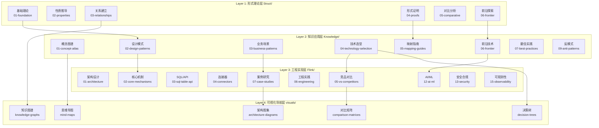
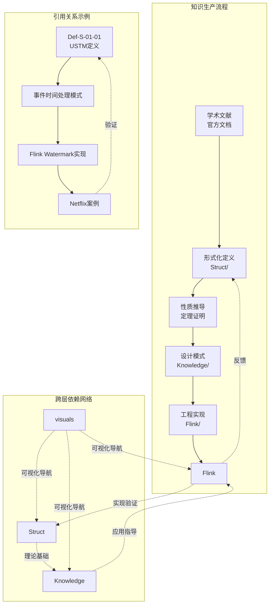
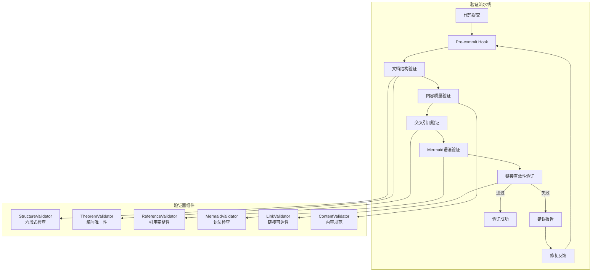
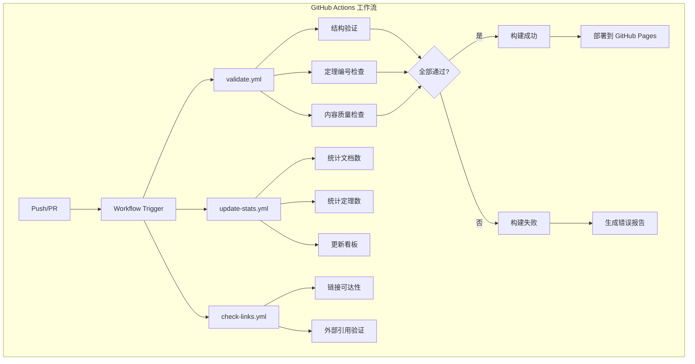
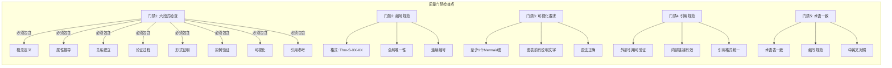
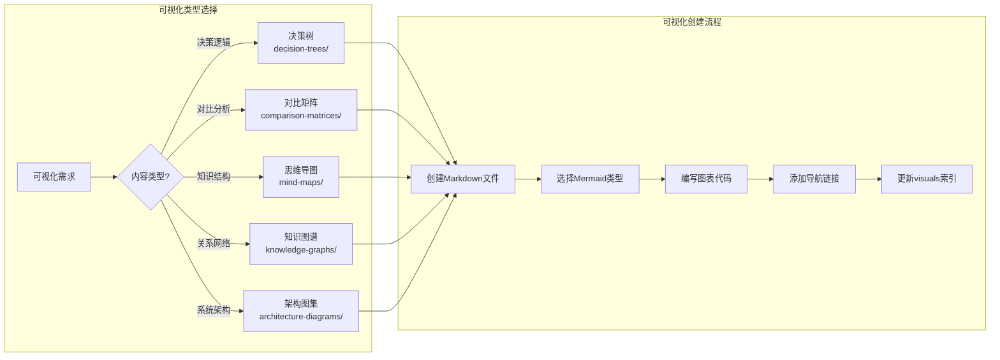
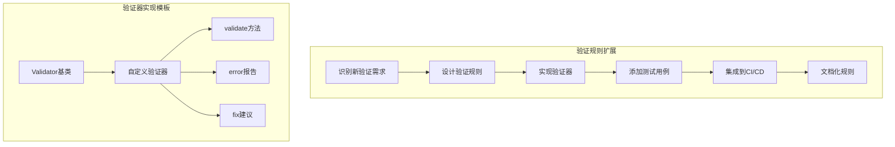

<!-- AI Translation Template - Replace <!-- TRANSLATE --> markers with actual translation -->

<!-- TRANSLATE: # AnalysisDataFlow 技术架构文档 -->

<!-- TRANSLATE: > **版本**: v1.0 | **更新日期**: 2026-04-03 | **状态**: Production -->
<!-- TRANSLATE: > -->
<!-- TRANSLATE: > 本文档描述 AnalysisDataFlow 项目的整体技术架构，包括目录结构、文档生成流程、验证系统、存储架构和扩展机制。 -->


<!-- TRANSLATE: ## 1. 项目整体架构 -->

<!-- TRANSLATE: ### 1.1 四层架构概览 -->

<!-- TRANSLATE: AnalysisDataFlow 采用**四层架构设计**，实现从形式化理论到工程实践的完整知识体系： -->



<!-- TRANSLATE: ### 1.2 各层职责与接口 -->

<!-- TRANSLATE: #### Layer 1: Struct/ - 形式理论基础层 -->

<!-- TRANSLATE: | 属性 | 说明 | -->
<!-- TRANSLATE: |------|------| -->
<!-- TRANSLATE: | **定位** | 数学定义、定理证明、严格论证 | -->
<!-- TRANSLATE: | **内容特征** | 形式化语言、公理系统、证明构造 | -->
<!-- TRANSLATE: | **文档数量** | 43 篇 | -->
<!-- TRANSLATE: | **核心产出** | 188 定理、399 定义、158 引理 | -->

<!-- TRANSLATE: **内部接口规范**： -->

```
输入: 学术文献、形式化规范
输出: Def-* (定义), Thm-* (定理), Lemma-* (引理), Prop-* (命题)
契约: 每个定义必须有唯一编号，每个定理必须有完整证明
```

<!-- TRANSLATE: **子目录职责**： -->

<!-- TRANSLATE: - `01-foundation/`: USTM、进程演算、Actor、Dataflow 基础理论 -->
<!-- TRANSLATE: - `02-properties/`: 确定性、一致性、Watermark 单调性等性质 -->
<!-- TRANSLATE: - `03-relationships/`: 跨模型编码、表达能力层次 -->
<!-- TRANSLATE: - `04-proofs/`: Checkpoint、Exactly-Once 正确性证明 -->
<!-- TRANSLATE: - `05-comparative/`: Go vs Scala 表达力对比 -->
<!-- TRANSLATE: - `06-frontier/`: 开放问题、Choreographic 编程、AI Agent 形式化 -->

<!-- TRANSLATE: #### Layer 2: Knowledge/ - 知识应用层 -->

<!-- TRANSLATE: | 属性 | 说明 | -->
<!-- TRANSLATE: |------|------| -->
<!-- TRANSLATE: | **定位** | 设计模式、业务场景、技术选型 | -->
<!-- TRANSLATE: | **内容特征** | 工程实践、模式目录、决策框架 | -->
<!-- TRANSLATE: | **文档数量** | 110 篇 | -->
<!-- TRANSLATE: | **核心产出** | 45 设计模式、15 业务场景 | -->

<!-- TRANSLATE: **内部接口规范**： -->

```
输入: Struct/ 形式化定义、行业案例、工程经验
输出: 设计模式目录、技术选型指南、业务场景分析
契约: 每个模式必须关联形式化基础，每个选型必须有决策矩阵
```

<!-- TRANSLATE: **子目录职责**： -->

<!-- TRANSLATE: - `01-concept-atlas/`: 并发范式矩阵、概念图谱 -->
<!-- TRANSLATE: - `02-design-patterns/`: 事件时间处理、状态计算、窗口聚合等模式 -->
<!-- TRANSLATE: - `03-business-patterns/`: Uber/Netflix/Alibaba 等真实案例 -->
<!-- TRANSLATE: - `04-technology-selection/`: 引擎选型、存储选型、流数据库指南 -->
<!-- TRANSLATE: - `05-mapping-guides/`: 理论到代码映射、迁移指南 -->
<!-- TRANSLATE: - `06-frontier/`: A2A 协议、MCP、实时 RAG、流数据库生态 -->
<!-- TRANSLATE: - `09-anti-patterns/`: 10 大反模式识别与规避策略 -->

<!-- TRANSLATE: #### Layer 3: Flink/ - 工程实现层 -->

<!-- TRANSLATE: | 属性 | 说明 | -->
<!-- TRANSLATE: |------|------| -->
<!-- TRANSLATE: | **定位** | Flink 专项技术、架构机制、工程实践 | -->
<!-- TRANSLATE: | **内容特征** | 源码分析、配置示例、性能调优 | -->
<!-- TRANSLATE: | **文档数量** | 117 篇 | -->
<!-- TRANSLATE: | **核心产出** | 107 Flink 相关定理、核心机制全覆盖 | -->

<!-- TRANSLATE: **内部接口规范**： -->

```
输入: Knowledge/ 设计模式、Flink 官方文档、源码分析
输出: 架构文档、机制详解、案例研究、路线图
契约: 每个机制必须有源码引用，每个案例必须有生产验证
```

<!-- TRANSLATE: **子目录职责**： -->

<!-- TRANSLATE: - `01-architecture/`: 架构演进、分离状态分析 -->
<!-- TRANSLATE: - `02-core-mechanisms/`: Checkpoint、Exactly-Once、Watermark、Delta Join -->
<!-- TRANSLATE: - `03-sql-table-api/`: SQL 优化、Model DDL、Vector Search -->
<!-- TRANSLATE: - `04-connectors/`: Kafka、CDC、Iceberg、Paimon 集成 -->
<!-- TRANSLATE: - `05-vs-competitors/`: 与 Spark、RisingWave 对比 -->
<!-- TRANSLATE: - `06-engineering/`: 性能调优、成本优化、测试策略 -->
<!-- TRANSLATE: - `07-case-studies/`: 金融风控、IoT、推荐系统等案例 -->
<!-- TRANSLATE: - `12-ai-ml/`: Flink ML、在线学习、AI Agents -->
<!-- TRANSLATE: - `13-security/`: TEE、GPU 可信计算 -->
<!-- TRANSLATE: - `15-observability/`: OpenTelemetry、SLO、可观测性 -->

<!-- TRANSLATE: #### Layer 4: visuals/ - 可视化导航层 -->

<!-- TRANSLATE: | 属性 | 说明 | -->
<!-- TRANSLATE: |------|------| -->
<!-- TRANSLATE: | **定位** | 决策树、对比矩阵、思维导图、知识图谱 | -->
<!-- TRANSLATE: | **内容特征** | 可视化导航、快速决策、知识概览 | -->
<!-- TRANSLATE: | **文档数量** | 20 篇 | -->
<!-- TRANSLATE: | **核心产出** | 5 类可视化、700+ Mermaid 图表 | -->

<!-- TRANSLATE: **内部接口规范**： -->

```
输入: 全项目文档、定理依赖关系、技术选型逻辑
输出: 决策树、对比矩阵、思维导图、知识图谱
契约: 每个可视化必须可导航到源文档，每个决策必须有条件分支
```

<!-- TRANSLATE: **子目录职责**： -->

<!-- TRANSLATE: - `decision-trees/`: 技术选型决策树、范式选择决策树 -->
<!-- TRANSLATE: - `comparison-matrices/`: 引擎对比矩阵、模型对比矩阵 -->
<!-- TRANSLATE: - `mind-maps/`: 知识思维导图、完整知识图谱 -->
<!-- TRANSLATE: - `knowledge-graphs/`: 概念关系图谱、定理依赖图 -->
<!-- TRANSLATE: - `architecture-diagrams/`: 系统架构图、分层架构图 -->

<!-- TRANSLATE: ### 1.3 数据流转与依赖关系 -->



<!-- TRANSLATE: **依赖规则**： -->

<!-- TRANSLATE: 1. **单向依赖原则**: Struct → Knowledge → Flink，避免循环依赖 -->
<!-- TRANSLATE: 2. **反馈验证机制**: Flink 工程实践反馈验证 Struct 理论 -->
<!-- TRANSLATE: 3. **可视化导航**: visuals/ 作为导航层，可引用所有层级 -->


<!-- TRANSLATE: ## 3. 验证系统架构 -->

<!-- TRANSLATE: ### 3.1 验证脚本架构 -->



<!-- TRANSLATE: **验证器详细说明**： -->

<!-- TRANSLATE: | 验证器 | 职责 | 验证规则 | -->
<!-- TRANSLATE: |--------|------|----------| -->
<!-- TRANSLATE: | **StructureValidator** | 六段式结构检查 | 必须包含 8 个章节，顺序正确 | -->
<!-- TRANSLATE: | **TheoremValidator** | 定理编号唯一性 | 全局编号不冲突，格式正确 | -->
<!-- TRANSLATE: | **ReferenceValidator** | 引用完整性 | 内部链接有效，外部链接可访问 | -->
<!-- TRANSLATE: | **MermaidValidator** | Mermaid 语法检查 | 图表语法正确，可渲染 | -->
<!-- TRANSLATE: | **LinkValidator** | 链接有效性 | HTTP 200 响应，无死链 | -->
<!-- TRANSLATE: | **ContentValidator** | 内容规范 | 术语一致，格式统一 | -->

<!-- TRANSLATE: ### 3.2 CI/CD 流程 -->



<!-- TRANSLATE: **工作流配置**（`.github/workflows/`）： -->

<!-- TRANSLATE: | 工作流文件 | 触发条件 | 职责 | -->
<!-- TRANSLATE: |------------|----------|------| -->
<!-- TRANSLATE: | `validate.yml` | Push, PR | 文档结构、定理编号、内容质量验证 | -->
<!-- TRANSLATE: | `update-stats.yml` | Push to main | 统计更新、看板刷新 | -->
<!-- TRANSLATE: | `check-links.yml` | 每日定时 | 外部链接有效性检查 | -->

<!-- TRANSLATE: ### 3.3 质量门禁 -->



<!-- TRANSLATE: **质量门禁清单**： -->

```markdown
## 文档提交前检查清单

### 结构检查
- [ ] 包含全部 8 个章节
- [ ] 章节顺序正确
- [ ] 元数据头部完整

### 内容检查
- [ ] 至少 1 个形式化定义 (Def-*)
- [ ] 至少 1 个定理/引理/命题
- [ ] 至少 1 个代码/配置示例
- [ ] 至少 1 个 Mermaid 图表

### 引用检查
- [ ] 外部引用使用 `[^n]` 格式
- [ ] 内部引用使用相对路径
- [ ] 定理引用使用全局编号

### 编号检查
- [ ] 新定理编号全局唯一
- [ ] 编号格式符合规范
- [ ] THEOREM-REGISTRY.md 已更新
```


<!-- TRANSLATE: ## 5. 扩展架构 -->

<!-- TRANSLATE: ### 5.1 添加新文档 -->

```mermaid
flowchart TD
    subgraph "新文档添加流程"
        A[确定文档类型] --> B{选择目录}

        B -->|形式化理论| C[Struct/]
        B -->|设计模式| D[Knowledge/]
        B -->|Flink技术| E[Flink/]
        B -->|可视化| F[visuals/]

        C --> G[选择子目录<br/>01-08]
        D --> H[选择子目录<br/>01-09]
        E --> I[选择子目录<br/>01-15]
        F --> J[选择子目录<br/>decision-trees等]

        G & H & I & J --> K[分配序号]
        K --> L[创建文件<br/>{层号}.{序号}-{主题}.md]
        L --> M[应用六段式模板]
        M --> N[分配定理编号]
        N --> O[编写内容]
        O --> P[添加Mermaid图]
        P --> Q[验证并提交]
    end
```

<!-- TRANSLATE: **添加新文档步骤**： -->

```markdown
## 新文档创建清单

### 1. 前置检查
- [ ] 确认文档主题尚未覆盖
- [ ] 确认所属目录和子目录
- [ ] 查看同名或相似文档避免重复

### 2. 文件创建
- [ ] 按命名规范创建文件
- [ ] 复制六段式模板
- [ ] 填写元数据头部

### 3. 内容编写
- [ ] 编写概念定义（至少1个 Def-*）
- [ ] 推导性质（至少1个 Lemma/Prop）
- [ ] 建立关系（与其他文档的关联）
- [ ] 编写论证过程
- [ ] 完成形式证明/工程论证
- [ ] 添加实例验证
- [ ] 创建Mermaid图表
- [ ] 列出引用参考

### 4. 编号分配
- [ ] 在 THEOREM-REGISTRY.md 注册新编号
- [ ] 确保编号全局唯一
- [ ] 更新文档内所有编号引用

### 5. 索引更新
- [ ] 更新目录 00-INDEX.md
- [ ] 更新 PROJECT-TRACKING.md
- [ ] 更新相关文档的交叉引用

### 6. 验证提交
- [ ] 运行本地验证脚本
- [ ] 通过所有质量门禁
- [ ] 提交 PR 并通过 CI
```

<!-- TRANSLATE: ### 5.2 添加新可视化 -->



<!-- TRANSLATE: **可视化创建模板**： -->

```markdown
# {可视化标题}

> 类型: {decision-tree | matrix | mindmap | graph | architecture}
> 用途: {用途描述}
> 更新日期: YYYY-MM-DD

## 概述

{可视化目的和适用场景描述}

## 可视化

```{可视化类型}
<!-- TRANSLATE: {Mermaid图表代码} -->
```

## 使用指南

### 如何阅读

{阅读指南}

### 相关文档

- [相关文档1](Struct/00-INDEX.md)
- [相关文档2](Flink/00-INDEX.md)

## 更新日志

| 日期 | 变更 |
|------|------|
| YYYY-MM-DD | 初始版本 |

```

<!-- TRANSLATE: ### 5.3 添加新验证规则 -->



<!-- TRANSLATE: **验证规则扩展示例**： -->

```python
# validators/custom_validator.py

class CustomValidator(BaseValidator):
    """
    自定义验证规则示例
    验证文档是否包含特定关键词
    """

    def __init__(self, config):
        self.required_keywords = config.get('keywords', [])
        self.severity = config.get('severity', 'warning')

    def validate(self, document):
        """
        验证文档内容

        Args:
            document: Document对象

        Returns:
            ValidationResult: 验证结果
        """
        errors = []
        content = document.get_content()

        for keyword in self.required_keywords:
            if keyword not in content:
                errors.append(ValidationError(
                    type='missing_keyword',
                    message=f'文档缺少必需关键词: {keyword}',
                    line=0,
                    suggestion=f'请添加关于 {keyword} 的内容'
                ))

        return ValidationResult(
            valid=len(errors) == 0,
            errors=errors,
            validator_name=self.__class__.__name__
        )
```

<!-- TRANSLATE: **验证规则配置**（`.github/workflows/validate.yml`）： -->

```yaml
name: Validate Project

on: [push, pull_request]

jobs:
  validate:
    runs-on: ubuntu-latest
    steps:
      - uses: actions/checkout@v3

      - name: Setup Python
        uses: actions/setup-python@v4
        with:
          python-version: '3.10'

      - name: Install dependencies
        run: |
          pip install -r scripts/requirements.txt

      - name: Run structure validation
        run: python scripts/validate_structure.py

      - name: Run theorem validation
        run: python scripts/validate_theorems.py

      - name: Run custom validation
        run: python scripts/validate_custom.py --config .validators/config.yaml
```


<!-- TRANSLATE: *本文档由 AnalysisDataFlow 架构组维护，最后更新: 2026-04-03* -->
