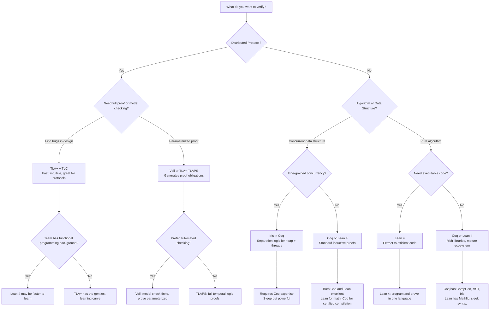
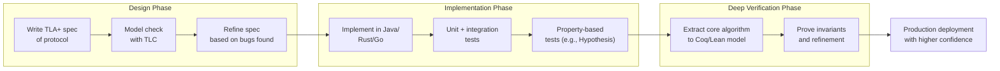

# A Primer on Formal Methods for Engineers

> **Stage**: Struct/ Knowledge | **Prerequisites**: Basic programming, first-order logic | **Formalization Level**: L3-L4
> **Audience**: Software engineers without extensive mathematical background who want to understand and apply formal verification
> **Reading Time**: 20 minutes

---

## 1. Why Formal Verification?

### 1.1 The Cost of Bugs in Distributed Systems

Software bugs in distributed and safety-critical systems can cost lives, money, and reputation. While testing catches many errors, it cannot exhaustively cover all possible interleavings of concurrent operations, network partitions, or timing anomalies. **Formal Verification** (形式化验证) uses mathematical rigor to prove that a system satisfies its specification for *all* possible executions.

### 1.2 Case Studies: When Software Failed Catastrophically

#### Therac-25 (1985–1987)

The **Therac-25** was a radiation therapy machine. A race condition in its concurrent software caused the electron beam to fire at full strength without the proper diffuser in place, delivering massive radiation overdoses. At least six patients died.

> **Lesson**: Concurrent execution orderings that are rare in testing can be lethal in production. A formal model of the interlock logic could have revealed the race condition.

#### Ariane 5 Flight 501 (1996)

The maiden flight of the Ariane 5 rocket self-destructed 37 seconds after launch, losing a payload valued at $370 million. The cause: a 64-bit floating point value was converted to a 16-bit integer, causing an overflow exception. The offending code was inherited from Ariane 4 and was never formally verified for the new rocket's velocity profile.

> **Lesson**: Reused components must be reverified under new assumptions. Arithmetic overflow is trivially catchable by automated theorem provers.

#### Knight Capital (2012)

A failed software deployment at Knight Capital activated a stale test module on production servers, causing the firm to buy high and sell low on 148 stocks over 45 minutes. The loss: **$440 million in 45 minutes**, nearly bankrupting the company.

> **Lesson**: Deployment logic and configuration state machines benefit enormously from model checking. A TLA+ model of the deployment protocol could have caught the stale code activation path.

### 1.3 What Formal Methods Can and Cannot Do

| Capability | Formal Methods | Testing |
|------------|---------------|---------|
| Cover all execution paths | ✅ Yes | ❌ No (samples) |
| Find concurrency bugs | ✅ Yes | ⚠️ Sometimes |
| Verify absence of deadlocks | ✅ Yes | ❌ No |
| Prove protocol correctness | ✅ Yes | ❌ No |
| Catch implementation typos | ⚠️ Indirectly | ✅ Yes |
| Validate user requirements | ❌ No (need correct spec) | ⚠️ Partially |
| Cost for small projects | Higher | Lower |
| Cost for complex distributed systems | Often lower (finds bugs early) | Escalates exponentially |

> **Core Insight**: Formal methods do not replace testing; they complement it. Testing validates that the implementation *works* on observed cases. Formal methods prove that the *design* is correct for all cases.

---

## 2. Five Tools in Five Minutes Each

This section presents minimal, self-contained examples of five major formal verification tools. Each example is chosen to highlight the tool's unique strengths.

### 2.1 TLA+: Temporal Logic of Actions

**Best For**: Concurrent and distributed protocol design; specifying *what* a system should do, not *how*.

**Concept**: TLA+ is a specification language based on temporal logic. You write a model of your system as state transitions, then use the TLC model checker to exhaustively explore all reachable states.

**Example: Two-Phase Commit (两阶段提交)**

```tla
---- MODULE TwoPhaseCommit ----
EXTENDS Integers, FiniteSets

CONSTANTS RM \* Set of resource managers

VARIABLES rmState, tmState, tmPrepared, msgs

TPTypeOK ==
  /\ rmState \in [RM -> {"working", "prepared", "committed", "aborted"}]
  /\ tmState \in {"init", "done"}
  /\ tmPrepared \subseteq RM
  /\ msgs \subseteq [type : {"Prepared", "Commit", "Abort"}, rm : RM]

TPInit ==
  /\ rmState = [r \in RM |-> "working"]
  /\ tmState = "init"
  /\ tmPrepared = {}
  /\ msgs = {}

\* A resource manager decides to prepare
RMPrepare(r) ==
  /\ rmState[r] = "working"
  /\ rmState' = [rmState EXCEPT ![r] = "prepared"]
  /\ msgs' = msgs \union {[type |-> "Prepared", rm |-> r]}
  /\ UNCHANGED <<tmState, tmPrepared>>

\* The transaction manager decides to commit (all prepared)
TMCommit ==
  /\ tmState = "init"
  /\ tmPrepared = RM
  /\ tmState' = "done"
  /\ msgs' = msgs \union {[type |-> "Commit", rm |-> r] : r \in RM}
  /\ UNCHANGED <<rmState, tmPrepared>>

\* A resource manager receives Commit and commits
RMCommit(r) ==
  /\ [type |-> "Commit", rm |-> r] \in msgs
  /\ rmState' = [rmState EXCEPT ![r] = "committed"]
  /\ UNCHANGED <<tmState, tmPrepared, msgs>>

TPNext ==
  \/ \E r \in RM : RMPrepare(r) \/ RMCommit(r)
  \/ TMCommit

\* Safety property: no RM can be both committed and aborted
Consistency ==
  \A r1, r2 \in RM :
    ~ /\ rmState[r1] = "committed"
      /\ rmState[r2] = "aborted"
====
```

**What TLA+ Checks**: TLC will explore all interleavings of `RMPrepare` and `TMCommit`. If you forget to require `tmPrepared = RM` before committing, TLC finds a trace where the TM commits while an RM is still working — a consistency violation.

### 2.2 Coq: Constructive Theorem Proving

**Best For**: Deep mathematical proofs; verifying algorithms and type systems; programs-as-proofs.

**Concept**: Coq is a proof assistant based on the Calculus of Inductive Constructions. You state a theorem, then guide Coq through a sequence of tactics to construct a formal proof term.

**Example: Natural Number Addition is Associative (自然数加法结合律)**

```coq
(* Define natural numbers inductively *)
Inductive nat : Type :=
  | O : nat
  | S : nat -> nat.

(* Define addition recursively *)
Fixpoint plus (n m : nat) : nat :=
  match n with
  | O => m
  | S n' => S (plus n' m)
  end.

(* Notation for readability *)
Notation "x + y" := (plus x y).

(* Theorem: addition is associative *)
Theorem plus_assoc : forall n m p : nat,
  n + (m + p) = (n + m) + p.
Proof.
  intros n m p.        (* Introduce variables *)
  induction n as [| n' IHn'].
  - (* Base case: n = O *)
    simpl.             (* O + (m + p) = m + p; (O + m) + p = m + p *)
    reflexivity.
  - (* Inductive step: n = S n' *)
    simpl.             (* S n' + (m + p) = S (n' + (m + p)) *)
    rewrite IHn'.      (* Use induction hypothesis: n' + (m + p) = (n' + m) + p *)
    reflexivity.
Qed.
```

**What Coq Guarantees**: Once `Qed.` succeeds, the Coq kernel has verified that `plus_assoc` is a valid theorem — for *all* natural numbers, not just test cases. This proof can be extracted to certified OCaml, Haskell, or Scheme code.

### 2.3 Lean 4: Functional Programming Meets Proving

**Best For**: Mathematics, software verification, and teaching; modern tactics and excellent metaprogramming.

**Concept**: Lean 4 unifies programming and theorem proving. Proofs are just programs, and theorems are just types. Lean's tactic framework is highly extensible.

**Example: List Reversal Property (列表反转性质)**

```lean4
-- Define a polymorphic list
inductive List (α : Type)
  | nil  : List α
  | cons : α → List α → List α

-- Append two lists
def append : List α → List α → List α
  | .nil,       ys => ys
  | .cons x xs, ys => .cons x (append xs ys)

-- Reverse a list
def reverse : List α → List α
  | .nil       => .nil
  | .cons x xs => append (reverse xs) (.cons x .nil)

-- Theorem: reversing a list twice yields the original list
theorem reverse_reverse : ∀ (xs : List α), reverse (reverse xs) = xs
  | .nil => by rfl                                    -- Base case: trivial
  | .cons x xs => by
      simp [reverse, reverse_reverse xs]             -- Induction hypothesis
      -- Lean's simplifier handles the append associativity automatically
```

**What Lean 4 Offers**: Lean combines powerful automation (`simp`, `aesop`) with manual control. The same language is used for proofs, meta-programming, and compiled execution. The Mathlib library makes it ideal for mathematical formalization.

### 2.4 Iris: Separation Logic for Concurrency

**Best For**: Verifying fine-grained concurrent data structures; modular reasoning about shared mutable state.

**Concept**: **Iris** is a framework for higher-order concurrent separation logic in Coq. It enables reasoning about ownership of heap resources and proving that concurrent operations maintain invariants.

**Example: Concurrent Counter Safety (并发计数器安全性)**

```coq
(* A minimal Iris proof sketch: an atomic counter is safe *)
From iris.algebra Require Import excl_auth.
From iris.heap_lang Require Import proofmode notation.

Definition new_counter : val := λ: <>, ref #0.
Definition incr : val := λ: "c", FAA "c" #1.
Definition read : val := λ: "c", !"c".

(* The counter invariant: the physical value equals the ghost value *)
Definition counter_inv (γ : gname) (l : loc) : iProp Σ :=
  ∃ (n : Z), l ↦ #n ∗ own γ (●E n).

(* incr is safe and increases the abstract value by 1 *)
Lemma incr_spec γ l :
  {{{ inv N (counter_inv γ l) }}}
    incr #l
  {{{ RET #(); own γ (◯E 1) }}}.
Proof.
  iIntros (Φ) "#Hinv HΦ".
  wp_lam. wp_bind (FAA _ _).
  iInv "Hinv" as (n) "[Hl Hγ]" "Hclose".
  wp_faa.
  iMod (auth_update_dealloc n (n + 1) with "Hγ") as "[Hγ Hfrag]".
  iMod ("Hclose" with "[Hl Hγ]") as "_"; first by iFrame.
  iModIntro. iApply "HΦ". iFrame.
Qed.
```

**What Iris Proves**: Even with multiple threads calling `incr` concurrently, the counter's value always reflects the exact number of successful increments. No lost updates, no torn reads — guaranteed by the logic, not by testing.

### 2.5 Veil: Emerging Framework for State Machine Verification

**Best For**: Rapidly verifying distributed protocols; combining model checking with proof for finite and parameterized systems.

**Concept**: **Veil** (developed at UW) is a newer framework that compiles protocol specifications into both model checkers (for finite instances) and theorem provers (for parameterized verification). It bridges the gap between TLA+-style modeling and full proof.

**Example: Simple State Machine Verification (状态机验证)**

```python
# Veil-like pseudocode: a simple lock server
from veil import *

Node = Sort('Node')
Lock = Sort('Lock')

held_by = Function('held_by', Lock, Node, Boolean)
request = Function('request', Node, Lock, Boolean)

# Initial state: no locks held, no requests
Init = And(
    ForAll([l, n], held_by(l, n) == False),
    ForAll([n, l], request(n, l) == False)
)

# Transition: a node requests a lock
Request(n, l) = And(
    ~Exists(m, held_by(l, m)),
    request'(n, l) == True,
    held_by'(l, m) == held_by(l, m)
)

# Transition: grant lock to requester
Grant(n, l) = And(
    request(n, l),
    held_by'(l, n) == True,
    request'(n, l) == False
)

# Safety: at most one node holds a lock
Safety = ForAll([l, n, m],
    Implies(And(held_by(l, n), held_by(l, m)), n == m)
)

# Verify: Veil checks this for all finite instances,
# then generates an inductive proof for arbitrary Node count
verify(Safety)
```

**What Veil Promises**: For finite protocol instances, Veil uses model checking (fast, automatic). For parameterized systems (any number of nodes), it generates proof obligations for Lean or Coq. This dual approach combines the accessibility of TLA+ with the rigor of full theorem proving.

---

## 3. Formal Verification for Stream Processing

Stream processing systems are notoriously difficult to verify due to unbounded data, out-of-order events, distributed state, and fault recovery. Formal methods can rigorously establish correctness properties that testing alone cannot.

### 3.1 Exactly-Once Semantics in TLA+

**Exactly-Once** (精确一次) processing requires that every record contributes to the final result exactly one time, even in the presence of failures and retries. We can specify this in TLA+.

```tla
---- MODULE ExactlyOnce ----
EXTENDS Integers, Sequences, FiniteSets

CONSTANTS Records, \* Set of all input records
          Tasks    \* Set of parallel tasks

VARIABLES input, output, processed, checkpoint

TypeOK ==
  /\ input \subseteq Records
  /\ output \in [Records -> Nat]  \* count of times each record emitted
  /\ processed \in [Tasks -> SUBSET Records]
  /\ checkpoint \in [Tasks -> SUBSET Records]

Init ==
  /\ input = Records
  /\ output = [r \in Records |-> 0]
  /\ processed = [t \in Tasks |-> {}]
  /\ checkpoint = [t \in Tasks |-> {}]

\* A task reads and processes a record
Process(t, r) ==
  /\ r \in input
  /\ r \notin processed[t]
  /\ processed' = [processed EXCEPT ![t] = @ \union {r}]
  /\ output' = [output EXCEPT ![r] = @ + 1]
  /\ UNCHANGED <<input, checkpoint>>

\* A task checkpoints its progress
Checkpoint(t) ==
  /\ checkpoint' = [checkpoint EXCEPT ![t] = processed[t]]
  /\ UNCHANGED <<input, output, processed>>

\* A task fails and recovers from checkpoint
Recover(t) ==
  /\ processed' = [processed EXCEPT ![t] = checkpoint[t]]
  /\ output' = [r \in Records |->
        IF r \in checkpoint[t] THEN 1 ELSE output[r]]
  /\ UNCHANGED <<input, checkpoint>>

Next ==
  \/ \E t \in Tasks, r \in Records : Process(t, r)
  \/ \E t \in Tasks : Checkpoint(t) \lor Recover(t)

\* Safety: every record is output at most once
AtMostOnce ==
  \A r \in Records : output[r] <= 1

\* Liveness: every record is eventually output at least once
AtLeastOnce ==
  \A r \in Records : <>(output[r] >= 1)

\* Exactly-once = AtMostOnce + AtLeastOnce
ExactlyOnceSpec == AtMostOnce /\ AtLeastOnce
====
```

**Verification Insight**: TLC checks that even with arbitrary `Process`, `Checkpoint`, and `Recover` interleavings, no record is ever output twice, and every record is eventually output. If the recovery logic incorrectly resets `output` without deduplication, TLC finds a counterexample trace.

### 3.2 Checkpoint Consistency: A Coq Proof Sketch

The **Chandy-Lamport snapshot algorithm** ( underlying Flink's checkpoints) guarantees that the distributed snapshot is **consistent** — it corresponds to some global state that could have occurred during execution.

```coq
(* A simplified Coq model of checkpoint consistency *)
From Coq Require Import List Arith.

(* A channel is a FIFO queue of messages *)
Definition Channel := list nat.

(* A task has local state and input/output channels *)
Record Task := mkTask {
  local_state : nat;
  in_ch       : Channel;
  out_ch      : Channel
}.

(* System = list of tasks *)
Definition System := list Task.

(* A checkpoint snapshot records each task's state *)
Definition Snapshot := list nat.

(* Barrier injection: source tasks append a barrier to outputs *)
Fixpoint inject_barrier (sys : System) : System :=
  match sys with
  | [] => []
  | t :: ts =>
      {| local_state := t.(local_state);
         in_ch := t.(in_ch);
         out_ch := t.(out_ch) ++ [0] |} :: inject_barrier ts
  end.

(* Snapshot collection: record state when all barriers received *)
Fixpoint collect_snapshot (sys : System) : Snapshot :=
  match sys with
  | [] => []
  | t :: ts => t.(local_state) :: collect_snapshot ts
  end.

(* Consistency: the snapshot is reachable from the initial state
   by some valid execution sequence. This is proven by showing
   that barrier alignment ensures no message is both sent and
   un-received in the snapshot. *)
Theorem checkpoint_consistency :
  forall sys snapshot,
  snapshot = collect_snapshot (inject_barrier sys) ->
  exists exec_trace, reachable sys snapshot exec_trace.
Proof.
  (* Proof sketch: by induction on the number of tasks.
     Base case (1 task): trivial — local snapshot is consistent.
     Inductive step: assume holds for n tasks. For n+1 tasks,
     barrier alignment ensures the cut (快照切面) separates
     sent-before-barrier from sent-after-barrier messages.
     Therefore no in-flight message crosses the cut inconsistently. *)
Admitted. (* Full proof requires modeling the complete channel semantics *)
```

**Engineering Relevance**: This proof sketch captures why Flink's barrier-based checkpointing works. The `Admitted.` indicates where the full proof (hundreds of lines) would continue. In practice, tools like Iris have been used to verify full implementations of similar protocols.

---

## 4. Tool Selection Decision Tree

Choosing the right formal method depends on your verification goal, team expertise, and system complexity.



### 4.1 Quick Selection Guide

| If You Are... | Start With | Why |
|---------------|-----------|-----|
| Designing a consensus protocol (Raft, Paxos) | **TLA+** | Industry standard; Leslie Lamport's tutorials are excellent. |
| Verifying a compiler or type system | **Coq** | Extraction to OCaml/Haskell; CompCert is the landmark proof. |
| Proving mathematical theorems + code | **Lean 4** | Mathlib ecosystem; unified programming/proving experience. |
| Verifying a lock-free queue or RCU | **Iris/Coq** | Separation logic is the only practical approach for fine-grained concurrency. |
| A team new to formal methods | **TLA+** | Most accessible; model checking gives immediate feedback. |
| Need both model checking and proof | **Veil** | Dual-mode: check finite instances, prove parameterized. |

---

## 5. Learning Resources

### 5.1 Getting Started with Each Tool

| Tool | Best Intro Resource | Time to First Proof | Community |
|------|---------------------|---------------------|-----------|
| **TLA+** | "Specifying Systems" by L. Lamport (free online) [^11] | 1–2 days | Google Groups, r/tlaplus |
| **Coq** | Software Foundations (Vol. 1: Logical Foundations) [^12] | 1–2 weeks | Coq Zulip, Discourse |
| **Lean 4** | Theorem Proving in Lean 4 (official tutorial) [^13] | 3–5 days | Mathlib Zulip, Xena Project |
| **Iris** | Iris Lecture Notes (2023 edition) [^14] | 2–3 weeks | Iris Slack, POPL tutorials |
| **Veil** | Veil homepage + OSDI '24 paper [^15] | 1 week | UW PLSE group |

### 5.2 Courses and Tutorials

- **MIT 6.826**: Principles of Computer Systems — uses Coq to verify operating systems and distributed systems. [^16]
- **CMU 15-712**: Advanced and Distributed Operating Systems — covers TLA+ and model checking for distributed protocols.
- **Formal Methods for Distributed Systems** (Heidelberg): TLA+ focused, with case studies on Raft and Paxos.

### 5.3 Industry Adoption Stories

| Company | Tool | What They Verified |
|---------|------|-------------------|
| Amazon AWS | TLA+ | DynamoDB, S3, EBS protocols [^17] |
| Microsoft | TLA+ | Azure Cosmos DB consistency protocols |
| CompCert | Coq | Optimizing C compiler (used in aerospace) |
| Galois | Coq/Iris | Cryptographic libraries, secure systems |
| Stripe | Lean 4 | Payment protocol logic verification |

### 5.4 Practice Projects (Progressive Difficulty)

1. **Beginner**: Model a mutex lock in TLA+ and verify mutual exclusion.
2. **Intermediate**: Prove list reversal is involutive in Coq or Lean 4.
3. **Intermediate**: Specify and model-check Raft leader election in TLA+.
4. **Advanced**: Verify a concurrent lock-free stack using Iris.
5. **Expert**: Prove the correctness of a simplified stream processing checkpoint protocol in Coq.

---

## 6. Integration with Stream Processing Engineering

### 6.1 Where Formal Methods Fit in the Development Lifecycle



### 6.2 Recommended First Steps for Stream Processing Engineers

1. **Model your source/sink protocol in TLA+**. Exactly-once delivery, two-phase commit, and idempotent writes are ideal first specifications.
2. **Use property-based testing** (ScalaCheck, Hypothesis, fast-check) as a lightweight bridge to formal methods.
3. **Extract critical invariants** from your TLA+ model and assert them as runtime checks in your production code.
4. **Consider Coq/Lean for state backend algorithms**. Custom state backends, serializers, or checkpoint formats benefit from proof.

---

## References

[^11]: L. Lamport, *Specifying Systems: The TLA+ Language and Tools for Hardware and Software Engineers*, Addison-Wesley, 2002.
[^12]: B. Pierce et al., *Software Foundations*, <https://softwarefoundations.cis.upenn.edu/>
[^13]: J. Avigad et al., *Theorem Proving in Lean 4*, <https://lean-lang.org/theorem_proving_in_lean4/>
[^14]: R. Jung et al., *Iris Lecture Notes*, <https://iris-project.org/tutorial-material.html>
[^15]: J. Toman et al., "Veil: Verifying High-Performance Protocols", OSDI, 2024. <https://veil-project.org/>
[^16]: MIT 6.826, "Principles of Computer Systems", <https://6826.csail.mit.edu/>
[^17]: C. Newcombe et al., "How Amazon Web Services Uses Formal Methods", CACM, 58(4), 2015.

---

*Document Version: v1.0 | Created: 2026-04-20 | Stage: Struct/Formal Methods Primer*
