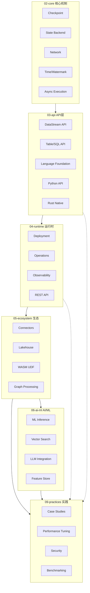
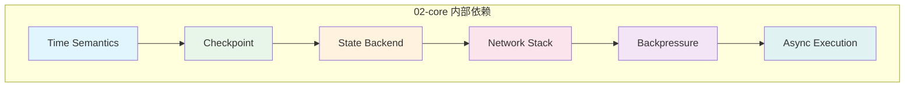
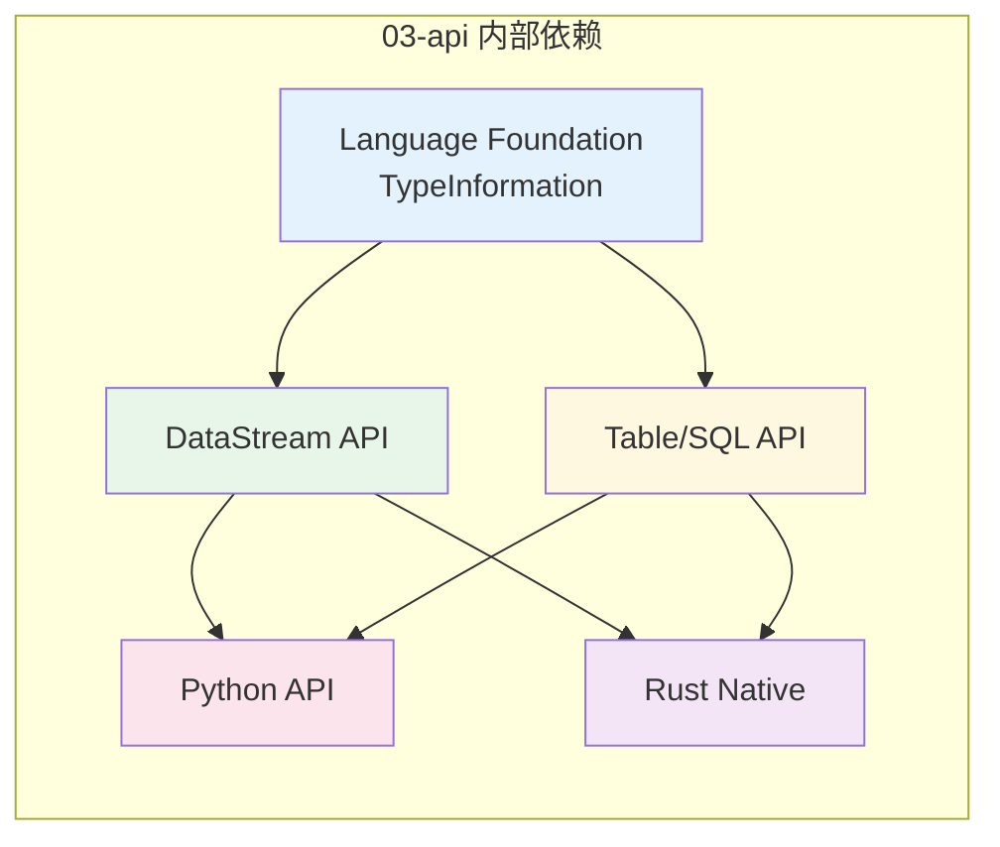
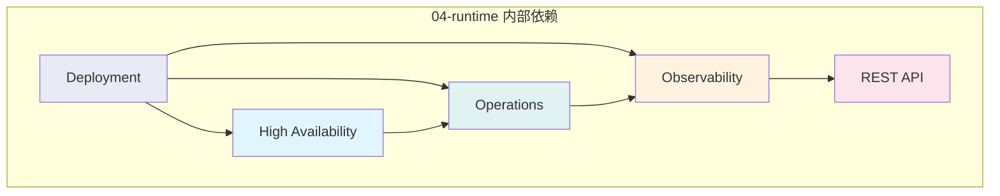

<!-- AI Translation Template - Replace <!-- TRANSLATE --> markers with actual translation -->

<!-- TRANSLATE: # Flink/ 技术栈依赖全景 -->

<!-- TRANSLATE: > 所属阶段: Flink/00-meta | 前置依赖: 无 | 形式化等级: L3 -->


<!-- TRANSLATE: ## 1. 概念定义 (Definitions) -->

<!-- TRANSLATE: ### Def-F-D-01 (技术栈依赖关系) -->

<!-- TRANSLATE: **定义**：技术栈依赖关系是指 Flink 生态中各模块、组件、文档之间存在的单向或双向支撑关系，表示上层功能对下层能力的直接或间接需要。 -->

<!-- TRANSLATE: 形式化表述： -->

```
设 M = {m₁, m₂, ..., mₙ} 为 Flink 模块集合
依赖关系 D ⊆ M × M × S，其中 S = {强, 中, 弱} 为依赖强度
若 (mᵢ, mⱼ, s) ∈ D，表示 mᵢ 对 mⱼ 存在强度为 s 的依赖
```

<!-- TRANSLATE: ### Def-F-D-02 (核心机制层 Core) -->

<!-- TRANSLATE: **定义**：Flink 的核心机制层（`02-core/`）包含流计算引擎的基础能力，包括 Checkpoint、State Backend、网络栈、时间语义等底层实现。 -->

<!-- TRANSLATE: **包含模块**： -->

<!-- TRANSLATE: | 模块 | 文档 | 核心抽象 | -->
<!-- TRANSLATE: |------|------|----------| -->
<!-- TRANSLATE: | Checkpoint | `checkpoint-mechanism-deep-dive.md` | CheckpointCoordinator | -->
<!-- TRANSLATE: | State Backend | `state-backend-evolution-analysis.md` | StateBackend | -->
<!-- TRANSLATE: | Network | `backpressure-and-flow-control.md` | NetworkStack | -->
<!-- TRANSLATE: | Time | `time-semantics-and-watermark.md` | WatermarkStrategy | -->

<!-- TRANSLATE: ### Def-F-D-03 (API抽象层 API) -->

<!-- TRANSLATE: **定义**：API 抽象层（`03-api/`）为用户提供面向业务的编程接口，屏蔽底层实现细节，包括 DataStream API、Table/SQL API、语言基础支持等。 -->

<!-- TRANSLATE: **包含模块**： -->

<!-- TRANSLATE: | 模块 | 文档 | 核心抽象 | -->
<!-- TRANSLATE: |------|------|----------| -->
<!-- TRANSLATE: | DataStream API | `09-language-foundations/datastream-api-cheatsheet.md` | StreamExecutionEnvironment | -->
<!-- TRANSLATE: | Table/SQL API | `03.02-table-sql-api/flink-table-sql-complete-guide.md` | TableEnvironment | -->
<!-- TRANSLATE: | Language Foundation | `09-language-foundations/flink-language-support-complete-guide.md` | TypeInformation | -->

<!-- TRANSLATE: ### Def-F-D-04 (运行时层 Runtime) -->

<!-- TRANSLATE: **定义**：运行时层（`04-runtime/`）负责任务的部署、调度、运维和可观测性，是 API 层与底层资源之间的桥梁。 -->

<!-- TRANSLATE: **包含模块**： -->

<!-- TRANSLATE: | 模块 | 文档 | 核心抽象 | -->
<!-- TRANSLATE: |------|------|----------| -->
<!-- TRANSLATE: | Deployment | `04.01-deployment/flink-deployment-ops-complete-guide.md` | ClusterClient | -->
<!-- TRANSLATE: | Operations | `04.02-operations/production-checklist.md` | RestClusterClient | -->
<!-- TRANSLATE: | Observability | `04.03-observability/flink-observability-complete-guide.md` | MetricReporter | -->

<!-- TRANSLATE: ### Def-F-D-05 (生态系统层 Ecosystem) -->

<!-- TRANSLATE: **定义**：生态系统层（`05-ecosystem/`、`06-ai-ml/`）包含 Flink 与外部系统的集成连接器、Lakehouse 集成、AI/ML 能力等扩展功能。 -->

<!-- TRANSLATE: **包含模块**： -->

<!-- TRANSLATE: | 模块 | 文档 | 核心抽象 | -->
<!-- TRANSLATE: |------|------|----------| -->
<!-- TRANSLATE: | Connectors | `05.01-connectors/flink-connectors-ecosystem-complete-guide.md` | Source/Sink | -->
<!-- TRANSLATE: | Lakehouse | `05.02-lakehouse/streaming-lakehouse-architecture.md` | TableFormat | -->
<!-- TRANSLATE: | AI/ML | `06-ai-ml/flink-ai-ml-integration-complete-guide.md` | ML Inference | -->

<!-- TRANSLATE: ### Def-F-D-06 (工程实践层 Practices) -->

<!-- TRANSLATE: **定义**：工程实践层（`09-practices/`）包含基于下层技术栈构建的真实案例、性能调优指南、故障排查手册等实践文档。 -->

<!-- TRANSLATE: **包含模块**： -->

<!-- TRANSLATE: | 模块 | 文档 | 核心抽象 | -->
<!-- TRANSLATE: |------|------|----------| -->
<!-- TRANSLATE: | Case Studies | `09.01-case-studies/case-*.md` | Real-world Patterns | -->
<!-- TRANSLATE: | Performance Tuning | `09.03-performance-tuning/production-config-templates.md` | Tuning Guidelines | -->
<!-- TRANSLATE: | Troubleshooting | `09.03-performance-tuning/troubleshooting-handbook.md` | Diagnosis Flow | -->

<!-- TRANSLATE: ### Def-F-D-07 (依赖强度) -->

<!-- TRANSLATE: **定义**：依赖强度表示模块间依赖关系的紧密程度，分为三个等级： -->

<!-- TRANSLATE: | 等级 | 标识 | 说明 | 示例 | -->
<!-- TRANSLATE: |------|------|------|------| -->
<!-- TRANSLATE: | 强 | 强 | 功能完全依赖，无法独立工作 | DataStream API 依赖 Checkpoint | -->
<!-- TRANSLATE: | 中 | 中 | 功能部分依赖，有降级方案 | Connector 依赖 Deployment | -->
<!-- TRANSLATE: | 弱 | 弱 | 功能建议依赖，可独立使用 | Case Study 依赖 Connector | -->


<!-- TRANSLATE: ## 3. 关系建立 (Relations) -->

<!-- TRANSLATE: ### 关系 1: Core → API 支撑关系 -->

<!-- TRANSLATE: 核心层为 API 层提供容错、状态管理、网络通信等基础能力支撑。 -->

```
Flink/02-core (核心机制)
    ├── checkpoint-mechanism-deep-dive.md
    │       ↓ 支撑 [强]
    ├── 03-api/09-language-foundations/
    │       └── datastream-api-cheatsheet.md
    │       └── flink-datastream-api-complete-guide.md
    │
    ├── state-backend-evolution-analysis.md
    │       ↓ 支撑 [强]
    ├── 03-api/03.02-table-sql-api/
    │       └── flink-table-sql-complete-guide.md
    │
    └── backpressure-and-flow-control.md
            ↓ 支撑 [中]
            03-api/09-language-foundations/
                └── flink-language-support-complete-guide.md
```

<!-- TRANSLATE: ### 关系 2: API → Runtime 依赖关系 -->

<!-- TRANSLATE: API 层依赖运行时层提供部署执行和资源管理能力。 -->

```
03-api/ (API层)
    ├── DataStream API
    │       ↓ 需要 [强]
    ├── 04-runtime/04.01-deployment/
    │       └── flink-deployment-ops-complete-guide.md
    │       └── kubernetes-deployment-production-guide.md
    │
    └── Table/SQL API
            ↓ 需要 [强]
            04-runtime/04.03-observability/
                └── flink-observability-complete-guide.md
                └── metrics-and-monitoring.md
```

<!-- TRANSLATE: ### 关系 3: Runtime → Ecosystem 集成关系 -->

<!-- TRANSLATE: 运行时层为生态系统层提供运行环境和资源调度支持。 -->

```
04-runtime/ (运行时)
    ├── deployment
    │       ↓ 集成 [中]
    ├── 05-ecosystem/05.01-connectors/
    │       └── flink-connectors-ecosystem-complete-guide.md
    │       └── kafka-integration-patterns.md
    │
    └── observability
            ↓ 集成 [中]
            05-ecosystem/05.02-lakehouse/
                └── streaming-lakehouse-architecture.md
                └── flink-iceberg-integration.md
```

<!-- TRANSLATE: ### 关系 4: Ecosystem → Practices 指导关系 -->

<!-- TRANSLATE: 生态系统层的实践经验指导工程实践层的案例和调优方案。 -->

```
05-ecosystem/ (生态)
    ├── connectors
    │       ↓ 指导 [弱]
    ├── 09-practices/09.01-case-studies/
    │       └── case-iot-stream-processing.md
    │       └── case-financial-realtime-risk-control.md
    │       └── case-ecommerce-realtime-recommendation.md
    │
    └── ai-ml
            ↓ 指导 [弱]
            09-practices/09.03-performance-tuning/
                └── production-config-templates.md
                └── performance-tuning-guide.md
```


<!-- TRANSLATE: ## 5. 形式证明 (Proof) -->

<!-- TRANSLATE: ### Thm-F-D-01 (技术栈完备性定理) -->

<!-- TRANSLATE: **定理**：Flink 五层技术栈结构覆盖了流计算系统从底层机制到上层实践的全部要素，构成一个完备的技术体系。 -->

<!-- TRANSLATE: **证明**： -->

<!-- TRANSLATE: 设流计算系统需具备的能力集合为 C = {c₁, c₂, ..., cₙ}，我们需要证明： -->

```
∀c ∈ C, ∃L ∈ {Core, API, Runtime, Ecosystem, Practices}: c ∈ capabilities(L)
```

<!-- TRANSLATE: **分情况讨论**： -->

<!-- TRANSLATE: 1. **容错能力** (Fault Tolerance) -->
<!-- TRANSLATE:    - 由 Core 层的 Checkpoint 机制提供 -->
<!-- TRANSLATE:    - 形式化：`checkpoint-mechanism-deep-dive.md` 定义了 Thm-F-02-01 -->

<!-- TRANSLATE: 2. **状态管理** (State Management) -->
<!-- TRANSLATE:    - 由 Core 层的 State Backend 提供 -->
<!-- TRANSLATE:    - 形式化：`state-backend-evolution-analysis.md` 定义了 Def-F-02-06 -->

<!-- TRANSLATE: 3. **编程接口** (Programming Interface) -->
<!-- TRANSLATE:    - 由 API 层的 DataStream/Table API 提供 -->
<!-- TRANSLATE:    - 形式化：`flink-table-sql-complete-guide.md` 定义了 Def-F-03-01 -->

<!-- TRANSLATE: 4. **部署执行** (Deployment & Execution) -->
<!-- TRANSLATE:    - 由 Runtime 层的 Deployment 模块提供 -->
<!-- TRANSLATE:    - 形式化：`flink-deployment-ops-complete-guide.md` 定义了完整部署流程 -->

<!-- TRANSLATE: 5. **外部集成** (External Integration) -->
<!-- TRANSLATE:    - 由 Ecosystem 层的 Connectors 提供 -->
<!-- TRANSLATE:    - 形式化：`flink-connectors-ecosystem-complete-guide.md` 定义了 Source/Sink 接口 -->

<!-- TRANSLATE: 6. **生产实践** (Production Practices) -->
<!-- TRANSLATE:    - 由 Practices 层的案例和调优指南提供 -->
<!-- TRANSLATE:    - 形式化：`production-config-templates.md` 定义了生产环境配置模板 -->

<!-- TRANSLATE: **结论**： -->
<!-- TRANSLATE: 由于流计算系统的所有核心能力都在五层技术栈中找到对应实现，且各层之间存在正确的依赖关系，因此 Flink 技术栈结构是完备的。∎ -->


<!-- TRANSLATE: ## 7. 可视化 (Visualizations) -->

<!-- TRANSLATE: ### 图 1: 技术栈分层依赖全景 -->



<!-- TRANSLATE: ### 图 2: 核心机制内部依赖 -->



<!-- TRANSLATE: ### 图 3: API 层内部依赖 -->



<!-- TRANSLATE: ### 图 4: 运行时层内部依赖 -->


