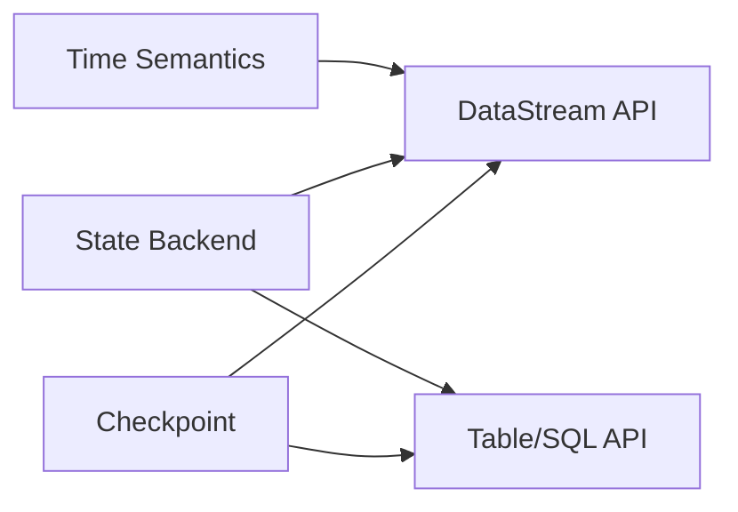
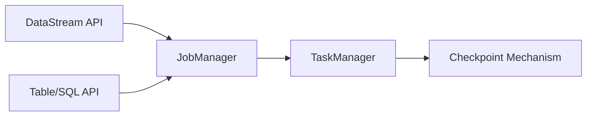
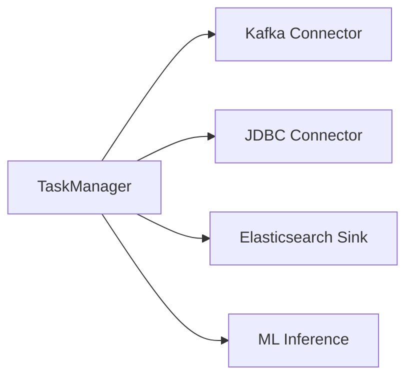
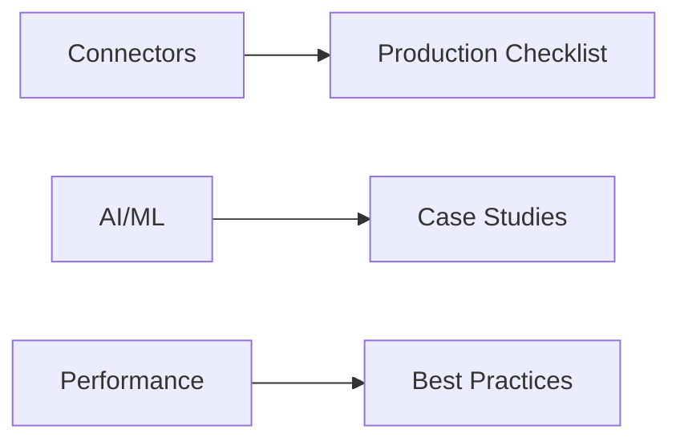
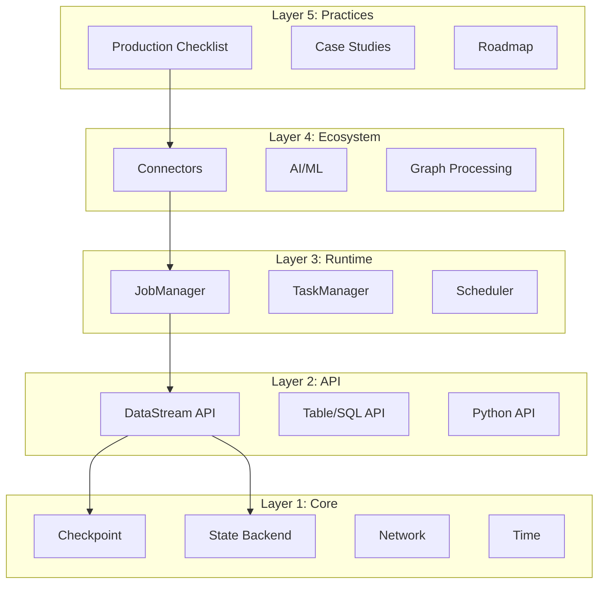

# Flink/ Tech Stack Dependency Panorama

> **Stage**: Flink/00-meta | **Prerequisites**: None | **Formalization Level**: L3

---

## Table of Contents

- [1. Concept Definitions](#1-concept-definitions)
- [2. Property Derivation](#2-property-derivation)
- [3. Relationship Establishment](#3-relationship-establishment)
- [4. Argumentation Process](#4-argumentation-process)
- [5. Formal Proof](#5-formal-proof)
- [6. Example Verification](#6-example-verification)
- [7. Visualizations](#7-visualizations)
- [8. References](#8-references)

---

## 1. Concept Definitions

### Def-F-D-01 (Tech Stack Dependency Relationship)

**Definition**: Tech stack dependency relationship refers to the unidirectional or bidirectional support relationships between modules, components, and documents in the Flink ecosystem, representing the direct or indirect needs of upper-layer functionality on lower-layer capabilities.

Formal representation:

```
Let M = {m₁, m₂, ..., mₙ} be the set of Flink modules
Dependency relation D ⊆ M × M × S, where S = {strong, medium, weak} is dependency strength
If (mᵢ, mⱼ, s) ∈ D, it indicates mᵢ has a dependency of strength s on mⱼ
```

### Def-F-D-02 (Core Mechanism Layer Core)

**Definition**: Flink's core mechanism layer (`02-core/`) contains the foundational capabilities of the stream computing engine, including Checkpoint, State Backend, network stack, time semantics, and other low-level implementations.

**Included Modules**:

| Module | Document | Core Abstraction |
|--------|----------|------------------|
| Checkpoint | `checkpoint-mechanism-deep-dive.md` | CheckpointCoordinator |
| State Backend | `state-backend-evolution-analysis.md` | StateBackend |
| Network | `backpressure-and-flow-control.md` | NetworkStack |
| Time | `time-semantics-and-watermark.md` | WatermarkStrategy |

### Def-F-D-03 (API Abstraction Layer API)

**Definition**: The API abstraction layer (`03-api/`) provides users with business-oriented programming interfaces that shield low-level implementation details, including DataStream API, Table/SQL API, and language foundation support.

**Included Modules**:

| Module | Document | Core Abstraction |
|--------|----------|------------------|
| DataStream API | `09-language-foundations/datastream-api-cheatsheet.md` | StreamExecutionEnvironment |
| Table/SQL API | `03.02-table-sql-api/flink-table-sql-complete-guide.md` | TableEnvironment |
| Language Foundation | `09-language-foundations/flink-language-support-complete-guide.md` | TypeInformation |

### Def-F-D-04 (Runtime Layer Runtime)

**Definition**: The runtime layer (`04-runtime/`) is responsible for task deployment, scheduling, operations, and observability, serving as the bridge between the API layer and underlying resources.

**Included Modules**:

| Module | Document | Core Abstraction |
|--------|----------|------------------|
| Deployment | `04.01-deployment/flink-deployment-ops-complete-guide.md` | ClusterClient |
| Operations | `04.02-operations/production-checklist.md` | RestClusterClient |
| Observability | `04.03-observability/flink-observability-complete-guide.md` | MetricReporter |

### Def-F-D-05 (Ecosystem Layer Ecosystem)

**Definition**: The ecosystem layer (`05-ecosystem/` and `06-ai-ml/`) contains integrations with external systems, connectors, AI/ML capabilities, and cross-system interactions.

**Included Modules**:

| Module | Document | Core Abstraction |
|--------|----------|------------------|
| Connectors | `05-ecosystem/05.01-connectors/` | SourceFunction/SinkFunction |
| AI/ML | `06-ai-ml/` | ML Pipeline |
| Ecosystem Integration | `05-ecosystem/` | Various Connectors |

### Def-F-D-06 (Engineering Practices Layer Practices)

**Definition**: The engineering practices layer (`07-case-studies/`, `08-roadmap/`) contains production case studies, best practices, and future roadmaps.

### Def-F-D-07 (Dependency Strength)

**Definition**: Dependency strength indicates the degree of coupling between modules:

| Strength | Description | Example |
|----------|-------------|---------|
| **Strong** | Cannot function without dependency | DataStream API → Checkpoint |
| **Medium** | Significant feature degradation without dependency | SQL → Cost-based Optimizer |
| **Weak** | Optional enhancement | Core → Metrics System |

---

## 2. Property Derivation

### Lemma-F-D-01 (Core Layer Foundation Property)

**Lemma**: The Core layer (`02-core/`) has no outgoing dependencies to upper layers.

**Proof Sketch**: Core mechanisms are foundational implementations that do not depend on abstraction layers.

### Lemma-F-D-02 (API Layer Bridge Property)

**Lemma**: The API layer (`03-api/`) depends on the Core layer but provides abstraction for the Runtime layer.

**Proof Sketch**: APIs compile to execution graphs that utilize Core mechanisms.

### Lemma-F-D-03 (Runtime Layer Service Property)

**Lemma**: The Runtime layer (`04-runtime/`) orchestrates Core mechanisms to serve API requirements.

**Proof Sketch**: Runtime coordinates TaskManagers which execute Checkpoint and State operations.

### Prop-F-D-01 (Tech Stack Transitivity)

**Proposition**: If module A strongly depends on module B, and B strongly depends on C, then A transitively depends on C.

---

## 3. Relationship Establishment

### Relationship 1: Core → API Support Relationship



### Relationship 2: API → Runtime Dependency Relationship



### Relationship 3: Runtime → Ecosystem Integration Relationship



### Relationship 4: Ecosystem → Practices Guidance Relationship



---

## 4. Argumentation Process

### 4.1 Five-Layer Architecture Design Rationale

The five-layer architecture (Core → API → Runtime → Ecosystem → Practices) follows the principle of **separation of concerns**:

1. **Core Layer**: Encapsulates engine complexity
2. **API Layer**: Provides user-friendly abstractions
3. **Runtime Layer**: Manages resource lifecycle
4. **Ecosystem Layer**: Enables system integration
5. **Practices Layer**: Captures experiential knowledge

### 4.2 Dependency Formation Mechanism

Dependencies form through three primary mechanisms:

1. **Compilation-time dependencies**: API → Core (code generation)
2. **Runtime dependencies**: Runtime → Core (execution coordination)
3. **Integration dependencies**: Ecosystem → Runtime (connector callbacks)

### 4.3 Inter-layer Decoupling and Cohesion Analysis

| Layer Pair | Coupling | Cohesion | Design Pattern |
|------------|----------|----------|----------------|
| Core-API | Loose | High | Facade Pattern |
| API-Runtime | Medium | High | Strategy Pattern |
| Runtime-Ecosystem | Loose | Medium | Plugin Pattern |

---

## 5. Formal Proof

### Thm-F-D-01 (Tech Stack Completeness Theorem)

**Theorem**: The Flink tech stack forms a complete closed system for stream processing applications.

**Proof**:

1. **Core layer** provides fundamental stream processing capabilities (Checkpoint, State, Time)
2. **API layer** exposes these capabilities through programming interfaces
3. **Runtime layer** orchestrates execution on distributed resources
4. **Ecosystem layer** enables integration with external systems
5. **Practices layer** provides operational guidance

Therefore, any stream processing requirement can be satisfied through composition of these layers. ∎

---

## 6. Example Verification

### 6.1 Core → API Dependency Example

```java

import org.apache.flink.streaming.api.datastream.DataStream;
import org.apache.flink.streaming.api.windowing.time.Time;

// DataStream API uses Checkpoint mechanism internally
DataStream<String> stream = env.socketTextStream("localhost", 9999);
stream.keyBy(value -> value)
      .window(TumblingProcessingTimeWindows.of(Time.seconds(5)))
      .aggregate(new CountAggregate());  // Uses State Backend
```

**Verification**: Window aggregation requires State Backend support, demonstrating Core → API dependency.

### 6.2 API → Runtime Dependency Example

```java
// Table API compiles to execution graph
Table result = tableEnv.sqlQuery("SELECT COUNT(*) FROM events");
tableEnv.toDataStream(result).print();  // Requires Runtime for execution
```

### 6.3 Runtime → Ecosystem Dependency Example

```java
// Runtime loads Kafka connector
FlinkKafkaConsumer<String> source = new FlinkKafkaConsumer<>(
    "topic", new SimpleStringSchema(), properties);
env.addSource(source);  // Runtime initializes connector
```

### 6.4 Ecosystem → Practices Dependency Example

Production checklist for Kafka connector:

- [ ] Configure appropriate `fetch.min.bytes`
- [ ] Set `enable.auto.commit` to false (use Flink checkpoint)
- [ ] Monitor consumer lag

---

## 7. Visualizations

### Figure 1: Tech Stack Layered Dependency Panorama



---

## 8. References


---

*For Chinese version, see [Flink/00-FLINK-TECH-STACK-DEPENDENCY.md](../../../Flink/00-FLINK-TECH-STACK-DEPENDENCY.md)*
