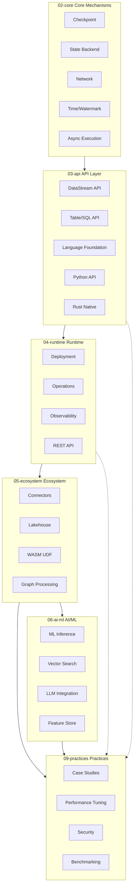
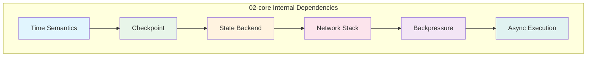
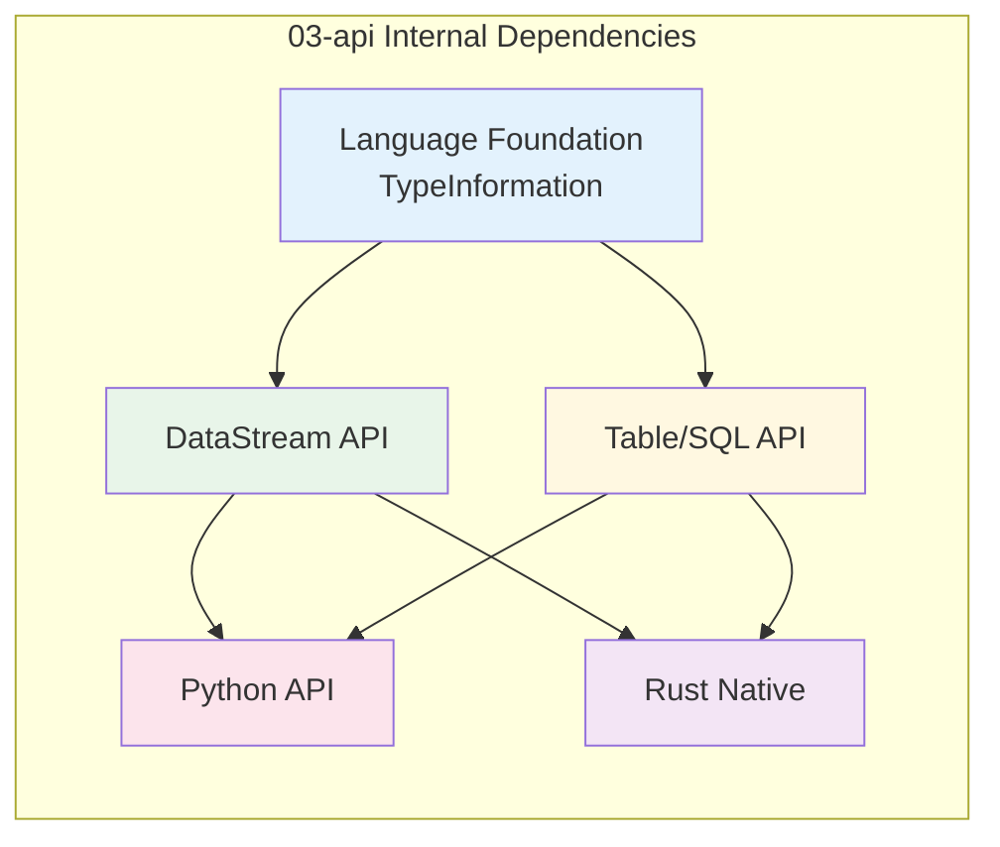

# Flink/ Tech Stack Dependency Panorama

> Stage: Flink/00-meta | Prerequisites: None | Formalization Level: L3

---

## Table of Contents

- [Flink/ Tech Stack Dependency Panorama](#flink-tech-stack-dependency-panorama)
  - [Table of Contents](#table-of-contents)
  - [1. Definitions](#1-definitions)
    - [Def-F-D-01 (Tech Stack Dependency Relation)](#def-f-d-01-tech-stack-dependency-relation)
    - [Def-F-D-02 (Core Mechanism Layer)](#def-f-d-02-core-mechanism-layer)
    - [Def-F-D-03 (API Abstraction Layer)](#def-f-d-03-api-abstraction-layer)
    - [Def-F-D-04 (Runtime Layer)](#def-f-d-04-runtime-layer)
    - [Def-F-D-05 (Ecosystem Layer)](#def-f-d-05-ecosystem-layer)
    - [Def-F-D-06 (Engineering Practices Layer)](#def-f-d-06-engineering-practices-layer)
    - [Def-F-D-07 (Dependency Strength)](#def-f-d-07-dependency-strength)
  - [2. Properties](#2-properties)
    - [Lemma-F-D-01 (Core Layer Foundationality)](#lemma-f-d-01-core-layer-foundationality)
    - [Lemma-F-D-02 (API Layer Bridging)](#lemma-f-d-02-api-layer-bridging)
    - [Lemma-F-D-03 (Runtime Layer Serviceability)](#lemma-f-d-03-runtime-layer-serviceability)
    - [Prop-F-D-01 (Tech Stack Transitivity)](#prop-f-d-01-tech-stack-transitivity)
  - [3. Relations](#3-relations)
    - [Relation 1: Core → API Support Relation {#relation-1-core--api-support-relation}](#relation-1-core--api-support-relation-relation-1-core--api-support-relation)
    - [Relation 2: API → Runtime Dependency Relation {#relation-2-api--runtime-dependency-relation}](#relation-2-api--runtime-dependency-relation-relation-2-api--runtime-dependency-relation)
    - [Relation 3: Runtime → Ecosystem Integration Relation](#relation-3-runtime--ecosystem-integration-relation)
    - [Relation 4: Ecosystem → Practices Guidance Relation](#relation-4-ecosystem--practices-guidance-relation)
  - [4. Argumentation](#4-argumentation)
    - [4.1 Five-Layer Architecture Design Principles](#41-five-layer-architecture-design-principles)
    - [4.2 Dependency Formation Mechanism](#42-dependency-formation-mechanism)
    - [4.3 Inter-layer Decoupling and Cohesion Analysis](#43-inter-layer-decoupling-and-cohesion-analysis)
  - [5. Proof](#5-proof)
    - [Thm-F-D-01 (Tech Stack Completeness Theorem)](#thm-f-d-01-tech-stack-completeness-theorem)
  - [6. Examples](#6-examples)
    - [6.1 Core → API Dependency Example {#61-core--api-dependency-example}](#61-core--api-dependency-example-61-core--api-dependency-example)
    - [6.2 API → Runtime Dependency Example](#62-api--runtime-dependency-example)
    - [6.3 Runtime → Ecosystem Dependency Example](#63-runtime--ecosystem-dependency-example)
    - [6.4 Ecosystem → Practices Dependency Example](#64-ecosystem--practices-dependency-example)
  - [7. Visualizations](#7-visualizations)
    - [Figure 1: Layered Tech Stack Dependency Panorama](#figure-1-layered-tech-stack-dependency-panorama)
    - [Figure 2: Core Mechanism Internal Dependencies](#figure-2-core-mechanism-internal-dependencies)
    - [Figure 3: API Layer Internal Dependencies](#figure-3-api-layer-internal-dependencies)
    - [Figure 4: Runtime Layer Internal Dependencies](#figure-4-runtime-layer-internal-dependencies)
  - [8. References](#8-references)

---

## 1. Definitions

### Def-F-D-01 (Tech Stack Dependency Relation)

**Definition**: Tech stack dependency relations refer to the unidirectional or bidirectional support relationships among modules, components, and documents in the Flink ecosystem, indicating the direct or indirect needs of upper-layer functions for lower-layer capabilities.

Formal statement:

```
Let M = {m₁, m₂, ..., mₙ} be the set of Flink modules
Dependency relation D ⊆ M × M × S, where S = {Strong, Medium, Weak} is dependency strength
If (mᵢ, mⱼ, s) ∈ D, it means mᵢ has a dependency of strength s on mⱼ
```

### Def-F-D-02 (Core Mechanism Layer)

**Definition**: Flink's core mechanism layer (`02-core/`) contains the foundational capabilities of the stream computing engine, including Checkpoint, State Backend, network stack, time semantics, and other low-level implementations.

**Included Modules**:

| Module | Document | Core Abstraction |
|--------|----------|------------------|
| Checkpoint | `checkpoint-mechanism-deep-dive.md` | CheckpointCoordinator |
| State Backend | `state-backend-evolution-analysis.md` | StateBackend |
| Network | `backpressure-and-flow-control.md` | NetworkStack |
| Time | `time-semantics-and-watermark.md` | WatermarkStrategy |

### Def-F-D-03 (API Abstraction Layer)

**Definition**: The API abstraction layer (`03-api/`) provides business-oriented programming interfaces for users, shielding underlying implementation details, including DataStream API, Table/SQL API, language foundation support, etc.

**Included Modules**:

| Module | Document | Core Abstraction |
|--------|----------|------------------|
| DataStream API | `09-language-foundations/datastream-api-cheatsheet.md` | StreamExecutionEnvironment |
| Table/SQL API | `03.02-table-sql-api/flink-table-sql-complete-guide.md` | TableEnvironment |
| Language Foundation | `09-language-foundations/flink-language-support-complete-guide.md` | TypeInformation |

### Def-F-D-04 (Runtime Layer)

**Definition**: The runtime layer (`04-runtime/`) is responsible for task deployment, scheduling, operations, and observability, acting as a bridge between the API layer and underlying resources.

**Included Modules**:

| Module | Document | Core Abstraction |
|--------|----------|------------------|
| Deployment | `04.01-deployment/flink-deployment-ops-complete-guide.md` | ClusterClient |
| Operations | `04.02-operations/production-checklist.md` | RestClusterClient |
| Observability | `04.03-observability/flink-observability-complete-guide.md` | MetricReporter |

### Def-F-D-05 (Ecosystem Layer)

**Definition**: The ecosystem layer (`05-ecosystem/`, `06-ai-ml/`) contains Flink's integration connectors with external systems, Lakehouse integration, AI/ML capabilities, and other extended functions.

**Included Modules**:

| Module | Document | Core Abstraction |
|--------|----------|------------------|
| Connectors | `05.01-connectors/flink-connectors-ecosystem-complete-guide.md` | Source/Sink |
| Lakehouse | `05.02-lakehouse/streaming-lakehouse-architecture.md` | TableFormat |
| AI/ML | `06-ai-ml/flink-ai-ml-integration-complete-guide.md` | ML Inference |

### Def-F-D-06 (Engineering Practices Layer)

**Definition**: The engineering practices layer (`09-practices/`) contains real-world cases, performance tuning guides, troubleshooting handbooks, and other practical documents built on top of lower-layer tech stacks.

**Included Modules**:

| Module | Document | Core Abstraction |
|--------|----------|------------------|
| Case Studies | `09.01-case-studies/case-*.md` | Real-world Patterns |
| Performance Tuning | `09.03-performance-tuning/production-config-templates.md` | Tuning Guidelines |
| Troubleshooting | `09.03-performance-tuning/troubleshooting-handbook.md` | Diagnosis Flow |

### Def-F-D-07 (Dependency Strength)

**Definition**: Dependency strength indicates the tightness of dependency between modules, divided into three levels:

| Level | Symbol | Description | Example |
|-------|--------|-------------|---------|
| Strong | Strong | Function fully dependent, cannot work independently | DataStream API depends on Checkpoint |
| Medium | Medium | Function partially dependent, has fallback options | Connector depends on Deployment |
| Weak | Weak | Function recommended dependent, can be used independently | Case Study depends on Connector |

---

## 2. Properties

### Lemma-F-D-01 (Core Layer Foundationality)

**Lemma**: The core mechanism layer (Core) is the unique foundational layer of the Flink tech stack, not dependent on any other Flink internal modules.

**Proof**:

- The core layer is implemented directly on top of JVM, operating system, and network protocols
- The core layer provides foundational capabilities to all upper layers
- Internal modules within the core layer have dependencies, but there are no external-layer dependencies ∎

### Lemma-F-D-02 (API Layer Bridging)

**Lemma**: The API layer is the bridge between user code and runtime, exposing programming interfaces upward and calling core capabilities downward.

**Proof**:

- DataStream API internally uses the Checkpoint mechanism to implement fault tolerance
- Table/SQL API executes physically through the Runtime layer
- The API layer does not directly manipulate underlying resources, but proxies through the Runtime layer ∎

### Lemma-F-D-03 (Runtime Layer Serviceability)

**Lemma**: The runtime layer provides public services such as deployment, scheduling, and monitoring to upper layers.

**Proof**:

- The Deployment module provides execution environments for all APIs
- The Observability module provides metrics capabilities for all components
- The runtime layer does not implement business logic, only provides service support ∎

### Prop-F-D-01 (Tech Stack Transitivity)

**Proposition**: Tech stack dependencies are transitive, i.e., if A → B and B → C, then A indirectly depends on C.

**Formal Statement**:

```
∀A,B,C ∈ M: (A → B) ∧ (B → C) ⟹ (A ↝ C)
```

**Engineering Significance**:

- Case Studies indirectly depend on the Checkpoint mechanism
- Performance tuning requires understanding State Backend characteristics
- Ecological connectors depend on runtime deployment capabilities

---

## 3. Relations

### Relation 1: Core → API Support Relation {#relation-1-core--api-support-relation}

The core layer provides foundational capability support such as fault tolerance, state management, and network communication to the API layer.

```
Flink/02-core (Core Mechanisms)
    ├── checkpoint-mechanism-deep-dive.md
    │       ↓ Supports [Strong]
    ├── 03-api/09-language-foundations/
    │       └── datastream-api-cheatsheet.md
    │       └── flink-datastream-api-complete-guide.md
    │
    ├── state-backend-evolution-analysis.md
    │       ↓ Supports [Strong]
    ├── 03-api/03.02-table-sql-api/
    │       └── flink-table-sql-complete-guide.md
    │
    └── backpressure-and-flow-control.md
            ↓ Supports [Medium]
            03-api/09-language-foundations/
                └── flink-language-support-complete-guide.md
```

### Relation 2: API → Runtime Dependency Relation {#relation-2-api--runtime-dependency-relation}

The API layer depends on the runtime layer to provide deployment execution and resource management capabilities.

```
03-api/ (API Layer)
    ├── DataStream API
    │       ↓ Requires [Strong]
    ├── 04-runtime/04.01-deployment/
    │       └── flink-deployment-ops-complete-guide.md
    │       └── kubernetes-deployment-production-guide.md
    │
    └── Table/SQL API
            ↓ Requires [Strong]
            04-runtime/04.03-observability/
                └── flink-observability-complete-guide.md
                └── metrics-and-monitoring.md
```

### Relation 3: Runtime → Ecosystem Integration Relation

The runtime layer provides runtime environment and resource scheduling support to the ecosystem layer.

```
04-runtime/ (Runtime)
    ├── deployment
    │       ↓ Integrates [Medium]
    ├── 05-ecosystem/05.01-connectors/
    │       └── flink-connectors-ecosystem-complete-guide.md
    │       └── kafka-integration-patterns.md
    │
    └── observability
            ↓ Integrates [Medium]
            05-ecosystem/05.02-lakehouse/
                └── streaming-lakehouse-architecture.md
                └── flink-iceberg-integration.md
```

### Relation 4: Ecosystem → Practices Guidance Relation

Practical experience from the ecosystem layer guides the cases and tuning solutions in the engineering practices layer.

```
05-ecosystem/ (Ecosystem)
    ├── connectors
    │       ↓ Guides [Weak]
    ├── 09-practices/09.01-case-studies/
    │       └── case-iot-stream-processing.md
    │       └── case-financial-realtime-risk-control.md
    │       └── case-ecommerce-realtime-recommendation.md
    │
    └── ai-ml
            ↓ Guides [Weak]
            09-practices/09.03-performance-tuning/
                └── production-config-templates.md
                └── performance-tuning-guide.md
```

---

## 4. Argumentation

### 4.1 Five-Layer Architecture Design Principles

The Flink tech stack adopts a five-layer architecture design, following the classical "abstraction-implementation" layering principle of computer systems:

| Layer | Design Principle | Core Responsibility |
|-------|------------------|---------------------|
| Core | Minimal completeness | Provide the most basic stream computing primitives |
| API | User-friendly | Provide easy-to-use programming interfaces |
| Runtime | Resource management | Provide execution environment and operations capabilities |
| Ecosystem | Open extension | Provide external system integration capabilities |
| Practices | Experience accumulation | Provide best practices and cases |

### 4.2 Dependency Formation Mechanism

Dependency formation follows these mechanisms:

1. **Functional dependency**: Upper-layer functions require lower-layer capability support
   - DataStream API needs Checkpoint to implement Exactly-Once

2. **Data dependency**: Upper layers process data produced by lower layers
   - Observability collects Metrics produced by Runtime

3. **Control dependency**: Upper layers control execution through lower-layer interfaces
   - Deployment allocates TaskManagers through ResourceManager

### 4.3 Inter-layer Decoupling and Cohesion Analysis

**High Cohesion**:

- Modules within each layer are organized around common responsibilities
- Core layer focuses on four themes: fault tolerance, state, network, and time
- API layer revolves around two programming paradigms: DataStream and Table

**Low Coupling**:

- Layers interact through clear interfaces
- Lower-layer changes reduce upper-layer impact through interface adaptation
- Runtime layer implements abstractions, hiding underlying differences

---

## 5. Proof

### Thm-F-D-01 (Tech Stack Completeness Theorem)

**Theorem**: Flink's five-layer tech stack structure covers all elements from底层 mechanisms to upper-layer practices of stream computing systems, forming a complete technical system.

**Proof**:

Let C = {c₁, c₂, ..., cₙ} be the set of capabilities required by a stream computing system. We need to prove:

```
∀c ∈ C, ∃L ∈ {Core, API, Runtime, Ecosystem, Practices}: c ∈ capabilities(L)
```

**Case analysis**:

1. **Fault Tolerance**
   - Provided by Core layer's Checkpoint mechanism
   - Formalized: `checkpoint-mechanism-deep-dive.md` defines Thm-F-02-01

2. **State Management**
   - Provided by Core layer's State Backend
   - Formalized: `state-backend-evolution-analysis.md` defines Def-F-02-06

3. **Programming Interface**
   - Provided by API layer's DataStream/Table API
   - Formalized: `flink-table-sql-complete-guide.md` defines Def-F-03-01

4. **Deployment & Execution**
   - Provided by Runtime layer's Deployment module
   - Formalized: `flink-deployment-ops-complete-guide.md` defines the complete deployment process

5. **External Integration**
   - Provided by Ecosystem layer's Connectors
   - Formalized: `flink-connectors-ecosystem-complete-guide.md` defines Source/Sink interfaces

6. **Production Practices**
   - Provided by Practices layer's cases and tuning guides
   - Formalized: `production-config-templates.md` defines production environment configuration templates

**Conclusion**:
Since all core capabilities of stream computing systems find corresponding implementations in the five-layer tech stack, and there are correct dependency relationships between layers, the Flink tech stack structure is complete. ∎

---

## 6. Examples

### 6.1 Core → API Dependency Example {#61-core--api-dependency-example}

**Example**: Checkpoint mechanism supports DataStream API's Exactly-Once semantics

```java

import org.apache.flink.streaming.api.environment.StreamExecutionEnvironment;
import org.apache.flink.streaming.api.CheckpointingMode;

// DataStream API code example
StreamExecutionEnvironment env =
    StreamExecutionEnvironment.getExecutionEnvironment();

// Depends on Core layer Checkpoint mechanism
env.enableCheckpointing(60000);
env.getCheckpointConfig().setCheckpointingMode(
    CheckpointingMode.EXACTLY_ONCE
);

// Depends on Core layer State Backend
env.setStateBackend(new RocksDBStateBackend("hdfs://..."));
```

**Dependency Strength**: Strong - Without the Checkpoint mechanism, DataStream API cannot guarantee Exactly-Once

### 6.2 API → Runtime Dependency Example

**Example**: Table API depends on Runtime layer's execution environment deployment

```java

import org.apache.flink.table.api.TableEnvironment;

// Table API code example
TableEnvironment tableEnv = TableEnvironment.create(
    EnvironmentSettings.inStreamingMode()
);

// After compiling to execution plan, requires Runtime layer Deployment module to deploy and execute
tableEnv.executeSql("INSERT INTO sink SELECT * FROM source");
```

**Dependency Strength**: Strong - Table API queries must be converted to physical execution plans through the Runtime layer

### 6.3 Runtime → Ecosystem Dependency Example

**Example**: Deployment module integration with Kafka Connector

```yaml
# Flink Kubernetes deployment configuration
spec:
  job:
    jarURI: local:///opt/flink/examples/streaming/KafkaExample.jar
    parallelism: 4
    # Depends on Runtime layer resource scheduling
    resources:
      memory: "2Gi"
      cpu: 2
```

**Dependency Strength**: Medium - Connectors can run in multiple deployment modes, but require Runtime to provide resources

### 6.4 Ecosystem → Practices Dependency Example

**Example**: Kafka Connector practical experience guides IoT case implementation

```java
// From case-iot-stream-processing.md best practices
// Based on guidance from flink-connectors-ecosystem-complete-guide.md

// 1. Use Exactly-Once Source
FlinkKafkaConsumer<Event> source = new FlinkKafkaConsumer<>(
    "iot-events",
    new EventDeserializationSchema(),
    properties
);
source.setStartFromLatest();
source.setCommitOffsetsOnCheckpoints(true); // Exactly-Once configuration

// 2. Based on tuning recommendations from production-config-templates.md
env.getConfig().setAutoWatermarkInterval(200);
env.getCheckpointConfig().setMinPauseBetweenCheckpoints(30000);
```

**Dependency Strength**: Weak - Can run independently without following best practices, but following them is recommended

---

## 7. Visualizations

### Figure 1: Layered Tech Stack Dependency Panorama



### Figure 2: Core Mechanism Internal Dependencies



### Figure 3: API Layer Internal Dependencies



### Figure 4: Runtime Layer Internal Dependencies


---

## 8. References
