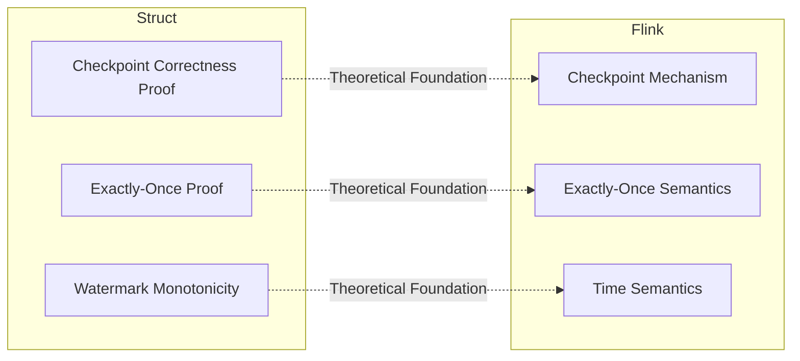
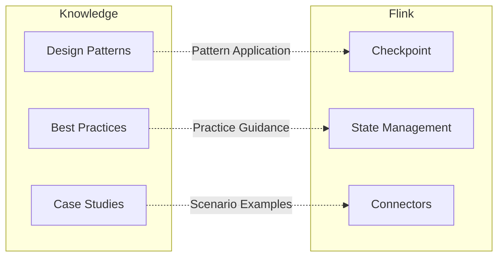

# Flink/ Documentation Index

> **Stage**: Flink/ | **Prerequisites**: [Project Root](../README.md), [Knowledge/00-INDEX.md](../Knowledge/00-INDEX.md) | **Status**: Continuously Updated

## Introduction

The **Flink/** directory contains comprehensive technical documentation for the Apache Flink stream processing framework, covering everything from core concepts to production practices.

**Core Focus Areas**:

- 🏗️ Architecture: Flink system architecture and deployment patterns
- ⚙️ Core Mechanisms: Checkpoint, state management, time semantics
- 🔌 API Ecosystem: DataStream, Table API, SQL
- 🌐 Ecosystem: Connectors, Lakehouse integration
- 🤖 AI/ML Integration: Real-time machine learning, LLM integration
- 🦀 Rust Ecosystem: WASM UDF, high-performance computing
- 📊 Performance Optimization: Benchmarks, tuning guides
- 🚀 Roadmap: Flink 2.4/2.5/3.0 version evolution

---

## Quick Navigation

| Entry | Description | Recommendation |
|-------|-------------|----------------|
| [00-meta/00-INDEX.md](00-meta/00-INDEX.md) | Detailed category index | ⭐⭐⭐⭐⭐ |
| [00-meta/00-QUICK-START.md](00-meta/00-QUICK-START.md) | Quick start guide | ⭐⭐⭐⭐⭐ |
| [02-core/checkpoint-mechanism-deep-dive.md](02-core/checkpoint-mechanism-deep-dive.md) | Deep dive into Checkpoint mechanism | ⭐⭐⭐⭐⭐ |
| [03-api/03.02-table-sql-api/flink-table-sql-complete-guide.md](03-api/03.02-table-sql-api/flink-table-sql-complete-guide.md) | Complete SQL guide | ⭐⭐⭐⭐⭐ |

---

## Module Index

### 01. Architecture

> System architecture, deployment patterns, version evolution

| Document | Description | Version |
|----------|-------------|---------|
| [01-concepts/deployment-architectures.md](01-concepts/deployment-architectures.md) | Complete deployment architecture analysis | 1.17+ |
| [01-concepts/flink-1.x-vs-2.0-comparison.md](01-concepts/flink-1.x-vs-2.0-comparison.md) | 1.x vs 2.0 architecture comparison | 1.18-2.0 |
| [01-concepts/flink-system-architecture-deep-dive.md](01-concepts/flink-system-architecture-deep-dive.md) | Deep dive into system architecture | 1.17+ |
| [01-concepts/disaggregated-state-analysis.md](01-concepts/disaggregated-state-analysis.md) | Disaggregated state storage | 2.0+ |

---

### 02. Core Mechanisms

> Checkpoint, state management, time semantics, fault tolerance

#### Checkpoint & Fault Tolerance ⭐

| Document | Description | Version |
|----------|-------------|---------|
| [02-core/checkpoint-mechanism-deep-dive.md](02-core/checkpoint-mechanism-deep-dive.md) | Deep dive into Checkpoint mechanism | 1.17+ |
| [02-core/exactly-once-semantics-deep-dive.md](02-core/exactly-once-semantics-deep-dive.md) | Exactly-Once semantics explained | 1.17+ |
| [02-core/exactly-once-end-to-end.md](02-core/exactly-once-end-to-end.md) | End-to-end Exactly-Once | 1.17+ |
| [02-core/smart-checkpointing-strategies.md](02-core/smart-checkpointing-strategies.md) | Smart Checkpoint strategies | 1.18+ |

#### State Management ⭐

| Document | Description | Version |
|----------|-------------|---------|
| [02-core/flink-state-management-complete-guide.md](02-core/flink-state-management-complete-guide.md) | Complete state management guide | 1.17+ |
| [02-core/state-backends-deep-comparison.md](02-core/state-backends-deep-comparison.md) | State Backend deep comparison | 1.17+ |
| [02-core/forst-state-backend.md](02-core/forst-state-backend.md) | ForSt State Backend | 2.0+ |
| [02-core/flink-state-ttl-best-practices.md](02-core/flink-state-ttl-best-practices.md) | State TTL best practices | 1.17+ |

#### Time & Watermark ⭐

| Document | Description | Version |
|----------|-------------|---------|
| [02-core/time-semantics-and-watermark.md](02-core/time-semantics-and-watermark.md) | Time semantics and Watermark | 1.17+ |

#### Execution Optimization

| Document | Description | Version |
|----------|-------------|---------|
| [02-core/backpressure-and-flow-control.md](02-core/backpressure-and-flow-control.md) | Backpressure and flow control | 1.17+ |
| [02-core/async-execution-model.md](02-core/async-execution-model.md) | Async execution model | 1.18+ |
| [02-core/adaptive-execution-engine-v2.md](02-core/adaptive-execution-engine-v2.md) | Adaptive execution engine V2 | 1.18+ |
| [02-core/multi-way-join-optimization.md](02-core/multi-way-join-optimization.md) | Multi-way Join optimization | 1.18+ |
| [02-core/delta-join.md](02-core/delta-join.md) | Delta Join | 1.19+ |

---

### 03. API & Languages

> DataStream API, Table API, SQL, multi-language support

#### Table API & SQL ⭐

| Document | Description | Version |
|----------|-------------|---------|
| [03-api/03.02-table-sql-api/flink-table-sql-complete-guide.md](03-api/03.02-table-sql-api/flink-table-sql-complete-guide.md) | Complete guide | 1.17+ |
| [03-api/03.02-table-sql-api/flink-sql-window-functions-deep-dive.md](03-api/03.02-table-sql-api/flink-sql-window-functions-deep-dive.md) | Window functions deep dive | 1.17+ |
| [03-api/03.02-table-sql-api/flink-sql-calcite-optimizer-deep-dive.md](03-api/03.02-table-sql-api/flink-sql-calcite-optimizer-deep-dive.md) | Calcite optimizer | 1.17+ |
| [03-api/03.02-table-sql-api/flink-cep-complete-guide.md](03-api/03.02-table-sql-api/flink-cep-complete-guide.md) | CEP complete guide | 1.17+ |
| [03-api/03.02-table-sql-api/built-in-functions-complete-list.md](03-api/03.02-table-sql-api/built-in-functions-complete-list.md) | Built-in functions list | 1.17+ |
| [03-api/03.02-table-sql-api/ansi-sql-2023-compliance-guide.md](03-api/03.02-table-sql-api/ansi-sql-2023-compliance-guide.md) | ANSI SQL 2023 | 1.19+ |

#### DataStream API

| Document | Description | Version |
|----------|-------------|---------|
| [03-api/09-language-foundations/flink-datastream-api-complete-guide.md](03-api/09-language-foundations/flink-datastream-api-complete-guide.md) | Complete guide | 1.17+ |
| [03-api/09-language-foundations/datastream-api-cheatsheet.md](03-api/09-language-foundations/datastream-api-cheatsheet.md) | Cheatsheet | 1.17+ |
| [01-concepts/datastream-v2-semantics.md](01-concepts/datastream-v2-semantics.md) | DataStream V2 | 1.19+ |

#### Multi-Language Support

| Document | Description | Version |
|----------|-------------|---------|
| [03-api/09-language-foundations/pyflink-complete-guide.md](03-api/09-language-foundations/pyflink-complete-guide.md) | PyFlink complete guide | 1.17+ |
| [03-api/09-language-foundations/01.01-scala-types-for-streaming.md](03-api/09-language-foundations/01.01-scala-types-for-streaming.md) | Scala type system | 1.17+ |
| [03-api/09-language-foundations/flink-rust-native-api-guide.md](03-api/09-language-foundations/flink-rust-native-api-guide.md) | Rust Native API | 2.0+ |

---

### 04. Runtime & Operations

> Deployment, operations, observability

#### Deployment

| Document | Description | Version |
|----------|-------------|---------|
| [04-runtime/04.01-deployment/flink-deployment-ops-complete-guide.md](04-runtime/04.01-deployment/flink-deployment-ops-complete-guide.md) | Deployment and operations complete guide | 1.17+ |
| [04-runtime/04.01-deployment/kubernetes-deployment-production-guide.md](04-runtime/04.01-deployment/kubernetes-deployment-production-guide.md) | K8s production deployment | 1.17+ |
| [04-runtime/04.01-deployment/flink-kubernetes-operator-deep-dive.md](04-runtime/04.01-deployment/flink-kubernetes-operator-deep-dive.md) | K8s Operator | 1.17+ |
| [04-runtime/04.01-deployment/flink-serverless-architecture.md](04-runtime/04.01-deployment/flink-serverless-architecture.md) | Serverless architecture | 1.19+ |

#### Observability

| Document | Description | Version |
|----------|-------------|---------|
| [04-runtime/04.03-observability/flink-observability-complete-guide.md](04-runtime/04.03-observability/flink-observability-complete-guide.md) | Observability complete guide | 1.17+ |
| [04-runtime/04.03-observability/metrics-and-monitoring.md](04-runtime/04.03-observability/metrics-and-monitoring.md) | Metrics and monitoring | 1.17+ |
| [04-runtime/04.03-observability/distributed-tracing.md](04-runtime/04.03-observability/distributed-tracing.md) | Distributed tracing | 1.18+ |

---

### 05. Ecosystem

> Connectors, Lakehouse, graph processing

#### Connectors ⭐

| Document | Description | Version |
|----------|-------------|---------|
| [05-ecosystem/05.01-connectors/flink-connectors-ecosystem-complete-guide.md](05-ecosystem/05.01-connectors/flink-connectors-ecosystem-complete-guide.md) | Connectors ecosystem guide | 1.17+ |
| [05-ecosystem/05.01-connectors/kafka-integration-patterns.md](05-ecosystem/05.01-connectors/kafka-integration-patterns.md) | Kafka integration | 1.17+ |
| [05-ecosystem/05.01-connectors/flink-cdc-3.0-data-integration.md](05-ecosystem/05.01-connectors/flink-cdc-3.0-data-integration.md) | CDC 3.0 | 1.18+ |
| [05-ecosystem/05.01-connectors/jdbc-connector-complete-guide.md](05-ecosystem/05.01-connectors/jdbc-connector-complete-guide.md) | JDBC connector | 1.17+ |

#### Lakehouse

| Document | Description | Version |
|----------|-------------|---------|
| [05-ecosystem/05.02-lakehouse/streaming-lakehouse-architecture.md](05-ecosystem/05.02-lakehouse/streaming-lakehouse-architecture.md) | Lakehouse architecture | 1.18+ |
| [05-ecosystem/05.02-lakehouse/flink-iceberg-integration.md](05-ecosystem/05.02-lakehouse/flink-iceberg-integration.md) | Iceberg integration | 1.18+ |
| [05-ecosystem/05.02-lakehouse/flink-paimon-integration.md](05-ecosystem/05.02-lakehouse/flink-paimon-integration.md) | Paimon integration | 1.18+ |

---

### 06. AI/ML Integration

> Real-time machine learning, LLM integration, vector search

| Document | Description | Version |
|----------|-------------|---------|
| [06-ai-ml/flink-ai-ml-integration-complete-guide.md](06-ai-ml/flink-ai-ml-integration-complete-guide.md) | AI/ML integration complete guide | 1.19+ |
| [06-ai-ml/flink-llm-integration.md](06-ai-ml/flink-llm-integration.md) | LLM integration | 1.20+ |
| [06-ai-ml/flink-agents-flip-531.md](06-ai-ml/flink-agents-flip-531.md) | AI Agents (FLIP-531) | 2.4+ |
| [06-ai-ml/flink-realtime-ml-inference.md](06-ai-ml/flink-realtime-ml-inference.md) | Real-time ML inference | 1.19+ |
| [06-ai-ml/realtime-feature-engineering-guide.md](06-ai-ml/realtime-feature-engineering-guide.md) | Real-time feature engineering | 1.19+ |
| [06-ai-ml/vector-database-integration.md](06-ai-ml/vector-database-integration.md) | Vector database integration | 1.20+ |

---

### 07. Rust Native Ecosystem

> WASM UDF, SIMD optimization, high-performance computing

| Document | Description | Version |
|----------|-------------|---------|
| [07-rust-native/00-MASTER-INDEX.md](07-rust-native/00-MASTER-INDEX.md) | Rust ecosystem master index | - |
| [07-rust-native/flash-engine/01-flash-architecture.md](07-rust-native/flash-engine/01-flash-architecture.md) | Flash engine architecture | 2.0+ |
| [07-rust-native/simd-optimization/01-simd-fundamentals.md](07-rust-native/simd-optimization/01-simd-fundamentals.md) | SIMD optimization fundamentals | 2.0+ |
| [07-rust-native/wasm-3.0/01-wasm-3.0-spec-guide.md](07-rust-native/wasm-3.0/01-wasm-3.0-spec-guide.md) | WASM 3.0 guide | 2.0+ |

---

### 08. Roadmap

> Version evolution and future planning

| Document | Description | Version |
|----------|-------------|---------|
| [08-roadmap/08.01-flink-24/flink-version-evolution-complete-guide.md](08-roadmap/08.01-flink-24/flink-version-evolution-complete-guide.md) | Complete version evolution guide | All versions |
| [08-roadmap/08.01-flink-24/flink-2.4-tracking.md](08-roadmap/08.01-flink-24/flink-2.4-tracking.md) | Flink 2.4 feature tracking | 2.4 |
| [08-roadmap/08.01-flink-24/flink-2.5-preview.md](08-roadmap/08.01-flink-24/flink-2.5-preview.md) | Flink 2.5 preview | 2.5 |
| [08-roadmap/08.01-flink-24/flink-30-architecture-redesign.md](08-roadmap/08.01-flink-24/flink-30-architecture-redesign.md) | Flink 3.0 architecture redesign | 3.0 |

---

### 09. Engineering Practices

> Case studies, performance tuning, best practices

#### Case Studies

| Document | Description | Scenario |
|----------|-------------|----------|
| [09-practices/09.01-case-studies/case-financial-realtime-risk-control.md](09-practices/09.01-case-studies/case-financial-realtime-risk-control.md) | Financial real-time risk control | Finance |
| [09-practices/09.01-case-studies/case-ecommerce-realtime-recommendation.md](09-practices/09.01-case-studies/case-ecommerce-realtime-recommendation.md) | E-commerce real-time recommendation | E-commerce |
| [09-practices/09.01-case-studies/case-iot-stream-processing.md](09-practices/09.01-case-studies/case-iot-stream-processing.md) | IoT stream processing | IoT |
| [09-practices/09.01-case-studies/case-fraud-detection-advanced.md](09-practices/09.01-case-studies/case-fraud-detection-advanced.md) | Fraud detection | Security |

#### Performance Tuning

| Document | Description |
|----------|-------------|
| [09-practices/09.03-performance-tuning/06.02-performance-optimization-complete.md](09-practices/09.03-performance-tuning/06.02-performance-optimization-complete.md) | Complete performance optimization guide |
| [09-practices/09.03-performance-tuning/performance-tuning-guide.md](09-practices/09.03-performance-tuning/performance-tuning-guide.md) | Performance tuning guide |
| [09-practices/09.02-benchmarking/nexmark-2026-benchmark.md](09-practices/09.02-benchmarking/nexmark-2026-benchmark.md) | Nexmark benchmark |

#### Security

| Document | Description |
|----------|-------------|
| [09-practices/09.04-security/flink-security-complete-guide.md](09-practices/09.04-security/flink-security-complete-guide.md) | Security complete guide |
| [09-practices/09.04-security/security-hardening-guide.md](09-practices/09.04-security/security-hardening-guide.md) | Security hardening guide |

---

### 10. Internals

> Flink internal implementation source analysis

| Document | Description |
|----------|-------------|
| [10-internals/checkpoint-source-analysis.md](10-internals/checkpoint-source-analysis.md) | Checkpoint source analysis |
| [10-internals/jobmanager-source-analysis.md](10-internals/jobmanager-source-analysis.md) | JobManager source analysis |
| [10-internals/taskmanager-source-analysis.md](10-internals/taskmanager-source-analysis.md) | TaskManager source analysis |
| [10-internals/state-backend-internals.md](10-internals/state-backend-internals.md) | State Backend internals |
| [10-internals/network-stack-internals.md](10-internals/network-stack-internals.md) | Network Stack internals |

---

## Cross-Directory References

### Relationship with Struct/



### Relationship with Knowledge/



---

## Learning Paths

### Beginner Path 🌱

1. [00-meta/00-QUICK-START.md](00-meta/00-QUICK-START.md) - Quick start
2. [02-core/checkpoint-mechanism-deep-dive.md](02-core/checkpoint-mechanism-deep-dive.md) - Checkpoint mechanism
3. [02-core/time-semantics-and-watermark.md](02-core/time-semantics-and-watermark.md) - Time semantics
4. [03-api/09-language-foundations/flink-datastream-api-complete-guide.md](03-api/09-language-foundations/flink-datastream-api-complete-guide.md) - DataStream API
5. [03-api/03.02-table-sql-api/flink-table-sql-complete-guide.md](03-api/03.02-table-sql-api/flink-table-sql-complete-guide.md) - SQL guide

### Advanced Developer Path 🚀

1. [02-core/flink-state-management-complete-guide.md](02-core/flink-state-management-complete-guide.md) - State management
2. [02-core/exactly-once-semantics-deep-dive.md](02-core/exactly-once-semantics-deep-dive.md) - Exactly-Once
3. [05-ecosystem/05.01-connectors/flink-connectors-ecosystem-complete-guide.md](05-ecosystem/05.01-connectors/flink-connectors-ecosystem-complete-guide.md) - Connectors
4. [09-practices/09.03-performance-tuning/06.02-performance-optimization-complete.md](09-practices/09.03-performance-tuning/06.02-performance-optimization-complete.md) - Performance optimization
5. [04-runtime/04.01-deployment/flink-deployment-ops-complete-guide.md](04-runtime/04.01-deployment/flink-deployment-ops-complete-guide.md) - Deployment and operations

### Architect Path 🏗️

1. [08-roadmap/08.01-flink-24/flink-version-evolution-complete-guide.md](08-roadmap/08.01-flink-24/flink-version-evolution-complete-guide.md) - Version evolution
2. [01-concepts/deployment-architectures.md](01-concepts/deployment-architectures.md) - Deployment architectures
3. [06-ai-ml/](06-ai-ml/) - AI/ML integration
4. [07-rust-native/](07-rust-native/) - Rust ecosystem

---

## Statistics

```
Flink/ Directory Statistics:
├── 01-concepts/:          4 docs (Architecture)
├── 02-core/:             20+ docs (Core Mechanisms)
├── 03-api/:              25+ docs (API Ecosystem)
├── 04-runtime/:          30+ docs (Runtime & Operations)
├── 05-ecosystem/:        30+ docs (Ecosystem)
├── 06-ai-ml/:            25+ docs (AI/ML Integration)
├── 07-rust-native/:      40+ docs (Rust Ecosystem)
├── 08-roadmap/:          15+ docs (Roadmap)
├── 09-practices/:        40+ docs (Engineering Practices)
├── 10-internals/:        10 docs (Internals)
└── 00-meta/:              4 docs (Meta docs)
----------------------------------------
Total: ~ 390+ docs
Coverage: Flink 1.17 - 3.0
```

---

## Navigation Links

**Project Indexes**:

- [📁 Project Root](../README.md) — Project overview
- [🗺️ Knowledge/ Index](../Knowledge/00-INDEX.md) — Knowledge structure
- [🧮 Struct/ Index](../Struct/00-INDEX.md) — Formal theory
- [📖 Theorem Registry](../THEOREM-REGISTRY.md) — Formal elements

**Auxiliary Tools**:

- [🗺️ Knowledge Graph](../knowledge-graph.html) — Interactive knowledge graph
- [📚 Glossary](../GLOSSARY.md) — Stream processing glossary
- [🔍 Search Guide](../SEARCH-GUIDE.md) — How to search efficiently

---

> **Document Specification**: This document follows the six-section template specification in [AGENTS.md](../AGENTS.md)
> **Updated**: 2026-04-12
