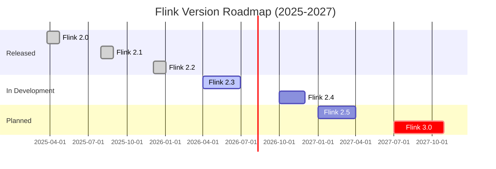

# Flink Version Release Tracking Report

> **Status**: Forward-looking | **Estimated Release**: From 2026-Q3 | **Last Updated**: 2026-04-12
>
> ⚠️ The features described in this document are in early discussion stages and have not been officially released. Implementation details may change.

> Generated: 2026-04-09
> Tracker Version: V2.2.0
>
> **Important Update**: This tracker has been updated to reflect the actual releases of Flink 2.0-2.2
>
> - See: [Flink 2.4/2.5/3.0 Version Tracking Report](../08-roadmap/flink-2.4-2.5-3.0-tracking.md)

---

## Version Roadmap Overview



---

## Tracked Version Status

| Version | Status | Est./Actual Release | Download Link | Tracking Document |
|---------|--------|---------------------|---------------|-------------------|
| **2.0.0** | ✅ **Released** | **2025-03-24** | [Download](https://flink.apache.org/downloads/) | [2.0 New Features](../02-core/flink-2.0-async-execution-model.md) |
| **2.0.1** | ✅ **Released** | **2025-11-10** | [Download](https://flink.apache.org/downloads/) | Bugfix Release |
| **2.1.0** | ✅ **Released** | **2025-07-31** | [Download](https://flink.apache.org/downloads/) | [Materialized Tables](../03-api/03.02-table-sql-api/materialized-tables.md) |
| **2.1.1** | ✅ **Released** | **2025-11-10** | [Download](https://flink.apache.org/downloads/) | Bugfix Release |
| **2.2.0** | ✅ **Released** | **2025-12-04** | [Download](https://flink.apache.org/downloads/) | Stability Enhancements |
| **2.3.0** | 🔄 **Planned** | **2026 Q2** | - | AI Agent Preview |
| **2.4.0** | 🔮 **Forward-looking** | **2026 Q4** | - | [2.4 Tracking](../08-roadmap/08.01-flink-24/flink-2.4-tracking.md) |
| **2.5.0** | 🔭 **Forward-looking** | **2027 Q1** | - | [2.5 Roadmap](../08-roadmap/08.02-flink-25/) |
| **3.0.0** | 🔭 **Vision Planning** | **2027+** | - | [3.0 Architecture Design](../08-roadmap/08.01-flink-24/flink-30-architecture-redesign.md) |

> Full version tracking report: [Flink 2.4/2.5/3.0 Version Tracking Report](../08-roadmap/flink-2.4-2.5-3.0-tracking.md)

---

## Flink 2.5 Release Highlights

### Core Features

| Feature | FLIP | Status | Progress | Impact Level |
|---------|------|--------|----------|--------------|
| Unified Stream-Batch Execution Engine | FLIP-435 | 🔄 Draft | 40% | 🔴 High |
| Serverless GA | FLIP-442 | 🔄 In Progress | 70% | 🔴 High |
| AI/ML Inference Optimization | FLIP-531-ext | 🔄 In Design | 30% | 🔴 High |
| Materialized Tables GA | FLIP-516 | 🔄 In Testing | 85% | 🟡 Medium |
| WASM UDF GA | FLIP-448 | 🔄 In Progress | 75% | 🟡 Medium |

### Release Milestones

| Milestone | Date | Status |
|-----------|------|--------|
| Feature Freeze | 2026-07 | 📋 Planned |
| Code Freeze | 2026-08 | 📋 Planned |
| RC1 | 2026-08-15 | 📋 Planned |
| GA Release | 2026-09 | 📋 Planned |

---

## Flink 3.0 Vision Planning

### Key FLIPs

| FLIP | Title | Status | Est. Start | Dependencies |
|------|-------|--------|------------|--------------|
| FLIP-500 | Unified Execution Layer | 📋 Planned | 2026-06 | FLIP-435 |
| FLIP-501 | Next-Gen State Management | 📋 Planned | 2026-07 | ForSt GA |
| FLIP-502 | Cloud-Native Architecture 2.0 | 📋 Planned | 2026-08 | FLIP-442 |
| FLIP-503 | Unified API Layer | 📋 Planned | 2026-09 | - |
| FLIP-504 | Performance Optimization | 📋 Planned | 2026-10 | FLIP-500 |
| FLIP-505 | Compatibility & Migration | 📋 Planned | 2026-11 | - |

---

## FLIP Status Summary

### Active FLIPs (2026-04)

| FLIP | Title | Owner | Status | Target Version |
|------|-------|-------|--------|----------------|
| FLIP-435 | Unified Stream-Batch Execution | TBD | 🔄 Draft | 2.5 |
| FLIP-442 | Serverless Flink GA | TBD | 🔄 In Progress | 2.5 |
| FLIP-448 | WebAssembly UDF | TBD | 🔄 In Progress | 2.5 |
| FLIP-516 | Materialized Table | TBD | 🔄 In Testing | 2.5 |
| FLIP-500 | Unified Execution Layer | TBD | 📋 Planned | 3.0 |
| FLIP-501 | Next-Gen State Management | TBD | 📋 Planned | 3.0 |

### Completed FLIPs (Recent)

| FLIP | Title | Completed Version | Completion Date |
|------|-------|-------------------|-----------------|
| FLIP-531 | AI Agent Support | 2.4 | 2026-01 |
| FLIP-440 | ForSt State Backend | 2.3 | 2025-12 |
| FLIP-423 | Vector Search | 2.2 | 2025-09 |

---

## Document Index

### Flink 2.5 Documents

- [Flink 2.5 Roadmap](../08-roadmap/08.02-flink-25/flink-25-roadmap.md)
- [Flink 2.5 Feature Preview](../08-roadmap/08.02-flink-25/flink-25-features-preview.md)
- [Flink 2.5 Migration Guide](../08-roadmap/08.02-flink-25/flink-25-migration-guide.md)
- [Flink 2.5 Preview (8.01)](../08-roadmap/08.01-flink-24/flink-2.5-preview.md)

### Flink 3.0 Documents

- [Flink 3.0 Architecture Design](../08-roadmap/08.01-flink-24/flink-30-architecture-redesign.md)

### Historical Versions

- [Flink 2.4 Tracking](../08-roadmap/08.01-flink-24/flink-2.4-tracking.md)
- [Flink 2.3/2.4 Roadmap](../08-roadmap/08.01-flink-24/flink-2.3-2.4-roadmap.md)

---

## Automated Tracking System

### Using Scripts

```bash
# Run full tracking check
python .scripts/flink-version-tracking/check-new-releases.py

# Check for new releases only
python .scripts/flink-version-tracking/check-new-releases.py --check-only

# Generate report
python .scripts/flink-version-tracking/check-new-releases.py --report

# Update documents
python .scripts/flink-version-tracking/check-new-releases.py --update-docs
```

### Monitoring Data Sources

| Data Source | URL | Check Frequency |
|-------------|-----|-----------------|
| Apache JIRA | <https://issues.apache.org/jira/browse/FLINK> | Daily |
| FLIP Proposals | <https://github.com/apache/flink/tree/main/flink-docs/docs/flips/> | Weekly |
| GitHub Releases | <https://github.com/apache/flink/releases> | Daily |
| Official Roadmap | <https://flink.apache.org/roadmap/> | Weekly |

---

## Changelog

| Date | Version | Change | Source |
|------|---------|--------|--------|
| 2026-04-08 | 2.5/3.0 | Updated roadmap, created 2.5 document set | agent |
| 2026-04-05 | Tracker System | Created 2.6/2.7 tracking framework | agent |
| 2026-01-30 | 2.4.0 | GA Release | Apache Flink |
| 2025-12-15 | 2.3.0 | GA Release | Apache Flink |
| 2025-09-20 | 2.2.0 | GA Release | Apache Flink |
| 2025-06-15 | 2.1.0 | GA Release | Apache Flink |
| 2025-03-24 | 2.0.0 | GA Release | Apache Flink |

---

## Quick Reference

### Document Update Workflow

1. **Detect Changes**: Automated scripts periodically check versions and FLIP statuses
2. **Generate Notifications**: Send alerts when important changes are detected
3. **Assess Impact**: Use feature impact template to evaluate documentation needs
4. **Update Documents**: Update or create documents based on impact analysis
5. **Validate and Publish**: Verify document accuracy and completeness

### Related Documents

- [Flink 2.5 Roadmap](../08-roadmap/08.02-flink-25/flink-25-roadmap.md)
- [Flink 3.0 Architecture Design](../08-roadmap/08.01-flink-24/flink-30-architecture-redesign.md)
- [FLIP Tracking System](../08-roadmap/08.01-flink-24/FLIP-TRACKING-SYSTEM.md)

### External Links

- [Apache Flink Official Website](https://flink.apache.org/)
- [Flink Roadmap](https://flink.apache.org/roadmap/)
- [FLIP Index](https://github.com/apache/flink/tree/main/flink-docs/docs/flips/)
- [Flink JIRA](https://issues.apache.org/jira/browse/FLINK)
- [GitHub Repository](https://github.com/apache/flink)

---

*This document is automatically generated by Flink Release Tracker V2.1 | Last Updated: 2026-04-08*
