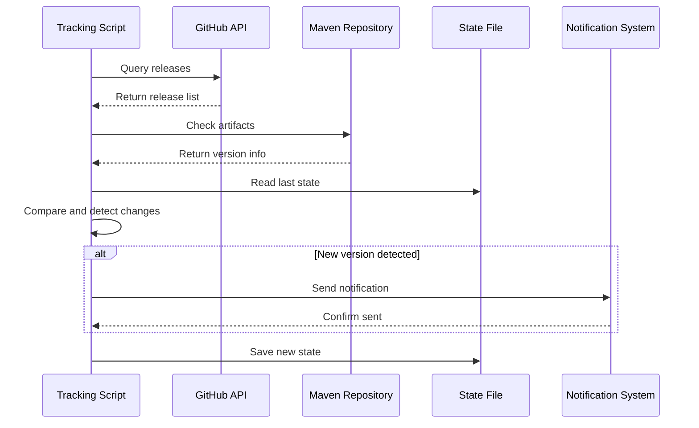
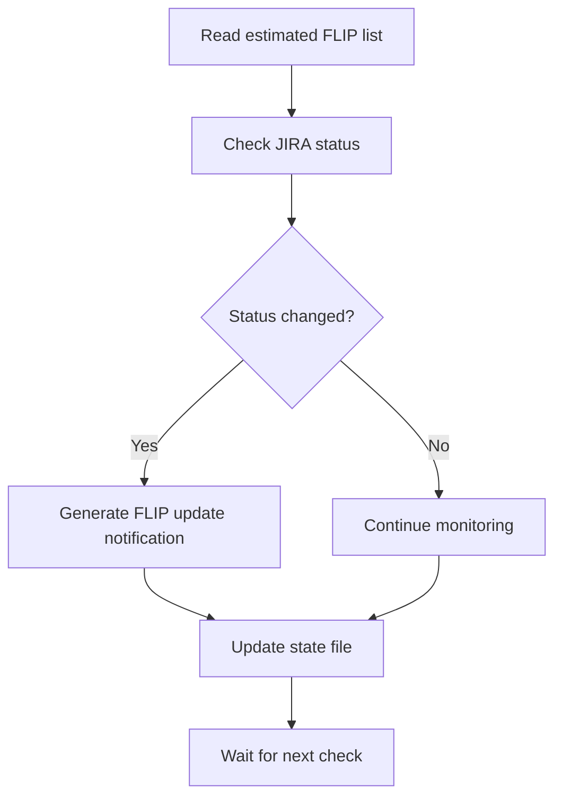
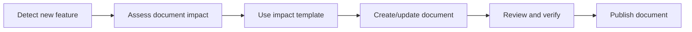

# Flink Version Tracking Mechanism

> Automated tracking of new features in Apache Flink 2.6/2.7 and subsequent versions

---

## Quick Start

### Run Tracking Checks

```bash
# Check version status
python .scripts/flink-release-tracker-v2.py --check

# Generate full report
python .scripts/flink-release-tracker-v2.py --report

# Send test notification
python .scripts/notify-flink-updates.py --test
```

### View Tracking Documents

| Document | Description |
|------|------|
| [Flink 2.6/2.7 Roadmap](./flink-26-27-roadmap.md) | Detailed version feature tracking |
| [Status Report](./flink-26-27-status-report.md) | Auto-generated status report |
| [Feature Impact Template](./feature-impact-template.md) | Template for assessing new feature impacts |

---

## System Architecture

```
┌─────────────────────────────────────────────────────────────┐
│                    Flink Version Tracking System V2         │
├─────────────────────────────────────────────────────────────┤
│                                                              │
│  ┌─────────────────┐    ┌─────────────────┐                 │
│  │  Data Source     │    │  State Management│                 │
│  │  Monitoring      │◄──►│                 │                 │
│  │  ├── GitHub     │    │  ├── versions   │                 │
│  │  ├── Maven      │    │  ├── flips      │                 │
│  │  ├── Downloads  │    │  └── history    │                 │
│  │  └── JIRA       │    └─────────────────┘                 │
│  └────────┬────────┘                                        │
│           │                                                  │
│           ▼                                                  │
│  ┌─────────────────┐    ┌─────────────────┐                 │
│  │  Change Detection│───►│  Notification   │                 │
│  │  ├── Version Release│    │  System         │                 │
│  │  ├── FLIP Update   │    │  ├── File Log   │                 │
│  │  └── Feature GA    │    │  ├── Slack      │                 │
│  └─────────────────┘    │  ├── Email       │                 │
│                         │  └── Webhook     │                 │
│                         └─────────────────┘                 │
│                                                              │
│  ┌─────────────────┐    ┌─────────────────┐                 │
│  │  Report Generation│───►│  Document       │                 │
│  │  ├── Markdown    │    │  Integration    │                 │
│  │  └── Status File │    │  ├── Roadmap    │                 │
│  └─────────────────┘    │  ├── Impact Analysis│              │
│                         │  └── Tracking Report│              │
│                         └─────────────────┘                 │
│                                                              │
└─────────────────────────────────────────────────────────────┘
```

---

## File Descriptions

### Tracking Documents

| File | Path | Description |
|------|------|------|
| Version Roadmap | `Flink/version-tracking/flink-26-27-roadmap.md` | Detailed 2.6/2.7 version feature tracking |
| Status Report | `Flink/version-tracking/flink-26-27-status-report.md` | Auto-generated status report |
| Impact Template | `Flink/version-tracking/feature-impact-template.md` | Template for assessing new feature impacts |
| Tracking Index | `Flink/version-tracking.md` | Version tracking overview |

### Script Files

| File | Path | Description |
|------|------|------|
| Tracker V2 | `.scripts/flink-release-tracker-v2.py` | Main tracking script |
| Notifier | `.scripts/notify-flink-updates.py` | Notification sending script |
| Config V2 | `.scripts/flink-tracker-config-v2.json` | Tracker configuration |

### State Files (Auto-Generated)

| File | Path | Description |
|------|------|------|
| State V2 | `.scripts/flink-tracker-state-v2.json` | Tracking state persistence |
| Log | `.scripts/flink-tracker-v2.log` | Runtime log |
| Notification Log | `.scripts/flink-notifications-YYYYMM.log` | Notification history |

---

## Configuration

### Tracker Configuration (`.scripts/flink-tracker-config-v2.json`)

```json
{
  "target_versions": ["2.4.0", "2.5.0", "2.6.0", "2.7.0", "3.0.0"],
  "notification_channels": ["file"],
  "tracking": {
    "check_github": true,
    "check_maven": true,
    "check_downloads": true,
    "track_flips": true
  }
}
```

### Notification Configuration

```json
{
  "slack": {
    "enabled": true,
    "webhook_url": "YOUR_WEBHOOK_URL",
    "channel": "#flink-releases"
  },
  "email": {
    "enabled": true,
    "smtp_server": "smtp.gmail.com",
    "username": "your-email@gmail.com",
    "password": "your-app-password"
  }
}
```

---

## Tracking Workflow

### 1. Version Release Detection



### 2. FLIP Tracking



### 3. Document Update Workflow



---

## Current Tracking Status

### Flink 2.6 (Expected 2026 Q2)

| Feature | FLIP | Status | Progress |
|------|------|------|------|
| WASM UDF Enhancement | FLIP-550 | 🔄 In Design | 30% |
| DataStream V2 API Stabilization | - | 🔄 Implementing | 60% |
| Intelligent Checkpoint Optimization | FLIP-542 | 🔄 Implementing | 50% |
| ForSt State Backend GA | FLIP-549 | 🔄 Testing | 85% |

### Flink 2.7 (Expected 2026 Q4)

| Feature | FLIP | Status | Progress |
|------|------|------|------|
| Cloud-Native Scheduler | FLIP-560 | 📋 In Planning | 10% |
| AI/ML Integration Enhancement | FLIP-561 | 📋 In Planning | 5% |
| Unified Stream-Batch Execution Engine | FLIP-562 | 📋 In Planning | 5% |
| SQL Materialized View Enhancement | FLIP-563 | 📋 In Planning | 5% |

---

## Automated Tasks

### Suggested Scheduled Tasks

```bash
# crontab example

# Daily version status check (9 AM)
0 9 * * * cd /path/to/project && python .scripts/flink-release-tracker-v2.py --report

# Weekly report every Monday
0 9 * * 1 cd /path/to/project && python .scripts/notify-flink-updates.py --digest

# Check and send notifications every 6 hours
0 */6 * * * cd /path/to/project && python .scripts/notify-flink-updates.py --check
```

### GitHub Actions Example

```yaml
name: Flink Version Tracker

on:
  schedule:
    - cron: '0 */6 * * *'  # Run every 6 hours
  workflow_dispatch:

jobs:
  track:
    runs-on: ubuntu-latest
    steps:
      - uses: actions/checkout@v3
      - uses: actions/setup-python@v4
        with:
          python-version: '3.10'
      - run: python .scripts/flink-release-tracker-v2.py --report
      - run: python .scripts/notify-flink-updates.py --check
```

---

## Manual Update Workflow

When manual tracking updates are needed:

1. **Check Official Sources**
   - [Apache Flink JIRA](https://issues.apache.org/jira/browse/FLINK)
   - [FLIP Wiki](https://github.com/apache/flink/tree/main/flink-docs/docs/flips/)
   - [GitHub Releases](https://github.com/apache/flink/releases)

2. **Update Roadmap Document**
   - Edit `Flink/version-tracking/flink-26-27-roadmap.md`
   - Update FLIP status and progress
   - Add newly discovered features

3. **Create Impact Analysis**
   - Copy `feature-impact-template.md`
   - Fill in feature impact analysis
   - Assess document update needs

4. **Run Tracking Scripts**
   - Generate latest status report
   - Verify change detection
   - Send notifications (if configured)

---

## Troubleshooting

### Common Issues

#### Script Execution Failure

```bash
# Check Python version
python --version  # Requires 3.8+

# Check network connectivity
curl -I https://api.github.com/repos/apache/flink/releases

# View detailed logs
tail -f .scripts/flink-tracker-v2.log
```

#### Notifications Not Sent

- Check if webhook URL in configuration file is correct
- Verify SMTP configuration (if using email notifications)
- Check notification log `.scripts/flink-notifications-YYYYMM.log`

#### State File Corruption

```bash
# Backup and reset state
mv .scripts/flink-tracker-state-v2.json .scripts/flink-tracker-state-v2.json.bak
python .scripts/flink-release-tracker-v2.py --check
```

---

## Extension Guide

### Add New FLIP Tracking

Edit `.scripts/flink-release-tracker-v2.py`:

```python
ESTIMATED_FLIPS = {
    "FLIP-XXX": {
        "title": "New Feature",
        "target_version": "2.8",
        "status": FlipStatus.PLANNED,
        "progress": 0
    },
    # ...
}
```

### Add New Data Source

Add a new method in the `FlinkReleaseTrackerV2` class:

```python
def check_new_source(self) -> Dict[str, FlinkVersion]:
    """Check new data source"""
    versions = {}
    # Implement check logic
    return versions
```

---

## Reference Links

- [Apache Flink Official Website](https://flink.apache.org/)
- [Flink Roadmap](https://flink.apache.org/roadmap/)
- [FLIP Index](https://github.com/apache/flink/tree/main/flink-docs/docs/flips/)
- [Flink JIRA](https://issues.apache.org/jira/browse/FLINK)
- [GitHub Repository](https://github.com/apache/flink)

---

## Maintainers

- Creation Date: 2026-04-05
- Version: 2.0.0
- Status: Actively Maintained

---

*This document is part of the Flink 2.6/2.7 tracking mechanism*
