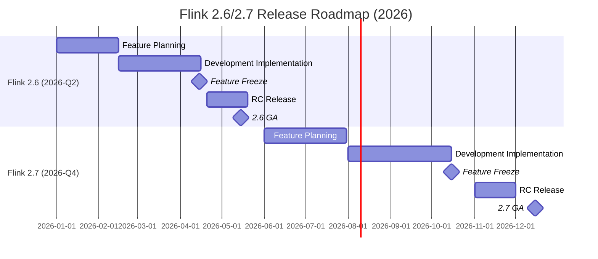
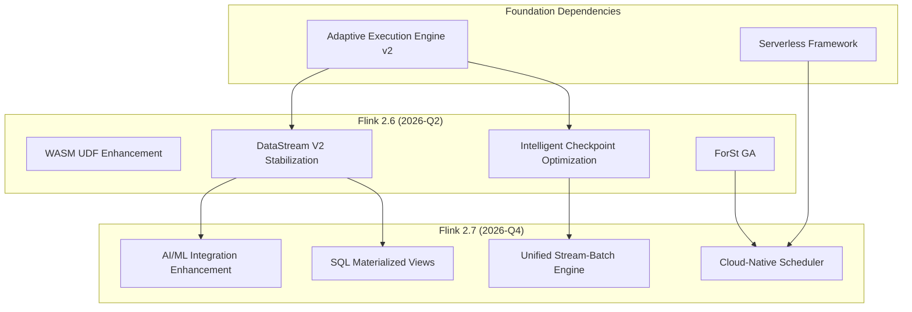

<!-- Version status marker: status=preview, target=2026-Q2-Q4 -->
> ⚠️ **Forward-Looking Statement**
> This document contains forward-looking design content for Flink 2.6/2.7. These versions have not been officially released yet,
> and some features are predictive/planning in nature. Please refer to the official Apache Flink release for the final implementation.
>
> | Attribute | Value |
> |------|-----|
> | **Document Status** | 🔍 Preview |
> | **Target Version** | 2.6.0 / 2.7.0 GA |
> | **Estimated Release** | 2.6: 2026 Q2 / 2.7: 2026 Q4 |
> | **Last Updated** | 2026-04-05 |
> | **Tracking System** | [.scripts/flink-release-tracker-v2.py](#) |

---

# Flink 2.6/2.7 Feature Tracking

> Stage: Flink/version-tracking | Prerequisites: [Flink 2.4 Tracking](../../08-roadmap/08.01-flink-24/flink-2.4-tracking.md) | Formalization Level: L3

---

## 1. Version Overview

### 1.1 Release Schedule



### 1.2 Version Positioning

| Version | Theme | Core Value | Risk Level |
|------|------|----------|----------|
| **2.6** | Performance and API Stability | WASM UDF productionization, DataStream V2 stabilization | 🟡 Medium |
| **2.7** | Cloud-Native and AI Integration | Cloud-native scheduler, AI/ML deep integration | 🔴 High |

---

## 2. Tracking Methodology

### 2.1 Monitoring Data Sources

| Data Source | URL | Check Frequency | Priority |
|--------|-----|----------|--------|
| Apache JIRA | <https://issues.apache.org/jira/browse/FLINK> | Daily | 🔴 High |
| FLIP Proposals | <https://github.com/apache/flink/tree/main/flink-docs/docs/flips/> | Weekly | 🔴 High |
| GitHub Releases | <https://github.com/apache/flink/releases> | Daily | 🔴 High |
| Official Roadmap | <https://flink.apache.org/roadmap/> | Weekly | 🟡 Medium |
| Developer Mailing List | <dev@flink.apache.org> | Weekly | 🟡 Medium |

### 2.2 Automated Tracking Scripts

```bash
# Run tracking check
python .scripts/flink-release-tracker-v2.py --check

# Generate update report
python .scripts/flink-release-tracker-v2.py --report

# Send notifications (after configuring Slack/email)
python .scripts/notify-flink-updates.py --notify
```

---

## 3. Expected Flink 2.6 Features

> **Estimated Release**: 2026 Q2 (May)

### 3.1 WASM UDF Enhancements

| Attribute | Value |
|------|-----|
| **FLIP** | FLIP-550 (Estimated) |
| **Status** | 🔄 In Design |
| **Progress** | 30% |
| **Owner** | TBD |

**Feature Overview**:

- WASM UDF performance optimization (near-native Java performance)
- Multi-language support expansion (Rust, Go, Python via WASM)
- WASM module hot-update support
- UDF security sandbox enhancements

**Impact on Existing Documents**:

- [ ] New document needed: `Flink/06-connectors/wasm-udf-guide.md`
- [ ] Update needed: `Flink/05-ecosystem/python-integration.md`
- [ ] Update needed: `Flink/03-deployment/security-udf.md`

### 3.2 DataStream V2 API Stabilization

| Attribute | Value |
|------|-----|
| **FLIP** | FLIP-500+ (Continuation) |
| **Status** | 🔄 Implementing |
| **Progress** | 60% |
| **Owner** | @flink-streaming-team |

**Feature Overview**:

- DataStream V2 API marked as `@Public`
- Remove experimental warnings
- Fully compatible DataStream V1 migration path
- Performance benchmarks passed

**Impact on Existing Documents**:

- [ ] Update needed: `Flink/02-api/datastream-api-guide.md`
- [ ] New document needed: `Flink/02-api/datastream-v2-migration.md`
- [ ] Update needed: `Flink/QUICK-START.md`

### 3.3 Intelligent Checkpoint Optimization

| Attribute | Value |
|------|-----|
| **FLIP** | FLIP-542 (Continuation) |
| **Status** | 🔄 Implementing |
| **Progress** | 50% |
| **Owner** | @checkpoint-team |

**Feature Overview**:

- ML-based checkpoint interval prediction
- Adaptive incremental checkpoint strategy
- Checkpoint cost model optimization

### 3.4 Other Expected Features

| Feature | FLIP | Status | Progress | Impact Level |
|------|------|------|------|----------|
| ForSt State Backend GA | FLIP-549 | 🔄 Testing | 85% | High |
| SQL JSON Function Enhancements | FLIP-551 | 📋 Planned | 20% | Medium |
| Connector Framework Optimization | FLIP-552 | 🔄 In Design | 40% | Medium |

---

## 4. Expected Flink 2.7 Features

> **Estimated Release**: 2026 Q4 (December)

### 4.1 Cloud-Native Scheduler

| Attribute | Value |
|------|-----|
| **FLIP** | FLIP-560 (Estimated) |
| **Status** | 📋 In Planning |
| **Progress** | 10% |
| **Owner** | TBD |

**Feature Overview**:

- Kubernetes-native scheduler (replacing existing scheduler)
- CRD-based job definitions
- Automatic resource quota management
- Multi-tenant isolation enhancements

**Impact on Existing Documents**:

- [ ] New document needed: `Flink/03-deployment/k8s-native-scheduler.md`
- [ ] Update needed: `Flink/03-deployment/k8s-operator-guide.md`
- [ ] New document needed: `Flink/03-deployment/multi-tenant-setup.md`

### 4.2 AI/ML Integration Enhancements

| Attribute | Value |
|------|-----|
| **FLIP** | FLIP-561 (Estimated) |
| **Status** | 📋 In Planning |
| **Progress** | 5% |
| **Owner** | TBD |

**Feature Overview**:

- Streaming integration with TensorFlow/PyTorch
- Model inference optimization (batching + caching)
- Feature Store connector
- MLflow integration

**Impact on Existing Documents**:

- [ ] New document needed: `Flink/ai-features/ml-inference-guide.md`
- [ ] New document needed: `Flink/ai-features/feature-store-connector.md`
- [ ] Update needed: `Flink/05-ecosystem/python-ml.md`

### 4.3 Other Expected Features

| Feature | FLIP | Status | Progress | Impact Level |
|------|------|------|------|----------|
| Unified Stream-Batch Execution Engine | FLIP-562 | 📋 In Planning | 5% | High |
| SQL Materialized View Enhancements | FLIP-563 | 📋 In Planning | 5% | Medium |
| FROM_CHANGELOG / TO_CHANGELOG Built-in PTFs | FLIP-564 | 📋 In Planning | 0% | High |

---

## 5. FLIP Tracking Matrix

### 5.1 Confirmed FLIPs

| FLIP | Title | Target Version | Status | Progress | Owner | Related Documents |
|------|------|----------|------|------|--------|----------|
| FLIP-542 | Intelligent Checkpointing | 2.6 | 🔄 Implementing | 50% | @checkpoint-team | Intelligent Checkpointing Document |
| FLIP-549 | ForSt State Backend GA | 2.6 | 🔄 Testing | 85% | @forst-team | State Backend Comparison |

### 5.2 Estimated FLIPs (Pending Confirmation)

| FLIP | Title | Target Version | Status | Progress | Owner | Estimated Confirmation |
|------|------|----------|------|------|--------|--------------|
| FLIP-550 | WASM UDF Enhancement | 2.6 | 📋 In Planning | 30% | TBD | 2026-04 |
| FLIP-560 | Cloud-Native Scheduler | 2.7 | 📋 In Planning | 10% | TBD | 2026-06 |
| FLIP-561 | AI/ML Integration | 2.7 | 📋 In Planning | 5% | TBD | 2026-06 |

**Legend**:

- ✅ Completed
- 🔄 In Progress
- ⏸️ Paused
- 📋 Planned

---

## 6. Version Dependencies



---

## 7. Document Update Plan

### 7.1 New Document List

| Document | Target Version | Priority | Estimated Completion |
|------|----------|--------|----------|
| WASM UDF Complete Guide | 2.6 | 🔴 High | 2026-05 |
| DataStream V2 Migration Guide | 2.6 | 🔴 High | 2026-05 |
| K8s Native Scheduler Configuration | 2.7 | 🔴 High | 2026-11 |
| AI/ML Streaming Inference Guide | 2.7 | 🟡 Medium | 2026-12 |

### 7.2 Update Document List

| Document | Target Version | Update Content | Priority |
|------|----------|----------|--------|
| DataStream API Guide | 2.6 | V2 API stability declaration | 🔴 High |
| State Backend Comparison | 2.6 | ForSt GA update | 🔴 High |
| Deployment Guide | 2.7 | Cloud-native scheduler | 🔴 High |
| Python Integration | 2.7 | ML integration | 🟡 Medium |

---

## 8. Risk Assessment

### 8.1 Technical Risks

| Risk | Affected Version | Probability | Impact | Mitigation |
|------|----------|------|------|----------|
| WASM UDF performance below expectations | 2.6 | Medium | High | Early benchmarking |
| DataStream V2 API compatibility issues | 2.6 | Low | High | Complete migration testing |
| Cloud-native scheduler stability | 2.7 | Medium | High | Long-term soak testing |
| AI/ML integration complexity | 2.7 | High | Medium | Phased release |

### 8.2 Schedule Risks

| Risk | Affected Version | Probability | Mitigation |
|------|----------|------|----------|
| 2.6 release delay | 2.6 | Medium | Core features first |
| 2.7 feature cuts | 2.7 | High | Prepare fallback plans |

---

## 9. Changelog

| Date | Version | Update Content | Updated By |
|------|------|----------|--------|
| 2026-04-05 | v0.1 | Document created, initialized 2.6/2.7 tracking framework | Agent |
| 2026-04-05 | v0.1 | Added estimated FLIP list | Agent |
| 2026-04-05 | v0.1 | Created automated tracking script framework | Agent |

---

## 10. Reference Links

- [Apache Flink Official Roadmap](https://flink.apache.org/roadmap/)
- [FLIP Proposal Index](https://github.com/apache/flink/tree/main/flink-docs/docs/flips/)
- [Flink JIRA Board](https://issues.apache.org/jira/browse/FLINK)
- [Flink GitHub Repository](https://github.com/apache/flink)
- [Flink 2.4 Tracking Document](../../08-roadmap/08.01-flink-24/flink-2.4-tracking.md)

---

## 11. Automated Tracking Configuration

### 11.1 Trigger Conditions

```yaml
Auto-update triggers:
  Version releases:
    - GitHub release published
    - Maven repository detects new version
    - Official download page updated

  Status changes:
    - FLIP status change (JIRA webhook)
    - RC version release
    - Feature Freeze announced

  Regular checks:
    - Daily: Check GitHub releases
    - Weekly: Check FLIP status
    - Monthly: Generate full report
```

### 11.2 Notification Configuration

```yaml
Notification channels:
  File log:
    enabled: true
    path: .scripts/flink-notifications.log

  Slack:
    enabled: false  # Needs webhook configuration
    webhook_url: ""
    channel: "#flink-releases"

  Email:
    enabled: false  # Needs SMTP configuration
    smtp_server: ""
    to_addresses: []
```

---

*This document is maintained by the automated tracking system. Last updated: 2026-04-05*
