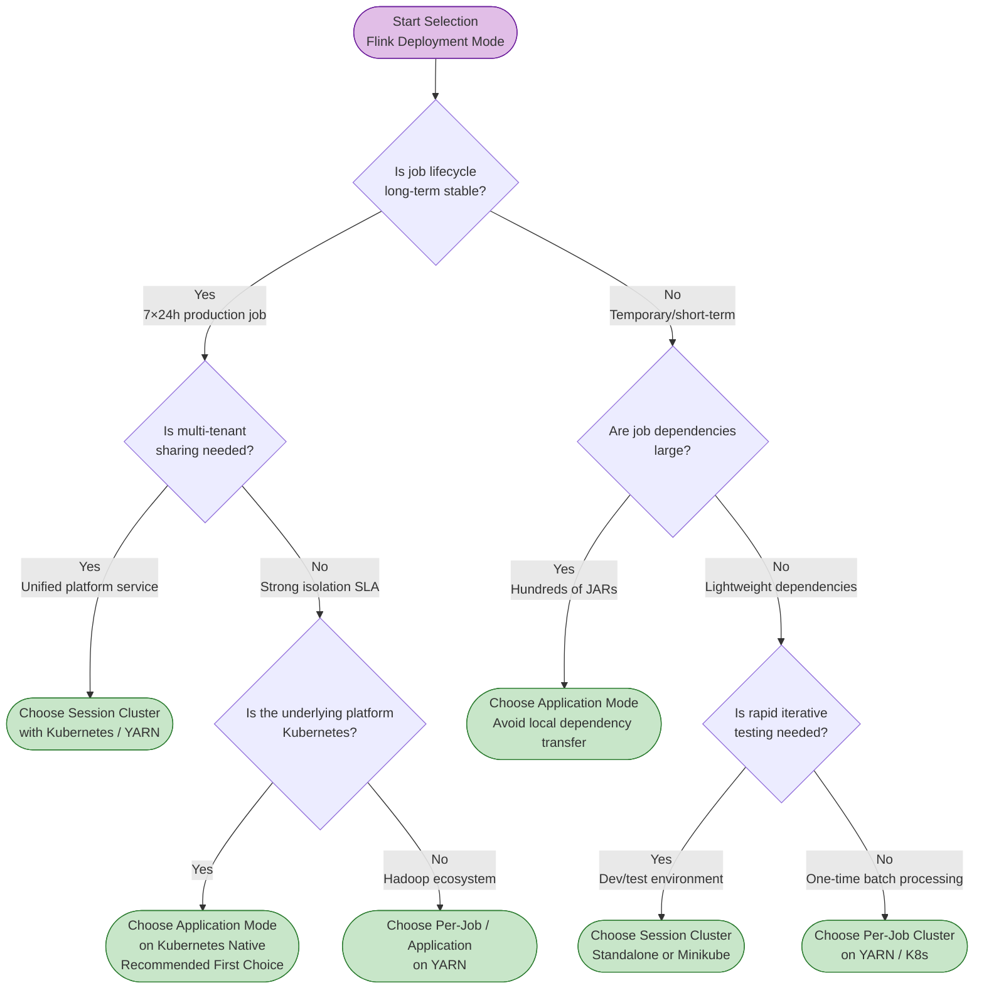

# Flink Deployment Architecture Patterns

> **Stage**: Flink/ | **Prerequisites**: [../../Struct/01-foundation/01.04-dataflow-model-formalization.md](../../Struct/01-foundation/01.04-dataflow-model-formalization.md) | **Formality Level**: L3-L4

---

## Table of Contents

- [Flink Deployment Architecture Patterns](#flink-deployment-architecture-patterns)
  - [Table of Contents](#table-of-contents)
  - [1. Definitions](#1-definitions)
    - [1.1 Deployment Configuration Abstraction](#11-deployment-configuration-abstraction)
    - [1.2 Session Cluster Mode](#12-session-cluster-mode)
    - [1.3 Per-Job Cluster Mode](#13-per-job-cluster-mode)
    - [1.4 Application Mode](#14-application-mode)
    - [1.5 Underlying Resource Management Platform](#15-underlying-resource-management-platform)
  - [2. Properties](#2-properties)
    - [2.1 Isolation and Sharing of Deployment Modes](#21-isolation-and-sharing-of-deployment-modes)
    - [2.2 Elasticity Characteristics of Resource Platforms](#22-elasticity-characteristics-of-resource-platforms)
  - [3. Relations \& Comparisons](#3-relations--comparisons)
    - [3.1 Deployment Mode × Resource Platform Combination Space](#31-deployment-mode--resource-platform-combination-space)
    - [3.2 Deployment Mode Comprehensive Comparison Table](#32-deployment-mode-comprehensive-comparison-table)
    - [3.3 Architecture Comparison Diagram](#33-architecture-comparison-diagram)
    - [3.4 Resource Platform Relationship Mapping](#34-resource-platform-relationship-mapping)
  - [4. Argumentation \& Selection Logic](#4-argumentation--selection-logic)
    - [4.1 Formal Framework for Selection Decisions](#41-formal-framework-for-selection-decisions)
    - [4.2 Decision Tree: Which Deployment Mode to Choose?](#42-decision-tree-which-deployment-mode-to-choose)
    - [4.3 Boundary Condition Analysis of Selection Logic](#43-boundary-condition-analysis-of-selection-logic)
  - [5. Engineering Examples](#5-engineering-examples)
    - [5.1 Example 1: Kubernetes Native Application Mode Deployment](#51-example-1-kubernetes-native-application-mode-deployment)
    - [5.2 Example 2: YARN Session Cluster Deployment (Multi-tenant Data Platform)](#52-example-2-yarn-session-cluster-deployment-multi-tenant-data-platform)
    - [5.3 Example 3: Standalone Per-Job Alternative Implementation (Edge Computing)](#53-example-3-standalone-per-job-alternative-implementation-edge-computing)
  - [6. References](#6-references)

## 1. Definitions

### 1.1 Deployment Configuration Abstraction

**Definition 1.1 (Flink Deployment Configuration)**: The deployment configuration $\mathcal{D}$ of a Flink system $\mathcal{F}$ is a triple:

$$\mathcal{D} = \langle \mathcal{M}, \mathcal{P}, \mathcal{R}_{mgr} \rangle$$

Where:

- $\mathcal{M} \in \{\text{Session}, \text{Per-Job}, \text{Application}\}$ is the job submission mode
- $\mathcal{P} \in \{\text{Standalone}, \text{YARN}, \text{Kubernetes}\}$ is the underlying resource management platform
- $\mathcal{R}_{mgr}$ is the adaptation protocol between Flink's ResourceManager and the underlying platform

This triple preserves the complete decision space from user code submission to physical container scheduling.

---

### 1.2 Session Cluster Mode

**Definition 1.2 (Session Cluster)**: A Session Cluster $\mathcal{D}_{session}$ is a pre-created, long-running Flink cluster whose lifecycle is independent of any specific job. Formally:

$$\mathcal{D}_{session}: \{Job_1, Job_2, \ldots, Job_n\} \rightarrow Shared(JM_{cluster}, TM_{pool})$$

The Client is only responsible for submitting the pre-compiled JobGraph to the existing cluster via REST / CLI. Session Cluster is suitable for short-lifecycle, high-frequency submission use cases, such as Flink SQL Gateway and ad-hoc queries.

---

### 1.3 Per-Job Cluster Mode

**Definition 1.3 (Per-Job Cluster)**: A Per-Job Cluster $\mathcal{D}_{perjob}$ independently creates a Flink cluster for each job, which is automatically destroyed after the job terminates. Formally:

$$\mathcal{D}_{perjob}: Job_i \rightarrow Dedicated(JM_i, TM_i)$$

The Client executes the user program's `main()` method locally to generate the JobGraph, then requests the underlying resource manager to launch an independent JobManager and TaskManagers. This mode provides the strongest inter-job isolation, but cluster startup introduces additional latency.

---

### 1.4 Application Mode

**Definition 1.4 (Application Mode)**: Application Mode $\mathcal{D}_{app}$ moves the execution of the user program's `main()` method from the local Client to the Cluster Entrypoint, completing JobGraph construction inside the cluster. Formally:

$$\mathcal{D}_{app}: UserProgram \xrightarrow{execute\ on\ ClusterEntrypoint} JobGraph \rightarrow Cluster(JM_{app}, TM_{app})$$

The Client is only responsible for triggering cluster creation and uploading the user JAR to the cluster entrypoint. This mode eliminates the network bottleneck of transferring large dependency JARs from local to remote, while maintaining Per-Job level resource isolation.

---

### 1.5 Underlying Resource Management Platform

**Definition 1.5 (Resource Provider)**: Resource Provider $\mathcal{P}$ is the underlying infrastructure abstraction on which Flink clusters rely to obtain compute resources:

$$\mathcal{P}: ResourceRequest \rightarrow \{Container, Pod, Process\}$$

- **Standalone**: Flink runs as independent JVM processes on physical or virtual machines, without relying on an external resource manager. Administrators manually configure `conf/workers` and launch processes via `start-cluster.sh`.
- **YARN**: Flink runs as a YARN Application, requesting and releasing TaskManager resources in the form of YARN Containers. The JobManager runs as the YARN ApplicationMaster[^1].
- **Kubernetes Native**: Flink directly calls the Kubernetes API to create JobManager Deployment / Pod and TaskManager Pods. Supports Session mode (`kubernetes-session.sh`) and Application mode (`flink run-application`)[^2].

---

## 2. Properties

### 2.1 Isolation and Sharing of Deployment Modes

**Property 2.1 (Resource Sharing in Session Mode)**:
In Session mode, tasks from multiple jobs share the same TaskManager Slot pool. Therefore, resource utilization is highest, but the fault boundary between jobs is the least strict.

**Derivation**:

1. From Definition 1.2, $\mathcal{D}_{session}$ maps multiple jobs to $Shared(JM, TM_{pool})$.
2. If an operator in $Job_A$ exhausts network buffers due to data skew, Backpressure will propagate upstream and may affect $Job_B$.
3. JVM heap memory is shared by all tasks within the same process. A memory leak or GC storm in one job reduces available memory for other jobs.
4. Therefore, the resource isolation of Session mode is weaker than Per-Job and Application modes.

> **Inference [Control→Execution]**: The Dispatcher allows multiple JobMasters to coexist in the same JobManager. The execution layer's Slot allocation must handle cross-job preemption and priorities.
>
> **Inference [Execution→Data]**: Slot sharing causes network Backpressure and memory pressure to cascade between jobs, affecting end-to-end latency.

---

**Property 2.2 (Strong Isolation in Per-Job / Application Mode)**:
Per-Job and Application modes provide an independent set of JobManagers and TaskManagers for each job. A failure in a single job will not directly cause state loss or performance degradation in other jobs.

**Derivation**:

1. From Definitions 1.3 and 1.4, both $\mathcal{D}_{perjob}$ and $\mathcal{D}_{app}$ satisfy $Job_i \rightarrow Dedicated(JM_i, TM_i)$.
2. $JM_i$ is only responsible for Checkpoint coordination and scheduling for the current job, with no cross-job interference.
3. Slots on $TM_i$ are only used by the current job. A single Task OOM will not directly affect other job processes.
4. Therefore, the isolation of these two modes is guaranteed at the process level.

---

**Property 2.3 (Minimum Client Dependencies in Application Mode)**:
In Application mode, the local Client is no longer responsible for JobGraph construction and dependency resolution, eliminating the network bandwidth bottleneck between Client and cluster.

**Derivation**:

1. From Definition 1.4, JobGraph construction in Application mode occurs inside the Cluster Entrypoint.
2. In Per-Job mode, the Client must load all dependencies locally before serializing and transmitting them to the cluster. For applications containing hundreds of JARs, this may generate hundreds of MBs of network transfer.
3. Application mode only requires uploading the fat-jar, with JobGraph constructed inside the cluster.
4. Therefore, the submission latency of Application mode is significantly lower than Per-Job mode and weakly correlated with dependency size.

---

### 2.2 Elasticity Characteristics of Resource Platforms

**Property 2.4 (Declarative Elasticity in Kubernetes Native)**:
Kubernetes Native supports dynamic scaling based on declarative configuration, with elasticity granularity at the individual Pod level (corresponding to one TaskManager instance).

**Derivation**:

1. The K8s control plane is driven by desired state, automatically adjusting the number of Pods.
2. Flink's K8s ResourceManager calls the API Server to create or delete TaskManager Pods, with response latency typically in the seconds to minutes range.
3. Compared to Standalone's manual configuration, K8s Native supports runtime dynamic adjustment of TaskManager numbers.
4. Therefore, Kubernetes Native is superior to Standalone and YARN in cloud-native elasticity.

---

**Property 2.5 (Batch Processing Ecosystem Compatibility of YARN)**:
YARN shares the same cluster infrastructure with HDFS, Hive, and Spark. Therefore, Flink on YARN has the lowest infrastructure migration cost in existing Hadoop data centers.

**Derivation**:

1. YARN clusters typically already deploy HDFS, Kerberos, Ranger, and other enterprise components.
2. Flink on YARN can directly reuse these components for Checkpoint storage and authentication, without needing to build an additional K8s control plane.
3. YARN's resource queues and capacity scheduler have been running maturely for years, with rich operational experience.
4. Therefore, in existing Hadoop ecosystems, YARN's total cost of ownership is lower than introducing a new K8s cluster.

---

## 3. Relations & Comparisons

### 3.1 Deployment Mode × Resource Platform Combination Space

| Mode \ Platform | Standalone | YARN | Kubernetes Native |
|-----------------|------------|------|-------------------|
| **Session** | ✅ Native support | ✅ `yarn-session.sh` | ✅ `kubernetes-session.sh` |
| **Per-Job** | ❌ Not applicable | ✅ `flink run -m yarn-cluster` | ⚠️ 1.15+ recommended to use Application instead |
| **Application** | ❌ Not applicable | ✅ `flink run-application -t yarn-application` | ✅ `flink run-application -t kubernetes-application` |

**Relation 1**: Deployment mode and resource platform are orthogonal design dimensions.

**Argumentation**:

- Session mode can be implemented on any platform supporting long-running processes; Per-Job / Application require the underlying platform to support on-demand container creation.
- Standalone, as a static process collection, cannot dynamically allocate resources at the job granularity, so it does not support Per-Job / Application modes.
- Operations teams can independently decide "which resource platform to choose" (infrastructure status quo) and "which deployment mode to choose" (job characteristics).

---

### 3.2 Deployment Mode Comprehensive Comparison Table

| Dimension | Session Cluster | Per-Job Cluster | Application Mode |
|-----------|-----------------|-----------------|------------------|
| **Resource Isolation** | Weak (multi-job shared JVM) | Strong (independent JM + TM) | Strong (same as Per-Job) |
| **Startup Time** | Extremely low (seconds, cluster already ready) | High (wait for resource request + cluster startup) | Medium (cluster startup, but no local JobGraph build latency) |
| **Fault Domain** | Cluster-level (JM failure affects all jobs) | Job-level (only affects current job) | Job-level (only affects current job) |
| **Operational Complexity** | Medium (maintain常驻cluster, monitor multi-tenancy) | High (manage many short-lifecycle clusters) | Low (one cluster per application, lifecycle aligned) |
| **Recommended Scenarios** | Short queries, SQL Gateway, dev/test | Long-term production jobs, strong SLA requirements | Microservice-style streaming apps, multi-dependency large projects, CI/CD deployment |

> **Inference [Architecture→Engineering]**: Application mode achieves the best balance between isolation and submission efficiency, becoming the preferred recommended mode by the Flink community in Kubernetes environments[^3].

---

### 3.3 Architecture Comparison Diagram

```mermaid
graph TB
    subgraph "Session Mode"
        S_JM[JobManager<br/>Long-running]
        S_TM1[TaskManager<br/>Pre-started]
        S_TM2[TaskManager<br/>Pre-started]
        S_Client[Local Client<br/>Only submits JobGraph]
        S_Job1[Job-1]
        S_Job2[Job-2]

        S_Client -->|Submit JobGraph| S_JM
        S_JM -->|Schedule| S_TM1
        S_JM -->|Schedule| S_TM2
        S_TM1 -->|Execute| S_Job1
        S_TM1 -->|Execute| S_Job2
        S_TM2 -->|Execute| S_Job2
    end

    subgraph "Per-Job Mode"
        P_Client[Local Client<br/>Builds JobGraph + Triggers Cluster Creation]
        P_JM[JobManager<br/>Started with job]
        P_TM1[TaskManager<br/>On-demand request]
        P_TM2[TaskManager<br/>On-demand request]
        P_Job[Job-i]

        P_Client -->|Create cluster + Transfer JobGraph| P_JM
        P_JM -->|Request| P_TM1
        P_JM -->|Request| P_TM2
        P_TM1 -->|Execute| P_Job
        P_TM2 -->|Execute| P_Job
    end

    subgraph "Application Mode"
        A_Client[Local Client<br/>Only uploads JAR]
        A_Entry[Cluster Entrypoint<br/>Executes main method]
        A_JM[JobManager<br/>Started with application]
        A_TM1[TaskManager<br/>On-demand request]
        A_TM2[TaskManager<br/>On-demand request]
        A_Job[Application Job]

        A_Client -->|Upload User JAR| A_Entry
        A_Entry -->|Internally generates JobGraph| A_JM
        A_JM -->|Request| A_TM1
        A_JM -->|Request| A_TM2
        A_TM1 -->|Execute| A_Job
        A_TM2 -->|Execute| A_Job
    end

    style S_JM fill:#e3f2fd,stroke:#1976d2
    style P_JM fill:#e8f5e9,stroke:#388e3c
    style A_JM fill:#fff3e0,stroke:#f57c00
    style S_Client fill:#fce4ec,stroke:#c2185b
    style P_Client fill:#fce4ec,stroke:#c2185b
    style A_Client fill:#fce4ec,stroke:#c2185b
```



**Diagram Description**:

- **Session Mode**: JM and TM exist before job submission; Client only performs lightweight JobGraph submission.
- **Per-Job Mode**: Client has the heaviest burden, needing to build the complete JobGraph locally and trigger creation of a brand new cluster.
- **Application Mode**: Client responsibilities are minimized, with JobGraph construction delegated to the Cluster Entrypoint, balancing isolation and submission efficiency.

---

### 3.4 Resource Platform Relationship Mapping

**Relation 2**: Standalone $\subset$ YARN $\subset$ Kubernetes Native (in terms of cloud-native capabilities).

**Argumentation**:

- Standalone provides basic process management but does not support containerized isolation or dynamic resource scheduling.
- YARN adds container abstraction and queue scheduling, supporting per-application resource request and release, but still relies on pre-deployed node environments.
- Kubernetes Native further provides Pod-level isolation, declarative configuration, service discovery, ConfigMap / Secret management, and cross-cloud portability.
- For internal data centers without containerization needs, YARN has lower complexity; for multi-cloud or hybrid cloud strategies, K8s Native's portability is irreplaceable.

---

## 4. Argumentation & Selection Logic

### 4.1 Formal Framework for Selection Decisions

**Definition 4.1 (Deployment Selection Function)**:
Given a requirement characteristic vector $\vec{r} = (isolation, startup, depsize, multitenant, lifetime)$, the deployment selection function is:

$$Select(\vec{r}) = \arg\max_{(\mathcal{M}, \mathcal{P})} Score(\vec{r}, \mathcal{M}, \mathcal{P})$$

Where $Score$ combines five dimensions:

- **isolation**: Strong SLA scenarios (financial risk control) require high isolation, tending toward Per-Job / Application.
- **startup**: Interactive SQL queries require low startup latency; Session mode is the only feasible solution.
- **depsize**: Scenarios with large numbers of third-party JARs; Application mode eliminates local transfer bottlenecks.
- **multitenant**: Unified stream computing service platform; Session mode can improve resource utilization.
- **lifetime**: Long-term stable operation (7×24h) suits Per-Job / Application; temporary testing suits Session.

---

### 4.2 Decision Tree: Which Deployment Mode to Choose?



**Diagram Description**: Long-term stable production jobs → Application Mode on K8s; multi-tenant sharing or rapid iteration → Session Cluster; large dependencies but short lifecycle → Application Mode.

---

### 4.3 Boundary Condition Analysis of Selection Logic

**Boundary 1: Small team, no Kubernetes operational capability**

- If the team only has a few physical servers and no dedicated SRE to maintain K8s, Standalone Session Cluster is the most pragmatic choice. For small clusters of fixed scale (< 20 nodes), the complexity of manual scaling and monitoring is manageable.

**Boundary 2: Hybrid cloud strategy, requiring cross-cloud portability**

- If the enterprise runs simultaneously on multiple cloud vendors and private data centers, Kubernetes Native provides a unified deployment abstraction. Application Mode's `flink-conf.yaml` and Pod Template can be migrated across clouds with almost no modifications.

**Boundary 3: Existing YARN queues and FinOps system**

- If the enterprise has already established a cost allocation system based on YARN Queues, migrating to K8s requires rebuilding Namespace Quota and billing tags. In this scenario, YARN Application mode can enjoy the isolation benefits of Application mode without breaking existing processes.

---

## 5. Engineering Examples

### 5.1 Example 1: Kubernetes Native Application Mode Deployment

**Scenario**: An e-commerce platform deploys a real-time user behavior analysis Flink application with 80+ third-party JAR dependencies, requiring 7×24 stable operation and complete isolation from other business teams' jobs.

**Deployment Configuration** (key items in `flink-conf.yaml`):

```yaml
jobmanager.memory.process.size: 2048m
taskmanager.memory.process.size: 8192m
taskmanager.numberOfTaskSlots: 4
parallelism.default: 12

kubernetes.cluster-id: realtime-analytics-v1
kubernetes.namespace: flink-apps
kubernetes.container.image: flink:1.18-scala_2.12

state.backend: rocksdb
state.checkpoint-storage: filesystem
checkpoints.dir: s3p://flink-checkpoints/realtime-analytics/
high-availability: kubernetes
high-availability.storageDir: s3p://flink-ha/realtime-analytics/
```

**Submission Command**:

```bash
./bin/flink run-application \
    -t kubernetes-application \
    -Dkubernetes.cluster-id=realtime-analytics-v1 \
    local:///opt/flink/usrlib/realtime-analytics-1.0.jar
```

**Key Points**: Dependency JARs are pre-packaged into the Docker image's `/opt/flink/usrlib/` directory to avoid network transfer during submission; RocksDB + S3 supports TB-level state and incremental Checkpoint; K8s ConfigMap performs JM Leader election without requiring ZooKeeper.

---

### 5.2 Example 2: YARN Session Cluster Deployment (Multi-tenant Data Platform)

**Scenario**: A financial group's data platform department operates a unified stream computing service, providing Flink SQL query capabilities for 10+ business teams. Queries are mainly short-cycle ad-hoc analysis, requiring second-level submission.

**Deployment Configuration**:

```bash
./bin/yarn-session.sh \
    -nm flink-sql-platform \
    -qu root.flink \
    -jm 4096m \
    -tm 16384m \
    -s 8
```

**Usage**:

```sql
INSERT INTO risk_monitoring
SELECT
    user_id,
    COUNT(*) AS transaction_count,
    SUM(amount) AS total_amount
FROM transactions
GROUP BY TUMBLE(event_time, INTERVAL '1' MINUTE), user_id;
```

**Key Points**: YARN Session Cluster runs常驻(2 JM HA + 16 TM, total 128 Slots); resource上限is limited through the `root.flink` queue; average startup latency < 3 seconds; custom UDFs are prohibited to reduce cross-job interference.

---

### 5.3 Example 3: Standalone Per-Job Alternative Implementation (Edge Computing)

**Scenario**: A manufacturing enterprise deploys Flink on an edge server (single 64-core server) in a factory for real-time monitoring of production line IoT sensor data. The edge environment has no YARN or K8s, and each production line job requires strict isolation.

**Deployment Plan**:
Standalone itself does not support Per-Job mode, but logical Per-Job isolation can be achieved by assigning independent Flink configuration files and port ranges to each job.

```bash
# Production Line A
export FLINK_CONF_DIR=/opt/flink/line-a-conf/
# line-a-conf: jobmanager.rpc.port=6123, rest.port=8081
/opt/flink/bin/start-cluster.sh
/opt/flink/bin/flink run /opt/jobs/line-a-monitoring.jar

# Production Line B
export FLINK_CONF_DIR=/opt/flink/line-b-conf/
# line-b-conf: jobmanager.rpc.port=6124, rest.port=8082
/opt/flink/bin/start-cluster.sh
/opt/flink/bin/flink run /opt/jobs/line-b-monitoring.jar
```

**Key Points**: Independent RPC/REST ports avoid JM conflicts; each job has independent JM/TM JVM processes, achieving OS-level isolation; startup and shutdown are controlled by edge server systemd scripts. The limitation is the inability to dynamically scale.

---

## 6. References

[^1]: Apache Flink Documentation, "Apache Flink on YARN", 2025. <https://nightlies.apache.org/flink/flink-docs-stable/docs/deployment/resource-providers/yarn/>
[^2]: Apache Flink Documentation, "Native Kubernetes", 2025. <https://nightlies.apache.org/flink/flink-docs-stable/docs/deployment/resource-providers/native_kubernetes/>
[^3]: Apache Flink Documentation, "Deployment Mode Overview", 2025. <https://nightlies.apache.org/flink/flink-docs-stable/docs/deployment/overview/>
