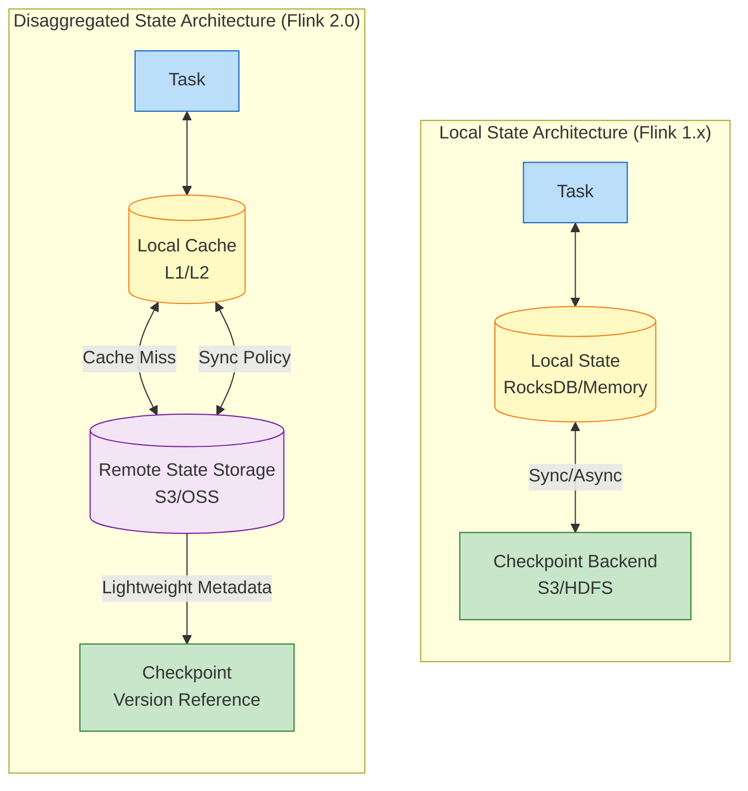
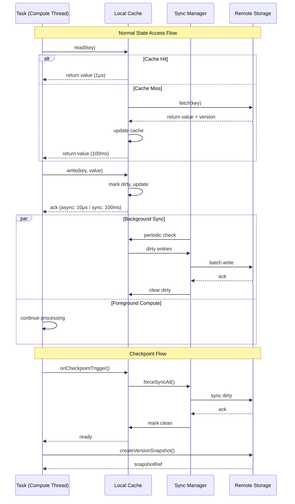

# Flink Disaggregated State Storage Analysis

> **Stage**: Flink/01-architecture | **Prerequisites**: [../../Struct/02-properties/02.02-consistency-hierarchy.md](../../Struct/02-properties/02.02-consistency-hierarchy.md) | **Formalization Level**: L5

---

## Table of Contents

- [Flink Disaggregated State Storage Analysis](#flink-disaggregated-state-storage-analysis)
  - [Table of Contents](#table-of-contents)
  - [1. Definitions](#1-definitions)
    - [Def-F-01-01 (Disaggregated State Storage)](#def-f-01-01-disaggregated-state-storage)
    - [Def-F-01-02 (State Backend Evolution)](#def-f-01-02-state-backend-evolution)
    - [Def-F-01-03 (Sync Policy)](#def-f-01-03-sync-policy)
    - [Def-F-01-04 (Consistency Level)](#def-f-01-04-consistency-level)
  - [2. Properties](#2-properties)
    - [Lemma-F-01-01 (Location Independence of Disaggregated Storage)](#lemma-f-01-01-location-independence-of-disaggregated-storage)
    - [Lemma-F-01-02 (Monotonic Versioning of Async Sync)](#lemma-f-01-02-monotonic-versioning-of-async-sync)
    - [Prop-F-01-01 (Latency-Throughput Trade-off)](#prop-f-01-01-latency-throughput-trade-off)
  - [3. Relations](#3-relations)
    - [Relation 1: Flink Disaggregated Storage and Chandy-Lamport Snapshots](#relation-1-flink-disaggregated-storage-and-chandy-lamport-snapshots)
    - [Relation 2: Disaggregated Storage Consistency Hierarchy and General Consistency Models](#relation-2-disaggregated-storage-consistency-hierarchy-and-general-consistency-models)
    - [Relation 3: State Backend Evolution and CAP Trade-offs](#relation-3-state-backend-evolution-and-cap-trade-offs)
  - [4. Argumentation](#4-argumentation)
    - [Lemma 4.1 (Disaggregated Storage Failure Recovery Acceleration Principle)](#lemma-41-disaggregated-storage-failure-recovery-acceleration-principle)
    - [Lemma 4.2 (Incremental Checkpoint Storage Efficiency)](#lemma-42-incremental-checkpoint-storage-efficiency)
    - [Counterexample 4.1 (Cache Inconsistency Under Network Partition)](#counterexample-41-cache-inconsistency-under-network-partition)
  - [5. Proofs](#5-proofs)
    - [Thm-F-01-01 (Exactly-Once Preservation under Disaggregated Storage)](#thm-f-01-01-exactly-once-preservation-under-disaggregated-storage)
    - [Thm-F-01-02 (Eventual Consistency Convergence under Async Policy)](#thm-f-01-02-eventual-consistency-convergence-under-async-policy)
  - [6. Examples](#6-examples)
    - [Example 6.1: Large-State Job Migration from MemoryStateBackend to Disaggregated Storage](#example-61-large-state-job-migration-from-memorystatebackend-to-disaggregated-storage)
    - [Example 6.2: Real-time Risk Control Scenario Sync Policy Configuration](#example-62-real-time-risk-control-scenario-sync-policy-configuration)
    - [Example 6.3: Cross-AZ Failure Recovery Comparison](#example-63-cross-az-failure-recovery-comparison)
  - [7. Visualizations](#7-visualizations)
    - [Local State vs Disaggregated State Architecture Comparison](#local-state-vs-disaggregated-state-architecture-comparison)
    - [Disaggregated Storage State Access Sequence Diagram](#disaggregated-storage-state-access-sequence-diagram)
  - [8. State Backend Comparison Table](#8-state-backend-comparison-table)
  - [9. References](#9-references)

---

## 1. Definitions

### Def-F-01-01 (Disaggregated State Storage)

**Disaggregated State Storage** is an architectural pattern that physically separates stream processing operator state from compute nodes:

$$
\text{DisaggregatedState} = (\mathcal{C}, \mathcal{R}, \gamma, \eta, \sigma)
$$

Where:

- $\mathcal{C}$: **LocalCache** — In-memory hot state residence layer
- $\mathcal{R}$: **RemoteStorage** — Distributed object storage (S3, GCS, Azure Blob)
- $\gamma$: **SyncPolicy** — Synchronization semantics between local and remote
- $\eta$: **CachePolicy** — LRU/LFU/TTL and other cache behavior controls
- $\sigma$: **ConsistencyLevel** — Consistency guarantee for read/write operations

**Core Principle**: Compute and storage decoupling, state location independence

$$
\forall task. \; \text{State}(task) = \mathcal{C}(local) \cup \mathcal{R}(remote) \land \text{Location}(task) \perp \text{Location}(\text{State})
$$

**Motivation**: Solves three major problems in Flink 1.x caused by strong binding between state and TaskManager: (1) Long large-state recovery time (minute-level); (2) Scaling requires state migration (high cost); (3) Low resource utilization (storage limited to single-node disk).

### Def-F-01-02 (State Backend Evolution)

Flink state backend algebraic evolution, where each subsequent type extends the capabilities of its predecessor:

```
StateBackend ::= MemoryStateBackend
                | FsStateBackend
                | RocksDBStateBackend
                | DisaggregatedStateBackend
```

**MemoryStateBackend** (Flink 1.0+): State resides in JVM heap memory, Checkpoint synchronously writes to remote. Suitable for small state (<100MB), low-latency testing scenarios.

**FsStateBackend** (Flink 1.1+): State resides in memory, Checkpoint writes to distributed file system. Dependent on TaskManager memory size.

**RocksDBStateBackend** (Flink 1.2+): State stored in local RocksDB, supports incremental Checkpoint. Memory only used for BlockCache and MemTable, suitable for large-state scenarios.

**DisaggregatedStateBackend** (Flink 2.0+): State primarily stored remotely, local only retains hot data cache, supports configurable consistency levels.

Evolution implication relation: $\mathcal{B}_{mem} \subset \mathcal{B}_{fs} \subset \mathcal{B}_{rocks} \subset \mathcal{B}_{disagg}$

### Def-F-01-03 (Sync Policy)

**SyncPolicy** defines the synchronization timing between local cache and remote storage:

```
SyncPolicy ::= SYNC | ASYNC(freq: Duration, batchSize: ℕ) | LAZY
```

**SYNC (Synchronous Write)**:
$$
\text{write}(k,v) \text{ completes} \iff \text{remote.put}(k,v) \text{ acknowledges}
$$

- Latency: $L_{sync} \approx RTT_{remote} + T_{serialize} + T_{storage} \approx 100ms$
- Consistency: Strong consistency
- Applicable: Financial transactions, risk control decisions

**ASYNC (Asynchronous Write)**:
$$
\text{write}(k,v) \rightarrow \mathcal{C}(k,v,\delta=\text{true}) \land \Diamond(\text{remote.put}(k,v))
$$

- Latency: $L_{async} \approx 10\mu s$ (local update returns immediately)
- Convergence time: $T_{converge} \leq freq + T_{flush}$
- Applicable: Real-time reporting, log aggregation

**Policy Selection Constraints**:

| Sync Policy | Strong Consistency | Causal Consistency | Eventual Consistency |
|-------------|-------------------|--------------------|----------------------|
| SYNC | ✅ | ✅ | ✅ |
| ASYNC | ❌ | ⚠️ Requires vector clocks | ✅ |
| LAZY | ❌ | ❌ | ✅ |

### Def-F-01-04 (Consistency Level)

Aligned with the consistency hierarchy defined in [Struct/02-properties/02.02-consistency-hierarchy.md](../../Struct/02-properties/02.02-consistency-hierarchy.md):

**STRONG (Linearizability)**:
$$
\forall op_1, op_2. \; t_{complete}(op_1) < t_{start}(op_2) \implies op_1 \prec_{obs} op_2
$$
All operations have a unique linearization point in global history, and observed order is consistent with real-time order.

**CAUSAL (Causal Consistency)**:
$$
\forall op_i, op_j. \; op_i \prec_{hb} op_j \implies op_i \prec_{obs} op_j
$$
Operations with a happens-before relationship must be observed in causal order.

**EVENTUAL (Eventual Consistency)**:
$$
\left( \lim_{t \to \infty} \text{Writes}(t) = \emptyset \right) \implies \left( \lim_{t \to \infty} \mathcal{C}(t) = \lim_{t \to \infty} \mathcal{R}(t) \right)
$$
When no new writes occur, all replicas eventually converge to the same state.

---

## 2. Properties

### Lemma-F-01-01 (Location Independence of Disaggregated Storage)

**Statement**: Under the disaggregated state storage architecture, TaskManager location is orthogonal to state storage location. A new TaskManager can immediately take over state during failure recovery.

**Proof**:

Let task $T$ run on TaskManager $TM_1$ with state stored as $\mathcal{S} = \mathcal{C}_1 \cup \mathcal{R}$.

1. **Before failure**: $TM_1$ holds local cache $\mathcal{C}_1$, state authority resides in $\mathcal{R}$
2. **Failure occurs**: $TM_1$ crashes, $\mathcal{C}_1$ is lost, but $\mathcal{R}$ is intact (durability guarantee)
3. **Recovery scheduling**: JobManager schedules task $T$ to new TaskManager $TM_2$
4. **State takeover**: $TM_2$ loads required Key Groups from $\mathcal{R}$ on demand, rebuilding $\mathcal{C}_2$

Since $\mathcal{R}$ is globally accessible and the state namespace $\phi$ is deterministic:

$$
\forall TM_i, TM_j, k. \; \phi_{TM_i}(k) = \phi_{TM_j}(k)
$$

Therefore $TM_2$ can access the same state data as $TM_1$, without explicit state migration.

∎

> **Inference [Architecture→Operation]**: Location independence reduces failure recovery time from $O(|S|/B_{network})$ (downloading complete state) to $O(|S_{hot}|/B_{network})$ (only downloading hot data), improving recovery speed by 10-100x for large-state jobs.

### Lemma-F-01-02 (Monotonic Versioning of Async Sync)

**Statement**: When using asynchronous sync policy, local cache version numbers are monotonically increasing, and remote storage version numbers are eventually monotonically increasing.

**Proof**:

Let the version history of state key $k$ be $V_k = [\tau_1, \tau_2, ..., \tau_n]$.

**Local Version Monotonicity**:

Each write operation generates a new version:

$$
\tau_{new} = \max(\mathcal{C}[k].\tau, \mathcal{R}[k].\tau) + 1
$$

Since it takes the maximum and adds 1: $\forall i. \; \tau_{i+1} > \tau_i$

**Remote Version Eventual Monotonicity**:

Async sync sends locally buffered writes to remote in batches. For the same key, only the latest version is retained (deduplication optimization), so versions received by remote satisfy monotonicity.

∎

### Prop-F-01-01 (Latency-Throughput Trade-off)

**Statement**: There is an inverse trade-off between state access latency $L$ and throughput $T$, adjustable through sync policy parameters.

**Formalization**:

| Mode | Latency | Throughput | Formula |
|------|---------|------------|---------|
| SYNC | ~100ms | ~1K ops/s | $T = N/L$ |
| ASYNC | ~10μs | ~50K ops/s | $T = batch/freq$ |

**Optimal Selection**:

$$
\gamma^* = \arg\max_{\gamma} T \quad \text{s.t.} \quad L \leq L_{SLA} \land C \geq C_{req}
$$

---

## 3. Relations

### Relation 1: Flink Disaggregated Storage and Chandy-Lamport Snapshots

Flink's Checkpoint mechanism is essentially an implementation of the Chandy-Lamport distributed snapshot algorithm. Under the disaggregated storage architecture:

| Concept | Flink 1.x | Flink 2.0 Disaggregated Storage |
|---------|-----------|--------------------------------|
| Marker message | Checkpoint Barrier | Checkpoint Barrier |
| Process local state recording | Local state serialization | Lightweight metadata reference |
| Globally consistent snapshot | Union of all local states | Remote version markers + dirty data set |

**Core Insight**: Disaggregated storage allows Checkpoint to capture **state references** rather than **state data**.

$$
\text{Checkpoint}_{1.x} = \{ \text{LocalState}_{tm} \mid tm \in TM \}
$$

$$
\text{Checkpoint}_{2.0} = (\text{VersionRefs}, \text{DirtySet}) \quad \text{where } |\text{Checkpoint}_{2.0}| \ll |\text{Checkpoint}_{1.x}|
$$

### Relation 2: Disaggregated Storage Consistency Hierarchy and General Consistency Models

Mapping with [Struct/02-properties/02.02-consistency-hierarchy.md](../../Struct/02-properties/02.02-consistency-hierarchy.md):

| Disaggregated Storage Consistency | General Consistency Hierarchy | Implication Relation |
|-----------------------------------|-------------------------------|----------------------|
| STRONG | Linearizability | Equivalent |
| CAUSAL | Causal Consistency | Equivalent |
| READ_COMMITTED | Transactional Consistency | Weaker |
| EVENTUAL | Eventual Consistency | Equivalent |

Implication chain: $\text{STRONG} \supset \text{CAUSAL} \supset \text{EVENTUAL}$

### Relation 3: State Backend Evolution and CAP Trade-offs

Disaggregated storage shifts CAP trade-offs from "architecture-level" to "configuration-level":

| Backend Type | C (Consistency) | A (Availability) | P (Partition Tolerance) | Trade-off Strategy |
|--------------|-----------------|------------------|-------------------------|-------------------|
| MemoryStateBackend | Strong | High | Weak | CP-biased |
| RocksDBStateBackend | Strong | High | Strong | Delayed persistence |
| DisaggregatedStateBackend | Configurable | High | Strong | Explicitly select C level |

---

## 4. Argumentation

### Lemma 4.1 (Disaggregated Storage Failure Recovery Acceleration Principle)

**Statement**: The disaggregated storage architecture can reduce failure recovery time from $O(|S|/B_{network})$ to $O(|S_{hot}|/B_{remote} \cdot 1/p)$.

**Comparison**:

**Traditional Local Storage Recovery**:
$$
T_{recover}^{local} = T_{locate} + \frac{|S|}{B_{checkpoint}} + T_{deserialize} + T_{replay}
$$

**Disaggregated Storage Recovery**:
$$
T_{recover}^{disagg} = T_{locate\_metadata} + T_{validation} + \frac{|S_{hot}|}{B_{remote}} \cdot \frac{1}{p}
$$

When $|S| > 10\text{GB}$ and $p \geq 10$, the speedup ratio can reach 10-100x.

### Lemma 4.2 (Incremental Checkpoint Storage Efficiency)

**Statement**: Incremental Checkpoint reduces storage overhead from $O(|S| \cdot N)$ to $O(|S| + |\Delta S| \cdot N)$.

In steady-state stream processing, $|\Delta S| \ll |S|$ (typically 1%-5%), improving storage efficiency by 30x+.

### Counterexample 4.1 (Cache Inconsistency Under Network Partition)

**Scenario**: A disaggregated storage job with ASYNC policy experiences network partition between TaskManager and remote storage.

**Problem**: During the partition, the local cache continues to accept writes. A new TaskManager reading from remote cannot see the latest values; if the original TM crashes, updates are lost.

**Conclusion**: ASYNC policy may lose data under network partitions. STRONG + SYNC policy must be used to guarantee consistency across partitions.

---

## 5. Proofs

### Thm-F-01-01 (Exactly-Once Preservation under Disaggregated Storage)

**Statement**: When the following conditions are satisfied, Flink jobs using disaggregated state storage can still guarantee end-to-end Exactly-Once semantics:

1. Source supports replay (offsets bound to Checkpoint)
2. State access satisfies ReadCommitted consistency
3. Sink supports two-phase commit (2PC) or idempotent writes
4. Checkpoint triggers forced sync of all dirty state

**Proof**:

Need to prove: $\forall r \in I. \; c(r, \mathcal{T}) = 1$ (Each input record produces exactly one visible side effect).

**Step 1 (No loss)**: By Source replayability, after failure recovery, replay from the offset of the last successful Checkpoint $C_n$:

$$
\forall r \in I. \; c(r, \mathcal{T}) \geq 1
$$

**Step 2 (No duplication)**: Checkpoint protocol guarantees:

$$
\text{onCheckpointTrigger}(): \quad \forall k \in \text{DirtySet}. \; \text{forceSync}(k)
$$

- After Checkpoint $C_n$ succeeds: Source offset has advanced, data before $C_n$ is not replayed
- When Checkpoint fails: Roll back to $C_{n-1}$, reapply uncompleted updates

**Step 3**: Sink 2PC or idempotency guarantees that duplicate processing does not produce duplicate output.

Therefore $\forall r. \; c(r, \mathcal{T}) = 1$.

∎

### Thm-F-01-02 (Eventual Consistency Convergence under Async Policy)

**Statement**: Disaggregated storage using ASYNC($f$) sync policy satisfies eventual consistency under the fail-stop model, with convergence time bounded by $f + T_{flush}$.

**Proof**:

Need to prove the three conditions of eventual consistency:

**Termination**: asyncBuffer continuously consumes, fail-stop guarantees all writes eventually flush to remote.

**Convergence**: Remote storage is a single logical replica, all local caches read from the same source, so states are consistent when quiescent.

**Time Bound**: Worst case, a write just misses the flush cycle, waiting time $\leq f + T_{flush}$.

∎

---

## 6. Examples

### Example 6.1: Large-State Job Migration from MemoryStateBackend to Disaggregated Storage

**Background**: UV statistics job, 500GB state, originally using MemoryStateBackend.

**Problem**: Checkpoint 10min+, recovery 30min+, TM required 128GB memory.

**Migration Configuration**:

```java
// [伪代码片段 - 不可直接运行] 仅展示核心逻辑
DisaggregatedStateBackend stateBackend = new DisaggregatedStateBackend(
    "s3://flink-state/uv-job",
    DisaggregatedStateBackendOptions.builder()
        .setSyncPolicy(SyncPolicy.ASYNC)
        .setSyncInterval(Duration.ofMillis(100))
        .setBatchSize(1000)
        .setConsistencyLevel(ConsistencyLevel.EVENTUAL)
        .setCacheSize(MemorySize.ofMebiBytes(4096))
        .build()
);
env.enableCheckpointing(60000);
env.getCheckpointConfig().enableIncrementalCheckpointing(true);
```

**Effect Comparison**:

| Metric | Before Migration | After Migration | Improvement |
|--------|------------------|-----------------|-------------|
| Checkpoint time | 600s | 5s | 120x |
| Recovery time | 1800s | 15s | 120x |
| TM memory requirement | 128GB | 8GB | 16x |
| Average latency | 0.1ms | 2ms | Acceptable |
| Cost | $5000/month | $800/month | 6.25x |

### Example 6.2: Real-time Risk Control Scenario Sync Policy Configuration

**Requirement**: Risk control judgment latency per transaction < 200ms, strong consistency required.

```java
// [伪代码片段 - 不可直接运行] 仅展示核心逻辑
DisaggregatedStateBackendOptions.builder()
    .setSyncPolicy(SyncPolicy.SYNC)
    .setConsistencyLevel(ConsistencyLevel.STRONG)
    .setCacheSize(MemorySize.ofMebiBytes(2048))
    .setCachePolicy(CachePolicy.LRU)
    .setPrefetchEnabled(true)
    .setCheckpointInterval(Duration.ofSeconds(10))
    .build()
```

### Example 6.3: Cross-AZ Failure Recovery Comparison

**Scenario**: 3-AZ deployment, Zone A fails, TaskManager migrates to Zone B.

| Solution | Recovery Time | Main Overhead |
|----------|---------------|---------------|
| RocksDBStateBackend | ~77 minutes | Download 500GB Checkpoint |
| DisaggregatedStateBackend | ~2 minutes | Load metadata + hot state 10GB |
| **Speedup** | **38x** | No full state download required |

---

## 7. Visualizations

### Local State vs Disaggregated State Architecture Comparison



**Diagram Notes**:

- Local state: Single path, state tightly coupled with computation, Checkpoint requires serialization and transfer of complete state
- Disaggregated state: Layered architecture, local cache accelerates access, remote storage guarantees durability, Checkpoint only records version references

### Disaggregated Storage State Access Sequence Diagram



**Diagram Notes**:

- Normal reads/writes go through local cache; remote state is loaded asynchronously on cache miss
- Write operations sync immediately or with delay depending on policy
- During Checkpoint, all dirty data is forced to sync to guarantee snapshot consistency

---

## 8. State Backend Comparison Table

| Dimension | MemoryStateBackend | FsStateBackend | RocksDBStateBackend | Disaggregated (SYNC) | Disaggregated (ASYNC) |
|-----------|-------------------|----------------|--------------------|---------------------|----------------------|
| **State Storage Location** | JVM Heap | Local Memory | Local Disk | Remote Object Storage | Remote + Local Cache |
| **Max State Size** | < 100MB (TM memory) | < TM memory | < 10TB (Local disk) | Almost unlimited | Almost unlimited |
| **Typical Latency (Read)** | ~1 μs | ~1 μs | ~10 μs | ~1 ms (hit) / ~100 ms (miss) | ~1 ms (hit) |
| **Typical Latency (Write)** | ~1 μs | ~1 μs | ~10 μs | ~100 ms (sync) | ~10 μs (async) |
| **Throughput (Write)** | > 100K ops/s | > 100K ops/s | > 50K ops/s | ~1K ops/s | > 50K ops/s |
| **Checkpoint Time** | Long (full transfer) | Long (full transfer) | Short (incremental) | Very short (metadata) | Very short (metadata) |
| **Recovery Time** | Long (log replay) | Long (state download) | Medium (download SST) | Short (parallel loading) | Short (parallel loading) |
| **Failure Recovery RTO** | Minute-level | Minute-level | Minute-level | Second-level | Second-level |
| **Consistency Level** | Strong | Strong | Strong | Strong | Eventual |
| **Scaling Cost** | High (state migration) | High (state migration) | High (state migration) | Low (no state migration) | Low (no state migration) |
| **Resource Cost** | High (large memory TM) | High (large memory TM) | Medium (large disk TM) | Low (small TM + object storage) | Low (small TM + object storage) |
| **Cloud Native Friendly** | ❌ Poor | ❌ Poor | ⚠️ Fair | ✅ Excellent | ✅ Excellent |
| **Multi-AZ Disaster Recovery** | ❌ Rebuild required | ❌ Download required | ❌ Download required | ✅ Second-level switch | ✅ Second-level switch |
| **Applicable Scenarios** | Small state, testing | Medium state | Large state, limited memory | Financial transactions, strong consistency needs | Real-time reporting, high throughput needs |

---

## 9. References


---

*Document Version: v1.0 | Updated: 2026-04-02 | Formalization Level: L5 | Status: Completed*
