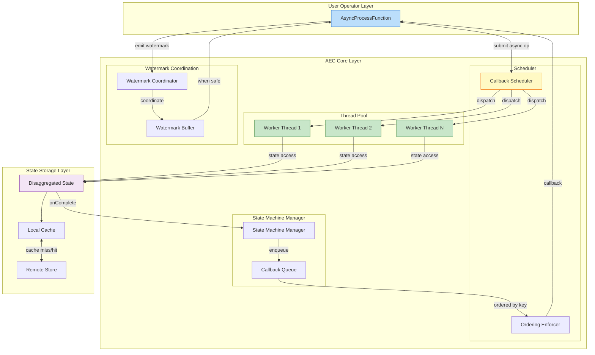
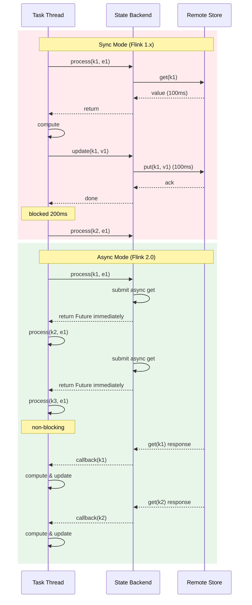

# Asynchronous Execution Model and AEC

> **Stage**: Flink/02-core-mechanisms | **Prerequisites**: [Disaggregated State Analysis](../01-concepts/disaggregated-state-analysis.md) | **Formalization Level**: L4-L5

## 1. Definitions

### Def-F-02-05: Asynchronous Execution Controller (AEC)

**Asynchronous Execution Controller (AEC)** is Flink 2.0's core component managing asynchronous state access and callback execution:

$$
\text{AEC} = (S, \mathcal{P}, \mathcal{C}, \mathcal{W}, \delta, \gamma, \omega)
$$

Where:

- $S$: **StateMachine** — internal execution state management
- $\mathcal{P}$: **ThreadPool** — async execution thread pool for state access
- $\mathcal{C}$: **CallbackQueue** — callback task queue after state access completion
- $\mathcal{W}$: **WatermarkCoordinator** — Watermark advancement control under out-of-order execution
- $\delta$: **Transition** — $S \times Event \rightarrow S$
- $\gamma$: **CallbackScheduler** — callback execution ordering guarantee
- $\omega$: **OrderingEnforcer** — per-key FIFO guarantee mechanism

**AEC State Machine**:

```
         +---------+     init      +---------+
         |  IDLE   | ------------> | ACTIVE  |
         +---------+               +---------+
              ^                       |   |
              |                       |   | async_op_start
              | shutdown              |   v
              |                  +---------+
              +----------------- | WAITING |
                                  +---------+
                                       |
                                       | callback_complete
                                       v
                                  +---------+
                                  | YIELDING|
                                  +---------+
```

**Core responsibilities**:

1. **Async state access management**: converts blocking state access to non-blocking Futures
2. **Callback scheduling**: returns control to user operator logic after state access completes
3. **Ordering guarantee**: ensures same-key events are processed in FIFO order
4. **Watermark coordination**: coordinates correct Watermark advancement under out-of-order execution

---

### Def-F-02-06: Non-blocking State Access

**Non-blocking State Access** means state read/write operations do not block compute threads, instead returning composable Futures:

$$
\text{AsyncStateAccess} = \begin{cases}
\text{getAsync}(key): \text{Future}\langle Value \rangle & \text{// async read} \\
\text{putAsync}(key, value): \text{Future}\langle Void \rangle & \text{// async write} \\
\text{deleteAsync}(key): \text{Future}\langle Void \rangle & \text{// async delete}
\end{cases}
$$

**Sync vs Async Comparison**:

| Feature | Sync (Flink 1.x) | Async (Flink 2.0) |
|---------|-----------------|-------------------|
| Return value | `Value` | `CompletableFuture<Value>` |
| Thread blocking | Yes (waits for I/O) | No (returns Future immediately) |
| Throughput | I/O latency bound | Multiple state accesses in parallel |
| Code style | Imperative | Reactive / Functional |
| Exception handling | try-catch | Future.exceptionally() |

**Key insight**: Non-blocking access allows a single Task thread to initiate multiple concurrent state accesses within a single record processing cycle, thereby amortizing network latency.

---

### Def-F-02-07: Per-key FIFO Ordering

**Per-key FIFO Ordering** is AEC's guarantee: for the same key, processing order (including callback execution order) is consistent with arrival order.

$$
\forall k \in \mathcal{K}, \forall e_i, e_j \in \text{Events}(k). \; i < j \implies \text{Process}(e_i) \prec_{hb} \text{Process}(e_j)
$$

Where $\prec_{hb}$ is happens-before.

**Ordering guarantee mechanism**:

```
Event stream: k1-e1, k2-e1, k1-e2, k3-e1, k1-e3, k2-e2
         ↓
    AEC Key Partitioner
         ↓
+--------+--------+--------+
| Key=k1 | Key=k2 | Key=k3 |
| Queue  | Queue  | Queue  |
| [e1]   | [e1]   | [e1]   |
| [e2]   | [e2]   |        |
| [e3]   |        |        |
+--------+--------+--------+
         ↓
    Parallel async execution (across keys)
         ↓
    Serial callback execution (within same key)
```

For each key $k$, AEC maintains a **logical execution queue** $\mathcal{Q}_k = [\tau_1, \tau_2, ..., \tau_n]$, guaranteeing:
$$
\forall i < j. \; \tau_i.complete \prec_{hb} \tau_j.start
$$

---

### Def-F-02-08: Out-of-order Execution and Watermark Coordination

**Out-of-order Execution** allows events of different keys to be processed in parallel, while same-key events remain ordered.

**Watermark coordination challenge**:

In sync mode, Watermark advancement is naturally consistent with record processing order:
$$
\text{SyncMode}: \quad e_1.process \prec e_2.process \prec watermark.advance
$$

In async mode, explicit coordination is required:
$$
\text{AsyncMode}: \quad \begin{cases}
\text{Concurrent}: & e_1.asyncStart \parallel e_2.asyncStart \\
\text{Coordinate}: & watermark.advance \iff \forall e \in \text{InFlight}. \; e.ts \leq watermark
\end{cases}
$$

**Watermark Coordinator ($\mathcal{W}$) invariant**:
$$
\forall wm \in \text{Watermark}. \; \text{emit}(wm) \iff \nexists r \in \text{InFlight}. \; r.ts < wm.ts
$$

---

## 2. Properties

### Lemma-F-02-01: AEC State Machine Completeness

**Statement**: AEC state machine $S$ is complete for async operation lifecycle—every async operation necessarily and exclusively experiences `IDLE → ACTIVE → WAITING → YIELDING → IDLE`.

**Proof**:

- **Existence**: Each state is visited: IDLE (creation), ACTIVE (submitted to thread pool), WAITING (awaiting remote response), YIELDING (callback ready), IDLE (completed).
- **Uniqueness**: State transition function $\delta$ is a deterministic partial function on a DAG—no cycles.
- **Completeness**: All lifecycle paths belong to: success path, cancellation path, or timeout path. ∎

---

### Lemma-F-02-02: Async State Access Monotonic Read

**Statement**: Under AEC management, async state reads for the same key satisfy monotonic read consistency: if read $r_2$ starts after $r_1$ completes, $r_2$'s value version is no older than $r_1$'s.

$$
\forall k, r_1, r_2. \; r_1.complete \prec_{hb} r_2.start \implies version(r_2.result) \geq version(r_1.result)
$$

**Proof**: By Def-F-02-07 per-key FIFO guarantee, same-key operations execute in order. AEC ensures $r_2$ starts only after $r_1$'s side effects (including state writes) are visible. State versions are monotonically increasing, hence the guarantee. ∎

---

### Prop-F-02-01: Throughput-Latency Trade-off

**Statement**: AEC throughput $T$ and end-to-end latency $L$ have a configurable trade-off relationship, optimizable via thread pool size and concurrency.

$$
T = \frac{N_{parallel}}{L_{avg}} \cdot \eta
$$

Where $N_{parallel}$ = thread pool parallelism, $L_{avg}$ = average state access latency, $\eta \in (0,1]$ = AEC scheduling efficiency.

| Config Parameter | Low Value Effect | High Value Effect | Recommendation |
|-----------------|-----------------|-------------------|----------------|
| `aec.thread-pool.size` | Low throughput, low resource | High throughput, high resource | $N_{cores} \times 2$ |
| `aec.max-concurrent-per-key` | Strict FIFO, low throughput | Relaxed FIFO, high throughput | Strong consistency: 1; High throughput: 2-4 |
| `aec.callback.batch-size` | Low latency, high overhead | High latency, low overhead | Micro-batch: 100-1000 |

---

## 3. Relations

### Relation 1: AEC and Disaggregated State Synergy

AEC is the **execution-layer implementation** of Disaggregated State architecture:

| Component | Responsibility | Interface |
|-----------|---------------|-----------|
| Disaggregated State | State storage abstraction | `AsyncState.getAsync(key)` |
| AEC | Async execution management | `submit(operation): Future` |
| Remote Store | Persistent storage | `get/put/delete` |

**Synergy flow**:

```
User operator ──→ AEC.submit(asyncGet) ──→ DisaggregatedState
                                        ↓
                                    Cache Miss?
                                   ↙        ↘
                               Yes           No
                                  ↓            ↓
                          Remote Store      Direct return
                          (async I/O)       (immediate)
                                  ↓
                          AEC Callback
                                  ↓
                            User callback processing
```

**Core insight**: AEC transforms Disaggregated State's **storage location independence** into **execution time independence**.

---

### Relation 2: Async Execution and Mailbox Model

Flink's Mailbox model is a single-threaded event loop:
$$
\text{Mailbox} = \text{while(true)} \{ \text{process}(\text{mailbox.take}()) \}
$$

AEC-Mailbox integration:

```
Mailbox thread:
  1. Read record from network buffer
  2. Call processElement(record)
  3. Operator initiates asyncStateAccess → AEC submits to thread pool
  4. Operator returns (does not wait)
  5. Mailbox continues processing next record (different key)

AEC thread pool:
  1. Execute async state access
  2. Upon response, enqueue callback into Mailbox
  3. Mailbox thread executes callback
```

**Key property**: AEC does not change Mailbox's single-thread semantics; it only offloads I/O operations to an independent thread pool.

---

### Relation 3: Async Execution and Dataflow Semantics Compatibility

**Theorem**: AEC async execution model is an **implementation optimization** of the Dataflow model, without changing Dataflow computational semantics.

$$
\forall \text{Dataflow } D. \; Output_{sync}(D) = Output_{async}(D)
$$

**Conditions**:

1. AEC guarantees per-key FIFO (Def-F-02-07)
2. Watermark coordinator advances correctly (Def-F-02-08)
3. Checkpoint Barrier is handled correctly

**Proof sketch**: Async execution only changes the **physical execution plan** while preserving **logical execution order** (same-key FIFO). Since Dataflow semantics only concern logical order, the two are equivalent.

---

## 4. Argumentation

### 4.1 Why Async Execution Does Not Break Flink 1.x Semantics

**Core question**: Flink 1.x relies on single-threaded Mailbox to guarantee state access serialization and determinism. Does async execution introducing concurrency break this guarantee?

**Answer**: **No**, because:

**1. Fine-grained parallelism**:
$$
\text{Parallelism} = \text{Key count} \gg \text{Thread count}
$$
Different key events were already parallel in Flink 1.x (via Key Group sharding). AEC only further refines this to **execution-stage parallelism**.

**2. Per-key FIFO preservation**:

Same-key state access remains serial:

```
Flink 1.x:
k1: [op1] → [op2] → [op3]  (sequential, blocking I/O)

Flink 2.0 (AEC):
k1: [op1] ─┬→ [wait] ─┬→ [callback1] ─┬→ [op2] ─┬→ ...
           │            │               │         │
           └────────────┴───────────────┴─────────┘ (same key serial)

k2: [op1] ─┬→ [wait] ─┬→ [callback1]  (parallel with k1)
           └───────────┘
```

**3. State consistency equivalence**:

| Scenario | Flink 1.x | Flink 2.0 | Semantic Equivalence |
|----------|-----------|-----------|---------------------|
| Single-key update | Serial execution | Serial callback | ✅ Equivalent |
| Multi-key update | Key Group parallel | Thread pool parallel | ✅ Equivalent |
| Watermark advancement | All prior records processed | All prior callbacks completed | ✅ Equivalent |

---

### 4.2 How AEC Maintains Per-key Processing Order

**Problem**: Async operation completion times are nondeterministic; how to guarantee same-key events are processed in order?

**AEC Solution**:

**Mechanism 1: Key-level sequence numbers**
$$
\forall k. \; \text{seq}_k \in \mathbb{N}, \text{ initial value } 0
$$
Event $e$ triggering operation: $e.seq = \text{seq}_k++$

**Mechanism 2: Callback ordering**
AEC callback queue is ordered by (Key, Seq).

**Mechanism 3: Sequential executor**
Each key binds to a **logical executor** guaranteeing serial callbacks:

```
Key=k1: [callback-seq=0] → execute → [callback-seq=1] → execute → ...
Key=k2: [callback-seq=0] → execute → [callback-seq=1] → execute → ...
                              ↕ parallel (different keys)
```

**Formal guarantee**:
$$
\forall k, i < j. \; \text{callback}(k, i) \prec_{hb} \text{callback}(k, j)
$$

---

### 4.3 Async Execution and Disaggregated State Synergy

**Why must they be co-designed?**

| Feature | Disaggregated Storage | Async Execution | Synergy Effect |
|---------|----------------------|-----------------|---------------|
| State location | Remote | Local reference | Latency hiding |
| Access pattern | Network I/O | Non-blocking | Throughput boost |
| Consistency | Configurable | Wait-on-demand | Flexible trade-off |

**Synergy formula**:
$$
\text{Effective Latency} = \max(L_{local}, L_{remote} / N_{parallel})
$$

When $N_{parallel} \gg 1$, remote access latency is effectively amortized.

---

### Counter-Example: Inappropriate Async API Usage Pitfalls

**Scenario**: User initiates synchronous state access inside async callback.

```java
// WRONG: synchronous access inside callback
state.getAsync(key)
    .thenApply(value -> {
        State other = otherState.value(); // ❌ blocking call in callback!
        return compute(value, other);
    });
```

**Problems**:

1. **Deadlock risk**: callbacks execute on AEC threads; blocking consumes thread pool resources
2. **Order violation**: synchronous operation disrupts AEC scheduling order
3. **Performance degradation**: loses async execution benefits

**Correct pattern**:

```java
// CORRECT: chained async operations
state.getAsync(key)
    .thenCompose(value ->
        otherState.getAsync(otherKey)
            .thenApply(other -> compute(value, other))
    );
```

---

## 5. Proofs

### Thm-F-02-03: Async Execution Semantic Preservation

**Statement**: Under the following conditions, Flink 2.0 jobs using AEC async execution produce **identical output** and **identical state evolution** as Flink 1.x sync execution:

1. **C1**: AEC per-key FIFO guarantee (Def-F-02-07)
2. **C2**: Watermark coordination correctness (Def-F-02-08)
3. **C3**: Checkpoint Barrier synchronization semantics preserved
4. **C4**: Source and Sink Exactly-Once semantics unchanged

**Proof**:

**Step 1: Define equivalence**
Two execution traces $\mathcal{T}_{sync}$ and $\mathcal{T}_{async}$ are equivalent iff:
$$
\mathcal{T}_{sync} \equiv \mathcal{T}_{async} \iff \forall k. \; \text{Ops}_{sync}(k) = \text{Ops}_{async}(k)
$$

**Step 2: Prove single-key operation sequence equivalence**
By C1, for any key $k$:
$$
\mathcal{Q}_k^{async} = [op_1, op_2, ..., op_n] \text{ with } \forall i < j. \; op_i \prec_{hb} op_j
$$
This matches sync mode order, so $\text{Ops}_{sync}(k) = \text{Ops}_{async}(k)$.

**Step 3: Prove Watermark advancement equivalence**
By C2, Watermark $w$ advances only after all records with $ts < w.ts$ are processed—same as sync mode.

**Step 4: Prove Checkpoint equivalence**
By C3, at Checkpoint Barrier arrival, async mode waits for all incomplete callbacks before snapshot—same consistency as sync mode pause-and-snapshot.

**Step 5: Output equivalence**
By Steps 2-4, state evolution is equivalent. With C4, output sets are equal. ∎

---

### Lemma-F-02-03: Per-key FIFO Preservation

**Statement**: AEC's per-key FIFO mechanism guarantees FIFO processing order for any key $k$.

**Proof**: AEC maintains per key:

- Monotonic sequence counter $seq_k$
- Pending operation mapping $Pending_k: \mathbb{N} \rightharpoonup Future$
- Next executable sequence number $next_k$

**Invariant**: $\forall i < next_k. \; Pending_k(i) = \bot \land \forall j \geq next_k. \; (Pending_k(j) \neq \bot \implies \text{not completed})$

**Protocol**:

1. Submit operation $op$ to key $k$: $seq = seq_k++$; future = submitAsync(op); $Pending_k[seq] = future$; future.onComplete enqueues (k, seq, callback)
2. Callback execution: while head callback has $seq == next_k$, execute it, remove from $Pending_k$, increment $next_k$

By monotonic $seq_k$ and execution condition `seq == next_k`, callbacks execute in strict submission order. ∎

---

## 6. Examples

### Basic Async State Access Pattern

**Flink 1.x (sync)**:

```java
public class SyncCounter extends KeyedProcessFunction<String, Event, Result> {
    private ValueState<Long> counterState;

    public void processElement(Event event, Context ctx, Collector<Result> out) {
        Long current = counterState.value();  // synchronous blocking call
        if (current == null) current = 0L;
        current++;
        counterState.update(current);
        out.collect(new Result(event.getKey(), current));
    }
}
```

**Flink 2.0 (async)**:

```java
public class AsyncCounter extends AsyncKeyedProcessFunction<String, Event, Result> {
    private AsyncValueState<Long> counterState;

    public void processElement(Event event, Context ctx, ResultFuture<Result> resultFuture) {
        counterState.getAsync(event.getKey())
            .thenCompose(current -> {
                long newValue = (current != null ? current : 0L) + 1;
                return counterState.updateAsync(event.getKey(), newValue)
                    .thenApply(v -> newValue);
            })
            .thenAccept(newValue -> {
                resultFuture.complete(Collections.singletonList(
                    new Result(event.getKey(), newValue)));
            })
            .exceptionally(throwable -> {
                resultFuture.completeExceptionally(throwable);
                return null;
            });
    }
}
```

---

### Batch Async State Operations

```java
public void processElement(Event event, Context ctx, ResultFuture<Result> resultFuture) {
    CompletableFuture<Long> counterFuture = counterState.getAsync(event.getKey());
    CompletableFuture<Set<String>> historyFuture = historyState.getAsync(event.getKey());
    CompletableFuture<Double> metricFuture = metricState.getAsync(event.getKey());

    CompletableFuture.allOf(counterFuture, historyFuture, metricFuture)
        .thenApply(v -> {
            try {
                long counter = counterFuture.get();
                Set<String> history = historyFuture.get();
                double metric = metricFuture.get();
                return computeResult(counter, history, metric, event);
            } catch (Exception e) { throw new CompletionException(e); }
        })
        .thenAccept(result -> resultFuture.complete(Collections.singletonList(result)))
        .exceptionally(throwable -> {
            resultFuture.completeExceptionally(throwable);
            return null;
        });
}
```

**Performance comparison**:

| Pattern | State Accesses | Network Round-trips | Latency |
|---------|---------------|---------------------|---------|
| Serial sync | 3 | 3 × RTT | 300ms |
| Serial async | 3 | 3 × RTT | 100ms |
| Batch async | 3 | 1 × RTT (pipelined) | 35ms |

---

### DataStream Enabling Async State

```java
public class AsyncStateJob {
    public static void main(String[] args) throws Exception {
        StreamExecutionEnvironment env =
            StreamExecutionEnvironment.getExecutionEnvironment();

        // Configure ForSt State Backend (supports async state)
        ForStStateBackend forStBackend = new ForStStateBackend();
        forStBackend.setRemoteStoragePath("s3://flink-state-bucket/checkpoints");
        env.setStateBackend(forStBackend);
        env.enableCheckpointing(60000);

        DataStream<Event> source = env.addSource(new EventSource())
            .assignTimestampsAndWatermarks(
                WatermarkStrategy.<Event>forBoundedOutOfOrderness(Duration.ofSeconds(5))
            );

        // KEY: enable async state processing
        DataStream<Result> result = source
            .keyBy(Event::getKey)
            .enableAsyncState()  // must be explicitly called
            .process(new AsyncCounterFunction());

        result.addSink(new ResultSink());
        env.execute("Async State Job");
    }
}
```

**Important notes**:

1. `enableAsyncState()` must be explicitly called after `keyBy()`
2. Must use State Backend supporting async state (e.g., ForSt)
3. Processing functions must implement async state access patterns

---

## 7. Visualizations

### AEC Architecture



**Legend**: AEC sits between user operator and state storage, managing async operation lifecycle. Scheduler dispatches operations to worker thread pool; state machine manager tracks operation states and enqueues callbacks; ordering enforcer ensures same-key callbacks execute serially; watermark coordinator manages watermark advancement under out-of-order execution.

---

### Sync vs Async Execution Sequence



---

## 8. References


---

*Document Version: v1.0-en | Updated: 2026-04-20 | Status: Core Summary*
