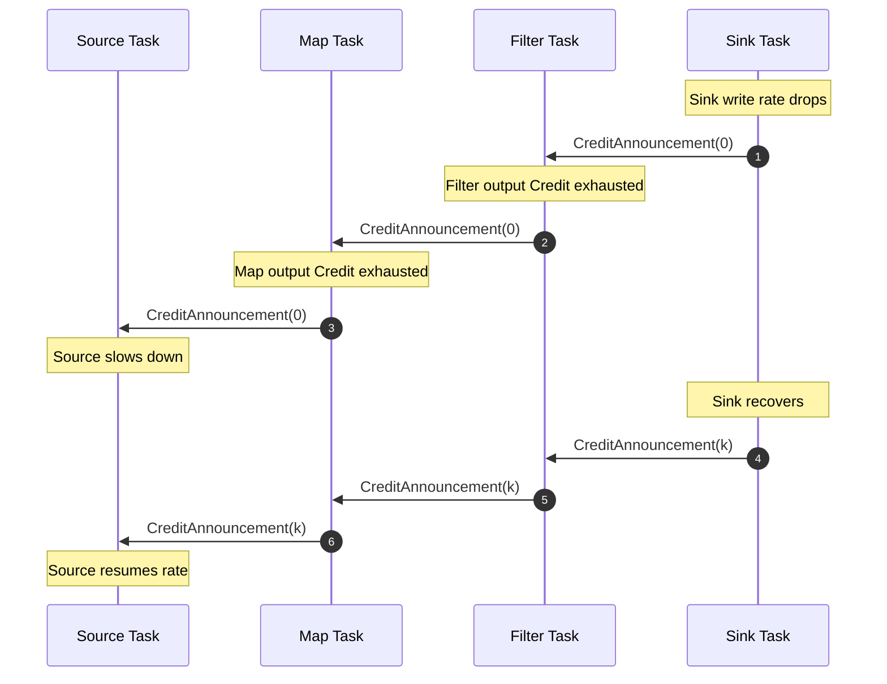
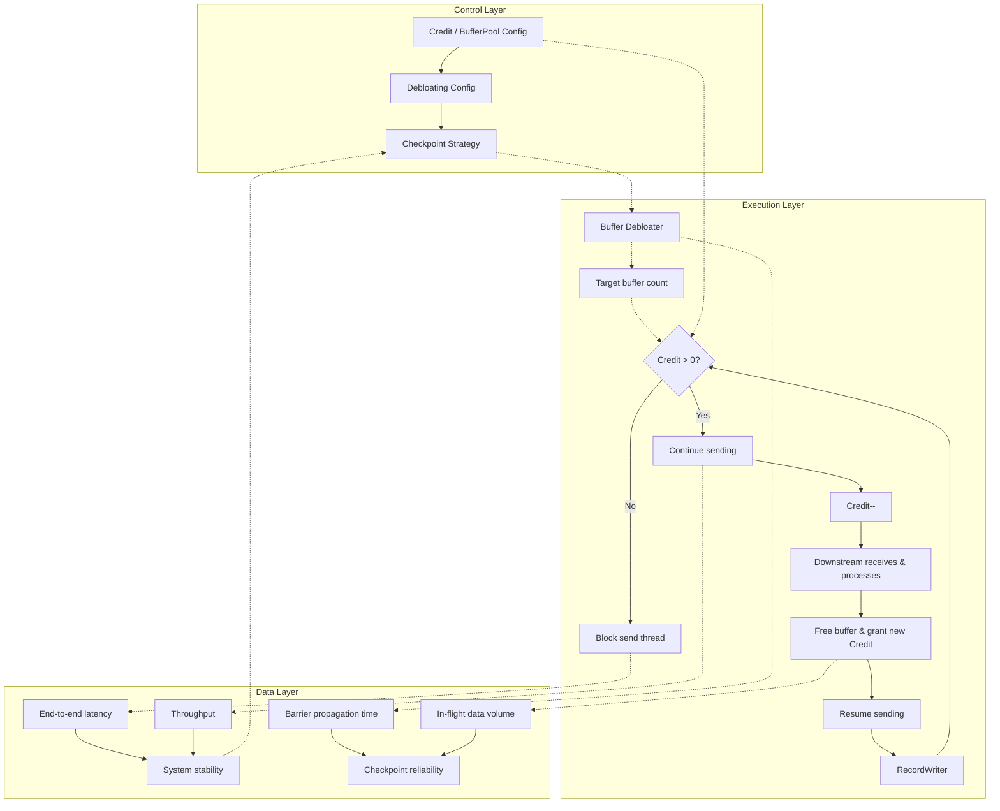
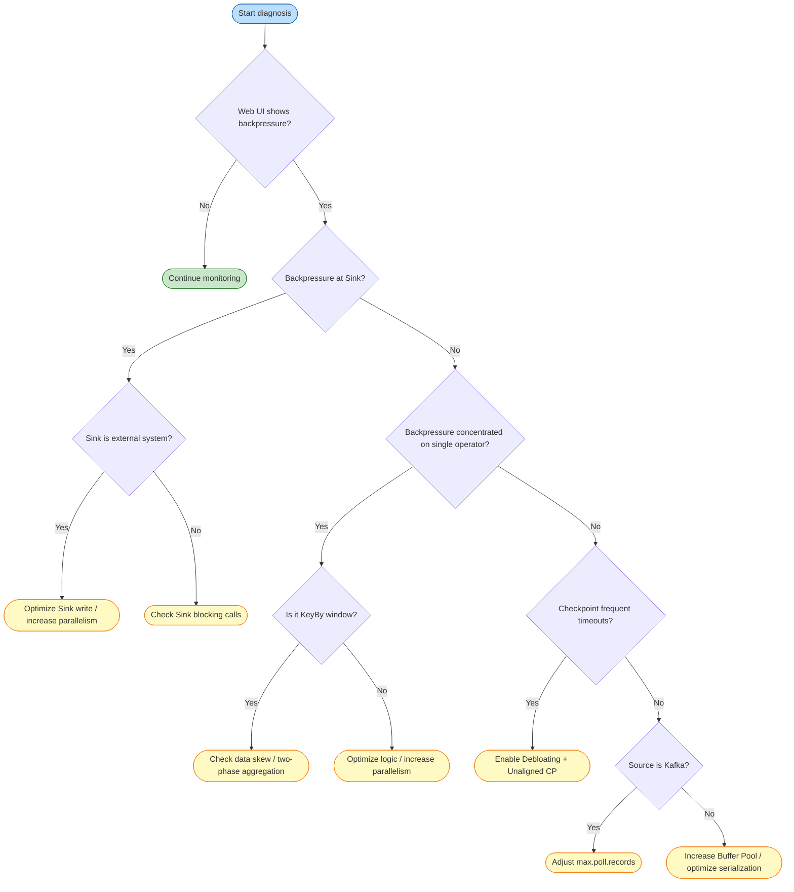

# Backpressure and Flow Control

> **Stage**: Flink/ | **Prerequisites**: [Flink Deployment Architecture](../01-concepts/deployment-architectures.md) | **Formalization Level**: L3-L4

## 1. Definitions

### Def-F-02-01: Backpressure

Let producer aggregate rate be $R_{prod}(t)$, consumer aggregate rate be $R_{cons}(t)$, and buffer occupancy rate be $\rho(B, t)$:

$$
\text{Backpressure}(t) \iff R_{prod}(t) > R_{cons}(t) \land \lim_{t' \to t^+} \rho(B, t') = 1
$$

**Definition rationale**: This definition elevates backpressure from "phenomenon" to a detectable, quantifiable, and formally analyzable system state [^1].

---

### Def-F-02-02: Credit-based Flow Control (CBFC)

Let sender be $S$, receiver be $R$, and logical channel be $ch(S, R)$:

$$
\begin{aligned}
&\text{Credit}(ch) = k > 0 \implies S \text{ can send at most } k \text{ network buffers to } R \\
&\text{Credit}(ch) = 0 \implies S \text{ pauses sending}
\end{aligned}
$$

Flink 1.5+ implements CBFC on `RemoteInputChannel`: the receiver returns available buffer count as credit to upstream `ResultSubPartition`; upstream writes data only when credit > 0 [^2][^3].

**Definition rationale**: CBFC achieves zero-wait rate regulation at task-level pre-authorization, avoiding a single slow task blocking other channels on the same TCP connection [^4].

---

### Def-F-02-03: TCP Backpressure (Legacy)

Before Flink 1.5, inter-TaskManager flow control relied entirely on TCP sliding windows:

$$
\text{TCP-Backpressure}(t) \iff \text{SocketBuf}_{occ}(t) \to \text{SocketBuf}_{cap} \land \text{AdvertisedWindow}(t) \to 0
$$

**Definition rationale**: TCP "connection-level" semantics mismatch Flink's "task-level" channels—all channels on the same connection stall when one channel backpressures.

---

### Def-F-02-04: Local vs End-to-End Backpressure

- **Local backpressure**: downstream processing slowness causes data accumulation in the same thread's local buffer, blocking `collect()$. Propagation delay $\tau_{local} \approx 0$.
- **End-to-end backpressure**: after Sink rate drops, backpressure signal traverses multiple TaskManagers upstream to Source:

$$
\tau_{e2e} = \sum_{e \in Path_{src \to sink}} \tau_{credit}(e) + \tau_{network}(e)
$$

**Definition rationale**: Web UI backpressure reflects local thread blocking; end-to-end latency and Checkpoint timeout reflect cross-network backpressure accumulation.

---

### Def-F-02-05: Buffer Debloating

For subtask $v$ at current throughput $\lambda_v(t)$, Debloating dynamically adjusts input gate target buffer count:

$$
N_{target}(v, t) = \left\lceil \frac{\lambda_v(t) \cdot T_{target}}{\text{BufferSize}} \right\rceil
$$

Where $T_{target}$ is controlled by `taskmanager.network.memory.buffer-debloat.target` (default ~1s) [^5][^6].

**Definition rationale**: Fixed buffers cause excessive in-flight data during backpressure, slowing Checkpoint Barrier propagation or increasing Unaligned Checkpoint size [^7].

---

### Def-F-02-06: Network Buffer Pool

TaskManager maintains a local buffer pool per task:

$$
\text{LBP}(T) = \langle B_{net}, B_{in}, B_{out}, B_{floating}, B_{reserved} \rangle
$$

Where $B_{in}$ are exclusive buffers, $B_{floating}$ are floating buffers, and $B_{reserved}$ are reserved for Credit and Barrier messages.

**Definition rationale**: LBP isolation is the physical foundation for Flink backpressure "localization." Without isolation, downstream backpressure would cascade to unrelated upstream tasks.

---

### Def-F-02-07: Backpressure Monitoring Metrics

Flink exposes the following core backpressure and flow-control metrics [^8]:

| Metric Name | Type | Semantics |
|------------|------|-----------|
| `backPressuredTimeMsPerSecond` | Counter | Backpressure milliseconds per second; approaching 1000 indicates severe backpressure |
| `numRecordsInPerSecond` / `numRecordsOutPerSecond` | Meter | Input/output record rates |
| `outPoolUsage` / `inPoolUsage` | Gauge | Output/input buffer pool utilization |
| `debloatedBufferSize` | Gauge | Current target buffer size from Debloating |
| `estimatedTimeToConsumeBuffersMs` | Gauge | Estimated time to consume input channel buffer data |
| `numBuffersInRemotePerSecond` | Meter | Buffers received per second from remote TMs |
| `numBuffersOutPerSecond` | Meter | Buffers sent per second |

---

## 2. Properties

### Prop-F-02-01: CBFC Guarantees Deadlock Freedom

**Proof**: Backpressure propagates along DAG inverse edges. DAGs are acyclic; a deadlock would require a cyclic waiting chain, which demands a directed cycle in the data flow—contradiction. ∎

---

### Prop-F-02-02: Backpressure Propagation Guarantees Upstream Rate Adaptation

If Sink consumption rate drops, then within finite time $\Delta t$, Source read rate $R_{src}(t + \Delta t) \leq R_{sink}(t)$.

**Proof**: After Sink input buffers fill, it stops granting Credit to upstream. Upstream blocks output at Credit = 0, causing its own input buffers to fill. With DAG finite depth $d$, backpressure reaches Source within at most $d$ levels, and Source slows to match downstream. ∎

---

### Prop-F-02-03: Buffer Isolation Guarantees Local Fault Non-Propagation

If operator $v_i$ experiences backpressure, operators $v_j$ with no data dependency on $v_i$ are unaffected.

**Proof**: Each task has an independent LBP (Def-F-02-06); backpressure propagates only via Credit mechanism. If $v_j$ and $v_i$ have no transitive dependency, no Credit dependency chain exists. ∎

---

### Prop-F-02-04: Buffer Debloating Shortens Checkpoint Barrier Propagation Time

Let Aligned Checkpoint Barrier traversal queue time be $T_{barrier}$. With Debloating enabled, $\mathbb{E}[T'_{barrier}] \ll \mathbb{E}[T_{barrier}]$.

**Proof**: Debloating reduces in-flight data from fixed maximum $|B_{max}|$ to minimum $|B_{target}|$ sustaining link saturation. Barriers follow buffered data; less data means shorter queue time. For Unaligned Checkpoint, it also reduces data materialization volume [^7]. ∎

---

### Prop-F-02-05: Credit System Guarantees Receiver Buffer Non-Overflow

For any channel $ch(S, R)$ at any time $t$: $\text{Sent}(t) \leq \text{Granted}(t) \leq \text{BufferCapacity}$.

**Proof**: Initially $\text{Sent}(0)=0$, $\text{Granted}(0)=|B_{free}|$. Sending requires $\text{Credit}>0$; each send increments Sent and decrements Credit, so $\text{Granted}=\text{Credit}+\text{Sent}$ is invariant. Receiver grants new Credit only after freeing buffers, so $\text{Granted}$ never exceeds total capacity. ∎

---

## 3. Relations

### Relation 1: Flink CBFC `⊃` TCP Flow Control

- **Encoding existence**: TCP sliding window can be encoded as a Credit-based special case—AdvertisedWindow as dynamic Credit, ACK as implicit recycle notification.
- **Separation result**: Flink CBFC has task-level fine-grained control and application-layer observability that TCP lacks.

| Dimension | TCP-based Backpressure (Legacy) | Credit-based Flow Control (Flink 1.5+) |
|-----------|--------------------------------|---------------------------------------|
| Control layer | Transport (kernel) | Application (user-space) |
| Control granularity | Connection-level | Task/subtask-level (logical channel) |
| Feedback mechanism | ACK + AdvertisedWindow | Credit Announcement + Backlog Size |
| Buffer location | Kernel socket buffer | User-space Network Buffer Pool |
| Backpressure propagation speed | RTT-dependent, slower | Application-level local decision, faster |
| Multiplexing impact | One channel backpressure blocks entire connection | One channel backpressure affects only that channel |
| Observability | Black box | White box (Web UI / Metrics) |
| Barrier propagation | May block under severe backpressure | Reserved buffers guarantee control message delivery |

---

### Relation 2: Local Backpressure `→` End-to-End Backpressure

**Relationship**: Local backpressure is the "atomic step" of end-to-end backpressure propagation; end-to-end backpressure is the global closure of local backpressure over the DAG inverse topology.

**Argument**: Each hop of end-to-end backpressure has two phases: (1) downstream input buffer full causes local backpressure; (2) downstream stops granting Credit, upstream output blocks. Let local backpressure relation be $\mathcal{R}_{local}$; then end-to-end backpressure is $\mathcal{R}_{e2e} = \mathcal{R}_{local}^+$ (transitive closure).

---

### Relation 3: Backpressure `↔` Checkpoint Reliability

- **Backpressure → Checkpoint**: Severe backpressure causes Aligned Checkpoint Barriers to queue in data channels for long periods, triggering Checkpoint timeout. Solution: enable Unaligned Checkpoint or Buffer Debloating [^7].
- **Checkpoint → Backpressure**: Unaligned Checkpoint materializes in-flight data to state backend; excessive data volume causes Checkpoint size explosion, exacerbating I/O backpressure. Solution: Buffer Debloating pre-controls data volume [^6].
- **Conclusion**: Backpressure governance and Checkpoint tuning must be designed as a unified whole.

---

## 4. Argumentation

### 4.1 Why Flink 1.5 Had to Replace TCP Flow Control with CBFC

**Scenario**: One TM runs 10 parallel `Map` tasks sending data over the same TCP connection to 10 `Filter` tasks on another TM; 1 `Filter` slows due to data skew.

**TCP consequence**: The slow `Filter`'s socket buffer fills, TCP sets AdvertisedWindow to 0, and all 10 upstream `Map` tasks block. Global throughput drops 90%.

**CBFC improvement**: Each `Map → Filter` channel has independent Credit. The slow `Filter` only stops granting Credit to its corresponding upstream `Map`; other 9 channels operate normally. Global throughput drops only ~10%.

Thus, TCP → CBFC is a paradigm leap from "connection-level" to "channel-level" flow control semantics [^2][^4].

---

### 4.2 Buffer Debloating Applicability Boundaries

Debloating does not always yield positive returns [^5][^6]:

- **Multiple/Union inputs**: If a subtask has multiple distinct input sources or `union` input, Debloating computes throughput at subtask level. Low-throughput inputs may receive excessive buffers; high-throughput inputs may be insufficient. Recommend disabling Debloating or manual tuning for such subtasks.
- **Extremely high parallelism**: When parallelism exceeds ~200, default floating buffer count may be insufficient, causing Debloating calculation to fluctuate wildly. Recommend setting `floating-buffers-per-gate` to parallelism level [^5].
- **Startup/recovery phases**: During job startup or fault recovery, throughput is not yet stable and Debloating measurement samples are insufficient. Flink 1.19+ introduces `taskmanager.memory.starting-segment-size` (default 1024B) to mitigate startup issues [^9].

---

### 4.3 Buffer Debloating Impact on Checkpoint

**Principle**:
$$
N_{target}(v, t) = \left\lceil \frac{\lambda_v(t) \cdot T_{target}}{\text{BufferSize}} \right\rceil
$$

**Impact on Checkpoint**:

- Reduces in-flight data in buffers
- Accelerates Checkpoint Barrier propagation speed
- Reduces Unaligned Checkpoint data size

**Trade-offs**:

| Scenario | Recommended Configuration |
|----------|--------------------------|
| Low latency priority | Enable Debloating, target 500ms |
| High throughput priority | Disable Debloating, increase buffers |
| Large-state jobs | Enable Debloating + Unaligned Checkpoint |

---

## 5. Proofs

### Thm-F-02-01: CBFC Safety

**Statement**: Under normal Flink CBFC operation, for any channel $ch(S, R)$ at any time $t$, $\text{Overflow}(ch, t)$ is unreachable.

**Proof**:

**Invariant $I$**: $\text{InFlight}(t) = \text{Sent}(t) - \text{Consumed}(t) \leq \text{Credit}_{total}(t)$

**Base case** ($t = 0$): $\text{Sent}(0) = 0$, $\text{Consumed}(0) = 0$, $\text{Credit}_{total}(0) = |B_{free}| \leq \text{Cap}(ch)$. Holds.

**Inductive step**: Assume invariant holds at $t$:

1. **Send event**: precondition $\text{Credit}(S, R) > 0$ (Def-F-02-02). Sent increases by 1, Credit decreases by 1, InFlight increases by 1 but remains within $\text{Credit}_{total}$. Invariant holds.
2. **Consume event**: $R$ processes data, Consumed increases by 1, buffer freed may grant new Credit. InFlight decreases, invariant holds.

Since $\text{Credit}_{total}(t) \leq \text{Cap}(ch)$ and control-message buffers are isolated from data buffers (Def-F-02-06), $\text{Occ}(ch, t) = \text{InFlight}(t) \leq \text{Cap}(ch)$. By Def-F-02-01, $\text{Overflow}(ch, t)$ is false. ∎

---

### Thm-F-02-02: Backpressure Propagation Converges in Finite Steps

Let Flink DAG longest path length be $d$. If Sink triggers backpressure at $t_0$, then by $t_0 + d \cdot \tau_{max}$ at the latest, all Sources will have sensed backpressure, where $\tau_{max}$ is the single-level Credit propagation maximum delay.

**Proof** (structural induction):

**Base case** ($d = 1$): Source senses within $\leq \tau_{max}$.

**Inductive hypothesis**: Holds for depth $\leq k$.

**Inductive step** ($d = k + 1$): Let Sink be $s$, direct predecessors $\{p_i\}$. $s$ stops granting Credit to all $p_i$ at $t_0$; $p_i$ sense within $t_0 + \tau_{max}$. For each $p_i$, the subgraph with $p_i$ as local Sink has depth $\leq k$. By hypothesis, backpressure reaches all Sources within additional $k \cdot \tau_{max}$. Total delay $\leq (k+1) \cdot \tau_{max}$. ∎

---

## 6. Examples

### Example: Normal Credit-based Backpressure Propagation

Flink job `KafkaSource → Map → Filter → KafkaSink`:

1. Sink write rate drops → stops granting Credit to Filter.
2. Filter output Credit exhausted → blocks sending, input buffers accumulate.
3. Filter stops consuming from Map → Map output Credit exhausted.
4. Map stops consuming from Source → KafkaSource slows, `poll()` frequency decreases. System reaches steady state.

---

### Counter-Example: High Parallelism Drop Causes OOM

**Scenario**: `Source → HighParallelismMap(p=100) → LowParallelismWindow(p=1) → Sink`

- Source rate: 100,000 rec/s, Buffer Pool: 512 MB, Credit delay: 50ms
- Window processing rate: only 5,000 rec/s

Before 50ms backpressure takes effect, 100 Maps continuously send: $100,000 \times 100 \times 0.05 = 500,000$ rec ≈ 500 MB, triggering OOM.

**Analysis**: Violates Thm-F-02-02's assumption that $\tau_{max}$ is sufficiently small. With extreme parallelism differences, must increase intermediate buffers, introduce local aggregation, or reduce Source rate [^1].

---

### Example: Buffer Debloating Tuning

**Scenario**: E-commerce real-time recommendation job; evening flash sales cause spikes; Aligned Checkpoint jumps from 3s to 30s+.

```yaml
taskmanager.network.memory.buffer-debloat.enabled: true
taskmanager.network.memory.buffer-debloat.period: 500ms
taskmanager.network.memory.buffer-debloat.samples: 20
taskmanager.network.memory.buffer-debloat.threshold-percentages: 25,100
taskmanager.network.memory.floating-buffers-per-gate: 150
execution.checkpointing.unaligned: true
execution.checkpointing.max-aligned-checkpoint-size: 1mb
```

**Effect**: Before tuning `backPressuredTimeMsPerSecond ≈ 950`, Checkpoint avg 28s, timeout rate 15%. After tuning peak drops to ~600, Checkpoint avg 6s, timeout rate 0%.

---

## 7. Visualizations

### Credit-based Backpressure Propagation in Flink Pipeline



**Legend**: Downstream feeds back available buffers to upstream via `CreditAnnouncement`. Propagation time is $O(d \cdot \tau_{max})$.

---

### Control-Execution-Data Layer Association



---

### Backpressure Diagnosis and Tuning Decision Tree



---

## 8. References

[^1]: Apache Flink Documentation, "Monitoring Back Pressure", 2025. <https://nightlies.apache.org/flink/flink-docs-stable/docs/ops/monitoring/back_pressure/>
[^2]: Apache Flink JIRA, "FLINK-7282: Credit-based Network Flow Control", 2017.
[^3]: Alibaba Cloud, "Analysis of Network Flow Control and Back Pressure: Flink Advanced Tutorials", 2020.
[^4]: T. Akidau et al., "The Dataflow Model," *PVLDB*, 8(12), 2015.
[^5]: Apache Flink Documentation, "Network Buffer Tuning", 2025. <https://nightlies.apache.org/flink/flink-docs-stable/docs/deployment/memory/network_mem_tuning/>
[^6]: Apache Flink Documentation, "Checkpointing under Backpressure", 2025.
[^7]: AWS Compute Blog, "Optimize Checkpointing In Your Amazon Managed Service For Apache Flink Applications With Buffer Debloating", 2023.
[^8]: Apache Flink Documentation, "Metrics System", 2025.
[^9]: Apache Flink JIRA, "FLINK-36556: Allow to configure starting buffer size when using buffer debloating", 2024.

---

*Document Version: v1.0-en | Updated: 2026-04-20 | Status: Core Summary*
