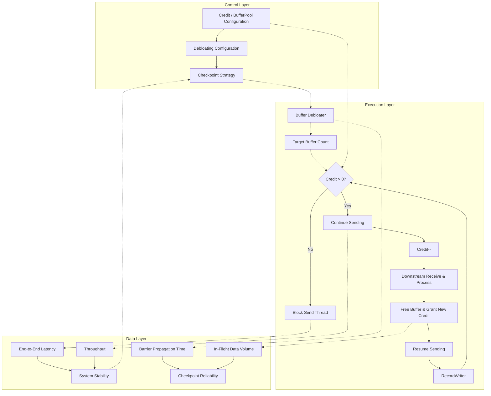
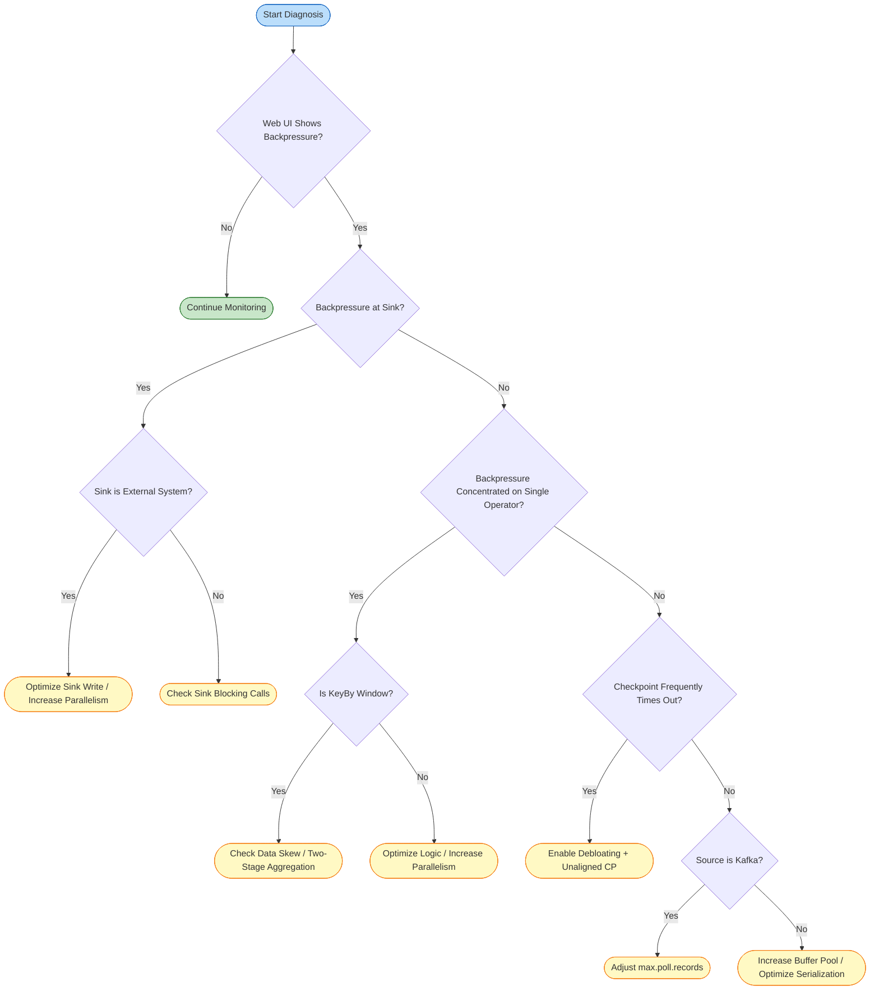

# Backpressure and Flow Control

> **Stage**: Flink/ | **Prerequisites**: [Flink Deployment Architecture](../01-concepts/deployment-architectures-en.md) | **Formalization Level**: L3-L4

---

## Table of Contents

- [Backpressure and Flow Control](#backpressure-and-flow-control)
  - [Table of Contents](#table-of-contents)
  - [1. Definitions](#1-definitions)
    - [Def-F-02-01 Backpressure](#def-f-02-01-backpressure)
    - [Def-F-02-02 Credit-based Flow Control (CBFC)](#def-f-02-02-credit-based-flow-control-cbfc)
    - [Def-F-02-03 TCP Backpressure (Legacy)](#def-f-02-03-tcp-backpressure-legacy)
    - [Def-F-02-04 Local vs. End-to-End Backpressure](#def-f-02-04-local-vs-end-to-end-backpressure)
    - [Def-F-02-05 Buffer Debloating](#def-f-02-05-buffer-debloating)
    - [Def-F-02-06 Network Buffer Pool](#def-f-02-06-network-buffer-pool)
    - [Def-F-02-07 Backpressure Monitoring Metrics](#def-f-02-07-backpressure-monitoring-metrics)
  - [2. Properties](#2-properties)
    - [Prop-F-02-01 CBFC Guarantees Deadlock Freedom](#prop-f-02-01-cbfc-guarantees-deadlock-freedom)
    - [Prop-F-02-02 Backpressure Propagation Guarantees Upstream Rate Adaptation](#prop-f-02-02-backpressure-propagation-guarantees-upstream-rate-adaptation)
    - [Prop-F-02-03 Buffer Pool Isolation Guarantees Localized Faults](#prop-f-02-03-buffer-pool-isolation-guarantees-localized-faults)
    - [Prop-F-02-04 Buffer Debloating Shortens Checkpoint Barrier Propagation Time](#prop-f-02-04-buffer-debloating-shortens-checkpoint-barrier-propagation-time)
    - [Prop-F-02-05 Credit System Guarantees Receiver Buffer Non-Overflow](#prop-f-02-05-credit-system-guarantees-receiver-buffer-non-overflow)
  - [3. Relations](#3-relations)
    - [Relation 1: Flink CBFC `⊃` TCP Flow Control](#relation-1-flink-cbfc-tcp-flow-control)
    - [Relation 2: Local Backpressure `→` End-to-End Backpressure](#relation-2-local-backpressure-end-to-end-backpressure)
    - [Relation 3: Backpressure `↔` Checkpoint Reliability](#relation-3-backpressure-checkpoint-reliability)
  - [4. Argumentation](#4-argumentation)
    - [4.1 Why Flink 1.5 Had to Replace TCP Flow Control with CBFC](#41-why-flink-15-had-to-replace-tcp-flow-control-with-cbfc)
    - [4.2 Buffer Debloating Applicability Boundaries](#42-buffer-debloating-applicability-boundaries)
    - [4.3 Buffer Debloating Impact on Checkpoints](#43-buffer-debloating-impact-on-checkpoints)
    - [4.4 Backpressure Diagnostic Structural Lemmas](#44-backpressure-diagnostic-structural-lemmas)
  - [5. Proof / Engineering Argument](#5-proof-engineering-argument)
    - [Theorem 5.1 (CBFC Safety)](#theorem-51-cbfc-safety)
    - [Theorem 5.2 (Backpressure Propagation Finite-Step Convergence)](#theorem-52-backpressure-propagation-finite-step-convergence)
    - [Engineering Argument 5.3 (Buffer Debloating + Unaligned Checkpoint Joint Selection)](#engineering-argument-53-buffer-debloating-unaligned-checkpoint-joint-selection)
  - [6. Examples](#6-examples)
    - [Example 6.1: Normal Credit-based Backpressure Propagation](#example-61-normal-credit-based-backpressure-propagation)
    - [Counterexample 6.2: High Parallelism Gap Causes OOM](#counterexample-62-high-parallelism-gap-causes-oom)
    - [Example 6.3: Buffer Debloating Tuning Configuration](#example-63-buffer-debloating-tuning-configuration)
    - [Counterexample 6.4: Kafka Source Backpressure Blind Spot](#counterexample-64-kafka-source-backpressure-blind-spot)
  - [7. Visualizations](#7-visualizations)
    - [Figure 7.1: Credit-based Backpressure Propagation in Flink Pipeline](#figure-71-credit-based-backpressure-propagation-in-flink-pipeline)
    - [Figure 7.2: Control-Execution-Data Layer Association](#figure-72-control-execution-data-layer-association)
    - [Figure 7.3: Backpressure Diagnosis and Tuning Decision Tree](#figure-73-backpressure-diagnosis-and-tuning-decision-tree)
  - [8. References](#8-references)

## 1. Definitions

### Def-F-02-01 Backpressure

Let producer aggregate rate be $R_{prod}(t)$, consumer aggregate rate be $R_{cons}(t)$, and buffer occupancy rate be $\rho(B, t)$:

$$
\text{Backpressure}(t) \iff R_{prod}(t) > R_{cons}(t) \land \lim_{t' \to t^+} \rho(B, t') = 1
$$

**Motivation for the Definition**: This definition elevates backpressure from a "phenomenon" to a detectable, quantifiable, and formally analyzable system state[^1].

---

### Def-F-02-02 Credit-based Flow Control (CBFC)

Let sender be $S$, receiver be $R$, and logical channel be $ch(S, R)$:

$$
\begin{aligned}
&\text{Credit}(ch) = k > 0 \implies S \text{ can send at most } k \text{ network buffers to } R \\
&\text{Credit}(ch) = 0 \implies S \text{ pauses sending}
\end{aligned}
$$

Flink 1.5+ implements CBFC on `RemoteInputChannel`: the receiver sends the number of available buffers back to upstream `ResultSubPartition` as credit; the upstream only writes data when credit > 0[^2][^3].

**Motivation for the Definition**: CBFC achieves zero-wait rate regulation at the task-level pre-authorization, preventing a single slow task from blocking other channels on the same TCP connection[^4].

---

### Def-F-02-03 TCP Backpressure (Legacy)

Before Flink 1.5, inter-TaskManager flow control relied entirely on TCP sliding windows:

$$
\text{TCP-Backpressure}(t) \iff \text{SocketBuf}_{occ}(t) \rightarrow \text{SocketBuf}_{cap} \land \text{AdvertisedWindow}(t) \rightarrow 0
$$

**Motivation for the Definition**: TCP's "connection-level" semantics have an impedance mismatch with Flink's "task-level" channels — all channels on the same connection stall due to backpressure on a single channel.

---

### Def-F-02-04 Local vs. End-to-End Backpressure

- **Local Backpressure**: Downstream processing slowness causes data to accumulate in the same-thread local buffer, `collect()` blocks. Propagation delay $\tau_{local} \approx 0$.
- **End-to-End Backpressure**: After Sink rate drops, backpressure signal travels upstream against the topology through multiple TaskManagers to reach Source:

$$
\tau_{e2e} = \sum_{e \in Path_{src \to sink}} \tau_{credit}(e) + \tau_{network}(e)
$$

**Motivation for the Definition**: Web UI backpressure reflects local thread blocking; end-to-end latency and Checkpoint timeout reflect cross-network backpressure accumulation.

---

### Def-F-02-05 Buffer Debloating

For subtask $v$ at current throughput $\lambda_v(t)$, Debloating dynamically adjusts the input gate target buffer count:

$$
N_{target}(v, t) = \left\lceil \frac{\lambda_v(t) \cdot T_{target}}{\text{BufferSize}} \right\rceil
$$

Where $T_{target}$ is controlled by `taskmanager.network.memory.buffer-debloat.target` (default approximately 1s)[^5][^6].

**Motivation for the Definition**: Fixed buffers during backpressure cause excessive in-flight data, slowing Checkpoint Barrier propagation or increasing Unaligned Checkpoint size[^7].

---

### Def-F-02-06 Network Buffer Pool

TaskManager maintains a local buffer pool for each task:

$$
\text{LBP}(T) = \langle B_{net}, B_{in}, B_{out}, B_{floating}, B_{reserved} \rangle
$$

Where $B_{in}$ are exclusive buffers, $B_{floating}$ are floating buffers, and $B_{reserved}$ are reserved for Credit and Barrier.

**Motivation for the Definition**: LBP isolation is the physical foundation of Flink backpressure "localization." Without isolation, downstream backpressure would cascade to unrelated upstream tasks.

---

### Def-F-02-07 Backpressure Monitoring Metrics

Flink exposes the following core backpressure and flow control metrics[^8]:

| Metric Name | Type | Semantic Description |
|------------|------|---------------------|
| `backPressuredTimeMsPerSecond` | Counter | Backpressure milliseconds per second, approaching 1000 indicates severity |
| `numRecordsInPerSecond` / `numRecordsOutPerSecond` | Meter | Input/output record rates |
| `outPoolUsage` / `inPoolUsage` | Gauge | Output/input buffer pool usage |
| `debloatedBufferSize` | Gauge | Debloating current target buffer size |
| `estimatedTimeToConsumeBuffersMs` | Gauge | Estimated time to consume input channel buffer data |
| `numBuffersInRemotePerSecond` | Meter | Buffers received per second from remote TM |
| `numBuffersOutPerSecond` | Meter | Buffers sent per second |

---

## 2. Properties

### Prop-F-02-01 CBFC Guarantees Deadlock Freedom

**Derivation**: Backpressure propagates along DAG inverse edges. DAGs are acyclic; deadlock would require a cycle of waiting chains, which requires a directed cycle in the data flow — contradiction. ∎

---

### Prop-F-02-02 Backpressure Propagation Guarantees Upstream Rate Adaptation

If Sink consumption rate drops, then there exists finite time $\Delta t$ such that Source reading rate $R_{src}(t + \Delta t) \leq R_{sink}(t)$.

**Derivation**: After Sink input buffer fills, it stops granting Credit to upstream. Upstream blocks output due to Credit = 0, causing its own input buffer to fill. By DAG finite depth $d$, propagation reaches Source within at most $d$ levels; Source slows to match downstream. ∎

---

### Prop-F-02-03 Buffer Pool Isolation Guarantees Localized Faults

If operator $v_i$ experiences backpressure, operator $v_j$ with no data dependency on $v_i$ is unaffected.

**Derivation**: Each task has an independent LBP (Def-F-02-06); backpressure propagates only through the Credit mechanism. If $v_j$ has no transitive dependency on $v_i$, no Credit dependency chain exists. ∎

---

### Prop-F-02-04 Buffer Debloating Shortens Checkpoint Barrier Propagation Time

Let Aligned Checkpoint Barrier traversal queue time be $T_{barrier}$; after enabling Debloating, $\mathbb{E}[T'_{barrier}] \ll \mathbb{E}[T_{barrier}]$.

**Derivation**: Debloating reduces in-flight data from fixed maximum $|B_{max}|$ to minimum $|B_{target}|$ needed to maintain link saturation. Barrier must follow buffered data; less data means shorter queue time. For Unaligned Checkpoint, it also reduces data to materialize[^7]. ∎

---

### Prop-F-02-05 Credit System Guarantees Receiver Buffer Non-Overflow

For any channel $ch(S, R)$, at any time $t$, $\text{Sent}(t) \leq \text{Granted}(t) \leq \text{BufferCapacity}$.

**Derivation**: Initially $\text{Sent}(0)=0$, $\text{Granted}(0)=|B_{free}|$. Sending requires $\text{Credit}>0$; each send increments $\text{Sent}$ by 1 and decrements $\text{Credit}$ by 1, so $\text{Granted}=\text{Credit}+\text{Sent}$ is an invariant. Receiver only grants new Credit after freeing buffers, so $\text{Granted}$ never exceeds total capacity. ∎

> **Inference [Control→Execution]**: Credit threshold and Buffer Pool configuration (control layer) ⟹ sender block/resume timing and network memory allocation (execution layer).
>
> **Basis**: Control layer settings `buffers-per-channel`, `floating-buffers-per-gate`, and `buffer-debloat.enabled` cause execution layer `RecordWriter` to send when `Credit > 0` and block when `Credit = 0`.

---

## 3. Relations

### Relation 1: Flink CBFC `⊃` TCP Flow Control

**Argument**:

- **Encoding Existence**: TCP sliding window can be encoded as a Credit-based special case — AdvertisedWindow treated as dynamic Credit, ACK as implicit recovery notification.
- **Separation Result**: Flink CBFC has task-level fine-grained control and application-layer observability that TCP lacks.
- **Conclusion**: Flink CBFC strictly contains TCP Flow Control in expressiveness.

| Dimension | TCP-based Backpressure (Legacy) | Credit-based Flow Control (Flink 1.5+) |
|-----------|--------------------------------|---------------------------------------|
| Control Layer | Transport layer (kernel) | Application layer (user space) |
| Control Granularity | Connection-level | Task/subtask-level (logical channel-level) |
| Feedback Mechanism | ACK + AdvertisedWindow | Credit Announcement + Backlog Size |
| Buffer Location | Kernel Socket Buffer | User-space Network Buffer Pool |
| Backpressure Propagation Speed | Depends on RTT, slower | Application-layer local decision, faster |
| Multiplexing Impact | Single channel backpressure blocks entire connection | Single channel backpressure only affects that channel |
| Observability | Black box | White box (Web UI / Metrics directly exposed) |
| Barrier Propagation | May block under severe backpressure | Reserved buffers guarantee control message reachability |

*Table 1: TCP-based vs Credit-based Backpressure Mechanism Comparison*

---

### Relation 2: Local Backpressure `→` End-to-End Backpressure

**Relation**: Local backpressure is the "atomic step" of end-to-end backpressure propagation; end-to-end backpressure is the global closure of local backpressure on the DAG inverse topology.

**Argument**: Each hop of end-to-end backpressure contains two phases: (1) downstream input buffer full causes local backpressure; (2) downstream stops granting Credit, upstream output is blocked. Let local backpressure relation be $\mathcal{R}_{local}$, then end-to-end backpressure is $\mathcal{R}_{e2e} = \mathcal{R}_{local}^+$ (transitive closure).

---

### Relation 3: Backpressure `↔` Checkpoint Reliability

**Argument**:

- **Backpressure → Checkpoint**: Severe backpressure causes Aligned Checkpoint Barriers to queue in data buffers for long periods, causing Checkpoint timeout. Solution: enable Unaligned Checkpoint or Buffer Debloating[^7].
- **Checkpoint → Backpressure**: Unaligned Checkpoint materializes in-flight data to state backend; if data volume is too large, Checkpoint size surges, exacerbating I/O backpressure. Therefore Buffer Debloating is needed to control data volume[^6].
- **Conclusion**: Backpressure governance and Checkpoint tuning must be designed as a whole.

> **Inference [Execution→Data]**: Backpressure propagation speed (execution layer) ⟹ end-to-end latency and Checkpoint reliability (data layer).
>
> **Basis**: Execution layer Credit Announcement latency determines backpressure signal arrival time at Source. Slow propagation causes intermediate buffer overflow or OOM; Barrier queue timeout breaks Checkpoint consistency guarantees.

---

## 4. Argumentation

### 4.1 Why Flink 1.5 Had to Replace TCP Flow Control with CBFC

**Scenario**: One TM has 10 parallel `Map` tasks sending data to 10 `Filter` tasks on another TM via the same TCP connection, where 1 `Filter` slows down due to data skew.

**TCP Consequence**: The slow `Filter`'s Socket buffer fills up, TCP sets AdvertisedWindow to 0, and all 10 upstream `Map` tasks block. Global throughput drops 90%.

**CBFC Improvement**: Each `Map → Filter` channel has independent Credit. The slow `Filter` only stops granting Credit to its corresponding upstream `Map`; the other 9 channels operate normally. Global throughput drops only about 10%.

Therefore, from TCP to CBFC is a paradigm leap in flow control semantics from "connection-level" to "channel-level"[^2][^4].

---

### 4.2 Buffer Debloating Applicability Boundaries

Debloating does not bring positive benefits in all scenarios[^5][^6]:

**Multi-Input and Union Input**: If a subtask has multiple different input sources or `union` input, Debloating calculates throughput at the subtask level uniformly. Low-throughput inputs may receive excessive buffers; high-throughput inputs may be insufficient. Recommendation: disable Debloating for such subtasks or tune manually.

**Extremely High Parallelism**: When parallelism exceeds approximately 200, default floating buffer counts may be insufficient, and Debloating calculations may fluctuate dramatically. Recommendation: increase `floating-buffers-per-gate` to parallelism-comparable levels[^5].

**Startup and Recovery Phases**: During job startup or fault recovery, throughput is not yet stable, and Debloating measurement samples are insufficient. Flink 1.19+ introduces `taskmanager.memory.starting-segment-size` (default 1024B) to mitigate startup-phase issues[^9].

**Memory Footprint Limitation**: Debloating currently only adjusts the "usage upper bound" of target buffers, not reducing the physical allocation of the Network Buffer Pool. To truly reduce memory footprint, `buffers-per-channel` or `segment-size` must be manually reduced[^5].

---

### 4.3 Buffer Debloating Impact on Checkpoints

**Principle**:

$$
N_{target}(v, t) = \left\lceil \frac{\lambda_v(t) \cdot T_{target}}{\text{BufferSize}} \right\rceil
$$

**Impact on Checkpoints**:

- Reduces in-flight data in buffers
- Accelerates Checkpoint Barrier propagation speed
- Reduces Unaligned Checkpoint data size

**Configuration**:

```yaml
taskmanager.network.memory.buffer-debloat.target: 1000ms
taskmanager.network.memory.buffer-debloat.enabled: true
```

**Trade-offs**:

| Scenario | Recommended Configuration |
|----------|--------------------------|
| Low latency priority | Enable Debloating, target 500ms |
| High throughput priority | Disable Debloating, increase buffers |
| Large-state jobs | Enable Debloating, with Unaligned Checkpoint |

**Thm-F-02-10: Debloating Accelerates Checkpoint Barrier Propagation**

**Theorem**: After enabling Buffer Debloating, the expected time for Checkpoint Barrier to traverse queues is significantly reduced.

**Proof**:
Let Aligned Checkpoint Barrier traversal time for fixed buffers be $T_{barrier}$, buffer count $N_{max}$.

After enabling Debloating, buffer count adjusts to $N_{target}(t) \leq N_{max}$.

In-flight data volume drops from $N_{max} \cdot \text{BufferSize}$ to $N_{target}(t) \cdot \text{BufferSize}$.

Barrier must follow queued data; less data means shorter queue time, so $\mathbb{E}[T'_{barrier}] \ll \mathbb{E}[T_{barrier}]$. ∎

---

### 4.4 Backpressure Diagnostic Structural Lemmas

**Lemma 4.1 (Backpressure Location Determination)**: If Web UI shows operator $v$'s `backPressuredTimeMsPerSecond` approaching 1000, and its downstream $v_{next}$'s `numRecordsInPerSecond` is significantly lower than $v$'s `numRecordsOutPerSecond`, then the backpressure source is between $v$ and $v_{next}$.

**Proof**: By Def-F-02-01, backpressure arises from rate mismatch + buffer saturation. $v$'s output rate is high while $v_{next}$'s input rate is low, indicating a bottleneck at $v_{next}$ or downstream, causing $v$'s output buffer to accumulate and triggering local backpressure. ∎

**Lemma 4.2 (Credit Announcement Not Blocked by Data Backpressure)**: At any time, if recyclable segments exist in receiver $R$'s buffers, sender $S$ will eventually receive new Credit within finite time.

**Proof**: By Def-F-02-06, Network Buffer Pool reserves $B_{reserved}$ for control messages. Even if $R$'s data processing is completely blocked, $B_{reserved}$ can still be used to send Credit Announcements. ∎

---

## 5. Proof / Engineering Argument

### Theorem 5.1 (CBFC Safety)

Under normal Flink CBFC operation, for any channel $ch(S, R)$ and any time $t$, $\text{Overflow}(ch, t)$ is unreachable.

**Proof**:

**Invariant $I$**: $\text{InFlight}(t) = \text{Sent}(t) - \text{Consumed}(t) \leq \text{Credit}_{total}(t)$

**Base Case** ($t = 0$): $\text{Sent}(0) = 0$, $\text{Consumed}(0) = 0$, $\text{Credit}_{total}(0) = |B_{free}| \leq \text{Cap}(ch)$. Holds.

**Induction Step**: Assume invariant holds at $t$:

1. **Send Event**: Precondition $\text{Credit}(S, R) > 0$ (Def-F-02-02). $\text{Sent}$ increments by 1, $\text{Credit}$ decrements by 1, $\text{InFlight}$ increments by 1 but remains within $\text{Credit}_{total}$. Invariant preserved.
2. **Consume Event**: $R$ processes one data item, $\text{Consumed}$ increments by 1, buffer freed may grant new Credit. $\text{InFlight}$ decreases, invariant preserved.

Since $\text{Credit}_{total}(t) \leq \text{Cap}(ch)$, and control message buffers are isolated from data buffers (Def-F-02-06), $\text{Occ}(ch, t) = \text{InFlight}(t) \leq \text{Cap}(ch)$. By Def-F-02-01, $\text{Overflow}(ch, t)$ is false. ∎

---

### Theorem 5.2 (Backpressure Propagation Finite-Step Convergence)

Let Flink DAG longest path length be $d$. If Sink triggers backpressure at $t_0$, then by $t_0 + d \cdot \tau_{max}$ at the latest, all Sources will perceive backpressure, where $\tau_{max}$ is the single-level Credit propagation maximum delay.

**Proof**: Structural induction.

**Base Case** ($d = 1$): Source perceives within $\leq \tau_{max}$.

**Induction Hypothesis**: Holds for depth $\leq k$.

**Induction Step** ($d = k + 1$): Let Sink be $s$, direct predecessors $\{p_i\}$. $s$ stops granting Credit to all $p_i$ at $t_0$; $p_i$ perceive within $t_0 + \tau_{max}$. For each $p_i$, the subgraph with it as local Sink has depth $\leq k$. By induction hypothesis, backpressure reaches all Sources within additional $k \cdot \tau_{max}$. Total delay $\leq (k+1) \cdot \tau_{max}$. ∎

---

### Engineering Argument 5.3 (Buffer Debloating + Unaligned Checkpoint Joint Selection)

Let system state be $\langle \text{BP}_{severity}, \lambda_{variance}, P_{parallelism}, M_{network} \rangle$.

**Decision Rules**:

1. **Low backpressure, low variance**: Default Aligned Checkpoint, Debloating off.
2. **Medium backpressure, high variance**: Enable Debloating + Aligned Checkpoint. Auto-adapts to variance, reduces in-flight data, shortens Checkpoint time[^7].
3. **High backpressure with frequent Checkpoint timeout**: Enable Debloating + Unaligned Checkpoint. Unaligned allows Barrier to skip data queues; Debloating controls materialized data volume, preventing Checkpoint size from getting out of control[^6].
4. **Parallelism > 200**: Increase `floating-buffers-per-gate` to parallelism level, otherwise Debloating calculation may fail[^5].
5. **Strictly limited network memory**: Manually reduce `buffers-per-channel` (even to 0) and `segment-size`. Debloating does not reduce physical memory allocation[^5].

---

## 6. Examples

### Example 6.1: Normal Credit-based Backpressure Propagation

Flink job `KafkaSource → Map → Filter → KafkaSink`:

1. Sink write rate drops → stops granting Credit to Filter.
2. Filter output Credit exhausted → blocks sending, input buffer accumulates.
3. Filter stops consuming from Map → Map output Credit exhausted.
4. Map stops consuming from Source → KafkaSource slows down, `poll()` frequency decreases, system reaches steady state.

---

### Counterexample 6.2: High Parallelism Gap Causes OOM

**Scenario**: `Source → HighParallelismMap(p=100) → LowParallelismWindow(p=1) → Sink`

- Source rate: 100,000 rec/s, Buffer Pool: 512 MB, Credit delay: 50ms

Window processing rate only 5,000 rec/s. Before 50ms backpressure takes effect, 100 Maps continuously send: $100,000 \times 100 \times 0.05 = 500,000$ rec ≈ 500 MB, triggering OOM.

**Analysis**: Violates the assumption in Theorem 5.2 that $\tau_{max}$ is sufficiently small. With extreme parallelism differences, intermediate buffers must be increased, local aggregation introduced, or Source rate reduced[^1].

---

### Example 6.3: Buffer Debloating Tuning Configuration

**Scenario**: E-commerce real-time recommendation job, evening flash sale causes spikes, Aligned Checkpoint jumps from 3s to over 30s.

```yaml
taskmanager.network.memory.buffer-debloat.enabled: true
taskmanager.network.memory.buffer-debloat.period: 500ms
taskmanager.network.memory.buffer-debloat.samples: 20
taskmanager.network.memory.buffer-debloat.threshold-percentages: 25,100
taskmanager.network.memory.floating-buffers-per-gate: 150
execution.checkpointing.unaligned: true
execution.checkpointing.max-aligned-checkpoint-size: 1mb
```

**Effect**: Before tuning `backPressuredTimeMsPerSecond ≈ 950`, Checkpoint average 28s, timeout rate 15%. After tuning peak drops to about 600, Checkpoint average 6s, timeout rate 0%.

---

### Counterexample 6.4: Kafka Source Backpressure Blind Spot

**Scenario**: `KafkaSource → SlowOperator → Sink`, `max.poll.records=500`.

SlowOperator backpressure reduces Flink thread `poll()` frequency, but Kafka Consumer internal fetcher thread continues pulling messages to `FetchedRecords` queue in the background. Manifests as Consumer Lag expansion or JVM heap memory tension.

**Analysis**: Flink internal backpressure cannot control external client prefetching. Must coordinate reducing `max.poll.records`, increasing `fetch.min.bytes`[^1].

---

## 7. Visualizations

### Figure 7.1: Credit-based Backpressure Propagation in Flink Pipeline


**Diagram Explanation**: Downstream feeds back available buffers to upstream through `CreditAnnouncement`. Propagation time is $O(d \cdot \tau_{max})$.

---

### Figure 7.2: Control-Execution-Data Layer Association



---

### Figure 7.3: Backpressure Diagnosis and Tuning Decision Tree



---

## 8. References

[^1]: Apache Flink Documentation, "Monitoring Back Pressure", 2025. <https://nightlies.apache.org/flink/flink-docs-stable/docs/ops/monitoring/back_pressure/>

[^2]: Apache Flink JIRA, "FLINK-7282: Credit-based Network Flow Control", 2017. <https://issues.apache.org/jira/browse/FLINK-7282>

[^3]: Alibaba Cloud, "Analysis of Network Flow Control and Back Pressure: Flink Advanced Tutorials", 2020. <https://www.alibabacloud.com/blog/analysis-of-network-flow-control-and-back-pressure-flink-advanced-tutorials_596632>

[^4]: T. Akidau et al., "The Dataflow Model," *PVLDB*, 8(12), 2015.

[^5]: Apache Flink Documentation, "Network Buffer Tuning", 2025. <https://nightlies.apache.org/flink/flink-docs-stable/docs/deployment/memory/network_mem_tuning/>

[^6]: Apache Flink Documentation, "Checkpointing under Backpressure", 2025. <https://nightlies.apache.org/flink/flink-docs-stable/docs/ops/state/checkpointing_under_backpressure/>

[^7]: AWS Compute Blog, "Optimize Checkpointing In Your Amazon Managed Service For Apache Flink Applications With Buffer Debloating", 2023. <https://aws.amazon.com/blogs/compute/>

[^8]: Apache Flink Documentation, "Metrics System", 2025. <https://nightlies.apache.org/flink/flink-docs-stable/docs/ops/metrics/>

[^9]: Apache Flink JIRA, "FLINK-36556: Allow to configure starting buffer size when using buffer debloating", 2024. <https://issues.apache.org/jira/browse/FLINK-36556>
