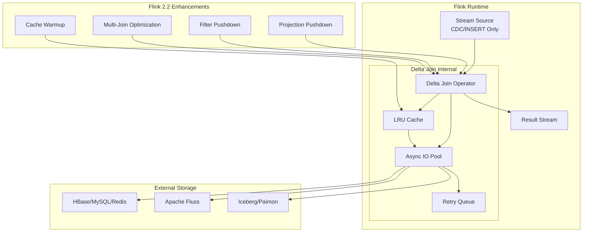
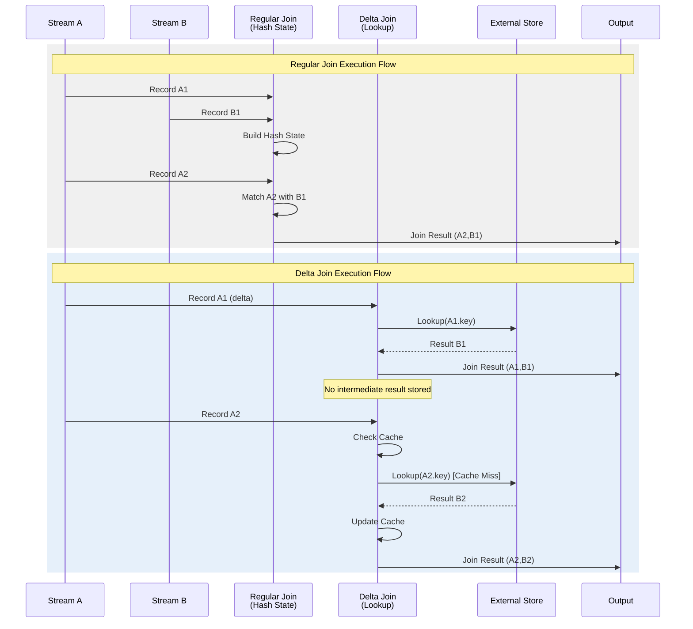
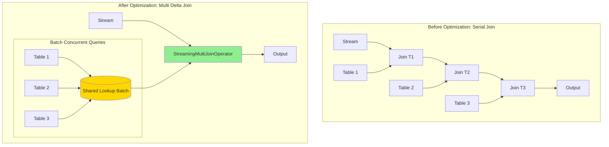
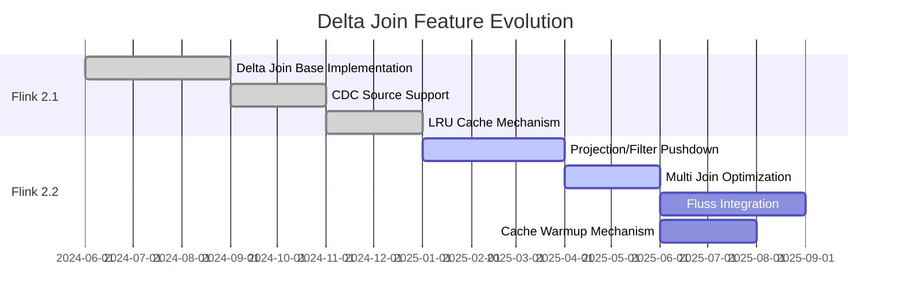

# Flink Delta Join: Large-State Stream Join Optimization

> Stage: Flink/ | Prerequisites: [Flink SQL Join Semantics](../03-api/03.02-table-sql-api/query-optimization-analysis-en.md), [Checkpoint Mechanism](./checkpoint-mechanism-deep-dive-en.md) | Formalization Level: L4

## 1. Definitions

**Def-F-02-20: Delta Join Operator**

Delta Join is an execution operator specifically optimized for large-state stream joins. Its core idea is to replace **materializing intermediate results** with **incremental lookups**.

Formal definition:

Let streams $S_1$ and $S_2$ be associated with external stores $T_1$ and $T_2$ respectively. The Delta Join operator $\mathcal{D}$ is defined as:

$$\mathcal{D}(s_1, T_2, T_1) : S_1 \times \mathcal{P}(T_2) \times \mathcal{P}(T_1) \rightarrow \{(r_1, r_2) \mid r_1 \in s_1 \land r_2 \in T_2 \land \theta(r_1, r_2)\}$$

where $s_1 \subseteq S_1$ is the input delta, and $\theta$ is the join condition. Key constraint: **$\mathcal{D}$ does not maintain materialized join intermediate state**, but performs immediate external lookups for each input record.

**Intuitive explanation**: Traditional Stream Join requires buffering states for both inputs (Hash Table or RocksDB), with state growing continuously as data arrives. Delta Join only caches one side (typically the small table or dimension table), and when records from the other stream arrive, it performs point lookups directly, reducing join state from $O(|S_1| + |S_2|)$ to $O(|T|)$.

**Def-F-02-21: Bidirectional Lookup Join Semantics**

Bidirectional Lookup Join is an extended form of Delta Join that allows both sides of the stream to complete the join via external lookups, without any intermediate state materialization.

Let external store $T$ contain all data required for both sides of the join. The bidirectional lookup semantics are defined as:

$$\text{BiLookup}(s_1, s_2, T) = \{(r_1, r_2) \mid (r_1 \in s_1 \land \text{lookup}_T(r_1) = r_2) \lor (r_2 \in s_2 \land \text{lookup}_T(r_2) = r_1)\}$$

where $\text{lookup}_T: K \rightarrow V$ is an external store query operation based on the join key. This semantics requires the external store $T$ to support efficient point lookups. Typical implementations include:

- JDBC dimension tables (MySQL, PostgreSQL)
- KV stores (HBase, Redis)
- Lakehouse tables (Iceberg, Paimon)

**Def-F-02-22: Zero Intermediate State Policy**

The Zero Intermediate State Policy is the core execution principle of Delta Join, requiring:

$$
\forall t \in \text{ExecutionTime}, \nexists M_t : M_t = \{(r_i, r_j) \mid r_i \in S_1 \land r_j \in S_2 \land \theta(r_i, r_j)\}
$$

That is, **the intermediate result set of the join is never materialized** during execution. Unlike traditional Hash Join which needs to maintain $M_t$, Delta Join executes external queries immediately upon receiving stream records and outputs results, releasing related memory after record processing is complete.

The cost of this policy is increased external store access overhead, optimized through the following mechanisms:

- **Local cache**: LRU cache for hot join keys, reducing repeated queries
- **Batch lookup**: Merging multiple point lookups into batch requests
- **Async IO**: Avoiding blocking of data stream processing

## 2. Properties

**Prop-F-02-15: State Complexity Upper Bound**

The state complexity of the Delta Join operator is $O(|T|_{cache} + |W|)$, where $|T|_{cache}$ is the external store cache size and $|W|$ is the async IO waiting queue length.

*Engineering argument*: Compared to $O(|S_1| + |S_2|)$ for traditional Sort-Merge Join or $O(|S_1| \times |S_2|_{matched})$ for Hash Join, Delta Join state is decoupled from input stream size and depends only on cache configuration and instantaneous concurrency.

**Prop-F-02-16: Exactly-Once Semantic Preservation**

Under CDC source support and idempotent write conditions for the external store, Delta Join guarantees end-to-end Exactly-Once semantics.

Proof outline:

1. Input stream is a CDC change stream (no DELETE operations, only INSERT/UPDATE AFTER)
2. Each input record triggers deterministic lookup and output
3. Downstream operators guarantee no duplicates or losses after fault recovery through the Checkpoint mechanism

**Prop-F-02-17: Cache Consistency Boundary**

Delta Join cache satisfies the **eventual consistency** model:

$$\exists \Delta t : \forall t > t_0 + \Delta t, Cache(t) \approx T(t)$$

where $\Delta t$ is the cache TTL. Strong consistency requirements need to disable caching or set TTL=0.

## 3. Relations

### 3.1 Delta Join vs Regular Join Comparison Matrix

| Dimension | Regular Stream Join | Delta Join |
|-----------|---------------------|------------|
| **State Storage** | Dual-input buffer (Hash State) | Single-side cache + external lookup |
| **State Growth** | Positively correlated with input data volume | Correlated with dimension table size / cache config |
| **Memory Requirement** | High (needs to accommodate active keys) | Low (only caches hot keys) |
| **External Dependency** | None | Depends on external store availability |
| **Latency Characteristic** | Low latency (local computation) | Depends on external query latency |
| **Applicable Scenarios** | Dual-stream join, session windows | Large table join small table, dimension table lookup |
| **Fault Tolerance Complexity** | Large checkpoint state | Small checkpoint state |

### 3.2 Architecture Mapping

```
Regular Join Execution:
┌─────────┐      ┌─────────────┐      ┌─────────┐
│ Stream A│─────▶│ Hash State A│─────▶│         │
└─────────┘      └─────────────┘      │  Join   │────▶ Output
                                      │ Operator│
┌─────────┐      ┌─────────────┐      │         │
│ Stream B│─────▶│ Hash State B│─────▶│         │
└─────────┘      └─────────────┘      └─────────┘

Delta Join Execution:
┌─────────┐                          ┌─────────┐
│ Stream  │      ┌─────────────┐     │  Delta  │     ┌─────────┐
│ (Large) │─────▶│   Lookup    │────▶│  Join   │────▶│ Output  │
└─────────┘      │  (Async IO) │     │ Operator│     └─────────┘
                 └──────┬──────┘     └────▲────┘
                        │                   │
                 ┌──────▼──────┐     ┌─────┴─────┐
                 │  External   │     │   Cache   │
                 │  Storage(T) │     │ (LRU/Bloom│
                 │             │     │  Filter)  │
                 └─────────────┘     └───────────┘
```

### 3.3 Integration with Apache Fluss

Apache Fluss is a distributed storage system optimized for real-time analytics, deeply integrated with Delta Join:

- **Storage layer optimization**: Fluss provides a Kudu-like storage format optimized for point lookups
- **Incremental pull**: Fluss supports efficient CDC change stream consumption
- **Cache synergy**: Delta Join cache and Fluss local cache form a multi-tier cache architecture

## 4. Argumentation

### 4.1 Why is Delta Join Needed?

**Problem background**: In scenarios such as real-time recommendation and user behavior analysis, it is often necessary to join large-scale user behavior streams (billions of events per day) with massive user profile/product dimension tables (tens of millions of records). Traditional solutions face:

1. **State inflation**: Hash Join state grows linearly with user/product count, checkpoint time increases linearly
2. **Memory pressure**: Large state causes frequent disk spills, performance degradation
3. **Scaling difficulty**: State redistribution takes a long time, unable to respond quickly to traffic peaks

**Delta Join solution**: Move large table state to dedicated storage, Flink only maintains small table cache, fundamentally solving the state scale problem.

### 4.2 CDC Source Constraint Analysis

Delta Join requires input sources to satisfy specific constraints:

- **Allowed**: INSERT, UPDATE AFTER (treated as new INSERT)
- **Prohibited**: DELETE, UPDATE BEFORE

Reason: Under the zero intermediate state policy, Delta Join cannot handle the semantics of "deleting existing join results". When a DELETE event arrives, it cannot locate which previously generated join results need to be retracted.

**Mitigation strategies**:

- Convert DELETE to INSERT with deletion marker, filter downstream
- Use Changelog Normalize operator to convert CDC to Retract stream

### 4.3 Cache Strategy Engineering Trade-offs

**LRU Cache**:

- Pros: Simple implementation, high hit rate
- Cons: No preloading capability, low hit rate during cold start

**Bloom Filter Assistance**:

- Add Bloom Filter before LRU to quickly determine if a key might exist in external storage
- Avoid invalid queries for non-existent keys

**Cache Consistency Strategies**:

| Strategy | Consistency Level | Applicable Scenario |
|----------|-------------------|---------------------|
| No cache | Strong consistency | Financial transactions, inventory deduction |
| TTL=60s | Eventual consistency | User profiles, product info |
| TTL=5min | Weak consistency | Content recommendation, log correlation |

## 5. Proof / Engineering Argument

### 5.1 State Complexity Proof

**Theorem**: For input stream rate $\lambda$ (records/second), join hit rate $p$, and cache size $C$, the steady-state space complexity of Delta Join is $O(C)$, compared to $O(\lambda \cdot W)$ for traditional join ($W$ is window size), decoupled from stream rate.

**Engineering argument**:

1. **State composition analysis**:
   - Cache state: $|Cache| \leq C$ (fixed upper bound)
   - Async waiting queue: $|Queue| \leq \lambda \cdot L_{async}$, where $L_{async}$ is average async latency
   - Checkpoint state: Only contains cache and incomplete async requests

2. **Comparison with traditional Join**:
   - Regular Hash Join state = all historical records in window = $\lambda \cdot W$
   - When $W$ is unbounded or long window (e.g., 7 days), state grows unboundedly
   - Delta Join state depends only on $C$, independent of $\lambda$ and $W$

3. **Scalability argument**:
   - When scaling, only $O(C)$ state needs to be migrated, completed in seconds
   - Supports dynamic parallelism adjustment without stopping the job

### 5.2 Multi Join Optimization Proof

**Prop-F-02-18: StreamingMultiJoinOperator Optimization Validity**

For N-way joins, Multi Join optimization reduces query counts from $O(N)$ to $O(1)$ through shared cache and batch lookups.

**Engineering implementation**:

```
Original Execution Plan (3-way Join):
┌─────┐    ┌──────────┐    ┌──────────┐
│ S1  │───▶│ Join S1  │───▶│ Join with│───▶ Output
└─────┘    │ with T1  │    │ T2       │
           └────┬─────┘    └────▲─────┘
           ┌────┴─────┐         │
           │   T1     │    ┌────┴─────┐
           └──────────┘    │   T2     │
                            └──────────┘

Multi Join Optimized Execution Plan:
┌─────┐    ┌─────────────────────────┐    ┌─────────┐
│ S1  │───▶│ StreamingMultiJoin      │───▶│ Output  │
└─────┘    │ (Shared Cache + Batch)  │    └─────────┘
           └──────────┬──────────────┘
           ┌──────────┼──────────┐
           ▼          ▼          ▼
        ┌────┐    ┌────┐    ┌────┐
        │ T1 │    │ T2 │    │ T3 │  (Batch Concurrent Queries)
        └────┘    └────┘    └────┘
```

Optimization effect quantification:

- Query count: Reduced from $N$ external queries to 1 batch query
- Network RTT: Reduced from $N \times RTT$ to $RTT$
- Cache hit rate: Shared cache improves hot key hit rate

## 6. Examples

### 6.1 Large-State User Behavior Join Optimization

**Scenario**: Real-time user behavior analysis, joining click stream (1 billion/day) with user profile (100 million users) and product info (10 million SKUs)

**Traditional solution problems**:

- State size: User ID index ~20GB, product ID index ~5GB
- Checkpoint: Each checkpoint takes 3-5 minutes
- Scaling: State migration needs 10+ minutes

**Delta Join optimization solution**:

```sql
-- Enable Delta Join optimization in Flink SQL
SET table.optimizer.multiple-delta-join.enabled = true;
SET table.optimizer.multi-join.enabled = true;

-- User profile dimension table (external storage: HBase)
CREATE TABLE user_profile (
    user_id STRING,
    age INT,
    gender STRING,
    city STRING,
    PRIMARY KEY (user_id) NOT ENFORCED
) WITH (
    'connector' = 'hbase-2.2',
    'table-name' = 'user_profile',
    'zookeeper.quorum' = 'zk:2181',
    'lookup.cache.max-rows' = '100000',
    'lookup.cache.ttl' = '60s'
);

-- Product info dimension table (external storage: MySQL)
CREATE TABLE product_info (
    product_id STRING,
    category STRING,
    price DECIMAL(10,2),
    PRIMARY KEY (product_id) NOT ENFORCED
) WITH (
    'connector' = 'jdbc',
    'url' = 'jdbc:mysql://mysql:3306/ecommerce',
    'table-name' = 'products',
    'lookup.cache.max-rows' = '50000',
    'lookup.cache.ttl' = '30s'
);

-- Click stream (CDC source: Kafka)
CREATE TABLE click_stream (
    user_id STRING,
    product_id STRING,
    click_time TIMESTAMP(3),
    WATERMARK FOR click_time AS click_time - INTERVAL '5' SECOND
) WITH (
    'connector' = 'kafka',
    'topic' = 'user_clicks',
    'properties.bootstrap.servers' = 'kafka:9092',
    'format' = 'debezium-json'
);

-- Delta Join query: dual-stream join converted to stream + dimension lookup
SELECT
    c.user_id,
    c.product_id,
    u.age,
    u.city,
    p.category,
    p.price,
    c.click_time
FROM click_stream c
LEFT JOIN user_profile FOR SYSTEM_TIME AS OF c.click_time AS u
    ON c.user_id = u.user_id
LEFT JOIN product_info FOR SYSTEM_TIME AS OF c.click_time AS p
    ON c.product_id = p.product_id;
```

**Optimization effects**:

- State size: Reduced to ~500MB (cache + queue)
- Checkpoint: Reduced to within 30 seconds
- Scaling: Supports second-level dynamic scaling

### 6.2 Real-Time Recommendation Scenario Delta Join Application

**Scenario**: Real-time personalized recommendation, joining user real-time behavior with item Embedding and user profile

```java
// DataStream API using Delta Join
DataStream<UserEvent> userEvents = env.fromSource(
    kafkaSource,
    WatermarkStrategy.forBoundedOutOfOrderness(Duration.ofSeconds(5)),
    "User Events"
);

// Async lookup user profile
AsyncDataStream.unorderedWait(
    userEvents,
    new AsyncUserProfileLookup(),  // Async IO lookup
    1000,                          // Timeout
    TimeUnit.MILLISECONDS,
    100                            // Concurrency
)
// Async lookup item features
.flatMap(new DeltaJoinProductLookup())
.keyBy(event -> event.userId)
.window(TumblingEventTimeWindows.of(Time.minutes(5)))
.process(new RecommendationModel());

// AsyncUserProfileLookup implementation

import org.apache.flink.streaming.api.datastream.DataStream;
import org.apache.flink.streaming.api.windowing.time.Time;

public class AsyncUserProfileLookup
    extends RichAsyncFunction<UserEvent, EnrichedEvent> {

    private transient HBaseAsyncTable table;
    private transient Cache<String, UserProfile> cache;

    @Override
    public void open(Configuration parameters) {
        // Initialize HBase connection
        table = ...;
        // Initialize Caffeine local cache
        cache = Caffeine.newBuilder()
            .maximumSize(100_000)
            .expireAfterWrite(Duration.ofSeconds(60))
            .build();
    }

    @Override
    public void asyncInvoke(UserEvent event, ResultFuture<EnrichedEvent> resultFuture) {
        String userId = event.getUserId();
        UserProfile cached = cache.getIfPresent(userId);

        if (cached != null) {
            // Cache hit
            resultFuture.complete(Collections.singletonList(
                new EnrichedEvent(event, cached)
            ));
        } else {
            // Async query HBase
            ListenableFuture<Result> future = table.get(get);
            Futures.addCallback(future, new FutureCallback<>() {
                @Override
                public void onSuccess(Result result) {
                    UserProfile profile = parseProfile(result);
                    cache.put(userId, profile);
                    resultFuture.complete(Collections.singletonList(
                        new EnrichedEvent(event, profile)
                    ));
                }

                @Override
                public void onFailure(Throwable t) {
                    resultFuture.completeExceptionally(t);
                }
            }, executor);
        }
    }
}
```

### 6.3 Configuration Parameters

| Parameter Name | Default | Description |
|----------------|---------|-------------|
| `table.optimizer.multiple-delta-join.enabled` | false | Enable multi-way Delta Join optimization |
| `table.optimizer.multi-join.enabled` | false | Enable Multi Join optimizer rule |
| `table.exec.async-lookup.buffer-capacity` | 100 | Async lookup buffer size |
| `table.exec.async-lookup.timeout` | 300s | Async lookup timeout |
| `lookup.cache.max-rows` | None | Lookup cache max rows |
| `lookup.cache.ttl` | None | Cache TTL, no caching if not configured |
| `lookup.max-retries` | 3 | Lookup failure retry count |

## 7. Visualizations

### 7.1 Delta Join Architecture Hierarchy



### 7.2 Regular Join vs Delta Join Execution Timing Comparison



### 7.3 Multi Join Optimization Execution Tree



### 7.4 Flink 2.1/2.2 Delta Join Evolution Roadmap



## 8. Flink 2.2 Enhancement Features

### 8.1 Projection and Filter Operation Support

Flink 2.2 supports pushing projection and filter conditions down to Delta Join's external queries:

```sql
-- Before optimization: full-field query then filter
SELECT u.user_id, u.age, u.city  -- Only 3 fields needed
FROM clicks c
JOIN users u ON c.user_id = u.user_id;  -- Queries all fields

-- After optimization: projection pushdown, only query necessary fields
-- External query becomes: SELECT user_id, age, city FROM users WHERE user_id = ?
```

**Performance benefit**: Reduces external store IO volume, network transmission reduced by 50-80%.

### 8.2 Cache Optimization

Flink 2.2 introduces a multi-tier cache architecture:

1. **L1 cache**: Flink TaskManager local LRU cache (millisecond-level access)
2. **L2 cache**: Apache Fluss local cache (same-datacenter millisecond-level)
3. **L3 storage**: External database (cross-region 10-100ms)

### 8.3 Apache Fluss Integration

Apache Fluss is a distributed storage optimized for real-time analytics, with integration advantages for Delta Join:

- **Columnar storage**: Efficient projection queries
- **Incremental views**: Supports materialized view incremental updates
- **Local cache**: Fluss TabletServer local cache accelerates point lookups

```sql
-- Fluss integration example
CREATE TABLE fluss_users (
    user_id STRING PRIMARY KEY NOT ENFORCED,
    profile ROW<...>
) WITH (
    'connector' = 'fluss',
    'bootstrap.servers' = 'fluss-cluster:9123',
    'lookup.cache.ttl' = '10s'  -- Leverage Fluss local cache
);
```

## 9. References

---

*Document version: v1.0 | Creation date: 2026-04-20*
