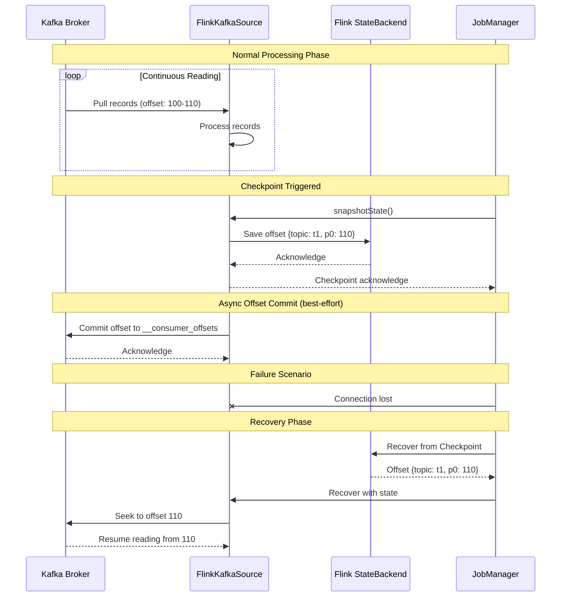
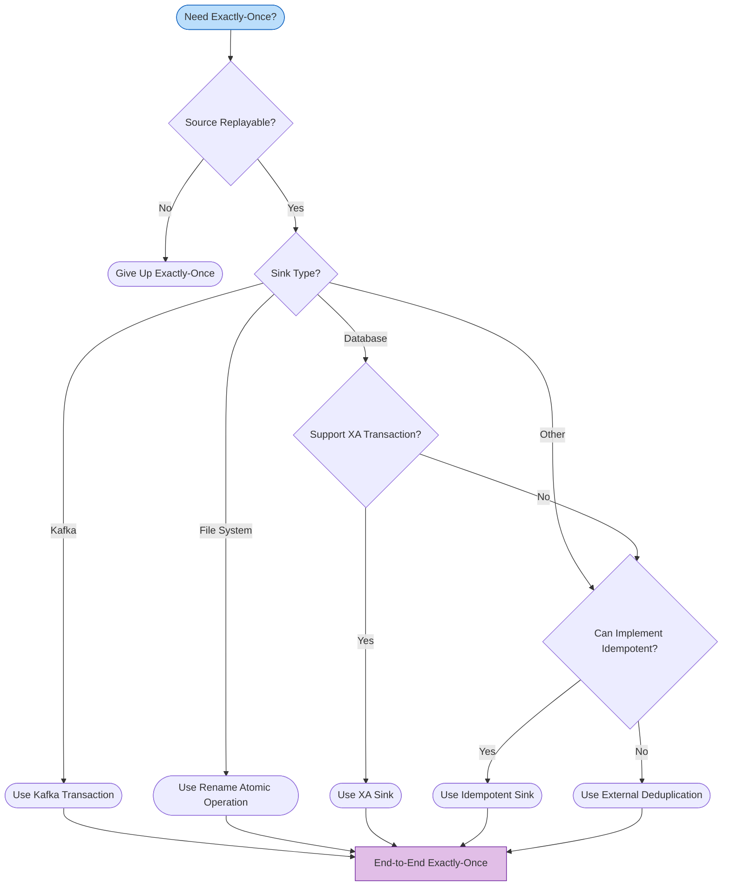
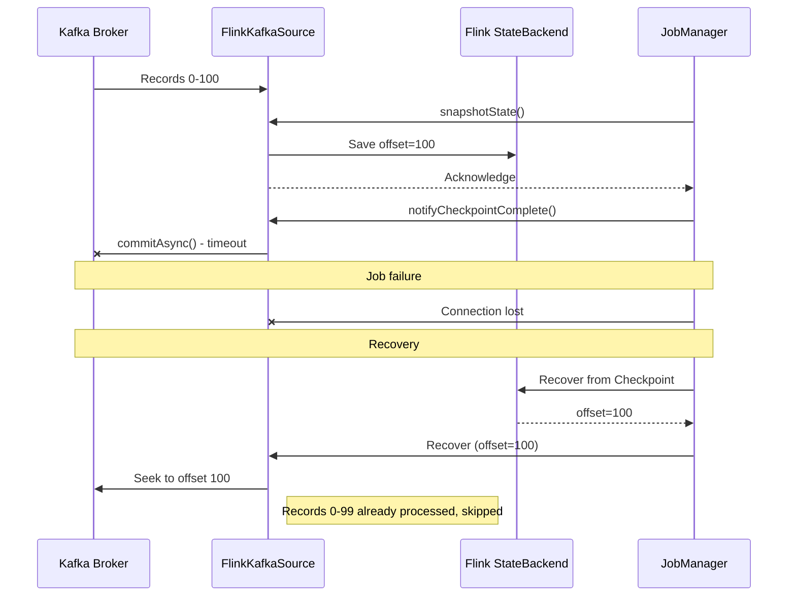
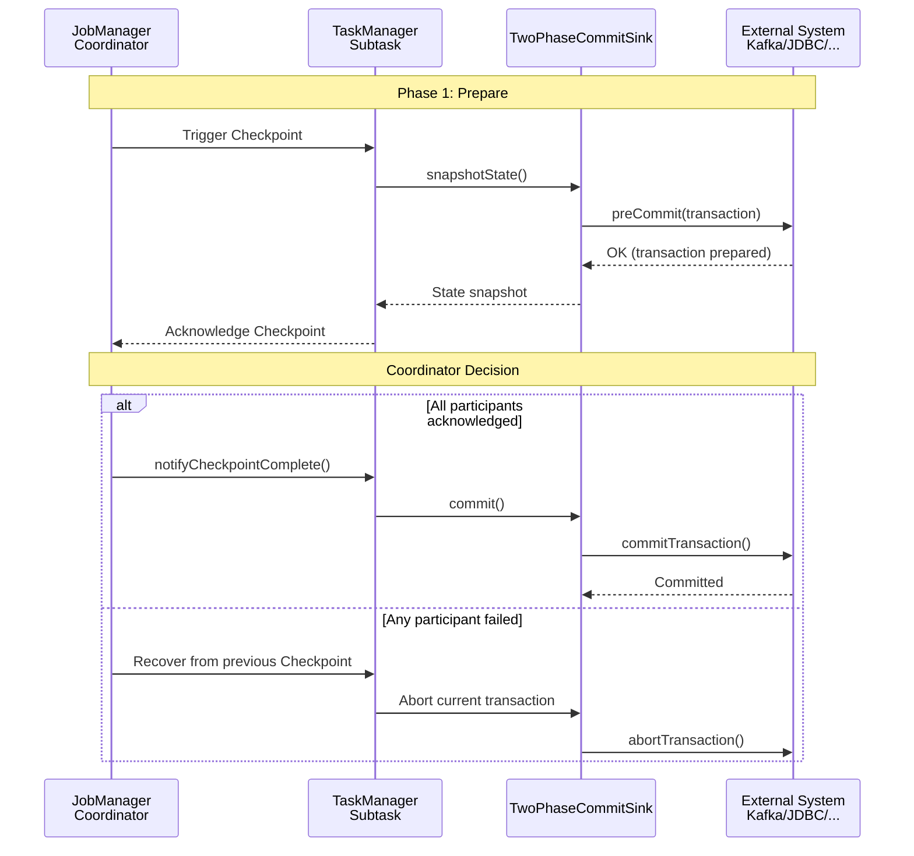
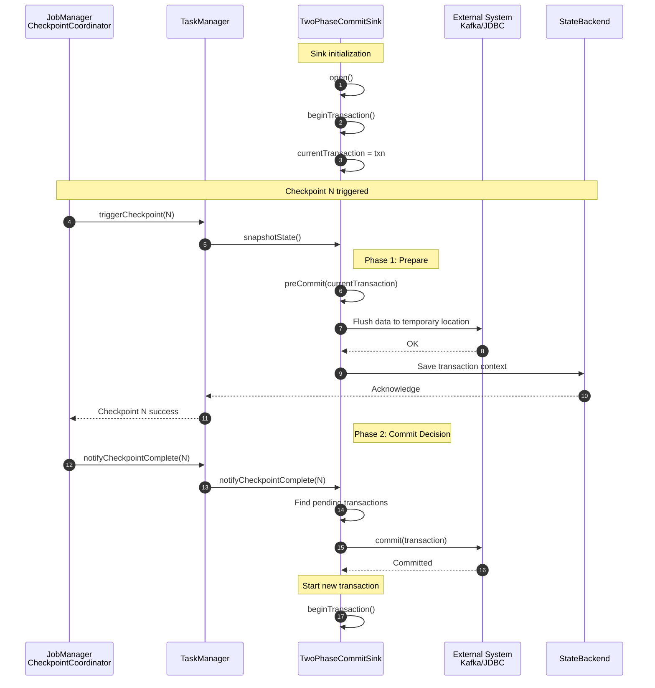

# End-to-End Exactly-Once Guarantees

> **Stage**: Flink | **Prerequisites**: [Related Documents] | **Formalization Level**: L3

> **Flink Version**: 1.17-1.19 | **Status**: Production Ready | **Difficulty**: L4 (Advanced)
>
> End-to-end Exactly-Once is the most core correctness guarantee of stream processing systems, involving the collaborative work of three pillars: replayable Source, consistent Checkpoint, and transactional Sink.

---

## Table of Contents

- [End-to-End Exactly-Once Guarantees](#end-to-end-exactly-once-guarantees)
  - [Table of Contents](#table-of-contents)
  - [1. Definitions](#1-definitions)
    - [1.1 Exactly-Once Semantic Definition](#11-exactly-once-semantic-definition)
    - [1.2 End-to-End Exactly-Once Three Pillars](#12-end-to-end-exactly-once-three-pillars)
    - [1.3 Consistency Level Comparison](#13-consistency-level-comparison)
  - [2. Properties](#2-properties)
    - [2.1 Replayable Source Definition](#21-replayable-source-definition)
    - [2.2 Kafka Source Offset Management](#22-kafka-source-offset-management)
    - [2.3 Other Source System Implementations](#23-other-source-system-implementations)
  - [3. Relations](#3-relations)
    - [Connector Exactly-Once Support Matrix](#connector-exactly-once-support-matrix)
  - [4. Argumentation](#4-argumentation)
    - [4.1 Source Commit Failure](#41-source-commit-failure)
    - [4.2 Checkpoint Failure](#42-checkpoint-failure)
    - [4.3 Sink Pre-commit/Commit Failure](#43-sink-pre-commitcommit-failure)
    - [4.4 Network Partition and Transaction Suspension](#44-network-partition-and-transaction-suspension)
  - [5. Proof / Engineering Argument](#5-proof--engineering-argument)
    - [5.1 Two-Phase Commit Protocol (2PC)](#51-two-phase-commit-protocol-2pc)
    - [5.2 Kafka Transactional Sink](#52-kafka-transactional-sink)
      - [5.2.1 Legacy Kafka Producer (Before Flink 1.14)](#521-legacy-kafka-producer-before-flink-114)
      - [5.2.2 New Kafka Sink (Flink 1.15+ Recommended)](#522-new-kafka-sink-flink-115-recommended)
      - [5.2.3 Kafka Exactly-Once Complete Configuration Template](#523-kafka-exactly-once-complete-configuration-template)
      - [5.2.4 Kafka Exactly-Once Key Behaviors](#524-kafka-exactly-once-key-behaviors)
    - [5.3 JDBC XA Transaction Sink](#53-jdbc-xa-transaction-sink)
    - [5.4 Idempotent Sink Implementation](#54-idempotent-sink-implementation)
      - [5.4.1 Idempotency Definition and Principle](#541-idempotency-definition-and-principle)
      - [5.4.2 File System Idempotent Write](#542-file-system-idempotent-write)
      - [5.4.3 Database UPSERT Mode](#543-database-upsert-mode)
  - [6. Examples](#6-examples)
    - [6.1 Flink Core Configuration](#61-flink-core-configuration)
    - [6.2 Kafka Exactly-Once Complete Configuration](#62-kafka-exactly-once-complete-configuration)
    - [6.3 End-to-End Exactly-Once Job Complete Example](#63-end-to-end-exactly-once-job-complete-example)
  - [7. Visualizations](#7-visualizations)
    - [7.1 TwoPhaseCommitSinkFunction Core Class Architecture](#71-twophasecommitsinkfunction-core-class-architecture)
      - [Transaction Lifecycle Methods](#transaction-lifecycle-methods)
    - [7.2 TwoPhaseCommitSinkFunction Transaction Lifecycle](#72-twophasecommitsinkfunction-transaction-lifecycle)
      - [snapshotState Method Details](#snapshotstate-method-details)
      - [notifyCheckpointComplete Method Details](#notifycheckpointcomplete-method-details)
    - [7.3 Exactly-Once Decision Tree](#73-exactly-once-decision-tree)
  - [8. References](#8-references)

---

## 1. Definitions

### 1.1 Exactly-Once Semantic Definition

**Definition 1.1 (Exactly-Once Semantics)**:

For each input record $r$ in a stream processing application, the result output to external systems reflects $r$'s processing effect exactly once[^1]:

$$
\forall r \in \text{Input}. \; |\{ e \in \text{Output} \mid \text{caused\_by}(e, r) \}| = 1
$$

Where $\text{caused\_by}(e, r)$ indicates that output element $e$'s generation is causally dependent on record $r$'s processing.

**Key Insight**: Exactly-Once targets **side effects** (external system state changes), not the number of times a record is passed internally within Flink. In distributed stream processing, fault recovery inevitably causes records to be reprocessed; Exactly-Once guarantees that "reprocessing does not produce new side effects."

### 1.2 End-to-End Exactly-Once Three Pillars

End-to-end Exactly-Once is not an isolated mechanism within Flink, but the result of collaboration among Source, engine, and Sink[^2]:

```
┌─────────────────────────────────────────────────────────────────────────────────┐
│                    End-to-End Exactly-Once Guarantee Architecture              │
├─────────────────────────────────────────────────────────────────────────────────┤
│  ┌─────────────┐         ┌─────────────┐         ┌─────────────┐               │
│  │   Source    │────────▶│    Flink    │────────▶│    Sink     │               │
│  │   System    │         │   Engine    │         │   System    │               │
│  └──────┬──────┘         └──────┬──────┘         └──────┬──────┘               │
│         ▼                       ▼                       ▼                      │
│  ┌─────────────┐         ┌─────────────┐         ┌─────────────┐               │
│  │  Replayable │         │  Distributed│         │  Transaction│               │
│  │  Guarantee  │         │  Snapshot   │         │  / Idempotent│              │
│  │  Offset/    │         │  Checkpoint │         │  Two-Phase  │               │
│  │  Position   │         │  Barrier Align│       │  Commit     │               │
│  └─────────────┘         └─────────────┘         └─────────────┘               │
│                                                                                 │
│  Formal: End-to-End-EO = Replayable(Source) ∧ ConsistentCheckpoint(Flink)     │
│                         ∧ AtomicOutput(Sink)                                   │
└─────────────────────────────────────────────────────────────────────────────────┘
```

**Three Pillars Detailed**:

| Pillar | Role | Implementation Mechanism | Fault Recovery Behavior |
|--------|------|-------------------------|------------------------|
| **Replayable Source** | Prevent data loss | Offset persistence to Checkpoint | Re-read from last Checkpoint offset |
| **Checkpoint Consistency** | Guarantee state consistency | Chandy-Lamport distributed snapshot | Recover to globally consistent state |
| **Transactional Sink** | Prevent duplicate output | 2PC / Idempotent write | Uncommitted transactions rolled back; committed transactions idempotent |

### 1.3 Consistency Level Comparison

| Level | Definition | Data Loss | Data Duplicate | Applicable Scenario |
|-------|-----------|-----------|---------------|---------------------|
| **At-Most-Once** | Message processed 0 or 1 times | Possible | None | Log sampling, real-time monitoring |
| **At-Least-Once** | Message processed ≥1 times | None | Possible | Log aggregation, metrics collection |
| **Exactly-Once** | Message processed exactly 1 time | None | None | Financial transactions, inventory management |

---

## 2. Properties

### 2.1 Replayable Source Definition

**Definition 2.1 (Replayable Source)**:

A Source is replayable if and only if after failure, the same data sequence can be re-read from the persisted position marker (offset/position)[^3]:

$$
\text{Replayable}(Src) \iff \forall p \in \text{Positions}. \; \exists! \text{Sequence}(p)
$$

### 2.2 Kafka Source Offset Management

Kafka Source Exactly-Once configuration key parameters[^4]:

```java
import java.util.Properties;
import org.apache.flink.api.common.serialization.SimpleStringSchema;
import org.apache.flink.connector.kafka.source.KafkaSource;

public class Example {
    public static void main(String[] args) throws Exception {
        KafkaSource<String> source = KafkaSource.<String>builder()
            .setBootstrapServers("kafka:9092")
            .setTopics("input-topic")
            .setGroupId("flink-eo-consumer")
            .setProperty("isolation.level", "read_committed")  // key: only read committed
            .setProperty("enable.auto.commit", "false")         // Flink manages offsets
            .setStartingOffsets(OffsetsInitializer.earliest())
            .setValueOnlyDeserializer(new SimpleStringSchema())
            .build();
    }
}
```

**Offset Management Flow**:



**Key Design**: Flink uses offsets saved in StateBackend for recovery, not Kafka's `__consumer_offsets`. Even if async offset commit fails, it does not cause data loss or duplication.

### 2.3 Other Source System Implementations

| Source System | Position Marker | Replayable Support | Configuration Points |
|--------------|----------------|-------------------|---------------------|
| **Apache Pulsar** | Cursor (ledgerId, entryId) | ✅ Supported | `SubscriptionType.Failover`, enable broker-level dedup |
| **AWS Kinesis** | Sequence Number | ✅ Supported | Shard-based sequence number tracking |
| **RabbitMQ** | Delivery Tag | ⚠️ Limited | `autoAck=false`, manual acknowledgment |
| **File System** | File Position | ✅ Supported | File offset persistence |

---

## 3. Relations

### Connector Exactly-Once Support Matrix

| Connector Type | Exactly-Once Support | Implementation Strategy | Configuration Points | Applicable Scenario |
|:--------------|:--------------------:|:------------------------|:---------------------|:--------------------|
| **Apache Kafka** | ✅ Native | Transactional Producer (2PC) | `transactional.id`, `isolation.level=read_committed` | Stream processing pipeline |
| **Apache Pulsar** | ✅ Native | Cursor management + Broker dedup | `SubscriptionType.Failover`, enable dedup | Multi-tenant message queue |
| **AWS Kinesis** | ⚠️ Partial | Sequence number tracking | Shard-based sequence number Checkpoint | Cloud-native stream processing |
| **RabbitMQ** | ⚠️ Partial | Manual ACK | `autoAck=false`, manual acknowledgment | Traditional message queue |
| **JDBC (PostgreSQL)** | ✅ Full | XA transaction (2PC) | `max_prepared_transactions > 0`, UPSERT | Relational database |
| **JDBC (MySQL)** | ✅ Full | XA transaction (2PC) | InnoDB engine, `XA RECOVER` | Relational database |
| **Elasticsearch** | ⚠️ Partial | Version control + Idempotent ID | `version_type=external` | Search engine |
| **HDFS** | ✅ Full | Atomic rename | Temp file → final file atomic move | Big data storage |
| **Amazon S3** | ✅ Full | Multipart upload + Versioning | Enable Bucket Versioning | Cloud object storage |
| **Redis** | ⚠️ Partial | Lua script + Checkpoint ID | Lua conditional update, Checkpoint ID dedup | Cache/KV storage |
| **Cassandra** | ⚠️ Partial | Idempotent write | Primary key dedup, write consistency level | Distributed database |

**Strategy Selection Decision Tree**:



---

## 4. Argumentation

### 4.1 Source Commit Failure

**Scenario**: `notifyCheckpointComplete()` fails to commit offset to Kafka



**Key**: Source commit failure does not violate Exactly-Once, because Flink uses offsets from StateBackend for recovery, not Kafka-committed offsets.

### 4.2 Checkpoint Failure

| Failure Type | Cause | Recovery Action |
|-------------|-------|----------------|
| **Synchronous phase failure** | State snapshot exception | Abort Checkpoint, continue processing |
| **Asynchronous phase failure** | State upload failure | Abort Checkpoint, retry next time |
| **Timeout** | Checkpoint duration exceeds limit | Abort, may indicate backpressure |
| **Alignment timeout** | Barrier alignment timeout | Task failure, trigger recovery |

### 4.3 Sink Pre-commit/Commit Failure

**Pre-commit failure**: Exception propagates to CheckpointCoordinator, Checkpoint marked FAILED, all Sinks abort transactions.

**Commit failure (Split-Brain scenario)**:

- Kafka Sink: Transaction timeout, Broker automatically aborts expired transactions
- JDBC XA Sink: Prepared transactions remain in DB, heuristic decision needed during recovery

### 4.4 Network Partition and Transaction Suspension

**Transaction Fencing**: Kafka prevents zombie task writes through epoch mechanism. After new producer registers, transactions from old epoch are automatically aborted, ensuring Exactly-Once.

---

## 5. Proof / Engineering Argument

### 5.1 Two-Phase Commit Protocol (2PC)

Flink implements the two-phase commit protocol through `TwoPhaseCommitSinkFunction`[^7], binding Checkpoint with external system transactions:

**Definition 5.1 (Flink 2PC Protocol)**:

$$
\text{Flink-2PC} = \langle \text{Coordinator}, \text{Participants}, \text{Prepare}, \text{Commit}, \text{Abort} \rangle
$$

- **Coordinator**: Flink JobManager (CheckpointCoordinator)
- **Participants**: All TwoPhaseCommitSinkFunction instances
- **Prepare**: `snapshotState()` - persist pre-commit state
- **Commit**: `notifyCheckpointComplete()` - commit external transaction
- **Abort**: `notifyCheckpointAborted()` or recover from previous Checkpoint

**2PC Sequence Diagram**:



### 5.2 Kafka Transactional Sink

#### 5.2.1 Legacy Kafka Producer (Before Flink 1.14)

```java
Properties properties = new Properties();
properties.put("bootstrap.servers", "localhost:9092");
properties.put("transactional.id", "flink-job-" + subtaskIndex);  // unique transactional.id
properties.put("enable.idempotence", "true");
properties.put("acks", "all");
properties.put("retries", Integer.MAX_VALUE);

FlinkKafkaProducer<String> sink = new FlinkKafkaProducer<>(
    "output-topic", new SimpleStringSchema(), properties,
    FlinkKafkaProducer.Semantic.EXACTLY_ONCE  // enable 2PC
);
```

#### 5.2.2 New Kafka Sink (Flink 1.15+ Recommended)

```java
import org.apache.flink.api.common.eventtime.WatermarkStrategy;
import org.apache.flink.api.common.serialization.SimpleStringSchema;
import org.apache.flink.connector.kafka.sink.DeliveryGuarantee;
import org.apache.flink.connector.kafka.sink.KafkaRecordSerializationSchema;
import org.apache.flink.connector.kafka.sink.KafkaSink;
import org.apache.flink.connector.kafka.source.KafkaSource;
import org.apache.flink.streaming.api.environment.StreamExecutionEnvironment;

public class Example {
    public static void main(String[] args) throws Exception {
        StreamExecutionEnvironment env = StreamExecutionEnvironment.getExecutionEnvironment();

        // Source configuration - only read committed transactions
        KafkaSource<String> source = KafkaSource.<String>builder()
            .setBootstrapServers("kafka:9092")
            .setTopics("input-topic")
            .setGroupId("flink-eo-consumer")
            .setProperty("isolation.level", "read_committed")
            .setProperty("enable.auto.commit", "false")
            .setStartingOffsets(OffsetsInitializer.earliest())
            .setValueOnlyDeserializer(new SimpleStringSchema())
            .build();

        // Sink configuration - Exactly-Once transactional write
        KafkaSink<String> sink = KafkaSink.<String>builder()
            .setBootstrapServers("kafka:9092")
            .setRecordSerializer(KafkaRecordSerializationSchema.builder()
                .setTopic("output-topic")
                .setValueSerializationSchema(new SimpleStringSchema())
                .build())
            .setDeliveryGuarantee(DeliveryGuarantee.EXACTLY_ONCE)
            .setTransactionalIdPrefix("flink-processor")
            .build();

        env.fromSource(source, WatermarkStrategy.noWatermarks(), "Kafka Source")
            .map(new ProcessingFunction())
            .sinkTo(sink);
    }
}
```

#### 5.2.3 Kafka Exactly-Once Complete Configuration Template

**flink-conf.yaml key configuration**:

```yaml
# Checkpoint configuration
execution.checkpointing.mode: EXACTLY_ONCE
execution.checkpointing.interval: 60s
execution.checkpointing.timeout: 10m
execution.checkpointing.max-concurrent-checkpoints: 1

# Restart strategy
restart-strategy: fixed-delay
restart-strategy.fixed-delay.attempts: 10
restart-strategy.fixed-delay.delay: 10s
```

**Kafka cluster configuration requirements**:

```properties
# broker.properties
# Transaction-related configuration
transaction.state.log.replication.factor=3
transaction.state.log.min.isr=2
transaction.max.timeout.ms=900000  # match Flink Checkpoint timeout

# Idempotency configuration
enable.idempotence=true
```

**Transaction Fencing**: Kafka prevents zombie task writes through epoch mechanism. After new producer registers, transactions from old epoch are automatically aborted.

#### 5.2.4 Kafka Exactly-Once Key Behaviors

| Configuration Item | Role | Notes |
|-------------------|------|-------|
| `isolation.level=read_committed` | Consumer only reads committed transaction messages | Source must configure, otherwise may read uncommitted data |
| `transactional.id` | Producer transaction unique identifier | Must be globally unique, typically includes subtaskIndex |
| `DeliveryGuarantee.EXACTLY_ONCE` | Enable transactional write | Bound with Checkpoint mechanism |
| `transaction.max.timeout.ms` | Kafka transaction maximum timeout | Must be greater than Flink Checkpoint timeout |

**Idempotency guarantee**: Even if transaction timeout retries, Kafka ensures the same message is not duplicated through `producer.id` + `epoch` mechanism.

### 5.3 JDBC XA Transaction Sink

JDBC XA Sink implements Exactly-Once[^9]:

```java
JdbcXaSinkFunction<Row> xaSink = new JdbcXaSinkFunction<>(
    "INSERT INTO results (id, value, ts) VALUES (?, ?, ?) " +
    "ON CONFLICT (id) DO UPDATE SET value = EXCLUDED.value",
    (ps, row) -> {
        ps.setString(1, row.getId());
        ps.setString(2, row.getValue());
        ps.setTimestamp(3, Timestamp.valueOf(row.getTimestamp()));
    },
    xaDataSource,
    XidGenerator.semanticXidGenerator(jobName, subtaskIndex)
);
```

---

### 5.4 Idempotent Sink Implementation

#### 5.4.1 Idempotency Definition and Principle

**Definition 5.1 (Idempotency)**:

Operation $f$ is idempotent if and only if multiple applications produce the same effect as a single application[^10]:

$$
\forall x. \; f(f(x)) = f(x)
$$

**Idempotency vs Transactionality**:

| Feature | Transactional Sink | Idempotent Sink |
|---------|-------------------|-----------------|
| Mechanism | 2PC protocol | Primary key/version dedup |
| Latency | Higher (two phases) | Lower (direct write) |
| External System Requirement | Support transactions | Support UPSERT/version control |
| Applicable Systems | Kafka, JDBC (XA) | HBase, Cassandra, File System |

#### 5.4.2 File System Idempotent Write

Use atomic rename to implement file system Exactly-Once:

```java
@Override
protected void preCommit(String pendingFile) throws Exception {
    // Rename from .inprogress to pending (HDFS atomic operation)
    fs.rename(inprogressPath, pendingPath);
}

@Override
protected void commit(String pendingFile) {
    // Atomically move from pending to final location
    fs.rename(pendingPath, finalPath);
}
```

#### 5.4.3 Database UPSERT Mode

```sql
-- PostgreSQL: ON CONFLICT DO UPDATE
INSERT INTO results (id, value, processed_at) VALUES (?, ?, ?)
ON CONFLICT (id) DO UPDATE SET
    value = EXCLUDED.value,
    processed_at = EXCLUDED.processed_at;

-- MySQL: INSERT ... ON DUPLICATE KEY UPDATE
INSERT INTO results (id, value, processed_at) VALUES (?, ?, ?)
ON DUPLICATE KEY UPDATE
    value = VALUES(value),
    processed_at = VALUES(processed_at);
```

---

## 6. Examples

### 6.1 Flink Core Configuration

```yaml
# Checkpoint configuration
execution.checkpointing.mode: EXACTLY_ONCE
execution.checkpointing.interval: 60s
execution.checkpointing.min-pause-between-checkpoints: 30s
execution.checkpointing.timeout: 10m
execution.checkpointing.max-concurrent-checkpoints: 1
execution.checkpointing.externalized-checkpoint-retention: RETAIN_ON_CANCELLATION

# State backend configuration
state.backend: rocksdb
state.backend.incremental: true
state.backend.rocksdb.memory.managed: true
state.checkpoints.dir: s3://my-bucket/flink-checkpoints

# Restart strategy
restart-strategy: fixed-delay
restart-strategy.fixed-delay.attempts: 10
restart-strategy.fixed-delay.delay: 10s
```

### 6.2 Kafka Exactly-Once Complete Configuration

**Production-grade Kafka Source configuration**:

```java
import org.apache.flink.api.common.serialization.SimpleStringSchema;
import org.apache.flink.connector.kafka.source.KafkaSource;

public class Example {
    public static KafkaSource<String> createKafkaSource(String bootstrapServers, String topic, String groupId) {
        return KafkaSource.<String>builder()
            .setBootstrapServers(bootstrapServers)
            .setTopics(topic)
            .setGroupId(groupId)
            .setProperty("isolation.level", "read_committed")
            .setProperty("enable.auto.commit", "false")
            .setProperty("auto.offset.reset", "earliest")
            .setStartingOffsets(OffsetsInitializer.committedOffsets(OffsetResetStrategy.EARLIEST))
            .setValueOnlyDeserializer(new SimpleStringSchema())
            .build();
    }
}
```

**Production-grade Kafka Sink configuration**:

```java
import org.apache.flink.api.common.serialization.SimpleStringSchema;
import org.apache.flink.connector.kafka.sink.DeliveryGuarantee;
import org.apache.flink.connector.kafka.sink.KafkaRecordSerializationSchema;
import org.apache.flink.connector.kafka.sink.KafkaSink;

public class Example {
    public static KafkaSink<String> createKafkaSink(String bootstrapServers, String topic, String transactionalIdPrefix) {
        return KafkaSink.<String>builder()
            .setBootstrapServers(bootstrapServers)
            .setRecordSerializer(KafkaRecordSerializationSchema.builder()
                .setTopic(topic)
                .setValueSerializationSchema(new SimpleStringSchema())
                .build())
            .setDeliveryGuarantee(DeliveryGuarantee.EXACTLY_ONCE)
            .setTransactionalIdPrefix(transactionalIdPrefix)
            .build();
    }
}
```

### 6.3 End-to-End Exactly-Once Job Complete Example

```java
import org.apache.flink.streaming.api.environment.StreamExecutionEnvironment;
import org.apache.flink.streaming.api.CheckpointingMode;
import org.apache.flink.streaming.api.windowing.time.Time;

public class KafkaExactlyOnceJob {

    public static void main(String[] args) throws Exception {
        StreamExecutionEnvironment env = StreamExecutionEnvironment.getExecutionEnvironment();

        // 1. Enable Checkpoint (required)
        env.enableCheckpointing(60000);
        env.getCheckpointConfig().setCheckpointingMode(CheckpointingMode.EXACTLY_ONCE);
        env.getCheckpointConfig().setCheckpointTimeout(600000);
        env.getCheckpointConfig().setMinPauseBetweenCheckpoints(30000);

        // 2. Configure state backend
        env.setStateBackend(new EmbeddedRocksDBStateBackend(true));
        env.getCheckpointConfig().setCheckpointStorage("hdfs:///flink/checkpoints");

        // 3. Configure restart strategy
        env.setRestartStrategy(RestartStrategies.fixedDelayRestart(
            10, Time.seconds(10)
        ));

        // 4. Kafka Source - Exactly-Once
        KafkaSource<String> source = KafkaSource.<String>builder()
            .setBootstrapServers("kafka:9092")
            .setTopics("input-topic")
            .setGroupId("flink-eo-consumer")
            .setProperty("isolation.level", "read_committed")
            .setProperty("enable.auto.commit", "false")
            .setStartingOffsets(OffsetsInitializer.committedOffsets())
            .setValueOnlyDeserializer(new SimpleStringSchema())
            .build();

        // 5. Kafka Sink - Exactly-Once
        KafkaSink<String> sink = KafkaSink.<String>builder()
            .setBootstrapServers("kafka:9092")
            .setRecordSerializer(KafkaRecordSerializationSchema.builder()
                .setTopic("output-topic")
                .setValueSerializationSchema(new SimpleStringSchema())
                .build())
            .setDeliveryGuarantee(DeliveryGuarantee.EXACTLY_ONCE)
            .setTransactionalIdPrefix("flink-job-" + System.currentTimeMillis())
            .build();

        // 6. Build pipeline
        env.fromSource(source, WatermarkStrategy.noWatermarks(), "Kafka Source")
            .map(new JsonParser())
            .keyBy(Event::getUserId)
            .window(TumblingProcessingTimeWindows.of(Time.minutes(1)))
            .aggregate(new CountAggregate())
            .map(Object::toString)
            .sinkTo(sink);

        env.execute("Kafka Exactly-Once Job");
    }
}
```

**Key Configuration Verification**:

```bash
#!/bin/bash
echo "=== Flink Exactly-Once Pre-Deployment Verification ==="
grep -q "execution.checkpointing.mode: EXACTLY_ONCE" flink-conf.yaml && \
    echo "✓ Checkpoint mode correct" || echo "✗ Checkpoint mode error"
grep -q "isolation.level=read_committed" kafka.properties && \
    echo "✓ Kafka isolation level correct" || echo "✗ Kafka isolation level error"
echo "Verification complete!"
```

---

## 7. Visualizations

### 7.1 TwoPhaseCommitSinkFunction Core Class Architecture

**Source Location**: `flink-streaming-java/src/main/java/org/apache/flink/streaming/api/functions/sink/TwoPhaseCommitSinkFunction.java`

```java
/**
 * Abstract base class for two-phase commit sinks.
 * Implements coordination between Flink and external system transactions.
 *
 * Type Parameters:
 *   IN - Input data type
 *   TXN - Transaction context type
 *   CONTEXT - Transaction context holder type
 */
public abstract class TwoPhaseCommitSinkFunction<IN, TXN, CONTEXT>
        extends RichSinkFunction<IN>
        implements CheckpointedFunction, CheckpointListener {

    // Current in-progress transaction
    private transient TransactionHolder<TXN> currentTransaction;

    // Pending commit transaction queue (waiting for Checkpoint confirmation)
    private transient List<TransactionHolder<TXN>> pendingCommitTransactions;

    // Transaction context Serializer (for Checkpoint)
    private final TypeSerializer<CONTEXT> contextSerializer;

    // Transaction Serializer
    private final TypeSerializer<TXN> transactionSerializer;

    public TwoPhaseCommitSinkFunction(
            TypeSerializer<CONTEXT> contextSerializer,
            TypeSerializer<TXN> transactionSerializer) {
        this.contextSerializer = checkNotNull(contextSerializer);
        this.transactionSerializer = checkNotNull(transactionSerializer);
    }
}
```

#### Transaction Lifecycle Methods

```java
// [Pseudocode snippet — not directly runnable] Core logic only

/**
 * Start new transaction
 * Called in the following scenarios:
 * 1. During Sink initialization
 * 2. After each Checkpoint completion (start next round transaction)
 */
protected abstract TXN beginTransaction() throws Exception;

/**
 * Pre-commit phase (Prepare Phase)
 * Persist data to temporary location, but not yet visible
 */
protected abstract void preCommit(TXN transaction) throws Exception;

/**
 * Formal commit phase (Commit Phase)
 * Called after receiving Checkpoint success notification
 */
protected abstract void commit(TXN transaction) throws Exception;

/**
 * Abort transaction
 * Called when Checkpoint fails or job recovers
 */
protected abstract void abort(TXN transaction) throws Exception;
```

---

### 7.2 TwoPhaseCommitSinkFunction Transaction Lifecycle



#### snapshotState Method Details

```java
// [Pseudocode snippet — not directly runnable] Core logic only
/**
 * Called during Checkpoint (Phase 1: Prepare)
 */
@Override
public void snapshotState(FunctionSnapshotContext context) throws Exception {
    long checkpointId = context.getCheckpointId();

    // 1. Pre-commit current transaction
    preCommit(currentTransaction.handle);

    // 2. Add current transaction to pending commit queue
    pendingCommitTransactions.add(currentTransaction);

    // 3. Clear and save transaction context to StateBackend
    state.clear();
    state.add(new State<>(
        contextSerializer,
        currentTransaction.context,
        pendingCommitTransactions,
        userContext
    ));

    // 4. Start new transaction (for post-Checkpoint writes)
    currentTransaction = beginTransactionInternal();
}
```

#### notifyCheckpointComplete Method Details

```java
// [Pseudocode snippet — not directly runnable] Core logic only
/**
 * Called after Checkpoint success confirmation (Phase 2: Commit)
 */
@Override
public void notifyCheckpointComplete(long checkpointId) throws Exception {
    Iterator<TransactionHolder<TXN>> iterator = pendingCommitTransactions.iterator();

    while (iterator.hasNext()) {
        TransactionHolder<TXN> transaction = iterator.next();

        // Only commit transactions with checkpointId <= current checkpointId
        if (transaction.checkpointId <= checkpointId) {
            try {
                commit(transaction.handle);
                iterator.remove();
            } catch (Exception e) {
                throw new FlinkRuntimeException(
                    "Committing transaction failed", e);
            }
        }
    }
}
```

### 7.3 Exactly-Once Decision Tree


---

## 8. References

[^1]: Apache Flink Documentation. "Exactly-once Semantics". <https://nightlies.apache.org/flink/flink-docs-stable/docs/dev/datastream/fault-tolerance/exactly_once/>

[^2]: Carbone, P., et al. (2017). "State Management in Apache Flink: Consistent Stateful Distributed Stream Processing". *Proceedings of the VLDB Endowment*.

[^3]: Chandy, K.M., & Lamport, L. (1985). "Distributed Snapshots: Determining Global States of Distributed Systems". *ACM Transactions on Computer Systems*.

[^4]: Apache Kafka Documentation. "Transactions in Kafka". <https://kafka.apache.org/documentation/#transactions>


[^7]: Flink Documentation. "Two-Phase Commit Sink Functions". <https://nightlies.apache.org/flink/flink-docs-stable/api/java/org/apache/flink/streaming/api/functions/sink/TwoPhaseCommitSinkFunction.html>


[^9]: Flink Documentation. "JdbcXaSinkFunction". <https://nightlies.apache.org/flink/flink-docs-stable/api/java/org/apache/flink/connector/jdbc/xa/JdbcXaSinkFunction.html>

[^10]: Kleppmann, M. (2016). "Designing Data-Intensive Applications". O'Reilly Media. Chapter 9: Consistency and Consensus.


---

*Document Version: v1.0 | Last Updated: 2026-04-20 | Status: Completed*
