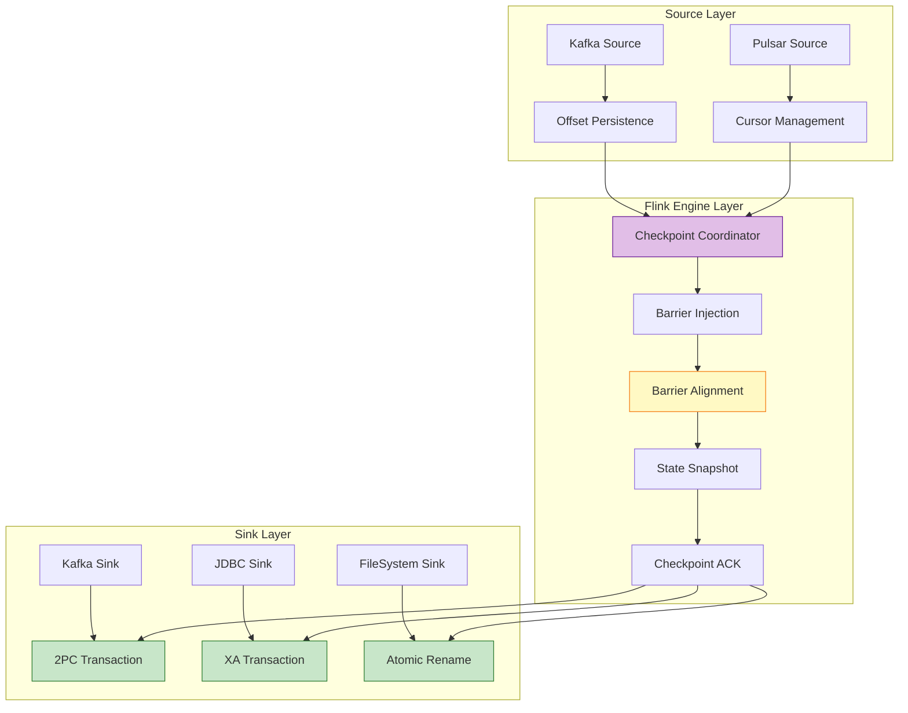
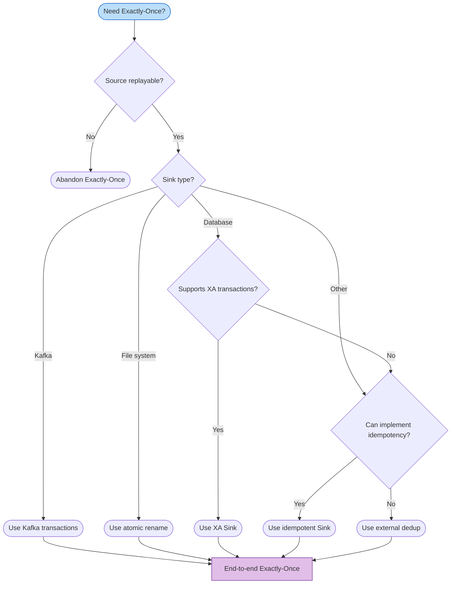
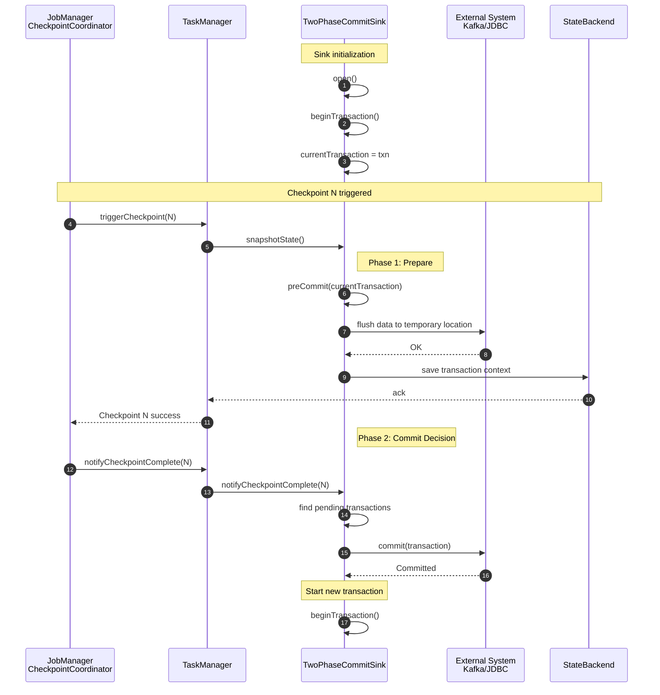

# End-to-End Exactly-Once Guarantees

> **Flink Version**: 1.17-1.19 | **Status**: Production Ready | **Difficulty**: L4 (Advanced)
>
> End-to-end Exactly-Once is the core correctness guarantee of stream processing systems, involving the coordinated operation of three pillars: replayable Source, consistent Checkpoint, and transactional Sink.

## 1. Definitions

### 1.1 Exactly-Once Semantics

**Definition 1.1 (Exactly-Once Semantics)**:

For each input record $r$ in a stream processing application, the result output to external systems reflects $r$'s processing effect exactly once [^1]:

$$
\forall r \in \text{Input}. \; |\{ e \in \text{Output} \mid \text{caused\_by}(e, r) \}| = 1
$$

Where $\text{caused\_by}(e, r)$ means output element $e$'s generation causally depends on record $r$'s processing.

**Key insight**: Exactly-Once targets **side effects** (external system state changes), not the number of times a record is passed internally. In distributed stream processing, fault recovery necessarily causes records to be re-processed; Exactly-Once guarantees that "re-processing does not produce new side effects."

---

### 1.2 End-to-End Exactly-Once Three Pillars

End-to-end Exactly-Once is not an isolated Flink internal mechanism, but the result of three-party collaboration among Source, engine, and Sink [^2]:

```
┌─────────────────────────────────────────────────────────────────────────────┐
│                    End-to-End Exactly-Once Architecture                      │
├─────────────────────────────────────────────────────────────────────────────┤
│  ┌─────────────┐         ┌─────────────┐         ┌─────────────┐           │
│  │   Source    │────────▶│    Flink    │────────▶│    Sink     │           │
│  │   System    │         │   Engine    │         │   System    │           │
│  └──────┬──────┘         └──────┬──────┘         └──────┬──────┘           │
│         ▼                       ▼                       ▼                  │
│  ┌─────────────┐         ┌─────────────┐         ┌─────────────┐           │
│  │  Replayable │         │  Distributed│         │ Transaction │           │
│  │  Offset/    │         │  Snapshot   │         │ 2PC /       │           │
│  │  Position   │         │  Barrier    │         │  Idempotent │           │
│  └─────────────┘         └─────────────┘         └─────────────┘           │
│                                                                             │
│  Formal: End-to-End-EO = Replayable(Source) ∧ ConsistentCheckpoint(Flink)  │
│                        ∧ AtomicOutput(Sink)                                 │
└─────────────────────────────────────────────────────────────────────────────┘
```

**Three Pillars**:

| Pillar | Function | Implementation | Recovery Behavior |
|--------|----------|----------------|-------------------|
| **Source replayable** | prevents data loss | offset persistence to Checkpoint | re-read from last Checkpoint offset |
| **Checkpoint consistency** | guarantees state consistency | Chandy-Lamport distributed snapshot | recover to globally consistent state |
| **Sink transactional** | prevents duplicate output | 2PC / idempotent write | uncommitted transactions rollback; committed transactions idempotent |

---

### 1.3 Consistency Level Comparison

| Level | Definition | Data Loss | Duplication | Applicable Scenario |
|-------|-----------|-----------|-------------|---------------------|
| **At-Most-Once** | message processed 0 or 1 times | possible | none | log sampling, real-time monitoring |
| **At-Least-Once** | message processed ≥1 times | none | possible | log aggregation, metrics collection |
| **Exactly-Once** | message processed exactly 1 time | none | none | financial transactions, inventory management |

---

## 2. Properties

### 2.1 Replayable Source Definition

**Definition 2.1 (Replayable Source)**:

A Source is replayable iff after failure it can re-read the same data sequence from a persisted position marker (offset/position) [^3]:

$$
\text{Replayable}(Src) \iff \forall p \in \text{Positions}. \; \exists! \text{Sequence}(p)
$$

---

### 2.2 Kafka Source Offset Management

Key Kafka Source Exactly-Once configuration parameters [^4]:

```java
Properties properties = new Properties();
properties.setProperty("bootstrap.servers", "kafka:9092");
properties.setProperty("group.id", "flink-eo-consumer");
properties.setProperty("isolation.level", "read_committed");  // only read committed transactions
properties.setProperty("enable.auto.commit", "false");         // Flink manages offsets

KafkaSource<String> source = KafkaSource.<String>builder()
    .setBootstrapServers("kafka:9092")
    .setTopics("input-topic")
    .setGroupId("flink-eo-consumer")
    .setProperty("isolation.level", "read_committed")
    .setProperty("enable.auto.commit", "false")
    .setStartingOffsets(OffsetsInitializer.earliest())
    .setValueOnlyDeserializer(new SimpleStringSchema())
    .build();
```

**Key design**: Flink uses offsets saved in StateBackend for recovery, not Kafka's `__consumer_offsets`. Even if async offset commit fails, no data loss or duplication occurs.

---

### 2.3 Other Source Systems

| Source System | Position Marker | Replayable Support | Configuration Essentials |
|--------------|-----------------|-------------------|-------------------------|
| **Apache Pulsar** | Cursor (ledgerId, entryId) | ✅ | `SubscriptionType.Failover`, broker dedup |
| **AWS Kinesis** | Sequence Number | ✅ | Shard-based sequence number tracking |
| **RabbitMQ** | Delivery Tag | ⚠️ Limited | `autoAck=false`, manual ACK |
| **File System** | File Position | ✅ | File offset persistence |

---

## 3. Relations

### Connector Exactly-Once Support Matrix

| Connector Type | Exactly-Once Support | Implementation Strategy | Configuration Essentials | Applicable Scenario |
|:--------------|:--------------------:|:------------------------|:-------------------------|:--------------------|
| **Apache Kafka** | ✅ Native | Transactional Producer (2PC) | `transactional.id`, `isolation.level=read_committed` | Stream pipelines |
| **Apache Pulsar** | ✅ Native | Cursor management + broker dedup | `SubscriptionType.Failover`, enable dedup | Multi-tenant messaging |
| **AWS Kinesis** | ⚠️ Partial | Sequence number tracking | Shard-based sequence Checkpoint | Cloud-native streaming |
| **RabbitMQ** | ⚠️ Partial | Manual ACK | `autoAck=false`, manual confirmation | Traditional messaging |
| **JDBC (PostgreSQL)** | ✅ Full | XA transactions (2PC) | `max_prepared_transactions > 0`, UPSERT | Relational databases |
| **JDBC (MySQL)** | ✅ Full | XA transactions (2PC) | InnoDB, `XA RECOVER` | Relational databases |
| **Elasticsearch** | ⚠️ Partial | Version control + idempotent ID | `version_type=external` | Search engines |
| **HDFS** | ✅ Full | Atomic rename | temp → final atomic move | Big data storage |
| **Amazon S3** | ✅ Full | Multipart upload + versioning | Enable Bucket Versioning | Cloud object storage |
| **Redis** | ⚠️ Partial | Lua script + Checkpoint ID | Lua conditional update | Cache/KV store |
| **Cassandra** | ⚠️ Partial | Idempotent write | Primary key dedup | Distributed database |

---

## 4. Argumentation

### 4.1 Source Commit Failure

**Scenario**: `notifyCheckpointComplete()` fails to commit offsets to Kafka.

**Analysis**: Source commit failure does **not** violate Exactly-Once, because Flink uses offsets in StateBackend for recovery, not Kafka-committed offsets. After recovery, the job re-reads from the Checkpoint offset; records before that offset are already processed and their effects committed via 2PC.

---

### 4.2 Checkpoint Failure

| Failure Type | Cause | Recovery Action |
|-------------|-------|----------------|
| **Sync phase failure** | state snapshot exception | abort Checkpoint, continue processing |
| **Async phase failure** | state upload failure | abort Checkpoint, retry next time |
| **Timeout** | Checkpoint exceeds time limit | abort; may indicate backpressure |
| **Alignment timeout** | Barrier alignment timeout | task failure, trigger recovery |

---

### 4.3 Sink Pre-commit/Commit Failure

**Pre-commit failure**: exception propagates to CheckpointCoordinator; Checkpoint marked FAILED; all Sinks abort transactions.

**Commit failure (Split-Brain scenario)**:
- Kafka Sink: transaction timeout; broker auto-aborts expired transactions
- JDBC XA Sink: prepared transactions remain in DB; heuristic decision needed during recovery

**Transaction Fencing**: Kafka uses epoch mechanism to prevent zombie task writes. New producer registration automatically aborts old epoch transactions, ensuring Exactly-Once.

---

## 5. Proof / Engineering Argument

### Two-Phase Commit Protocol (2PC)

Flink implements 2PC via `TwoPhaseCommitSinkFunction` [^7], binding Checkpoint with external system transactions:

**Definition 4.1 (Flink 2PC Protocol)**:

$$
\text{Flink-2PC} = \langle \text{Coordinator}, \text{Participants}, \text{Prepare}, \text{Commit}, \text{Abort} \rangle
$$

- **Coordinator**: Flink JobManager (CheckpointCoordinator)
- **Participants**: all TwoPhaseCommitSinkFunction instances
- **Prepare**: `snapshotState()` — persists pre-commit state
- **Commit**: `notifyCheckpointComplete()` — commits external transaction
- **Abort**: `notifyCheckpointAborted()` or recovery from previous Checkpoint

**2PC Sequence**:


---

### Exactly-Once Correctness Theorem

**Core Theorem**: Let Flink job $J = (Src, Ops, Snk)$ satisfy:
1. $Src$ is replayable
2. $Ops$ uses Barrier-aligned Checkpoint mechanism
3. $Snk$ uses transactional 2PC protocol with idempotent commit

Then $J$ guarantees end-to-end Exactly-Once semantics.

**Formal expression**:

$$
\forall r \in \text{Input}. \; |\{ e \in \text{Output} \mid \text{caused\_by}(e, r) \}| = 1
$$

**Proof Structure**:

```
At-Least-Once (no loss)
├── Source replayable lemma
│   └── Replays from Checkpoint offset after failure
│   └── All data processed at least once

At-Most-Once (no duplication)
├── 2PC atomicity lemma
│   └── preCommit data invisible externally before Checkpoint success
│   └── After failure recovery, preCommitted transactions safely commit (idempotent)
│   └── Or abort and re-process into new transaction

Exactly-Once = At-Least-Once ∧ At-Most-Once
```

---

## 6. Examples

### Flink Core Configuration (flink-conf.yaml)

```yaml
# Checkpoint configuration
execution.checkpointing.mode: EXACTLY_ONCE
execution.checkpointing.interval: 60s
execution.checkpointing.min-pause-between-checkpoints: 30s
execution.checkpointing.timeout: 10m
execution.checkpointing.max-concurrent-checkpoints: 1
execution.checkpointing.externalized-checkpoint-retention: RETAIN_ON_CANCELLATION

# State backend configuration
state.backend: rocksdb
state.backend.incremental: true
state.backend.rocksdb.memory.managed: true
state.checkpoints.dir: s3://my-bucket/flink-checkpoints

# Restart strategy
restart-strategy: fixed-delay
restart-strategy.fixed-delay.attempts: 10
restart-strategy.fixed-delay.delay: 10s
```

---

### Kafka Exactly-Once Complete Configuration

**Kafka Source**:
```java
KafkaSource<String> source = KafkaSource.<String>builder()
    .setBootstrapServers("kafka:9092")
    .setTopics("input-topic")
    .setGroupId("flink-eo-consumer")
    .setProperty("isolation.level", "read_committed")     // key: only read committed
    .setProperty("enable.auto.commit", "false")           // Flink manages offsets
    .setStartingOffsets(OffsetsInitializer.committedOffsets(OffsetResetStrategy.EARLIEST))
    .setValueOnlyDeserializer(new SimpleStringSchema())
    .build();
```

**Kafka Sink**:
```java
KafkaSink<String> sink = KafkaSink.<String>builder()
    .setBootstrapServers("kafka:9092")
    .setRecordSerializer(KafkaRecordSerializationSchema.builder()
        .setTopic("output-topic")
        .setValueSerializationSchema(new SimpleStringSchema())
        .build())
    .setDeliveryGuarantee(DeliveryGuarantee.EXACTLY_ONCE)  // enable Exactly-Once
    .setTransactionalIdPrefix("flink-processor")            // transaction ID prefix
    .build();
```

**Kafka cluster requirements**:
```properties
# broker.properties
# transaction configs
transaction.state.log.replication.factor=3
transaction.state.log.min.isr=2
transaction.max.timeout.ms=900000  # must exceed Flink Checkpoint timeout

# idempotency
enable.idempotence=true
```

---

### Complete End-to-End Exactly-Once Job

```java
public class KafkaExactlyOnceJob {
    public static void main(String[] args) throws Exception {
        StreamExecutionEnvironment env = StreamExecutionEnvironment.getExecutionEnvironment();

        // 1. Enable Checkpoint (required)
        env.enableCheckpointing(60000);
        env.getCheckpointConfig().setCheckpointingMode(CheckpointingMode.EXACTLY_ONCE);
        env.getCheckpointConfig().setCheckpointTimeout(600000);
        env.getCheckpointConfig().setMinPauseBetweenCheckpoints(30000);

        // 2. Configure state backend
        env.setStateBackend(new EmbeddedRocksDBStateBackend(true));
        env.getCheckpointConfig().setCheckpointStorage("hdfs:///flink/checkpoints");

        // 3. Configure restart strategy
        env.setRestartStrategy(RestartStrategies.fixedDelayRestart(10, Time.seconds(10)));

        // 4. Kafka Source - Exactly-Once
        KafkaSource<String> source = KafkaSource.<String>builder()
            .setBootstrapServers("kafka:9092")
            .setTopics("input-topic")
            .setGroupId("flink-eo-consumer")
            .setProperty("isolation.level", "read_committed")
            .setProperty("enable.auto.commit", "false")
            .setStartingOffsets(OffsetsInitializer.committedOffsets())
            .setValueOnlyDeserializer(new SimpleStringSchema())
            .build();

        // 5. Kafka Sink - Exactly-Once
        KafkaSink<String> sink = KafkaSink.<String>builder()
            .setBootstrapServers("kafka:9092")
            .setRecordSerializer(KafkaRecordSerializationSchema.builder()
                .setTopic("output-topic")
                .setValueSerializationSchema(new SimpleStringSchema())
                .build())
            .setDeliveryGuarantee(DeliveryGuarantee.EXACTLY_ONCE)
            .setTransactionalIdPrefix("flink-job-" + System.currentTimeMillis())
            .build();

        // 6. Build pipeline
        env.fromSource(source, WatermarkStrategy.noWatermarks(), "Kafka Source")
            .map(new JsonParser())
            .keyBy(Event::getUserId)
            .window(TumblingProcessingTimeWindows.of(Time.minutes(1)))
            .aggregate(new CountAggregate())
            .map(Object::toString)
            .sinkTo(sink);

        env.execute("Kafka Exactly-Once Job");
    }
}
```

---

## 7. Visualizations

### End-to-End Exactly-Once Three Pillars



**Legend**: Purple = Flink engine coordinating distributed snapshots; Yellow = Barrier alignment ensuring consistency; Green = various Sink implementations achieving Exactly-Once via different mechanisms (2PC, XA, atomic rename).

---

### Exactly-Once Strategy Selection Decision Tree



---

### TwoPhaseCommitSinkFunction Lifecycle



---

## 8. References

[^1]: Apache Flink Documentation. "Exactly-once Semantics". <https://nightlies.apache.org/flink/flink-docs-stable/docs/dev/datastream/fault-tolerance/exactly_once/>
[^2]: Carbone, P., et al. (2017). "State Management in Apache Flink: Consistent Stateful Distributed Stream Processing". *Proceedings of the VLDB Endowment*.
[^3]: Chandy, K.M., & Lamport, L. (1985). "Distributed Snapshots: Determining Global States of Distributed Systems". *ACM Transactions on Computer Systems*.
[^4]: Apache Kafka Documentation. "Transactions in Kafka". <https://kafka.apache.org/documentation/#transactions>
[^5]: Flink Documentation. "Checkpoints". <https://nightlies.apache.org/flink/flink-docs-stable/docs/dev/datastream/fault-tolerance/checkpointing/>
[^6]: Flink Documentation. "Unaligned Checkpoints". <https://nightlies.apache.org/flink/flink-docs-stable/docs/dev/datastream/fault-tolerance/checkpointing/#unaligned-checkpoints>
[^7]: Flink Documentation. "Two-Phase Commit Sink Functions". <https://nightlies.apache.org/flink/flink-docs-stable/api/java/org/apache/flink/streaming/api/functions/sink/TwoPhaseCommitSinkFunction.html>
[^8]: Apache Kafka Documentation. "Configuring Producers for Transactions". <https://kafka.apache.org/documentation/#producerconfigs>
[^9]: Flink Documentation. "JdbcXaSinkFunction".
[^10]: Kleppmann, M. (2016). "Designing Data-Intensive Applications". O'Reilly Media.
[^11]: Apache Flink Documentation, "Kafka Source", 2025.

---

*Document Version: v1.0-en | Updated: 2026-04-20 | Status: Core Summary*
