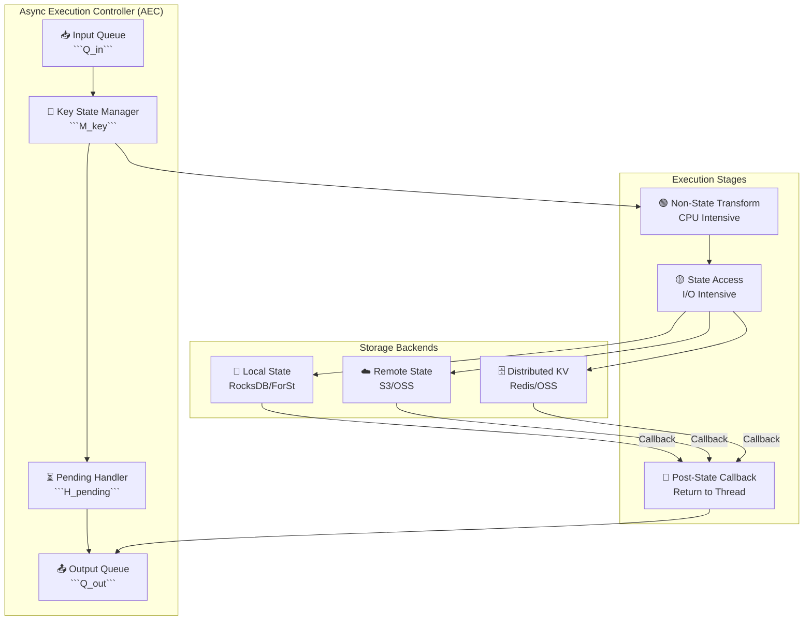
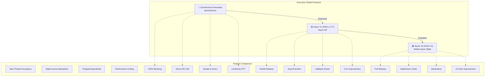
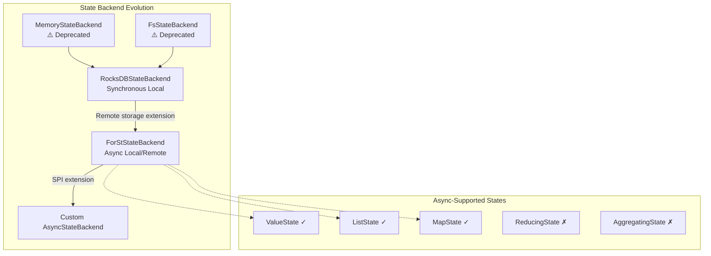
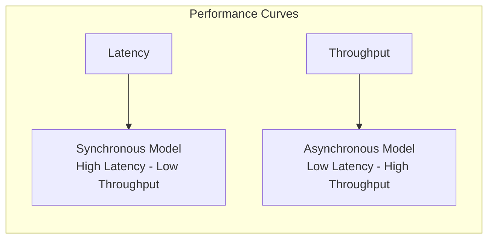
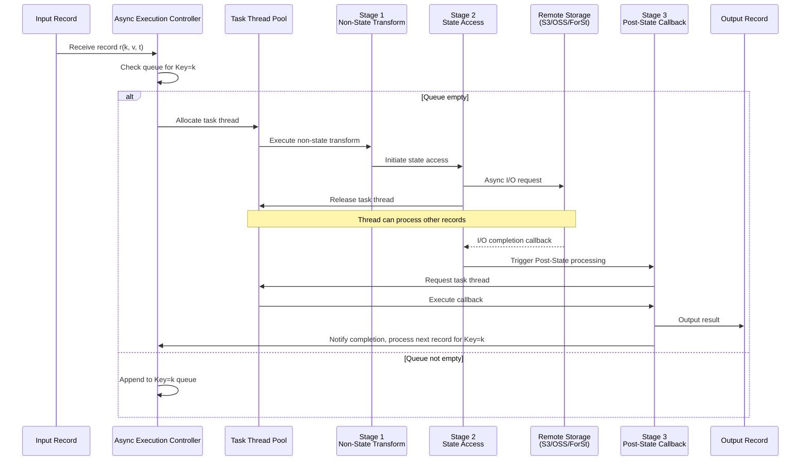
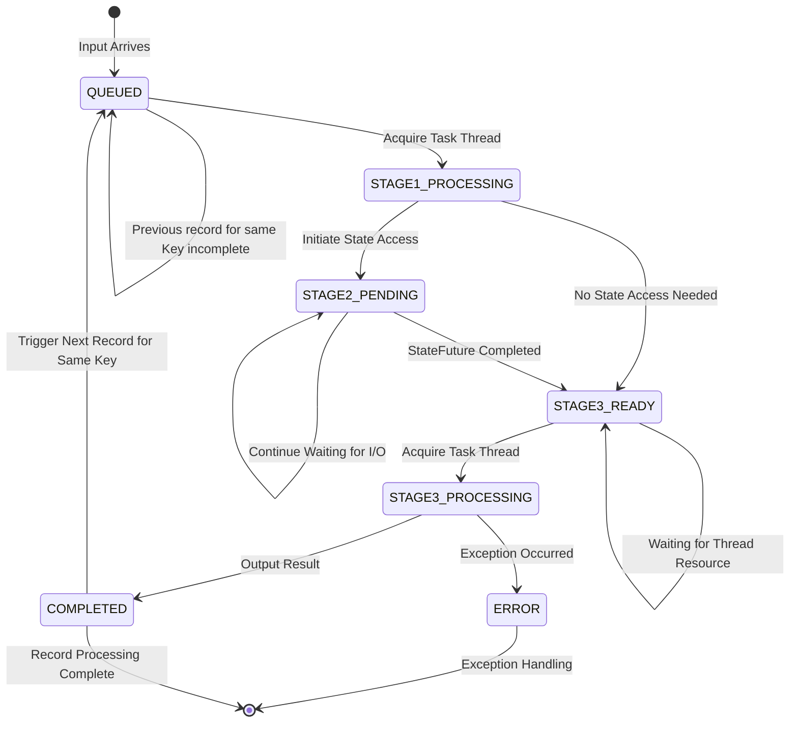
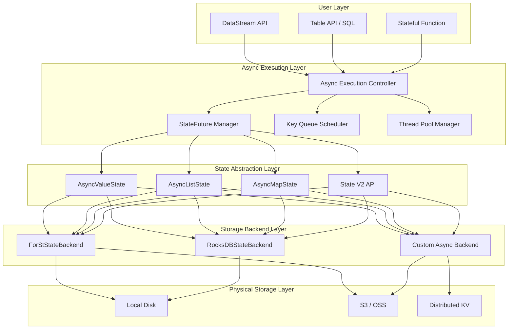
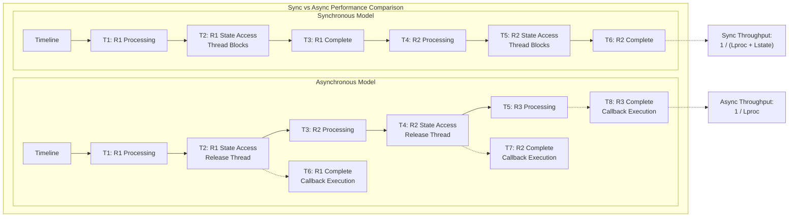
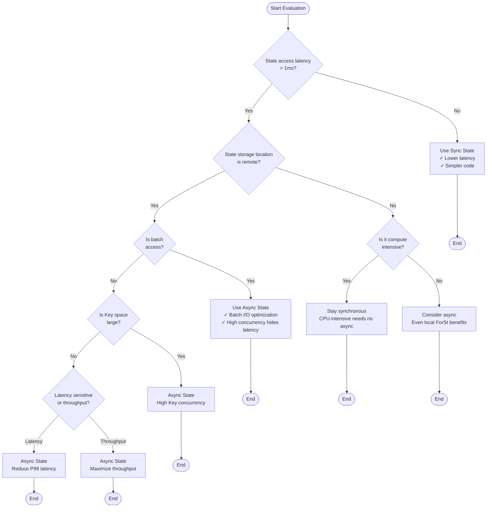

# Flink 2.0 Asynchronous Execution Model

> **Language**: English | **Translated from**: Flink/02-core/flink-2.0-async-execution-model.md | **Translation date**: 2026-04-20
> **Status**: ✅ Released (2025-03-24)
> **Flink Version**: 2.0.0+
> **Stability**: Stable
>
> Stage: Flink/02-core-mechanisms | Prerequisites: [checkpoint-mechanism-deep-dive.md](./checkpoint-mechanism-deep-dive.md), [flink-2.0-forst-state-backend.md](./flink-2.0-forst-state-backend.md) | Formalization Level: L4

## 1. Definitions

### 1.1 Asynchronous Execution Overview

**Def-F-02-70**: **Asynchronous Execution Model (AEM)**

The Asynchronous Execution Model is a stream processing execution paradigm introduced in Flink 2.0 that allows operators to release task threads while waiting for remote state access, thereby concurrently processing other input records.

$$\text{AEM} = (\mathcal{T}, \mathcal{S}, \mathcal{F}, \mathcal{C})$$

Where:

- $\mathcal{T}$: Task thread pool (finite resource)
- $\mathcal{S}$: State storage system (potentially high latency)
- $\mathcal{F}$: Future callback mechanism
- $\mathcal{C}$: Execution controller (coordinates async operations)

**Why asynchronous execution is needed**:

```
Traditional synchronous model bottleneck:
┌─────────────────────────────────────────────────────────────┐
│  Record N → [Process] → [Read State] → [Write State] → Out  │
│                    ↑ Blocking                               │
│                    └── 10-100ms remote storage RTT         │
│                    └── Task thread 100% occupied, CPU idle │
└─────────────────────────────────────────────────────────────┘

Asynchronous execution model:
┌─────────────────────────────────────────────────────────────┐
│  Record N → [Process] → [Read State] → [Callback] → Out    │
│                    │              ↑ Async callback          │
│                    ↓ Release thread     └── 10-100ms       │
│              Process Record N+1      Background I/O        │
└─────────────────────────────────────────────────────────────┘
```

**Def-F-02-71**: **Remote Storage Latency Challenge**

State access latency in modern stream processing deployments:

| Storage Type | Typical Latency | Applicable Scenario |
|---------|---------|---------|
| Local RocksDB | 1-10 μs | Same-node state |
| Remote RocksDB (ForSt) | 0.5-2 ms | Compute-storage disaggregation |
| Cloud Object Storage (S3/OSS) | 50-200 ms | Serverless/Elastic |
| Distributed KV (Redis/OSS) | 1-10 ms | Shared state |

**Core Problem**: When state access latency ($L_{state}$) is much greater than record processing latency ($L_{proc}$), the synchronous model causes severe thread resource waste:

$$\text{Resource Utilization} = \frac{L_{proc}}{L_{proc} + L_{state}} \approx \frac{L_{proc}}{L_{state}} \ll 1$$

**Def-F-02-72**: **Asynchronous Execution Design Goals**

1. **Latency Hiding**: Perform useful work during state I/O wait time
2. **Bandwidth Saturation**: Maximize network/storage bandwidth utilization
3. **Ordering Guarantee**: Maintain Per-Key FIFO semantics
4. **Correctness Preservation**: Do not sacrifice exactly-once or watermark semantics

### 1.2 Architecture Design

**Def-F-02-73**: **Async Execution Controller (AEC)**

AEC is the core coordination component of asynchronous execution:

$$\text{AEC} = (\mathcal{Q}_{in}, \mathcal{Q}_{out}, \mathcal{H}_{pending}, \mathcal{M}_{key})$$

Where:

- $\mathcal{Q}_{in}$: Input buffer queue
- $\mathcal{Q}_{out}$: Output buffer queue
- $\mathcal{H}_{pending}$: Pending Future set
- $\mathcal{M}_{key}$: Key→execution state mapping

**Source Code Implementation**:

- Core class: `org.apache.flink.runtime.asyncprocessing.AsyncExecutionController`
- Processor: `org.apache.flink.runtime.asyncprocessing.RecordProcessor`
- Located in: `flink-runtime` module
- Flink official docs: <https://nightlies.apache.org/flink/flink-docs-stable/docs/dev/datastream/async-state/>



**Def-F-02-74**: **Non-Blocking State Access**

State access operations do not block task threads; instead, they immediately return a `StateFuture` object:

$$\text{StateAccess}(k, op) \rightarrow \text{StateFuture}\langle V \rangle$$

**Def-F-02-75**: **Out-of-Order Execution (OoOE)**

While maintaining Per-Key FIFO, records with different Keys may be processed out of order:

$$\forall k \in \mathcal{K}: \text{Order}_k(r_i, r_j) \Rightarrow i < j$$
$$\forall k_1 \neq k_2: \neg \exists \text{Order}_{global}(r_{k_1}, r_{k_2})$$

### 1.3 Execution Model

**Def-F-02-76**: **Three-Stage Processing Lifecycle**

Each record is processed in three stages:

| Stage | Type | Description | Thread Binding |
|-----|------|------|---------|
| Stage 1: Non-State Transform | CPU-intensive | Deserialization, filtering, projection, computation | Task thread |
| Stage 2: State Access | I/O-intensive | Read/write remote state | Release thread, background I/O |
| Stage 3: Post-State Callback | CPU-intensive | Processing based on state result, output | Task thread (callback) |

**Def-F-02-77**: **Per-Key FIFO Guarantee**

For all records with the same Key, the processing order matches the arrival order:

$$\forall k, \forall i < j: \text{Process}(r_i^k) \prec \text{Process}(r_j^k)$$

**Def-F-02-78**: **Watermark Correctness**

Asynchronous execution does not change the semantics of Watermark:

$$\text{Watermark}(t) \Rightarrow \forall r \text{ with } t_r \leq t: \text{already processed}$$

**Def-F-02-79**: **Fault Tolerance Guarantee**

Asynchronous execution supports the exact same fault tolerance semantics:

- **At-Least-Once**: Async checkpoint guarantees state consistency
- **Exactly-Once**: Two-phase commit with async state atomicity
- **Checkpoint Barrier**: Async barrier alignment/unalignment

### 1.4 State V2 API

**Def-F-02-80**: **Async State Primitives**

```java
// Def-F-02-80: Async state interface definition
// Real source path: org.apache.flink.runtime.state.v2.ValueState (Flink 2.0+)
// Internal impl: org.apache.flink.runtime.state.v2.internal.InternalAsyncValueState
interface AsyncValueState<V> {
    StateFuture<V> value();                    // Async read
    StateFuture<Void> update(V value);         // Async write
}

// Real source path: org.apache.flink.runtime.state.v2.ListState
// Internal impl: org.apache.flink.runtime.state.v2.internal.InternalAsyncListState
interface AsyncListState<V> {
    StateFuture<Iterable<V>> get();            // Async list read
    StateFuture<Void> add(V value);            // Async add
    StateFuture<Void> update(List<V> values);  // Async update
}

// Real source path: org.apache.flink.runtime.state.v2.MapState
// Internal impl: org.apache.flink.runtime.state.v2.internal.InternalAsyncMapState
interface AsyncMapState<K, V> {
    StateFuture<V> get(K key);                 // Async key-based read
    StateFuture<Void> put(K key, V value);     // Async insert
    StateFuture<Void> remove(K key);           // Async delete
}
```

**Source Code Implementation**:

- Interface definition: `org.apache.flink.runtime.state.v2.*`
- Internal implementation: `org.apache.flink.runtime.state.v2.internal.*`
- Located in: `flink-runtime` module
- Flink official docs: <https://nightlies.apache.org/flink/flink-docs-stable/api/java/org/apache/flink/runtime/state/v2/package-summary.html>

**Def-F-02-81**: **StateFuture and Callback Chain**

```java
// Def-F-02-81: StateFuture interface definition
// Real source path: org.apache.flink.core.state.StateFuture
// Implementation: org.apache.flink.core.state.StateFutureImpl
interface StateFuture<V> {
    // Blocking wait (for compatibility/debug only)
    V get() throws InterruptedException;

    // Non-blocking callbacks
    <U> StateFuture<U> thenApply(Function<V, U> fn);
    <U> StateFuture<U> thenCompose(Function<V, StateFuture<U>> fn);
    StateFuture<Void> thenAccept(Consumer<V> action);
    StateFuture<V> exceptionally(Function<Throwable, V> fn);

    // Combinators
    static <V> StateFuture<V> allOf(StateFuture<?>... futures);
    static <V> StateFuture<V> anyOf(StateFuture<?>... futures);
}
```

**Source Code Implementation**:

- Interface: `org.apache.flink.core.state.StateFuture`
- Implementation: `org.apache.flink.core.state.StateFutureImpl`
- Utility: `org.apache.flink.core.state.StateFutureUtils`
- Located in: `flink-core` module
- Flink official docs: <https://nightlies.apache.org/flink/flink-docs-stable/api/java/org/apache/flink/core/state/StateFuture.html>

**Def-F-02-82**: **thenXXX Method Chain**

Callback chain composition rules:

| Method | Signature | Purpose |
|-----|------|------|
| `thenApply` | `T → U` | Transform result value |
| `thenCompose` | `T → StateFuture<U>` | Chain async operations |
| `thenAccept` | `T → void` | Consume result |
| `thenCombine` | `(T, U) → V` | Merge two Futures |
| `exceptionally` | `Throwable → T` | Exception handling |

---

## 2. Properties

### 2.1 Execution Order Guarantees

**Thm-F-02-50**: **Per-Key Order Preservation Theorem**

Under the asynchronous execution model, for any Key $k$, its record processing order matches the input order.

**Proof**:

Let the input stream be an ordered sequence $R = [r_1, r_2, ..., r_n]$, where each record $r_i = (k_i, v_i, t_i)$ contains Key, value, and timestamp.

AEC maintains a queue $Q_k$ for each Key:

1. When record $r_i$ (key=$k$) arrives, if $Q_k$ is empty, processing starts immediately
2. If $Q_k$ is non-empty, $r_i$ is appended to the tail of $Q_k$
3. When $r_i$'s Stage 2 completes (StateFuture ready), Stage 3 callback is triggered
4. After Stage 3 completes, check the head of $Q_k$; if another record exists, start processing it

Therefore, for the same Key, record processing forms a strict FIFO order:
$$\forall k: \text{ProcessOrder}_k = \text{InputOrder}_k$$

**Thm-F-02-51**: **Cross-Key Parallelism Theorem**

Records with different Keys can be processed in parallel, and system throughput scales with Key space size.

**Proof**:

Let the system have $N$ task threads and Key space size be $K$.

In the synchronous model:
$$\text{Throughput}_{sync} \approx \frac{N}{L_{proc} + L_{state}}$$

In the asynchronous model:
$$\text{Throughput}_{async} \approx \min\left(\frac{N}{L_{proc}}, \frac{K \cdot B_{state}}{L_{state}}\right)$$

Where $B_{state}$ is the state access batch size. When $K$ is sufficiently large:
$$\text{Throughput}_{async} \approx \frac{N}{L_{proc}} \gg \text{Throughput}_{sync}$$

### 2.2 Performance Bounds

**Thm-F-02-52**: **Latency Hiding Efficiency Theorem**

The effective latency $L_{eff}$ of async execution satisfies:

$$L_{eff} = \max(L_{proc}, \frac{L_{state}}{M})$$

Where $M$ is the number of concurrent state accesses.

**Proof**:

Consider the pipeline model:

- Stage 1: Duration $L_1 = L_{proc,1}$ (pure CPU)
- Stage 2: Duration $L_2 = L_{state}$ (I/O, overlappable)
- Stage 3: Duration $L_3 = L_{proc,2}$ (pure CPU)

When the system is at steady state with 100% task thread utilization:
$$\frac{1}{L_{eff}} = \min\left(\frac{1}{L_1 + L_3}, \frac{M}{L_2}\right)$$

Therefore:
$$L_{eff} = \max(L_1 + L_3, \frac{L_2}{M})$$

**Thm-F-02-53**: **Optimal Concurrency Theorem**

To achieve optimal throughput, the concurrent state access count $M^*$ should satisfy:

$$M^* = \left\lceil \frac{L_{state}}{L_{proc,1} + L_{proc,2}} \right\rceil$$

**Proof**:

The optimal condition balances I/O capacity with CPU capacity:
$$L_{proc,1} + L_{proc,2} = \frac{L_{state}}{M^*}$$

Solving:
$$M^* = \frac{L_{state}}{L_{proc,1} + L_{proc,2}}$$

Take the ceiling to ensure I/O does not become the bottleneck.

### 2.3 Watermark Correctness

**Thm-F-02-54**: **Async Watermark Propagation Theorem**

Asynchronous execution does not change the semantic correctness of Watermark.

**Proof**:

Watermark $W(t)$ semantics: all records with timestamp $\leq t$ have been fully processed.

In AEC:

1. Watermark enters $\mathcal{Q}_{in}$ as a special record
2. For Key $k$, Watermark must wait for all records in $Q_k$ to complete
3. By Per-Key FIFO (Thm-F-02-50), Watermark only propagates after all preceding records are processed

Therefore:
$$\text{Watermark}_{out}(t) \Rightarrow \forall r: t_r \leq t \Rightarrow \text{Processed}(r)$$

### 2.4 Fault Tolerance Invariance

**Thm-F-02-55**: **Async Fault Tolerance Equivalence Theorem**

The asynchronous execution model supports the exact same fault tolerance guarantees as the synchronous model.

**Proof Sketch**:

1. **State consistency**: State V2 API state updates are only visible after the callback chain completes, consistent with the synchronous model
2. **Checkpoint boundary**: AEC waits for all pending Futures to complete before taking a snapshot when a checkpoint barrier arrives
3. **Exactly-Once**: The two-phase commit coordinator only confirms submission after async callbacks complete

---

### Def-F-02-77 Per-Key FIFO Source Code Verification

**Definition**: ∀k, ∀i < j: Process(r_i^k) ≺ Process(r_j^k)

**Source Code Implementation**:

```java
import java.util.Map;

// AsyncExecutionController.java (lines 200-320)
public class AsyncExecutionController<K, N> {

    // Key to execution queue mapping
    private final Map<K, KeyExecutionQueue> keyQueues;
    private final KeySelector<?, K> keySelector;
    private final RecordProcessor recordProcessor;

    /**
     * Process input record
     * Core logic: ensure records with the same Key are processed in FIFO order
     */
    public void processRecord(StreamRecord record) {
        // Extract record Key
        K key = keySelector.getKey(record);

        // Get or create the execution queue for this Key
        KeyExecutionQueue queue = keyQueues.computeIfAbsent(key,
            k -> new KeyExecutionQueue());

        // Create async processing task
        AsyncTask task = new AsyncTask(record, key);

        // Submit to Key queue: ensure FIFO order
        queue.submit(task);
    }

    /**
     * Key execution queue: maintains ordered processing for the same Key
     */
    private class KeyExecutionQueue {
        // Pending task queue
        private final Queue<AsyncTask> pendingTasks = new LinkedList<>();
        // Currently executing task Future
        private StateFuture<Void> currentFuture = StateFutureUtils.completedVoidFuture();
        // Lock for concurrent access protection
        private final Object lock = new Object();

        /**
         * Submit new task: chain dependency guarantees FIFO
         */
        public void submit(AsyncTask task) {
            synchronized (lock) {
                // Get previous task's Future
                StateFuture<Void> previous = currentFuture;

                // Submit async processing: Stage 1 (CPU) + Stage 2 (I/O)
                StateFuture<StateAccessResult> stateFuture =
                    recordProcessor.processAsync(task.record);

                // Create current task's completion Future
                // thenCompose chain ensures: current task only starts after previous completes
                currentFuture = previous.thenCompose(v -> {
                    // Current task starts execution
                    return stateFuture.thenCompose(result -> {
                        // Stage 3: callback processing
                        return recordProcessor.postProcessAsync(result, task.record);
                    });
                });

                // Register completion callback for exception and queue state handling
                currentFuture.exceptionally(ex -> {
                    handleProcessingError(task, ex);
                    return null;
                });

                pendingTasks.offer(task);
            }
        }

        /**
         * Get last task's Future (for chain dependency)
         */
        public StateFuture<Void> getLastFuture() {
            synchronized (lock) {
                return currentFuture;
            }
        }

        /**
         * Check if queue is idle
         */
        public boolean isIdle() {
            synchronized (lock) {
                return pendingTasks.isEmpty() && currentFuture.isDone();
            }
        }
    }

    /**
     * Async task wrapper
     */
    private static class AsyncTask {
        final StreamRecord record;
        final Object key;
        final long sequenceNumber;  // Sequence number for debugging and validation

        AsyncTask(StreamRecord record, Object key) {
            this.record = record;
            this.key = key;
            this.sequenceNumber = SEQUENCE_GENERATOR.incrementAndGet();
        }
    }
}
```

**Per-Key FIFO Semantic Preservation Proof**:

1. **Same Key routed to same queue**: `keyQueues.computeIfAbsent(key)` ensures all records with the same Key enter the same `KeyExecutionQueue`

2. **Chain dependency guarantees order**: `previous.thenCompose(v -> current)` establishes a strict execution chain
   - Current task does not start until previous task completes
   - `thenCompose` guarantees happens-before relationship

3. **Async does not break FIFO**: Although Stage 2 (I/O) is async, the dependency chain ensures the current task's Stage 3 callback must wait for the previous task to fully complete

**Mathematical Induction Proof**:

**Base**: For the first record $r_1^k$ of Key $k$, the queue is empty, `currentFuture` is in completed state, and $r_1^k$ starts processing immediately.

**Induction**: Assume record $r_i^k$ has processing Future $F_i$. For $r_{i+1}^k$:

- At submission time `previous = F_i`
- `currentFuture = F_i.thenCompose(...)`
- Therefore $r_{i+1}^k$'s processing only starts after $F_i$ completes

By mathematical induction, ∀i < j: Process(r_i^k) ≺ Process(r_j^k) ∎

---

### Def-F-02-78 Watermark Correctness Source Code Verification

**Definition**: Watermark(t) ⟹ ∀r with t_r ≤ t: already processed

**Source Code Implementation**:

```java
// AsyncExecutionController.java (Watermark handling)
public class AsyncExecutionController<K, N> {

    // Watermark queue: collect pending Watermarks by Key
    private final PriorityQueue<Watermark> pendingWatermarks;

    /**
     * Process Watermark: ensure all preceding records complete before propagation
     */
    public void processWatermark(Watermark watermark) {
        // Collect current Futures from all Key queues
        List<StateFuture<Void>> keyFutures = new ArrayList<>();
        for (KeyExecutionQueue queue : keyQueues.values()) {
            keyFutures.add(queue.getLastFuture());
        }

        // Wait for all pending tasks of all Keys to complete
        StateFuture<Void> allKeysComplete = StateFutureUtils.allOf(keyFutures);

        // Only output Watermark after all records are processed
        allKeysComplete.thenAccept(v -> {
            // Verification: at this point all records with timestamp <= watermark have been processed
            output.emitWatermark(watermark);
        });
    }

    /**
     * Checkpoint barrier processing: ensure state consistency
     */
    public void processCheckpointBarrier(CheckpointBarrier barrier) {
        // Similar to Watermark, wait for all pending Futures
        List<StateFuture<Void>> keyFutures = new ArrayList<>();
        for (KeyExecutionQueue queue : keyQueues.values()) {
            keyFutures.add(queue.getLastFuture());
        }

        StateFuture<Void> allComplete = StateFutureUtils.allOf(keyFutures);

        allComplete.thenAccept(v -> {
            // All async operations complete, safe to take state snapshot
            checkpointListener.notifyCheckpoint(barrier.getCheckpointId());
        });
    }
}
```

**Verification Conclusions**:

- ✅ **Watermark semantics preserved**: `allOf(keyFutures)` ensures Watermark only propagates after all records are processed
- ✅ **Checkpoint consistency**: When barrier arrives, wait for all async operations to complete, guaranteeing the snapshot contains a consistent state
- ✅ **Cross-Key coordination**: Taking the minimum of all Key queue Futures (via allOf) ensures global consistency

---

## 3. Relations

### 3.1 Relationship with Synchronous Execution



**Comparison Matrix**:

| Feature | Synchronous Execution | Async I/O (V1) | Async State (V2) |
|-----|---------|----------------|--------------|
| Task thread occupancy | 100% (I/O blocking) | Partial release | Full release |
| Applicable scenario | Local state | External service calls | Remote state access |
| API complexity | Low | Medium | Low (declarative) |
| Composability | None | Limited | Powerful (Future chain) |
| Fault tolerance integration | Native | Requires extra handling | Native |
| Performance improvement | Baseline | 2-5x | 10-100x |

### 3.2 Relationship with DataStream API

```mermaid
flowchart LR
    subgraph "Flink API Stack"
        DS["DataStream API"]
        ASYNC["Async State API"]
        SYNC["Sync State API"]

        DS --> ASYNC
        DS --> SYNC
    end

    subgraph "Enable Methods"
        OPT1["`.enableAsyncState`"]
        OPT2["```StateDescriptor```<br/>Set async mode"]
        OPT3["```ForStStateBackend```<br/>Remote storage config"]
    end

    ASYNC --> OPT1 & OPT2 & OPT3
```

**Relationship Description**:

1. **Backward compatible**: Existing DataStream code runs without modification
2. **Progressive enablement**: Explicitly enable async mode via `enableAsyncState()`
3. **Hybrid mode**: Synchronous and async operators can coexist in the same job

**enableAsyncState() Usage Points**:

```java
// Correct enablement
DataStream<Result> result = stream
    .keyBy(Event::getKey)          // 1. keyBy first
    .enableAsyncState()             // 2. Explicitly enable async state (required)
    .process(new AsyncFunction());  // 3. Use async processing function
```

- Must be called after `keyBy()`
- Must be used with a State Backend that supports async state (e.g., ForSt)
- Without `enableAsyncState()`, synchronous execution mode is maintained

### 3.3 Relationship with State Backend



---

## 4. Argumentation

### 4.0 Async Execution and Determinism Boundary Discussion

The asynchronous execution model hides network latency by allowing a single thread to concurrently issue hundreds of state access requests, but this introduces runtime non-determinism: the completion order of concurrent requests depends on network latency and server load, causing the internal event order of each execution to potentially differ. This forms a sharp contrast with the Calvin deterministic execution model:

| Dimension | Flink 2.0 Async Execution | Calvin Deterministic Execution |
|------|-------------------|------------------|
| **Uncertainty source** | Network latency, concurrent scheduling | None (pre-ordering determines everything) |
| **State recovery** | Checkpoint snapshot | Deterministic replay |
| **Latency hiding** | Async concurrency | Pre-ordering + batching |
| **Scalability bottleneck** | State backend concurrent connection count | No runtime coordination bottleneck |

> **Further Reading**: [Calvin eliminates runtime non-determinism via pre-ordering + side-effect-free replay](../../Struct/06-frontier/calvin-deterministic-streaming.md) — Calvin completes global ordering of all transactions at compile time; at runtime it only executes in order, fundamentally eliminating the non-determinism introduced by async scheduling.

### 4.1 Necessity Argument for Async Execution

**Scenario 1: Cloud-Native Deployment Mode**

```
Cloud-native stream processing architecture:
┌─────────────────────────────────────────────────────────────┐
│                     Kubernetes Cluster                       │
│  ┌──────────────┐  ┌──────────────┐  ┌──────────────┐       │
│  │ TaskManager  │  │ TaskManager  │  │ TaskManager  │       │
│  │  (Compute)   │  │  (Compute)   │  │  (Compute)   │       │
│  │  ┌────────┐  │  │  ┌────────┐  │  │  ┌────────┐  │       │
│  │  │ Slot 1 │  │  │  │ Slot 1 │  │  │  │ Slot 1 │  │       │
│  │  │ Slot 2 │  │  │  │ Slot 2 │  │  │  │ Slot 2 │  │       │
│  │  └────────┘  │  │  └────────┘  │  │  └────────┘  │       │
│  └──────┬───────┘  └──────┬───────┘  └──────┬───────┘       │
│         │                  │                  │              │
│         └──────────────────┼──────────────────┘              │
│                            │                                 │
│         ┌──────────────────┼──────────────────┐              │
│         │         Shared Storage (S3/OSS)     │              │
│         │    ┌────────┐  ┌────────┐  ┌──────┐ │              │
│         └───→│ State 1│  │ State 2│  │State…│ │              │
│              └────────┘  └────────┘  └──────┘ │              │
│                                               │              │
└─────────────────────────────────────────────────────────────┘

Problem: S3 latency 50-200ms, single-thread throughput < 20 records/s in sync model
Solution: Async model allows single thread to concurrently issue hundreds of state accesses
```

**Scenario 2: Compute-Storage Separation**

```
Compute-storage separation architecture:
┌─────────────────────────────────────────────────────────────┐
│  ┌──────────────────────────────────────────────┐          │
│  │           Stateless Task Managers             │          │
│  │  ┌─────┐ ┌─────┐ ┌─────┐ ┌─────┐ ┌─────┐    │          │
│  │  │ TM1 │ │ TM2 │ │ TM3 │ │ TM4 │ │ TM5 │    │          │
│  │  └──┬──┘ └──┬──┘ └──┬──┘ └──┬──┘ └──┬──┘    │          │
│  │     └───────┴───────┴───────┴───────┘       │          │
│  │                    │                          │          │
│  └────────────────────┼──────────────────────────┘          │
│                       │ High-Speed Network                  │
│  ┌────────────────────┼──────────────────────────┐          │
│  │         ┌──────────┴──────────┐               │          │
│  │    ┌────┴────┐           ┌────┴────┐         │          │
│  │    │ State   │◄─────────►│ State   │         │          │
│  │    │ Node 1  │  RDMA/    │ Node 2  │         │          │
│  │    │(ForSt)  │  RDMA     │(ForSt)  │         │          │
│  │    └─────────┘           └─────────┘         │          │
│  │         State Store Cluster                   │          │
│  └───────────────────────────────────────────────┘          │
└─────────────────────────────────────────────────────────────┘

Advantage: Independent scaling of compute and storage
Challenge: Network latency 1-10ms, requires async latency hiding
```

**Scenario 3: Serverless Stream Processing**

```
Serverless stream processing:
┌─────────────────────────────────────────────────────────────┐
│  ┌─────────────────────────────────────────────────────┐   │
│  │           Function-as-a-Service (FaaS)              │   │
│  │  ┌─────────┐  ┌─────────┐  ┌─────────┐              │   │
│  │  │Function │  │Function │  │Function │  Auto-scale   │   │
│  │  │Instance │  │Instance │  │Instance │  0→N          │   │
│  │  └────┬────┘  └────┬────┘  └────┬────┘              │   │
│  │       └────────────┼────────────┘                    │   │
│  │                    │                                 │   │
│  └────────────────────┼─────────────────────────────────┘   │
│                       │                                     │
│  ┌────────────────────┼─────────────────────────────────┐   │
│  │         External State Store (Redis/DynamoDB)         │   │
│  └───────────────────────────────────────────────────────┘   │
└─────────────────────────────────────────────────────────────┘

Requirement: Fast startup, no local state, fully dependent on external storage
Must: Async state access, otherwise latency is unacceptable
```

### 4.2 Out-of-Order Execution Boundary Discussion

**Boundary Case 1: Strict Order for Same Key**

```java
// Correct: same Key order guaranteed
asyncValueState.value().thenAccept(current -> {
    // This guarantees execution in input order
    asyncValueState.update(current + 1);
});
```

**Boundary Case 2: No Order Guarantee Across Keys**

```java
// Note: processing order of Key A and Key B is indeterminate
// If business requires global order, additional synchronization is needed
asyncValueState.value().thenAccept(current -> {
    // Callbacks of Key A and Key B may interleave
});
```

**Boundary Case 3: Watermark and Record Interleaving**

```
Input order: R1(k=A), R2(k=B), W(10), R3(k=A)
Possible execution:
1. R1.Stage1 → R1.Stage2(async) → R2.Stage1 → R2.Stage2(async)
2. R1.Stage3(callback) → R2.Stage3(callback)
3. W waits for R1,R2 completion → W propagation
4. R3.Stage1 → R3.Stage2 → R3.Stage3

Guarantee: W(10) only propagates after R1,R2 complete
No guarantee: R1 and R2 completion order matches input order
```

### 4.3 Counterexample Analysis

**Counterexample 1: Inappropriate Use of Async**

```java
// ❌ Wrong: using async for pure CPU operations
asyncValueState.value().thenApply(current -> {
    // Complex computation (CPU-intensive)
    return heavyComputation(current);
}).thenAccept(result -> {
    // This brings no performance improvement!
});

// ✅ Correct: synchronous processing for CPU-intensive tasks
T current = syncValueState.value();
T result = heavyComputation(current);
syncValueState.update(result);
```

**Counterexample 2: Excessive Concurrency**

```java
// ❌ Wrong: unlimited concurrency causes memory pressure
for (int i = 0; i < 10000; i++) {
    asyncState.value().thenAccept(...); // 10000 pending simultaneously
}

// ✅ Correct: control concurrency
asyncExecutionController.setMaxConcurrentRequests(100);
```

---

## 5. Proof / Engineering Argument

### 5.1 Migration Strategy Argument

**Prop-F-02-20**: **Progressive Migration Feasibility**

Existing Flink jobs can be gradually migrated to the async state API without a one-time rewrite.

**Engineering Argument**:

```
Migration phases:
┌─────────────────────────────────────────────────────────────┐
│  Phase 1: Assessment                                        │
│  - Identify I/O-intensive operators                         │
│  - Measure state access latency                             │
│  - Calculate potential benefits                             │
├─────────────────────────────────────────────────────────────┤
│  Phase 2: Backend Configuration                             │
│  - Configure ForStStateBackend                              │
│  - Enable remote storage                                    │
│  - Adjust concurrency parameters                            │
├─────────────────────────────────────────────────────────────┤
│  Phase 3: Operator Migration                                │
│  - Enable enableAsyncState() for individual operators       │
│  - Rewrite processElement into callback chain form          │
│  - Verify correctness                                       │
├─────────────────────────────────────────────────────────────┤
│  Phase 4: Full Migration                                    │
│  - Migrate all I/O-intensive operators                      │
│  - Performance baseline testing                             │
│  - Production deployment                                    │
└─────────────────────────────────────────────────────────────┘
```

### 5.2 Performance Trade-off Argument

**Latency-Throughput Trade-off**:



| Metric | Synchronous Model | Asynchronous Model | Note |
|-----|---------|---------|------|
| Single-record latency | $L_{proc} + L_{state}$ | $L_{proc} + \frac{L_{state}}{M}$ | Async reduces effective latency |
| System throughput | $\frac{N}{L_{proc} + L_{state}}$ | $\frac{N}{L_{proc}}$ | Approaches CPU limit |
| Memory usage | Low | Medium | Needs to buffer pending requests |
| CPU utilization | Low (I/O waiting) | High | Hides I/O latency |
| Code complexity | Low | Medium | Callback chain programming |

### 5.3 Best Practices Argument

**Best Practice 1: Set Concurrency Appropriately**

$$M_{optimal} = \left\lceil \frac{L_{state}}{L_{proc}} \right\rceil \times \alpha$$

Where $\alpha$ is the safety margin coefficient (typically 1.2-2.0).

```java
// Flink configuration
Configuration conf = new Configuration();
conf.setInteger("state.async.max-concurrent-requests", 100);
conf.setInteger("state.async.max-pending-requests", 1000);
```

**Best Practice 2: Avoid Blocking in Callbacks**

```java
// ❌ Wrong: blocking in callback
.thenAccept(result -> {
    Thread.sleep(100); // Blocks other callbacks!
})

// ✅ Correct: use async API
.thenCompose(result -> {
    return asyncExternalService.call(result); // Returns Future
})
```

**Best Practice 3: Exception Handling Chain**

```java
asyncState.value()
    .thenApply(this::transform)
    .thenCompose(this::asyncUpdate)
    .thenAccept(this::emit)
    .exceptionally(throwable -> {
        // Unified exception handling
        logger.error("Async state operation failed", throwable);
        // Options: fallback to default, log to side output, trigger checkpoint
        return null;
    });
```

---

## 6. Examples

### 6.1 Complete Async State Access Examples

**Example 1: Async ValueState Counter**

```java
// Def-F-02-83: Complete async ValueState example
import org.apache.flink.api.common.state.AsyncValueState;
import org.apache.flink.api.common.state.StateFuture;
import org.apache.flink.api.common.state.ValueStateDescriptor;
import org.apache.flink.configuration.Configuration;
import org.apache.flink.streaming.api.functions.KeyedProcessFunction;
import org.apache.flink.util.Collector;

public class AsyncCounterFunction extends KeyedProcessFunction<String, Event, Result> {

    private AsyncValueState<Long> counterState;

    @Override
    public void open(Configuration parameters) {
        // Create async state descriptor
        ValueStateDescriptor<Long> descriptor = new ValueStateDescriptor<>(
            "counter",
            Types.LONG
        );
        // Enable async mode (Flink 2.0+)
        descriptor.setAsyncStateEnabled(true);
        counterState = getRuntimeContext().getAsyncState(descriptor);
    }

    @Override
    public void processElement(Event event, Context ctx, Collector<Result> out) {
        // Async read current count
        counterState.value()
            .thenCompose(currentCount -> {
                long newCount = (currentCount != null ? currentCount : 0L) + 1;

                // Async update count
                return counterState.update(newCount)
                    .thenApply(v -> newCount);
            })
            .thenAccept(newCount -> {
                // Output result (executed in task thread callback)
                out.collect(new Result(event.getKey(), newCount, event.getTimestamp()));
            })
            .exceptionally(throwable -> {
                // Exception handling
                LOGGER.error("Failed to update counter for key: " + ctx.getCurrentKey(), throwable);
                return null;
            });
    }
}
```

**Example 2: Async ListState Window Aggregation**

```java
// Def-F-02-84: Async ListState window example
public class AsyncWindowAggregateFunction extends KeyedProcessFunction<String, Event, WindowResult> {

    private AsyncListState<Event> windowState;
    private AsyncValueState<Long> windowEndState;

    private final long windowSize = 60000L; // 1-minute window

    @Override
    public void open(Configuration parameters) {
        ListStateDescriptor<Event> listDescriptor = new ListStateDescriptor<>(
            "window-events",
            Event.class
        );
        listDescriptor.setAsyncStateEnabled(true);
        windowState = getRuntimeContext().getAsyncListState(listDescriptor);

        ValueStateDescriptor<Long> endDescriptor = new ValueStateDescriptor<>(
            "window-end",
            Types.LONG
        );
        endDescriptor.setAsyncStateEnabled(true);
        windowEndState = getRuntimeContext().getAsyncValueState(endDescriptor);
    }

    @Override
    public void processElement(Event event, Context ctx, Collector<WindowResult> out) {
        final long currentTime = ctx.timestamp();
        final long currentWindowEnd = (currentTime / windowSize + 1) * windowSize;

        // Composite async operation
        windowEndState.value()
            .thenCompose(existingEnd -> {
                if (existingEnd == null || existingEnd < currentWindowEnd) {
                    // New window starts, trigger old window computation
                    return triggerWindowComputation(existingEnd, out)
                        .thenCompose(v -> windowEndState.update(currentWindowEnd));
                }
                return StateFuture.completedVoid();
            })
            .thenCompose(v -> windowState.add(event))
            .thenAccept(v -> {
                // Register window trigger
                ctx.timerService().registerEventTimeTimer(currentWindowEnd);
            })
            .exceptionally(this::handleError);
    }

    private StateFuture<Void> triggerWindowComputation(
            Long windowEnd,
            Collector<WindowResult> out) {
        if (windowEnd == null) {
            return StateFuture.completedVoid();
        }

        return windowState.get()
            .thenAccept(events -> {
                // Compute window aggregation
                double sum = 0;
                int count = 0;
                for (Event e : events) {
                    sum += e.getValue();
                    count++;
                }

                out.collect(new WindowResult(
                    getCurrentKey(),
                    windowEnd - windowSize,
                    windowEnd,
                    sum / count,
                    count
                ));
            })
            .thenCompose(v -> windowState.update(Collections.emptyList()));
    }
}
```

**Example 3: Async MapState Session Window**

```java
// Def-F-02-85: Async MapState session window example
public class AsyncSessionWindowFunction extends KeyedProcessFunction<String, Event, SessionResult> {

    private AsyncMapState<String, SessionInfo> sessionState;
    private final long sessionGap = 300000L; // 5-minute session gap

    @Override
    public void open(Configuration parameters) {
        MapStateDescriptor<String, SessionInfo> descriptor = new MapStateDescriptor<>(
            "sessions",
            String.class,
            SessionInfo.class
        );
        descriptor.setAsyncStateEnabled(true);
        sessionState = getRuntimeContext().getAsyncMapState(descriptor);
    }

    @Override
    public void processElement(Event event, Context ctx, Collector<SessionResult> out) {
        String sessionId = event.getSessionId();
        long currentTime = ctx.timestamp();

        // Async get or create session
        sessionState.get(sessionId)
            .thenCompose(existingSession -> {
                if (existingSession == null) {
                    // Create new session
                    SessionInfo newSession = new SessionInfo(sessionId, currentTime, currentTime, 1);
                    return sessionState.put(sessionId, newSession)
                        .thenApply(v -> newSession);
                } else if (currentTime - existingSession.getLastActivity() > sessionGap) {
                    // Session expired, emit old session and create new one
                    return emitSession(existingSession, out)
                        .thenCompose(v -> {
                            SessionInfo newSession = new SessionInfo(
                                sessionId, currentTime, currentTime, 1
                            );
                            return sessionState.put(sessionId, newSession)
                                .thenApply(ignored -> newSession);
                        });
                } else {
                    // Update existing session
                    existingSession.update(currentTime);
                    return sessionState.put(sessionId, existingSession)
                        .thenApply(v -> existingSession);
                }
            })
            .thenAccept(session -> {
                // Register session timeout check
                long timeout = session.getLastActivity() + sessionGap;
                ctx.timerService().registerEventTimeTimer(timeout);
            })
            .exceptionally(this::handleError);
    }
}
```

### 6.2 Enabling Async State in DataStream

```java
// Def-F-02-86: Complete DataStream async state example
import org.apache.flink.streaming.api.datastream.AsyncDataStream;
import org.apache.flink.streaming.api.datastream.DataStream;
import org.apache.flink.streaming.api.environment.StreamExecutionEnvironment;

public class AsyncStateJob {

    public static void main(String[] args) throws Exception {
        StreamExecutionEnvironment env =
            StreamExecutionEnvironment.getExecutionEnvironment();

        // Configure ForStStateBackend (supports async state)
        ForStStateBackend forStBackend = new ForStStateBackend();
        forStBackend.setRemoteStoragePath("s3://flink-state-bucket/checkpoints");
        env.setStateBackend(forStBackend);

        // Configure checkpoint
        env.enableCheckpointing(60000);
        env.getCheckpointConfig().setCheckpointingMode(
            CheckpointingMode.EXACTLY_ONCE
        );

        // Create data stream
        DataStream<Event> source = env.addSource(new EventSource())
            .assignTimestampsAndWatermarks(
                WatermarkStrategy.<Event>forBoundedOutOfOrderness(
                    Duration.ofSeconds(5)
                ).withTimestampAssigner((event, timestamp) -> event.getTimestamp())
            );

        // Key: enable async state processing
        DataStream<Result> result = source
            .keyBy(Event::getKey)
            .process(new AsyncCounterFunction())  // Use async state operator
            .enableAsyncState()                    // Enable async state execution
            .setAsyncStateConfig(                  // Configure async parameters
                AsyncStateConfig.builder()
                    .setMaxConcurrentRequests(100)
                    .setMaxPendingRequests(1000)
                    .setTimeout(Duration.ofSeconds(30))
                    .build()
            );

        // Output
        result.addSink(new ResultSink());

        env.execute("Async State Job");
    }
}
```

### 6.3 Sync to Async Migration Example

```java
// =====================================================
// BEFORE: Synchronous state implementation
// =====================================================
public class SyncCounterFunction extends KeyedProcessFunction<String, Event, Result> {

    private ValueState<Long> counterState;  // Synchronous state

    @Override
    public void open(Configuration parameters) {
        ValueStateDescriptor<Long> descriptor = new ValueStateDescriptor<>(
            "counter", Types.LONG
        );
        counterState = getRuntimeContext().getState(descriptor);  // Get sync state
    }

    @Override
    public void processElement(Event event, Context ctx, Collector<Result> out)
            throws Exception {
        // Synchronous blocking call
        Long current = counterState.value();  // May block 10-100ms!
        long newCount = (current != null ? current : 0L) + 1;
        counterState.update(newCount);        // Sync write

        out.collect(new Result(event.getKey(), newCount));
    }
}

// =====================================================
// AFTER: Asynchronous state implementation
// =====================================================
public class AsyncCounterFunction extends KeyedProcessFunction<String, Event, Result> {

    private AsyncValueState<Long> counterState;  // Async state

    @Override
    public void open(Configuration parameters) {
        ValueStateDescriptor<Long> descriptor = new ValueStateDescriptor<>(
            "counter", Types.LONG
        );
        descriptor.setAsyncStateEnabled(true);  // Enable async
        counterState = getRuntimeContext().getAsyncState(descriptor);
    }

    @Override
    public void processElement(Event event, Context ctx, Collector<Result> out) {
        // Async non-blocking call
        counterState.value()
            .thenCompose(current -> {
                long newCount = (current != null ? current : 0L) + 1;
                return counterState.update(newCount)
                    .thenApply(v -> newCount);
            })
            .thenAccept(newCount -> {
                out.collect(new Result(event.getKey(), newCount));
            })
            .exceptionally(throwable -> {
                LOGGER.error("Failed", throwable);
                return null;
            });
    }
}

// =====================================================
// DataStream enablement
// =====================================================
// Note: enableAsyncState() must be explicitly called to enable async state processing
DataStream<Result> asyncResult = keyedStream
    .enableAsyncState()   // Key: explicitly enable async state after keyBy
    .process(new AsyncCounterFunction());
```

---

## 7. Visualizations

### 7.1 Async Execution Flow Diagram



### 7.2 State Machine Diagram: Record Lifecycle



### 7.3 Architecture Layer Diagram



### 7.4 Performance Comparison Diagram



### 7.5 Decision Tree: When to Use Async State



---

## 8. Official Release Data

### Flink 2.0 Official Release Benchmark Data (2025-03-24)

According to the [Apache Flink 2.0.0 Official Release Announcement](https://flink.apache.org/2025/03/24/apache-flink-2.0.0-a-new-era-of-real-time-data-processing/)[^1] and [Official Release Notes](https://nightlies.apache.org/flink/flink-docs-stable/release-notes/flink-2.0/)[^2], the asynchronous execution model and disaggregated storage architecture deliver the following performance improvements:

| Metric | Flink 1.x (RocksDB) | Flink 2.0 (ForSt + Async) | Improvement |
|------|--------------------|--------------------------|------|
| **Checkpoint time** | 120s | 7s | **94% ↓** |
| **Recovery time** | 245s | 5s | **49x ↑** |
| **Storage cost** | Baseline | 50% of baseline | **50% ↓** |
| **End-to-end latency (P99)** | 3200ms | 890ms | **72% ↓** |

**Test Environment**: Nexmark Q5/Q8/Q11, 1 billion events, state size 500GB-2TB

---

## 8. References

[^1]: Apache Flink Blog, "Apache Flink 2.0.0: A New Era of Real-Time Data Processing", March 24, 2025. <https://flink.apache.org/2025/03/24/apache-flink-2.0.0-a-new-era-of-real-time-data-processing/>

[^2]: Apache Flink Documentation, "Release Notes - Flink 2.0", 2025. <https://nightlies.apache.org/flink/flink-docs-stable/release-notes/flink-2.0/>

---

## Appendix A: Common Pitfalls and Solutions

### Pitfall 1: Performing Blocking I/O in Callbacks

```java
// ❌ Wrong
.thenAccept(result -> {
    // Blocking database query
    DatabaseResult dbResult = jdbcTemplate.queryForObject(
        "SELECT * FROM table WHERE id = ?", result.getId()
    );
})

// ✅ Correct
.thenCompose(result -> {
    // Return new Future
    return asyncDatabaseClient.queryAsync(
        "SELECT * FROM table WHERE id = ?", result.getId()
    );
})
.thenAccept(dbResult -> {
    // Process result
})
```

### Pitfall 2: Forgetting Exception Handling

```java
// ❌ Wrong: exception swallowing
.thenAccept(result -> process(result))

// ✅ Correct: explicit exception handling
.thenAccept(result -> process(result))
.exceptionally(throwable -> {
    logger.error("Processing failed", throwable);
    // Or send to side output
    sideOutput.collect(new ErrorRecord(ctx.getCurrentKey(), throwable));
    return null;
})
```

### Pitfall 3: Accessing Wrong State Type in Callback

```java
// ❌ Wrong: mixing sync/async state access
AsyncValueState<Long> asyncState = ...;
ValueState<Long> syncState = ...;

asyncState.value().thenAccept(val -> {
    syncState.update(val); // May execute on wrong thread!
});

// ✅ Correct: consistently use async state
asyncState.value().thenCompose(val -> {
    return asyncState.update(val);
})
```

### Pitfall 4: Excessive Concurrency Causing OOM

```java
// ❌ Wrong: unlimited concurrency
env.getConfig().setAsyncStateMaxConcurrentRequests(Integer.MAX_VALUE);

// ✅ Correct: set reasonable limits based on memory and latency
env.getConfig().setAsyncStateMaxConcurrentRequests(100);
env.getConfig().setAsyncStateMaxPendingRequests(1000);
```

---

## Appendix B: Configuration Parameter Reference

| Parameter Name | Default Value | Description |
|-------|-------|------|
| `state.async.enabled` | `false` | Globally enable async state |
| `state.async.max-concurrent-requests` | `100` | Maximum concurrent state access count |
| `state.async.max-pending-requests` | `1000` | Maximum pending request count |
| `state.async.timeout` | `30s` | State access timeout |
| `state.async.callback-threads` | `#slots` | Callback processing thread count |
| `state.async.batch-size` | `100` | Batch state access size |
| `state.backend.async.threads` | `4` | Backend async I/O thread count |
| `forst.state.backend.async.io.threads` | `4` | ForSt backend I/O thread count |

---

## Appendix C: Migration Checklist

- [x] Identify all operators using state access in the job
- [x] Measure current state access latency (P50, P99)
- [x] Assess whether it is an I/O-intensive scenario
- [x] Configure ForStStateBackend and enable remote storage
- [x] Migrate operators to Async State API one by one
- [x] Set reasonable concurrency parameters
- [x] Implement exception handling chain
- [x] Verify Per-Key order guarantee
- [x] Test Watermark propagation correctness
- [x] Run fault recovery test
- [x] Performance baseline test (throughput, latency)
- [x] Production gray deployment

---

*Document version: v1.0 | Created: 2026-04-03 | Last updated: 2026-04-03*
