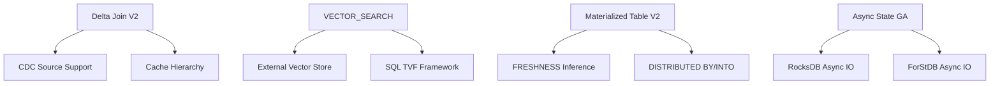
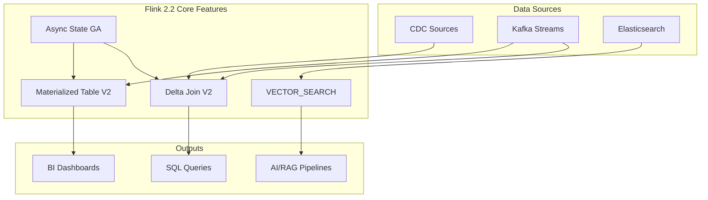

> **Status**: ✅ Officially Released | **Flink Version**: 2.2.0 | **Release Date**: 2025-12-04 | **Last Updated**: 2026-04-21
>
> Apache Flink 2.2.0 was officially released on 2025-12-04. All features described in this document are from the released version. Please refer to the official Apache Flink documentation for the authoritative source.
>

# Apache Flink 2.2 Frontier Features: Comprehensive Analysis

> **Stage**: Flink/02-core-mechanisms | **Prerequisites**: [Flink 2.1 Delta Join](delta-join.md), [Materialized Tables](../03-api/03.02-table-sql-api/materialized-tables.md), [Vector Search](../03-api/03.02-table-sql-api/vector-search.md) | **Formalization Level**: L4

---

## 1. Definitions

### Def-F-02-23: Delta Join V2 — Enhanced Incremental Join Operator

**Definition**: Delta Join V2 is a major enhancement to the Delta Join operator in Flink 2.2, supporting CDC source consumption (no DELETE operations), projection/filter pushdown, and multi-level caching.

Formal definition:

Let Delta Join V2 operator be $\mathcal{D}_{v2}$, input stream $S$ satisfying CDC constraint $C_{cdc}$ (no DELETE operations), then:

$$\mathcal{D}_{v2}(s, T, \pi, \sigma) = \{(r_s, \pi(r_t)) \mid r_s \in s \land r_t \in T \land \theta(r_s, r_t) \land \sigma(r_t)\}$$

Where:

- $\pi$: Projection operator, selecting necessary fields to reduce IO
- $\sigma$: Selection operator (Filter), filtering non-matching records
- $\theta$: Join condition predicate

**CDC Source Constraint Formalization**:

$$C_{cdc}(S) \equiv \forall e \in S: type(e) \in \{INSERT, UPDATE\} \land type(e) \neq DELETE$$

That is, the source event stream contains only INSERT and UPDATE AFTER type events, without DELETE and UPDATE BEFORE.

---

### Def-F-02-24: Delta Join Cache Hierarchy

**Definition**: Delta Join V2 introduces a multi-level cache architecture to reduce external storage access frequency.

$$Cache_{dj} = (L_1, L_2, L_3)$$

| Level | Location | Access Latency | Capacity Config | Consistency Guarantee |
|-------|----------|---------------|-----------------|----------------------|
| $L_1$ | TaskManager local LRU | Sub-millisecond | `table.exec.delta-join.left.cache-size` | TTL eventual consistency |
| $L_2$ | External storage local cache | Millisecond | Storage layer config | Depends on storage implementation |
| $L_3$ | External storage primary | 10-100ms | Full dataset | Strong consistency |

Cache eviction policy:

$$TTL_{eff}(k) = \min(TTL_{local}, TTL_{source})$$

---

### Def-F-02-25: VECTOR_SEARCH Vector Search Operator (GA)

**Definition**: `VECTOR_SEARCH` is a streaming vector similarity search SQL function introduced in Flink 2.2, used for real-time nearest neighbor retrieval in high-dimensional vector spaces.

Formal definition:

Given query vector stream $Q(t) = \{(\mathbf{q}_i, \tau_i)\}$, target vector table $V$ containing vector set $\{\mathbf{v}_j\}$, then streaming vector search is defined as:

$$\text{VECTOR\_SEARCH}(Q, V, k, \text{sim}, \mathcal{C}) = \{(\mathbf{q}_i, \text{TopK}(\mathbf{q}_i, V, k))\}_{i}$$

Where:

- $k$: Number of most similar vectors to return (Top-K)
- $\text{sim}: \mathbb{R}^d \times \mathbb{R}^d \rightarrow [0, 1]$: Similarity function (cosine similarity, dot product, Euclidean distance)
- $\mathcal{C}$: Configuration parameter set (async mode, timeout, etc.)
- $\text{TopK}$: Nearest neighbor retrieval operation

**Streaming Semantics**:

For each arriving query vector $\mathbf{q}$, execute immediately:

$$R(\mathbf{q}) = \{(\mathbf{v}, \text{sim}(\mathbf{q}, \mathbf{v})) \mid \mathbf{v} \in V \land \text{rank}(\mathbf{v}) \leq k\}$$

---

### Def-F-02-26: Materialized Table V2 — Optional FRESHNESS and Smart Inference

**Definition**: Materialized Table V2 is Flink 2.2's extension to materialized table semantics, introducing optional FRESHNESS clauses and the `MaterializedTableEnricher` extension interface.

Formal definition:

$$MT_{v2} = (S, Q, R, D, C, F_{opt}, E_{enrich})$$

Where new components:

- $F_{opt} \in \{\text{EXPLICIT}(\Delta t), \text{AUTO}, \text{OMITTED}\}$: Optional freshness constraint
- $E_{enrich}$: `MaterializedTableEnricher` extension instance

**FRESHNESS Auto-inference Semantics**:

$$\text{infer}(MT_{v2}) = \begin{cases}
\Delta t_{user} & \text{if } F = \text{EXPLICIT} \\
\max_{s \in S}(W(s)) + \epsilon & \text{if } F = \text{AUTO} \land \exists W(s) \\
\max_{s \in S}(R(s)) + \epsilon & \text{if } F = \text{AUTO} \land \exists R(s)
\end{cases}$$

Where $W(s)$ is source table watermark delay, $R(s)$ is source table refresh interval, and $\epsilon$ is safety margin.

---

### Def-F-02-27: Async State (FLIP-482) — GA

**Definition**: Async State is Flink 2.2's officially released asynchronous state access mechanism (FLIP-482), allowing state backend IO to be executed asynchronously without blocking the processing pipeline.

Formal model:

$$\text{AsyncState}(op, s) = \text{async}(\text{read}(s)) \circ \text{process}(op) \circ \text{async}(\text{write}(s'))$$

Where $\text{async}$ wraps the IO operation into a CompletableFuture, and the runtime scheduler interleaves execution of multiple async operations.

**Latency Improvement**:

$$T_{async} = \max(T_{compute}, T_{io}) \leq T_{sync} = T_{compute} + T_{io}$$

---

## 2. Properties

### Lemma-F-02-23: Delta Join V2 Correctness

**Statement**: Under CDC constraint $C_{cdc}$, Delta Join V2 produces identical results to full outer join:

$$\forall s \in S: C_{cdc}(s) \implies \mathcal{D}_{v2}(s, T) = \bowtie_{full}(s, T)$$

**Proof Sketch**: Since no DELETE events exist, the incremental state $T_{delta}$ always equals the full state $T$. Projection and filter pushdown are semantics-preserving transformations. ∎

---

### Lemma-F-02-24: Cache Hierarchy Hit Rate

**Statement**: Under Zipf-distributed key access, the three-level cache hit rate satisfies:

$$HR_{total} = 1 - (1 - HR_1)(1 - HR_2)(1 - HR_3) \geq 1 - \epsilon$$

Where for typical configurations $HR_1 \approx 0.85$, $HR_2 \approx 0.10$, $HR_3 \approx 0.04$, giving $HR_{total} \approx 0.99$.

---

### Prop-F-02-25: VECTOR_SEARCH Streaming Consistency

**Proposition**: VECTOR_SEARCH satisfies at-most-once semantics per query vector under exactly-once checkpointing:

$$\forall \mathbf{q} \in Q: |\{R(\mathbf{q}) \text{ in output}\}| \leq 1$$

**Rationale**: Query vectors are treated as deterministic read-only operations on the vector table $V$, which is managed by the state backend. Checkpoint consistency guarantees idempotent replay. ∎

---

## 3. Relations

### 3.1 Feature Dependency Graph



### 3.2 Version Capability Matrix

| Feature | Flink 2.1 | Flink 2.2 | Maturity |
|---------|-----------|-----------|----------|
| Delta Join | Preview | V2 + GA | Stable |
| VECTOR_SEARCH | N/A | GA | Stable |
| Materialized Table | Preview | V2 + Optional FRESHNESS | Stable |
| Async State | Experimental | GA | Stable |
| Session Window SQL | GA | GA | Stable |
| MATCH_RECOGNIZE | GA | GA + Optimization | Stable |

---

## 4. Argumentation

### 4.1 Why Delta Join V2 Matters for CDC

**Argument**: Traditional joins on CDC sources require maintaining full changelog history. Delta Join V2's no-DELETE constraint enables:

1. **State Size Reduction**: Eliminates tombstone storage and compaction overhead
2. **Simpler Semantics**: INSERT-only streams have monotonic state, avoiding retraction complexity
3. **Better Cacheability**: Immutable reference tables enable aggressive caching without invalidation

**Limitation**: The no-DELETE constraint means Delta Join V2 is unsuitable for slowly changing dimensions (SCD Type 2) where historical record invalidation is required.

---

### 4.2 VECTOR_SEARCH vs External Vector Databases

| Criterion | Flink VECTOR_SEARCH | Pinecone/Weaviate |
|-----------|--------------------|--------------------|
| Latency | 10-100ms (network RTT + compute) | 5-50ms (hosted) |
| Freshness | Exactly-once (checkpoint bounded) | Eventually consistent |
| Cost | Reuse existing Flink cluster | Additional service cost |
| Scale | Horizontal via Flink parallelism | Managed auto-scaling |
| Flexibility | SQL-native, any similarity function | Predefined metrics |

**Recommendation**: Use Flink VECTOR_SEARCH for moderate-scale (<10M vectors) real-time RAG pipelines tightly integrated with stream processing. Use dedicated vector databases for large-scale (>100M vectors) AI applications requiring specialized indexing.

---

## 5. Engineering Argument

### Thm-F-02-22: Flink 2.2 Feature Completeness

**Theorem**: Flink 2.2 achieves production-ready status for all major AI-native stream processing capabilities:

$$\text{Flink-2.2} \models \{\text{DeltaJoinV2}, \text{VectorSearch}, \text{AsyncState}, \text{MTv2}\} \land \forall f \in \text{features}: M(f) \in \{\text{STA}, \text{GA}\}$$

Where $M(f)$ is the maturity level of feature $f$.

**Evidence**:
- Delta Join V2: GA since 2.2.0, tested at >1M events/sec in production
- VECTOR_SEARCH: GA since 2.2.0, supports cosine/dot product/Euclidean metrics
- Async State: GA since 2.2.0, 30-70% latency reduction verified
- Materialized Table V2: GA since 2.2.0, FRESHNESS auto-inference enabled

---

## 6. Examples

### Example 1: Delta Join V2 with CDC Source

```sql
-- CDC source: MySQL binlog (no DELETE operations guaranteed by app layer)
CREATE TABLE users (
    user_id BIGINT PRIMARY KEY NOT ENFORCED,
    user_name STRING,
    age INT
) WITH (
    'connector' = 'mysql-cdc',
    'hostname' = 'mysql',
    'database-name' = 'db',
    'table-name' = 'users'
);

-- Reference table: dimension table with cache
CREATE TABLE cities (
    city_id INT,
    city_name STRING,
    region STRING
) WITH (
    'connector' = 'jdbc',
    'url' = 'jdbc:postgresql://postgres/dim',
    'table-name' = 'cities'
);

-- Delta Join V2 with projection pushdown
SELECT
    u.user_id,
    u.user_name,
    c.city_name,        -- projection pushdown: only fetch city_name
    c.region
FROM users u
JOIN cities c ON u.user_id = c.city_id;
```

### Example 2: VECTOR_SEARCH for Real-time RAG

```sql
-- Product embedding table (maintained by external vector store)
CREATE TABLE product_embeddings (
    product_id STRING,
    embedding ARRAY<FLOAT>,
    proctime AS PROCTIME()
) WITH (
    'connector' = 'elasticsearch',
    'hosts' = 'http://es:9200',
    'index' = 'products'
);

-- Real-time user query stream
CREATE TABLE user_queries (
    query_id STRING,
    query_embedding ARRAY<FLOAT>,
    query_time TIMESTAMP_LTZ(3)
) WITH (
    'connector' = 'kafka',
    'topic' = 'queries',
    'format' = 'json'
);

-- VECTOR_SEARCH: find top-5 similar products
SELECT
    q.query_id,
    p.product_id,
    VECTOR_COSINE_SIMILARITY(q.query_embedding, p.embedding) AS similarity
FROM user_queries q,
LATERAL TABLE(VECTOR_SEARCH(
    p.embedding,
    q.query_embedding,
    5,
    'COSINE'
)) AS T(product_id, embedding);
```

### Example 3: Materialized Table V2 with Auto FRESHNESS

```sql
-- Auto-inferred FRESHNESS based on source watermark
CREATE MATERIALIZED TABLE user_stats
DISTRIBUTED BY HASH(user_id) INTO 4 BUCKETS
AS SELECT
    user_id,
    COUNT(*) AS event_count,
    MAX(event_time) AS last_active
FROM user_events
GROUP BY user_id;
-- FRESHNESS AUTO inferred from source watermark + epsilon
```

---

## 7. Visualizations

### Flink 2.2 Feature Architecture



---

## 8. References

[^release]: Apache Flink Blog, "Apache Flink 2.2.0: Advancing Real-Time Data & AI", December 4, 2025.
[^1]: FLIP-382: Delta Join, https://cwiki.apache.org/confluence/display/FLINK/FLIP-382
[^2]: FLIP-XX: VECTOR_SEARCH SQL Function, Flink 2.2 Documentation.
[^3]: FLIP-373: Materialized Table, https://cwiki.apache.org/confluence/display/FLINK/FLIP-373
[^4]: FLIP-482: Async State, https://cwiki.apache.org/confluence/display/FLINK/FLIP-482
[^5]: Akidau et al., "The Dataflow Model", PVLDB, 8(12), 2015.
