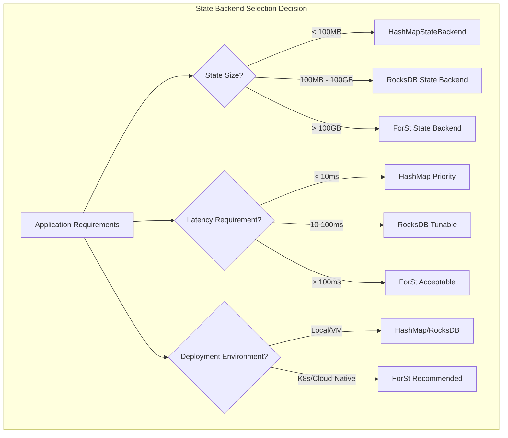
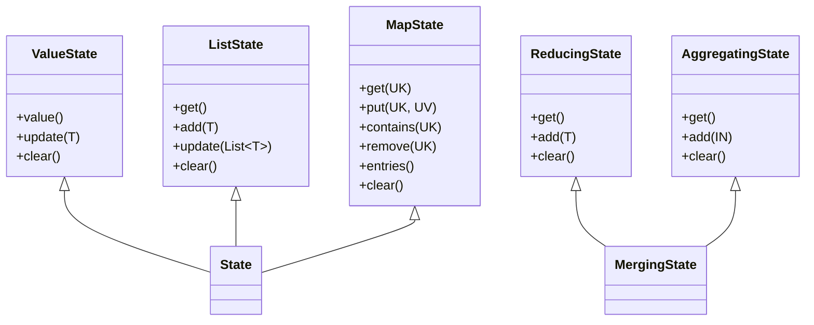
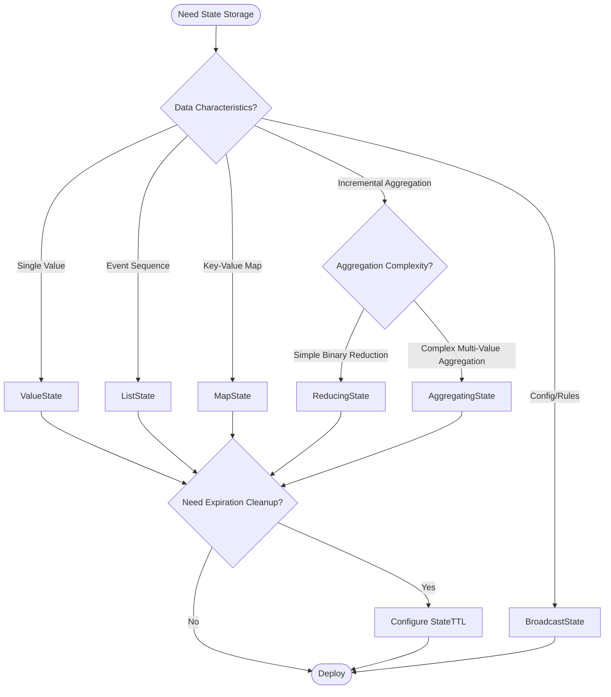
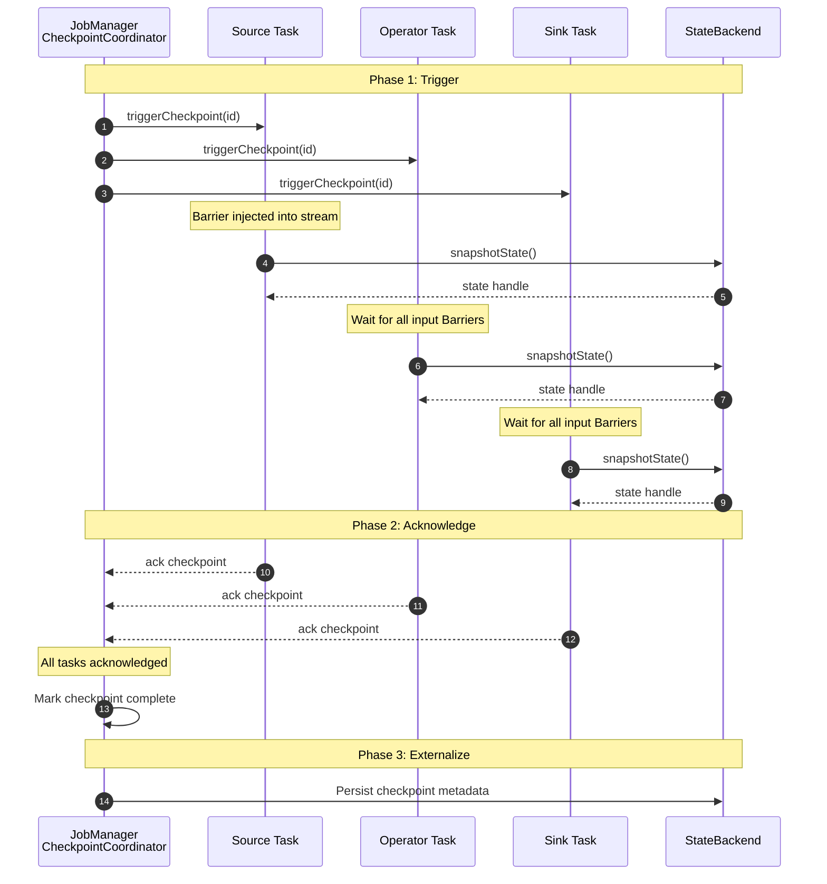
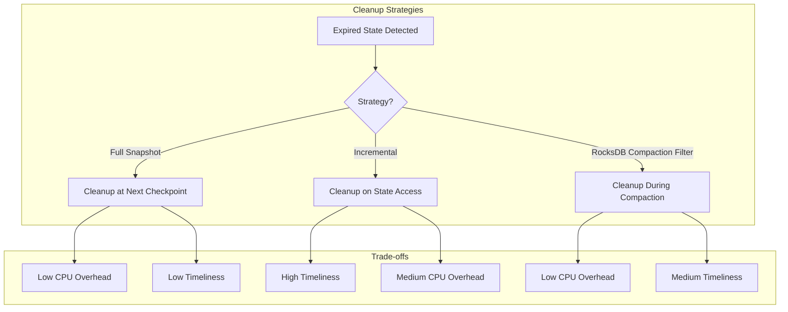

# Flink State Management Complete Guide

> **Stage**: Flink/02-core-mechanisms | **Prerequisites**: [checkpoint-mechanism-deep-dive-en.md](./checkpoint-mechanism-deep-dive-en.md), [flink-state-ttl-best-practices-en.md](./flink-state-ttl-best-practices-en.md), [forst-state-backend-en.md](./forst-state-backend-en.md) | **Formalization Level**: L4

---

## Table of Contents

- [Flink State Management Complete Guide](#flink-state-management-complete-guide)
  - [Table of Contents](#table-of-contents)
  - [1. Definitions](#1-definitions)
    - [Def-F-02-90: State Backend](#def-f-02-90-state-backend)
    - [Def-F-02-91: HashMapStateBackend](#def-f-02-91-hashmapstatebackend)
    - [Def-F-02-92: EmbeddedRocksDBStateBackend](#def-f-02-92-embeddedrocksdbstatebackend)
    - [Def-F-02-93: ForStStateBackend (Flink 2.0+)](#def-f-02-93-forststatebackend-flink-20)
    - [Def-F-02-94: Keyed State](#def-f-02-94-keyed-state)
    - [Def-F-02-95: Operator State](#def-f-02-95-operator-state)
    - [Def-F-02-96: Checkpoint](#def-f-02-96-checkpoint)
    - [Def-F-02-97: State TTL](#def-f-02-97-state-ttl)
    - [Def-F-02-98: Changelog State Backend (Flink 1.15+)](#def-f-02-98-changelog-state-backend-flink-115)
  - [2. Properties](#2-properties)
    - [Lemma-F-02-70: State Backend Latency Characteristics](#lemma-f-02-70-state-backend-latency-characteristics)
    - [Lemma-F-02-71: State Backend Capacity Scalability](#lemma-f-02-71-state-backend-capacity-scalability)
    - [Prop-F-02-70: State Type Selection Theorem](#prop-f-02-70-state-type-selection-theorem)
    - [Prop-F-02-71: Checkpoint Consistency Guarantee](#prop-f-02-71-checkpoint-consistency-guarantee)
  - [3. Relations](#3-relations)
    - [3.1 State Backend to Application Scenario Mapping](#31-state-backend-to-application-scenario-mapping)
    - [3.2 State Type to Operation Semantic Relations](#32-state-type-to-operation-semantic-relations)
    - [3.3 Checkpoint Mechanism and Consistency Levels](#33-checkpoint-mechanism-and-consistency-levels)
  - [4. Argumentation](#4-argumentation)
    - [4.1 State Backend Deep Comparison](#41-state-backend-deep-comparison)
      - [4.1.1 Performance Comparison Matrix](#411-performance-comparison-matrix)
      - [4.1.2 Technical Implementation Differences](#412-technical-implementation-differences)
    - [4.2 State Type Selection Decision Tree](#42-state-type-selection-decision-tree)
    - [4.3 Checkpoint Mechanism Details](#43-checkpoint-mechanism-details)
      - [4.3.1 Full Checkpoint vs Incremental Checkpoint vs Changelog](#431-full-checkpoint-vs-incremental-checkpoint-vs-changelog)
      - [4.3.2 Checkpoint Configuration Parameters](#432-checkpoint-configuration-parameters)
    - [4.4 State TTL Expiration Policies](#44-state-ttl-expiration-policies)
  - [5. Proof / Engineering Argument](#5-proof-engineering-argument)
    - [Thm-F-02-90: State Backend Selection Optimality Theorem](#thm-f-02-90-state-backend-selection-optimality-theorem)
    - [Thm-F-02-91: Checkpoint Completeness Theorem](#thm-f-02-91-checkpoint-completeness-theorem)
    - [Thm-F-02-92: State TTL Consistency Theorem](#thm-f-02-92-state-ttl-consistency-theorem)
    - [Engineering Argument: State Query Performance Optimization](#engineering-argument-state-query-performance-optimization)
  - [6. Examples](#6-examples)
    - [6.1 ValueState Example](#61-valuestate-example)
    - [6.2 ListState Example](#62-liststate-example)
    - [6.3 MapState Example](#63-mapstate-example)
    - [6.4 ReducingState Example](#64-reducingstate-example)
    - [6.5 AggregatingState Example](#65-aggregatingstate-example)
    - [6.6 BroadcastState Example](#66-broadcaststate-example)
    - [6.7 State Backend Configuration Example](#67-state-backend-configuration-example)
  - [7. Visualizations](#7-visualizations)
    - [7.1 State Backend Architecture Comparison](#71-state-backend-architecture-comparison)
    - [7.2 State Type Selection Decision Tree](#72-state-type-selection-decision-tree)
    - [7.3 Checkpoint Lifecycle Sequence Diagram](#73-checkpoint-lifecycle-sequence-diagram)
    - [7.4 TTL Cleanup Strategy Comparison](#74-ttl-cleanup-strategy-comparison)
  - [8. Performance Tuning and Troubleshooting](#8-performance-tuning-and-troubleshooting)
    - [8.1 State Backend Selection Guide](#81-state-backend-selection-guide)
      - [8.1.1 Decision Matrix](#811-decision-matrix)
      - [8.1.2 Configuration Template](#812-configuration-template)
    - [8.2 State Type Performance Tuning](#82-state-type-performance-tuning)
      - [8.2.1 ValueState Optimization](#821-valuestate-optimization)
      - [8.2.2 MapState Optimization](#822-mapstate-optimization)
      - [8.2.3 ListState Optimization](#823-liststate-optimization)
    - [8.3 Checkpoint Tuning](#83-checkpoint-tuning)
      - [8.3.1 Timeout and Retry Configuration](#831-timeout-and-retry-configuration)
      - [8.3.2 Unaligned Checkpoint Configuration](#832-unaligned-checkpoint-configuration)
    - [8.4 TTL Configuration Best Practices](#84-ttl-configuration-best-practices)
      - [8.4.1 SQL-Style State TTL Configuration](#841-sql-style-state-ttl-configuration)
      - [8.4.2 State TTL Important Behaviors](#842-state-ttl-important-behaviors)
      - [8.4.3 TTL Duration Calculation](#843-ttl-duration-calculation)
      - [8.4.4 Cleanup Strategy Selection](#844-cleanup-strategy-selection)
    - [8.5 Troubleshooting Guide](#85-troubleshooting-guide)
      - [8.5.1 Checkpoint Frequent Timeout](#851-checkpoint-frequent-timeout)
      - [8.5.2 State Continuous Growth (OOM Risk)](#852-state-continuous-growth-oom-risk)
      - [8.5.3 State Access Performance Issues](#853-state-access-performance-issues)
    - [8.6 Changelog State Backend Production Configuration](#86-changelog-state-backend-production-configuration)
      - [8.6.1 Enable Changelog State Backend](#861-enable-changelog-state-backend)
      - [8.6.2 Changelog Configuration Parameters](#862-changelog-configuration-parameters)
    - [8.7 State Migration and Upgrade](#87-state-migration-and-upgrade)
      - [8.7.1 Savepoint vs Checkpoint Comparison](#871-savepoint-vs-checkpoint-comparison)
      - [8.7.2 State Compatibility Rules](#872-state-compatibility-rules)
      - [8.7.3 Upgrade Operation Flow](#873-upgrade-operation-flow)
  - [9. References](#9-references)

---

## 1. Definitions

### Def-F-02-90: State Backend

**Definition**: State Backend is Flink's runtime component responsible for state storage, access, and snapshot persistence, formally defined as:

$$
\text{StateBackend} = \langle \text{Storage}, \text{Serialization}, \text{Snapshot}, \text{Recovery} \rangle
$$

Where:

- $\text{Storage}$: State physical storage medium (memory/disk/distributed storage)
- $\text{Serialization}$: State serialization/deserialization strategy
- $\text{Snapshot}$: State snapshot generation mechanism
- $\text{Recovery}$: Fault recovery strategy

Flink 1.x/2.x provides three main State Backends:

| State Backend | Storage Location | Serialization | Applicable Scenario |
|--------------|-----------------|---------------|---------------------|
| HashMapStateBackend | JVM Heap | Async snapshot | Small state, low latency |
| EmbeddedRocksDBStateBackend | Local RocksDB | Incremental snapshot | Large state, high throughput |
| ForStStateBackend (Flink 2.0+) | Distributed storage + local cache | Metadata snapshot | Ultra-large scale, cloud-native |

---

### Def-F-02-91: HashMapStateBackend

**Definition**: HashMapStateBackend is a JVM heap memory-based state backend using `HashMap` data structure for key-value state storage:

$$
\text{HashMapStateBackend} = \langle \text{Heap}_K, \text{TypeSerializer}_T, \text{AsyncSnapshot} \rangle
$$

**Core Features**:

1. **Storage Model**: Each key-value state corresponds to a `HashMap<K, T>`
2. **Access Latency**: $O(1)$ average time complexity
3. **Snapshot Mechanism**: Async copy-on-write, non-blocking data stream processing
4. **Memory Management**: Limited by TaskManager heap memory size

**Constraints**:

$$
|S_{total}| \leq \text{taskmanager.memory.framework.heap.size} - \text{overhead}
$$

---

### Def-F-02-92: EmbeddedRocksDBStateBackend

**Definition**: EmbeddedRocksDBStateBackend uses embedded RocksDB engine for state storage, based on LSM-Tree data structure:

$$
\text{RocksDBStateBackend} = \langle \text{LSM-Tree}, \text{SSTFiles}, \text{MemTable}, \text{WAL} \rangle
$$

**Core Features**:

1. **Storage Model**: LSM-Tree structure, writes first enter MemTable, then flush to SST files
2. **Access Latency**: Point query $O(\log N)$, range query $O(\log N + K)$ ($K$ is result count)
3. **Storage Capacity**: Limited by local disk capacity
4. **Serialization**: State values use `TypeSerializer` to serialize to byte arrays for storage

**LSM-Tree Structure**:

$$
\text{RocksDB} = \text{MemTable} \cup \left( \bigcup_{i=0}^{L} \text{Level}_i \right)
$$

Where $\text{Level}_i$ contains SST files sorted by key, satisfying $\forall f \in \text{Level}_i: |f| \leq s \cdot r^i$ ($s$ is base size, $r$ is level multiplier)[^1].

---

### Def-F-02-93: ForStStateBackend (Flink 2.0+)

**Definition**: ForSt (For Streaming) is a disaggregated state backend introduced in Flink 2.0, storing state primarily in distributed file systems:

$$
\text{ForStStateBackend} = \langle \text{UFS}, \text{LocalCache}, \text{LazyRestore}, \text{RemoteCompaction} \rangle
$$

Where:

- $\text{UFS}$ (Unified File System): Distributed storage abstraction (S3/HDFS/GCS)
- $\text{LocalCache}$: Local hot data cache (LRU/SLRU management)
- $\text{LazyRestore}$: Lazy recovery mechanism, loading state on demand
- $\text{RemoteCompaction}$: Remote compaction service

---

### Def-F-02-94: Keyed State

**Definition**: Keyed State is state bound to a specific key, available only on `KeyedStream`:

$$
\text{KeyedState} = \{ s_k \mid k \in \text{KeySpace}, s_k \in \text{StateValue} \}
$$

**State Type Classification**:

| State Type | Symbol | Semantics | Applicable Scenario |
|-----------|--------|-----------|---------------------|
| ValueState | $V_k$ | Single value state | Latest value storage |
| ListState | $L_k$ | List state | Event sequence |
| MapState | $M_k$ | Map state | Key-value aggregation |
| ReducingState | $R_k$ | Reducing state | Incremental aggregation |
| AggregatingState | $A_k$ | Aggregating state | Complex aggregation |

---

### Def-F-02-95: Operator State

**Definition**: Operator State is state bound to operator instances, not dependent on key:

$$
\text{OperatorState} = \langle \text{Instance}_i, \text{StatePartitions}, \text{RescaleMode} \rangle
$$

**State Types**:

| Type | Description | Rescaling Strategy |
|------|-------------|-------------------|
| List State | List state | Even redistribution |
| Union List State | Union list state | Full broadcast |
| Broadcast State | Broadcast state | Full replication |

---

### Def-F-02-96: Checkpoint

**Definition**: Checkpoint is a globally consistent state snapshot of a distributed stream processing job at a given moment:

$$
\text{Checkpoint} = \langle ID, TS, \{S_i\}_{i \in Tasks}, \text{Metadata} \rangle
$$

**Checkpoint Types**:

| Type | Symbol | Description |
|------|--------|-------------|
| Full Checkpoint | $CP_{full}$ | Full state snapshot |
| Incremental Checkpoint | $CP_{inc}$ | Only captures changed state |
| Aligned Checkpoint | $CP_{align}$ | Barrier-aligned trigger |
| Unaligned Checkpoint | $CP_{unaligned}$ | Non-aligned trigger |

---

### Def-F-02-97: State TTL

**Definition**: State TTL is the automatic expiration cleanup mechanism for state:

$$
\text{StateTTL} = \langle \tau, \text{UpdateType}, \text{Visibility}, \text{CleanupStrategy} \rangle
$$

Where:

- $\tau$: TTL duration
- $\text{UpdateType} \in \{ \text{OnCreateAndWrite}, \text{OnReadAndWrite}, \text{Disabled} \}$
- $\text{Visibility} \in \{ \text{NeverReturnExpired}, \text{ReturnExpiredIfNotCleanedUp} \}$
- $\text{CleanupStrategy} \in \{ \text{FullSnapshot}, \text{Incremental}, \text{CompactionFilter} \}$

### Def-F-02-98: Changelog State Backend (Flink 1.15+)

**Definition**: Changelog State Backend is a state backend enhancement mechanism achieving second-level recovery through real-time materialization of state changes[^4]:

$$
\text{ChangelogStateBackend} = \langle \text{BaseBackend}, \text{ChangelogStorage}, \text{PeriodicMaterialization} \rangle
$$

**Core Mechanisms**:

1. **Real-time Materialization**: State changes are continuously written to Changelog, not just periodically at Checkpoint
2. **Parallel Recovery**: During recovery, base Checkpoint + Changelog are read in parallel, achieving second-level recovery
3. **Storage Separation**: Changelog is stored separately from base state, supporting independent lifecycle management

**Configuration Example**:

```yaml
# flink-conf.yaml
state.backend.changelog.enabled: true
state.backend.changelog.storage: filesystem
state.backend.changelog.periodic-materialization.interval: 10min
```

---

## 2. Properties

### Lemma-F-02-70: State Backend Latency Characteristics

**Lemma**: The state access latencies of the three State Backends satisfy the following inequality:

$$
\text{Latency}_{HashMap} < \text{Latency}_{RocksDB}^{cache\_hit} < \text{Latency}_{ForSt}^{cache\_hit} < \text{Latency}_{RocksDB}^{cache\_miss} < \text{Latency}_{ForSt}^{cache\_miss}
$$

**Proof**:

1. **HashMap**: Direct memory access, nanosecond-level latency
2. **RocksDB Cache Hit**: Memory Block Cache, sub-microsecond level
3. **ForSt Cache Hit**: Local cache access, microsecond level
4. **RocksDB Cache Miss**: Local disk I/O, millisecond level
5. **ForSt Cache Miss**: Network I/O to distributed storage, tens of milliseconds level

$\square$

---

### Lemma-F-02-71: State Backend Capacity Scalability

**Lemma**: The capacity upper bounds of the three State Backends satisfy:

$$
\text{Capacity}_{HashMap} \ll \text{Capacity}_{RocksDB} < \text{Capacity}_{ForSt} \approx \infty
$$

**Proof**:

- **HashMap**: Limited by TM heap memory (typically < 10GB)
- **RocksDB**: Limited by TM local disk (typically 100GB - several TB)
- **ForSt**: Limited by distributed storage capacity (theoretically unbounded)

$\square$

---

### Prop-F-02-70: State Type Selection Theorem

**Proposition**: For keyed state operations, the optimal state type selection satisfies:

| Operation Mode | Optimal State Type | Complexity |
|---------------|-------------------|-----------|
| Single-value read/write | ValueState | $O(1)$ |
| Append sequence | ListState | $O(1)$ append |
| Key-value mapping | MapState | $O(1)$ per key |
| Incremental reduction | ReducingState | $O(1)$ space |
| Complex aggregation | AggregatingState | $O(1)$ space |

**Inference**: Using the wrong state type causes space or time complexity degradation. For example, using ListState to store aggregate values requires $O(N)$ space, while ReducingState only needs $O(1)$.

---

### Prop-F-02-71: Checkpoint Consistency Guarantee

**Proposition**: If Checkpoint uses Aligned mode and State Backend provides atomic snapshots, then recovered state satisfies:

$$
\text{restore}(CP_n) = S_{t_n}
$$

Where $S_{t_n}$ is the true state at Checkpoint $n$ time.

---

## 3. Relations

### 3.1 State Backend to Application Scenario Mapping



**Detailed Mapping Table**:

| Scenario Feature | Recommended Backend | Reason |
|-----------------|--------------------|--------|
| Small state (< 100MB), low latency | HashMapStateBackend | Memory access, nanosecond latency |
| Medium state (100MB - 10GB) | RocksDB + Full Checkpoint | Disk storage, async snapshot |
| Large state (> 10GB) | RocksDB + Incremental Checkpoint | Reduce I/O, lower timeout risk |
| Ultra-large scale (> 1TB) | ForSt | Disaggregated storage, elastic scaling |
| Frequent point queries | HashMapStateBackend | $O(1)$ hash lookup |
| Range scans | RocksDB/ForSt | LSM-Tree optimization |
| Cloud-native deployment | ForSt | Storage-compute separation, cost optimization |

---

### 3.2 State Type to Operation Semantic Relations



---

### 3.3 Checkpoint Mechanism and Consistency Levels

| Checkpoint Mode | Alignment Strategy | Consistency Guarantee | Latency Impact |
|----------------|-------------------|----------------------|---------------|
| Aligned + Exactly-Once | Barrier alignment | Strong consistency | Medium |
| Unaligned + Exactly-Once | Non-aligned + in-flight data | Strong consistency | Low |
| Aligned + At-Least-Once | Barrier non-alignment | At-least-once | Low |

**Relation Derivation**:

$$
\text{Exactly-Once} \Rightarrow \text{Aligned} \lor (\text{Unaligned} \land \text{InFlightSnapshot})
$$

---

## 4. Argumentation

### 4.1 State Backend Deep Comparison

#### 4.1.1 Performance Comparison Matrix

| Dimension | HashMapStateBackend | EmbeddedRocksDBStateBackend | ForStStateBackend |
|-----------|--------------------|----------------------------|-------------------|
| **Access Latency** | ⭐⭐⭐⭐⭐ (ns) | ⭐⭐⭐ (μs-ms) | ⭐⭐ (ms) |
| **Storage Capacity** | ⭐⭐ (< 10GB) | ⭐⭐⭐⭐ (TB) | ⭐⭐⭐⭐⭐ (PB) |
| **Checkpoint Speed** | ⭐⭐⭐ (full) | ⭐⭐⭐⭐ (incremental) | ⭐⭐⭐⭐⭐ (metadata) |
| **Recovery Speed** | ⭐⭐⭐⭐ | ⭐⭐⭐ | ⭐⭐⭐⭐⭐ (LazyRestore) |
| **Memory Efficiency** | ⭐⭐ | ⭐⭐⭐⭐ | ⭐⭐⭐⭐⭐ |
| **CPU Overhead** | ⭐⭐⭐⭐⭐ (low) | ⭐⭐⭐ (medium) | ⭐⭐ (high serialization) |
| **Disk I/O** | None | High | Medium (network I/O) |
| **Serialization Overhead** | Only at Checkpoint | Every read/write | Every read/write |
| **Cloud-Native Friendly** | ⭐⭐ | ⭐⭐⭐ | ⭐⭐⭐⭐⭐ |
| **Cost Efficiency** | ⭐⭐⭐ | ⭐⭐⭐ | ⭐⭐⭐⭐⭐ |

#### 4.1.2 Technical Implementation Differences



---

### 4.2 State Type Selection Decision Tree



---

### 4.3 Checkpoint Mechanism Details

#### 4.3.1 Full Checkpoint vs Incremental Checkpoint vs Changelog

| Feature | Full Checkpoint | Incremental Checkpoint | Changelog State Backend |
|--------|----------------|----------------------|------------------------|
| Snapshot Content | Complete state data | Changes since last Checkpoint | Real-time state change stream |
| Storage Overhead | $O(|S|)$ | $O(|\Delta S|)$ | $O(|S|) + O(|Changelog|)$ |
| Recovery Time | $O(|S|)$ | $O(|S|)$ (needs merge) | $O(|S_{base}|) + O(|Changelog|)$ (parallel) |
| Network Transfer | Large | Small | Continuous |
| Recovery Speed | Minute-level | Minute-level | Second-level |
| Applicable Scenario | Small state | Large state | Latency-sensitive, second-level recovery needs |

**Changelog State Backend Principle**:

Based on real-time materialization of state changes:

$$
CP_n^{changelog} = \{ \delta_1, \delta_2, \ldots, \delta_n \} \quad \text{where} \quad \delta_i = S_{t_i} - S_{t_{i-1}}
$$

**RocksDB Incremental Checkpoint Principle**:

Based on SST file immutability:

$$
CP_n^{inc} = \{ f \in \text{SST}_n \mid f \notin \text{SST}_{n-1} \}
$$

#### 4.3.2 Checkpoint Configuration Parameters

```java
import java.time.Duration;
import org.apache.flink.configuration.Configuration;
import org.apache.flink.contrib.streaming.state.EmbeddedRocksDBStateBackend;
import org.apache.flink.streaming.api.CheckpointingMode;
import org.apache.flink.streaming.api.environment.StreamExecutionEnvironment;

public class Example {
    public static void main(String[] args) throws Exception {
        StreamExecutionEnvironment env = StreamExecutionEnvironment.getExecutionEnvironment();

        // Basic configuration
        env.enableCheckpointing(60000);  // 60-second interval
        env.getCheckpointConfig().setCheckpointingMode(CheckpointingMode.EXACTLY_ONCE);
        env.getCheckpointConfig().setCheckpointTimeout(600000);  // 10-minute timeout
        env.getCheckpointConfig().setMaxConcurrentCheckpoints(1);
        env.getCheckpointConfig().setMinPauseBetweenCheckpoints(30000);

        // Incremental Checkpoint (RocksDB)
        env.setStateBackend(new EmbeddedRocksDBStateBackend(true));

        // Unaligned Checkpoint
        env.getCheckpointConfig().enableUnalignedCheckpoints();
        env.getCheckpointConfig().setAlignmentTimeout(Duration.ofSeconds(30));

        // Changelog State Backend (Flink 1.15+)
        Configuration config = new Configuration();
        config.setBoolean("state.backend.changelog.enabled", true);
        config.setString("state.backend.changelog.storage", "filesystem");
        env.configure(config);
    }
}
```

---

### 4.4 State TTL Expiration Policies

| Policy | Trigger Timing | Timeliness | CPU Overhead |
|--------|---------------|------------|-------------|
| Full Snapshot | Checkpoint completion | Low | Low |
| Incremental | State access | High | Medium |
| RocksDB Compaction Filter | Compaction time | Medium | Low |

**TTL Configuration Elements**:

$$
\text{TTL}_{effective} = \text{base TTL} + \text{cleanup delay}
$$

Where cleanup delay depends on the chosen cleanup strategy.

---

## 5. Proof / Engineering Argument

### Thm-F-02-90: State Backend Selection Optimality Theorem

**Theorem**: For a given application feature vector $\vec{A} = \langle \text{size}, \text{latency}, \text{throughput}, \text{cost} \rangle$, there exists a unique State Backend selection $B^*$ minimizing the comprehensive cost function:

$$
B^* = \arg\min_{B \in \mathcal{B}} \mathcal{C}(\vec{A}, B)
$$

Where the cost function:

$$
\mathcal{C}(\vec{A}, B) = w_1 \cdot \text{LatencyCost} + w_2 \cdot \text{StorageCost} + w_3 \cdot \text{CheckpointCost} + w_4 \cdot \text{RecoveryCost}
$$

**Proof**:

**Case 1**: When $\text{size} < 100\text{MB}$ and $\text{latency} < 10\text{ms}$:

- HashMap: $\mathcal{C} = 0 + O(1) + O(|S|) + O(|S|)$ (low latency advantage)
- RocksDB: $\mathcal{C} = O(\log N) + O(1) + O(|\Delta S|) + O(|S|)$
- ForSt: $\mathcal{C} = O(\text{network}) + O(0.1) + O(1) + O(|M|)$

HashMap has lowest latency cost, therefore $B^* = \text{HashMap}$.

**Case 2**: When $100\text{MB} < \text{size} < 10\text{GB}$:

RocksDB's incremental Checkpoint significantly reduces network transfer cost, comprehensively optimal.

**Case 3**: When $\text{size} > 100\text{GB}$:

ForSt's disaggregated storage architecture breaks through local capacity limits, the only feasible solution.

$\square$

---

### Thm-F-02-91: Checkpoint Completeness Theorem

**Theorem**: For any Checkpoint sequence $CP_1, CP_2, \ldots, CP_n$, if each Checkpoint completes successfully, then the recovered state $S_{recovered}$ equals the state corresponding to the latest successful Checkpoint:

$$
S_{recovered} = S_{CP_{\max \{ i \mid CP_i \text{ completed} \}}}
$$

**Proof**:

Based on the correctness of the Chandy-Lamport snapshot algorithm[^2], Flink Checkpoint forms a consistent cut. Each operator state snapshot occurs after receiving all input Barriers, therefore capturing the complete processing result up to the Barrier.

During recovery, the system reconstructs state from Checkpoint metadata and replays data after Checkpoint. Since the data source is replayable and operators are deterministic, the recovered execution trace is equivalent to the original execution.

$\square$

---

### Thm-F-02-92: State TTL Consistency Theorem

**Theorem**: TTL configured as `NeverReturnExpired` guarantees:

$$
\forall s \in \text{State}: \text{read}(s) \neq \bot \Rightarrow t_{now} - t_{lastAccess} \leq \tau
$$

**Proof**:

TTL filter checks expiration condition on every state access. If state is expired and visibility is `NeverReturnExpired`, the filter returns `null`, and upper-layer logic treats the state as non-existent.

Since clocks are monotonically increasing, once a state expires, it will always satisfy the expiration condition and will never incorrectly return an expired value.

$\square$

---

### Engineering Argument: State Query Performance Optimization

**QueryableState Architecture** [^3]:

QueryableState allows external clients to directly query Flink internal state, but with the following limitations:

1. **Consistency Limitation**: Query results reflect a snapshot at some moment, not real-time updates
2. **Performance Impact**: High-concurrency queries affect normal data processing
3. **Availability Limitation**: Query target Task must be running

**Optimization Strategy**:

$$
\text{QueryThroughput} = \frac{\text{AvailableThreads}}{\text{QueryLatency} + \text{StateAccessTime}}
$$

By increasing QueryableState Server thread count and optimizing state access paths, query throughput can be improved.

---

## 6. Examples

### 6.1 ValueState Example

```java
import org.apache.flink.api.common.state.ValueState;
import org.apache.flink.api.common.state.ValueStateDescriptor;
import org.apache.flink.api.common.time.Time;
import org.apache.flink.configuration.Configuration;
import org.apache.flink.streaming.api.functions.KeyedProcessFunction;
import org.apache.flink.util.Collector;

/**
 * Def-F-02-98: Session state management with TTL
 */
public class SessionTracker extends KeyedProcessFunction<String, Event, SessionResult> {

    private ValueState<SessionInfo> sessionState;
    private static final long SESSION_TIMEOUT_MS = Time.minutes(30).toMilliseconds();

    @Override
    public void open(Configuration parameters) {
        StateTtlConfig ttlConfig = StateTtlConfig
            .newBuilder(Time.minutes(30))
            .setUpdateType(StateTtlConfig.UpdateType.OnReadAndWrite)
            .setStateVisibility(StateTtlConfig.StateVisibility.NeverReturnExpired)
            .cleanupIncrementally(10, true)
            .build();

        ValueStateDescriptor<SessionInfo> descriptor = new ValueStateDescriptor<>(
            "session-info", SessionInfo.class
        );
        descriptor.enableTimeToLive(ttlConfig);
        sessionState = getRuntimeContext().getState(descriptor);
    }

    @Override
    public void processElement(Event event, Context ctx, Collector<SessionResult> out)
            throws Exception {
        SessionInfo session = sessionState.value();
        long currentTime = ctx.timestamp();

        if (session == null) {
            session = new SessionInfo(event.getUserId(), currentTime);
        } else if (currentTime - session.getLastActivityTime() > SESSION_TIMEOUT_MS) {
            out.collect(new SessionResult(session, true));
            session = new SessionInfo(event.getUserId(), currentTime);
        }

        session.addEvent(event);
        sessionState.update(session);

        ctx.timerService().registerEventTimeTimer(
            session.getLastActivityTime() + SESSION_TIMEOUT_MS
        );
    }

    @Override
    public void onTimer(long timestamp, OnTimerContext ctx, Collector<SessionResult> out)
            throws Exception {
        SessionInfo session = sessionState.value();
        if (session != null && timestamp >= session.getLastActivityTime() + SESSION_TIMEOUT_MS) {
            out.collect(new SessionResult(session, true));
            sessionState.clear();
        }
    }
}
```

---

### 6.2 ListState Example

```java
/**
 * Def-F-02-99: Event buffer - batch processing mode
 */
public class EventBuffer extends KeyedProcessFunction<String, Event, List<Event>> {

    private ListState<Event> bufferedEvents;
    private static final int BATCH_SIZE = 100;
    private static final long FLUSH_INTERVAL_MS = 5000;

    @Override
    public void open(Configuration parameters) {
        ListStateDescriptor<Event> descriptor = new ListStateDescriptor<>(
            "event-buffer", Event.class
        );
        bufferedEvents = getRuntimeContext().getListState(descriptor);
    }

    @Override
    public void processElement(Event event, Context ctx, Collector<List<Event>> out)
            throws Exception {
        bufferedEvents.add(event);

        Iterable<Event> events = bufferedEvents.get();
        int count = 0;
        for (Event e : events) count++;

        if (count >= BATCH_SIZE) flushBuffer(out);

        ctx.timerService().registerProcessingTimeTimer(
            ctx.timerService().currentProcessingTime() + FLUSH_INTERVAL_MS
        );
    }

    @Override
    public void onTimer(long timestamp, OnTimerContext ctx, Collector<List<Event>> out)
            throws Exception {
        flushBuffer(out);
    }

    private void flushBuffer(Collector<List<Event>> out) throws Exception {
        List<Event> batch = new ArrayList<>();
        for (Event event : bufferedEvents.get()) batch.add(event);
        if (!batch.isEmpty()) {
            out.collect(batch);
            bufferedEvents.clear();
        }
    }
}
```

---

### 6.3 MapState Example

```java
/**
 * Def-F-02-100: User behavior counter - MapState application
 */
public class UserBehaviorCounter extends KeyedProcessFunction<String, UserEvent, Metrics> {

    private MapState<String, Long> behaviorCounts;
    private MapState<String, Long> lastUpdateTime;

    @Override
    public void open(Configuration parameters) {
        StateTtlConfig ttlConfig = StateTtlConfig
            .newBuilder(Time.days(7))
            .setUpdateType(StateTtlConfig.UpdateType.OnCreateAndWrite)
            .setStateVisibility(StateTtlConfig.StateVisibility.NeverReturnExpired)
            .cleanupInRocksdbCompactFilter(1000)
            .build();

        MapStateDescriptor<String, Long> countDescriptor = new MapStateDescriptor<>(
            "behavior-counts", String.class, Long.class
        );
        countDescriptor.enableTimeToLive(ttlConfig);
        behaviorCounts = getRuntimeContext().getMapState(countDescriptor);

        MapStateDescriptor<String, Long> timeDescriptor = new MapStateDescriptor<>(
            "last-update", String.class, Long.class
        );
        timeDescriptor.enableTimeToLive(ttlConfig);
        lastUpdateTime = getRuntimeContext().getMapState(timeDescriptor);
    }

    @Override
    public void processElement(UserEvent event, Context ctx, Collector<Metrics> out)
            throws Exception {
        String behavior = event.getBehaviorType();
        Long count = behaviorCounts.get(behavior);
        if (count == null) count = 0L;
        behaviorCounts.put(behavior, count + 1);
        lastUpdateTime.put(behavior, ctx.timestamp());

        if ((count + 1) % 100 == 0) {
            Map<String, Long> snapshot = new HashMap<>();
            for (Map.Entry<String, Long> entry : behaviorCounts.entries()) {
                snapshot.put(entry.getKey(), entry.getValue());
            }
            out.collect(new Metrics(event.getUserId(), snapshot, ctx.timestamp()));
        }
    }
}
```

---

### 6.4 ReducingState Example

```java
/**
 * Def-F-02-101: Incremental aggregation - ReducingState application
 */
public class IncrementalAggregator extends KeyedProcessFunction<String, SensorReading, AggregatedResult> {

    private ReducingState<SensorReading> reducingState;

    @Override
    public void open(Configuration parameters) {
        ReduceFunction<SensorReading> reduceFunction = (a, b) -> new SensorReading(
            a.getSensorId(), a.getTimestamp(),
            a.getValue() + b.getValue(),
            a.getCount() + b.getCount()
        );

        ReducingStateDescriptor<SensorReading> descriptor = new ReducingStateDescriptor<>(
            "sensor-aggregate", reduceFunction, SensorReading.class
        );
        reducingState = getRuntimeContext().getReducingState(descriptor);
    }

    @Override
    public void processElement(SensorReading reading, Context ctx, Collector<AggregatedResult> out)
            throws Exception {
        reducingState.add(reading);
        SensorReading aggregated = reducingState.get();
        if (aggregated != null && aggregated.getCount() >= 100) {
            double avg = aggregated.getValue() / aggregated.getCount();
            out.collect(new AggregatedResult(
                reading.getSensorId(), avg, aggregated.getCount(), ctx.timestamp()
            ));
            reducingState.clear();
        }
    }
}
```

---

### 6.5 AggregatingState Example

```java
/**
 * Def-F-02-102: Complex aggregation - AggregatingState application
 */
public class ComplexAggregator extends KeyedProcessFunction<String, Trade, TradeStatistics> {

    private AggregatingState<Trade, TradeStatistics> tradeStats;

    @Override
    public void open(Configuration parameters) {
        AggregateFunction<Trade, TradeStatisticsAccumulator, TradeStatistics> aggregateFunction =
            new AggregateFunction<Trade, TradeStatisticsAccumulator, TradeStatistics>() {
            @Override public TradeStatisticsAccumulator createAccumulator() {
                return new TradeStatisticsAccumulator();
            }
            @Override public TradeStatisticsAccumulator add(Trade trade, TradeStatisticsAccumulator acc) {
                acc.addTrade(trade); return acc;
            }
            @Override public TradeStatistics getResult(TradeStatisticsAccumulator acc) {
                return acc.toStatistics();
            }
            @Override public TradeStatisticsAccumulator merge(TradeStatisticsAccumulator a, TradeStatisticsAccumulator b) {
                return a.merge(b);
            }
        };

        AggregatingStateDescriptor<Trade, TradeStatisticsAccumulator, TradeStatistics> descriptor =
            new AggregatingStateDescriptor<>("trade-stats", aggregateFunction, TradeStatisticsAccumulator.class);
        tradeStats = getRuntimeContext().getAggregatingState(descriptor);
    }

    @Override
    public void processElement(Trade trade, Context ctx, Collector<TradeStatistics> out)
            throws Exception {
        tradeStats.add(trade);
        TradeStatistics stats = tradeStats.get();
        if (stats != null && stats.getTradeCount() >= 1000) {
            out.collect(stats);
            tradeStats.clear();
        }
    }
}
```

---

### 6.6 BroadcastState Example

```java
/**
 * Def-F-02-103: Dynamic rule engine - BroadcastState application
 */
public class DynamicRuleEngine extends BroadcastProcessFunction<Event, Rule, EnrichedEvent> {

    private MapState<String, Rule> activeRules;

    @Override
    public void open(Configuration parameters) {
        MapStateDescriptor<String, Rule> ruleDescriptor = new MapStateDescriptor<>(
            "rules", String.class, Rule.class
        );
        activeRules = getRuntimeContext().getMapState(ruleDescriptor);
    }

    @Override
    public void processElement(Event event, ReadOnlyContext ctx, Collector<EnrichedEvent> out)
            throws Exception {
        for (Map.Entry<String, Rule> entry : ctx.getBroadcastState(ruleDescriptor).immutableEntries()) {
            Rule rule = entry.getValue();
            if (rule.matches(event)) {
                out.collect(new EnrichedEvent(event, rule));
            }
        }
    }

    @Override
    public void processBroadcastElement(Rule rule, Context ctx, Collector<EnrichedEvent> out)
            throws Exception {
        ctx.getBroadcastState(ruleDescriptor).put(rule.getRuleId(), rule);
    }
}
```

---

### 6.7 State Backend Configuration Example

```java
import org.apache.flink.contrib.streaming.state.EmbeddedRocksDBStateBackend;
import org.apache.flink.streaming.api.environment.StreamExecutionEnvironment;
import org.apache.flink.streaming.api.CheckpointingMode;

public class StateBackendConfig {
    public static void configure(StreamExecutionEnvironment env) {
        // HashMapStateBackend (default in Flink 1.13+)
        // env.setStateBackend(new HashMapStateBackend());

        // RocksDB State Backend with incremental checkpoint
        env.setStateBackend(new EmbeddedRocksDBStateBackend(true));

        // Checkpoint configuration
        env.enableCheckpointing(60000);
        env.getCheckpointConfig().setCheckpointingMode(CheckpointingMode.EXACTLY_ONCE);
        env.getCheckpointConfig().setCheckpointStorage("hdfs:///flink/checkpoints");

        // State TTL global configuration
        env.getCheckpointConfig().enableUnalignedCheckpoints();
    }
}
```

---

## 7. Visualizations

### 7.1 State Backend Architecture Comparison

```mermaid
graph TB
    subgraph "HashMapStateBackend"
        H1[KeyedProcessFunction] --> H2[HashMap State Table]
        H2 --> H3[JVM Heap Memory]
        H3 --> H4[Async Snapshot<br/>Copy-on-Write]
    end

    subgraph "RocksDBStateBackend"
        R1[KeyedProcessFunction] --> R2[RocksDB JNI]
        R2 --> R3[MemTable<br/>WAL]
        R3 --> R4[SST Files<br/>LSM-Tree]
        R4 --> R5[Local Disk]
        R5 --> R6[Incremental Snapshot]
    end

    subgraph "ForStStateBackend"
        F1[KeyedProcessFunction] --> F2[Local Cache<br/>LRU/SLRU]
        F2 --> F3[Cache Miss?]
        F3 -->|Yes| F4[Async Fetch<br/>from DFS]
        F3 -->|No| F5[Direct Read]
        F4 --> F6[Unified File System<br/>S3/HDFS]
        F6 --> F7[Metadata Snapshot]
    end
```


---

### 7.2 State Type Selection Decision Tree


---

### 7.3 Checkpoint Lifecycle Sequence Diagram



---

### 7.4 TTL Cleanup Strategy Comparison



---

## 8. Performance Tuning and Troubleshooting

### 8.1 State Backend Selection Guide

#### 8.1.1 Decision Matrix

| Scenario Feature | Recommended Backend | Reason |
|-----------------|--------------------|--------|
| Small state (< 100MB), low latency | HashMapStateBackend | Memory access, nanosecond latency |
| Medium state (100MB - 10GB) | RocksDB + Full Checkpoint | Disk storage, async snapshot |
| Large state (> 10GB) | RocksDB + Incremental Checkpoint | Reduce I/O, lower timeout risk |
| Ultra-large scale (> 1TB) | ForSt | Disaggregated storage, elastic scaling |
| Frequent point queries | HashMapStateBackend | $O(1)$ hash lookup |
| Range scans | RocksDB/ForSt | LSM-Tree optimization |
| Cloud-native deployment | ForSt | Storage-compute separation, cost optimization |

#### 8.1.2 Configuration Template

```yaml
# flink-conf.yaml - Production State Backend Configuration

# State Backend Selection
state.backend: rocksdb
state.backend.incremental: true
state.backend.rocksdb.memory.managed: true
state.checkpoints.dir: s3://my-bucket/flink-checkpoints

# Memory Configuration
state.backend.rocksdb.memory.fixed-per-slot: 256mb
state.backend.rocksdb.memory.high-prio-pool-ratio: 0.1

# Checkpoint Configuration
execution.checkpointing.interval: 60s
execution.checkpointing.timeout: 10m
execution.checkpointing.max-concurrent-checkpoints: 1
execution.checkpointing.min-pause-between-checkpoints: 30s
execution.checkpointing.unaligned: false
```

---

### 8.2 State Type Performance Tuning

#### 8.2.1 ValueState Optimization

- Use primitive types when possible to reduce serialization overhead
- Avoid large objects as state values
- Enable TTL for time-bounded state

#### 8.2.2 MapState Optimization

- Key count affects memory/disk usage; monitor map size
- Use `contains()` before `get()` to avoid unnecessary deserialization
- Consider splitting large maps into multiple state entries

#### 8.2.3 ListState Optimization

- List size directly impacts checkpoint size
- Use `update()` instead of `add()` when replacing entire list
- Consider ReducingState for append-only aggregation scenarios

---

### 8.3 Checkpoint Tuning

#### 8.3.1 Timeout and Retry Configuration

```java
env.getCheckpointConfig().setCheckpointTimeout(600000);  // 10 minutes
env.getCheckpointConfig().setMinPauseBetweenCheckpoints(30000);  // 30 seconds
env.getCheckpointConfig().setMaxConcurrentCheckpoints(1);
env.getCheckpointConfig().setTolerableCheckpointFailureNumber(3);
```

#### 8.3.2 Unaligned Checkpoint Configuration

```java
env.getCheckpointConfig().enableUnalignedCheckpoints();
env.getCheckpointConfig().setAlignmentTimeout(Duration.ofSeconds(30));
env.getCheckpointConfig().setMaxAlignedCheckpointSize(1L * 1024 * 1024);  // 1MB
```

---

### 8.4 TTL Configuration Best Practices

#### 8.4.1 SQL-Style State TTL Configuration

```sql
-- Flink SQL TTL configuration
SET 'table.exec.state.ttl' = '1h';
```

#### 8.4.2 State TTL Important Behaviors

- `OnCreateAndWrite`: TTL updated on state creation and write only
- `OnReadAndWrite`: TTL updated on any access (read or write)
- `NeverReturnExpired`: Returns null for expired state (recommended)
- `ReturnExpiredIfNotCleanedUp`: May return expired state if cleanup not yet performed

#### 8.4.3 TTL Duration Calculation

$$
\text{TTL}_{effective} = \text{base TTL} + \text{cleanup delay}
$$

Where cleanup delay depends on the cleanup strategy:

- Full Snapshot: up to one checkpoint interval
- Incremental: immediate on access
- RocksDB Compaction Filter: up to one compaction cycle

#### 8.4.4 Cleanup Strategy Selection

| Scenario | Recommended Strategy | Reason |
|----------|---------------------|--------|
| HashMap backend | Incremental cleanup | Low overhead, high timeliness |
| RocksDB backend | Compaction filter | Integrates with LSM-Tree, low overhead |
| Critical consistency | Full snapshot + incremental | Conservative cleanup |

---

### 8.5 Troubleshooting Guide

#### 8.5.1 Checkpoint Frequent Timeout

**Symptoms**: Checkpoint duration consistently approaches or exceeds timeout; timeout rate > 5%.

**Causes & Solutions**:

1. **State too large**: Switch to incremental Checkpoint or Changelog State Backend
2. **Backpressure**: Enable Buffer Debloating and/or Unaligned Checkpoint
3. **Slow storage**: Use faster checkpoint storage (SSD, high-bandwidth S3)
4. **Network bottleneck**: Increase `taskmanager.memory.network.fraction`

#### 8.5.2 State Continuous Growth (OOM Risk)

**Symptoms**: State size grows monotonically; TaskManager OOM.

**Causes & Solutions**:

1. **No TTL configured**: Enable State TTL with appropriate duration
2. **Key space explosion**: Check for unbounded key generation (e.g., using timestamps as keys)
3. **State backend mismatch**: Large state should use RocksDB, not HashMap
4. **Memory leak in operator**: Review operator logic for state cleanup

#### 8.5.3 State Access Performance Issues

**Symptoms**: High `stateAccessLatency` metrics; processing latency spikes.

**Causes & Solutions**:

1. **RocksDB cache miss**: Increase `state.backend.rocksdb.memory.managed` or `block.cache.size`
2. **Serialization overhead**: Use more efficient serializers (Avro, Protobuf)
3. **State type mismatch**: MapState with few entries should be ValueState; ListState for aggregation should be ReducingState
4. **Key serialization**: Ensure `TypeSerializer` for keys is efficient

---

### 8.6 Changelog State Backend Production Configuration

#### 8.6.1 Enable Changelog State Backend

```yaml
# flink-conf.yaml
state.backend.changelog.enabled: true
state.backend.changelog.storage: filesystem
state.backend.changelog.periodic-materialization.interval: 10min
state.backend.changelog.max-fetch-retries: 3
```

#### 8.6.2 Changelog Configuration Parameters

| Parameter | Default | Description |
|-----------|---------|-------------|
| `state.backend.changelog.enabled` | false | Enable changelog state backend |
| `state.backend.changelog.storage` | filesystem | Changelog storage type (filesystem/memory) |
| `state.backend.changelog.periodic-materialization.interval` | 10min | Materialization interval |
| `state.backend.changelog.max-fetch-retries` | 3 | Max retries for fetching changelog segments |

---

### 8.7 State Migration and Upgrade

#### 8.7.1 Savepoint vs Checkpoint Comparison

| Feature | Checkpoint | Savepoint |
|---------|-----------|-----------|
| Trigger | Automatic / Periodic | Manual |
| Retention | Configurable | Until explicitly deleted |
| Purpose | Fault recovery | Job upgrade / migration |
| State compatibility | Same job only | Supports job changes |
| External systems | May include external state | Includes external state |

#### 8.7.2 State Compatibility Rules

1. **Type compatibility**: State value types must be compatible between versions
2. **Serializer compatibility**: `TypeSerializer` must maintain backward compatibility
3. **Schema evolution**: Supports adding/removing fields with compatible serializers
4. **Key compatibility**: Key types and serializers must remain unchanged

#### 8.7.3 Upgrade Operation Flow

```
1. Trigger Savepoint:    flink savepoint <job-id> <savepoint-path>
2. Stop job:             flink stop <job-id>
3. Deploy new version:   flink run -s <savepoint-path> <new-jar>
4. Verify recovery:      Check logs for successful state restoration
```

---

## 9. References

[^1]: RocksDB Documentation, "Leveled Compaction," 2025. <https://github.com/facebook/rocksdb/wiki/Leveled-Compaction>

[^2]: K.M. Chandy and L. Lamport, "Distributed Snapshots: Determining Global States of Distributed Systems," *ACM Trans. Comput. Syst.*, 3(1), 1985.

[^3]: Apache Flink Documentation, "Queryable State," 2025. <https://nightlies.apache.org/flink/flink-docs-stable/docs/dev/datastream/fault-tolerance/queryable_state/>

[^4]: Apache Flink Documentation, "Changelog State Backend," 2025. <https://nightlies.apache.org/flink/flink-docs-stable/docs/ops/state/changelog_state_backend/>


---

*Document Version: v1.0 | Last Updated: 2026-04-20 | Status: Completed*
