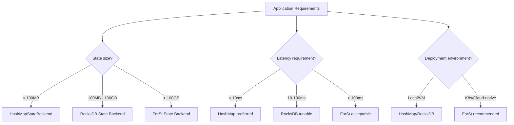
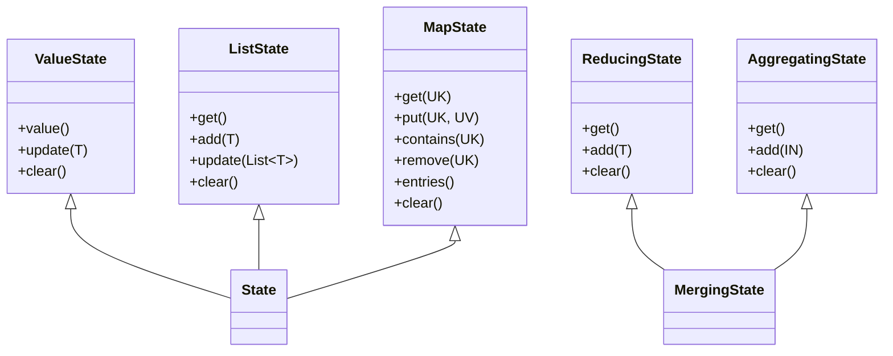
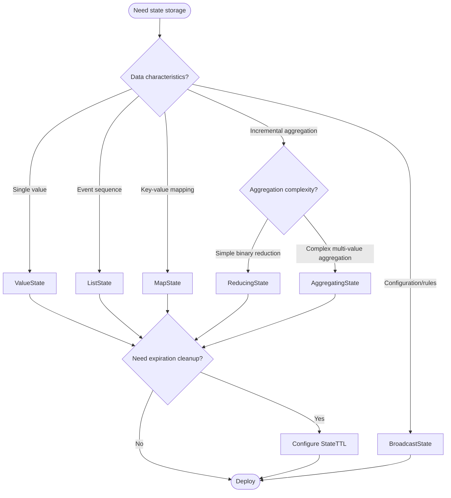
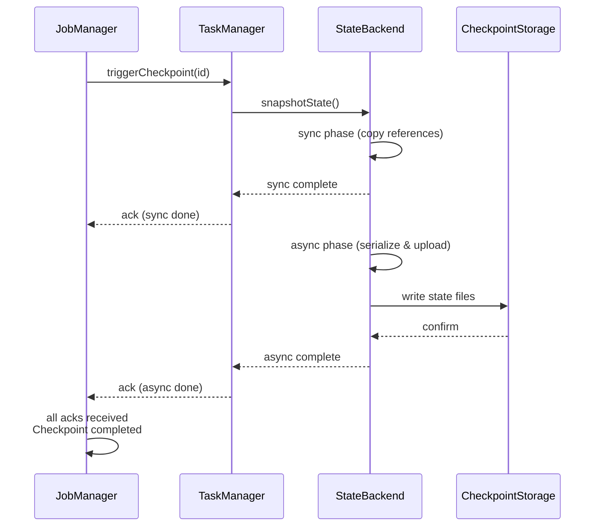

# Flink State Management Complete Guide

> **Stage**: Flink/02-core-mechanisms | **Prerequisites**: [checkpoint-mechanism-deep-dive.md](./checkpoint-mechanism-deep-dive.md) | **Formalization Level**: L4

## 1. Definitions

### Def-F-02-90: State Backend

**Definition**: State Backend is Flink's runtime component responsible for state storage, access, and snapshot persistence:

$$
\text{StateBackend} = \langle \text{Storage}, \text{Serialization}, \text{Snapshot}, \text{Recovery} \rangle
$$

Where:

- $\text{Storage}$: physical storage medium (memory/disk/distributed storage)
- $\text{Serialization}$: state serialization/deserialization strategy
- $\text{Snapshot}$: state snapshot generation mechanism
- $\text{Recovery}$: fault recovery strategy

**Primary State Backends**:

| State Backend | Storage | Serialization | Applicable Scenario |
|--------------|---------|---------------|---------------------|
| HashMapStateBackend | JVM Heap | Async snapshot | Small state, low latency |
| EmbeddedRocksDBStateBackend | Local RocksDB | Incremental snapshot | Large state, high throughput |
| ForStStateBackend (Flink 2.0+) | Distributed + local cache | Metadata snapshot | Ultra-large scale, cloud-native |

---

### Def-F-02-91: HashMapStateBackend

**Definition**: HashMapStateBackend is a JVM heap-based state backend using `HashMap` data structures:

$$
\text{HashMapStateBackend} = \langle \text{Heap}_K, \text{TypeSerializer}_T, \text{AsyncSnapshot} \rangle
$$

**Core characteristics**:

1. **Storage model**: each key-value state corresponds to a `HashMap<K, T>`
2. **Access latency**: $O(1)$ average time complexity
3. **Snapshot mechanism**: asynchronous copy-on-write, does not block data stream processing
4. **Memory constraint**: $|S_{total}| \leq \text{taskmanager.memory.framework.heap.size} - \text{overhead}$

---

### Def-F-02-92: EmbeddedRocksDBStateBackend

**Definition**: EmbeddedRocksDBStateBackend uses embedded RocksDB engine based on LSM-Tree:

$$
\text{RocksDBStateBackend} = \langle \text{LSM-Tree}, \text{SSTFiles}, \text{MemTable}, \text{WAL} \rangle
$$

**Core characteristics**:

1. **Storage model**: LSM-Tree structure—writes first enter MemTable, then flush to SST files
2. **Access latency**: point query $O(\log N)$, range query $O(\log N + K)$
3. **Storage capacity**: limited by local disk capacity
4. **Serialization**: state values serialized to byte arrays via `TypeSerializer`

**LSM-Tree structure**:
$$
\text{RocksDB} = \text{MemTable} \cup \left( \bigcup_{i=0}^{L} \text{Level}_i \right)
$$

Where $\text{Level}_i$ contains key-sorted SST files satisfying $\forall f \in \text{Level}_i: |f| \leq s \cdot r^i$ [^1].

---

### Def-F-02-93: ForStStateBackend (Flink 2.0+)

**Definition**: ForSt (For Streaming) is Flink 2.0's disaggregated state backend storing state primarily in distributed file systems:

$$
\text{ForStStateBackend} = \langle \text{UFS}, \text{LocalCache}, \text{LazyRestore}, \text{RemoteCompaction} \rangle
$$

Where:

- $\text{UFS}$ (Unified File System): distributed storage abstraction (S3/HDFS/GCS)
- $\text{LocalCache}$: local hot-data cache (LRU/SLRU)
- $\text{LazyRestore}$: on-demand state loading during recovery
- $\text{RemoteCompaction}$: remote compaction service

---

### Def-F-02-94: Keyed State

**Definition**: Keyed State is bound to a specific key, available only on `KeyedStream`:

$$
\text{KeyedState} = \{ s_k \mid k \in \text{KeySpace}, s_k \in \text{StateValue} \}
$$

**State type classification**:

| State Type | Symbol | Semantics | Applicable Scenario |
|-----------|--------|-----------|---------------------|
| ValueState | $V_k$ | single value | latest value storage |
| ListState | $L_k$ | list | event sequences |
| MapState | $M_k$ | map | key-value aggregation |
| ReducingState | $R_k$ | reduction | incremental aggregation |
| AggregatingState | $A_k$ | aggregation | complex aggregation |

---

### Def-F-02-95: Operator State

**Definition**: Operator State is bound to operator instances, independent of key:

$$
\text{OperatorState} = \langle \text{Instance}_i, \text{StatePartitions}, \text{RescaleMode} \rangle
$$

**State types**:

| Type | Description | Rescale Strategy |
|------|-------------|-----------------|
| List State | list state | uniform redistribution |
| Union List State | union list state | full broadcast |
| Broadcast State | broadcast state | full replication |

---

### Def-F-02-96: Checkpoint

**Definition**: Checkpoint is a globally consistent state snapshot of a distributed stream processing job at a specific moment:

$$
\text{Checkpoint} = \langle ID, TS, \{S_i\}_{i \in Tasks}, \text{Metadata} \rangle
$$

**Checkpoint types**:

| Type | Symbol | Description |
|------|--------|-------------|
| Full Checkpoint | $CP_{full}$ | complete state snapshot |
| Incremental Checkpoint | $CP_{inc}$ | captures only changed state |
| Aligned Checkpoint | $CP_{align}$ | Barrier-aligned trigger |
| Unaligned Checkpoint | $CP_{unaligned}$ | non-aligned trigger |

---

### Def-F-02-97: State TTL

**Definition**: State TTL is automatic expiration and cleanup mechanism for state:

$$
\text{StateTTL} = \langle \tau, \text{UpdateType}, \text{Visibility}, \text{CleanupStrategy} \rangle
$$

Where:

- $\tau$: TTL duration
- $\text{UpdateType} \in \{\text{OnCreateAndWrite}, \text{OnReadAndWrite}, \text{Disabled}\}$
- $\text{Visibility} \in \{\text{NeverReturnExpired}, \text{ReturnExpiredIfNotCleanedUp}\}$
- $\text{CleanupStrategy} \in \{\text{FullSnapshot}, \text{Incremental}, \text{CompactionFilter}\}$

---

### Def-F-02-98: Changelog State Backend (Flink 1.15+)

**Definition**: Changelog State Backend achieves sub-second recovery by materializing state changes in real time [^4]:

$$
\text{ChangelogStateBackend} = \langle \text{BaseBackend}, \text{ChangelogStorage}, \text{PeriodicMaterialization} \rangle
$$

**Core mechanisms**:

1. **Real-time materialization**: state changes continuously written to Changelog, not just periodic Checkpoints
2. **Parallel recovery**: recovery reads base Checkpoint + Changelog in parallel, achieving sub-second restore
3. **Storage separation**: Changelog separated from base state, supporting independent lifecycle management

---

## 2. Properties

### Lemma-F-02-70: State Backend Latency Characteristics

**Lemma**: Three State Backends satisfy the following latency inequality:

$$
\text{Latency}_{HashMap} < \text{Latency}_{RocksDB}^{cache\_hit} < \text{Latency}_{ForSt}^{cache\_hit} < \text{Latency}_{RocksDB}^{cache\_miss} < \text{Latency}_{ForSt}^{cache\_miss}
$$

**Proof**:

1. **HashMap**: direct memory access, nanosecond latency
2. **RocksDB Cache Hit**: in-memory Block Cache, sub-microsecond
3. **ForSt Cache Hit**: local cache access, microsecond
4. **RocksDB Cache Miss**: local disk I/O, millisecond
5. **ForSt Cache Miss**: network I/O to distributed storage, tens of milliseconds

∎

---

### Lemma-F-02-71: State Backend Capacity Scalability

**Lemma**: Three State Backends satisfy:

$$
\text{Capacity}_{HashMap} \ll \text{Capacity}_{RocksDB} < \text{Capacity}_{ForSt} \approx \infty
$$

**Proof**:

- **HashMap**: limited by TM heap memory (typically < 10GB)
- **RocksDB**: limited by TM local disk (typically 100GB - TB)
- **ForSt**: limited by distributed storage capacity (theoretically unbounded)

∎

---

### Prop-F-02-70: Optimal State Type Selection

**Statement**: For keyed state operations, optimal state type selection satisfies:

| Operation Pattern | Optimal State Type | Complexity |
|------------------|-------------------|------------|
| Single value read/write | ValueState | $O(1)$ |
| Append sequence | ListState | $O(1)$ append |
| Key-value mapping | MapState | $O(1)$ per key |
| Incremental reduction | ReducingState | $O(1)$ space |
| Complex aggregation | AggregatingState | $O(1)$ space |

**Corollary**: Using wrong state types causes space or time complexity degradation. For example, using ListState to store aggregated values requires $O(N)$ space, while ReducingState only needs $O(1)$.

---

### Prop-F-02-71: Checkpoint Consistency Guarantee

**Statement**: If Checkpoint uses Aligned mode and State Backend provides atomic snapshots, then recovered state satisfies:

$$
\text{restore}(CP_n) = S_{t_n}
$$

Where $S_{t_n}$ is the true state at Checkpoint $n$ moment.

---

## 3. Relations

### State Backend and Application Scenario Mapping



**Detailed mapping**:

| Scenario Feature | Recommended Backend | Rationale |
|-----------------|-------------------|-----------|
| Small state (< 100MB), low latency | HashMapStateBackend | Memory access, nanosecond latency |
| Medium state (100MB - 10GB) | RocksDB + full Checkpoint | Disk storage, async snapshot |
| Large state (> 10GB) | RocksDB + incremental Checkpoint | Reduce I/O, lower timeout risk |
| Ultra-large state (> 1TB) | ForSt | Disaggregated storage, elastic scaling |
| Frequent point lookups | HashMapStateBackend | $O(1)$ hash lookup |
| Range scans | RocksDB/ForSt | LSM-Tree optimization |
| Cloud-native deployment | ForSt | Storage-compute separation, cost optimization |

---

### State Type and Operation Semantics Relation



---

### Checkpoint Mechanism and Consistency Level

| Checkpoint Mode | Alignment Strategy | Consistency Guarantee | Latency Impact |
|----------------|-------------------|----------------------|----------------|
| Aligned + Exactly-Once | Barrier alignment | Strong consistency | Medium |
| Unaligned + Exactly-Once | Non-aligned + in-flight data | Strong consistency | Low |
| Aligned + At-Least-Once | No barrier alignment | At-least-once | Low |

$$
\text{Exactly-Once} \Rightarrow \text{Aligned} \lor (\text{Unaligned} \land \text{InFlightSnapshot})
$$

---

## 4. Argumentation

### 4.1 State Backend Deep Comparison

#### Performance Comparison Matrix

| Dimension | HashMapStateBackend | EmbeddedRocksDBStateBackend | ForStStateBackend |
|-----------|--------------------|----------------------------|-------------------|
| **Access latency** | ⭐⭐⭐⭐⭐ (ns) | ⭐⭐⭐ (μs-ms) | ⭐⭐ (ms) |
| **Storage capacity** | ⭐⭐ (< 10GB) | ⭐⭐⭐⭐ (TB) | ⭐⭐⭐⭐⭐ (PB) |
| **Checkpoint speed** | ⭐⭐⭐ (full) | ⭐⭐⭐⭐ (incremental) | ⭐⭐⭐⭐⭐ (metadata) |
| **Recovery speed** | ⭐⭐⭐⭐ | ⭐⭐⭐ | ⭐⭐⭐⭐⭐ (LazyRestore) |
| **Memory efficiency** | ⭐⭐ | ⭐⭐⭐⭐ | ⭐⭐⭐⭐⭐ |
| **CPU overhead** | ⭐⭐⭐⭐⭐ (low) | ⭐⭐⭐ (medium) | ⭐⭐ (high serialization) |
| **Cloud-native friendly** | ⭐⭐ | ⭐⭐⭐ | ⭐⭐⭐⭐⭐ |

#### Technical Implementation Differences



---

### 4.2 Full vs Incremental Checkpoint vs Changelog

| Feature | Full Checkpoint | Incremental Checkpoint | Changelog State Backend |
|--------|----------------|----------------------|------------------------|
| Snapshot content | complete state data | changes since last Checkpoint | real-time state change stream |
| Storage overhead | $O(|S|)$ | $O(|\Delta S|)$ | $O(|S|) + O(|Changelog|)$ |
| Recovery time | $O(|S|)$ | $O(|S|)$ (needs merge) | $O(|S_{base}|) + O(|Changelog|)$ (parallel) |
| Network transfer | large | small | continuous |
| Recovery speed | minutes | minutes | seconds |
| Applicable scenario | small state | large state | latency-sensitive, sub-second recovery |

---

### 4.3 State TTL Expiration Strategies

| Strategy | Trigger Timing | Timeliness | CPU Overhead |
|---------|---------------|-----------|-------------|
| Full Snapshot | Checkpoint completion | Low | Low |
| Incremental | State access | High | Medium |
| RocksDB Compaction Filter | Compaction | Medium | Low |

$$
\text{TTL}_{effective} = \text{base TTL} + \text{cleanup delay}
$$

---

## 5. Proofs

### Thm-F-02-90: State Backend Selection Optimality

**Theorem**: For given application feature vector $\vec{A} = \langle \text{size}, \text{latency}, \text{throughput}, \text{cost} \rangle$, there exists a unique State Backend choice $B^*$ minimizing the comprehensive cost function:

$$
B^* = \arg\min_{B \in \mathcal{B}} \mathcal{C}(\vec{A}, B)
$$

Where:
$$
\mathcal{C}(\vec{A}, B) = w_1 \cdot \text{LatencyCost} + w_2 \cdot \text{StorageCost} + w_3 \cdot \text{CheckpointCost} + w_4 \cdot \text{RecoveryCost}
$$

**Proof**:

**Case 1**: $\text{size} < 100\text{MB}$ and $\text{latency} < 10\text{ms}$:

- HashMap has lowest latency cost → $B^* = \text{HashMap}$

**Case 2**: $100\text{MB} < \text{size} < 10\text{GB}$:

- RocksDB incremental Checkpoint significantly reduces network transfer cost → optimal

**Case 3**: $\text{size} > 100\text{GB}$:

- ForSt's disaggregated storage breaks local capacity limits → only feasible solution

∎

---

### Thm-F-02-91: Checkpoint Completeness

**Theorem**: For any Checkpoint sequence $CP_1, CP_2, \ldots, CP_n$, if each Checkpoint completes successfully, then recovered state $S_{recovered}$ equals the latest successful Checkpoint's corresponding state:

$$
S_{recovered} = S_{CP_{\max \{ i \mid CP_i \text{ completed} \}}}
$$

**Proof**: Based on Chandy-Lamport snapshot algorithm correctness [^2], Flink Checkpoint forms a consistent cut. Each operator state snapshot occurs after receiving all input Barriers, capturing complete processing results up to the Barrier. During recovery, the system reconstructs state from Checkpoint metadata and replays post-Checkpoint data. Since the data source is replayable and operators are deterministic, the recovered execution trace is equivalent to the original. ∎

---

### Thm-F-02-92: State TTL Consistency

**Theorem**: TTL configured as `NeverReturnExpired` guarantees:

$$
\forall s \in \text{State}: \text{read}(s) \neq \bot \Rightarrow t_{now} - t_{lastAccess} \leq \tau
$$

**Proof**: TTL filter checks expiration on every state access. If state is expired and visibility is `NeverReturnExpired`, the filter returns `null`, treated as non-existent by upper logic. Since clocks are monotonic, once expired, the expiration condition is permanently satisfied and expired values are never incorrectly returned. ∎

---

## 6. Examples

### ValueState with TTL: Session Tracking

```java
public class SessionTracker extends KeyedProcessFunction<String, Event, SessionResult> {
    private ValueState<SessionInfo> sessionState;
    private static final long SESSION_TIMEOUT_MS = Time.minutes(30).toMilliseconds();

    @Override
    public void open(Configuration parameters) {
        StateTtlConfig ttlConfig = StateTtlConfig
            .newBuilder(Time.minutes(30))
            .setUpdateType(StateTtlConfig.UpdateType.OnReadAndWrite)
            .setStateVisibility(StateTtlConfig.StateVisibility.NeverReturnExpired)
            .cleanupIncrementally(10, true)
            .build();

        ValueStateDescriptor<SessionInfo> descriptor =
            new ValueStateDescriptor<>("session-info", SessionInfo.class);
        descriptor.enableTimeToLive(ttlConfig);
        sessionState = getRuntimeContext().getState(descriptor);
    }

    @Override
    public void processElement(Event event, Context ctx, Collector<SessionResult> out)
            throws Exception {
        SessionInfo session = sessionState.value();
        long currentTime = ctx.timestamp();

        if (session == null) {
            session = new SessionInfo(event.getUserId(), currentTime);
        } else if (currentTime - session.getLastActivityTime() > SESSION_TIMEOUT_MS) {
            out.collect(new SessionResult(session, true));
            session = new SessionInfo(event.getUserId(), currentTime);
        }
        session.addEvent(event);
        sessionState.update(session);

        ctx.timerService().registerEventTimeTimer(
            session.getLastActivityTime() + SESSION_TIMEOUT_MS);
    }
}
```

---

### ListState: Event Buffer

```java
public class EventBuffer extends KeyedProcessFunction<String, Event, List<Event>> {
    private ListState<Event> bufferedEvents;
    private static final int BATCH_SIZE = 100;
    private static final long FLUSH_INTERVAL_MS = 5000;

    @Override
    public void open(Configuration parameters) {
        ListStateDescriptor<Event> descriptor =
            new ListStateDescriptor<>("event-buffer", Event.class);
        bufferedEvents = getRuntimeContext().getListState(descriptor);
    }

    @Override
    public void processElement(Event event, Context ctx, Collector<List<Event>> out)
            throws Exception {
        bufferedEvents.add(event);
        int count = 0;
        for (Event e : bufferedEvents.get()) count++;
        if (count >= BATCH_SIZE) flushBuffer(out);
        ctx.timerService().registerProcessingTimeTimer(
            ctx.timerService().currentProcessingTime() + FLUSH_INTERVAL_MS);
    }

    private void flushBuffer(Collector<List<Event>> out) throws Exception {
        List<Event> batch = new ArrayList<>();
        for (Event event : bufferedEvents.get()) batch.add(event);
        if (!batch.isEmpty()) { out.collect(batch); bufferedEvents.clear(); }
    }
}
```

---

### MapState: User Behavior Counter

```java
public class UserBehaviorCounter extends KeyedProcessFunction<String, UserEvent, Metrics> {
    private MapState<String, Long> behaviorCounts;

    @Override
    public void open(Configuration parameters) {
        StateTtlConfig ttlConfig = StateTtlConfig
            .newBuilder(Time.days(7))
            .setUpdateType(StateTtlConfig.UpdateType.OnCreateAndWrite)
            .setStateVisibility(StateTtlConfig.StateVisibility.NeverReturnExpired)
            .cleanupInRocksdbCompactFilter(1000)
            .build();

        MapStateDescriptor<String, Long> descriptor =
            new MapStateDescriptor<>("behavior-counts", String.class, Long.class);
        descriptor.enableTimeToLive(ttlConfig);
        behaviorCounts = getRuntimeContext().getMapState(descriptor);
    }

    @Override
    public void processElement(UserEvent event, Context ctx, Collector<Metrics> out)
            throws Exception {
        String behavior = event.getBehaviorType();
        Long count = behaviorCounts.get(behavior);
        if (count == null) count = 0L;
        behaviorCounts.put(behavior, count + 1);

        if ((count + 1) % 100 == 0) {
            Map<String, Long> snapshot = new HashMap<>();
            for (Map.Entry<String, Long> entry : behaviorCounts.entries())
                snapshot.put(entry.getKey(), entry.getValue());
            out.collect(new Metrics(event.getUserId(), snapshot, ctx.timestamp()));
        }
    }
}
```

---

### ReducingState: Incremental Aggregation

```java
public class IncrementalAggregator extends KeyedProcessFunction<String, SensorReading, AggregatedResult> {
    private ReducingState<SensorReading> reducingState;

    @Override
    public void open(Configuration parameters) {
        ReduceFunction<SensorReading> reduceFunction = (a, b) -> new SensorReading(
            a.getSensorId(), a.getTimestamp(),
            a.getValue() + b.getValue(), a.getCount() + b.getCount()
        );

        ReducingStateDescriptor<SensorReading> descriptor =
            new ReducingStateDescriptor<>("sensor-aggregate", reduceFunction, SensorReading.class);
        reducingState = getRuntimeContext().getReducingState(descriptor);
    }

    @Override
    public void processElement(SensorReading reading, Context ctx, Collector<AggregatedResult> out)
            throws Exception {
        reducingState.add(reading);
        SensorReading aggregated = reducingState.get();
        if (aggregated != null && aggregated.getCount() >= 100) {
            double avg = aggregated.getValue() / aggregated.getCount();
            out.collect(new AggregatedResult(reading.getSensorId(), avg, aggregated.getCount(), ctx.timestamp()));
            reducingState.clear();
        }
    }
}
```

---

## 7. Visualizations

### State Backend Architecture Comparison

```mermaid
graph TB
    subgraph "HashMapStateBackend"
        H1[KeyedProcessFunction] --> H2[HashMap State Table]
        H2 --> H3[JVM Heap Memory]
        H3 --> H4[Async Snapshot<br/>Copy-on-Write]
    end

    subgraph "RocksDBStateBackend"
        R1[KeyedProcessFunction] --> R2[RocksDB JNI]
        R2 --> R3[MemTable<br/>WAL]
        R3 --> R4[SST Files<br/>LSM-Tree]
        R4 --> R5[Local Disk]
        R5 --> R6[Incremental Snapshot]
    end

    subgraph "ForStStateBackend"
        F1[KeyedProcessFunction] --> F2[Local Cache<br/>LRU/SLRU]
        F2 --> F3{Cache Miss?}
        F3 -->|Yes| F4[Async Fetch<br/>from DFS]
        F3 -->|No| F5[Direct Read]
        F4 --> F6[Unified File System<br/>S3/HDFS]
        F6 --> F7[Metadata Snapshot]
    end
```


---

### State Type Selection Decision Tree



---

### Checkpoint Lifecycle Sequence



---

## 8. References

[^1]: RocksDB Documentation, "Leveled Compaction," <https://github.com/facebook/rocksdb/wiki/Leveled-Compaction>
[^2]: Chandy, K. M., & Lamport, L. "Distributed Snapshots: Determining Global States of Distributed Systems." *ACM Transactions on Computer Systems*, 3(1), 1985.
[^4]: Apache Flink Documentation, "Changelog State Backend," 2025. <https://nightlies.apache.org/flink/flink-docs-stable/docs/ops/state/changelog_state_backend/>

---

*Document Version: v1.0-en | Updated: 2026-04-20 | Status: Core Summary*
