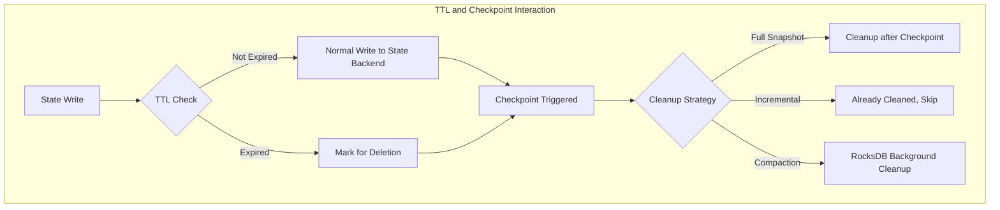
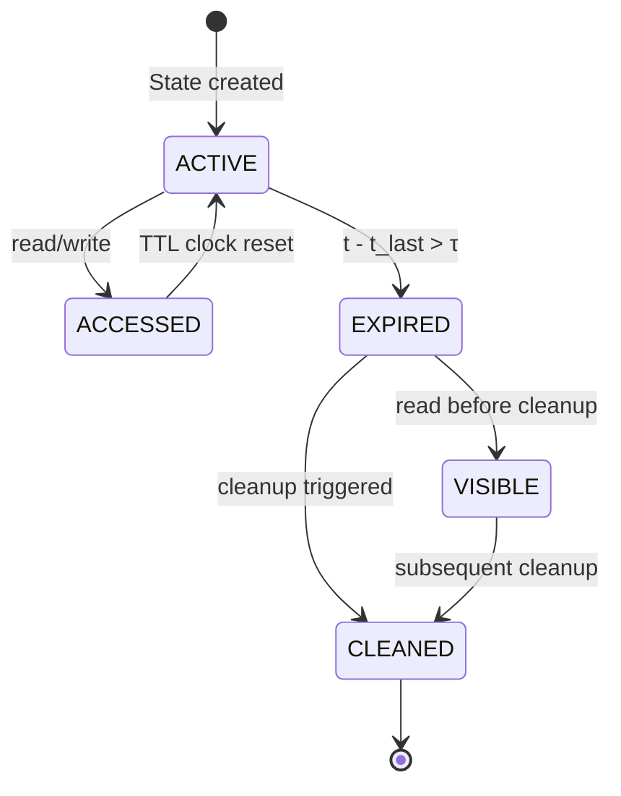
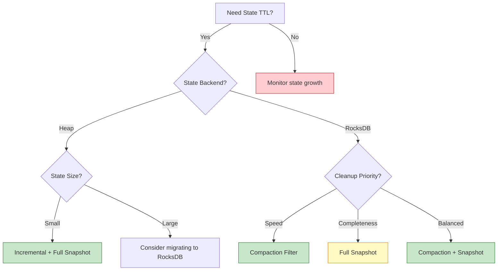
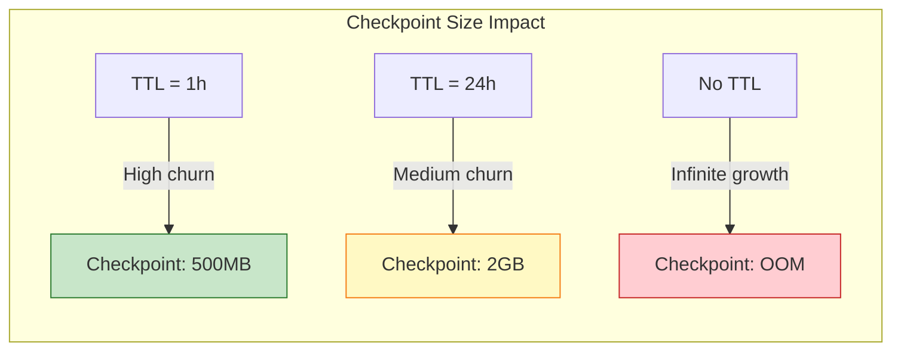

# Flink State TTL Best Practices

> **Stage**: Flink/02-core-mechanisms | **Prerequisites**: [checkpoint-mechanism-deep-dive](./checkpoint-mechanism-deep-dive.md), [forst-state-backend](./forst-state-backend.md) | **Formalization Level**: L4-L5

---

## 1. Definitions

### Def-F-02-80: State TTL (Time-To-Live)

Let state $s$ be a key-value pair $(k, v)$ with creation time $t_c$. TTL defines the maximum lifetime $\tau \in \mathbb{R}^+$ that state can remain valid:

$$\text{TTL}(s) = \{ \tau \mid s \text{ is valid at time } t \iff t - t_c \leq \tau \}$$

**Intuition**: TTL is a state lifecycle management mechanism. When state exceeds the specified time without being accessed, the system automatically marks it as expired and cleans it up, preventing unbounded state growth from causing memory/disk pressure.

### Def-F-02-81: TTL Update Type

Let $t_{last}$ be the state's last access time. There are three TTL clock update strategies:

| Update Type | Symbol | Semantics |
|---------|------|------|
| OnCreateAndWrite | $U_{CW}$ | $t_{last} \leftarrow t$ on write/create |
| OnReadAndWrite | $U_{RW}$ | $t_{last} \leftarrow t$ on read/write |
| Disabled | $U_{\emptyset}$ | TTL update disabled |

### Def-F-02-82: State Visibility

Let $S_{exp} = \{ s \mid t - t_{last} > \tau \}$ be the set of expired states. State visibility $V$ defines whether expired state can be read on user access:

$$V(s) = \begin{cases} \text{NeverReturnExpired} & s \in S_{exp} \Rightarrow \text{read}(s) = \bot \\ \text{ReturnExpiredIfNotCleanedUp} & s \in S_{exp} \land \neg\text{cleaned}(s) \Rightarrow \text{read}(s) = v \end{cases}$$

### Def-F-02-83: Cleanup Strategy

Let the state backend be $B \in \{\text{Heap}, \text{RocksDB}\}$. Cleanup strategy $C$ is defined as:

| Strategy | Symbol | Applicable Backend | Trigger Condition |
|-----|------|---------|---------|
| Full Snapshot | $C_{FS}$ | Heap, RocksDB | On Checkpoint completion |
| Incremental | $C_{INC}$ | Heap | On every state access |
| RocksDB Compaction | $C_{COMP}$ | RocksDB | During RocksDB Compaction |

---

## 2. Properties

### Lemma-F-02-60: Monotonicity of Expired State Set

**Statement**: For any state $s$ and its TTL configuration $\tau$, the expired state set $S_{exp}(t)$ is monotonically non-decreasing in $t$:

$$\forall t_1 < t_2, \quad S_{exp}(t_1) \subseteq S_{exp}(t_2)$$

**Proof**: By definition, $s \in S_{exp}(t_1) \Rightarrow t_1 - t_{last} > \tau$. Since $t_2 > t_1$, then $t_2 - t_{last} > t_1 - t_{last} > \tau$, hence $s \in S_{exp}(t_2)$. $\square$

### Lemma-F-02-61: Cleanup Strategy Timeliness Ordering

**Statement**: The timeliness of the three cleanup strategies satisfies the partial order:

$$C_{INC} \prec C_{COMP} \prec C_{FS}$$

Where $\prec$ means "more timely" (faster cleanup of expired state).

**Proof**:

- $C_{INC}$: Checks and cleans on every state access, highest timeliness
- $C_{COMP}$: Depends on RocksDB Compaction cycle, generally minute-level
- $C_{FS}$: Depends on Checkpoint cycle, generally second/minute-level, and only cleans expired states before completed Checkpoints

$\square$

### Lemma-F-02-62: State Visibility and Consistency Boundary

**Statement**: Let the application's required consistency level be $\mathcal{C} \in \{\text{Eventual}, \text{Strong}\}$. Then:

$$\mathcal{C} = \text{Strong} \Rightarrow V = \text{NeverReturnExpired}$$

**Proof**: ReturnExpiredIfNotCleanedUp may allow reading a state that is logically expired but not yet physically cleaned, violating strong consistency semantics. $\square$

### Prop-F-02-60: TTL Impact on Checkpoint Size

**Statement**: Let Checkpoint interval be $\Delta_{cp}$, state write rate $\lambda$, and TTL duration $\tau$. Then:

$$\text{CheckpointSize} \propto \min(\lambda \cdot \Delta_{cp}, \lambda \cdot \tau)$$

**Intuition**: When $\tau < \Delta_{cp}$, TTL effectively controls Checkpoint size; when $\tau \gg \Delta_{cp}$, TTL has limited effect on Checkpoint size.

---

## 3. Relations

### 3.1 TTL and Checkpoint Relationship



**Relation description**:

- **Full Snapshot cleanup**: Filters expired states during Checkpoint snapshot phase
- **Incremental cleanup**: Independent of Checkpoint, but affects Checkpoint content
- **Compaction cleanup**: Fully decoupled from Checkpoint, executed asynchronously

### 3.2 TTL and State Backend Relationship

| State Backend | Supported Strategies | Recommended Scenario |
|--------------|---------------------|----------------------|
| Heap | $C_{FS}, C_{INC}$ | Small state, low latency, all-in-memory processing |
| RocksDB | $C_{FS}, C_{COMP}$ | Large state, large data volume, disk fault tolerance |
| ForSt | $C_{FS}, C_{COMP}$ | Large state, async execution, cloud-native deployment |

### 3.3 TTL and Watermark/Event Time Relationship

**Important constraint**: Flink State TTL only supports **Processing Time**, not Event Time.

$$\text{TTL Clock} = \text{Processing Time} \neq \text{Event Time}$$

This means:

- Even if Watermark is delayed, TTL still counts by machine time
- When processing delayed data, state may have already been cleaned by TTL
- TTL tolerance margins must be set appropriately

---

## 4. Argumentation

### 4.1 TTL Necessity Argument

**Scenario**: Unbounded state growth in unbounded stream processing

**Theorem 4.1** (Unbounded State Growth): In stateful stream processing without TTL, if the key space is infinite and state keeps accumulating, storage demand has no upper bound:

$$\lim_{t \to \infty} |S(t)| = \infty \quad \text{if} \quad \forall s, \tau_s = \infty$$

**Argument**:

1. Let key space $K$ be infinite (e.g., user ID space)
2. Each key creates new state on first access
3. Without TTL, state is never released
4. Therefore total state size grows without bound

**Real-world impact**:

| Without TTL | With TTL |
|------------|---------|
| OOM after days/weeks | Stable memory footprint |
| Checkpoint size grows linearly | Checkpoint size bounded by active keys |
| Recovery time increases | Recovery time stable |
| State backend compaction slows | Compaction overhead predictable |

---

### 4.2 TTL Configuration Decision Matrix

| Scenario | TTL | Update Type | Visibility | Cleanup | Rationale |
|---------|-----|------------|-----------|---------|-----------|
| User session state | 30 min | OnReadAndWrite | NeverReturnExpired | Incremental | Session extends on activity |
| Device heartbeat | 5 min | OnCreateAndWrite | ReturnExpired | Compaction | Heartbeats are write-only |
| Rate limit counter | 1 min | OnReadAndWrite | NeverReturnExpired | Incremental | Counters must be accurate |
| Temporary join buffer | 10 min | OnCreateAndWrite | ReturnExpired | Full Snapshot | Buffer for delayed data |
| ML feature cache | 1 hour | OnReadAndWrite | ReturnExpired | Compaction | Features can be stale briefly |

---

### 4.3 TTL and Event Time Delay Interaction

**Problem**: When processing delayed data (e.g., late CDRs from roaming partners), event time can be hours behind processing time. If TTL is configured too aggressively, the state needed to process late data may have been cleaned.

**Solution**:

$$\tau_{TTL} \geq \tau_{max\_delay} + \tau_{safety}$$

Where $\tau_{max\_delay}$ is the maximum expected event-time delay and $\tau_{safety}$ is a safety margin (e.g., 2x the delay).

**Example**: For telecom billing with roaming CDR delays up to 24 hours:

```java
StateTtlConfig ttlConfig = StateTtlConfig
    .newBuilder(Time.hours(72))  // 24h delay + 48h safety
    .setUpdateType(OnCreateAndWrite)
    .setStateVisibility(NeverReturnExpired)
    .cleanupFullSnapshot()
    .build();
```

---

## 5. Proof / Engineering Argument

### Thm-F-02-60: TTL Memory Bound

**Statement**: With TTL configured as $\tau$, key arrival rate $\lambda_k$, and average state size $s$, the expected memory usage $M$ is bounded:

$$M \leq \lambda_k \cdot \tau \cdot s$$

**Proof**:

1. In steady state, new keys arrive at rate $\lambda_k$
2. Each key's state persists for at most $\tau$ time before expiration
3. Therefore the expected number of live keys is at most $\lambda_k \cdot \tau$
4. Multiplying by average state size $s$ gives the memory bound

**Engineering note**: This is an upper bound. Actual memory is lower due to:

- Key reuse (same key reactivated before TTL expiry)
- Cleanup strategy efficiency
- State backend compression

---

### Engineering Argument: RocksDB TTL Cleanup Optimization

For RocksDB state backend, TTL cleanup during compaction uses a custom compaction filter:

```java
StateTtlConfig ttlConfig = StateTtlConfig
    .newBuilder(Time.hours(1))
    .cleanupInRocksdbCompactFilter(1000)  // query 1000 state entries per compaction
    .build();
```

**Optimization principle**:

1. During RocksDB compaction, the filter checks each key-value pair's expiration timestamp
2. Expired entries are dropped and not written to the new SST file
3. The `queryAfterNumEntries` parameter controls the check granularity — lower values mean more aggressive cleanup but higher CPU overhead

**Recommended settings**:

| Workload | queryAfterNumEntries | Rationale |
|---------|---------------------|-----------|
| High write, low read | 100 | Aggressive cleanup, writes amortize filter cost |
| Low write, high read | 10000 | Conservative cleanup, minimize read overhead |
| Balanced | 1000 | Default tradeoff |

---

## 6. Examples

### 6.1 Complete TTL Configuration Example

```java
public class SessionStateFunction extends KeyedProcessFunction<String, Event, Result> {
    private ValueState<SessionData> sessionState;

    @Override
    public void open(Configuration parameters) {
        StateTtlConfig ttlConfig = StateTtlConfig
            .newBuilder(Time.minutes(30))
            .setUpdateType(StateTtlConfig.UpdateType.OnReadAndWrite)
            .setStateVisibility(StateTtlConfig.StateVisibility.NeverReturnExpired)
            .cleanupIncrementally(10, true)  // 10 records per cleanup, run on cleanup too
            .cleanupFullSnapshot()
            .build();

        ValueStateDescriptor<SessionData> descriptor =
            new ValueStateDescriptor<>("session", SessionData.class);
        descriptor.enableTimeToLive(ttlConfig);
        sessionState = getRuntimeContext().getState(descriptor);
    }

    @Override
    public void processElement(Event event, Context ctx, Collector<Result> out)
            throws Exception {
        SessionData session = sessionState.value();
        if (session == null) {
            session = new SessionData(event.getUserId());
        }
        session.update(event);
        sessionState.update(session);
        out.collect(new Result(session));
    }
}
```

### 6.2 TTL with MapState for Multi-Key Expiration

```java
public class DeviceRegistryFunction extends KeyedProcessFunction<String, DeviceEvent, Alert> {
    private MapState<String, DeviceInfo> deviceMapState;

    @Override
    public void open(Configuration parameters) {
        StateTtlConfig ttlConfig = StateTtlConfig
            .newBuilder(Time.minutes(5))
            .setUpdateType(OnCreateAndWrite)
            .cleanupInRocksdbCompactFilter()
            .build();

        MapStateDescriptor<String, DeviceInfo> descriptor =
            new MapStateDescriptor<>("devices", String.class, DeviceInfo.class);
        descriptor.enableTimeToLive(ttlConfig);
        deviceMapState = getRuntimeContext().getMapState(descriptor);
    }
}
```

### 6.3 Production TTL Tuning Checklist

```java
public class TtlTuningGuide {
    /**
     * Step 1: Measure key churn rate
     * - Monitor unique keys per checkpoint interval
     * - Estimate key arrival rate λ_k
     */

    /**
     * Step 2: Set TTL based on business logic
     * - Session state: max session idle time * 2
     * - Join buffer: max expected delay + safety margin
     * - Aggregation state: window size + allowed lateness
     */

    /**
     * Step 3: Choose update type
     * - OnReadAndWrite: when state access extends validity (sessions)
     * - OnCreateAndWrite: when only writes matter (counters, buffers)
     */

    /**
     * Step 4: Choose cleanup strategy
     * - Heap + small state: Incremental
     * - RocksDB + large state: Compaction filter
     * - Critical correctness: Full Snapshot (slower but guaranteed)
     */

    /**
     * Step 5: Monitor and iterate
     * - Track state size growth rate
     * - Track cleanup efficiency (expired / total cleaned)
     * - Adjust TTL and cleanup parameters based on metrics
     */
}
```

---

## 7. Visualizations

### TTL Lifecycle State Machine



*Figure 7-1: State TTL lifecycle. Active state transitions to expired when TTL duration elapses; expired state may be visible or cleaned depending on visibility configuration and cleanup strategy.*

### TTL Configuration Decision Tree



*Figure 7-2: TTL configuration decision tree. Selection depends on state backend, size constraints, and cleanup priorities.*

### Checkpoint Size vs TTL Relationship



*Figure 7-3: Impact of TTL duration on Checkpoint size. Shorter TTL reduces state footprint but may cause premature expiration of needed data.*

---

## 8. References


---

*Document Version: v1.0 | Updated: 2026-04-20 | Status: Complete*
