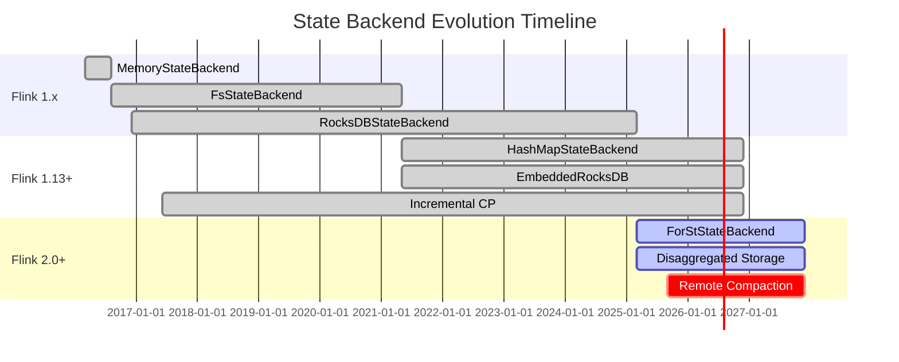

# State Backend Evolution Analysis

> Stage: Flink/02-core | Prerequisites: [state-backends-deep-comparison.md](./state-backends-deep-comparison.md) | Formalization Level: L4

---

## 1. Definitions

### Def-F-02-21: MemoryStateBackend

**Definition**: The first-generation state backend introduced in Flink 1.0, where state data is stored entirely in the TaskManager JVM heap memory:

$$
\text{MemoryStateBackend} = \langle Heap_{tm}, HashMap_{K,V}, \Psi_{async-fs} \rangle
$$

**Core Constraints**:

$$
|S_{total}| \leq \alpha \cdot \text{taskmanager.memory.task.heap.size}, \quad \alpha \approx 0.3
$$

**Applicable Scenarios**: Small state (<100MB), testing environments, prototype development

**Limitations**: State capacity limited by JVM heap memory; large state causes frequent GC

---

### Def-F-02-22: FsStateBackend

**Definition**: An extension introduced in Flink 1.1, where state is stored in memory and snapshots are asynchronously written to the file system:

$$
\text{FsStateBackend} = \langle Heap_{tm}, HashMap_{K,V}, \Psi_{async-fs}, CheckpointStorage_{fs} \rangle
$$

**Evolution Significance**: Decouples runtime storage from Checkpoint storage location

**Version Status**: Deprecated in Flink 1.13+, unified as HashMapStateBackend

---

### Def-F-02-23: RocksDBStateBackend / EmbeddedRocksDBStateBackend

**Definition**: Introduced in Flink 1.2 (renamed to EmbeddedRocksDBStateBackend in 1.13+), using embedded RocksDB for state storage:

$$
\text{RocksDBStateBackend} = \langle \text{LSM-Tree}, \text{MemTable}, \text{SST Files}, \text{WAL}, \Psi_{incremental} \rangle
$$

**LSM-Tree Structure**:

$$
\text{RocksDB} = \text{MemTable}_{active} \cup \text{MemTable}_{immutable} \cup \left( \bigcup_{i=0}^{L} \text{Level}_i \right)
$$

**Applicable Scenarios**: Large state, production environments, on-premises deployment

**Limitations**: Local disk capacity, Compaction CPU overhead, slow fault recovery

---

### Def-F-02-24: ForStStateBackend

**Definition**: A disaggregated state backend introduced in Flink 2.0, designed specifically for cloud-native scenarios:

$$
\text{ForStStateBackend} = \langle \text{UFS}, \text{LocalCache}_{L1/L2}, \text{LazyRestore}, \text{RemoteCompaction} \rangle
$$

**Core Innovations**:

- Compute-storage separation: Primary state storage in object storage
- Lightweight Checkpoint: Metadata snapshot, O(1) complexity
- Instant recovery: LazyRestore achieves second-level fault recovery

**Applicable Scenarios**: Cloud-native, Serverless, ultra-large state (>100GB)

---

### Def-F-02-25: Incremental Checkpointing

**Definition**: Only persists the portion of state that has changed since the last Checkpoint:

$$
\Delta_n = S_n \ominus S_{n-1}, \quad |CP_n^{inc}| = |\Delta_n| \ll |S_n|
$$

**Implementation Evolution**:

| Backend | Incremental Mechanism | Efficiency |
|---------|----------------------|------------|
| RocksDB | SST file-level incremental | 50-80% savings |
| ForSt | Hard link sharing | ~100% savings |

---

## 2. Properties

### Lemma-F-02-08: State Backend Evolution Law

**Lemma**: State Backend evolution follows a development pattern of "capacity priority -> performance priority -> elasticity priority."

**Proof**:

| Stage | Time | Driving Force | Core Improvement |
|-------|------|---------------|------------------|
| Capacity Expansion | 1.0-1.2 | Large state demand | From memory to disk (RocksDB) |
| Performance Optimization | 1.3-1.15 | Checkpoint efficiency | Incremental Checkpoint |
| Elasticity Priority | 2.0+ | Cloud-native demand | Compute-storage separation (ForSt) |

QED

---

### Lemma-F-02-09: Fault Recovery Time Evolution

**Lemma**: The fault recovery time of each State Backend satisfies:

$$
T_{recovery}^{ForSt} \ll T_{recovery}^{HashMap} < T_{recovery}^{RocksDB}
$$

**Comparison Data**:

| Backend | 100GB State Recovery Time | Complexity |
|---------|--------------------------|------------|
| HashMap | 2-5 min | O(|S|) |
| RocksDB | 15-30 min | O(|S|/BW) |
| ForSt | 10-30 sec | O(|Metadata|) |

---

### Prop-F-02-07: Checkpoint Efficiency Evolution

**Proposition**: Checkpoint time complexity evolution:

| Backend | Time Complexity | Typical Duration (1TB State) |
|---------|-----------------|------------------------------|
| MemoryStateBackend | O(|S|) | 5-10 min |
| RocksDB (Full) | O(|S|) | 10-20 min |
| RocksDB (Incremental) | O(|Delta S|) | 1-5 min |
| ForSt | O(1) | 5-10 sec |

---

## 3. Relations

### 3.1 State Backend Evolution Relations

```
Flink 1.0                     Flink 1.13+                     Flink 2.0+
-------------------------------------------------------------------------
MemoryStateBackend --|
                     |---> HashMapStateBackend ---|
FsStateBackend ------|                          |
                                                |---> Unified State Backend API
RocksDBStateBackend ---> EmbeddedRocksDBStateBackend ---|
                                                |
ForStStateBackend ----------------------------|
```

**Evolution Motivations**:

1. **API Simplification**: Unified Memory/Fs as HashMap
2. **Performance Optimization**: EmbeddedRocksDB natively supports incremental Checkpoint
3. **Cloud-Native Adaptation**: ForSt achieves compute-storage separation

---

### 3.2 State Backend and Deployment Mode Mapping

| Deployment Mode | Recommended Backend | Reason |
|-----------------|---------------------|--------|
| Local Testing | HashMap | Simple, low latency |
| On-Premises Production | RocksDB | Large state support |
| Kubernetes | ForSt | Elastic scaling |
| Serverless | ForSt | Fast startup |
| Edge Computing | RocksDB | Network independent |

---

## 4. Argumentation

### 4.1 Evolution Driving Factor Analysis

#### Stage 1: Memory to Disk (1.0 -> 1.2)

**Problem**: MemoryStateBackend state capacity limited by JVM heap memory

**Solution**: Introduce RocksDBStateBackend

- Utilize local disk to expand capacity
- LSM-Tree optimizes write performance
- Supports TB-level state

#### Stage 2: API Unification (1.13)

**Problem**: MemoryStateBackend and FsStateBackend functional overlap

**Solution**: Unified as HashMapStateBackend

- Runtime storage decoupled from Checkpoint storage
- Simplified configuration
- Unified code path

#### Stage 3: Compute-Storage Separation (2.0)

**Problem**:

- Local disks are expensive in cloud-native environments
- Fault recovery time is too long
- Scaling is limited

**Solution**: ForStStateBackend

- Utilize inexpensive object storage
- Metadata snapshots enable fast recovery
- Compute nodes become stateless

---

### 4.2 Applicable Boundaries of Each Backend

| Scenario | Recommended Backend | Key Parameters |
|----------|---------------------|----------------|
| State < 100MB | HashMap | state.backend: hashmap |
| State 100MB-100GB | RocksDB | state.backend: rocksdb, incremental enabled |
| State > 100GB | ForSt | state.backend: forst |
| Latency < 1ms | HashMap | Heap memory optimization |
| Cloud-native deployment | ForSt | Local cache tuning |
| Offline environment | RocksDB | Avoid network dependency |

---

## 5. Proof / Engineering Argument

### Thm-F-02-05: State Backend Selection Completeness

**Theorem**: For any job J, there exists an optimal state backend selection uniquely determined by the feature vector F(J) = (S_size, L_sla, E_env).

**Decision Function**:

$$
\mathcal{D}(F(J)) = \begin{cases}
\text{HashMap} & \text{if } S_{size} < 100MB \land L_{sla} < 1ms \\
\text{RocksDB} & \text{if } 100MB \leq S_{size} < 100GB \lor E_{env} = \text{edge} \\
\text{ForSt} & \text{if } S_{size} \geq 100GB \land E_{env} = \text{cloud}
\end{cases}
$$

**Proof**:

1. **Capacity Constraint**: When S_size >= M_max, HashMap causes GC pressure
2. **Latency Constraint**: When L_sla < 1ms, RocksDB/ForSt serialization overhead is unacceptable
3. **Environment Constraint**: Edge environments have limited network, making ForSt remote access infeasible

QED

---

### Engineering Argument: ForSt Advantages in Cloud-Native Scenarios

**Cost Analysis** (Monthly cost, 1TB state):

| Cost Item | RocksDB | ForSt | Savings |
|-----------|---------|-------|---------|
| Storage | $0.10/GB x 2 replicas = $200 | $0.023/GB = $23 | **88%** |
| Compute (reserved disk) | Must reserve | On-demand | **50%** |
| Network (Checkpoint) | Incremental upload ~$50 | Only metadata ~$5 | **90%** |
| **Total** | **~$250** | **~$30** | **88%** |

**Elasticity Analysis**:

- RocksDB scaling: T_scale = O(|S| / B_network)
- ForSt scaling: T_scale = O(1)

---

## 6. Examples

### 6.1 MemoryStateBackend Configuration (Historical Version)

```java
import org.apache.flink.streaming.api.environment.StreamExecutionEnvironment;

public class Example {
    public static void main(String[] args) throws Exception {
        // Pseudocode illustration, not complete compilable code

        // Flink 1.12 and earlier
        StreamExecutionEnvironment env =
            StreamExecutionEnvironment.getExecutionEnvironment();

        // Configure MemoryStateBackend (deprecated)
        MemoryStateBackend memoryBackend = new MemoryStateBackend(
            "hdfs://checkpoints",  // Checkpoint storage path
            true                    // Async snapshot
        );
        env.setStateBackend(memoryBackend);

        // Key limitations
        // - State must be less than 100MB
        // - Not suitable for production

    }
}
```

---

### 6.2 RocksDBStateBackend Configuration

```java
import org.apache.flink.contrib.streaming.state.EmbeddedRocksDBStateBackend;
import org.apache.flink.streaming.api.environment.StreamExecutionEnvironment;

public class Example {
    public static void main(String[] args) throws Exception {

        // Flink 1.13+ (EmbeddedRocksDBStateBackend)
        StreamExecutionEnvironment env =
            StreamExecutionEnvironment.getExecutionEnvironment();

        // Enable incremental Checkpoint
        EmbeddedRocksDBStateBackend rocksDbBackend =
            new EmbeddedRocksDBStateBackend(true);
        env.setStateBackend(rocksDbBackend);

        // Checkpoint storage configuration
        env.getCheckpointConfig().setCheckpointStorage("hdfs:///checkpoints");

        // RocksDB fine-grained configuration
        DefaultConfigurableOptionsFactory optionsFactory =
            new DefaultConfigurableOptionsFactory();

        // Memory configuration
        optionsFactory.setRocksDBOptions(
            "state.backend.rocksdb.memory.managed", "true");
        optionsFactory.setRocksDBOptions(
            "state.backend.rocksdb.memory.fixed-per-slot", "512mb");

        // Write buffer configuration
        optionsFactory.setRocksDBOptions("write_buffer_size", "64MB");
        optionsFactory.setRocksDBOptions("max_write_buffer_number", "4");

        // SST file configuration
        optionsFactory.setRocksDBOptions("target_file_size_base", "32MB");
        optionsFactory.setRocksDBOptions("max_bytes_for_level_base", "256MB");

        // Compression configuration
        optionsFactory.setRocksDBOptions("compression_per_level", "LZ4:LZ4:ZSTD");

        env.setRocksDBStateBackend(rocksDbBackend, optionsFactory);

    }
}
```

**flink-conf.yaml Configuration**:

```yaml
# State backend configuration
state.backend: rocksdb
state.backend.incremental: true

# Checkpoint configuration
execution.checkpointing.interval: 60s
execution.checkpointing.timeout: 600s

# RocksDB memory configuration
state.backend.rocksdb.memory.managed: true
state.backend.rocksdb.memory.fixed-per-slot: 512mb
state.backend.rocksdb.threads.threads-number: 4
```

---

### 6.3 ForStStateBackend Configuration (Flink 2.0+)

```java
import org.apache.flink.streaming.api.environment.StreamExecutionEnvironment;

public class Example {
    public static void main(String[] args) throws Exception {
        StreamExecutionEnvironment env = StreamExecutionEnvironment.getExecutionEnvironment();
        // Flink 2.0+ ForStStateBackend
        ForStStateBackend forstBackend = new ForStStateBackend();

        // UFS storage configuration
        forstBackend.setUFSStoragePath("s3://flink-state-bucket/jobs/job-001");
        forstBackend.setUFSType(UFSType.S3);

        // Local cache configuration
        forstBackend.setLocalCacheSize("10gb");
        forstBackend.setCachePolicy(CachePolicy.SLRU);

        // Recovery configuration
        forstBackend.setLazyRestoreEnabled(true);
        forstBackend.setRestoreMode(RestoreMode.LAZY);

        // Remote Compaction configuration
        forstBackend.setRemoteCompactionEnabled(true);
        forstBackend.setRemoteCompactionEndpoint("compaction-service:9090");

        env.setStateBackend(forstBackend);

        // ForSt recommends longer Checkpoint intervals
        env.enableCheckpointing(120000);  // 2 minutes

    }
}
```

**flink-conf.yaml Complete Configuration**:

```yaml
# ========== ForSt State Backend Core Configuration ==========
state.backend: forst

# UFS configuration
state.backend.forst.ufs.type: s3
state.backend.forst.ufs.s3.bucket: flink-state-bucket
state.backend.forst.ufs.s3.region: us-east-1
state.backend.forst.ufs.s3.credentials.provider: IAM_ROLE

# Local cache configuration
state.backend.forst.cache.memory.size: 4gb
state.backend.forst.cache.disk.size: 100gb
state.backend.forst.cache.policy: SLRU

# Recovery configuration
state.backend.forst.restore.mode: LAZY
state.backend.forst.restore.preload.keys: 10000

# Remote Compaction configuration
state.backend.forst.compaction.remote.enabled: true
state.backend.forst.compaction.remote.endpoint: compaction-service:9090
```

---

### 6.4 Source Code Comparison

#### RocksDBStateBackend.java - Creating State Storage

```java
/**
 * EmbeddedRocksDBStateBackend.java
 * Creates local RocksDB state storage
 */
public class EmbeddedRocksDBStateBackend implements StateBackend {

    private final String localPath;  // Local disk path
    private final RocksDBOptions options;

    public CheckpointableKeyedStateBackend createStateBackend(
            Environment environment,
            JobID jobID,
            String operatorIdentifier,
            TypeSerializer<Key> keySerializer,
            int numberOfKeyGroups,
            KeyGroupRange keyGroupRange,
            TaskStateManager taskStateManager,
            TtlTimeProvider ttlTimeProvider,
            MetricGroup metricGroup,
            @Nonnull Collection<KeyedStateHandle> stateHandles,
            CloseableRegistry cancelStreamRegistry) {

        // 1. Create local RocksDB instance
        String dbPath = localPath + "/" + operatorIdentifier;
        RocksDB db = RocksDB.open(options, dbPath);

        // 2. Restore state (download SST files from Checkpoint)
        restoreState(db, stateHandles);

        // 3. Create state backend instance
        return new RocksDBKeyedStateBackend(
            db,
            keySerializer,
            numberOfKeyGroups,
            keyGroupRange,
            // ... other parameters
        );
    }

    private void restoreState(RocksDB db, Collection<KeyedStateHandle> stateHandles) {
        // Download SST files to local
        for (KeyedStateHandle handle : stateHandles) {
            downloadSSTFiles(handle);
        }
        // Load SST files into RocksDB
        db.ingestExternalFile(sstFiles, ingestOptions);
    }
}
```

#### ForStStateBackend.java - Creating State Storage

```java
/**
 * ForStStateBackend.java (Flink 2.0+)
 * Creates disaggregated state storage
 */
public class ForStStateBackend implements StateBackend {

    private final String ufsPath;       // Remote UFS path
    private final String localCachePath; // Local cache path
    private final CacheConfiguration cacheConfig;

    public CheckpointableKeyedStateBackend createStateBackend(
            Environment environment,
            JobID jobID,
            String operatorIdentifier,
            TypeSerializer<Key> keySerializer,
            int numberOfKeyGroups,
            KeyGroupRange keyGroupRange,
            TaskStateManager taskStateManager,
            TtlTimeProvider ttlTimeProvider,
            MetricGroup metricGroup,
            @Nonnull Collection<KeyedStateHandle> stateHandles,
            CloseableRegistry cancelStreamRegistry) {

        // 1. Create remote UFS connection
        UnifiedFileSystem ufs = UFSFactory.create(ufsPath);

        // 2. Create local multi-level cache
        ForStCache cache = new ForStCache.Builder()
            .setL1CacheSize(cacheConfig.getMemoryCacheSize())
            .setL2CacheSize(cacheConfig.getDiskCacheSize())
            .setCachePolicy(cacheConfig.getPolicy())
            .build();

        // 3. Load metadata (lightweight)
        StateMetadata metadata = loadMetadata(stateHandles);

        // 4. Create state backend instance
        return new ForStKeyedStateBackend(
            ufs,
            cache,
            metadata,
            keySerializer,
            numberOfKeyGroups,
            keyGroupRange,
            // ... other parameters
        );
    }

    private StateMetadata loadMetadata(Collection<KeyedStateHandle> stateHandles) {
        // Only load metadata references, do not download actual state data
        StateMetadata metadata = new StateMetadata();
        for (KeyedStateHandle handle : stateHandles) {
            metadata.addStateRef(handle.getStateRef());
        }
        return metadata;
    }
}
```

---

### 6.5 State Backend Migration Example

```bash
# ========== Migrate from RocksDB to ForSt ==========

# 1. Create Savepoint (using original backend)
flink savepoint <job-id> s3://flink-migration/savepoint-rocksdb

# 2. Modify code to switch backend
# From: env.setStateBackend(new EmbeddedRocksDBStateBackend(true));
# To: env.setStateBackend(new ForStStateBackend());

# 3. Restore from Savepoint (automatically converts state format)
flink run -s s3://flink-migration/savepoint-rocksdb/savepoint-xxxxx \
  -Dstate.backend=forst \
  -Dstate.backend.forst.ufs.type=s3 \
  -Dstate.backend.forst.ufs.s3.bucket=flink-state-bucket \
  -c com.example.MyJob my-job.jar

# 4. Verify migration success
# - Check if job status is normal
# - Verify if Checkpoint time has improved
# - Monitor recovery time
```

**Migration Compatibility Matrix**:

| Source Backend | Target Backend | Compatibility | Notes |
|----------------|----------------|---------------|-------|
| HashMap | RocksDB | Supported | Automatic conversion |
| RocksDB | HashMap | Conditional | Must ensure state size < heap memory |
| HashMap/RocksDB | ForSt | Supported | Flink 2.0+ supported |
| ForSt | RocksDB | Not supported | Storage architecture incompatible |

---

## 7. Visualizations

### 7.1 State Backend Evolution Roadmap



---

### 7.2 Architecture Comparison Diagram

```mermaid
graph TB
    subgraph "MemoryStateBackend (1.0)"
        M1[KeyedProcessFunction] --> M2[HashMap Table]
        M2 --> M3[JVM Heap Memory]
        M3 --> M4[Async Snapshot]
        M4 --> M5[Checkpoint Storage]
        style M3 fill:#c8e6c9
    end

    subgraph "RocksDBStateBackend (1.2)"
        R1[KeyedProcessFunction] --> R2[RocksDB JNI]
        R2 --> R3[MemTable]
        R2 --> R4[Block Cache]
        R3 --> R5[SST Files]
        R4 -.-> R5
        R5 --> R6[Local Disk]
        R6 --> R7[Incremental Snapshot]
        R7 --> R8[Checkpoint Storage]
        style R6 fill:#fff9c4
    end

    subgraph "ForStStateBackend (2.0)"
        F1[KeyedProcessFunction] --> F2[Local Cache Manager]
        F2 --> F3{L1 Hit?}
        F3 -->|Yes| F4[Memory Cache]
        F3 -->|No| F5{L2 Hit?}
        F5 -->|Yes| F6[Disk Cache]
        F5 -->|No| F7[Async Fetch UFS]
        F7 --> F8[Unified File System]
        F8 --> F9[SST Files]
        F9 --> F10[Metadata Snapshot]
        F10 --> F11[Checkpoint Storage]
        style F8 fill:#b2dfdb
        style F4 fill:#c8e6c9
    end
```



---

### 7.3 Performance Comparison Matrix

| Feature Dimension | MemoryStateBackend | RocksDBStateBackend | ForStStateBackend |
|:-----------------:|:------------------:|:-------------------:|:-----------------:|
| **Introduced Version** | 1.0 | 1.2 | 2.0 |
| **Storage Location** | JVM Heap | Local Disk | Remote UFS + Local Cache |
| **State Capacity** | < 10 GB | 100 GB - 10 TB | Unlimited (PB-level) |
| **Access Latency** | 10-100 ns | 1 us - 10 ms | 1 us - 100 ms |
| **Throughput Capability** | 5 stars | 3 stars | 3 stars |
| **Memory Efficiency** | 2 stars | 4 stars | 5 stars |
| **Checkpoint Method** | Full async | Incremental async | Metadata snapshot |
| **Checkpoint Speed** | Slow | Fast | Extremely fast (O(1)) |
| **Recovery Speed** | Fast | Slow | Extremely fast (Lazy) |
| **Incremental Checkpoint** | No | Yes | Yes |
| **Cloud-Native Friendly** | 2 stars | 3 stars | 5 stars |
| **Storage Cost** | High | Medium | Low |
| **Current Status** | Deprecated | GA | GA |

---

## 8. References


---

*Document Version: 2026.04-001 | Formalization Level: L4 | Last Updated: 2026-04-06*

**Related Documents**:

- [state-backends-deep-comparison.md](./state-backends-deep-comparison.md) - State Backend Deep Comparison
- [flink-2.0-forst-state-backend.md](./flink-2.0-forst-state-backend.md) - ForSt State Backend Detailed Design
- [flink-architecture-evolution-1x-to-2x.md](../01-concepts/flink-architecture-evolution-1x-to-2x.md) - Architecture Evolution Analysis

---

*Document Version: v1.0 | Created: 2026-04-20*
