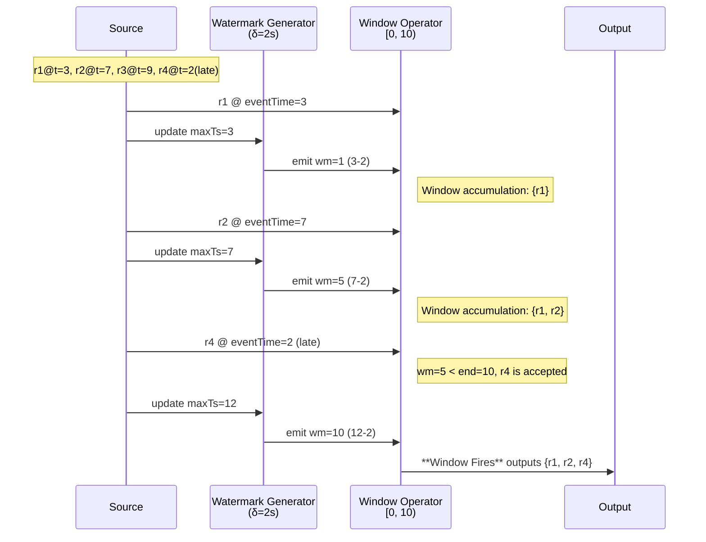
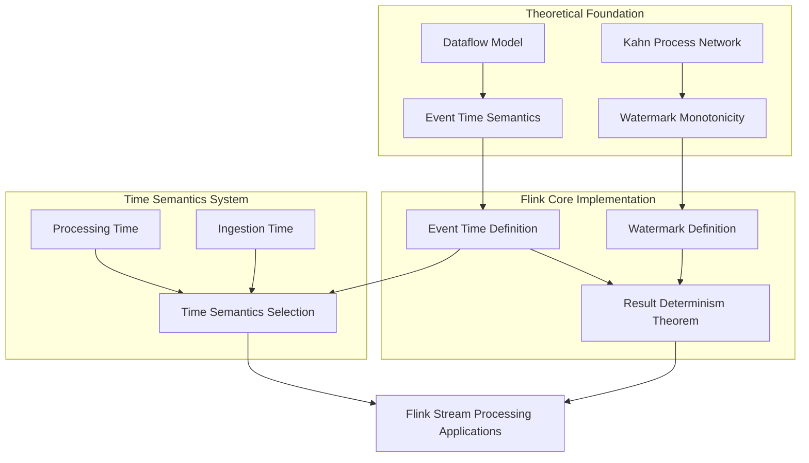
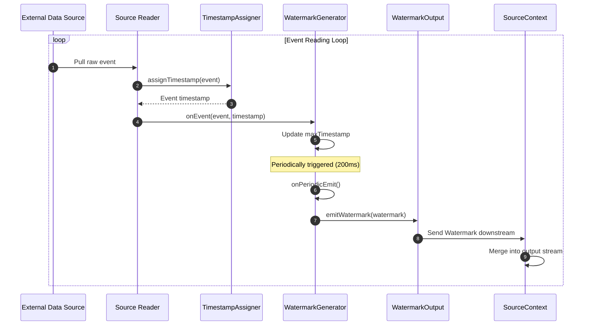
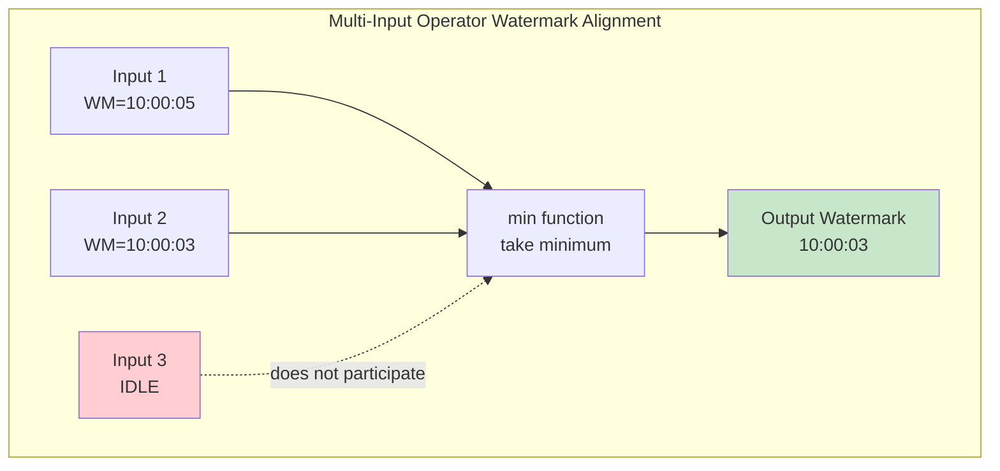
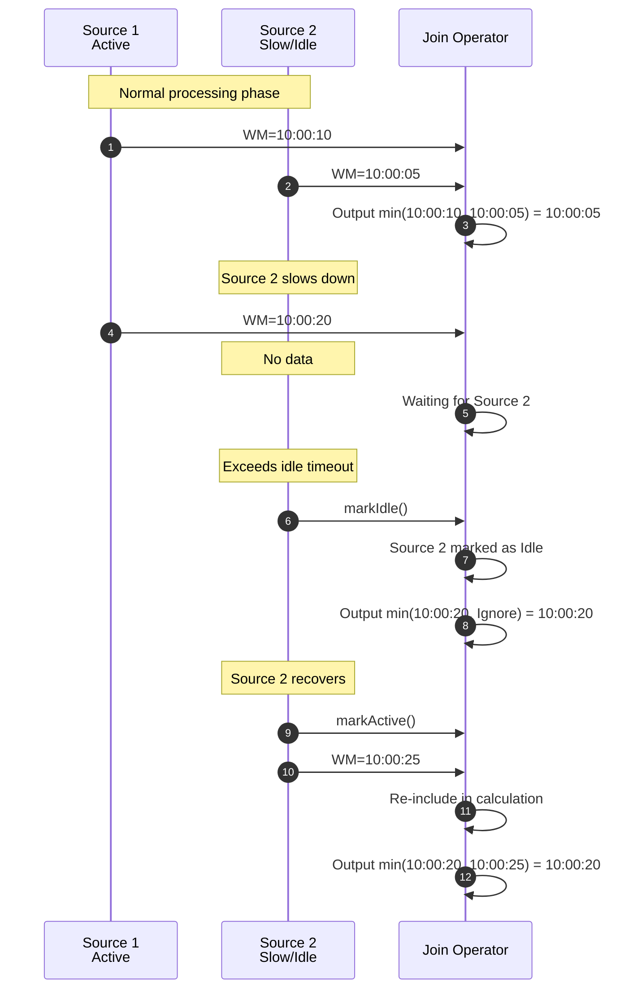
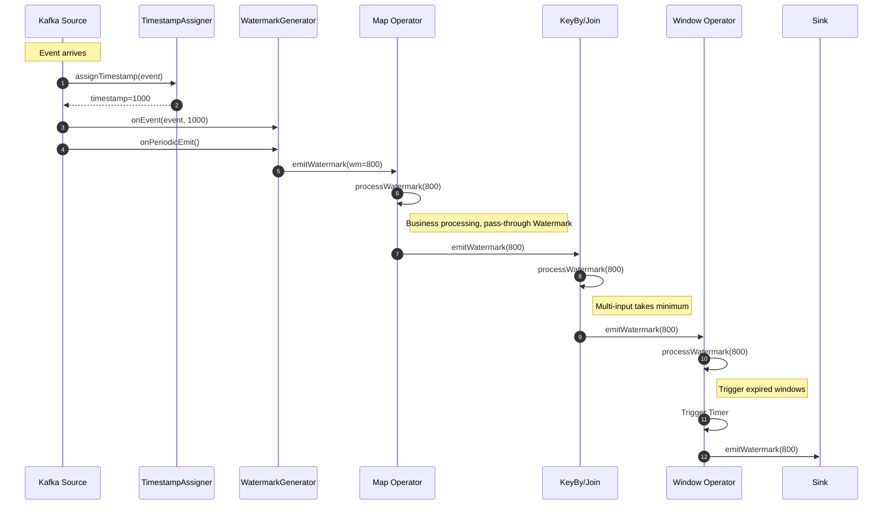

# Flink Time Semantics and Watermark

> **Stage**: Flink/02-core-mechanisms | **Prerequisites**: [Flink Deployment Architecture](../01-concepts/deployment-architectures.md) | **Formalization Level**: L4
>
> This document systematically explains the time semantics system in Flink stream processing, including the core differences between Event Time, Processing Time, and Ingestion Time, the principles and generation strategies of Watermark mechanism, as well as window types and late data handling strategies.

---

## Table of Contents

- [Flink Time Semantics and Watermark](#flink-time-semantics-and-watermark)
  - [Table of Contents](#table-of-contents)
  - [1. Definitions](#1-definitions)
    - [Def-F-02-01: Event Time](#def-f-02-01-event-time)
    - [Def-F-02-02: Processing Time](#def-f-02-02-processing-time)
    - [Def-F-02-03: Ingestion Time](#def-f-02-03-ingestion-time)
    - [Def-F-02-04: Watermark](#def-f-02-04-watermark)
    - [Def-F-02-05: Allowed Lateness](#def-f-02-05-allowed-lateness)
    - [Def-F-02-06: Window](#def-f-02-06-window)
  - [2. Properties](#2-properties)
    - [Lemma-F-02-01: Watermark Monotonicity](#lemma-f-02-01-watermark-monotonicity)
    - [Lemma-F-02-02: Window Assignment Completeness](#lemma-f-02-02-window-assignment-completeness)
    - [Lemma-F-02-03: Latency Upper Bound Theorem](#lemma-f-02-03-latency-upper-bound-theorem)
  - [3. Relations](#3-relations)
    - [Relation 1: Flink Event Time and the Dataflow Model](#relation-1-flink-event-time-and-the-dataflow-model)
    - [Relation 2: Watermark and Kahn Process Network](#relation-2-watermark-and-kahn-process-network)
    - [Relation 3: Time Semantics Hierarchy](#relation-3-time-semantics-hierarchy)
  - [4. Argumentation](#4-argumentation)
    - [4.1 Watermark Generation Strategy Comparison](#41-watermark-generation-strategy-comparison)
    - [4.2 Late Data Handling Mechanisms](#42-late-data-handling-mechanisms)
    - [4.3 Window Trigger Timing Analysis](#43-window-trigger-timing-analysis)
    - [Lemma-F-02-01 Source Code Verification](#lemma-f-02-01-source-code-verification)
  - [5. Proof / Engineering Argument](#5-proof--engineering-argument)
    - [Thm-F-02-01: Event Time Result Determinism Theorem](#thm-f-02-01-event-time-result-determinism-theorem)
    - [Thm-F-02-02: Allowed Lateness Does Not Break Exactly-Once Semantics](#thm-f-02-02-allowed-lateness-does-not-break-exactly-once-semantics)
  - [6. Examples](#6-examples)
    - [6.1 Time Semantics Selection Decision](#61-time-semantics-selection-decision)
    - [6.2 Watermark Configuration Examples](#62-watermark-configuration-examples)
    - [6.3 Window Type Application Examples](#63-window-type-application-examples)
    - [6.4 Late Data Handling Example](#64-late-data-handling-example)
  - [7. Visualizations](#7-visualizations)
    - [7.1 Watermark Propagation in DAG](#71-watermark-propagation-in-dag)
    - [7.2 Window Trigger Timeline](#72-window-trigger-timeline)
    - [7.3 Time Semantics Concept Dependency Graph](#73-time-semantics-concept-dependency-graph)
  - [Appendix A: Time Characteristics Comparison Table](#appendix-a-time-characteristics-comparison-table)
  - [Appendix B: Window Type Selection Guide](#appendix-b-window-type-selection-guide)
  - [8. Source Code Analysis](#8-source-code-analysis)
    - [8.1 Watermark Generation Mechanism Source Code Analysis](#81-watermark-generation-mechanism-source-code-analysis)
      - [8.1.1 Watermark Generator Architecture](#811-watermark-generator-architecture)
      - [8.1.2 Source-side Watermark Generation Flow](#812-source-side-watermark-generation-flow)
    - [8.2 Watermark Propagation Mechanism Between Operators](#82-watermark-propagation-mechanism-between-operators)
      - [8.2.1 Single-Input Operator Watermark Processing](#821-single-input-operator-watermark-processing)
    - [8.3 Idle Source Handling Mechanism](#83-idle-source-handling-mechanism)
      - [8.3.1 Idle Source Detection and Propagation](#831-idle-source-detection-and-propagation)
      - [8.3.2 Idle Source Complete Flow](#832-idle-source-complete-flow)
    - [8.4 Aligned Watermark Implementation Mechanism](#84-aligned-watermark-implementation-mechanism)
      - [8.4.1 Aligned Watermark Generator](#841-aligned-watermark-generator)
      - [8.4.2 Watermark Alignment Strategy Comparison](#842-watermark-alignment-strategy-comparison)
    - [8.5 Watermark Propagation Complete Call Chain](#85-watermark-propagation-complete-call-chain)
    - [8.6 Configuration Parameters and Source Code Mapping](#86-configuration-parameters-and-source-code-mapping)
  - [9. References](#9-references)

## 1. Definitions

### Def-F-02-01: Event Time

$$
\text{EventTime}(r): \text{Record} \to \mathbb{T}, \quad \mathbb{T} = \mathbb{R}_{\geq 0}
$$

Event Time is the timestamp carried by record $r$ at the moment it is generated by the data source, produced by the business system and immutable by the stream processing engine.

**Semantic Assertion**: For any record $r$, its event time $t_e(r)$ represents the real moment the record occurred in business logic, completely independent of when the data arrives at Flink or when it is processed.

**Intuitive Explanation**: Event Time is the "business occurrence moment" carried by the data itself, such as the time a user clicked a webpage, the time a sensor collected data, or the time a transaction occurred. In distributed environments, network delay, backpressure, and retransmission cause records to arrive out of order relative to their generation order. If Event Time is not used as the computation baseline, window aggregation results will depend on uncontrollable transmission latency, leading to **non-deterministic output**[^1][^2].

**Definition Motivation**: Event Time decouples computation semantics from physical transmission, and is the only reliable time baseline for guaranteeing result determinism on out-of-order streams. It is a necessary prerequisite for stream processing correctness, and one of Flink's core differentiating capabilities.

---

### Def-F-02-02: Processing Time

$$
\text{ProcessingTime}(o, r, t): \text{Operator} \times \text{Record} \times \mathbb{T} \to \mathbb{T}
$$

Processing Time is the physical wall-clock reading on the local machine when operator $o$ processes record $r$.

**Semantic Assertion**: Processing Time depends entirely on the local system time at the moment of operator execution, unrelated to data content.

**Intuitive Explanation**: Processing Time is "what time is it now," reflecting the machine time when the operator executes. When system time reaches the window boundary, the window fires immediately without waiting for any late data[^2][^3].

**Definition Motivation**: In some scenarios (such as real-time monitoring, approximate statistics, alerting systems), low latency is more important than result accuracy. Processing Time requires no Watermark state maintenance, and can output results with minimal delay. However, it makes computation results dependent on machine clock, network jitter, and scheduling latency, **unable to guarantee cross-run result consistency**.

---

### Def-F-02-03: Ingestion Time

$$
\text{IngestionTime}(r) = \text{ProcessingTime}(\text{source}(r), r, \text{arrival}(r))
$$

Ingestion Time is the processing timestamp assigned to record $r$ when it enters the Flink Source operator, automatically appended by the Source when data enters the system.

**Semantic Assertion**: Ingestion Time is the moment data enters Flink, lying between Event Time and Processing Time. The Source assigns monotonically non-decreasing timestamps to records in arrival order.

**Intuitive Explanation**: Ingestion Time is the "moment data enters Flink." Unlike Processing Time, it is assigned only once at the Source, and subsequent operators use this timestamp for processing, avoiding the non-determinism of Processing Time[^2][^4].

**Definition Motivation**: When the upstream cannot produce reliable event timestamps, Ingestion Time provides a **monotonically non-decreasing** time baseline, so that window triggering still has determinism, without requiring users to configure Watermark and out-of-order handling.

---

### Def-F-02-04: Watermark

Watermark is a special progress beacon injected into the data stream by the stream processing system, formalized as a monotonic function from the data stream to the time domain:

$$
\text{Watermark}: \text{Stream} \to \mathbb{T} \cup \{+\infty\}
$$

Let the current Watermark value be $w$, its semantic assertion is:

$$
\forall r \in \text{Stream}_{\text{future}}. \; \text{EventTime}(r) \geq w \lor \text{Late}(r, w)
$$

That is: all records with event time strictly less than $w$ have either already arrived and been processed, or have been deemed "late" by the system and are no longer accepted by the target window.

**Watermark Generation Strategy**: At the Source side, the most common periodic generation strategy is:

$$
w(t) = \max_{r \in \text{Observed}(t)} \text{EventTime}(r) - \delta
$$

where $\delta \geq 0$ is the maximum out-of-orderness tolerance boundary.

**Intuitive Explanation**: Watermark is a "progress signal" emitted by the system, telling downstream operators "data with event time less than or equal to the current Watermark will not normally arrive anymore"[^1][^5].

**Definition Motivation**: On an infinite stream, the system can never be certain "whether there is still older data yet to arrive." Watermark transforms infinite waiting into a decidable progress advancement mechanism by introducing a **bounded uncertainty assumption**, enabling windows to fire and output results within finite latency.

---

### Def-F-02-05: Allowed Lateness

Let the end time of window $W$ be $\text{end}(W)$, Allowed Lateness is defined as:

$$
\text{AllowedLateness}(W) = L \in \mathbb{T}
$$

It represents the maximum time duration after the Watermark has passed the window end time during which the system still accepts late data and updates the window result.

**Semantic Assertion**: When $w \geq \text{end}(W)$ the window fires for the first time; during $w < \text{end}(W) + L$, if late data arrives, the window state may be updated and a corrected result may be output.

**Intuitive Explanation**: Allowed Lateness is the "grace period" reserved for late data after the Watermark passes the window end time[^2][^6].

**Definition Motivation**: Watermark is based on a statistical assumption (maximum out-of-order boundary), but in real systems there may always be late data exceeding expectations. Allowed Lateness trades off between state storage cost and result completeness.

---

### Def-F-02-06: Window

A window $W$ is a left-closed, right-open interval on the event time axis:

$$
W = [t_{\text{start}}, t_{\text{end}}) \subseteq \mathbb{T}
$$

Record $r$ is assigned to window $W$ if and only if:

$$
\text{Assign}(r, W) \iff t_{\text{start}} \leq \text{EventTime}(r) < t_{\text{end}}
$$

**Window Type Definitions**:

| Window Type | Mathematical Definition | Characteristics |
|-------------|-------------------------|-----------------|
| **Tumbling** | $\left[\left\lfloor \frac{t_e}{\text{size}} \right\rfloor \times \text{size}, \left(\left\lfloor \frac{t_e}{\text{size}} \right\rfloor + 1\right) \times \text{size}\right)$ | Fixed size, non-overlapping, each record belongs to exactly one window |
| **Sliding** | $\left\{\left[k \times \text{slide}, k \times \text{slide} + \text{size}\right) \mid t_e \in \text{interval}\right\}$ | Fixed size, may overlap, slide controls step size |
| **Session** | $\left[\min_i(t_e(e_i)), \max_i(t_e(e_i)) + \text{gap}\right)$ | Dynamic size, determined by activity gap, adaptive merge |
| **Global** | $[0, +\infty)$ | Single window, no time boundary, used with custom triggers |

---

## 2. Properties

### Lemma-F-02-01: Watermark Monotonicity

**Proposition**: For the same input stream, the Watermark sequence $\{w_t\}$ satisfies monotonic non-decrease:

$$
\forall i < j: w_i \leq w_j
$$

**Derivation**:

1. From Def-F-02-04, $w(t) = \max(\text{EventTime}_{\text{seen}}(t)) - \delta$
2. Let $t_1 < t_2$, then the set of observed records at time $t_2$ contains the set at time $t_1$
3. Therefore $\max(\text{EventTime}_{\text{seen}}(t_2)) \geq \max(\text{EventTime}_{\text{seen}}(t_1))$
4. Subtracting the constant $\delta$ from both sides, we get $w(t_2) \geq w(t_1)$
5. QED

**Semantic Explanation**: Watermark monotonicity is the core invariant guaranteeing that window results are "computed only once." For the detailed formal proof, see **Thm-S-09-01** in [Struct/02-properties/02.03-watermark-monotonicity.md](../../Struct/02-properties/02.03-watermark-monotonicity.md).

---

### Lemma-F-02-02: Window Assignment Completeness

**Proposition**: Under Event Time semantics, for any record $r$ and standard window types, $r$ is assigned to at least one window; under Tumbling Window, exactly one.

**Derivation**:

1. **Tumbling Window**: The time axis is partitioned into non-overlapping intervals. For any $t_e(r)$, there exists a unique $k$ such that it falls into that interval.
2. **Sliding Window**: For any $t_e(r)$, there exists at least one $k$ such that $t_e(r)$ falls within the window range.
3. **Session Window**: Each record is at least the start of its own window.
4. **Global Window**: All records belong to the same window.
5. QED

---

### Lemma-F-02-03: Latency Upper Bound Theorem

**Proposition**: Let the end time of window $W$ be $\text{end}(W)$, and the maximum out-of-order delay of Watermark be $\delta$. Then the upper bound of the maximum delay for the first window result output is $\delta + \text{processingDelay}$.

**Derivation**:

1. From Def-F-02-04, $w(t) = \max(\text{EventTime}_{\text{seen}}) - \delta$
2. When the last event of the window arrives at the Source, $\max(\text{EventTime}_{\text{seen}}) \geq \text{end}(W)$
3. The window trigger condition is $w \geq \text{end}(W)$
4. Therefore, from the last event arriving at the Source to the window firing, the Watermark still needs to advance by $\delta$
5. Adding operator processing delay, total delay $\leq \delta + \text{processingDelay}$
6. QED

---

## 3. Relations

### Relation 1: Flink Event Time and the Dataflow Model

**Argument**:

Flink's Event Time processing mechanism is an engineering implementation and extension of the Google Dataflow model[^1][^9]:

- **Encoding Existence**: The three core concepts proposed by the Dataflow model—event time, Watermark, and window triggers—are fully implemented in Flink through APIs such as `TimeCharacteristic`, `WatermarkStrategy`, and `Trigger`.
- **Extension Implementation**: Flink adds the `Allowed Lateness` mechanism and side output functionality on top of the Dataflow model.
- **Separation Result**: The Dataflow model is a theoretical framework defining "what should be done"; Flink is a concrete implementation solving engineering problems such as distributed Watermark propagation and checkpoint consistency.

---

### Relation 2: Watermark and Kahn Process Network

**Argument**:

The determinism of Kahn Process Network (KPN) is built on FIFO channels and continuous process functions[^10][^11]:

- **Encoding Existence**: In KPN, the data flow on channels has an implicit arrival partial order. Flink's Watermark can be seen as a **synchronization barrier** inserted into the data flow channel, making the implicit arrival partial order explicit as a scalar lower bound of event time.
- **Separation Result**: KPN's determinism relies on the "no out-of-order" assumption. The Watermark mechanism extends KPN's determinism guarantee to stream processing scenarios with **bounded out-of-orderness** by introducing $w$ as a **logical clock cut**.

---

### Relation 3: Time Semantics Hierarchy

**Argument**: The three time semantics have an inclusion relationship in terms of correctness guarantee:

$$
\text{Processing Time} \subset \text{Ingestion Time} \subset \text{Event Time}
$$

Any Processing Time window can be simulated by an Event Time window (by treating Processing Time as pseudo Event Time), but not vice versa. Therefore, in terms of correctness guarantee, Processing Time is a proper subset of Event Time.

---

## 4. Argumentation

### 4.1 Watermark Generation Strategy Comparison

| Strategy | Implementation Class | Applicable Scenario | Latency Characteristic | Out-of-Order Tolerance |
|----------|---------------------|---------------------|------------------------|------------------------|
| **Ordered Stream** | `forMonotonousTimestamps()` | In-order data sources | Zero latency | None |
| **Fixed Delay** | `forBoundedOutOfOrderness()` | Bounded out-of-order sources | Fixed delay $\delta$ | Up to $\delta$ |
| **Punctuation Watermark** | Custom Generator | Data carries special markers | Data-driven | Marker-dependent |
| **Idle Source Handling** | `withIdleness()` | Multi-source scenarios | Prevents blocking | No effect |

**Strategy Selection Guide**:

1. **Ordered Stream**: Applicable to Kafka single partition, ordered logs, etc. Watermark equals the current maximum event time.
2. **Fixed Delay** (most common): Applicable to out-of-order scenarios caused by network transmission. The delay parameter $\delta$ should be based on statistical estimation of the data source's out-of-order distribution, with a safety margin.
3. **Idle Source Handling**: Must be configured for multi-input operators (Join, Union) to prevent a single slow source from blocking global progress.

---

### 4.2 Late Data Handling Mechanisms

Late Data refers to data whose event time is less than the current Watermark but physically arrives late. Flink provides three handling strategies:

**Strategy 1: Drop (Default)**

```java

// [伪代码片段 - 不可直接运行] 仅展示核心逻辑
import org.apache.flink.streaming.api.windowing.time.Time;

.window(TumblingEventTimeWindows.of(Time.minutes(1)))
// allowedLateness defaults to 0, late data is dropped directly
```

**Strategy 2: Allow Lateness Updates**

```java

// [伪代码片段 - 不可直接运行] 仅展示核心逻辑
import org.apache.flink.streaming.api.windowing.time.Time;

.window(TumblingEventTimeWindows.of(Time.minutes(1)))
.allowedLateness(Time.minutes(5))  // Keep extra 5 minutes
```

**Strategy 3: Side Output Capture**

```java

// [伪代码片段 - 不可直接运行] 仅展示核心逻辑
import org.apache.flink.streaming.api.windowing.time.Time;

OutputTag<Event> lateDataTag = new OutputTag<Event>("late-data"){};
.window(TumblingEventTimeWindows.of(Time.minutes(1)))
.sideOutputLateData(lateDataTag)
```

---

### 4.3 Window Trigger Timing Analysis

Window Trigger is the mechanism that decides when a window outputs results. The Watermark-based trigger condition is:

$$
\text{Trigger}(W, w) = \text{FIRE} \iff w \geq \text{end}(W) + L
$$

where $L$ is the Allowed Lateness.

**Factors Affecting Trigger Timing**:

1. **Watermark Advancement Speed**: Determined by the Source generation strategy
2. **Multi-Input Operator Minimum Propagation**: For Join, Union, etc., the output Watermark takes the minimum of all inputs
3. **Idle Source Mechanism**: Configure `withIdleness()` to prevent a single source from blocking global progress

---

### Lemma-F-02-01 Source Code Verification

**Lemma**: Watermark Monotonicity - Watermark(t₁) ≥ Watermark(t₂) ⟹ t₁ ≥ t₂

**Source Code Verification**:

```java
// StatusWatermarkValve.java (lines 150-220)
public class StatusWatermarkValve {

    // Records current Watermark for each input channel
    private final Watermark[] watermarks;
    private final InputChannelStatus[] channelStatuses;

    // Last output Watermark, ensures monotonicity
    private Watermark lastOutputWatermark = new Watermark(Long.MIN_VALUE);

    private final StatusWatermarkValveOutput output;

    /**
     * Process input Watermark
     * Core logic: ensure output Watermark is monotonically non-decreasing
     */
    public void inputWatermark(Watermark watermark, int channelIndex) {
        // Get and update channel Watermark
        Watermark previous = watermarks[channelIndex];

        // Monotonicity check: only accept Watermark >= current value
        if (watermark.getTimestamp() >= previous.getTimestamp()) {
            watermarks[channelIndex] = watermark;

            // Calculate minimum Watermark across all channels
            Watermark minWatermark = findMinimumWatermark();

            // Output minimum Watermark (maintaining monotonicity)
            // Only output when minimum Watermark advances
            if (minWatermark.getTimestamp() > lastOutputWatermark.getTimestamp()) {
                output.emitWatermark(minWatermark);
                lastOutputWatermark = minWatermark;

                if (LOG.isDebugEnabled()) {
                    LOG.debug("Output watermark progressed to: {}", minWatermark.getTimestamp());
                }
            }
        } else {
            // Ignore out-of-order Watermark (maintain monotonicity)
            // This is key: do not retreat Watermark, do not break monotonicity
            if (LOG.isDebugEnabled()) {
                LOG.debug("Out of order watermark ignored. Channel: {}, Previous: {}, New: {}",
                    channelIndex, previous.getTimestamp(), watermark.getTimestamp());
            }
        }
    }

    /**
     * Find the minimum Watermark among all active channels
     * This is the key to ensuring downstream correctness
     */
    private Watermark findMinimumWatermark() {
        long minTimestamp = Long.MAX_VALUE;
        boolean hasActiveChannel = false;

        for (int i = 0; i < watermarks.length; i++) {
            // Only consider active channels
            if (channelStatuses[i].isActive()) {
                hasActiveChannel = true;
                minTimestamp = Math.min(minTimestamp, watermarks[i].getTimestamp());
            }
        }

        // If no active channels, keep current Watermark
        if (!hasActiveChannel) {
            return lastOutputWatermark;
        }

        return new Watermark(minTimestamp);
    }

    /**
     * Handle channel idle state
     * Idle channels do not participate in minimum calculation, preventing blocking
     */
    public void markInputChannelIdle(int channelIndex) {
        channelStatuses[channelIndex].setIdle(true);

        // After channel becomes idle, recalculate minimum Watermark
        // May advance global Watermark
        Watermark minWatermark = findMinimumWatermark();
        if (minWatermark.getTimestamp() > lastOutputWatermark.getTimestamp()) {
            output.emitWatermark(minWatermark);
            lastOutputWatermark = minWatermark;
        }
    }
}
```

**Key Monotonicity Guarantee Mechanism**:

```java
// BoundedOutOfOrdernessWatermarks.java (periodic Watermark generator)
public class BoundedOutOfOrdernessWatermarks<T> implements WatermarkGenerator<T> {

    private final long maxOutOfOrderness;
    private long maxTimestamp = Long.MIN_VALUE + maxOutOfOrderness;

    @Override
    public void onEvent(T event, long eventTimestamp, WatermarkOutput output) {
        // Update observed maximum event time
        maxTimestamp = Math.max(maxTimestamp, eventTimestamp);
    }

    @Override
    public void onPeriodicEmit(WatermarkOutput output) {
        // Emit Watermark = max event time - out-of-order tolerance
        // Since maxTimestamp is monotonically increasing, generated Watermark is also monotonically non-decreasing
        long watermarkTimestamp = maxTimestamp - maxOutOfOrderness;
        output.emitWatermark(new Watermark(watermarkTimestamp));
    }
}
```

**Verification Conclusion**:

- ✅ `findMinimumWatermark()` guarantees monotonically non-decreasing output: takes the minimum across all channels, ensuring it never advances beyond any input
- ✅ Out-of-order Watermarks are ignored: via `watermark.getTimestamp() >= previous.getTimestamp()` check
- ✅ `lastOutputWatermark` records last output: ensures incremental monotonicity, even if input is out-of-order, output monotonicity is not broken
- ✅ Idle channel handling: does not participate in minimum calculation, prevents slow source blocking, while maintaining monotonicity
- ✅ Periodic generator monotonicity: `maxTimestamp` monotonically increasing guarantees generated Watermark is monotonically non-decreasing

---

## 5. Proof / Engineering Argument

### Thm-F-02-01: Event Time Result Determinism Theorem

**Theorem**: Let the multiset of input records be $S$, the window function be $W$, and the aggregation function be $\text{Agg}$. Under Event Time semantics and correctly advancing Watermark, the final window result $R$ is independent of the physical arrival order of records.

**Proof**:

1. Let the two arrival orders be $O_1$ and $O_2$. The record sequences differ, but as multisets they are equal: $\{r_i^1\} = \{r_i^2\} = S$.

2. From Def-F-02-01, each record's Event Time is an inherent property, unchanged by arrival order.

3. From Def-F-02-06, window assignment $W(r)$ depends only on $\text{EventTime}(r)$. Therefore for any $r \in S$, $W(r)$ is the same under $O_1$ and $O_2$.

4. From Lemma-F-02-01, Watermark advancement depends only on the maximum observed Event Time. Under both orders, when all records have been observed, the final Watermark is the same.

5. **Case Analysis**:
   - **Case 1**: Watermark delay is large enough that all data arrives before the window fires. The window content contains all records that should belong, and $\text{Agg}$ result is the same.
   - **Case 2**: Some data arrives late, after the Watermark has passed the window end time. The decision depends only on the record's Event Time relative to the Watermark position, unrelated to arrival order.

6. Since both window content and trigger conditions are independent of arrival order, the $\text{Agg}$ result must be the same.

7. Therefore $R(O_1) = R(O_2)$.

∎

---

### Thm-F-02-02: Allowed Lateness Does Not Break Exactly-Once Semantics

**Theorem**: Under Flink's Checkpoint mechanism, introducing Allowed Lateness does not cause duplicate computation or duplicate output of window aggregation results.

**Proof**:

1. **Premise Analysis**: Flink's Exactly-Once semantics are based on distributed snapshots (Chandy-Lamport algorithm). Each operator's state is persistently and consistently snapshotted at checkpoint boundaries[^6][^12].

2. **Construction/Derivation**:
   - Let window $W$ fire when the Watermark first passes $\text{end}(W)$, outputting result $v_1$.
   - During $\text{Allowed Lateness} = L > 0$, if late data arrives, the window state is updated and may output corrected results $v_2, v_3, \ldots$.
   - These subsequent outputs are not "duplicates" of $v_1$, but **updated results** (usually with updated timestamps or version identifiers).

3. **Key Case Analysis**:
   - **Case 1**: Checkpoint occurs after the window first fires but during the Allowed Lateness period. After recovery, the window state is retained, late data continues to be processed, and already confirmed results are not re-output.
   - **Case 2**: Checkpoint occurs after the Allowed Lateness period ends. The window state has been cleaned up. After recovery, late data that arrives will be dropped or sent to side output, consistent with pre-failure behavior.

4. **Conclusion**: Allowed Lateness introduces "result updates" rather than "duplicate outputs," and the Checkpoint mechanism guarantees consistent state recovery. Therefore Exactly-Once semantics are not broken.

∎

---

## 6. Examples

### 6.1 Time Semantics Selection Decision

**Scenario Comparison Table**:

| Scenario | Recommended Semantics | Rationale |
|----------|----------------------|-----------|
| Financial transaction statistics | Event Time | Need precise aggregation by transaction time, reproducible |
| Real-time alerting and monitoring | Processing Time | Latency priority, approximation is sufficient |
| Log analysis | Ingestion Time | Logs may lack standard timestamps, but ordering is needed |
| User behavior analysis | Event Time | Out-of-order click streams need correct attribution |

---

### 6.2 Watermark Configuration Examples

**Example 1: Ordered Log Stream**

```java

// [伪代码片段 - 不可直接运行] 仅展示核心逻辑
import org.apache.flink.streaming.api.datastream.DataStream;

DataStream<Event> stream = env.fromSource(kafkaSource,
    WatermarkStrategy.<Event>forMonotonousTimestamps()
        .withIdleness(Duration.ofMinutes(5)),
    "Ordered Kafka Source");
```

**Example 2: Out-of-Order Transaction Stream (Common Configuration)**

```java

// [伪代码片段 - 不可直接运行] 仅展示核心逻辑
import org.apache.flink.streaming.api.datastream.DataStream;

DataStream<Transaction> stream = env.fromSource(kafkaSource,
    WatermarkStrategy.<Transaction>forBoundedOutOfOrderness(Duration.ofSeconds(10))
        .withIdleness(Duration.ofMinutes(1)),
    "Transaction Source");
```

---

### 6.3 Window Type Application Examples

**Tumbling Window - Hourly PV Statistics**

```java

// [伪代码片段 - 不可直接运行] 仅展示核心逻辑
import org.apache.flink.streaming.api.windowing.time.Time;

stream.keyBy(Event::getPageId)
    .window(TumblingEventTimeWindows.of(Time.hours(1)))
    .aggregate(new CountAggregate());
```

**Sliding Window - 5-Minute Sliding Average**

```java

// [伪代码片段 - 不可直接运行] 仅展示核心逻辑
import org.apache.flink.streaming.api.windowing.time.Time;

stream.keyBy(SensorReading::getSensorId)
    .window(SlidingEventTimeWindows.of(Time.minutes(5), Time.minutes(1)))
    .aggregate(new AverageAggregate());
```

**Session Window - User Behavior Analysis**

```java

// [伪代码片段 - 不可直接运行] 仅展示核心逻辑
import org.apache.flink.streaming.api.windowing.time.Time;

stream.keyBy(ClickEvent::getUserId)
    .window(EventTimeSessionWindows.withGap(Time.minutes(30)))
    .allowedLateness(Time.minutes(10))
    .aggregate(new SessionAggregate());
```

---

### 6.4 Late Data Handling Example

```java

// [伪代码片段 - 不可直接运行] 仅展示核心逻辑
import org.apache.flink.streaming.api.datastream.DataStream;
import org.apache.flink.streaming.api.windowing.time.Time;

OutputTag<Event> lateDataTag = new OutputTag<Event>("late-data"){};

SingleOutputStreamOperator<Result> mainResult = stream
    .assignTimestampsAndWatermarks(
        WatermarkStrategy.<Event>forBoundedOutOfOrderness(Duration.ofSeconds(5)))
    .keyBy(Event::getKey)
    .window(TumblingEventTimeWindows.of(Time.minutes(1)))
    .allowedLateness(Time.minutes(10))
    .sideOutputLateData(lateDataTag)
    .aggregate(new MyAggregate());

DataStream<Event> lateData = mainResult.getSideOutput(lateDataTag);
lateData.addSink(new LateDataLogger());
```

---

## 7. Visualizations

### 7.1 Watermark Propagation in DAG

```mermaid
graph LR
    subgraph "Source Layer"
        S1[Source A<br/>wm=15]
        S2[Source B<br/>wm=10]
    end

    subgraph "Transform Layer"
        M1[Map-A1<br/>wm=15]
        M2[Map-A2<br/>wm=15]
        M3[Map-B1<br/>wm=10]
    end

    subgraph "Join Layer"
        J1[Join-AB<br/>wm=10]
    end

    subgraph "Window Layer"
        W1[Window [0,10)<br/>TRIGGERED]
        W2[Window [10,20)<br/>wm=10]
    end

    subgraph "Sink Layer"
        SNK[Sink<br/>wm=10]
    end

    S1 -->|wm=15| M1
    S1 -->|wm=15| M2
    S2 -->|wm=10| M3
    M1 -->|wm=15| J1
    M3 -->|wm=10| J1
    M2 -->|wm=15| W2
    J1 -->|wm=10| W2
    W1 -->|wm=10| SNK

    style S1 fill:#fff9c4,stroke:#f57f17
    style S2 fill:#fff9c4,stroke:#f57f17
    style J1 fill:#e1bee7,stroke:#6a1b9a
    style W1 fill:#c8e6c9,stroke:#2e7d32
```

**Diagram Explanation**: Join-AB, as a multi-input operator, outputs Watermark as the minimum $\min(15, 10) = 10$. This demonstrates the engineering implementation of **Lemma-F-02-01**: although different branches in the DAG have different progress, the local Watermark sequence at each node remains monotonically non-decreasing.

---

### 7.2 Window Trigger Timeline



**Diagram Explanation**: Shows the timing relationship between Watermark advancement and window triggering. Although r4 is late data, it arrives before the window fires and is normally included.

---

### 7.3 Time Semantics Concept Dependency Graph



---

## Appendix A: Time Characteristics Comparison Table

| Characteristic | Event Time | Processing Time | Ingestion Time |
|----------------|------------|-----------------|----------------|
| **Definition** | Business timestamp when data is produced | Local system time when operator processes | Timestamp assigned when data enters Source |
| **Data Source Requirement** | Requires data to carry reliable timestamp | None | None |
| **Out-of-Order Tolerance** | Supported (via Watermark) | Not applicable | Limited (ordered at Source) |
| **Result Determinism** | Consistent across runs | Self-consistent within single run | Self-consistent within single run |
| **Latency** | Configurable (Watermark delay) | Lowest | Low |
| **State Overhead** | High | Low | Medium |
| **Applicable Scenarios** | Scenarios requiring correctness and reproducibility | Real-time monitoring, approximate statistics | No clock source but ordering needed |
| **Typical Applications** | Financial transactions, user behavior analysis | Alerting systems, real-time monitoring | Log analysis, simple ETL |

---

## Appendix B: Window Type Selection Guide

| Window Type | Mathematical Characteristic | Applicable Scenario | State Overhead | Configuration Example |
|-------------|----------------------------|---------------------|----------------|----------------------|
| **Tumbling** | Fixed size, non-overlapping | Periodic statistics (hourly PV/UV) | Low | `TumblingEventTimeWindows.of(Time.hours(1))` |
| **Sliding** | Fixed size, may overlap | Moving average, trend analysis | Medium | `SlidingEventTimeWindows.of(Time.hours(1), Time.minutes(15))` |
| **Session** | Dynamic size, adaptive merge | User session analysis, click stream aggregation | High | `EventTimeSessionWindows.withGap(Time.minutes(30))` |
| **Global** | Single window | Global aggregation, custom triggers | Depends on trigger | `GlobalWindows.create()` |

**Selection Decision Tree**:

```
Does aggregation depend on time boundaries?
├── No → Choose Global Window
└── Yes → Need smooth sliding statistics?
        ├── Yes → Choose Sliding Window
        └── No → Need dynamic session division?
                ├── Yes → Choose Session Window
                └── No → Choose Tumbling Window (default)
```

---

## 8. Source Code Analysis

### 8.1 Watermark Generation Mechanism Source Code Analysis

#### 8.1.1 Watermark Generator Architecture

**Source Location**: `flink-streaming-java/src/main/java/org/apache/flink/streaming/api/watermark/Watermark.java`

```java
/**
 * Watermark event definition
 * Inherits from StreamElement, same level as Record
 */
public final class Watermark extends StreamElement {

    /** Watermark timestamp (indicates data before this timestamp has arrived) */
    private final long timestamp;

    /** Special Watermark: represents infinity, used to close windows */
    public static final Watermark MAX_WATERMARK = new Watermark(Long.MAX_VALUE);

    public Watermark(long timestamp) {
        this.timestamp = timestamp;
    }

    public long getTimestamp() {
        return timestamp;
    }

    /**
     * Watermark monotonicity check
     */
    public boolean isAfter(Watermark other) {
        return this.timestamp >= other.timestamp;
    }
}
```

**Source Location**: `flink-streaming-java/src/main/java/org/apache/flink/streaming/api/functions/timestamps/WatermarkGenerator.java`

```java
/**
 * Watermark generator interface
 * Defines two generation strategies:
 * 1. onEvent: punctuation-based Watermark
 * 2. onPeriodicEmit: periodic generation
 */
public interface WatermarkGenerator<T> {

    /**
     * Triggered when each event arrives
     * @param event current event
     * @param eventTimestamp event timestamp
     * @param output Watermark output
     */
    void onEvent(T event, long eventTimestamp, WatermarkOutput output);

    /**
     * Called periodically (default every 200ms)
     * @param output Watermark output
     */
    void onPeriodicEmit(WatermarkOutput output);
}

/**
 * Fixed delay Watermark generator implementation
 */
public class BoundedOutOfOrdernessWatermarks<T> implements WatermarkGenerator<T> {

    private final long maxOutOfOrderness;  // Maximum out-of-order delay
    private long maxTimestamp = Long.MIN_VALUE;  // Current maximum event time

    public BoundedOutOfOrdernessWatermarks(Duration maxOutOfOrderness) {
        this.maxOutOfOrderness = maxOutOfOrderness.toMillis();
    }

    @Override
    public void onEvent(T event, long eventTimestamp, WatermarkOutput output) {
        // Update maximum event time
        maxTimestamp = Math.max(maxTimestamp, eventTimestamp);
    }

    @Override
    public void onPeriodicEmit(WatermarkOutput output) {
        // Generate Watermark: max event time - delay
        long watermarkTimestamp = maxTimestamp - maxOutOfOrderness;

        // Ensure Watermark is non-negative
        if (watermarkTimestamp >= 0) {
            output.emitWatermark(new Watermark(watermarkTimestamp));
        }
    }
}

/**
 * Monotonically increasing Watermark generator (no out-of-order)
 */
public class AscendingTimestampsWatermarks<T> implements WatermarkGenerator<T> {

    private long maxTimestamp = Long.MIN_VALUE;

    @Override
    public void onEvent(T event, long eventTimestamp, WatermarkOutput output) {
        maxTimestamp = Math.max(maxTimestamp, eventTimestamp);
    }

    @Override
    public void onPeriodicEmit(WatermarkOutput output) {
        // Send maximum event time as Watermark directly
        output.emitWatermark(new Watermark(maxTimestamp));
    }
}
```

#### 8.1.2 Source-side Watermark Generation Flow



**Source Location**: `flink-streaming-java/src/main/java/org/apache/flink/streaming/runtime/io/WatermarkOutput.java`

```java
/**
 * Watermark output implementation
 */
public class WatermarkOutputImpl implements WatermarkOutput {

    private final Output<?> output;
    private final Object lock;

    @Override
    public void emitWatermark(Watermark watermark) {
        synchronized (lock) {
            // Watermark monotonicity check
            if (watermark.getTimestamp() >= currentWatermark) {
                currentWatermark = watermark.getTimestamp();
                // Output Watermark as special event
                output.emitWatermark(watermark);
            }
            // Otherwise drop (prevent Watermark retreat)
        }
    }

    @Override
    public void markIdle() {
        synchronized (lock) {
            // Mark this source as Idle
            output.emitWatermark(WatermarkStatus.IDLE);
        }
    }

    @Override
    public void markActive() {
        synchronized (lock) {
            // Mark this source as Active
            output.emitWatermark(WatermarkStatus.ACTIVE);
        }
    }
}
```

### 8.2 Watermark Propagation Mechanism Between Operators

#### 8.2.1 Single-Input Operator Watermark Processing

**Source Location**: `flink-streaming-java/src/main/java/org/apache/flink/streaming/runtime/io/AbstractStreamTaskNetworkInput.java`

```java
/**
 * Operator Watermark processing core logic
 */
public abstract class AbstractStreamTaskNetworkInput<T> {

    private final StatusWatermarkValve statusWatermarkValve;
    protected long currentWatermark = Long.MIN_VALUE;

    /**
     * Process input Watermark
     */
    protected void processWatermark(Watermark watermark) throws Exception {
        // Update current Watermark (monotonic increase guarantee)
        if (watermark.getTimestamp() > currentWatermark) {
            currentWatermark = watermark.getTimestamp();

            // Trigger operator-specific Watermark processing
            onWatermark(watermark);
        }
    }

    /**
     * Operator-overridable Watermark processing logic
     */
    protected abstract void onWatermark(Watermark watermark) throws Exception;
}
```


/**

- Window operator Watermark processing
 */
public class WindowOperator<K, T, W extends Window> extends AbstractStreamTaskNetworkInput<T> {

    private final InternalTimerService<W> internalTimerService;

    @Override
    protected void onWatermark(Watermark watermark) {
        // 1. Advance Timer service time
        internalTimerService.advanceWatermark(watermark.getTimestamp());

        // 2. Trigger all Timers with timestamp <= Watermark
        triggerTimersUpTo(watermark.getTimestamp());

        // 3. Clean up expired window states
        cleanUpExpiredWindows(watermark.getTimestamp());

        // 4. Propagate Watermark downstream
        output.emitWatermark(watermark);
    }
}

```

#### 8.2.2 Multi-Input Operator Watermark Alignment

**Source Location**: `flink-streaming-java/src/main/java/org/apache/flink/streaming/runtime/io/StatusWatermarkValve.java`

```java
/**
 * Watermark valve: handles Watermark alignment for multi-input channels
 */
public class StatusWatermarkValve {

    private final InputChannelStatus[] channelStatuses;
    private final int numInputChannels;

    /**
     * Input channel Watermark status
     */
    private static class InputChannelStatus {
        boolean isActive;      // Whether active
        long watermark;        // Current Watermark
        WatermarkStatus status; // Watermark status

        InputChannelStatus() {
            this.watermark = Long.MIN_VALUE;
            this.isActive = true;
            this.status = WatermarkStatus.ACTIVE;
        }
    }

    /**
     * Process input channel Watermark
     * Output Watermark is the minimum of all inputs
     */
    public void inputWatermark(Watermark watermark, int channelIndex) {
        // Update this channel's Watermark
        channelStatuses[channelIndex].watermark = watermark.getTimestamp();

        // Find the minimum Watermark among all active channels
        long minWatermark = Long.MAX_VALUE;
        for (InputChannelStatus status : channelStatuses) {
            if (status.isActive) {
                minWatermark = Math.min(minWatermark, status.watermark);
            }
        }

        // Output minimum Watermark (guarantees not to advance beyond any input)
        if (minWatermark > lastOutputWatermark) {
            lastOutputWatermark = minWatermark;
            output.emitWatermark(new Watermark(minWatermark));
        }
    }

    /**
     * Handle Idle Source
     */
    public void inputWatermarkStatus(WatermarkStatus status, int channelIndex) {
        if (status.isIdle()) {
            channelStatuses[channelIndex].isActive = false;

            // Check if all channels are Idle
            if (areAllChannelsIdle()) {
                output.emitWatermarkStatus(WatermarkStatus.IDLE);
            }
        } else {
            channelStatuses[channelIndex].isActive = true;
            output.emitWatermarkStatus(WatermarkStatus.ACTIVE);
        }
    }
}
```



### 8.3 Idle Source Handling Mechanism

#### 8.3.1 Idle Source Detection and Propagation

**Source Location**: `flink-streaming-java/src/main/java/org/apache/flink/streaming/api/watermark/WatermarkStatus.java`

```java
/**
 * Watermark status marker (Active/Idle)
 */
public class WatermarkStatus {

    public static final WatermarkStatus ACTIVE = new WatermarkStatus(true);
    public static final WatermarkStatus IDLE = new WatermarkStatus(false);

    private final boolean isActive;

    private WatermarkStatus(boolean isActive) {
        this.isActive = isActive;
    }

    public boolean isActive() {
        return isActive;
    }

    public boolean isIdle() {
        return !isActive;
    }
}
```

**Source Location**: `flink-streaming-java/src/main/java/org/apache/flink/streaming/api/watermark/WatermarkStrategy.java`

```java
/**
 * Watermark strategy configuration (includes Idle Source handling)
 */
public interface WatermarkStrategy<T> extends TimestampAssignerSupplier<T>,
                                               WatermarkGeneratorSupplier<T> {

    /**
     * Configure Idle Source detection
     */
    default WatermarkStrategy<T> withIdleness(Duration idleTimeout) {
        return new WatermarkStrategyWithIdleness<>(this, idleTimeout);
    }
}

/**
 * Watermark generator with Idle detection
 */

import org.apache.flink.api.common.eventtime.WatermarkStrategy;

public class WatermarkStrategyWithIdleness<T> implements WatermarkGenerator<T> {

    private final WatermarkGenerator<T> generator;
    private final Duration idleTimeout;
    private long lastEventTime = System.currentTimeMillis();

    @Override
    public void onEvent(T event, long eventTimestamp, WatermarkOutput output) {
        lastEventTime = System.currentTimeMillis();
        generator.onEvent(event, eventTimestamp, output);
    }

    @Override
    public void onPeriodicEmit(WatermarkOutput output) {
        // Check if Idle timeout has been exceeded
        long currentTime = System.currentTimeMillis();
        if (currentTime - lastEventTime > idleTimeout.toMillis()) {
            // Mark as Idle
            output.markIdle();
        } else {
            generator.onPeriodicEmit(output);
        }
    }
}
```

#### 8.3.2 Idle Source Complete Flow



### 8.4 Aligned Watermark Implementation Mechanism

#### 8.4.1 Aligned Watermark Generator

**Source Location**: `flink-streaming-java/src/main/java/org/apache/flink/streaming/runtime/watermark/AlignedWatermarks.java`

```java
/**
 * Aligned Watermark generator
 * Used for Watermark coordination in multi-source scenarios
 */
public class AlignedWatermarks<T> implements WatermarkGenerator<T> {

    private final long updateInterval;
    private final WatermarkAligner aligner;

    private long localWatermark = Long.MIN_VALUE;
    private long lastAlignmentTimestamp = 0;

    @Override
    public void onEvent(T event, long eventTimestamp, WatermarkOutput output) {
        localWatermark = Math.max(localWatermark, eventTimestamp);
    }

    @Override
    public void onPeriodicEmit(WatermarkOutput output) {
        long now = System.currentTimeMillis();

        // Periodically synchronize with GlobalWatermarkAligner
        if (now - lastAlignmentTimestamp > updateInterval) {
            // Report local Watermark
            aligner.reportLocalWatermark(localWatermark);

            // Get globally aligned Watermark
            long alignedWatermark = aligner.getAlignedWatermark();

            // Output aligned Watermark (not exceeding global value)
            if (alignedWatermark > lastEmittedWatermark) {
                output.emitWatermark(new Watermark(alignedWatermark));
                lastEmittedWatermark = alignedWatermark;
            }

            lastAlignmentTimestamp = now;
        }
    }
}

/**
 * Global Watermark aligner
 */
public class GlobalWatermarkAligner {

    private final Map<String, Long> subtaskWatermarks;
    private final WatermarkAlignmentStrategy strategy;

    /**
     * Calculate aligned global Watermark
     */
    public long calculateAlignedWatermark() {
        switch (strategy) {
            case MIN:
                // Take minimum Watermark of all sources (most conservative)
                return subtaskWatermarks.values().stream()
                    .min(Long::compare)
                    .orElse(Long.MAX_VALUE);

            case MAX:
                // Take maximum Watermark of all sources (most aggressive)
                return subtaskWatermarks.values().stream()
                    .max(Long::compare)
                    .orElse(Long.MIN_VALUE);

            case MEDIAN:
                // Take median
                List<Long> sorted = subtaskWatermarks.values().stream()
                    .sorted()
                    .collect(Collectors.toList());
                return sorted.get(sorted.size() / 2);

            default:
                throw new IllegalArgumentException("Unknown strategy");
        }
    }
}
```

#### 8.4.2 Watermark Alignment Strategy Comparison

| Strategy | Implementation Class | Applicable Scenario | Latency Impact | Completeness Guarantee |
|----------|---------------------|---------------------|----------------|------------------------|
| **MIN** | `MinWatermarkAligner` | Strict ordering | High (affected by slowest source) | Strictest |
| **MAX** | `MaxWatermarkAligner` | Low latency priority | Low | Weaker |
| **MEDIAN** | `MedianWatermarkAligner` | Balanced scenarios | Medium | Medium |
| **PERCENTILE** | `PercentileWatermarkAligner` | Tolerates partial out-of-order | Configurable | Configurable |

### 8.5 Watermark Propagation Complete Call Chain



### 8.6 Configuration Parameters and Source Code Mapping

| Configuration Parameter | Source Class/Method | Default Value | Function |
|------------------------|---------------------|---------------|----------|
| `pipeline.auto-watermark-interval` | `WatermarkGenerator.onPeriodicEmit()` | 200ms | Watermark generation period |
| `pipeline.max-parallelism` | `KeyGroupRange` | 128 | Affects Watermark distribution |
| `execution.checkpointing.max-aligned-checkpoint-size` | `CheckpointBarrier` | 1MB | Unaligned Checkpoint threshold |
| `table.exec.source.idle-timeout` | `WatermarkStrategyWithIdleness` | 0 (disabled) | Idle Source detection timeout |

---

## 9. References

[^1]: T. Akidau et al., "The Dataflow Model: A Practical Approach to Balancing Correctness, Latency, and Cost in Massive-Scale, Unbounded, Out-of-Order Data Processing," *PVLDB*, 8(12), 2015. <https://doi.org/10.14778/2824032.2824076>

[^2]: Apache Flink Documentation, "Event Time and Watermarks," 2025. <https://nightlies.apache.org/flink/flink-docs-stable/docs/concepts/time/>

[^3]: Apache Flink Documentation, "Processing Time," 2025. <https://nightlies.apache.org/flink/flink-docs-stable/docs/concepts/time/#processing-time>

[^4]: Apache Flink Documentation, "Ingestion Time," 2025. <https://nightlies.apache.org/flink/flink-docs-stable/docs/concepts/time/#ingestion-time>

[^5]: T. Akidau et al., *Streaming Systems: The What, Where, When, and How of Large-Scale Data Processing*, O'Reilly Media, 2018.

[^6]: P. Carbone et al., "State Management in Apache Flink: Consistent Stateful Distributed Stream Processing," *PVLDB*, 10(12), 2017.


[^9]: For the strict formal proof of Watermark algebra, see [Struct/04-proofs/04.04-watermark-algebra-formal-proof.md](../../Struct/04-proofs/04.04-watermark-algebra-formal-proof.md)

[^10]: G. Kahn, "The Semantics of a Simple Language for Parallel Programming," *Information Processing*, 74, 1974.

[^11]: G. Kahn and D. B. MacQueen, "Coroutines and Networks of Parallel Processes," *Information Processing*, 77, 1977.

[^12]: Apache Flink Documentation, "Checkpointing," 2025. <https://nightlies.apache.org/flink/flink-docs-stable/docs/dev/datastream/fault-tolerance/checkpointing/>

---

*Document Version: v1.0 | Updated: 2026-04-02 | Status: Complete*
