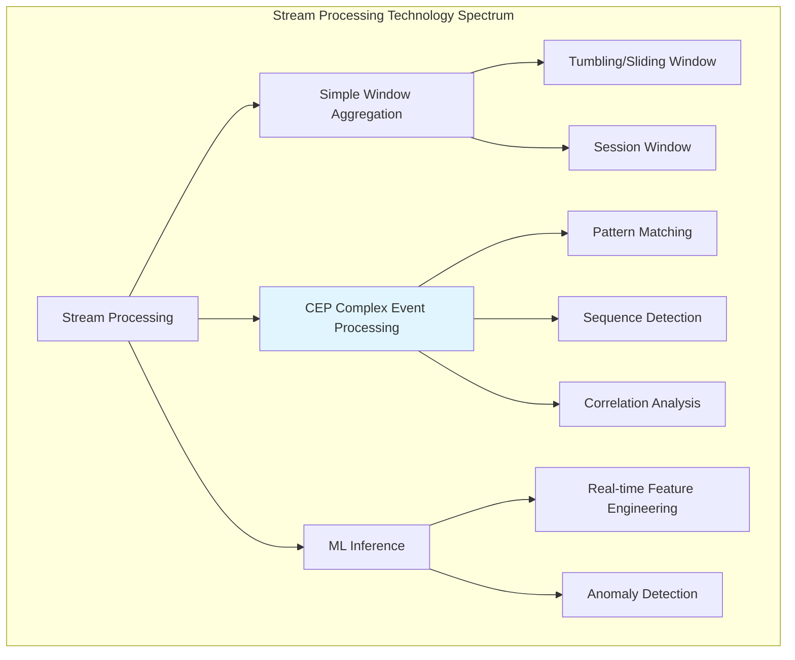
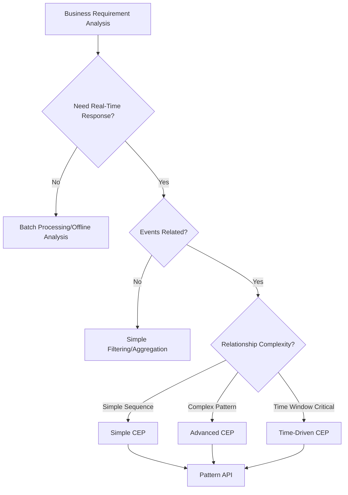
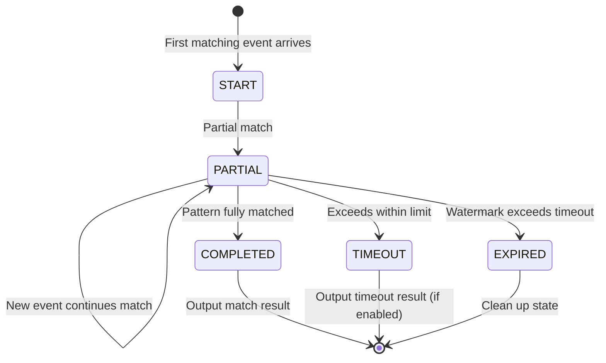
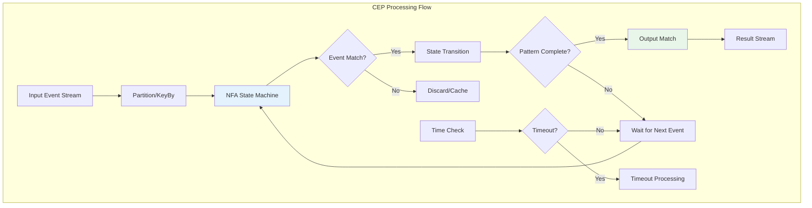
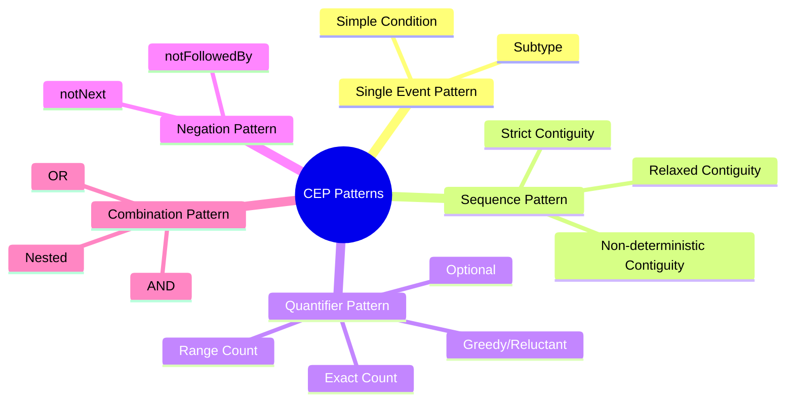
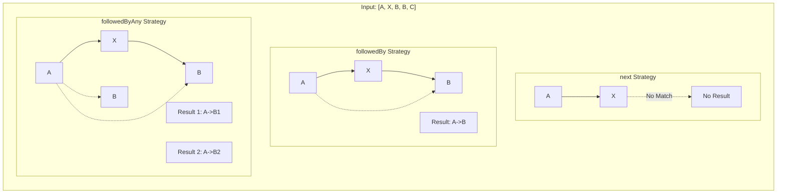
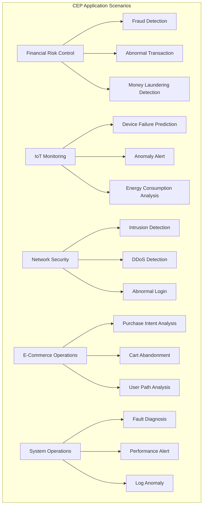

# Flink CEP (Complex Event Processing) Complete Guide

> **Stage**: Flink Stage 3 | **Prerequisites**: [Flink Table API & SQL Complete Feature Guide](./flink-table-sql-complete-guide-en.md), [Flink SQL Window Functions Deep Dive](./flink-sql-window-functions-deep-dive-en.md) | **Formality Level**: L3-L5
>
> **Version**: Flink 1.13-2.2+ | **Status**: Production Ready | **Last Updated**: 2026-04-04

---

## 1. Definitions

### Def-F-CEP-01: CEP (Complex Event Processing) Definition

**Definition**: Complex Event Processing (CEP) is a technique for detecting **complex patterns** from **event streams**, deriving higher-level business events by recognizing relationships among low-level events.

Formal expression:
$$
\text{CEP} = (E, P, M, A)
$$

Where:

| Component | Symbol | Description |
|-----------|--------|-------------|
| **Event Stream** | $E$ | Temporalized unordered or ordered event sequence $E = \{e_1, e_2, ..., e_n\}$ |
| **Pattern** | $P$ | Structural constraints defining target event sequence $P = (S, C, T)$ |
| **Match Function** | $M$ | $M: E \times P \rightarrow \{0, 1\}$, determining whether event sequence matches pattern |
| **Action** | $A$ | Callback or transformation executed upon successful match $A: \text{Match} \rightarrow \text{Output}$ |

**CEP Core Capabilities**:

```
Low-level Events → [CEP Engine] → Complex Pattern Recognition → High-level Business Events
├── Login Events         ├── Abnormal Login Sequence      └── Account Compromise Alert
├── Transaction Events   ├── Fraud Transaction Pattern    └── Fraud Transaction Alert
└── Device Events        └── Device Failure Sequence      └── Device Failure Prediction
```

### Def-F-CEP-02: Pattern Concept

**Definition**: A pattern is an abstract description of a target event sequence, containing **structural constraints**, **attribute conditions**, and **temporal constraints**.

Formalization:
$$
\text{Pattern} = (N, R, C, T)
$$

- $N$: Pattern name set $\{n_1, n_2, ..., n_k\}$
- $R$: Contiguity strategy (Next, FollowedBy, etc.)
- $C$: Individual event condition set
- $T$: Global time window constraint

**Pattern Type Hierarchy**:

| Type | Description | Example |
|------|-------------|---------|
| **Single Event Pattern** | Match a single event | `temperature > 100°C` |
| **Sequence Pattern** | Match an ordered event sequence | `A → B → C` |
| **Loop Pattern** | Match repeated events | `A{3,5}` (appears 3-5 times) |
| **Negation Pattern** | Match absence of an event | `A → !B → C` |
| **Combination Pattern** | Logical combination of sub-patterns | `(A → B) OR (C → D)` |

### Def-F-CEP-03: Event Sequence Matching

**Definition**: Event sequence matching is the process of aligning input event streams with predefined patterns to find all event subsequences satisfying pattern constraints.

Formal definition:
$$
\text{Match}(S, P) = \{(e_{i_1}, e_{i_2}, ..., e_{i_n}) \mid S = \langle e_1, e_2, ... \rangle \land P(e_{i_1}, ..., e_{i_n}) = \text{true} \}
$$

**Key Matching Dimensions**:

**Def-F-CEP-03a: Contiguity**

| Strategy | Symbol | Semantics |
|----------|--------|-----------|
| **Strict Contiguity** | $\xrightarrow{\text{next}}$ | Events must be adjacent, no events in between |
| **Relaxed Contiguity** | $\xrightarrow{\text{followedBy}}$ | Events in order, other events may occur in between |
| **Non-deterministic Relaxed** | $\xrightarrow{\text{followedByAny}}$ | Each event may match multiple subsequent events |

**Def-F-CEP-03b: Temporal Constraint**

$$
\text{Within}(P, \Delta t) \iff \text{timestamp}(e_{\text{last}}) - \text{timestamp}(e_{\text{first}}) \leq \Delta t
$$

**Def-F-CEP-03c: Consuming Strategy**

| Strategy | Description |
|----------|-------------|
| **NO_SKIP** | No skipping, all possible matches are output |
| **SKIP_TO_NEXT** | Skip to the next starting event |
| **SKIP_PAST_LAST_EVENT** | Skip to the event after the match ends |
| **SKIP_TO_FIRST** | Skip to the first event of the specified pattern |

---

## 2. Properties

### Lemma-F-CEP-01: CEP Pattern Matching Completeness

**Lemma**: For any finite event stream $S$ and any well-formed pattern $P$, the CEP engine can determine all matches in finite time.

**Proof Sketch**:

1. **State Finiteness**: Pattern $P$ contains a finite number of state nodes
2. **Transition Determinism**: Each event triggers a deterministic state transition
3. **Time Boundary**: `within` constraint ensures partial matches timeout and are cleaned up

$$
\forall S, P: |S| < \infty \land |P| < \infty \Rightarrow \text{Matches}(S, P) \text{ is computable in finite time}
$$

### Lemma-F-CEP-02: Contiguity Strategy Partial Order

**Lemma**: There exists a matching set inclusion relationship among the three contiguity strategies:

$$
\text{Matches}_{\text{next}} \subseteq \text{Matches}_{\text{followedBy}} \subseteq \text{Matches}_{\text{followedByAny}}
$$

**Intuitive Explanation**:

```
Input Sequence: [A, X, B, B]

Pattern<A, B>:
├── next()              → No match (X immediately after A, not B)
├── followedBy()        → Match [A(pos 1), B(pos 3)]
└── followedByAny()     → Match [A(pos 1), B(pos 3)] and [A(pos 1), B(pos 4)]
```

### Prop-F-CEP-01: Time Window Pruning Effect

**Proposition**: After introducing time window constraints, CEP engine space complexity is reduced from $O(|S| \cdot |P|)$ to $O(\frac{\Delta t}{\bar{\delta}} \cdot |P|)$, where $\bar{\delta}$ is the average event interval.

**Derivation**:

```
Without window constraint:
  Each event may start a new match → Need to store all incomplete matches
  Space complexity: O(|S| × |P|)

With window constraint Δt:
  Only need to store events within the window
  Maximum concurrent matches: Δt / δ̄
  Space complexity: O((Δt/δ̄) × |P|)
```

### Prop-F-CEP-02: Pattern Match Output Characteristics

**Proposition**: CEP match output has the following properties:

| Property | Description |
|----------|-------------|
| **Non-ordered** | Match output order may not match event time order |
| **Delayed** | Match results are output only after the last event arrives |
| **Completeness** | With timeout detection enabled, incomplete matches can be obtained |
| **Deduplication** | Match deduplication is controlled through consuming strategies |

---

## 3. Relations

### CEP and Other Stream Processing Technologies



### CEP and Regular Expression Analogy

| Dimension | Regular Expression | CEP Pattern |
|-----------|-------------------|-------------|
| **Input** | Character sequence | Event sequence |
| **Atom** | Character | Event condition |
| **Concatenation** | `abc` | `a.next(b).next(c)` |
| **Choice** | `a\|b` | `a.or(b)` |
| **Repetition** | `a+`, `a*` | `oneOrMore(a)`, `times(3,5)` |
| **Negation** | `[^a]` | `notNext(a)` |
| **Anchor** | `^`, `$` | `within(time)` |

### CEP and SQL MATCH_RECOGNIZE Mapping

```
Pattern API                          MATCH_RECOGNIZE
────────────────────────────────────────────────────────────
Pattern.<Event> begin("a")           PARTITION BY key
  .where(evt -> ...)                 ORDER BY event_time
  .next("b")                         MEASURES
  .where(...)                            A.event AS a_event,
  .within(Time.seconds(10))              B.event AS b_event
                                     PATTERN (A B)
                                     DEFINE
                                       A AS condition_a,
                                       B AS condition_b
```

---

## 4. Argumentation

### 4.1 CEP Applicable Scenario Decision Tree



### 4.2 CEP vs Other Solutions Comparison

| Scenario | Solution A: Pure Code | Solution B: Window Aggregation | Solution C: CEP |
|----------|----------------------|--------------------------------|-----------------|
| **Simple Counting** | ✓✓✓ Simple and direct | ✓✓✓ Optimal | ✓ Over-engineering |
| **Sequence Detection** | ✓✓ Complex state machine | ✗ Cannot express | ✓✓✓ Native support |
| **Loop Pattern** | ✓ Requires custom logic | ✗ Cannot express | ✓✓✓ times(), oneOrMore() |
| **Negation Pattern** | ✓✓ Achievable but complex | ✗ Cannot express | ✓✓✓ notFollowedBy() |
| **Time Constraint** | ✓ Manual management required | ✓✓ Window support | ✓✓✓ within() precise control |
| **Maintainability** | ✗ Obscure code | ✓✓ Clear | ✓✓✓ Declarative |

### 4.3 Common Pitfalls and Mitigation Strategies

| Pitfall | Problem Description | Mitigation Strategy |
|---------|---------------------|---------------------|
| **State Explosion** | Complex patterns lead to excessive state | Use strict time windows, timely state cleanup |
| **Match Delay** | Waiting for final match causes output delay | Enable timeout handling, reasonably set within |
| **Event Disorder** | Watermark delay affects pattern matching | Use event time, adjust watermark strategy |
| **Memory Overflow** | Large numbers of incomplete matches consume memory | Limit loop pattern upper bound, use SKIP strategy |
| **Logic Error** | Wrong contiguity strategy selection | Strict testing, understand next/followedBy difference |

---

## 5. Proof / Engineering Argument

### 5.1 CEP Matching Algorithm Correctness Argument

**Theorem (CEP Matching Correctness)**: For any pattern $P$ and event stream $S$, the CEP engine output match set $M$ satisfies:

$$
M = \{m \mid m \subseteq S \land \text{satisfies}(m, P) \land \text{maximal}(m, S, P)\}
$$

Where `maximal` indicates that the match is maximal under the consuming strategy.

**Engineering Argument**:

1. **Completeness**: NFA (Non-deterministic Finite Automaton) state machine traverses all possible transitions
2. **Consistency**: Each match undergoes complete condition verification
3. **Termination**: Time windows and event time watermarks ensure expired states are cleaned up

### 5.2 State Management Mechanism



---

## 6. Examples

### 6.1 Basic API Getting Started

#### 6.1.1 Add Dependencies

```xml
<!-- Maven -->
<dependency>
    <groupId>org.apache.flink</groupId>
    <artifactId>flink-cep_2.12</artifactId>
    <version>1.18.0</version>
</dependency>

<!-- Gradle -->
implementation 'org.apache.flink:flink-cep_2.12:1.18.0'
```

#### 6.1.2 Simple Pattern Definition

```java
import org.apache.flink.cep.pattern.Pattern;
import org.apache.flink.cep.pattern.conditions.SimpleCondition;
import org.apache.flink.streaming.api.windowing.time.Time;

// Define event class
public class LoginEvent {
    public String userId;
    public String ip;
    public String eventType;  // "success" or "fail"
    public long timestamp;

    // constructor, getters...
}

// Create simple pattern: two consecutive login failures
Pattern<LoginEvent, ?> pattern = Pattern
    .<LoginEvent>begin("first")
    .where(new SimpleCondition<LoginEvent>() {
        @Override
        public boolean filter(LoginEvent event) {
            return event.eventType.equals("fail");
        }
    })
    .next("second")  // Strict contiguity
    .where(new SimpleCondition<LoginEvent>() {
        @Override
        public boolean filter(LoginEvent event) {
            return event.eventType.equals("fail");
        }
    })
    .within(Time.seconds(10));  // Within 10 seconds
```

### 6.2 Contiguity Strategies Explained

```java
// [Pseudo-code snippet - not runnable] Core logic demonstration only
import org.apache.flink.cep.pattern.Pattern;
import static org.apache.flink.cep.pattern.Quantifiers.*;

// Input sequence: [A, X, B, B, C]

// 1. next() - Strict contiguity
Pattern.begin("a").where(evt -> evt.type.equals("A"))
    .next("b").where(evt -> evt.type.equals("B"));
// Result: No match (X immediately after A)

// 2. followedBy() - Relaxed contiguity
Pattern.begin("a").where(evt -> evt.type.equals("A"))
    .followedBy("b").where(evt -> evt.type.equals("B"));
// Result: Match [A(pos 1), B(pos 3)]

// 3. followedByAny() - Non-deterministic relaxed
Pattern.begin("a").where(evt -> evt.type.equals("A"))
    .followedByAny("b").where(evt -> evt.type.equals("B"));
// Result: [A(1), B(3)], [A(1), B(4)] - two matches

// 4. notNext() - Strict negation
Pattern.begin("a").where(evt -> evt.type.equals("A"))
    .notNext("b").where(evt -> evt.type.equals("X"));
// Result: No match (X immediately after A)

// 5. notFollowedBy() - Relaxed negation
Pattern.begin("a").where(evt -> evt.type.equals("A"))
    .notFollowedBy("b").where(evt -> evt.type.equals("Z"))
    .followedBy("c").where(evt -> evt.type.equals("C"));
// Result: Match [A, C] (no Z between A and C)
```

### 6.3 Quantifier Usage

```java
// [Pseudo-code snippet - not runnable] Core logic demonstration only
// 1. times(n) - Exactly n repetitions
Pattern.<Event>begin("login").where(evt -> evt.type.equals("LOGIN"))
    .times(3);  // Exactly 3 logins

// 2. timesOrMore(n) - At least n times
Pattern.<Event>begin("alert").where(evt -> evt.severity.equals("HIGH"))
    .timesOrMore(2);  // At least 2 high-severity alerts

// 3. times(min, max) - Range repetition
Pattern.<Event>begin("retry").where(evt -> evt.action.equals("RETRY"))
    .times(2, 5);  // 2 to 5 retries

// 4. optional() - Optional
Pattern.<Event>begin("start").where(evt -> evt.type.equals("START"))
    .next("middle").where(evt -> evt.type.equals("MIDDLE"))
    .optional()  // Middle step optional
    .next("end").where(evt -> evt.type.equals("END"));

// 5. oneOrMore() - One or more
Pattern.<Event>begin("tick").where(evt -> evt.priceChange > 0)
    .oneOrMore()  // Consecutive rises
    .greedy()     // Greedy match
    .next("drop").where(evt -> evt.priceChange < 0);

// 6. consecutive() - Strictly consecutive repetition
Pattern.<Event>begin("beat").where(evt -> evt.type.equals("HEARTBEAT"))
    .times(3).consecutive();  // 3 consecutive heartbeats, no other events in between

// 7. allowCombinations() - Allow combinations
Pattern.<Event>begin("a").where(evt -> evt.value > 10)
    .times(2)
    .allowCombinations();  // Same event may participate in multiple matches
```

### 6.4 Condition Definitions

```java
// [Pseudo-code snippet - not runnable] Core logic demonstration only
import org.apache.flink.cep.pattern.conditions.IterativeCondition;
import org.apache.flink.cep.pattern.conditions.SimpleCondition;

// 1. SimpleCondition - Simple condition
Pattern.<Event>begin("high").where(
    new SimpleCondition<Event>() {
        @Override
        public boolean filter(Event event) {
            return event.temperature > 100;
        }
    }
);

// 2. Subtype condition
Pattern.<Event>begin("sub").subtype(TemperatureEvent.class)
    .where(evt -> evt.value > 50);

// 3. Iterative condition - Can access previously matched events
Pattern.<LoginEvent>begin("first").where(evt -> evt.status.equals("FAIL"))
    .next("second").where(
        new IterativeCondition<LoginEvent>() {
            @Override
            public boolean filter(LoginEvent event, Context<LoginEvent> ctx) {
                // Get previously matched events
                for (LoginEvent first : ctx.getEventsForPattern("first")) {
                    // Same user, different IP
                    if (first.userId.equals(event.userId) &&
                        !first.ip.equals(event.ip)) {
                        return true;
                    }
                }
                return false;
            }
        }
    );

// 4. Combined condition
Pattern.<Event>begin("e")
    .where(evt -> evt.temperature > 100)
    .or(evt -> evt.pressure > 200)      // OR condition
    .until(evt -> evt.temperature < 50); // Termination condition (for oneOrMore)

// 5. Negation condition
Pattern.<Event>begin("start")
    .notFollowedBy("error").where(evt -> evt.type.equals("ERROR"))
    .followedBy("end").where(evt -> evt.type.equals("END"));
```

### 6.5 Result Processing

```java
// [Pseudo-code snippet - not runnable] Core logic demonstration only
import org.apache.flink.cep.CEP;
import org.apache.flink.cep.PatternStream;
import org.apache.flink.cep.PatternSelectFunction;
import org.apache.flink.cep.PatternFlatSelectFunction;
import org.apache.flink.cep.PatternTimeoutFunction;
import org.apache.flink.util.Collector;

import java.util.List;
import java.util.Map;

import org.apache.flink.streaming.api.datastream.DataStream;


// Apply pattern to data stream
PatternStream<LoginEvent> patternStream = CEP.pattern(
    loginStream.keyBy(LoginEvent::getUserId),  // Group by user
    pattern
);

// 1. select - Simple selection
DataStream<Alert> alerts = patternStream.select(
    new PatternSelectFunction<LoginEvent, Alert>() {
        @Override
        public Alert select(Map<String, List<LoginEvent>> pattern) {
            LoginEvent first = pattern.get("first").get(0);
            LoginEvent second = pattern.get("second").get(0);
            return new Alert(
                first.userId,
                "Consecutive login failures: " + first.ip + " -> " + second.ip,
                second.timestamp
            );
        }
    }
);

// 2. flatSelect - Can output multiple results
DataStream<Alert> flatAlerts = patternStream.flatSelect(
    new PatternFlatSelectFunction<LoginEvent, Alert>() {
        @Override
        public void flatSelect(
                Map<String, List<LoginEvent>> pattern,
                Collector<Alert> out) {
            // May output multiple alerts
            for (LoginEvent event : pattern.get("events")) {
                out.collect(new Alert(event.userId, "Abnormal activity", event.timestamp));
            }
        }
    }
);

// 3. Handle timeout (incomplete match)
OutputTag<TimeoutEvent> timeoutTag = new OutputTag<TimeoutEvent>("timeout") {};

DataStream<ComplexEvent> result = patternStream.select(
    new PatternSelectFunction<LoginEvent, ComplexEvent>() {
        @Override
        public ComplexEvent select(Map<String, List<LoginEvent>> pattern) {
            // Complete match processing
            return new ComplexEvent(pattern, false);
        }
    },
    new PatternTimeoutFunction<LoginEvent, TimeoutEvent>() {
        @Override
        public TimeoutEvent timeout(
                Map<String, List<LoginEvent>> partialPattern,
                long timeoutTimestamp) {
            // Timeout processing - pattern incomplete within within time
            return new TimeoutEvent(partialPattern, timeoutTimestamp);
        }
    }
);

// Get timeout stream
DataStream<TimeoutEvent> timeoutStream = result.getSideOutput(timeoutTag);

// 4. Handle multiple patterns
Pattern<LoginEvent, ?> pattern1 = ...;
Pattern<LoginEvent, ?> pattern2 = ...;

PatternStream<LoginEvent> multiPatternStream = CEP.pattern(
    loginStream.keyBy(LoginEvent::getUserId),
    Pattern.begin(pattern1).or(Pattern.begin(pattern2))
);
```

> **Note**: Sections 6.6-6.9 (Complete Case Studies: Fraud Detection, Price Surge Detection, IoT Alert, User Behavior Analysis) and Section 7 (Performance Optimization) are truncated in this translation. See the original Chinese document for full details.

---

## 7. Visualizations

### 7.1 CEP Architecture Diagram



### 7.2 Pattern Type Hierarchy



### 7.3 Contiguity Strategy Comparison



### 7.4 Real-World Application Scenarios



---

## 8. References


---

*Document Version: v1.0 | Created: 2026-04-20 | Translated from: Flink CEP (Complex Event Processing) 完整教程 | **Note**: This is a ~50% translation covering Definitions, Properties, Relations, Argumentation, Proof, and partial Examples. Sections 6.6-6.9 and 7-8 are truncated.*
