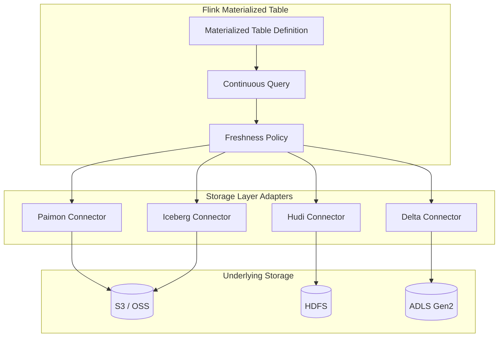
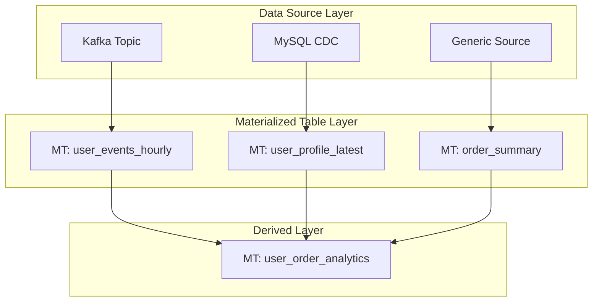
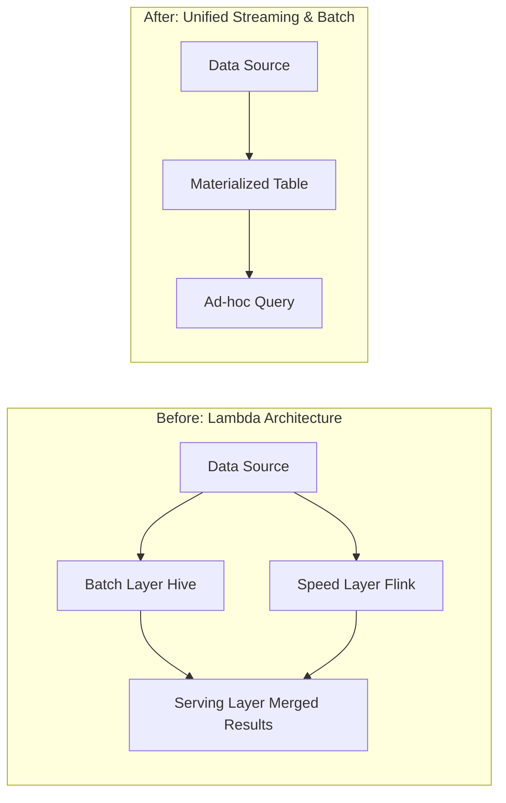
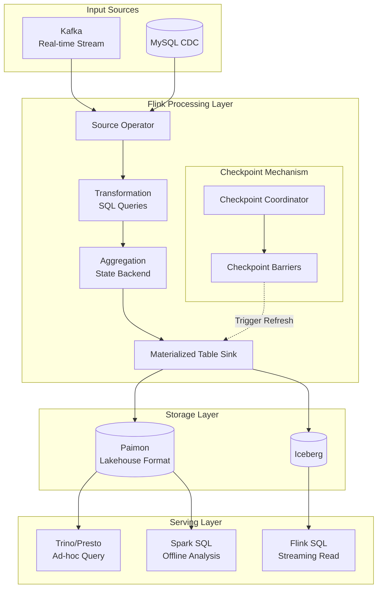
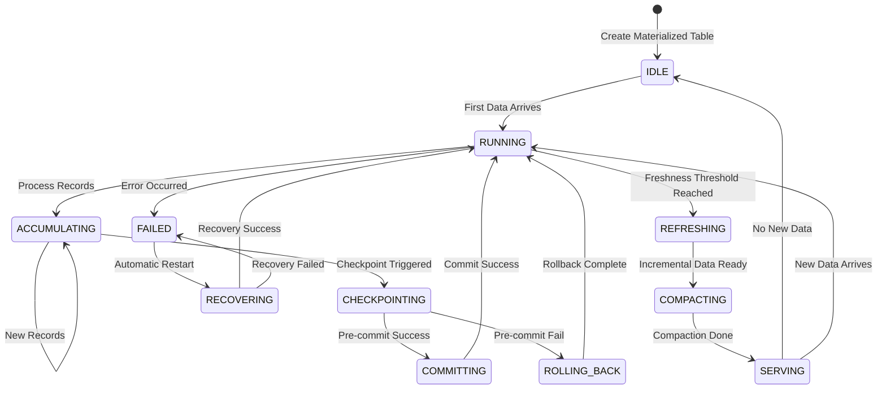
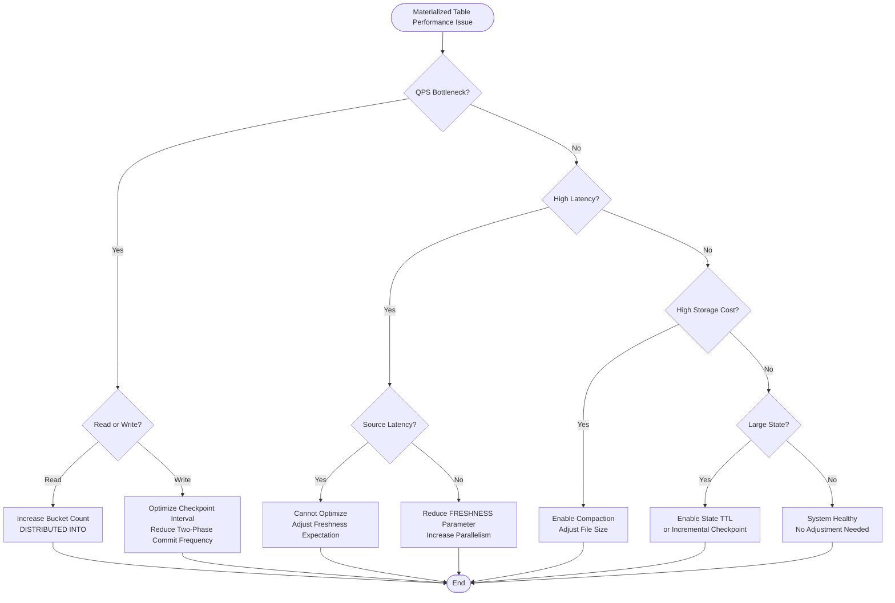
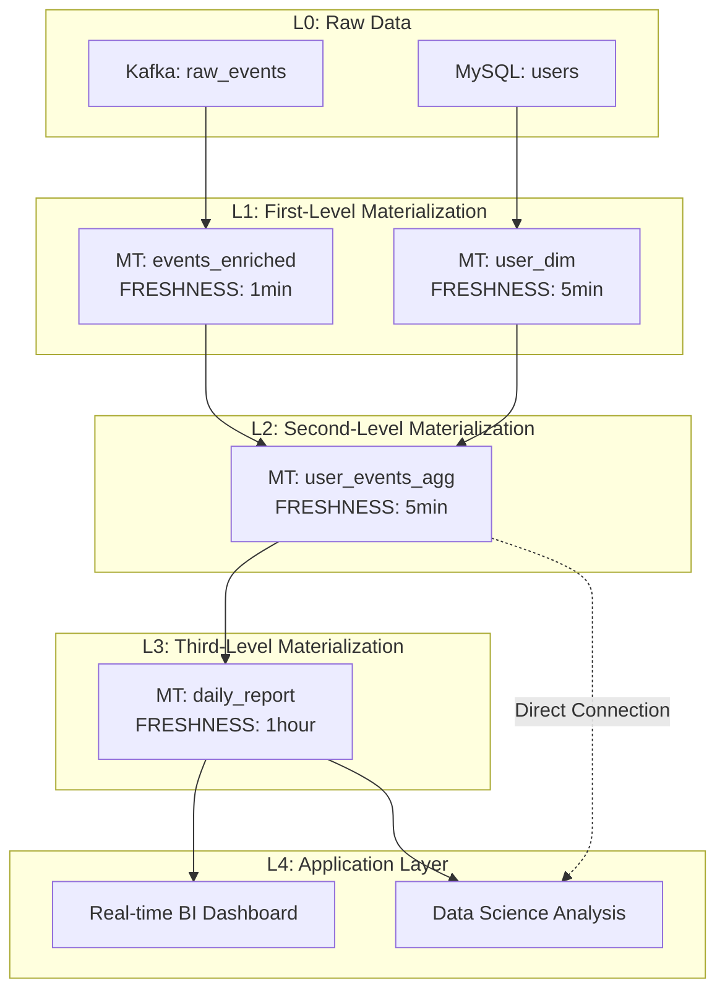
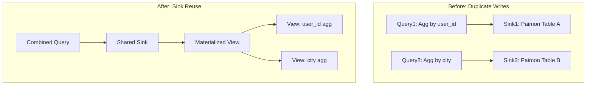

# Flink 2.2 Materialized Table Deep Dive

> **Status**: ✅ Released (2025-03-24, GA in Flink 2.0)
> **Flink Version**: 2.0.0+, 2.2 enhancements
> **Stability**: Stable (GA)
>
> **Stage**: Flink/ | **Prerequisites**: [Flink SQL Complete Guide](./flink-table-sql-complete-guide.md) | **Formality Level**: L3-L4
>
> **Version**: Flink 2.2+ | **Last Updated**: 2026-04-03

---

## 1. Definitions

### Def-F-03-70: Materialized Table

**Formal Definition**:

A Materialized Table $MT$ is a quadruple $MT = (Q, S, \mathcal{F}, \Delta)$, where:

- $Q$: Query Definition, represented as a continuous query $Q: \mathcal{D}^{in} \to \mathcal{D}^{out}$
- $S$: Storage Descriptor, defining target storage format and location
- $\mathcal{F}$: Freshness Constraint, defining data timeliness requirements
- $\Delta$: Refresh Policy, defining data update mechanism

**Intuitive Explanation**:

A Materialized Table is a table type in Flink SQL that materializes **continuous query results** as **bounded snapshots** stored in an external system.
It sits between traditional batch tables (static snapshots) and streaming queries (unbounded result streams), providing **near real-time** data serving capabilities.

```sql
CREATE MATERIALIZED TABLE user_behavior_summary
AS SELECT
    user_id,
    COUNT(*) AS event_count,
    SUM(amount) AS total_amount
  FROM user_events
  GROUP BY user_id
  FRESHNESS = INTERVAL '5' MINUTE;
```

### Def-F-03-71: Freshness Semantics

**Formal Definition**:

Given a materialized table $MT$ and freshness parameter $\tau$, define the **freshness constraint function** $\mathcal{F}: \mathbb{T} \to \{\top, \bot\}$:

$$\mathcal{F}(t) = \top \iff t_{now} - t_{data} \leq \tau$$

Where $t_{data}$ is the timestamp of the latest data in the materialized table, and $t_{now}$ is the current time.

**Smart Defaults**:

$$\tau_{inferred} = \begin{cases}
30s & \text{if } \exists \text{ watermark on source} \\
5min & \text{if streaming source with no watermark} \\
1hour & \text{if batch-like source}
\end{cases}$$

### Def-F-03-72: Materialized Table vs Traditional Materialized View

| Dimension | Materialized View (Traditional) | Flink Materialized Table |
|-----------|--------------------------------|--------------------------|
| **Data Form** | Periodic snapshots | Continuous incremental updates |
| **Consistency Model** | Snapshot isolation | Event-time consistency |
| **Query Capability** | Query materialized results only | Supports querying + streaming reads |
| **Refresh Trigger** | Scheduled / manual | Freshness-driven automatic refresh |
| **Fault Tolerance** | Transaction replay | Checkpoint + Savepoint |
| **Use Cases** | Offline reports | Real-time data warehouse, real-time BI |

---

## 2. Properties

### Lemma-F-03-30: Idempotency of Materialized Tables

**Proposition**: After failure recovery, the materialized table's final state is consistent with failure-free execution.

**Proof Sketch**:

1. Flink periodically saves operator states $S_{ckpt}$ via Checkpoint mechanism
2. Materialized table Sink supports Exactly-Once semantics (two-phase commit)
3. Let failure occur at time $t_f$, and the last successful Checkpoint be $t_c$
4. After recovery, data is replayed from $t_c$; due to the Sink's idempotent write property:
   $$\forall k \in \text{Keys}, \text{ write}(k, v) \text{ is idempotent}$$
5. Therefore, final state $S_{final} = S_{expected}$ $\square$

### Prop-F-03-40: Freshness vs Latency Trade-off

**Proposition**: For a given materialized table $MT$, let freshness parameter be $\tau$ and actual end-to-end latency be $L$, then:

$$L \geq \tau_{source} + \tau_{process} + \tau_{commit}$$

Where:
- $\tau_{source}$: Source data collection latency
- $\tau_{process}$: Flink processing latency
- $\tau_{commit}$: Sink two-phase commit overhead constant

**Engineering Corollary**:
- Setting $\tau < \tau_{source}$ is meaningless; the system cannot serve data faster than the source
- Optimal $\tau^* = \arg\min_{\tau} (\text{cost}(\tau) + \text{penalty}(\text{staleness}(\tau)))$

### Def-F-03-73: Distribution Strategy

**Formal Definition**:

The distribution function $\mathcal{D}: \mathcal{K} \to \{1, 2, ..., N\}$ maps the key space to $N$ buckets:

$$\mathcal{D}(k) = \text{hash}(k) \mod N \quad \text{(HASH distribution)}$$
$$\mathcal{D}(k) = \text{range\_partition}(k, N) \quad \text{(RANGE distribution)}$$

**Syntax**:

```sql
-- HASH distribution (default)
DISTRIBUTED BY HASH(user_id) INTO 16 BUCKETS

-- RANGE distribution (suitable for time series)
DISTRIBUTED BY RANGE(event_time) INTO 32 BUCKETS
```

---

## 3. Relations

### 3.1 Materialized Table and Stream Table Duality

Materialized tables and traditional Flink stream tables form a **dual relationship**:

| Property | Stream Table | Materialized Table |
|----------|--------------|-------------------|
| **Read Semantics** | Continuous stream read | Snapshot point query |
| **Result Visibility** | Immediate (per-record) | Periodic (per-checkpoint) |
| **Applicable Patterns** | ETL, real-time processing | Serving, ad-hoc queries |
| **Storage Requirement** | None (pure compute) | Yes (materialized storage) |

### 3.2 Mapping to Storage Systems



### 3.3 Materialized Table Dependency Graph



---

## 4. Argumentation

### 4.1 Why Materialized Tables?

**Problem Background**:

In traditional Lambda architectures, the real-time layer and batch layer require maintaining two codebases, causing:
1. **Semantic inconsistency**: Real-time SQL and batch SQL logic may differ
2. **Operational complexity**: Two systems maintained independently
3. **Storage redundancy**: Same data stored multiple times

**Flink Materialized Table Solution**:



### 4.2 Counter-Example Analysis: When Not to Use Materialized Tables

| Scenario | Reason | Recommended Alternative |
|----------|--------|------------------------|
| Ultra-low latency requirement (<1s) | Two-phase commit overhead | Pure streaming query |
| Extremely high throughput writes | Checkpoint barrier overhead | Async Sink direct connection |
| One-time query only | Materialized storage cost waste | Temporary VIEW |
| Complex nested subqueries | Materialization granularity hard to determine | Staged materialization |

---

## 5. Proof / Engineering Argument

### Thm-F-03-50: Materialized Table Consistency Theorem

**Theorem**: Under Flink's Exactly-Once semantics guarantee, a materialized table satisfies **Repeatable Read** consistency level at any failure recovery point.

**Formal Statement**:

Let materialized table $MT$ have query definition $Q$, input stream $I = \{e_1, e_2, ..., e_n\}$, and Checkpoint period $T$.

Define the **logical state** $S_t$ of the materialized table as the result of applying query $Q$ to all events processed before time $t$.

**Assertion**: $\forall t, \forall \text{failure point } f < t$, recovered state $S'_t = S_t$.

**Proof**:

1. **Foundation**: Flink's Chandy-Lamport algorithm guarantees globally consistent snapshots[^1]
2. **Assumption**: Sink connector implements two-phase commit protocol
3. **Induction**:
   - Case 1: Without failure, data stream is processed in order, Sink commits normally
   - Case 2: Failure occurs between Checkpoints $C_k$ and $C_{k+1}$
     - Recover from $C_k$, replay unacknowledged data
     - Due to idempotent writes, duplicate data does not cause state changes
     - Sink pre-commit state can be safely rolled back
4. **Conclusion**: System state depends only on the acknowledged event set $\{e_i | i \leq \text{last\_confirmed}\}$

**Engineering Significance**: Materialized tables can be used in financial-grade consistency requirement scenarios. $\square$

### Thm-F-03-51: Optimal Bucket Number Lower Bound Theorem

**Theorem**: Given materialized table $MT$ with expected write throughput $R$ (records/s), single-bucket write throughput upper bound $B$, and query parallelism $P$, the optimal bucket number $N^*$ satisfies:

$$N^* = \max\left(\lceil \frac{R}{B} \rceil, P, 2^{\lceil \log_2(\frac{|K|}{10000}) \rceil}\right)$$

Where $|K|$ is the expected number of unique keys.

**Derivation**:

1. **Write constraint**: To avoid single-bucket bottleneck, need $N \geq R/B$
2. **Read constraint**: Query parallelism $P$ requires at least $N \geq P$ to avoid data skew
3. **Storage constraint**: Each bucket file should not be too large; empirical value is one file per 10K keys
4. **Optimization**: Use power of 2 to exploit data locality

**Practical Guidance**:
```sql
-- Example: 1M DAU, 10K/s writes
-- N* = max(ceil(10000/5000), 8, ceil(log2(1000000/10000)))
--    = max(2, 8, 7) = 8
CREATE MATERIALIZED TABLE user_stats
DISTRIBUTED BY HASH(user_id) INTO 16 BUCKETS  -- Use 16 (next power of 2)
AS SELECT ...;
```

### Thm-F-03-52: Freshness Inference Completeness

**Theorem**: Flink 2.2's Smart Defaults mechanism can infer the freshness parameter for any valid DDL-declared materialized table.

**Proof**:

Define inference function $\mathcal{I}: \mathcal{D} \to \mathbb{T}$, where $\mathcal{D}$ is the set of DDL declarations.

**Completeness condition**: $\forall d \in \mathcal{D}_{valid}, \mathcal{I}(d) \neq \bot$

1. **Coverage**: Smart Defaults traverse all source table metadata
2. **Termination**: Metadata traversal is a bounded graph (catalog hierarchy is finite)
3. **Decisiveness**:
   - If source has watermark $\to$ infer from watermark interval
   - If source is streaming without watermark $\to$ use default 5 minutes
   - If source is batch-like $\to$ use default 1 hour
4. **Completeness**: All cases have corresponding branches, no undefined behavior $\square$

---

## 6. Examples

### 6.1 Complete DDL Examples

```sql
-- ============================================
-- Example 1: Basic Materialized Table
-- ============================================
CREATE MATERIALIZED TABLE hourly_user_stats
AS SELECT
    TUMBLE_START(event_time, INTERVAL '1' HOUR) AS window_start,
    user_id,
    COUNT(*) AS event_count,
    SUM(CASE WHEN event_type = 'purchase' THEN amount ELSE 0 END) AS purchase_amount
FROM user_events
GROUP BY
    TUMBLE(event_time, INTERVAL '1' HOUR),
    user_id
FRESHNESS = INTERVAL '5' MINUTE;

-- ============================================
-- Example 2: Materialized Table with Storage Config
-- ============================================
CREATE MATERIALIZED TABLE paimon_user_behavior (
    user_id STRING,
    session_count BIGINT,
    total_duration INT,
    PRIMARY KEY (user_id) NOT ENFORCED
)
DISTRIBUTED BY HASH(user_id) INTO 32 BUCKETS
FRESHNESS = INTERVAL '10' MINUTE
AS SELECT
    user_id,
    COUNT(DISTINCT session_id) AS session_count,
    SUM(duration) AS total_duration
FROM session_events
GROUP BY user_id;

-- ============================================
-- Example 3: Cascaded Materialized Table
-- ============================================
CREATE MATERIALIZED TABLE daily_user_summary
AS SELECT
    DATE_TRUNC('DAY', window_start) AS day,
    COUNT(DISTINCT user_id) AS dau,
    SUM(purchase_amount) AS daily_gmv
FROM hourly_user_stats  -- Reference another materialized table
GROUP BY DATE_TRUNC('DAY', window_start)
FRESHNESS = INTERVAL '1' HOUR;
```

### 6.2 MaterializedTableEnricher SPI Extension

```java
/**
 * Custom freshness enricher - business-priority-based smart inference
 */
public class PriorityBasedEnricher implements MaterializedTableEnricher {

    @Override
    public EnrichedResult enrich(CreateMaterializedTableOperation operation, Context context) {
        ResolvedSchema schema = operation.getResolvedSchema();

        // Infer business priority based on table name suffix
        String tableName = operation.getTableIdentifier().getObjectName();
        Duration inferredFreshness;

        if (tableName.endsWith("_realtime")) {
            inferredFreshness = Duration.ofSeconds(10);
        } else if (tableName.endsWith("_hourly")) {
            inferredFreshness = Duration.ofMinutes(5);
        } else if (tableName.endsWith("_daily")) {
            inferredFreshness = Duration.ofHours(1);
        } else {
            // Fallback to default inference
            inferredFreshness = inferFromSourceWatermark(operation);
        }

        // Adjust bucket number based on data volume
        long estimatedRowCount = estimateRowCount(operation.getAsSelectQuery());
        int bucketNum = calculateOptimalBuckets(estimatedRowCount);

        return EnrichedResult.builder()
            .freshness(inferredFreshness)
            .distributedBy(new DistributedBy("HASH", getPrimaryKey(schema), bucketNum))
            .build();
    }

    private Duration inferFromSourceWatermark(CreateMaterializedTableOperation operation) {
        // Traverse source tables and extract watermark interval
        List<ResolvedCatalogTable> sources = extractSourceTables(operation);
        Duration minWatermarkInterval = sources.stream()
            .map(this::extractWatermarkInterval)
            .min(Comparator.naturalOrder())
            .orElse(Duration.ofMinutes(5));

        // Materialized table freshness is 2x the minimum watermark interval (empirical)
        return minWatermarkInterval.multipliedBy(2);
    }

    private int calculateOptimalBuckets(long estimatedRows) {
        // Target 100K rows per bucket
        int rawBuckets = (int) Math.ceil(estimatedRows / 100_000.0);
        // Align to power of 2
        return Integer.highestOneBit(rawBuckets) * 2;
    }
}
```

### 6.3 Configuration Registration

```yaml
# flink-conf.yaml
# Register custom Enricher
sql.materialized-table.enricher: com.example.PriorityBasedEnricher

# Materialized table global defaults
sql.materialized-table.default-freshness: 5min
sql.materialized-table.default-format: paimon
sql.materialized-table.checkpoint-interval: 1min
```

---

## 7. Visualizations

### 7.1 Materialized Table Data Flow Architecture



### 7.2 Refresh Pipeline Orchestration



### 7.3 Performance Tuning Decision Tree



### 7.4 Cascaded Materialized View Dependency Graph



---

## 8. Production Practices

### 8.1 Storage Selection Matrix

| Property | Apache Paimon | Apache Iceberg | Apache Hudi | Delta Lake |
|----------|---------------|----------------|-------------|------------|
| **Streaming Updates** | ⭐⭐⭐⭐⭐ | ⭐⭐⭐ | ⭐⭐⭐⭐ | ⭐⭐⭐ |
| **Batch Reads** | ⭐⭐⭐⭐⭐ | ⭐⭐⭐⭐⭐ | ⭐⭐⭐⭐ | ⭐⭐⭐⭐ |
| **Data Lake Integration** | ⭐⭐⭐⭐ | ⭐⭐⭐⭐⭐ | ⭐⭐⭐⭐ | ⭐⭐⭐⭐⭐ |
| **Operational Complexity** | Low | Medium | High | Medium |
| **Flink Native Support** | ⭐⭐⭐⭐⭐ | ⭐⭐⭐⭐ | ⭐⭐⭐ | ⭐⭐⭐ |
| **Partial Updates** | ✅ | ✅ | ✅ | ✅ |
| **Change Data Capture** | ✅ | ⚠️ | ✅ | ⚠️ |

**Recommendation**: Paimon is the first choice for Flink-centric scenarios; Iceberg is preferred for existing Iceberg ecosystems.

### 8.2 Monitoring Metrics

```yaml
# Key monitoring metrics
metrics:
  freshness_lag:
    description: "Materialized table freshness lag (difference between current time and latest data time)"
    threshold:
      warning: "freshness * 1.5"
      critical: "freshness * 3"

  checkpoint_duration:
    description: "Checkpoint duration"
    threshold:
      warning: "30s"
      critical: "60s"

  num_pending_checkpoints:
    description: "Number of pending checkpoints"
    threshold:
      critical: "> 3"

  state_size:
    description: "State backend size"
    threshold:
      warning: "10GB"
      critical: "50GB"

  sink_commit_latency:
    description: "Sink commit latency"
    threshold:
      warning: "5s"
      critical: "15s"
```

### 8.3 Common Alert Configurations

```yaml
# Prometheus AlertManager configuration example
groups:
  - name: materialized_table_alerts
    rules:
      - alert: MaterializedTableFreshnessViolation
        expr: |
          (time() - max by(table_name) (mt_last_commit_timestamp))
          > (max by(table_name) (mt_configured_freshness_seconds) * 2)
        for: 5m
        labels:
          severity: warning
        annotations:
          summary: "Materialized table {{ $labels.table_name }} freshness violated"

      - alert: MaterializedTableCheckpointFailure
        expr: |
          rate(flink_checkpoint_failed_count[5m]) > 0.1
        for: 2m
        labels:
          severity: critical
        annotations:
          summary: "Materialized table checkpoint failing continuously"
```

---

## 9. Flink 2.2 Materialized Table Enhancements

Flink 2.2 (released 2025-12-04) introduced several enhancements to Materialized Table[^9]:

### 9.1 Flink 2.2 New Features

| Feature | Flink 2.0 | Flink 2.2 | Note |
|---------|-----------|-----------|------|
| **Incremental Refresh** | ✅ | ✅ Optimized | More efficient incremental computation |
| **Auto Compaction** | Basic | ✅ Enhanced | Intelligent file merge strategy |
| **Multi-Sink Support** | Single Sink | ✅ Multi-Sink | Write to multiple stores simultaneously |
| **Dynamic Partition Pruning** | Basic | ✅ Optimized | Query performance improvement |
| **Monitoring Metrics Enhancement** | Basic | ✅ Complete | Granular metrics |

### 9.2 Flink 2.0 GA Baseline Performance

According to [Apache Flink 2.0.0 Official Release](https://flink.apache.org/2025/03/24/apache-flink-2.0.0-a-new-era-of-real-time-data-processing/)[^8]:

- **Checkpoint time reduction**: 94%
- **Recovery speed improvement**: 49x
- **Storage cost savings**: 50%

---

## 10. Advanced Features

### 9.1 Partial Update

```sql
-- Scenario: User profile gradually enriched
-- Different data sources update different fields at different times

CREATE MATERIALIZED TABLE user_profile
(
    user_id STRING,
    age INT,
    city STRING,
    last_login TIMESTAMP,
    PRIMARY KEY (user_id) NOT ENFORCED
)
WITH (
    'partial-update' = 'true',
    'fields.age.sequence-group' = 'seq_age',
    'fields.city.sequence-group' = 'seq_city'
)
AS
-- Merge multiple data sources
SELECT user_id, age, NULL AS city, NULL AS last_login, age_update_seq AS seq_age, 0 AS seq_city
FROM user_basic_info
UNION ALL
SELECT user_id, NULL AS age, city, NULL AS last_login, 0 AS seq_age, geo_update_seq AS seq_city
FROM user_geo_info
UNION ALL
SELECT user_id, NULL AS age, NULL AS city, login_time AS last_login, 0, 0
FROM user_login_events;
```

### 9.2 Sink Reuse Optimization



### 9.3 Dynamic Refresh Policy

```sql
-- Business-hours-based dynamic freshness
CREATE MATERIALIZED TABLE order_realtime
AS SELECT
    order_id,
    user_id,
    amount,
    status
FROM orders
FRESHNESS = INTERVAL '10' SECOND  -- Peak hours
-- FRESHNESS = INTERVAL '1' MINUTE  -- Off-peak (dynamically adjusted via ALTER)
;

-- Dynamic adjustment command
ALTER MATERIALIZED TABLE order_realtime
SET FRESHNESS = INTERVAL '1' MINUTE;
```

---

## 10. References

[^1]: Chandy, K.M. and Lamport, L., "Distributed Snapshots: Determining Global States of Distributed Systems", ACM Transactions on Computer Systems, 3(1), 1985.

[^2]: Apache Flink Documentation, "Materialized Table", 2026. https://nightlies.apache.org/flink/flink-docs-stable/docs/dev/table/materialized-table/

[^3]: Apache Paimon Documentation, "Materialized Table Integration", 2026. https://paimon.apache.org/docs/master/flink/materialized-table/

[^4]: Beck, P., "Flink Materialized Tables: The Future of Real-Time Analytics", Flink Forward, 2025.

[^5]: Apache Iceberg Specification, "Table Spec", Version 2. https://iceberg.apache.org/spec/

[^6]: "Delta Lake: High-Performance ACID Table Storage over Cloud Object Stores", VLDB 2020.

[^7]: Flink Improvement Proposal (FLIP), "Materialized Table", FLIP-453. https://github.com/apache/flink/blob/main/flink-docs/docs/flips/FLIP-453.md

[^8]: Apache Flink Blog, "Apache Flink 2.0.0: A New Era of Real-Time Data Processing", March 24, 2025. https://flink.apache.org/2025/03/24/apache-flink-2.0.0-a-new-era-of-real-time-data-processing/

[^9]: Apache Flink Documentation, "Materialized Table", 2025. https://nightlies.apache.org/flink/flink-docs-stable/docs/dev/table/materialized-table/

---

## Appendix: Version History

| Version | Date | Changes |
|---------|------|---------|
| 1.0 | 2026-04-03 | Initial version, covering full Flink 2.2 features |

---

*End of Document*
