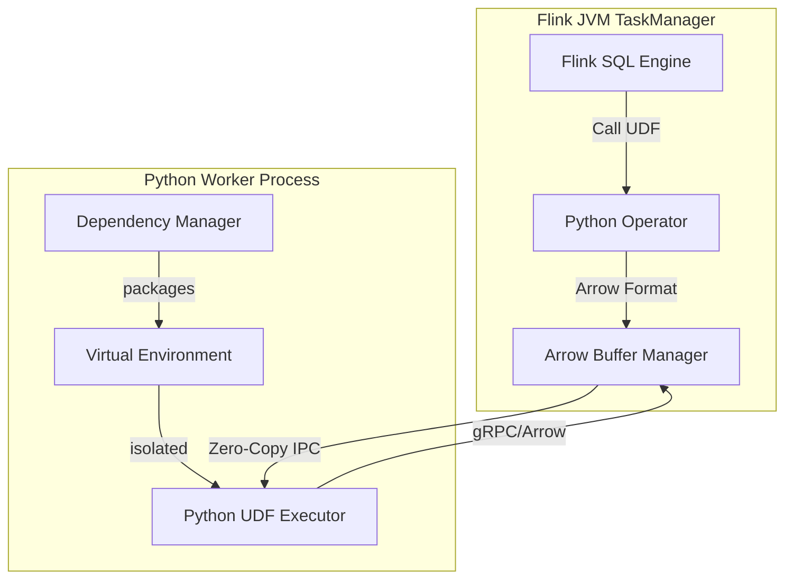
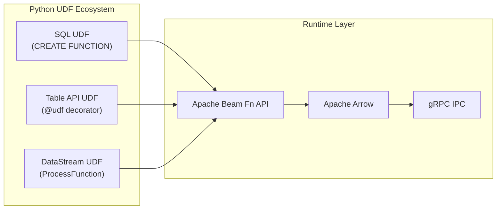
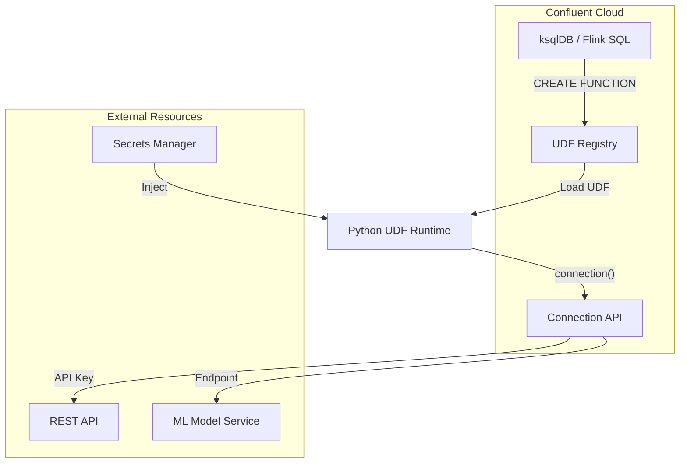
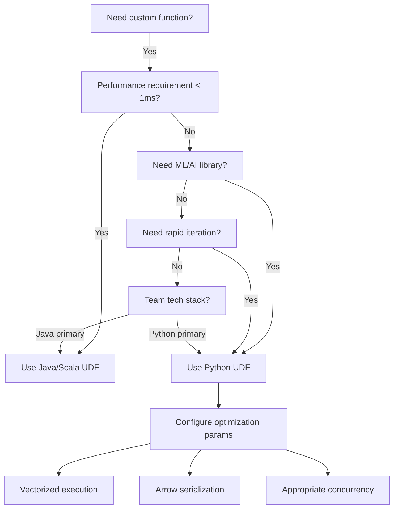
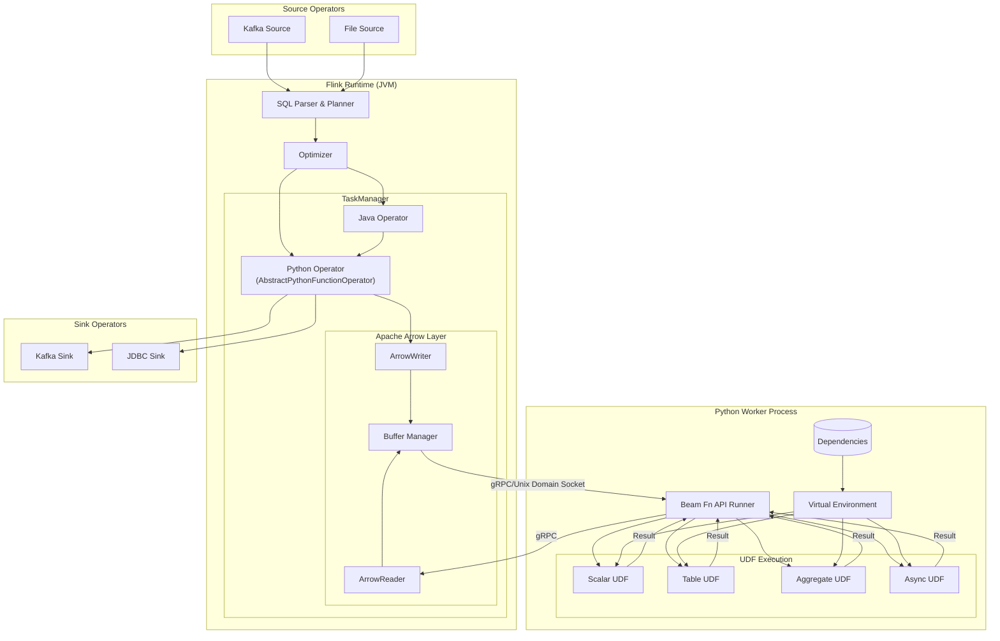
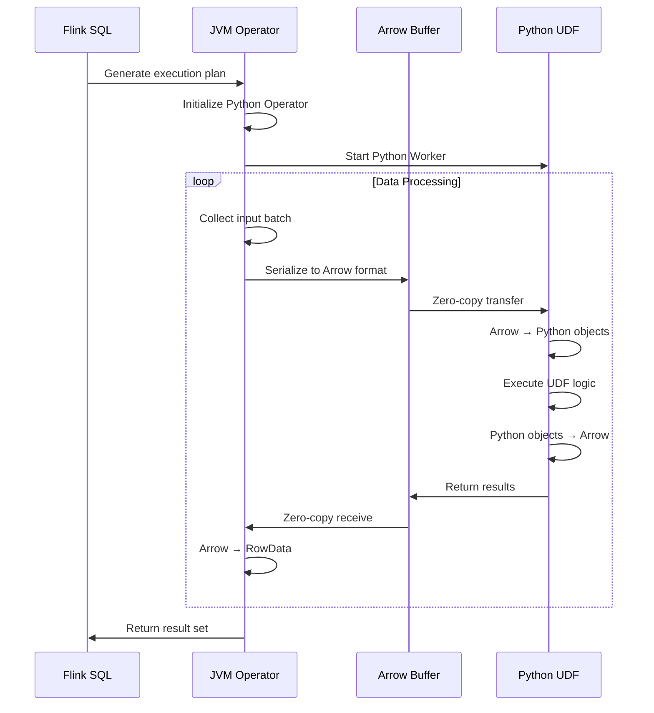
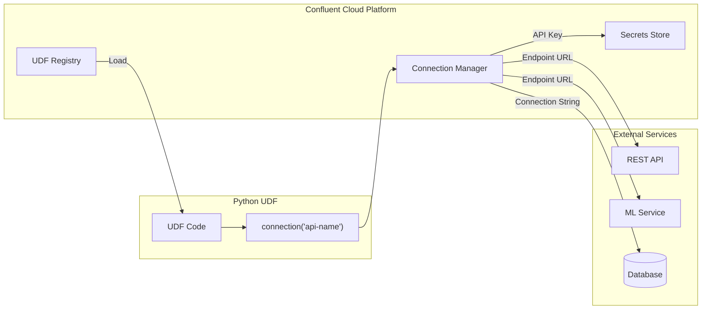

# Flink Python User-Defined Functions (UDF)

> **Stage**: Flink/03-sql-table-api | **Prerequisites**: [Flink SQL Complete Guide](./flink-table-sql-complete-guide.md), [Python API](../09-language-foundations/02-python-api.md) | **Formality Level**: L4

---

## 1. Definitions

### 1.1 Python UDF Formal Definition

**Def-F-03-20** (Python UDF): Let $\mathcal{D}$ be the Flink distributed execution environment and $P$ the Python runtime process. Then a Python UDF is a quadruple $\mathcal{U}_{py} = (F, \tau, \Sigma, \Pi)$, where:

- $F: \text{Dom}_P \rightarrow \text{Cod}_P$ is the user-defined Python function
- $\tau: T_{SQL} \leftrightarrow T_{Python}$ is the type mapping function
- $\Sigma = \{\sigma_1, \sigma_2, ..., \sigma_n\}$ is the set of serialization configurations
- $\Pi = (\pi_{in}, \pi_{out})$ is the inter-process communication pipe pair

**Def-F-03-21** (UDF Type Classification): Python UDFs are classified by input/output cardinality:

| Type | Symbol | Input Cardinality | Output Cardinality | Function Signature |
|------|--------|-------------------|--------------------|--------------------|
| Scalar Function | $\mathcal{S}$ | 1 | 1 | $f: Row \rightarrow Value$ |
| Table Function | $\mathcal{T}$ | 1 | $0..n$ | $f: Row \rightarrow \{Row\}$ |
| Aggregate Function | $\mathcal{A}$ | $0..n$ | 1 | $f: \{Row\} \rightarrow Value$ |
| Async Function | $\mathcal{F}_{async}$ | 1 | 1 (Future) | $f: Row \rightarrow Promise[Value]$ |

### 1.2 Comparison with Java/Scala UDFs

**Def-F-03-22** (UDF Execution Model Difference): Let $\mathcal{U}_{java}$ be a Java UDF and $\mathcal{U}_{py}$ a Python UDF. The execution model difference is defined as:

$$
\Delta_{exec}(\mathcal{U}_{java}, \mathcal{U}_{py}) = \begin{cases}
\text{In-JVM} & \text{if } \mathcal{U} = \mathcal{U}_{java} \\
\text{IPC-based} & \text{if } \mathcal{U} = \mathcal{U}_{py}
\end{cases}
$$

Where IPC communication introduces serialization overhead $O_{serde} = t_{serialize} + t_{deserialize} + t_{network}$

### 1.3 Python UDF Execution Architecture



---

## 2. Properties

### 2.1 Performance Boundary Theorem

**Lemma-F-03-07** (Python UDF Performance Upper Bound): Let $T_{java}$ be the execution time of an equivalent Java UDF and $T_{py}$ the Python UDF execution time. Then there exists a constant $k > 1$ such that:

$$
T_{py} \leq k \cdot T_{java} + O_{ipc}
$$

Where $O_{ipc}$ includes data serialization, cross-process communication, GIL contention, and other overheads.

**Proof Sketch**: The Python UDF execution path includes:

1. Data serialization to Arrow format: $t_s$
2. IPC transfer to Python process: $t_{ipc}$
3. Python function execution (with GIL): $t_{exec}$
4. Result deserialization: $t_d$

Total time $T_{py} = t_s + t_{ipc} + t_{exec} + t_d$. Since $t_{exec}$ is constrained by the GIL in CPython and there is additional inter-process communication overhead, the performance upper bound is as stated above. $\square$

### 2.2 Type Safety Theorem

**Lemma-F-03-08** (Type Consistency): For any Python UDF $\mathcal{U}_{py}$, if the input type satisfies $\Gamma \vdash e : \tau$, then the output type satisfies:

$$
\Gamma \vdash \mathcal{U}_{py}(e) : \tau' \quad \text{where} \quad \tau' = \text{codomain}(F)
$$

**Proof**: By Def-F-03-20, the type mapping function $\tau$ establishes a bijection between Flink SQL types and Python types at compile time, and the Arrow type system enforces consistency at runtime. $\square$

### 2.3 Type Mapping Table

| Flink SQL Type | Python Type | Arrow Type | Note |
|----------------|-------------|------------|------|
| `BOOLEAN` | `bool` | `bool_` | - |
| `TINYINT` | `int` | `int8` | -128 to 127 |
| `SMALLINT` | `int` | `int16` | -32768 to 32767 |
| `INT` | `int` | `int32` | 32-bit signed |
| `BIGINT` | `int` | `int64` | 64-bit signed |
| `FLOAT` | `float` | `float32` | IEEE 754 single |
| `DOUBLE` | `float` | `float64` | IEEE 754 double |
| `VARCHAR(n)` | `str` | `string` | UTF-8 encoded |
| `VARBINARY(n)` | `bytes` | `binary` | Raw bytes |
| `DECIMAL(p,s)` | `Decimal` | `decimal128` | Precision p, Scale s |
| `DATE` | `date` | `date32` | Days since epoch |
| `TIME(n)` | `time` | `time64` | Nanoseconds |
| `TIMESTAMP(n)` | `datetime` | `timestamp` | With/without TZ |
| `ARRAY<t>` | `list` | `list` | Homogeneous array |
| `MAP<k,v>` | `dict` | `map` | Key-value pairs |
| `ROW<...>` | `Row` / `tuple` | `struct` | Named fields |

---

## 3. Relations

### 3.1 Python UDF and PyFlink Relationship



### 3.2 UDF Type to Use Case Mapping

| UDF Type | Use Case | Input/Output | State Requirement | Performance Characteristic |
|----------|----------|--------------|-------------------|----------------------------|
| Scalar | Field transformation, masking, computation | 1→1 | Stateless | High throughput |
| Table | Data expansion, Explode, Parse | 1→N | Stateless | Medium throughput |
| Aggregate | Group statistics, custom aggregation | N→1 | Stateful | Affected by state size |
| Async | I/O intensive, external API calls | 1→1 | Configurable | Limited by concurrency |

### 3.3 Confluent Cloud Integration Relationship



---

## 4. Argumentation

### 4.1 Python UDF Use Case Argumentation

**Prop-F-03-07** (Python UDF Selection Criterion): For a given computation task $Task$, the sufficient condition for choosing a Python UDF is:

$$
Task \in PythonUDF \iff \begin{cases}
\exists lib \in PyPI : lib \models Task & \text{(Ecosystem dependency)} \\
\lor \quad \mathcal{C}_{ml}(Task) = True & \text{(ML integration)} \\
\lor \quad \mathcal{C}_{prototyping}(Task) = True & \text{(Rapid prototyping)} \\
\land \quad L_{latency}(Task) \geq \theta & \text{(Latency tolerant)}
\end{cases}
$$

Where:

- $\mathcal{C}_{ml}$: Does the task require ML frameworks (PyTorch/TensorFlow/scikit-learn)?
- $\mathcal{C}_{prototyping}$: Is rapid iteration needed?
- $L_{latency}$: Task latency requirement
- $\theta$: Python UDF minimum viable latency threshold (typically > 10ms)

### 4.2 Counter-Example Analysis

**Counter-Example 4.1** (High-frequency scalar computation): For simple math operations like $f(x) = x^2 + 1$, if per-record processing latency requirement is < 1μs, Python UDF is unsuitable due to IPC overhead (~1-10ms).

**Counter-Example 4.2** (Low-latency event processing): Real-time risk control scenarios require p99 latency < 5ms; Python UDF serialization and inter-process communication overhead would violate SLA.

### 4.3 Boundary Discussion

| Dimension | Boundary Value | Impact of Exceeding Boundary |
|-----------|----------------|------------------------------|
| Concurrency | Single Python process | GIL limits true parallelism |
| Memory | Limited by TaskManager memory | OOM causes task failure |
| Dependency size | Typically < 500MB | Excessive startup time |
| Network timeout | Default 30s | Requires explicit retry configuration |

---

## 5. Engineering Argument

### 5.1 Performance Optimization Strategy Argumentation

**Thm-F-03-15** (Python UDF Performance Optimization Theorem): For Python UDF execution time $T_{total}$, the following optimization strategies can improve performance by $2\times$ to $10\times$:

1. **Vectorized execution**: Use `@udf(result_type=..., func_type="pandas")` for batch processing, reducing IPC round-trips
2. **Arrow format**: Enable Arrow serialization, avoiding Pickle overhead
3. **Resource isolation**: Configure `python.fn-execution.bundle.size` to balance latency and throughput
4. **Caching optimization**: Enable local caching for repeated computation results

**Proof**:

Let original row-by-row processing time be:
$$T_{row} = n \times (t_{ipc} + t_{exec} + t_{overhead})$$

After vectorized processing (batch size = $B$):
$$T_{vectorized} = \frac{n}{B} \times t_{ipc} + n \times t_{exec} + \frac{n}{B} \times t_{overhead}$$

Performance improvement ratio:
$$\frac{T_{row}}{T_{vectorized}} = \frac{B \times (t_{ipc} + t_{exec} + t_{overhead})}{t_{ipc} + B \times t_{exec} + t_{overhead}} \approx B \quad \text{when} \quad t_{exec} \ll t_{ipc}$$

Therefore, increasing batch size can linearly reduce the proportion of IPC overhead. $\square$

### 5.2 Selection Decision Matrix



### 5.3 Production Environment Trade-offs

| Trade-off Dimension | Option A | Option B | Decision Basis |
|---------------------|----------|----------|----------------|
| Startup time | Preload UDF | On-demand loading | Call frequency |
| Resource allocation | Shared process | Independent process | Isolation requirement |
| Error handling | Fail Fast | Degraded processing | Data importance |
| State management | External storage | Local cache | Consistency requirement |

---

## 6. Examples

### 6.1 Scalar Function Implementation

```python
# scalar_udf_example.py
from pyflink.table import DataTypes
from pyflink.table.udf import udf
import hashlib

# Define scalar function: compute SHA256 hash of a string
@udf(result_type=DataTypes.STRING(),
     func_type='general')  # 'general' or 'pandas'
def sha256_hash(input_str: str) -> str:
    """
    Compute the SHA256 hash of the input string

    Args:
        input_str: Input string

    Returns:
        Hexadecimal representation of SHA256 hash
    """
    if input_str is None:
        return None
    return hashlib.sha256(input_str.encode('utf-8')).hexdigest()

# Vectorized version (better performance)
import pandas as pd

@udf(result_type=DataTypes.STRING(),
     func_type='pandas')
def sha256_hash_vectorized(input_series: pd.Series) -> pd.Series:
    """Vectorized version of SHA256 hash function"""
    return input_series.apply(
        lambda x: hashlib.sha256(x.encode('utf-8')).hexdigest()
        if x is not None else None
    )
```

### 6.2 Table Function Implementation

```python
# table_udf_example.py
from pyflink.table import DataTypes
from pyflink.table.udf import udtf, TableFunction
from pyflink.table.types import Row

class ParseJsonArray(TableFunction):
    """
    Table function: expand a JSON array string into multiple rows

    Example input: '["a", "b", "c"]'
    Example output: Three rows containing "a", "b", "c"
    """

    def __init__(self):
        import json
        self.json = json

    def eval(self, json_array_str: str):
        if json_array_str is None:
            return

        try:
            array = self.json.loads(json_array_str)
            if isinstance(array, list):
                for item in array:
                    yield Row(str(item))
        except self.json.JSONDecodeError:
            # Return empty or log error
            pass

# Register and use
# parse_json = udtf(ParseJsonArray(),
#                   result_types=[DataTypes.STRING()])
```

### 6.3 Aggregate Function Implementation

```python
# aggregate_udf_example.py
from pyflink.table import DataTypes
from pyflink.table.udf import udaf, AggregateFunction

class WeightedAverage(AggregateFunction):
    """
    Custom aggregate function: compute weighted average

    Accumulator structure: (sum_value * weight, sum_weight)
    """

    def create_accumulator(self):
        # Initialize accumulator: (weighted_sum, total_weight)
        return (0.0, 0.0)

    def accumulate(self, accumulator, value, weight):
        if value is not None and weight is not None:
            weighted_sum, total_weight = accumulator
            weighted_sum += value * weight
            total_weight += weight
            return (weighted_sum, total_weight)
        return accumulator

    def retract(self, accumulator, value, weight):
        # For retract stream processing
        if value is not None and weight is not None:
            weighted_sum, total_weight = accumulator
            weighted_sum -= value * weight
            total_weight -= weight
            return (weighted_sum, total_weight)
        return accumulator

    def merge(self, accumulator, accumulators):
        # Merge multiple accumulators
        final_weighted_sum, final_total_weight = accumulator
        for acc in accumulators:
            weighted_sum, total_weight = acc
            final_weighted_sum += weighted_sum
            final_total_weight += total_weight
        return (final_weighted_sum, final_total_weight)

    def get_value(self, accumulator):
        weighted_sum, total_weight = accumulator
        if total_weight == 0:
            return None
        return weighted_sum / total_weight

    def get_result_type(self):
        return DataTypes.DOUBLE()

    def get_accumulator_type(self):
        return DataTypes.ROW([
            DataTypes.FIELD("weighted_sum", DataTypes.DOUBLE()),
            DataTypes.FIELD("total_weight", DataTypes.DOUBLE())
        ])

# weighted_avg = udaf(WeightedAverage())
```

### 6.4 Async Function Implementation (Confluent Cloud Feature)

```python
# async_udf_example.py
from pyflink.table import DataTypes
from pyflink.table.udf import udf
import aiohttp
import asyncio

# Confluent Cloud Connection object example
# Used to call external REST APIs (e.g., ML inference service)

@udf(result_type=DataTypes.ROW([
    DataTypes.FIELD("sentiment", DataTypes.STRING()),
    DataTypes.FIELD("confidence", DataTypes.DOUBLE())
]), func_type='async')
async def sentiment_analysis(text: str, context) -> dict:
    """
    Asynchronously call external sentiment analysis API

    Args:
        text: Text to analyze
        context: UDF execution context containing connection object

    Returns:
        Row containing sentiment and confidence
    """
    if not text:
        return {"sentiment": None, "confidence": 0.0}

    # Retrieve configuration from Confluent Cloud Connection
    # connection = context.get_connection("sentiment-api")
    # api_url = connection.get_property("endpoint")
    # api_key = connection.get_secret("api_key")

    api_url = "https://api.example.com/sentiment"

    async with aiohttp.ClientSession() as session:
        try:
            async with session.post(
                api_url,
                json={"text": text},
                timeout=aiohttp.ClientTimeout(total=5)
            ) as response:
                if response.status == 200:
                    result = await response.json()
                    return {
                        "sentiment": result.get("sentiment"),
                        "confidence": result.get("confidence", 0.0)
                    }
                else:
                    return {"sentiment": "ERROR", "confidence": 0.0}
        except asyncio.TimeoutError:
            return {"sentiment": "TIMEOUT", "confidence": 0.0}
        except Exception as e:
            return {"sentiment": f"ERROR: {str(e)}", "confidence": 0.0}
```

### 6.5 SQL Registration and Invocation

```sql
-- Register Python UDF (Flink SQL)

-- 1. Using CREATE FUNCTION syntax
CREATE FUNCTION sha256_hash
AS 'scalar_udf_example.sha256_hash'
LANGUAGE PYTHON;

-- 2. Register UDF with dependencies
CREATE FUNCTION ml_predict
AS 'ml_udf.predict'
LANGUAGE PYTHON
WITH (
    'python.archives' = 'hdfs:///libs/ml_env.zip',
    'python.requirements' = 'hdfs:///requirements.txt',
    'python.executable' = 'python3'
);

-- 3. Query using UDF
SELECT
    user_id,
    sha256_hash(email) as email_hash,
    ml_predict(features) as prediction
FROM user_events
WHERE event_time > TIMESTAMP '2025-01-01';

-- 4. Table function usage (with LATERAL TABLE)
SELECT
    order_id,
    item
FROM orders,
LATERAL TABLE(parse_json_array(items_json)) AS T(item);

-- 5. Aggregate function usage
SELECT
    category,
    weighted_average(price, quantity) as avg_price
FROM sales
GROUP BY category;
```

### 6.6 Dependency Management and Virtual Environment

```text
# requirements.txt example
# Flink Python UDF dependency file

# Core dependencies (usually provided by Flink)
pyflink==1.20.0
apache-beam==2.50.0
pyarrow==14.0.0

# Common data processing
pandas==2.1.4
numpy==1.26.0

# ML/AI libraries (add as needed)
scikit-learn==1.3.0
torch==2.1.0
transformers==4.35.0

# HTTP clients (for Async UDF)
aiohttp==3.9.0
requests==2.31.0

# Utility libraries
python-dateutil==2.8.2
pydantic==2.5.0
```

```bash
#!/bin/bash
# Create Python virtual environment and package it (for Flink UDF deployment)

VENV_NAME="flink_udf_env"
PYTHON_VERSION="3.11"

# 1. Create virtual environment
conda create -n $VENV_NAME python=$PYTHON_VERSION -y
source activate $VENV_NAME

# 2. Install dependencies
pip install -r requirements.txt

# 3. Package virtual environment (for uploading to Flink)
zip -r ${VENV_NAME}.zip $CONDA_PREFIX/lib/python${PYTHON_VERSION}/site-packages/

# 4. Upload to HDFS/S3 (storage accessible by Flink)
hdfs dfs -put ${VENV_NAME}.zip /flink/python-envs/
```

---

## 7. Visualizations

### 7.1 Python UDF Execution Architecture Detail



### 7.2 Type Mapping and Serialization Flow



### 7.3 Confluent Cloud Connection Management



---

## 8. Production Practice Guide

### 8.1 Error Handling and Retry

```python
# robust_udf_example.py
from pyflink.table import DataTypes
from pyflink.table.udf import udf
import logging
from functools import wraps

# Configure logging
logger = logging.getLogger('flink_udf')

def retry_on_exception(max_retries=3, exceptions=(Exception,)):
    """UDF retry decorator"""
    def decorator(func):
        @wraps(func)
        def wrapper(*args, **kwargs):
            for attempt in range(max_retries):
                try:
                    return func(*args, **kwargs)
                except exceptions as e:
                    logger.warning(f"Attempt {attempt + 1} failed: {e}")
                    if attempt == max_retries - 1:
                        # Last retry failed, return default or raise
                        return None
            return None
        return wrapper
    return decorator

@udf(result_type=DataTypes.STRING())
@retry_on_exception(max_retries=3, exceptions=(TimeoutError, ConnectionError))
def robust_external_call(input_data: str) -> str:
    """
    UDF with retry mechanism for external calls
    """
    import requests

    response = requests.post(
        "https://api.example.com/process",
        json={"data": input_data},
        timeout=5
    )
    response.raise_for_status()
    return response.json().get("result")
```

### 8.2 Monitoring and Debugging Configuration

```yaml
# flink-conf.yaml Python UDF related configuration

# Python Worker configuration
python.fn-execution.bundle.size: 10000          # Batch size
python.fn-execution.bundle.time: 1000           # Batch timeout (ms)
python.fn-execution.memory.managed: true        # Use managed memory

# Arrow configuration
python.fn-execution.arrow.batch.size: 10000     # Arrow batch size
python.fn-execution.streaming.enabled: true     # Enable streaming transfer

# Logging configuration
python.log.level: INFO
python.log.redirect-to-sysout: true

# Fault recovery
python.fn-execution.max-retries: 3
python.fn-execution.retry-delay: 1000
```

### 8.3 Security Configuration

```python
# secure_udf_example.py
import os
from pyflink.table import DataTypes
from pyflink.table.udf import udf

class SecureUDF:
    """
    Secure UDF best practices example
    """

    def __init__(self):
        # Obtain sensitive information from environment variables or key management service
        self.api_key = os.environ.get('EXTERNAL_API_KEY')
        if not self.api_key:
            raise ValueError("API key not configured")

    def validate_input(self, data):
        """Input validation"""
        if not isinstance(data, str):
            raise TypeError(f"Expected string, got {type(data)}")
        if len(data) > 10000:  # Limit input size
            raise ValueError("Input too large")
        return data

    def sanitize_output(self, result):
        """Output sanitization"""
        if result is None:
            return ""
        # Remove potentially dangerous characters
        return str(result).replace('\x00', '')

@udf(result_type=DataTypes.STRING())
def secure_process(input_data: str) -> str:
    processor = SecureUDF()
    validated = processor.validate_input(input_data)

    # Processing logic...
    result = validated.upper()  # Example processing

    return processor.sanitize_output(result)
```

---

## 9. References

---

*Document Version: v1.0 | Last Updated: 2026-04-03 | Status: Draft*
