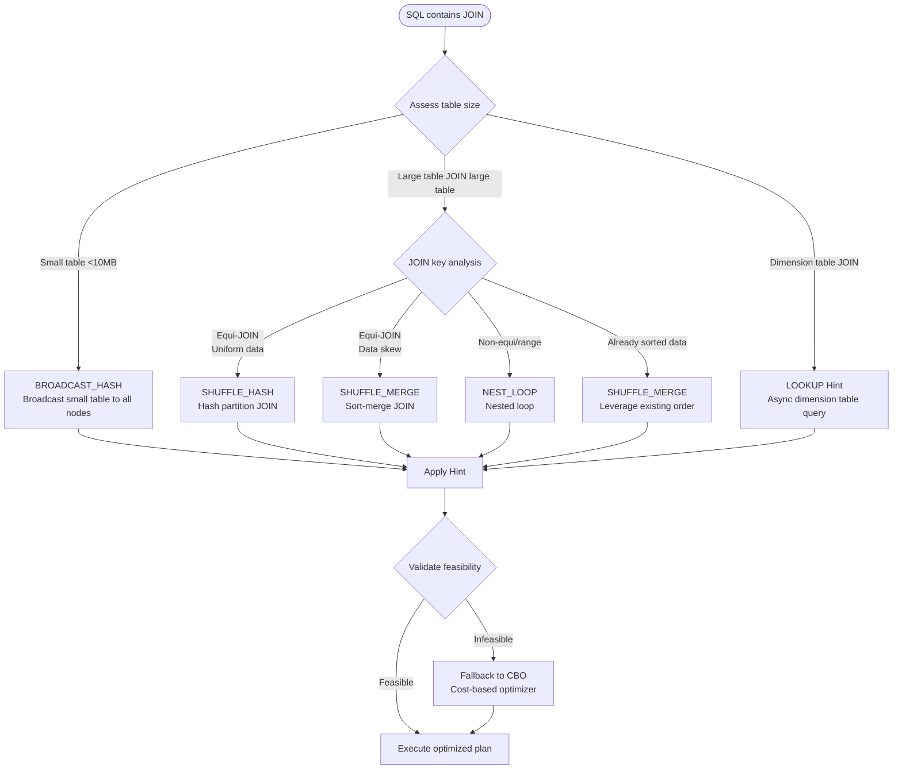
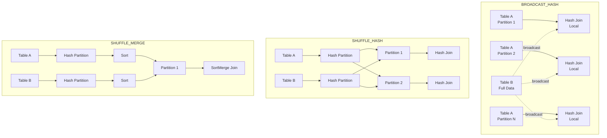
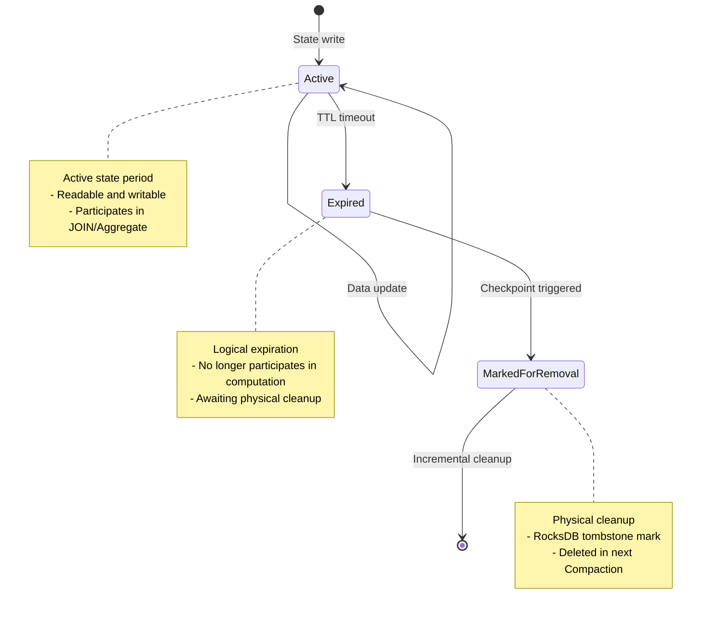
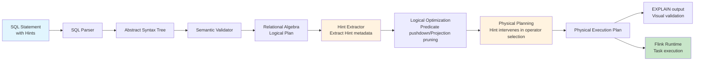
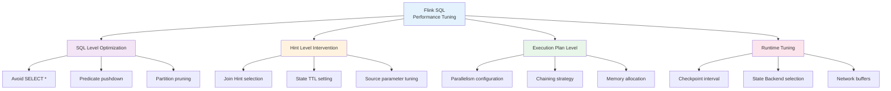

# Flink SQL Hints Query Optimization and Execution Plan Tuning

> Stage: Flink Stage 3 | Prerequisites: [Flink SQL Complete Guide](./flink-table-sql-complete-guide.md), [Stream-Batch Unification](../../08-roadmap/08.01-flink-24/flink-25-stream-batch-unification.md) | Formalization Level: L3

## 1. Definitions

### Def-F-03-90: SQL Hint

**SQL Hint** is a metadata directive embedded in SQL statements, used to provide explicit execution strategy suggestions to the query optimizer, overriding default cost-based optimization decisions.

Formal definition:

```
Hint ::= '/*+' hintContent '*/'
hintContent ::= hintName ['(' option [, option]* ')']
option ::= key '=' value | key
```

### Def-F-03-91: Flink SQL Hint Classification System

Flink SQL Hints are divided by functional domain into:

| Category | Hint Prefix | Scope | Flink Version |
|----------|-------------|-------|---------------|
| Join Hints | `BROADCAST_HASH`/`SHUFFLE_HASH`/`SHUFFLE_MERGE`/`NEST_LOOP` | JOIN clause | 1.12+ |
| Lookup Hints | `LOOKUP` | Dimension table JOIN | 1.14+ |
| State Hints | `STATE_TTL` | Stateful operators | 1.17+ |
| Source Hints | `OPTIONS` | Table scan configuration | 1.12+ |
| Aggregation Hints | `MINIBATCH` | Aggregation optimization | 1.12+ |

### Def-F-03-92: Join Hint Semantics

**Def-F-03-92a**: `BROADCAST_HASH` - Broadcasts the small table to all parallel instances, builds a hash table in memory for local JOIN, eliminating network Shuffle.

**Def-F-03-92b**: `SHUFFLE_HASH` - Hash-partitions both tables by JOIN key, builds a hash table for JOIN within each partition.

**Def-F-03-92c**: `SHUFFLE_MERGE` - Hash-partitions both tables by JOIN key, performs sort-merge JOIN within each partition.

**Def-F-03-92d**: `NEST_LOOP` - Cartesian product traversal, suitable for scenarios where one side has extremely small data (usually <100 rows).

### Def-F-03-93: State Hint Semantics

**STATE_TTL Hint** is used to explicitly declare state retention time:

```sql
SELECT /*+ STATE_TTL('t1'='1h', 't2'='30min') */ *
FROM t1 JOIN t2 ON t1.key = t2.key
```

Where TTL (Time-To-Live) defines how long state is retained after the last update; expired state will be cleaned up.

### Def-F-03-94: JSON Function Family (Flink 2.2 Enhancement)

**Def-F-03-94a**: `JSON_PATH(json, path)` - Extracts values from a JSON string using JSONPath expressions.

**Def-F-03-94b**: `JSON_ARRAYAGG([DISTINCT] value [ORDER BY ...])` - Aggregate function that aggregates multiple rows into a JSON array.

**Def-F-03-94c**: `JSON_OBJECTAGG(key, value)` - Aggregate function that aggregates key-value pairs into a JSON object.

**Def-F-03-94d**: `JSON_EXISTS(json, path)` - Checks whether a JSONPath path exists.

### Def-F-03-95: Execution Plan

**Physical Execution Plan** is the executable representation after the logical plan is transformed by the optimizer, formalized as a directed acyclic graph $G = (V, E)$, where:

- $V$ represents the set of operators (Source, Sink, Join, Aggregate, etc.)
- $E$ represents data flow edges
- Each operator $v \in V$ is associated with parallelism $p(v)$ and resource configuration $r(v)$

## 2. Properties

### Lemma-F-03-70: Join Hint Priority

**Lemma-F-03-70a**: When multiple Join Hints conflict, Flink adopts the **nearest-first** principle, meaning the Hint closest to the JOIN clause takes effect.

**Lemma-F-03-70b**: If the strategy specified by the Hint is infeasible (e.g., broadcasting a large table causing OOM), the optimizer will fall back to cost model selection and log a warning.

### Lemma-F-03-71: State TTL and Checkpoint Relationship

Given state TTL $T_{ttl}$ and Checkpoint interval $T_{cp}$:

- Actual state cleanup occurs at Checkpoint boundaries
- Effective state retention range: $[T_{ttl}, T_{ttl} + T_{cp})$
- Under incremental Checkpoint, expired state delayed cleanup does not exceed $T_{cp}$

### Lemma-F-03-72: JSON Function Performance Characteristics

**Lemma-F-03-72a**: `JSON_PATH` parsing cost is $O(n)$, where $n$ is the JSON string length; a single query may trigger multiple parses.

**Lemma-F-03-72b**: `JSON_ARRAYAGG`/`JSON_OBJECTAGG` need to maintain aggregation buffers, with memory complexity $O(m)$, where $m$ is the aggregation group size.

## 3. Relations

### 3.1 Hint and Query Optimizer Interaction

The Flink SQL optimizer follows the **Volcano/Cascades** framework; Hints intervene at the following stages:

1. **SQL Parsing** → Identify and extract Hint metadata
2. **Logical Plan Generation** → Attach Hint to corresponding RelNode
3. **Logical Optimization** → Hint participates in rule matching and cost calculation
4. **Physical Plan Generation** → Hint overrides physical operator selection
5. **Execution Plan Generation** → Hint converts to runtime configuration

### 3.2 Join Hint and Execution Strategy Mapping

| Join Hint | Physical Operator | Network Shuffle | Memory Requirement | Applicable Scenario |
|-----------|-------------------|-----------------|--------------------|---------------------|
| BROADCAST_HASH | HashJoin (Broadcast) | None | Small table full data | Large table JOIN small table |
| SHUFFLE_HASH | HashJoin (Shuffle) | Both sides | Partition data volume | Equi-JOIN, uniform data distribution |
| SHUFFLE_MERGE | SortMergeJoin | Both sides | Low | Ordered data, non-equi JOIN |
| NEST_LOOP | NestedLoopJoin | Possible | Extremely low | Very small table JOIN |

### 3.3 Relationship with Apache Calcite

Flink SQL is implemented based on Apache Calcite:

- **Parsing Layer**: Calcite SQL Parser + Flink extensions
- **Validation Layer**: Calcite Validator + FlinkCatalog
- **Optimization Layer**: Calcite optimization rules + Flink custom rules (including Hint processing)
- **Execution Layer**: Flink Table API → DataStream API

## 4. Argumentation

### 4.1 Join Hint Selection Decision Tree

**Scenario Analysis**: Stream JOIN vs Batch JOIN

**Stream Processing Scenario** (unbounded data):

- Dimension table JOIN → Preferred `LOOKUP('RETRY'='FIXED_DELAY')`
- Dual-stream JOIN → Preferred `SHUFFLE_HASH` (state controllable)
- Avoid `BROADCAST_HASH` (dimension table changes require full re-broadcast)

**Batch Processing Scenario** (bounded data):

- Large table JOIN small table → `BROADCAST_HASH`
- Equi-JOIN with data skew → `SHUFFLE_HASH` + automatic skew optimization
- Range JOIN or complex conditions → `SHUFFLE_MERGE`

### 4.2 State Hint Side Effect Boundaries

**Risk Case**: Too short TTL causing data inconsistency

```sql
-- Problem case: TTL < business time window
SELECT /*+ STATE_TTL('orders'='5min', 'shipments'='5min') */ *
FROM orders JOIN shipments
ON orders.id = shipments.order_id
WHERE orders.event_time BETWEEN shipments.event_time - INTERVAL '10' MINUTE
  AND shipments.event_time
```

**Analysis**: If the interval between order and shipment events exceeds 5 minutes, the state has already been cleaned up, causing JOIN failure.

### 4.3 JSON Function Performance Bottleneck

**Anti-pattern**: Using JSON fields in WHERE conditions

```sql
-- Inefficient: parses JSON for every row
SELECT * FROM events
WHERE JSON_VALUE(payload, '$.status') = 'completed'

-- Efficient: pre-extract to structured field
SELECT * FROM events
WHERE status = 'completed'  -- Use pre-computed field or projection pushdown
```

## 5. Proof / Engineering Argument

### Thm-F-03-70: Broadcast Join Feasibility Condition

**Theorem**: For JOIN operation $R \bowtie_{\theta} S$, the necessary and sufficient condition for Broadcast Hash Join feasibility:

$$|S| \times \text{rowSize}(S) \leq M_{tm} \times \alpha$$

Where:

- $|S|$: Small table record count
- $\text{rowSize}(S)$: Single record serialized size
- $M_{tm}$: TaskManager available memory
- $\alpha$: Safety factor (usually 0.3~0.5, reserving space for GC and state)

**Engineering Proof**:

1. **Memory Requirement Analysis**: Hash table load factor is usually 0.75, requiring approximately $1.33 \times$ raw data space
2. **Serialization Overhead**: Flink serialization adds about 10-20% extra metadata
3. **Concurrency Safety**: Broadcast data is read-only, lock-free access, memory shared
4. **Practical Threshold**: Empirical recommendation is broadcast table <10MB (after serialization), otherwise use SHUFFLE_HASH

### Thm-F-03-71: State TTL and Result Correctness

**Theorem**: For time-window JOINs, setting TTL $\geq$ maximum event time difference guarantees result completeness.

**Formalization**: Given event streams $A$, $B$ with time attributes $t_A$, $t_B$ respectively, if the JOIN condition contains time constraint $|t_A - t_B| \leq \Delta t$, then:

$$TTL \geq \Delta t + T_{max\_delay}$$

Where $T_{max\_delay}$ is the maximum out-of-order delay (Watermark strategy related).

**Proof Points**:

- State storage time covers the time window during which events may match
- Considering out-of-order data, Watermark delay needs to be added
- Incremental cleanup guarantees eventual consistency, but may delay output

### Thm-F-03-72: JSON Aggregate Function Memory Upper Bound

**Theorem**: The memory consumption upper bound of `JSON_ARRAYAGG` in GROUP BY queries is:

$$M_{json} \leq \sum_{g \in G} \left( O(1) + \sum_{r \in g} |\text{serialize}(r)| \right)$$

Where $G$ is the set of groups, each group maintaining an independent JSON build buffer.

**Engineering Argument**:

- Unbounded streams need to cooperate with windows or emit strategies to prevent OOM
- Batch processing scenarios are limited by group cardinality, optimizable through two-phase aggregation
- Flink 2.2 introduces JSON serialization streaming write, reducing peak memory

## 6. Examples

### 6.1 Join Hints in Practice

#### Example 1: Broadcast Hash Join

```sql
-- Large orders table JOIN small users table
SELECT /*+ BROADCAST_HASH(u) */
    o.order_id, o.amount, u.user_name, u.region
FROM orders o
JOIN users u ON o.user_id = u.user_id
```

**Applicable Conditions**: users table <1 million rows, single row <100 bytes

#### Example 2: Lookup Join with Retry

```sql
-- Dimension table JOIN with network jitter tolerance
SELECT /*+ LOOKUP('RETRY'='FIXED_DELAY',
                   'FIXED_DELAY'='100ms',
                   'MAX_RETRY'='3') */
    o.*, d.department_name
FROM orders o
LEFT JOIN departments FOR SYSTEM_TIME AS OF o.proc_time AS d
ON o.dept_id = d.dept_id
```

#### Example 3: Multi-Way Join Hints

```sql
-- Multi-table JOIN, each JOIN independently specifies strategy
SELECT /*+ BROADCAST_HASH(c), SHUFFLE_HASH(o) */
    c.city, p.product_name, SUM(o.amount) as total
FROM customers c
JOIN orders o ON c.customer_id = o.customer_id
JOIN products p ON o.product_id = p.product_id
GROUP BY c.city, p.product_name
```

### 6.2 State Hints Configuration

#### Example: Dual-Stream JOIN State Management

```sql
-- Order stream JOIN payment stream, state retained for 24 hours
SELECT /*+ STATE_TTL('o'='24h', 'p'='24h') */
    o.order_id, o.order_time, p.pay_time, p.amount
FROM orders o
JOIN payments p ON o.order_id = p.order_id
AND p.pay_time BETWEEN o.order_time - INTERVAL '5' MINUTE
                  AND o.order_time + INTERVAL '1' HOUR
```

#### Example: Incremental Checkpoint Configuration

```sql
SET 'state.backend.incremental' = 'true';
SET 'state.backend.incremental.checkpoint-storage' = 'rocksdb';
SET 'execution.checkpointing.interval' = '30s';

-- Use with TTL
SELECT /*+ STATE_TTL('s1'='1h', 's2'='2h') */ *
FROM stream1 s1 JOIN stream2 s2 ON s1.key = s2.key
```

### 6.3 JSON Function Applications (Flink 2.2)

#### Example 1: JSON_PATH Extraction

```sql
-- Extract nested fields from event logs
SELECT
    event_id,
    JSON_PATH(payload, '$.user.id') as user_id,
    JSON_PATH(payload, '$.user.profile.name') as user_name,
    JSON_PATH(payload, '$.metadata.tags[0]') as first_tag
FROM user_events
WHERE JSON_EXISTS(payload, '$.user.id')
```

#### Example 2: JSON Aggregation

```sql
-- Aggregate orders into JSON array by user
SELECT
    user_id,
    JSON_ARRAYAGG(
        JSON_OBJECT(
            'order_id' VALUE order_id,
            'amount' VALUE amount,
            'items' VALUE JSON_ARRAYAGG(
                JSON_OBJECT('sku' VALUE sku, 'qty' VALUE quantity)
            )
        ) ORDER BY order_time DESC
    ) as order_history
FROM orders
GROUP BY user_id
```

#### Example 3: Combined with Table API

```java
// Use JSON functions in Table API
tableEnv.createTemporaryFunction("ExtractJson", JsonPathFunction.class);

Table result = tableEnv.sqlQuery(
    "SELECT ExtractJson(log_data, '$.error.code') as error_code, COUNT(*) " +
    "FROM application_logs " +
    "GROUP BY ExtractJson(log_data, '$.error.code')"
);
```

### 6.4 Execution Plan Analysis

#### EXPLAIN Statement Details

```sql
-- Basic execution plan
EXPLAIN PLAN FOR
SELECT /*+ BROADCAST_HASH(c) */ *
FROM orders o JOIN customers c ON o.cust_id = c.id;

-- Detailed execution plan (with optimizer decisions)
EXPLAIN ESTIMATED_COST, CHANGELOG_MODE, EXECUTION_PLAN, JSON_EXECUTION_PLAN
SELECT /*+ SHUFFLE_HASH(o) */ *
FROM orders o JOIN shipments s ON o.id = s.order_id;
```

#### Output Parsing Example

```
== Abstract Syntax Tree ==
LogicalProject(...)
+- LogicalJoin(condition=[=($0, $2)], joinType=[inner])
   :- LogicalTableScan(table=[[default_catalog, default_database, orders]])
   +- LogicalTableScan(table=[[default_catalog, default_database, customers]])

== Optimized Physical Plan ==
HashJoin(joinType=[InnerJoin], where=[=(cust_id, id)], select=[...], isBroadcast=[true])
:- TableSourceScan(table=[[orders]], fields=[order_id, cust_id, amount])
+- Exchange(distribution=[broadcast])
   +- TableSourceScan(table=[[customers]], fields=[id, name, region])

== Optimized Execution Plan ==
Calc(select=[order_id, cust_id, amount, name, region])
+- HashJoin(joinType=[InnerJoin], where=[=(cust_id, id)])
   :- LegacyTableSourceScan(table=[orders], fields=[order_id, cust_id, amount])
   +- BroadcastExchange
      +- LegacyTableSourceScan(table=[customers], fields=[id, name, region])
```

## 7. Visualizations

### 7.1 SQL Hint Decision Flowchart

Hint decision flow: choose the appropriate Join strategy based on table size, data distribution, and business scenario.



### 7.2 Join Hint Execution Architecture Comparison

Differences in execution architecture among different Join strategies: Broadcast, Shuffle Hash, and Shuffle Merge each have different data transfer and computation patterns.



### 7.3 State Management Hints Interaction Diagram

State TTL works in concert with the Checkpoint mechanism to ensure consistent state cleanup.



### 7.4 Execution Plan Optimization Flow

Complete optimization chain from SQL to physical execution plan.



### 7.5 Performance Tuning Hierarchy Diagram

Multi-level strategies for Flink SQL performance tuning.



## 8. References
