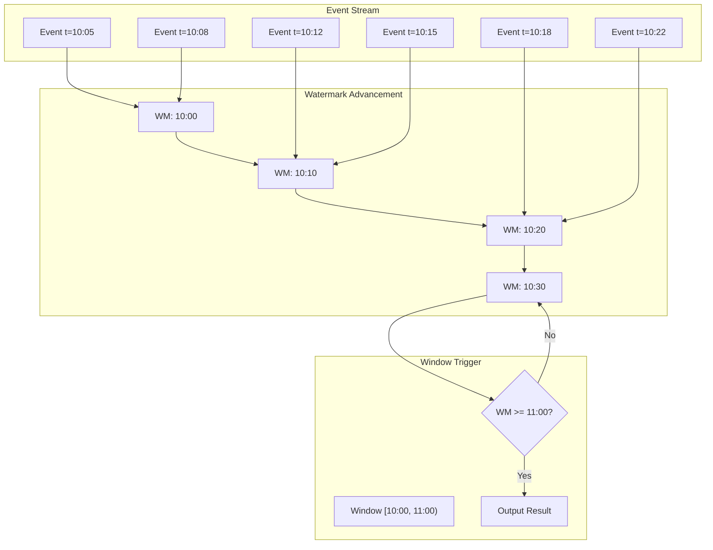
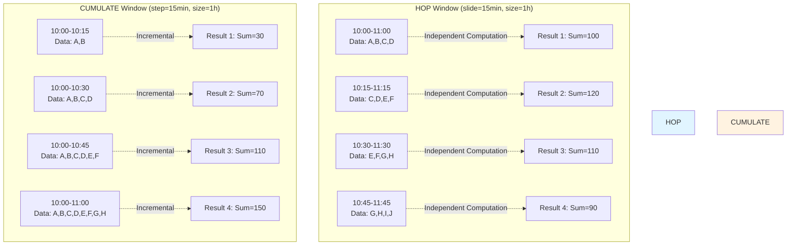
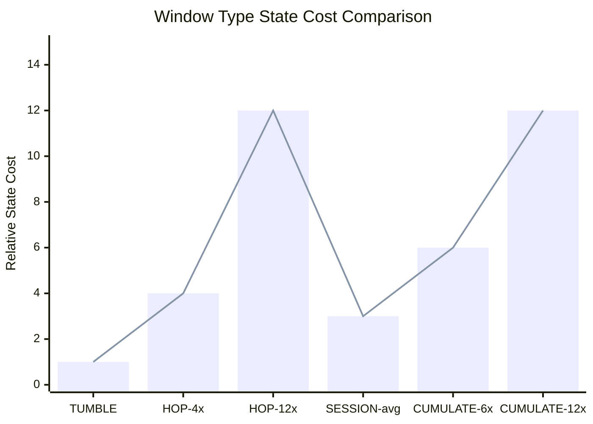
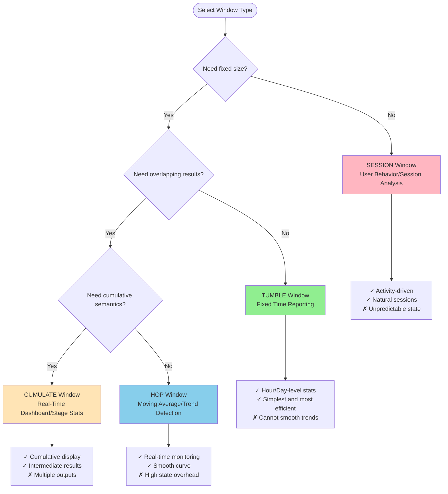

# Flink SQL Window Functions Deep Dive

> **Stage**: Flink | **Prerequisites**: [Flink SQL Calcite Optimizer Deep Dive](./flink-sql-calcite-optimizer-deep-dive-en.md), [Process Table Functions](./flink-process-table-functions-en.md) | **Formality Level**: L5

---

## 1. Definitions

### Def-F-03-50: Window TVF (Table-Valued Function)

**Definition**: A Window TVF is a table-valued function in Flink SQL used for **time-dimensional grouping**, slicing stream data by time boundaries into finite sets for aggregation computation.

Formal expression:
$$
\text{WindowTVF}: \mathcal{S} \times \mathcal{W} \rightarrow \mathcal{T}
$$

Where:

- $\mathcal{S}$: Input stream (infinite sequence)
- $\mathcal{W}$: Window specification (Window Specification)
- $\mathcal{T}$: Output table (finite grouping result)

Core characteristics of Window TVF:

```
┌─────────────────────────────────────────────────────────────────┐
│                      Window TVF Core Model                       │
├─────────────────────────────────────────────────────────────────┤
│                                                                 │
│   Event Stream (Infinite)                                       │
│   ──────────────────────────►                                   │
│   t₁  t₂  t₃  t₄  t₅  t₆  t₇  t₈  t₉  t₁₀ ...                   │
│                                                                 │
│        ┌─────────┐  ┌─────────┐  ┌─────────┐                    │
│        │ Window₁ │  │ Window₂ │  │ Window₃ │ ...                │
│        │[t₁-t₄]  │  │[t₅-t₈]  │  │[t₉-t₁₂]│                     │
│        └────┬────┘  └────┬────┘  └────┬────┘                    │
│             │            │            │                         │
│             ▼            ▼            ▼                         │
│        ┌─────────┐  ┌─────────┐  ┌─────────┐                    │
│        │ Aggregate Result │  │ Aggregate Result │  │ Aggregate Result │                   │
│        │  Table  │  │  Table  │  │  Table  │                    │
│        └─────────┘  └─────────┘  └─────────┘                    │
│                                                                 │
│   Key Insight: Infinite Stream → Finite Window → Computable Result │
└─────────────────────────────────────────────────────────────────┘
```

### Def-F-03-51: Relationship Between Window and Stream Processing

**Definition**: Window is the **bridge between stream processing and batch processing**, transforming infinite streams into processable finite batches through time boundaries.

$$
\text{Stream Processing} = \lim_{|\mathcal{W}| \to 0} \sum_{w \in \mathcal{W}} \text{BatchProcess}(w)
$$

| Dimension | Batch Processing | Stream Processing (No Window) | Stream Processing (With Window) |
|-----------|------------------|-------------------------------|--------------------------------|
| **Data Boundary** | Definite (file/table) | Unbounded | Time boundary |
| **Computation Trigger** | Query arrival | Per-event | Window trigger |
| **Result Latency** | High | Extremely low | Tunable |
| **State Requirement** | None | Unbounded growth | Window-level |
| **Semantic Guarantee** | Exact | Requires special handling | Exact (within window) |

### Def-F-03-52: Four Window Types Comparison

| Window Type | SQL Syntax | Core Parameters | Output Characteristics | State Cost |
|-------------|------------|-----------------|------------------------|------------|
| **TUMBLE** | `TUMBLE(TABLE t, DESCRIPTOR(ts), INTERVAL '1' HOUR)` | size | Non-overlapping, equal size | $O(1)$ |
| **HOP** | `HOP(TABLE t, DESCRIPTOR(ts), INTERVAL '5' MINUTE, INTERVAL '1' HOUR)` | slide, size | May overlap | $O(size/slide)$ |
| **SESSION** | `SESSION(TABLE t, DESCRIPTOR(ts), INTERVAL '10' MINUTE)` | gap | Dynamic size, non-overlapping | $O(active\_sessions)$ |
| **CUMULATE** | `CUMULATE(TABLE t, DESCRIPTOR(ts), INTERVAL '10' MINUTE, INTERVAL '1' HOUR)` | step, size | Cumulative expansion | $O(size/step)$ |

### Def-F-03-53: TUMBLE Window (Tumbling Window)

**Definition**: TUMBLE window divides the time axis into **fixed-size, non-overlapping, contiguous** time intervals.

Formalization:
$$
\text{TUMBLE}(t, \delta) = \{ [k\delta, (k+1)\delta) \mid k \in \mathbb{Z}, t \in [k\delta, (k+1)\delta) \}
$$

Where:

- $t$: Event timestamp
- $\delta$: Window size (size)
- $k$: Window index ($k = \lfloor t/\delta \rfloor$)

Window membership determination:
$$
\text{window\_index}(t) = \left\lfloor \frac{t - \text{offset}}{\delta} \right\rfloor
$$

### Def-F-03-54: HOP Window (Sliding Window)

**Definition**: HOP window generates possibly overlapping fixed-size windows at fixed **slide intervals**.

Formalization:
$$
\text{HOP}(t, \delta, \sigma) = \{ [k\sigma, k\sigma + \delta) \mid k \in \mathbb{Z}, t \in [k\sigma, k\sigma + \delta) \}
$$

Where:

- $\delta$: Window size (size)
- $\sigma$: Slide interval (slide), $0 < \sigma \leq \delta$
- Window overlap count: $\lceil \delta/\sigma \rceil$

**Special case**: When $\sigma = \delta$, HOP degenerates into TUMBLE.

### Def-F-03-55: SESSION Window (Session Window)

**Definition**: SESSION window dynamically merges contiguous events according to an **activity gap**, forming variable-size session intervals.

Formalization:
$$
\text{SESSION}(E, \gamma) = \{ [s_i, e_i) \mid e_i - s_{i+1} > \gamma \Rightarrow \text{new window} \}
$$

Where:

- $E = \{e_1, e_2, ..., e_n\}$: Event sequence sorted by time
- $\gamma$: Session gap (gap)
- Merge rule: If $t_{i+1} - t_i \leq \gamma$, then belongs to the same session

**Dynamic characteristic**: SESSION window size and count are **entirely data-driven** and cannot be pre-computed.

### Def-F-03-56: CUMULATE Window (Cumulative Window)

**Definition**: CUMULATE window progressively accumulates at fixed **steps** on top of a fixed size, outputting multiple intermediate results.

Formalization:
$$
\text{CUMULATE}(t, \delta, \tau) = \{ [k\delta, k\delta + m\tau) \mid m = 1, 2, ..., \delta/\tau \}
$$

Where:

- $\delta$: Window maximum size (size)
- $\tau$: Cumulative step (step), $\tau$ must divide $\delta$
- Outputs per cycle: $\delta/\tau$

**Core difference**:

- HOP window: Each slide produces an **independent** complete window result
- CUMULATE window: Results within the same cycle are **cumulative**, subsequent results include all previous data

### Def-F-03-57: Window Time Attributes

Flink window TVF outputs contain three standard time columns:

| Column Name | Type | Semantics | Example Value |
|-------------|------|-----------|---------------|
| `window_start` | TIMESTAMP | Window inclusive start time | `2024-01-15 10:00:00` |
| `window_end` | TIMESTAMP | Window exclusive end time | `2024-01-15 11:00:00` |
| `window_time` | TIMESTAMP_LTZ | Window end time with timezone | `2024-01-15 11:00:00+08:00` |

**Important**: Window interval is **left-closed, right-open** $[start, end)$.

---

## 2. Properties

### Prop-F-03-03: TUMBLE Window State Boundary

**Proposition**: TUMBLE window's per-key state requirement is $O(1)$, independent of window size.

**Proof**:

- TUMBLE windows do not overlap, each event belongs to exactly one window
- Aggregation state can be maintained incrementally (e.g., SUM, COUNT)
- State can be cleaned up immediately after window trigger
- Therefore, the number of simultaneously maintained windows per key $\leq 1$ ∎

### Prop-F-03-04: HOP Window State Inflation

**Proposition**: HOP window's state requirement is proportional to the ratio of window size to slide interval.

**Proof**:

- A single event simultaneously belongs to $\lceil \delta/\sigma \rceil$ overlapping windows
- Each active window requires independent aggregation state
- Let event arrival rate be $\lambda$, then the number of simultaneously active windows:

$$
N_{active} = \left\lceil \frac{\delta}{\sigma} \right\rceil \times \text{key\_cardinality}
$$

- Therefore state complexity is $O(\delta/\sigma)$ ∎

### Prop-F-03-05: SESSION Window State Uncertainty

**Proposition**: SESSION window's state requirement **cannot be predetermined** and depends on data distribution.

**Analysis**:

- Worst case: Event intervals are all less than gap, all events merge into a single session
  - State requirement: $O(N)$ (N is total event count)
- Best case: Event intervals are all greater than gap, each event forms its own window
  - State requirement: $O(active\_sessions)$
- Actual state requirement: $O(\frac{T_{max}}{\gamma} \times \text{key\_cardinality})$, where $T_{max}$ is the data time span

### Prop-F-03-06: Late Data Guarantee

**Proposition**: Under semantics allowing latency $\eta$, window result correctness satisfies:

$$
\forall e \in \mathcal{S}, \text{ if } t_e \leq W(t) + \eta \Rightarrow e \text{ is counted in the window}
$$

Where $W(t)$ is the window end time, and $\eta$ is the `allowedLateness` configuration.

**Corollary**:

- Late data causes **window re-triggering** (retraction + new result)
- Data with latency exceeding $\eta$ is discarded or routed to side output

### Prop-F-03-07: CUMULATE Window Computation Efficiency

**Proposition**: CUMULATE window can be optimized through **incremental computation**, avoiding repeated full-data scans.

**Optimization Strategy**:

- Maintain cumulative aggregation state (e.g., cumulative SUM, COUNT)
- Each step only needs to process incremental data
- Computation complexity is reduced from $O(N \times \delta/\tau)$ to $O(N)$

---

## 3. Relations

### Def-F-03-58: Window and DataStream API Relationship

Mapping between Flink SQL Window TVF and underlying DataStream API:

| SQL TVF | DataStream API | State Operator |
|---------|---------------|----------------|
| `TUMBLE` | `TumblingEventTimeWindows` | `WindowOperator` + `AggregatingState` |
| `HOP` | `SlidingEventTimeWindows` | `WindowOperator` + `ListState` (multiple windows) |
| `SESSION` | `EventTimeSessionWindows` | `WindowOperator` + `MergingWindowSet` |
| `CUMULATE` | `CumulativeWindowAssigner` | `WindowOperator` + `ReducingState` |

```
SQL layer:     SELECT window_start, window_end, COUNT(*) FROM TUMBLE(...)
              ↓
Table API:   table.window(Tumble.over(...).on(...).as("w"))
              ↓
DataStream:  stream.keyBy(...).window(TumblingEventTimeWindows.of(...))
              ↓
Runtime:     WindowOperator + StateBackend (RocksDB/Heap)
```

### Def-F-03-59: Window and Watermark Relationship

**Definition**: Window trigger decisions depend on Watermark advancement, forming a causal chain of **time advancement → window trigger → result output**.

$$
\text{Trigger}(w) = \mathbb{1}_{[W(t) \geq window\_end(w)]}
$$

Watermark and window interaction:

```
Watermark(t) ────────► Window1 [0, 10) trigger?
      │                      │
      │                      ▼
      │              t >= 10 ? ──Yes──► Output result
      │                      │
      ▼                      No
 Window2 [10, 20)            (Wait)
```

**Key Configurations**:

- `watermark-interval`: Controls Watermark generation frequency
- `idleness-timeout`: Handles idle partition Watermark stagnation

### Def-F-03-60: Window and Changelog Semantics

Flink SQL window operations produce **Changelog streams** on streams:

| Operation Type | Changelog Type | Semantics |
|----------------|---------------|-----------|
| Window aggregation (no lateness) | `+I` (INSERT) | Final result produced at window trigger |
| Window aggregation (with lateness) | `+I`, `-D`, `+I` | First output, then retract and re-emit when late data arrives |
| Window Join | `+I` | Result produced when two stream windows match |
| Window TopN | `+I`, `-D`, `+I` | Retract-update produced when ranking changes |

---

## 4. Argumentation

### Window Type Selection Decision Tree

**Scenario 1: Fixed Time Reporting**

- Requirement: Hourly order volume statistics
- Choice: **TUMBLE window**
- Reason: Equal size, non-overlapping, clear semantics

**Scenario 2: Real-Time Monitoring Trends**

- Requirement: Average temperature in the last 5 minutes (updated every minute)
- Choice: **HOP window** (slide=1min, size=5min)
- Reason: Smooth curve, fast response

**Scenario 3: User Behavior Sessions**

- Requirement: Count page views per user visit session
- Choice: **SESSION window** (gap=30min)
- Reason: Activity-driven, natural session boundaries

**Scenario 4: Staged Dashboard Display**

- Requirement: Real-time display of today's cumulative sales (updated every 10 minutes)
- Choice: **CUMULATE window** (step=10min, size=1day)
- Reason: Cumulative semantics, intermediate results visible

### Window Type Comparison Matrix

| Evaluation Dimension | TUMBLE | HOP | SESSION | CUMULATE |
|----------------------|--------|-----|---------|----------|
| **Computation Complexity** | ⭐⭐⭐⭐⭐ | ⭐⭐⭐ | ⭐⭐ | ⭐⭐⭐⭐ |
| **State Overhead** | ⭐⭐⭐⭐⭐ | ⭐⭐ | ⭐⭐ | ⭐⭐⭐ |
| **Result Smoothness** | ⭐⭐ | ⭐⭐⭐⭐⭐ | ⭐⭐⭐ | ⭐⭐⭐ |
| **Semantic Clarity** | ⭐⭐⭐⭐⭐ | ⭐⭐⭐ | ⭐⭐⭐ | ⭐⭐⭐⭐ |
| **Applicable Breadth** | ⭐⭐⭐⭐ | ⭐⭐⭐⭐ | ⭐⭐⭐ | ⭐⭐⭐ |

---

## 5. Engineering Argument

### State Optimization Strategies

**Strategy 1: Incremental Aggregation**

```sql
-- Before optimization: stores complete data
SELECT user_id, window_start, window_end,
       SUM(amount), AVG(amount), MAX(amount)
FROM TABLE(TUMBLE(TABLE orders, DESCRIPTOR(order_time), INTERVAL '1' HOUR))
GROUP BY user_id, window_start, window_end;

-- After optimization: only stores intermediate state
-- Flink automatically optimizes to:
-- ValueState<SumAccumulator, AvgAccumulator, MaxAccumulator>
```

**Strategy 2: State TTL Configuration**

```sql
SET 'state.retention.time' = '2h';
-- Or use table-level configuration
CREATE TABLE orders (
    -- ...
) WITH (
    'state.retention.time' = '2h'
);
```

**Strategy 3: Two-Phase Aggregation**

For high-cardinality grouping, enable Local-Global aggregation:

```sql
SET 'table.optimizer.agg-phase-strategy' = 'TWO_PHASE';
-- Or auto-detect
SET 'table.optimizer.agg-phase-strategy' = 'AUTO';
```

### Watermark Tuning

**Watermark Configuration Parameters**:

| Parameter | Default | Recommended | Impact |
|-----------|---------|-------------|--------|
| `watermark.interval` | 200ms | 100-1000ms | Trigger frequency vs overhead |
| `pipeline.auto-watermark-interval` | 0 (immediate) | - | Idle detection interval |
| `table.exec.source.idle-timeout` | 0 (disabled) | 60s | Idle partition handling |

**Late Data Strategy Selection**:

```
Late Data Strategy Decision Tree:
                    ┌─────────────────┐
                    │  Allow lateness? │
                    └────────┬────────┘
                             │
              ┌──────────────┼──────────────┐
              No             │              Yes
              │              │               │
              ▼              │               ▼
    ┌─────────────────┐      │    ┌──────────────────────┐
    │ No lateness     │      │    │ Need late side output? │
    │ Late data dropped│      │    └───────────┬──────────┘
    │ Simple, efficient│      │                │
    └─────────────────┘      │     ┌─────────┴────────┐
                             │    No                Yes
                             │     │                  │
                             │     ▼                  ▼
                             │ ┌──────────┐   ┌──────────────────┐
                             │ │ allowed  │   │ allowedLateness  │
                             │ │ Lateness │   │ + late-data      │
                             └─│ (no side output)│   │   side-output    │
                               └──────────┘   └──────────────────┘
```

### Performance Monitoring Metrics

| Metric | Description | Alert Threshold |
|--------|-------------|-----------------|
| `numLateRecordsDropped` | Number of late records dropped | > 0 (needs attention) |
| `currentOutputWatermark` | Current output Watermark | Lags more than 5 minutes |
| `windowStateBytes` | Window state size | Continuous growth |
| `windowProcessingTimeMs` | Window processing time | P99 > window size |

---

## 6. Examples

### Example 1: E-Commerce Real-Time Analytics - TUMBLE Window

**Scenario**: Hourly sales statistics by category

```sql
-- Create orders table
CREATE TABLE orders (
    order_id        STRING,
    category        STRING,
    amount          DECIMAL(10, 2),
    order_time      TIMESTAMP(3),
    WATERMARK FOR order_time AS order_time - INTERVAL '5' SECOND
) WITH (
    'connector' = 'kafka',
    'topic' = 'orders',
    'properties.bootstrap.servers' = 'kafka:9092',
    'format' = 'json'
);

-- TUMBLE window aggregation: hourly sales report
SELECT
    category,
    window_start,
    window_end,
    COUNT(*) AS order_count,
    SUM(amount) AS total_amount,
    AVG(amount) AS avg_amount,
    MAX(amount) AS max_amount
FROM TABLE(
    TUMBLE(TABLE orders, DESCRIPTOR(order_time), INTERVAL '1' HOUR)
)
GROUP BY category, window_start, window_end;

-- Output example:
-- category | window_start        | window_end          | order_count | total_amount | avg_amount | max_amount
-- electronics| 2024-01-15 10:00:00 | 2024-01-15 11:00:00 | 1250        | 125000.00    | 100.00     | 5000.00
-- clothing   | 2024-01-15 10:00:00 | 2024-01-15 11:00:00 | 890         | 44500.00     | 50.00      | 800.00
```

### Example 2: Moving Average Monitoring - HOP Window

**Scenario**: Real-time monitoring of website response time (5-minute moving average, updated every minute)

```sql
CREATE TABLE access_logs (
    url             STRING,
    response_time   INT,
    access_time     TIMESTAMP(3),
    WATERMARK FOR access_time AS access_time - INTERVAL '10' SECOND
) WITH (
    'connector' = 'kafka',
    'topic' = 'access_logs',
    'format' = 'json'
);

-- HOP window: moving average response time
SELECT
    url,
    window_start,
    window_end,
    AVG(response_time) AS avg_response_time,
    PERCENTILE_CONT(0.95) WITHIN GROUP (ORDER BY response_time) AS p95_latency,
    PERCENTILE_CONT(0.99) WITHIN GROUP (ORDER BY response_time) AS p99_latency
FROM TABLE(
    HOP(TABLE access_logs, DESCRIPTOR(access_time), INTERVAL '1' MINUTE, INTERVAL '5' MINUTE)
)
GROUP BY url, window_start, window_end;

-- Key insight:
-- - Each event simultaneously contributes to 5 windows
-- - State overhead is 5x that of TUMBLE
-- - Results are smooth, suitable for trend monitoring
```

### Example 3: User Session Analysis - SESSION Window

**Scenario**: Analyze user behavior sequence per visit session

```sql
CREATE TABLE user_events (
    user_id         STRING,
    event_type      STRING,
    page_url        STRING,
    event_time      TIMESTAMP(3),
    WATERMARK FOR event_time AS event_time - INTERVAL '30' SECOND
) WITH (
    'connector' = 'kafka',
    'topic' = 'user_events',
    'format' = 'json'
);

-- SESSION window: user session statistics
SELECT
    user_id,
    SESSION_START(event_time, INTERVAL '10' MINUTE) AS session_start,
    SESSION_END(event_time, INTERVAL '10' MINUTE) AS session_end,
    SESSION_ROWTIME(event_time, INTERVAL '10' MINUTE) AS session_rowtime,
    COUNT(*) AS event_count,
    COUNT(DISTINCT page_url) AS unique_pages,
    COLLECT(DISTINCT event_type) AS event_types
FROM TABLE(
    SESSION(TABLE user_events PARTITION BY user_id, DESCRIPTOR(event_time), INTERVAL '10' MINUTE)
)
GROUP BY user_id, SESSION(event_time, INTERVAL '10' MINUTE);

-- Output example:
-- user_id | session_start       | session_end         | event_count | unique_pages | event_types
-- user_001 | 2024-01-15 10:05:00 | 2024-01-15 10:23:00 | 15          | 5            | [click, view, add_cart]
-- user_001 | 2024-01-15 14:30:00 | 2024-01-15 14:45:00 | 8           | 3            | [click, view]
-- Note: user_001 has two independent sessions (gap > 10 minutes)
```

### Example 4: Real-Time Dashboard - CUMULATE Window

**Scenario**: Real-time display of today's cumulative sales (updated every 10 minutes)

```sql
CREATE TABLE sales (
    order_id        STRING,
    amount          DECIMAL(10, 2),
    order_time      TIMESTAMP(3),
    WATERMARK FOR order_time AS order_time - INTERVAL '5' SECOND
) WITH (
    'connector' = 'kafka',
    'topic' = 'sales',
    'format' = 'json'
);

-- CUMULATE window: cumulative statistics
SELECT
    window_start,
    window_end,
    SUM(amount) AS cumulative_sales,
    COUNT(*) AS order_count,
    SUM(amount) / COUNT(*) AS avg_order_value
FROM TABLE(
    CUMULATE(TABLE sales, DESCRIPTOR(order_time), INTERVAL '10' MINUTE, INTERVAL '1' DAY)
)
GROUP BY window_start, window_end;

-- Output example (assuming current time is 11:00):
-- window_start        | window_end          | cumulative_sales | order_count | avg_order_value
-- 2024-01-15 00:00:00 | 2024-01-15 00:10:00 | 15000.00         | 150         | 100.00
-- 2024-01-15 00:00:00 | 2024-01-15 00:20:00 | 32000.00         | 320         | 100.00
-- 2024-01-15 00:00:00 | 2024-01-15 00:30:00 | 48000.00         | 480         | 100.00
-- ...
-- 2024-01-15 00:00:00 | 2024-01-15 11:00:00 | 1250000.00       | 12500       | 100.00  ← Current cumulative

-- Difference from HOP:
-- CUMULATE: [00:00, 00:10), [00:00, 00:20), [00:00, 00:30)... (cumulative)
-- HOP:      [00:00, 00:10), [00:10, 00:20), [00:20, 00:30)... (independent)
```

### Example 5: Window Join - Stream-Stream Association

**Scenario**: Associate orders and payment events (5-minute window tolerance)

```sql
CREATE TABLE orders (
    order_id        STRING,
    user_id         STRING,
    amount          DECIMAL(10, 2),
    order_time      TIMESTAMP(3),
    WATERMARK FOR order_time AS order_time - INTERVAL '5' SECOND,
    PRIMARY KEY (order_id) NOT ENFORCED
) WITH ('connector' = 'kafka', 'topic' = 'orders', 'format' = 'json');

CREATE TABLE payments (
    payment_id      STRING,
    order_id        STRING,
    payment_status  STRING,
    pay_time        TIMESTAMP(3),
    WATERMARK FOR pay_time AS pay_time - INTERVAL '5' SECOND,
    PRIMARY KEY (payment_id) NOT ENFORCED
) WITH ('connector' = 'kafka', 'topic' = 'payments', 'format' = 'json');

-- Window Join: associate orders and payments within the same window
SELECT
    o.order_id,
    o.user_id,
    o.amount,
    p.payment_status,
    p.pay_time,
    o.order_time
FROM orders o
JOIN payments p
    ON o.order_id = p.order_id
    AND o.order_time BETWEEN p.pay_time - INTERVAL '5' MINUTE AND p.pay_time + INTERVAL '5' MINUTE;

-- Or use explicit window Join:
SELECT
    o.order_id,
    o.amount,
    p.payment_status,
    TUMBLE_START(o.order_time, INTERVAL '5' MINUTE) AS window_start
FROM (
    SELECT * FROM TABLE(TUMBLE(TABLE orders, DESCRIPTOR(order_time), INTERVAL '5' MINUTE))
) o
JOIN (
    SELECT * FROM TABLE(TUMBLE(TABLE payments, DESCRIPTOR(pay_time), INTERVAL '5' MINUTE))
) p
ON o.order_id = p.order_id AND o.window_start = p.window_start AND o.window_end = p.window_end;
```

### Example 6: Window TopN - Real-Time Leaderboard

**Scenario**: Top 10 products by hourly sales volume

```sql
CREATE TABLE product_sales (
    product_id      STRING,
    product_name    STRING,
    category        STRING,
    quantity        INT,
    sale_time       TIMESTAMP(3),
    WATERMARK FOR sale_time AS sale_time - INTERVAL '5' SECOND
) WITH ('connector' = 'kafka', 'topic' = 'product_sales', 'format' = 'json');

-- Window TopN: hourly category Top 3
SELECT *
FROM (
    SELECT
        category,
        product_id,
        product_name,
        SUM(quantity) AS total_qty,
        window_start,
        window_end,
        ROW_NUMBER() OVER (
            PARTITION BY category, window_start, window_end
            ORDER BY SUM(quantity) DESC
        ) AS rn
    FROM TABLE(
        TUMBLE(TABLE product_sales, DESCRIPTOR(sale_time), INTERVAL '1' HOUR)
    )
    GROUP BY category, product_id, product_name, window_start, window_end
)
WHERE rn <= 3;

-- Output contains Changelog (retract-update produced when ranking changes)
-- +I: New ranking
-- -D: Old ranking retracted
-- +I: New ranking
```

### Example 7: Window Deduplication

**Scenario**: Idempotent processing (ensure each order is counted only once)

```sql
-- Method 1: ROW_NUMBER deduplication (keep first)
SELECT order_id, amount, order_time
FROM (
    SELECT
        *,
        ROW_NUMBER() OVER (
            PARTITION BY order_id
            ORDER BY order_time ASC
        ) AS rn
    FROM orders
)
WHERE rn = 1;

-- Method 2: Window deduplication (deduplicate within each window)
SELECT order_id, amount, window_start, window_end
FROM (
    SELECT
        *,
        ROW_NUMBER() OVER (
            PARTITION BY order_id, window_start, window_end
            ORDER BY order_time ASC
        ) AS rn
    FROM TABLE(
        TUMBLE(TABLE orders, DESCRIPTOR(order_time), INTERVAL '1' HOUR)
    )
)
WHERE rn = 1;
```

### Example 8: Late Data Handling - allowedLateness

```sql
-- Configure allowed lateness
SET 'table.exec.emit.allow-lateness' = '1h';

-- Or use DDL
CREATE TABLE orders_with_lateness (
    order_id        STRING,
    amount          DECIMAL(10, 2),
    order_time      TIMESTAMP(3),
    WATERMARK FOR order_time AS order_time - INTERVAL '5' SECOND
) WITH (
    'connector' = 'kafka',
    'topic' = 'orders',
    'format' = 'json',
    'scan.startup.mode' = 'latest-offset',
    -- Side output late data
    'sink.delivery-guarantee' = 'exactly-once'
);

-- Aggregation query (supports late data updates)
SELECT
    window_start,
    window_end,
    SUM(amount) AS total_amount
FROM TABLE(
    TUMBLE(
        TABLE orders_with_lateness,
        DESCRIPTOR(order_time),
        INTERVAL '1' HOUR,
        -- Optional: use window TVF lateness parameter (Flink 1.17+)
        INTERVAL '30' MINUTE  -- allowedLateness
    )
)
GROUP BY window_start, window_end;

-- Late data side output (not yet supported in Flink SQL, requires DataStream API)
-- Or use Process Table Function to capture
```

---

## 7. Visualizations

### Four Window Types Timeline Comparison

```mermaid
timeline
    title Window Type Timeline Comparison (Window Size = 1 Hour)

    section TUMBLE
        10:00-11:00 : Window 1
        11:00-12:00 : Window 2
        12:00-13:00 : Window 3

    section HOP
        10:00-11:00 : Window 1
        10:15-11:15 : Window 2 (Overlap)
        10:30-11:30 : Window 3 (Overlap)
        10:45-11:45 : Window 4 (Overlap)

    section SESSION
        10:05-10:35 : Session 1 (Activity Dense)
        10:40-10:50 : Session 2 (Brief Visit)
        11:20-12:30 : Session 3 (Long Session)

    section CUMULATE
        10:00-10:15 : Cumulative 1
        10:00-10:30 : Cumulative 2 (Includes 1)
        10:00-10:45 : Cumulative 3 (Includes 1,2)
        10:00-11:00 : Cumulative 4 (Complete Window)
```

### Window and Watermark Relationship Diagram



### HOP vs CUMULATE Semantic Comparison



### State Cost Comparison



### Window Execution Plan

```mermaid
flowchart TB
    subgraph "Source"
        K[Kafka Source<br/>orders topic]
    end

    subgraph "Window Operator"
        AS[Assigner<br/>Timestamp Assignment]
        WM[Watermark<br/>Generation]
        WA[Window Assigner<br/>TUMBLE 1h]
        AGG[Aggregate<br/>SUM/COUNT]
        TS[Trigger<br/>WM >= window_end]
    end

    subgraph "State"
        ST[(RocksDB State<br/>key: (category, window))]
    end

    subgraph "Sink"
        SK[Kafka Sink<br/>result topic]
    end

    K --> AS
    AS --> WM
    WM --> WA
    WA --> AGG
    AGG <--> ST
    AGG --> TS
    TS --> SK
```

### Window Type Selection Decision Tree



---

## 8. References


---

## Appendix: Theorem Index

| ID | Name | Type |
|----|------|------|
| Def-F-03-50 | Window TVF | Definition |
| Def-F-03-51 | Window and Stream Processing Relationship | Definition |
| Def-F-03-52 | Four Window Types Comparison | Definition |
| Def-F-03-53 | TUMBLE Window | Definition |
| Def-F-03-54 | HOP Window | Definition |
| Def-F-03-55 | SESSION Window | Definition |
| Def-F-03-56 | CUMULATE Window | Definition |
| Def-F-03-57 | Window Time Attributes | Definition |
| Def-F-03-58 | Window and DataStream API Relationship | Definition |
| Def-F-03-59 | Window and Watermark Relationship | Definition |
| Def-F-03-60 | Window and Changelog Semantics | Definition |
| Prop-F-03-03 | TUMBLE Window State Boundary | Proposition |
| Prop-F-03-04 | HOP Window State Inflation | Proposition |
| Prop-F-03-05 | SESSION Window State Uncertainty | Proposition |
| Prop-F-03-06 | Late Data Guarantee | Proposition |
| Prop-F-03-07 | CUMULATE Window Computation Efficiency | Proposition |

---

*Document Version: v1.0 | Created: 2026-04-20 | Translated from: Flink SQL 窗口函数深度指南*
