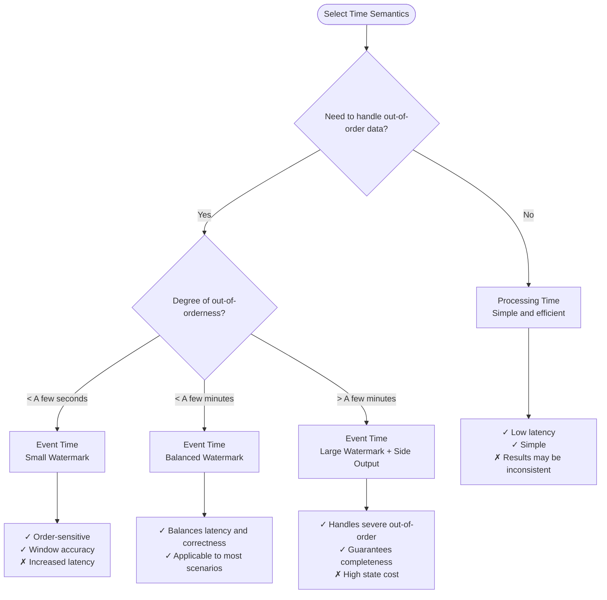
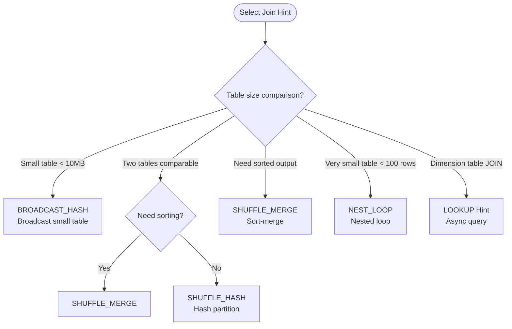
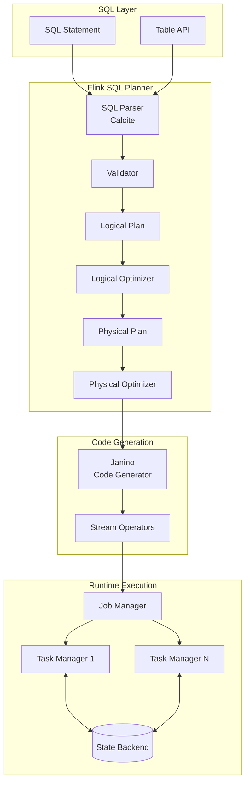
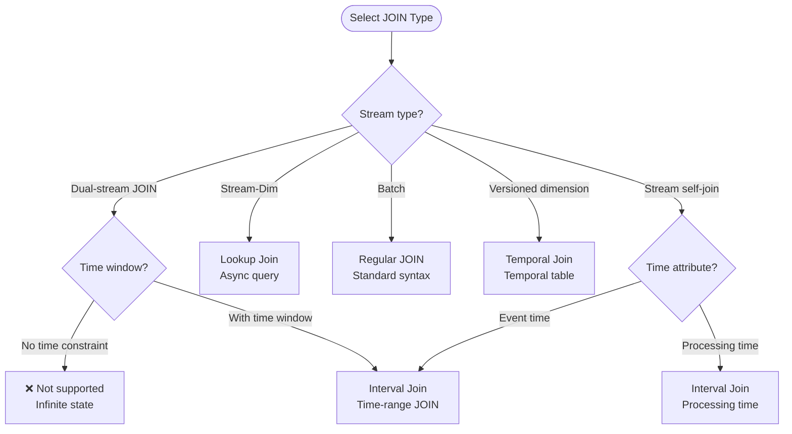
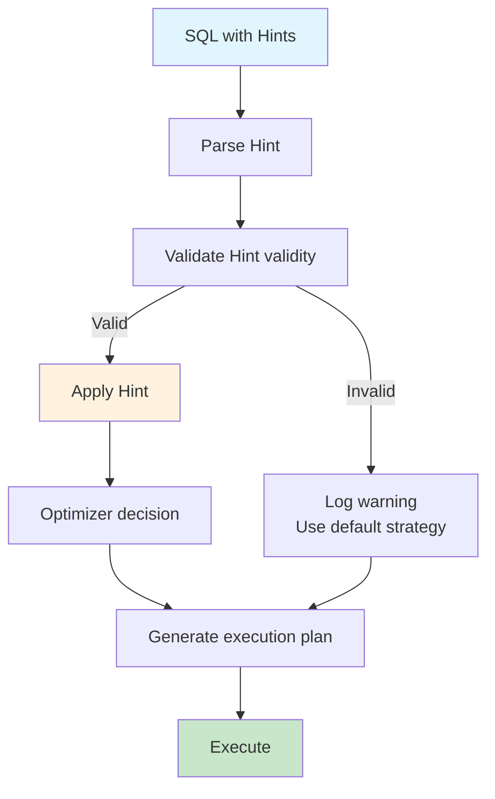
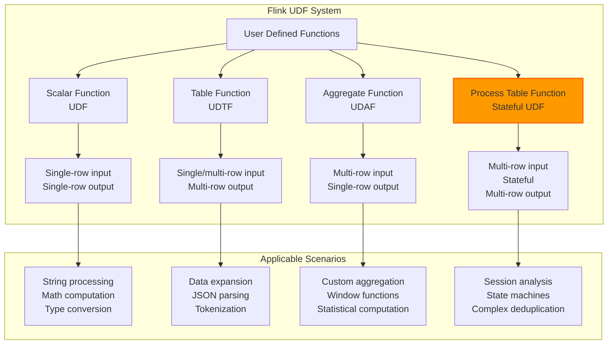
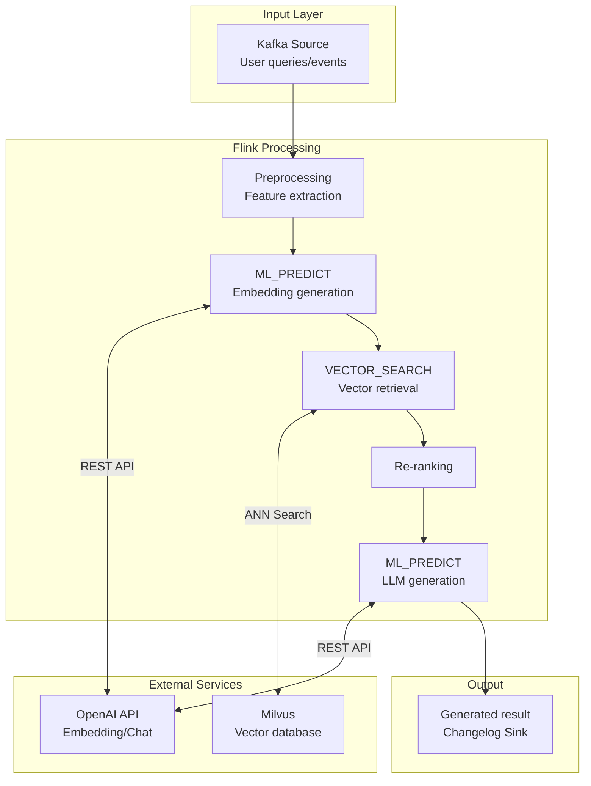
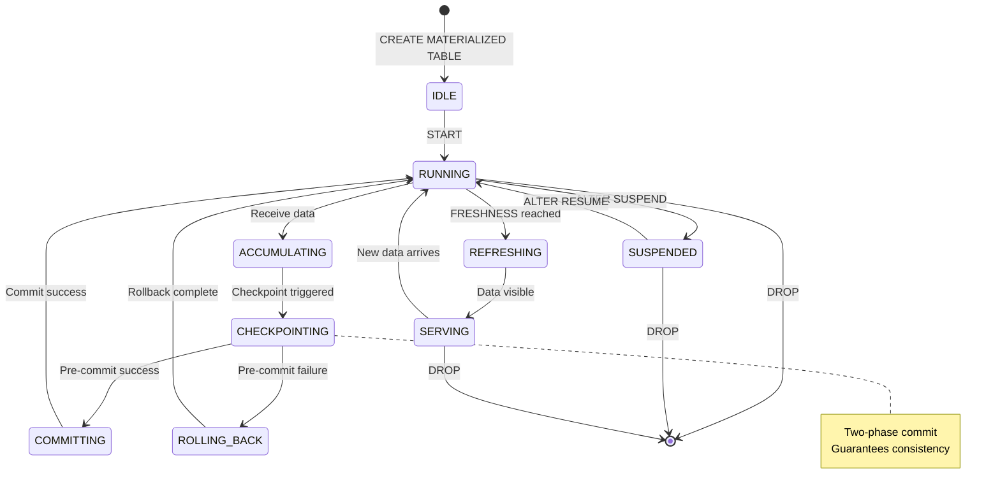

# Flink Table API & SQL Complete Feature Guide

> **Stage**: Flink Stage 3 | **Prerequisites**: [Flink SQL Calcite Optimizer Deep Dive](./flink-sql-calcite-optimizer-deep-dive.md), [Flink SQL Window Functions Deep Guide](./flink-sql-window-functions-deep-dive.md) | **Formalization Level**: L3-L5
>
> **Version**: Flink 1.17-2.2+ | **Status**: Production Ready | **Last Updated**: 2026-04-04

---

## 1. Definitions

### Def-F-03-01: Flink SQL Semantic Model

**Definition**: Flink SQL is a **declarative query language** provided by Apache Flink, based on the ANSI SQL standard with extensions, supporting unified semantics for both stream processing and batch processing.

Formal statement:
$$
\text{Flink SQL} = (\mathcal{D}, \mathcal{Q}, \mathcal{T}, \mathcal{S})
$$

where:

- $\mathcal{D}$: Data Definition Language (DDL) - defines metadata such as tables, views, functions, and models
- $\mathcal{Q}$: Data Query Language (DQL) - SELECT and its clauses
- $\mathcal{T}$: Data Manipulation Language (DML) - INSERT, UPDATE, DELETE
- $\mathcal{S}$: Stream semantics extensions - time attributes, windows, Watermarks, dynamic tables

### Def-F-03-02: Dynamic Table

**Definition**: A dynamic table is a table that changes over time, and is the core abstraction for stream data in Flink SQL.

Formalization:
$$
\text{DynamicTable}: \mathbb{T} \rightarrow \text{Table}
$$

where $\mathbb{T}$ is the time domain, and each time point $t$ corresponds to a snapshot of the table.

**Differences from Static Tables**:

| Feature | Static Table (Batch) | Dynamic Table (Streaming) |
|---------|----------------------|---------------------------|
| **Data Boundary** | Bounded | Unbounded |
| **Result Visibility** | Fully visible when query completes | Continuously updated (Changelog) |
| **Execution Mode** | Pull | Push |
| **Semantic Guarantee** | Snapshot consistency | Event-time consistency |

### Def-F-03-03: Time Attributes

**Def-F-03-03a: Event Time**

$$
\text{EventTime}(e) = t_{\text{event}} \quad \text{(data generation time)}
$$

Declaration:

```sql
CREATE TABLE events (
    event_time TIMESTAMP(3),
    WATERMARK FOR event_time AS event_time - INTERVAL '5' SECOND
)
```

**Def-F-03-03b: Processing Time**

$$
\text{ProcessingTime}(e) = t_{\text{process}} \quad \text{(data arrival time)}
$$

Declaration:

```sql
CREATE TABLE events (
    proc_time AS PROCTIME()
)
```

**Def-F-03-03c: Ingestion Time**

$$
\text{IngestionTime}(e) = t_{\text{ingest}} \quad \text{(data source ingestion time)}
$$

### Def-F-03-04: Continuous Query

**Definition**: A continuous query is a query that executes continuously on a dynamic table, producing continuous updates to the result stream.

Formalization:
$$
\text{ContinuousQuery}: \mathcal{D}(t) \rightarrow \Delta\mathcal{R}(t)
$$

where $\Delta\mathcal{R}(t)$ denotes the result changelog stream.

**Changelog Semantics**:

| Change Type | SQL Symbol | Semantics |
|-------------|------------|-----------|
| `+I` (INSERT) | New row | Add a new record to the result set |
| `-D` (DELETE) | Deleted row | Delete a record from the result set |
| `+U` (UPDATE AFTER) | After update | New value after record update |
| `-U` (UPDATE BEFORE) | Before update | Old value before record update (retract) |

### Def-F-03-05: Flink Table API Abstraction Layers

```
┌─────────────────────────────────────────────────────────────────────┐
│              Flink Table API Abstraction Layers                      │
├─────────────────────────────────────────────────────────────────────┤
│                                                                     │
│   Layer 1: SQL Layer                                                │
│   ├── DDL: CREATE TABLE/VIEW/FUNCTION/MODEL                        │
│   ├── DML: INSERT/UPDATE/DELETE                                    │
│   └── DQL: SELECT/WHERE/GROUP BY/WINDOW/JOIN                       │
│                                                                     │
│   Layer 2: Table API (Java/Scala/Python)                           │
│   ├── Table Environment                                            │
│   ├── Table Operations                                             │
│   └── Expression DSL                                               │
│                                                                     │
│   Layer 3: Relational Algebra                                      │
│   ├── Logical Plan (Calcite RelNode)                               │
│   ├── Optimization Rules                                           │
│   └── Physical Plan                                                │
│                                                                     │
│   Layer 4: DataStream API                                          │
│   ├── Transformations                                              │
│   ├── Operators                                                    │
│   └── State Management                                             │
│                                                                     │
└─────────────────────────────────────────────────────────────────────┘
```

---

## 2. Properties

### Lemma-F-03-01: Time Attribute Transitivity

**Proposition**: If the source table declares an event-time attribute, then after SELECT, FILTER, and PROJECT operations, the time attribute is still retained.

**Proof**:

- SELECT/PROJECT only projects columns without modifying time attribute metadata
- FILTER only filters rows without affecting the time attribute column
- Therefore time attributes are preserved transitively through relational algebra operations ∎

### Prop-F-03-01: Monotonicity of Window Aggregation

**Proposition**: Under event-time semantics, window aggregation results satisfy **monotonicity** — once a window is advanced and closed by the Watermark, the result of that window no longer changes.

Formalization:
$$
\forall w \in \mathcal{W}, \forall t > t_{\text{watermark}} \geq \text{end}(w): \text{Result}(w, t) = \text{Result}(w, t_{\text{watermark}})
$$

### Lemma-F-03-02: JOIN State Requirements

**Proposition**: The state requirement of a dual-stream JOIN is proportional to the window size:

$$
|S|_{\text{join}} = O(\lambda \times \Delta t \times |K|)
$$

where:

- $\lambda$: Event arrival rate
- $\Delta t$: JOIN time window
- $|K|$: Key cardinality

### Prop-F-03-02: Equivalence of Materialized Views and Continuous Queries

**Proposition**: Under Flink semantics, a Materialized Table is equivalent to a continuous query with an `EMIT` policy.

$$
\text{MaterializedTable}(Q, \tau) \equiv \text{ContinuousQuery}(Q) \text{ with } \text{EMIT} \text{ every } \tau
$$

---

## 3. Relations

### 3.1 SQL and Table API Mapping

| SQL Statement | Table API (Java) | Table API (Python) |
|---------------|------------------|--------------------|
| `SELECT a, b FROM t` | `t.select($("a"), $("b"))` | `t.select(col('a'), col('b'))` |
| `WHERE x > 10` | `.filter($("x").isGreater(10))` | `.filter(col('x') > 10)` |
| `GROUP BY a` | `.groupBy($("a"))` | `.group_by(col('a'))` |
| `TUMBLE(ts, INTERVAL '1' HOUR)` | `.window(Tumble.over(lit(1).hours()).on($("ts")).as("w"))` | `.window(Tumble.over(lit(1).hours()).on(col('ts')).alias('w'))` |
| `JOIN` | `.join(other, joinCondition)` | `.join(other, join_condition)` |

### 3.2 Flink SQL vs. Standard SQL

| Feature | ANSI SQL | Flink SQL | Notes |
|---------|----------|-----------|-------|
| **Data Source** | Static tables | Dynamic tables + Connectors | Supports Kafka, CDC, etc. |
| **Time Processing** | System time | Event time / Processing time | WATERMARK declaration |
| **Windows** | None | TUMBLE/HOP/SESSION/CUMULATE | Core stream processing feature |
| **JOIN Types** | Standard JOIN | + Interval/Temporal/Lookup | Stream JOIN extensions |
| **Changelog** | None | `+I/-U/+U/-D` | Stream result update semantics |

### 3.3 Execution Plan Hierarchy

```
SQL/Table API
      ↓
[SQL Parser + Validator] (Calcite)
      ↓
Logical Plan (RelNode Tree)
      ↓
[Logical Optimization] (Predicate Pushdown, Projection Pruning)
      ↓
Physical Plan (Flink Physical RelNode)
      ↓
[Physical Optimization] (Join Reordering, Parallelism)
      ↓
Execution Plan (Operator DAG)
      ↓
[Code Generation] (Janino)
      ↓
Job Graph (Flink Runtime)
```

---

## 4. Argumentation

### 4.1 Stream-Batch Unified Architecture Argument

**Question**: Why can Flink SQL unify stream processing and batch processing?

**Argument**:

1. **Equivalence of bounded streams and batch processing**: Batch processing is a special case of bounded streams
   $$\text{Batch} = \lim_{|\mathcal{D}| < \infty} \text{Streaming}$$

2. **Unified abstraction of dynamic tables**: The view of a dynamic table at a certain moment is a static table

3. **Unified execution engine**: The DataStream API underlying layer supports both bounded and unbounded data

4. **Optimizer adaptation**: The Calcite optimizer automatically selects execution strategies based on source data characteristics

### 4.2 Time Semantics Selection Decision Tree



### 4.3 SQL vs Table API Selection Guide

| Scenario | Recommended | Rationale |
|----------|-------------|-----------|
| Complex business logic | Table API | Type-safe, IDE support, testable |
| Ad-hoc queries / BI | SQL | Declarative, rich tooling ecosystem |
| Dynamic query generation | SQL | Flexible string concatenation |
| Integration with existing systems | SQL | Standard interface, low learning curve |
| Need fine-grained control | Table API | Access to low-level APIs, custom optimization |

---

## 5. Proof / Engineering Argument

### Thm-F-03-01: Semantic Completeness of Continuous Queries on Dynamic Tables

**Theorem**: For any type-conforming continuous query $Q$, Flink SQL guarantees the completeness of its results under event-time semantics.

**Formalization**: Let the Watermark strategy of input stream $S$ be $\mathcal{W}$, then for any window $w$:

$$
\forall e \in S: \text{event\_time}(e) \in w \land \mathcal{W}(t) \geq \text{end}(w) \Rightarrow e \text{ is counted into } w
$$

**Proof Points**:

1. Watermark $\mathcal{W}(t)$ defines the system's knowledge of event-time progress
2. The window trigger condition is $\mathcal{W}(t) \geq \text{end}(w)$
3. Any event with event time less than the window end time has either already arrived or is marked as late
4. Therefore the window result is complete when triggered ∎

### Thm-F-03-02: Exactly-Once Semantic Guarantee

**Theorem**: With Checkpointing enabled, Flink SQL's DML operations (INSERT/UPDATE/DELETE) provide Exactly-Once semantic guarantees.

**Conditions**:

- Source connector supports replay (e.g., Kafka)
- Destination connector supports two-phase commit (2PC) or idempotent writes
- Checkpoint interval is reasonably configured

**Proof**:

1. Checkpoint creates a globally consistent state snapshot
2. Upon failure, recover state from the latest Checkpoint
3. Source replays data from the Checkpoint position
4. Two-phase commit guarantees no duplicate writes at the Sink
5. Therefore end-to-end Exactly-Once holds ∎

### Thm-F-03-03: Optimization Validity of SQL Hints

**Theorem**: Under the premise of accurate statistics, SQL Hints can guide the optimizer to generate an execution plan no worse than the default CBO selection.

**Formalization**: Let $P_{cbo}$ be the plan chosen by CBO, and $P_{hint}$ be the plan specified by the Hint, then:

$$
\text{Cost}(P_{hint}) \leq \text{Cost}(P_{cbo}) \times (1 + \epsilon)
$$

where $\epsilon$ is the deviation coefficient between the Hint and the actual situation.

---

## 6. Examples

### 6.1 DDL - Data Definition Language

#### 6.1.1 CREATE TABLE - Create Table

**Basic Syntax**:

```sql
-- Def-F-03-06: Basic table definition
CREATE TABLE user_events (
    -- Physical columns
    user_id STRING,
    event_type STRING,
    event_time TIMESTAMP(3),

    -- Computed columns (Flink 1.13+)
    event_date AS DATE_FORMAT(event_time, 'yyyy-MM-dd'),
    proc_time AS PROCTIME(),

    -- Watermark definition
    WATERMARK FOR event_time AS event_time - INTERVAL '5' SECOND
) WITH (
    'connector' = 'kafka',
    'topic' = 'user-events',
    'properties.bootstrap.servers' = 'kafka:9092',
    'properties.group.id' = 'flink-sql-consumer',
    'scan.startup.mode' = 'earliest-offset',
    'format' = 'json',
    'json.fail-on-missing-field' = 'false',
    'json.ignore-parse-errors' = 'true'
);
```

**Version Compatibility Matrix**:

| Feature | Min Version | Notes |
|---------|-------------|-------|
| `WATERMARK` | 1.11 | Foundation of event-time processing |
| `AS PROCTIME()` | 1.11 | Processing time column |
| Computed columns | 1.13 | Derived column definition |
| `PRIMARY KEY` | 1.14 | Required for CDC source tables |
| `NOT ENFORCED` | 1.14 | Constraint not enforced |

**Table API Equivalent**:

```java

// [伪代码片段 - 不可直接运行] 仅展示核心逻辑
import org.apache.flink.api.common.typeinfo.Types;

// Java Table API
TableDescriptor sourceDescriptor = TableDescriptor.forConnector("kafka")
    .schema(Schema.newBuilder()
        .column("user_id", DataTypes.STRING())
        .column("event_type", DataTypes.STRING())
        .column("event_time", DataTypes.TIMESTAMP(3))
        .columnByExpression("event_date", "DATE_FORMAT(event_time, 'yyyy-MM-dd')")
        .columnByExpression("proc_time", "PROCTIME()")
        .watermark("event_time", "event_time - INTERVAL '5' SECOND")
        .build())
    .option("topic", "user-events")
    .option("properties.bootstrap.servers", "kafka:9092")
    .option("scan.startup.mode", "earliest-offset")
    .format("json")
    .build();

tableEnv.createTable("user_events", sourceDescriptor);
```

```python
# Python Table API
from pyflink.table import TableDescriptor, Schema, DataTypes
from pyflink.table.expressions import col, lit

source_descriptor = TableDescriptor.for_connector('kafka') \
    .schema(Schema.new_builder()
        .column('user_id', DataTypes.STRING())
        .column('event_type', DataTypes.STRING())
        .column('event_time', DataTypes.TIMESTAMP(3))
        .column_by_expression('event_date', "DATE_FORMAT(event_time, 'yyyy-MM-dd')")
        .column_by_expression('proc_time', 'PROCTIME()')
        .watermark('event_time', "event_time - INTERVAL '5' SECOND")
        .build()) \
    .option('topic', 'user-events') \
    .option('properties.bootstrap.servers', 'kafka:9092') \
    .format('json') \
    .build()

table_env.create_table('user_events', source_descriptor)
```

#### 6.1.2 CREATE TABLE - CDC Source Table

```sql
-- Def-F-03-07: MySQL CDC source table (Flink CDC connector)
CREATE TABLE mysql_users (
    id INT,
    name STRING,
    email STRING,
    updated_at TIMESTAMP(3),

    -- CDC metadata columns
    PRIMARY KEY (id) NOT ENFORCED,
    METADATA FROM 'op_ts' TIMESTAMP(3) METADATA VIRTUAL,  -- Operation timestamp
    METADATA FROM 'op_type' STRING METADATA VIRTUAL       -- Operation type (c/u/d)
) WITH (
    'connector' = 'mysql-cdc',
    'hostname' = 'mysql-host',
    'port' = '3306',
    'username' = 'cdc_user',
    'password' = 'cdc_password',
    'database-name' = 'mydb',
    'table-name' = 'users',
    'server-time-zone' = 'Asia/Shanghai',
    'debezium.snapshot.mode' = 'initial'
);
```

#### 6.1.3 CREATE DATABASE - Create Database

```sql
-- Create database (Catalog)
CREATE DATABASE IF NOT EXISTS analytics;

-- Database with properties
CREATE DATABASE analytics
WITH (
    'default.parallelism' = '4',
    'pipeline.name' = 'analytics-pipeline'
);

-- Switch database
USE analytics;
```

#### 6.1.4 CREATE VIEW - Create View

```sql
-- Def-F-03-08: Create temporary view
CREATE TEMPORARY VIEW hourly_user_stats AS
SELECT
    user_id,
    TUMBLE_START(event_time, INTERVAL '1' HOUR) AS window_start,
    TUMBLE_END(event_time, INTERVAL '1' HOUR) AS window_end,
    COUNT(*) AS event_count,
    COUNT(DISTINCT event_type) AS unique_events
FROM user_events
GROUP BY
    user_id,
    TUMBLE(event_time, INTERVAL '1' HOUR);

-- Create permanent view
CREATE VIEW analytics.daily_active_users AS
SELECT
    DATE_FORMAT(event_time, 'yyyy-MM-dd') AS event_date,
    COUNT(DISTINCT user_id) AS dau
FROM user_events
GROUP BY DATE_FORMAT(event_time, 'yyyy-MM-dd');
```

#### 6.1.5 CREATE FUNCTION - Create Function

```sql
-- Create temporary system function
CREATE TEMPORARY SYSTEM FUNCTION IF NOT EXISTS
    ParseUserAgent AS 'com.example.udf.ParseUserAgentFunction';

-- Create catalog function (permanent)
CREATE FUNCTION analytics.parse_json_path
    AS 'com.example.udf.JsonPathFunction'
    USING JAR 'hdfs:///udfs/json-udf.jar';
```

#### 6.1.6 ~~CREATE MODEL~~ - Create ML Model (Conceptual, Not Yet Supported)

```sql
<!-- The following syntax is conceptual design; actual Flink versions do not yet support it -->
~~CREATE MODEL~~ (Possible future syntax)

```sql
-- Def-F-03-09: Create AI model (conceptual design phase, informal syntax)
-- CREATE MODEL sentiment_analyzer
-- WITH (
--     'provider' = 'openai',
--     'openai.model' = 'gpt-4o-mini',
--     'openai.api_key' = '${OPENAI_API_KEY}',
--     'openai.temperature' = '0.1',
--     'openai.timeout' = '30s'
-- )
-- INPUT (text STRING)
-- OUTPUT (sentiment STRING, confidence DOUBLE, reasoning STRING);
```

```

#### 6.1.7 CREATE MATERIALIZED TABLE - Create Materialized Table

```sql
-- Def-F-03-10: Create materialized table (Flink 2.2+)
CREATE MATERIALIZED TABLE user_behavior_summary
DISTRIBUTED BY HASH(user_id) INTO 16 BUCKETS
FRESHNESS = INTERVAL '5' MINUTE
AS SELECT
    user_id,
    COUNT(*) AS event_count,
    SUM(CASE WHEN event_type = 'purchase' THEN amount ELSE 0 END) AS total_spend
FROM user_events
GROUP BY user_id;
```

### 6.2 DML - Data Manipulation Language

#### 6.2.1 INSERT - Data Insertion

**Basic INSERT**:

```sql
-- Single-row insert (batch mode)
INSERT INTO orders VALUES
    ('order_001', 'user_001', 100.00, TIMESTAMP '2024-01-15 10:00:00');

-- Query insert (streaming/batch)
INSERT INTO order_summary
SELECT
    user_id,
    COUNT(*) AS order_count,
    SUM(amount) AS total_amount
FROM orders
GROUP BY user_id;
```

**Partitioned INSERT**:

```sql
-- Dynamic partition insert
INSERT INTO sales_partitioned
PARTITION (dt, hour)
SELECT
    order_id, user_id, amount,
    DATE_FORMAT(event_time, 'yyyy-MM-dd') AS dt,
    DATE_FORMAT(event_time, 'HH') AS hour
FROM orders;
```

**Overwrite INSERT**:

```sql
-- INSERT OVERWRITE (batch)
INSERT OVERWRITE user_daily_stats
SELECT
    DATE_FORMAT(event_time, 'yyyy-MM-dd') AS stat_date,
    COUNT(DISTINCT user_id) AS dau
FROM events
GROUP BY DATE_FORMAT(event_time, 'yyyy-MM-dd');
```

**Table API Equivalent**:

```java
// [伪代码片段 - 不可直接运行] 仅展示核心逻辑
// Java Table API
Table result = tableEnv.from("orders")
    .groupBy($("user_id"))
    .select(
        $("user_id"),
        $("order_id").count().as("order_count"),
        $("amount").sum().as("total_amount")
    );

// Execute insert
result.executeInsert("order_summary");
```

```python
# Python Table API
from pyflink.table.expressions import col

result = table_env.from_path('orders') \
    .group_by(col('user_id')) \
    .select(
        col('user_id'),
        col('order_id').count.alias('order_count'),
        col('amount').sum.alias('total_amount')
    )

# Execute insert
result.execute_insert('order_summary')
```

#### 6.2.2 UPDATE - Data Update

```sql
-- UPDATE in batch mode (only applicable to Lookup tables)
UPDATE user_profiles
SET last_login = CURRENT_TIMESTAMP,
    login_count = login_count + 1
WHERE user_id = 'user_001';

-- Update semantics in streaming are implemented via Changelog
-- Practical usage: insert updates as new records into target table
INSERT INTO user_profiles_changelog
SELECT
    user_id,
    CURRENT_TIMESTAMP AS last_login,
    login_count + 1 AS login_count
FROM user_login_events;
```

**Version Compatibility**:

- UPDATE statements are only supported in batch mode or on Lookup tables
- Streaming scenarios use Changelog streams to implement update semantics

#### 6.2.3 DELETE - Data Deletion

```sql
-- DELETE in batch mode
DELETE FROM temp_logs
WHERE log_time < CURRENT_DATE - INTERVAL '7' DAY;

-- Delete semantics in streaming
-- Implemented by emitting -D changelog records
INSERT INTO target_table
SELECT
    user_id,
    event_time,
    'DELETE' AS _op_type
FROM deletion_events;
```

### 6.3 DQL - Data Query Language

#### 6.3.1 Basic Queries (SELECT / WHERE)

```sql
-- Def-F-03-11: Basic query
SELECT
    user_id,
    event_type,
    event_time,
    event_date
FROM user_events
WHERE event_type IN ('click', 'purchase')
  AND event_time >= CURRENT_TIMESTAMP - INTERVAL '1' DAY
  AND user_id IS NOT NULL;

-- Supported pattern matching
SELECT * FROM users WHERE name LIKE 'John%';
SELECT * FROM users WHERE email REGEXP '^[a-z]+@[a-z]+\.com$';
```

**Table API Equivalent**:

```java
// [伪代码片段 - 不可直接运行] 仅展示核心逻辑
// Java
Table result = tableEnv.from("user_events")
    .select($("user_id"), $("event_type"), $("event_time"), $("event_date"))
    .where($("event_type").in("click", "purchase"))
    .where($("event_time").isGreaterOrEqual(
        currentTimestamp().minus(lit(1).days())
    ));
```

```python
# Python
from pyflink.table.expressions import col, lit

result = table_env.from_path('user_events') \
    .select(col('user_id'), col('event_type'), col('event_time')) \
    .filter(col('event_type').isin('click', 'purchase')) \
    .filter(col('event_time') >= lit('2024-01-01').to_timestamp)
```

#### 6.3.2 Aggregate Queries (GROUP BY / HAVING)

```sql
-- Basic aggregation
SELECT
    DATE_FORMAT(event_time, 'yyyy-MM-dd') AS event_date,
    event_type,
    COUNT(*) AS event_count,
    COUNT(DISTINCT user_id) AS unique_users,
    SUM(amount) AS total_amount,
    AVG(amount) AS avg_amount,
    MAX(amount) AS max_amount,
    MIN(amount) AS min_amount,
    PERCENTILE_CONT(0.95) WITHIN GROUP (ORDER BY amount) AS p95_amount
FROM user_events
WHERE event_time >= CURRENT_TIMESTAMP - INTERVAL '7' DAY
GROUP BY
    DATE_FORMAT(event_time, 'yyyy-MM-dd'),
    event_type
HAVING COUNT(*) > 100
ORDER BY event_date DESC, event_count DESC;
```

**Execution Plan Analysis**:

```sql
EXPLAIN PLAN FOR
SELECT event_type, COUNT(*)
FROM user_events
GROUP BY event_type;
```

Typical output:

```
== Optimized Physical Plan ==
GroupAggregate(groupBy=[event_type], select=[event_type, COUNT(*)])
+- Exchange(distribution=[hash[event_type]])
   +- TableSourceScan(table=[[user_events]], fields=[event_type])
```

#### 6.3.3 Sorting and Limiting (ORDER BY / LIMIT / OFFSET)

```sql
-- Basic sorting and limiting
SELECT * FROM orders
ORDER BY amount DESC
LIMIT 100;

-- Pagination query (batch)
SELECT * FROM orders
ORDER BY order_time DESC
LIMIT 10 OFFSET 20;

-- Top-N in streaming
SELECT *
FROM (
    SELECT
        user_id,
        amount,
        ROW_NUMBER() OVER (ORDER BY amount DESC) AS rn
    FROM orders
)
WHERE rn <= 10;
```

#### 6.3.4 TOP-N Queries

```sql
-- Def-F-03-12: Streaming Top-N (results continuously updated)
SELECT *
FROM (
    SELECT
        category,
        product_id,
        sales_amount,
        ROW_NUMBER() OVER (
            PARTITION BY category
            ORDER BY sales_amount DESC
        ) AS rn
    FROM product_sales
)
WHERE rn <= 3;

-- Windowed Top-N (Flink 1.18+)
SELECT *
FROM (
    SELECT
        category,
        product_id,
        SUM(sales) AS total_sales,
        window_start,
        window_end,
        ROW_NUMBER() OVER (
            PARTITION BY category, window_start, window_end
            ORDER BY SUM(sales) DESC
        ) AS rn
    FROM TABLE(TUMBLE(TABLE product_sales, DESCRIPTOR(sale_time), INTERVAL '1' HOUR))
    GROUP BY category, product_id, window_start, window_end
)
WHERE rn <= 5;
```

**Execution Plan Analysis**:

```
Rank(strategy=[RetractStrategy], rankType=[ROW_NUMBER],
     partitionBy=[category], orderBy=[sales_amount DESC],
     outputRowNumber=[true])
+- Exchange(distribution=[hash[category]])
   +- Calc(select=[category, product_id, sales_amount])
      +- TableSourceScan(table=[[product_sales]])
```

**Table API Equivalent**:

```java
// [伪代码片段 - 不可直接运行] 仅展示核心逻辑
// Java Table API
Table topN = tableEnv.from("product_sales")
    .window(Tumble.over(lit(1).hours()).on($("sale_time")).as("w"))
    .groupBy($("category"), $("product_id"), $("w"))
    .select(
        $("category"),
        $("product_id"),
        $("sales").sum().as("total_sales"),
        $("w").start().as("window_start"),
        $("w").end().as("window_end")
    )
    .addColumns(
        rowNumber().over(
            PartitionBy($("category"), $("window_start"), $("window_end"))
                .orderBy($("total_sales").desc())
        ).as("rn")
    )
    .where($("rn").isLessOrEqual(5));
```

#### 6.3.5 Deduplication Queries

```sql
-- Approach 1: ROW_NUMBER deduplication (keep first row)
SELECT event_id, event_time, payload
FROM (
    SELECT
        *,
        ROW_NUMBER() OVER (
            PARTITION BY event_id
            ORDER BY event_time ASC
        ) AS rn
    FROM events
)
WHERE rn = 1;

-- Approach 2: Deduplication keep last row
SELECT event_id, event_time, payload
FROM (
    SELECT
        *,
        ROW_NUMBER() OVER (
            PARTITION BY event_id
            ORDER BY event_time DESC
        ) AS rn
    FROM events
)
WHERE rn = 1;
```

### 6.4 Window Functions

#### 6.4.1 Window TVF Syntax

**Def-F-03-13: Four Window Types**

| Window Type | SQL Syntax | Output Characteristics | State Cost | Applicable Scenario |
|-------------|------------|------------------------|------------|---------------------|
| TUMBLE | `TUMBLE(TABLE t, DESCRIPTOR(ts), INTERVAL '1' HOUR)` | Non-overlapping, equal size | Low | Fixed-time reports |
| HOP | `HOP(TABLE t, DESCRIPTOR(ts), INTERVAL '5' MINUTE, INTERVAL '1' HOUR)` | May overlap | Medium | Moving average monitoring |
| SESSION | `SESSION(TABLE t PARTITION BY key, DESCRIPTOR(ts), INTERVAL '10' MINUTE)` | Dynamic size | High | User behavior sessions |
| CUMULATE | `CUMULATE(TABLE t, DESCRIPTOR(ts), INTERVAL '10' MINUTE, INTERVAL '1' HOUR)` | Cumulative expansion | Medium | Real-time dashboard display |

#### 6.4.2 TUMBLE Window

```sql
-- Tumbling window: hourly statistics
SELECT
    user_id,
    window_start,
    window_end,
    COUNT(*) AS event_count,
    SUM(amount) AS total_amount
FROM TABLE(
    TUMBLE(TABLE user_events, DESCRIPTOR(event_time), INTERVAL '1' HOUR)
)
GROUP BY user_id, window_start, window_end;
```

#### 6.4.3 HOP Window

```sql
-- Hopping window: average response time in last 5 minutes (updated every minute)
SELECT
    url,
    window_start,
    window_end,
    AVG(response_time) AS avg_response_time,
    PERCENTILE_CONT(0.99) WITHIN GROUP (ORDER BY response_time) AS p99
FROM TABLE(
    HOP(TABLE access_logs, DESCRIPTOR(log_time), INTERVAL '1' MINUTE, INTERVAL '5' MINUTE)
)
GROUP BY url, window_start, window_end;
```

#### 6.4.4 SESSION Window

```sql
-- Session window: user session analysis
SELECT
    user_id,
    SESSION_START(event_time, INTERVAL '30' MINUTE) AS session_start,
    SESSION_END(event_time, INTERVAL '30' MINUTE) AS session_end,
    COUNT(*) AS event_count,
    COLLECT(DISTINCT page_url) AS visited_pages
FROM TABLE(
    SESSION(TABLE user_events PARTITION BY user_id, DESCRIPTOR(event_time), INTERVAL '30' MINUTE)
)
GROUP BY user_id, SESSION_START(event_time, INTERVAL '30' MINUTE), SESSION_END(event_time, INTERVAL '30' MINUTE);
```

#### 6.4.5 CUMULATE Window

```sql
-- Cumulate window: cumulative sales today (updated every 10 minutes)
SELECT
    window_start,
    window_end,
    SUM(amount) AS cumulative_sales,
    COUNT(*) AS order_count
FROM TABLE(
    CUMULATE(TABLE orders, DESCRIPTOR(order_time), INTERVAL '10' MINUTE, INTERVAL '1' DAY)
)
GROUP BY window_start, window_end;
```

#### 6.4.6 INTERVAL Window (Flink 1.17+)

```sql
-- INTERVAL-based flexible window
SELECT
    user_id,
    window_time,
    COUNT(*) AS event_count
FROM TABLE(
    CUMULATE(
        TABLE user_events,
        DESCRIPTOR(event_time),
        INTERVAL '10' MINUTE,  -- Step size
        INTERVAL '1' HOUR      -- Max window
    )
)
GROUP BY user_id, window_start, window_end, window_time;
```

**Table API Equivalent**:

```java
// [伪代码片段 - 不可直接运行] 仅展示核心逻辑
// Java Table API
Table windowed = tableEnv.from("user_events")
    .window(Tumble.over(lit(1).hours()).on($("event_time")).as("w"))
    .groupBy($("user_id"), $("w"))
    .select(
        $("user_id"),
        $("w").start().as("window_start"),
        $("w").end().as("window_end"),
        $("event_type").count().as("event_count")
    );
```

```python
# Python Table API
from pyflink.table.window import Tumble
from pyflink.table.expressions import lit, col

windowed = table_env.from_path('user_events') \
    .window(Tumble.over(lit(1).hours).on(col('event_time')).alias('w')) \
    .group_by(col('user_id'), col('w')) \
    .select(
        col('user_id'),
        col('w').start.alias('window_start'),
        col('w').end.alias('window_end'),
        col('event_type').count.alias('event_count')
    )
```

### 6.5 JOIN Types

#### 6.5.1 Regular JOIN

```sql
-- Def-F-03-14: INNER JOIN
SELECT
    o.order_id,
    o.user_id,
    u.user_name
FROM orders o
INNER JOIN users u ON o.user_id = u.user_id;

-- LEFT JOIN
SELECT
    o.order_id,
    o.user_id,
    u.user_name  -- may be NULL
FROM orders o
LEFT JOIN users u ON o.user_id = u.user_id;

-- FULL OUTER JOIN
SELECT
    COALESCE(o.user_id, u.user_id) AS user_id,
    o.order_count,
    u.registration_date
FROM (
    SELECT user_id, COUNT(*) AS order_count FROM orders GROUP BY user_id
) o
FULL OUTER JOIN users u ON o.user_id = u.user_id;
```

#### 6.5.2 Interval Join

```sql
-- Interval Join: correlate orders and payments within time window
SELECT
    o.order_id,
    o.user_id,
    o.amount AS order_amount,
    p.amount AS pay_amount,
    p.pay_time
FROM orders o
JOIN payments p
    ON o.order_id = p.order_id
    AND p.pay_time BETWEEN o.order_time - INTERVAL '5' MINUTE
                       AND o.order_time + INTERVAL '1' HOUR;
```

#### 6.5.3 Temporal Join (Temporal Table JOIN)

```sql
-- Versioned dimension table (temporal table)
CREATE TABLE exchange_rates (
    currency STRING,
    rate DECIMAL(10, 4),
    update_time TIMESTAMP(3),
    WATERMARK FOR update_time AS update_time - INTERVAL '5' SECOND,
    PRIMARY KEY (currency) NOT ENFORCED
) WITH (
    'connector' = 'kafka',
    'topic' = 'exchange-rates',
    'format' = 'debezium-json'
);

-- Temporal Join: get exchange rate at order time
SELECT
    o.order_id,
    o.currency,
    o.amount,
    e.rate,
    o.amount * e.rate AS amount_usd
FROM orders o
LEFT JOIN exchange_rates FOR SYSTEM_TIME AS OF o.order_time e
    ON o.currency = e.currency;
```

**Table API Equivalent**:

```java
// [伪代码片段 - 不可直接运行] 仅展示核心逻辑
// Java Table API
Table result = tableEnv.from("orders")
    .join(
        tableEnv.from("exchange_rates"),
        JoinHint.of(JoinHint.JoinType.LEFT_OUTER, List.of("currency")),
        $("currency").isEqual($("currency"))
            .and($("update_time").isLessOrEqual($("order_time")))
    )
    .select(
        $("order_id"),
        $("currency"),
        $("amount"),
        $("rate"),
        $("amount").times($("rate")).as("amount_usd")
    );
```

#### 6.5.4 Lookup Join

```sql
-- Lookup Join: real-time query Redis/MySQL dimension table
CREATE TABLE user_profiles (
    user_id STRING,
    age INT,
    city STRING,
    gender STRING,
    PRIMARY KEY (user_id) NOT ENFORCED
) WITH (
    'connector' = 'jdbc',
    'url' = 'jdbc:mysql://mysql:3306/dim',
    'table-name' = 'user_profiles',
    'lookup.cache.max-rows' = '10000',
    'lookup.cache.ttl' = '10 min',
    'lookup.max-retries' = '3'
);

-- Stream table JOIN dimension table
SELECT
    e.user_id,
    e.event_type,
    p.age,
    p.city,
    p.gender
FROM user_events e
LEFT JOIN user_profiles FOR SYSTEM_TIME AS OF e.proc_time p
    ON e.user_id = p.user_id;
```

**Version Compatibility**:

| Feature | Min Version | Notes |
|---------|-------------|-------|
| Regular JOIN | 1.11 | Dual-stream / batch JOIN |
| Interval JOIN | 1.12 | JOIN with time window |
| Temporal JOIN | 1.12 | Temporal table JOIN |
| Lookup JOIN | 1.12 | Async dimension table query |
| Join Hints | 1.12 | BROADCAST_HASH, etc. |


### 6.6 Aggregate Functions

#### 6.6.1 Built-in Aggregate Functions

| Function | Description | Version |
|----------|-------------|---------|
| `COUNT(*)` | Count | 1.0+ |
| `COUNT(DISTINCT col)` | Distinct count | 1.11+ |
| `SUM(col)` | Sum | 1.0+ |
| `AVG(col)` | Average | 1.0+ |
| `MAX(col)` | Maximum | 1.0+ |
| `MIN(col)` | Minimum | 1.0+ |
| `STDDEV_POP(col)` | Population standard deviation | 1.14+ |
| `STDDEV_SAMP(col)` | Sample standard deviation | 1.14+ |
| `VAR_POP(col)` | Population variance | 1.14+ |
| `VAR_SAMP(col)` | Sample variance | 1.14+ |
| `COLLECT(col)` | Collect as array | 1.13+ |
| `COLLECT_SET(col)` | Collect as distinct array | 1.15+ |
| `STRING_AGG(col, delimiter)` | String concatenation | 1.13+ |
| `JSON_ARRAYAGG(col)` | JSON array aggregation | 1.17+ |
| `JSON_OBJECTAGG(key, value)` | JSON object aggregation | 1.17+ |
| `PERCENTILE_CONT(fraction)` | Percentile | 1.15+ |

```sql
-- Comprehensive aggregation example
SELECT
    category,
    COUNT(*) AS total_orders,
    COUNT(DISTINCT user_id) AS unique_buyers,
    SUM(amount) AS total_revenue,
    AVG(amount) AS avg_order_value,
    PERCENTILE_CONT(0.5) WITHIN GROUP (ORDER BY amount) AS median_amount,
    PERCENTILE_CONT(0.95) WITHIN GROUP (ORDER BY amount) AS p95_amount,
    STDDEV_SAMP(amount) AS amount_stddev,
    MIN(order_time) AS first_order,
    MAX(order_time) AS last_order,
    COLLECT_SET(user_id) AS buyer_set,
    STRING_AGG(DISTINCT product_id, ',') AS product_list
FROM orders
GROUP BY category;
```

#### 6.6.2 Windowed Aggregation

```sql
-- Window aggregation + ranking function
SELECT
    user_id,
    window_start,
    window_end,
    event_count,
    ROW_NUMBER() OVER (
        PARTITION BY window_start, window_end
        ORDER BY event_count DESC
    ) AS rank
FROM (
    SELECT
        user_id,
        window_start,
        window_end,
        COUNT(*) AS event_count
    FROM TABLE(
        TUMBLE(TABLE user_events, DESCRIPTOR(event_time), INTERVAL '1' HOUR)
    )
    GROUP BY user_id, window_start, window_end
);
```

#### 6.6.3 Custom UDAF (User-Defined Aggregate Function)

**Java Implementation**:

```java
import org.apache.flink.table.functions.AggregateFunction;

import org.apache.flink.api.common.functions.AggregateFunction;


/**
 * Def-F-03-15: Custom weighted average UDAF
 */
public class WeightedAvg extends AggregateFunction<Double, WeightedAvg.WeightedAvgAccumulator> {

    // Accumulator definition
    public static class WeightedAvgAccumulator {
        public double sum = 0;
        public int count = 0;
    }

    @Override
    public WeightedAvgAccumulator createAccumulator() {
        return new WeightedAvgAccumulator();
    }

    public void accumulate(WeightedAvgAccumulator acc, Double value, Integer weight) {
        acc.sum += value * weight;
        acc.count += weight;
    }

    public void retract(WeightedAvgAccumulator acc, Double value, Integer weight) {
        acc.sum -= value * weight;
        acc.count -= weight;
    }

    public void merge(WeightedAvgAccumulator acc, Iterable<WeightedAvgAccumulator> others) {
        for (WeightedAvgAccumulator other : others) {
            acc.sum += other.sum;
            acc.count += other.count;
        }
    }

    @Override
    public Double getValue(WeightedAvgAccumulator acc) {
        if (acc.count == 0) {
            return null;
        }
        return acc.sum / acc.count;
    }

    public void resetAccumulator(WeightedAvgAccumulator acc) {
        acc.sum = 0;
        acc.count = 0;
    }
}
```

**Registration and Usage**:

```sql
-- Register UDAF
CREATE TEMPORARY SYSTEM FUNCTION IF NOT EXISTS WeightedAvg
    AS 'com.example.udaf.WeightedAvg';

-- Use UDAF
SELECT
    category,
    WeightedAvg(price, quantity) AS weighted_avg_price
FROM products
GROUP BY category;
```

**Python UDAF (Flink 1.14+)**:

```python
from pyflink.table import AggregateFunction, DataTypes
from pyflink.table.udf import udaf

class WeightedAvg(AggregateFunction):
    def create_accumulator(self):
        return (0, 0)  # (sum, count)

    def accumulate(self, accumulator, value, weight):
        return (accumulator[0] + value * weight, accumulator[1] + weight)

    def get_value(self, accumulator):
        if accumulator[1] == 0:
            return None
        return accumulator[0] / accumulator[1]

# Register UDAF
weighted_avg = udaf(WeightedAvg(),
                    result_type=DataTypes.DOUBLE(),
                    func_type='pandas')  # pandas UDAF has better performance

table_env.create_temporary_function("WeightedAvg", weighted_avg)
```

### 6.7 Pattern Matching (MATCH_RECOGNIZE)

**Def-F-03-16: Pattern Matching Syntax**

```sql
-- Detect price crash pattern (3 consecutive drops)
SELECT
    T.symbol,
    T.first_price,
    T.last_price,
    T.price_drop_ratio
FROM stock_prices
MATCH_RECOGNIZE (
    PARTITION BY symbol
    ORDER BY rowtime
    MEASURES
        A.price AS first_price,
        LAST(D.price) AS last_price,
        (LAST(D.price) - A.price) / A.price AS price_drop_ratio,
        FIRST(rowtime) AS start_time,
        LAST(rowtime) AS end_time
    ONE ROW PER MATCH
    AFTER MATCH SKIP TO LAST D
    PATTERN (A B C D)
    DEFINE
        A AS TRUE,
        B AS B.price < A.price,
        C AS C.price < B.price,
        D AS D.price < C.price
) T;
```

**Complex Pattern Example - Fraud Detection**:

```sql
-- Detect anomalous login pattern: rapid multi-location logins
SELECT
    user_id,
    start_time,
    end_time,
    location_count,
    login_count
FROM login_events
MATCH_RECOGNIZE (
    PARTITION BY user_id
    ORDER BY login_time
    MEASURES
        FIRST(login_time) AS start_time,
        LAST(login_time) AS end_time,
        COUNT(DISTINCT location) AS location_count,
        COUNT(*) AS login_count
    ONE ROW PER MATCH
    AFTER MATCH SKIP PAST LAST ROW
    PATTERN (A{3,}) WITHIN INTERVAL '10' MINUTE
    DEFINE
        A AS TRUE
) T
WHERE location_count >= 3;
```

**Pattern Quantifiers**:

| Quantifier | Meaning |
|------------|---------|
| `*` | 0 or more times |
| `+` | 1 or more times |
| `?` | 0 or 1 time |
| `{n}` | Exactly n times |
| `{n,}` | At least n times |
| `{n,m}` | n to m times |

**Version Compatibility**:

- MATCH_RECOGNIZE: Flink 1.13+
- AFTER MATCH SKIP clause: Flink 1.15+
- WITHIN time constraint: Flink 1.16+

**Table API Equivalent**:

```java
// [伪代码片段 - 不可直接运行] 仅展示核心逻辑
// Java Table API (Flink 1.17+)
Pattern<Row, Row> pattern = Pattern.<Row>begin("A")
    .next("B").where(new SimpleCondition<Row>() {
        @Override
        public boolean filter(Row row) {
            return row.<Double>getField("price") <
                   ctx.getPartialMatch().get("A").<Double>getField("price");
        }
    })
    .next("C").where(...)
    .next("D").where(...);

// Use CEP library
PatternStream<Row> patternStream = CEP.pattern(stream, pattern);
```

### 6.8 UDF/UDTF/UDAF Development

#### 6.8.1 Scalar Function (Scalar UDF)

**Java Implementation**:

```java
import org.apache.flink.table.functions.ScalarFunction;

import org.apache.flink.api.common.typeinfo.Types;


/**
 * Def-F-03-17: Scalar UDF - parse User-Agent
 */
public class ParseUserAgent extends ScalarFunction {

    private transient UserAgentAnalyzer uaa;

    @Override
    public void open(FunctionContext context) {
        uaa = UserAgentAnalyzer.newBuilder()
            .withCache(10000)
            .build();
    }

    public Row eval(String userAgent) {
        if (userAgent == null) {
            return Row.of(null, null, null);
        }

        ReadableUserAgent agent = uaa.parse(userAgent);
        return Row.of(
            agent.getDeviceCategory().getName(),
            agent.getOperatingSystem().getName(),
            agent.getUserAgent().getName()
        );
    }

    @Override
    public TypeInference getTypeInference(TypeInferenceFactory typeFactory) {
        return TypeInference.newBuilder()
            .outputTypeStrategy(
                ExplicitTypeStrategy.explicit(
                    DataTypes.ROW(
                        DataTypes.FIELD("device", DataTypes.STRING()),
                        DataTypes.FIELD("os", DataTypes.STRING()),
                        DataTypes.FIELD("browser", DataTypes.STRING())
                    )
                )
            )
            .build();
    }
}
```

**SQL Registration and Usage**:

```sql
-- Register UDF
CREATE TEMPORARY SYSTEM FUNCTION IF NOT EXISTS ParseUserAgent
    AS 'com.example.udf.ParseUserAgent';

-- Use UDF
SELECT
    user_id,
    ParseUserAgent(user_agent) AS ua_info,
    ua_info.device,
    ua_info.os,
    ua_info.browser
FROM access_logs;
```

#### 6.8.2 Table-Valued Function (TVF / UDTF)

**Java Implementation**:

```java
import org.apache.flink.table.functions.TableFunction;

/**
 * Def-F-03-18: Table-valued UDF - explode JSON array
 */
@FunctionHint(output = @DataTypeHint("ROW<element STRING, index INT>"))
public class JsonArrayExplode extends TableFunction<Row> {

    public void eval(String jsonArray) {
        if (jsonArray == null || jsonArray.isEmpty()) {
            return;
        }

        try {
            JSONArray array = JSON.parseArray(jsonArray);
            for (int i = 0; i < array.size(); i++) {
                collect(Row.of(array.getString(i), i));
            }
        } catch (Exception e) {
            // Can log or ignore
        }
    }
}
```

**SQL Usage**:

```sql
-- Register TVF
CREATE TEMPORARY SYSTEM FUNCTION IF NOT EXISTS JsonArrayExplode
    AS 'com.example.udtf.JsonArrayExplode';

-- Use TVF (LATERAL TABLE)
SELECT
    o.order_id,
    o.user_id,
    element AS product_id,
    index AS product_index
FROM orders o,
LATERAL TABLE(JsonArrayExplode(o.product_ids)) AS t(element, index);
```

#### 6.8.3 Python UDF

```text
from pyflink.table import ScalarFunction, DataTypes
from pyflink.table.udf import udf

# Approach 1: decorator
@udf(result_type=DataTypes.STRING())
def normalize_url(url: str) -> str:
    """Normalize URL"""
    if url is None:
        return None
    return url.lower().strip().rstrip('/')

# Approach 2: class implementation
class NormalizeUrl(ScalarFunction):
    def eval(self, url):
        if url is None:
            return None
        return url.lower().strip().rstrip('/')

normalize_url_udf = udf(NormalizeUrl(), result_type=DataTypes.STRING())

# Register
 table_env.create_temporary_function("normalize_url", normalize_url_udf)

# Use
 table_env.sql_query("""
     SELECT normalize_url(url) AS normalized_url, COUNT(*)
     FROM events
     GROUP BY normalize_url(url)
 """)
```

### 6.9 SQL Hints Optimization

**Def-F-03-19: Hint Classification**

| Hint Type | Syntax | Applicable Scenario | Version |
|-----------|--------|---------------------|---------|
| Join Hints | `BROADCAST_HASH`, `SHUFFLE_HASH`, `SHUFFLE_MERGE`, `NEST_LOOP` | JOIN strategy | 1.12+ |
| Lookup Hints | `LOOKUP('RETRY'='...')` | Dimension table query | 1.14+ |
| State Hints | `STATE_TTL('t1'='1h')` | State retention | 1.17+ |
| Aggregate Hints | `MINIBATCH` | Aggregation optimization | 1.12+ |

```sql
-- Broadcast Hash Join Hint
SELECT /*+ BROADCAST_HASH(u) */
    o.order_id,
    o.amount,
    u.user_name
FROM orders o
JOIN users u ON o.user_id = u.user_id;

-- Shuffle Hash Join
SELECT /*+ SHUFFLE_HASH(o) */
    o.*, p.payment_status
FROM orders o
JOIN payments p ON o.order_id = p.order_id;

-- Lookup Join with Retry
SELECT /*+ LOOKUP('RETRY'='FIXED_DELAY',
                   'FIXED_DELAY'='100ms',
                   'MAX_RETRY'='3') */
    e.*, d.department_name
FROM employees e
LEFT JOIN departments FOR SYSTEM_TIME AS OF e.proc_time AS d
    ON e.dept_id = d.dept_id;

-- State TTL Hint
SELECT /*+ STATE_TTL('o'='24h', 's'='1h') */
    o.order_id, s.shipment_status
FROM orders o
JOIN shipments s ON o.order_id = s.order_id;
```

**Execution Plan Validation**:

```sql
EXPLAIN PLAN FOR
SELECT /*+ BROADCAST_HASH(u) */ *
FROM orders o JOIN users u ON o.user_id = u.user_id;
```

Example output:

```
HashJoin(joinType=[InnerJoin], where=[=(user_id, user_id0)],
         select=[...], isBroadcast=[true])  <-- Broadcast marker
```

**Join Hint Selection Decision Tree**:



### 6.10 Materialized Table

**Def-F-03-20: Materialized Table Syntax**

```sql
-- Create materialized table
CREATE MATERIALIZED TABLE hourly_sales_summary
DISTRIBUTED BY HASH(category) INTO 8 BUCKETS
FRESHNESS = INTERVAL '5' MINUTE
AS SELECT
    DATE_FORMAT(order_time, 'yyyy-MM-dd HH:00:00') AS hour,
    category,
    COUNT(*) AS order_count,
    SUM(amount) AS total_amount,
    AVG(amount) AS avg_amount
FROM orders
GROUP BY DATE_FORMAT(order_time, 'yyyy-MM-dd HH:00:00'), category;

-- Alter materialized table freshness
ALTER MATERIALIZED TABLE hourly_sales_summary
SET FRESHNESS = INTERVAL '1' MINUTE;

-- Suspend/resume materialized table
ALTER MATERIALIZED TABLE hourly_sales_summary SUSPEND;
ALTER MATERIALIZED TABLE hourly_sales_summary RESUME;

-- Drop materialized table
DROP MATERIALIZED TABLE hourly_sales_summary;
```

**Table API Equivalent**:

```java
// [伪代码片段 - 不可直接运行] 仅展示核心逻辑
// Java Table API (Flink 2.2+)
tableEnv.executeSql(
    "CREATE MATERIALIZED TABLE hourly_sales_summary " +
    "DISTRIBUTED BY HASH(category) INTO 8 BUCKETS " +
    "FRESHNESS = INTERVAL '5' MINUTE " +
    "AS SELECT ..."
);
```

### 6.11 Vector Search (VECTOR_SEARCH) (Planned)

<!-- Note: VECTOR_SEARCH is a vector search feature (planned) and has not been officially released -->

**Def-F-03-21: Vector Search Syntax (Flink 2.2+)**

```sql
-- Create vector table
CREATE TABLE document_vectors (
    doc_id STRING PRIMARY KEY,
    content STRING,
    embedding VECTOR(768),  -- 768-dimensional vector
    category STRING,
    updated_at TIMESTAMP(3)
) WITH (
    'connector' = 'milvus',
    'uri' = 'http://milvus:19530',
    'collection' = 'documents',
    'metric-type' = 'COSINE'
);

-- Vector search query
SELECT
    q.query_id,
    v.doc_id,
    v.content,
    v.similarity_score
FROM user_queries q,
LATERAL TABLE(VECTOR_SEARCH(
    query_vector := ML_PREDICT('text-embedding-3-small', q.query_text),
    index_table := 'document_vectors',
    top_k := 5,
    metric := 'COSINE',
    filter := "category = 'tech'"
)) AS v;
```

**Parameter Description**:

| Parameter | Type | Required | Notes |
|-----------|------|----------|-------|
| `query_vector` | ARRAY<FLOAT> | Yes | Query vector |
| `index_table` | STRING | Yes | Vector table name |
| `top_k` | INT | Yes | Number of results to return |
| `metric` | STRING | No | COSINE/DOT_PRODUCT/EUCLIDEAN |
| `filter` | STRING | No | Metadata filter condition |
| `ef` | INT | No | HNSW search depth |

### 6.12 Model DDL & ML_PREDICT (Experimental)

<!-- Note: ML_PREDICT is an ML prediction function (experimental) and may change across versions -->

**Def-F-03-22: Model Definition and Inference**

```sql
-- Create embedding model
<!-- The following syntax is conceptual design; actual Flink versions do not yet support it -->
~~CREATE MODEL text_embedder~~ (Possible future syntax)
WITH (
    'provider' = 'openai',
    'openai.model' = 'text-embedding-3-small',
    'openai.api_key' = '${OPENAI_API_KEY}'
)
INPUT (text STRING)
OUTPUT (embedding ARRAY<FLOAT>);

-- Create classification model
~~CREATE MODEL sentiment_classifier~~ (Possible future syntax)
WITH (
    'provider' = 'openai',
    'openai.model' = 'gpt-4o-mini',
    'openai.temperature' = '0.1'
)
INPUT (text STRING)
OUTPUT (sentiment STRING, confidence DOUBLE);

-- Use ML_PREDICT for inference
SELECT
    review_id,
    review_text,
    prediction.sentiment,
    prediction.confidence
FROM ML_PREDICT(
    TABLE product_reviews,
    MODEL sentiment_classifier,
    PASSING (review_text)
);

-- Complete RAG pipeline
WITH embedded_query AS (
    SELECT
        q.question_id,
        q.question_text,
        e.prediction.embedding AS query_embedding
    FROM user_questions q
    JOIN ML_PREDICT(
        TABLE (SELECT question_text FROM user_questions),
        MODEL text_embedder,
        PASSING (question_text)
    ) e ON TRUE
),
retrieved_docs AS (
    SELECT
        q.question_id,
        q.question_text,
        v.doc_id,
        v.content,
        v.similarity_score
    FROM embedded_query q,
    LATERAL TABLE(VECTOR_SEARCH(
        query_vector := q.query_embedding,
        index_table := 'document_vectors',
        top_k := 5
    )) AS v
)
SELECT * FROM retrieved_docs;
```

## 7. Visualizations

### 7.1 Flink SQL Architecture Hierarchy Diagram



### 7.2 Dynamic Table and Continuous Query Semantics

```mermaid
graph LR
    subgraph "Input Stream"
        I1[Event 1: t=10:05]
        I2[Event 2: t=10:08]
        I3[Event 3: t=10:12]
        I4[Event 4: t=10:15]
    end

    subgraph "Dynamic Table View"
        T1[10:05 Snapshot<br/>{E1}]
        T2[10:08 Snapshot<br/>{E1,E2}]
        T3[10:12 Snapshot<br/>{E1,E2,E3}]
        T4[10:15 Snapshot<br/>{E1,E2,E3,E4}]
    end

    subgraph "Continuous Query Result"
        R1[+I: result@10:05]
        R2[+U: result@10:08]
        R3[+U: result@10:12]
        R4[+U: result@10:15]
    end

    I1 --> T1 --> R1
    I2 --> T2 --> R2
    I3 --> T3 --> R3
    I4 --> T4 --> R4
```

### 7.3 Window Type Comparison Diagram

```mermaid
timeline
    title Window Type Timeline Comparison (Window Size = 1 Hour)

    section TUMBLE
        10:00-11:00 : Window 1
        11:00-12:00 : Window 2
        12:00-13:00 : Window 3

    section HOP
        10:00-11:00 : Window 1
        10:15-11:15 : Window 2 (Overlap)
        10:30-11:30 : Window 3 (Overlap)
        10:45-11:45 : Window 4 (Overlap)

    section SESSION
        10:05-10:35 : Session 1 (High activity)
        10:40-10:50 : Session 2 (Brief visit)
        11:20-12:30 : Session 3 (Long session)

    section CUMULATE
        10:00-10:15 : Cumulative 1
        10:00-10:30 : Cumulative 2 (includes 1)
        10:00-10:45 : Cumulative 3 (includes 1,2)
        10:00-11:00 : Cumulative 4 (Full window)
```

### 7.4 JOIN Type Decision Tree



### 7.5 SQL Hints Application Flow



### 7.6 UDF Type Hierarchy Diagram



### 7.7 Streaming AI Inference Architecture



### 7.8 Materialized Table State Transition



## 8. Performance Optimization Recommendations

### 8.1 SQL Layer Optimization

| Optimization Technique | Syntax Example | Effect | Version |
|------------------------|----------------|--------|---------|
| **Predicate pushdown** | Automatic optimization | Reduce data transfer | 1.0+ |
| **Projection pruning** | Avoid `SELECT *` | Reduce serialization overhead | 1.0+ |
| **Partition pruning** | Use partition column filtering | Reduce scanned data volume | 1.14+ |
| **Two-phase aggregation** | `SET 'table.optimizer.agg-phase-strategy' = 'TWO_PHASE'` | Reduce network shuffle | 1.11+ |
| **Mini-Batch** | `SET 'table.exec.mini-batch.enabled' = 'true'` | Reduce state access | 1.12+ |
| **Local-Global** | Automatic optimization | Reduce skew | 1.14+ |
| **Distinct aggregation split** | `SET 'table.optimizer.distinct-agg.split.enabled' = 'true'` | Optimize COUNT DISTINCT | 1.14+ |

### 8.2 JOIN Optimization

```sql
-- 1. Small table Broadcast Join
SELECT /*+ BROADCAST_HASH(small_table) */ *
FROM large_table l
JOIN small_table s ON l.key = s.key;

-- 2. Avoid Cartesian product
-- ❌ Wrong: unconditional JOIN
SELECT * FROM t1, t2;

-- ✅ Correct: conditional JOIN
SELECT * FROM t1 JOIN t2 ON t1.key = t2.key;

-- 3. Lookup Join cache optimization
CREATE TABLE dim_table (
    key STRING PRIMARY KEY NOT ENFORCED,
    value STRING
) WITH (
    'connector' = 'jdbc',
    'lookup.cache.max-rows' = '10000',    -- Cache row count
    'lookup.cache.ttl' = '10 min',         -- Cache TTL
    'lookup.max-retries' = '3'             -- Failure retries
);
```

### 8.3 State Optimization

```sql
-- 1. Configure State TTL
SET 'table.exec.state.ttl' = '1h';

-- 2. Use State Hint
SELECT /*+ STATE_TTL('t1'='2h', 't2'='30min') */ *
FROM t1 JOIN t2 ON t1.key = t2.key;

-- 3. Incremental Checkpoint
SET 'state.backend.incremental' = 'true';
SET 'execution.checkpointing.interval' = '30s';

-- 4. RocksDB tuning
SET 'state.backend.rocksdb.predefined-options' = 'FLASH_SSD_OPTIMIZED';
```

### 8.4 Time Semantics Optimization

```sql
-- 1. Reasonable Watermark delay
-- Too small: data loss
-- Too large: high latency
WATERMARK FOR event_time AS event_time - INTERVAL '5' SECOND

-- 2. Handle idle partitions
SET 'table.exec.source.idle-timeout' = '60s';

-- 3. Allow late data
SET 'table.exec.emit.allow-lateness' = '10min';
```

## 9. Version Compatibility Matrix

### 9.1 Feature Version Support Table

| Feature | 1.14 | 1.15 | 1.16 | 1.17 | 1.18 | 2.0 | 2.1 | 2.2 |
|---------|------|------|------|------|------|-----|-----|-----|
| CREATE TABLE | ✅ | ✅ | ✅ | ✅ | ✅ | ✅ | ✅ | ✅ |
| WATERMARK | ✅ | ✅ | ✅ | ✅ | ✅ | ✅ | ✅ | ✅ |
| Computed columns | ✅ | ✅ | ✅ | ✅ | ✅ | ✅ | ✅ | ✅ |
| TUMBLE/HOP/SESSION | ✅ | ✅ | ✅ | ✅ | ✅ | ✅ | ✅ | ✅ |
| CUMULATE | ⚠️ | ✅ | ✅ | ✅ | ✅ | ✅ | ✅ | ✅ |
| Interval JOIN | ✅ | ✅ | ✅ | ✅ | ✅ | ✅ | ✅ | ✅ |
| Temporal JOIN | ✅ | ✅ | ✅ | ✅ | ✅ | ✅ | ✅ | ✅ |
| Lookup JOIN | ✅ | ✅ | ✅ | ✅ | ✅ | ✅ | ✅ | ✅ |
| MATCH_RECOGNIZE | ✅ | ✅ | ✅ | ✅ | ✅ | ✅ | ✅ | ✅ |
| SQL Hints | ✅ | ✅ | ✅ | ✅ | ✅ | ✅ | ✅ | ✅ |
| ~~CREATE MODEL~~ | ❌ | ❌ | ❌ | ❌ | ❌ | ⚠️ | ❌ | ❌ |  <!-- Conceptual design, not yet supported -->
| ML_PREDICT | ❌ | ❌ | ❌ | ❌ | ❌ | ⚠️ | ✅ | ✅ |
| VECTOR_SEARCH | ❌ | ❌ | ❌ | ❌ | ❌ | ❌ | ⚠️ | ✅ |
| MATERIALIZED TABLE | ❌ | ❌ | ❌ | ❌ | ❌ | ❌ | ⚠️ | ✅ |
| Python UDF | ✅ | ✅ | ✅ | ✅ | ✅ | ✅ | ✅ | ✅ |
| PTF | ❌ | ❌ | ❌ | ⚠️ | ⚠️ | ✅ | ✅ | ✅ |

✅: Fully supported | ⚠️: Experimental/Partial support | ❌: Not supported

### 9.2 Connector Version Support

| Connector | Min Version | Recommended Version | Notes |
|-----------|-------------|---------------------|-------|
| kafka | 1.11 | 2.2+ | Native stream processing |
| jdbc | 1.11 | 2.2+ | Dimension table lookup |
| elasticsearch | 1.11 | 2.2+ | Write optimization |
| mysql-cdc | 1.13 | 2.2+ | CDC real-time sync |
| paimon | 1.17 | 2.2+ | Stream-batch unified storage |
| iceberg | 1.14 | 2.2+ | Data lake format |
| milvus | 2.2 | 2.2+ | Vector database |

## 10. References


---

## Appendix: Formal Elements Index

| ID | Name | Type | Section |
|----|------|------|---------|
| Def-F-03-01 | Flink SQL Semantic Model | Definition | 1 |
| Def-F-03-02 | Dynamic Table | Definition | 1 |
| Def-F-03-03 | Time Attributes | Definition | 1 |
| Def-F-03-04 | Continuous Query | Definition | 1 |
| Def-F-03-05 | Table API Abstraction Layers | Definition | 1 |
| Def-F-03-06 | Basic Table Definition | Definition | 6.1.1 |
| Def-F-03-07 | MySQL CDC Source Table | Definition | 6.1.2 |
| Def-F-03-08 | Create Temporary View | Definition | 6.1.4 |
| Def-F-03-09 | Create AI Model | Definition | 6.1.6 |
| Def-F-03-10 | Create Materialized Table | Definition | 6.1.7 |
| Def-F-03-11 | Basic Query | Definition | 6.3.1 |
| Def-F-03-12 | Streaming Top-N | Definition | 6.3.4 |
| Def-F-03-13 | Four Window Types | Definition | 6.4.1 |
| Def-F-03-14 | INNER JOIN | Definition | 6.5.1 |
| Def-F-03-15 | Custom Weighted Average UDAF | Definition | 6.6.3 |
| Def-F-03-16 | Pattern Matching Syntax | Definition | 6.7 |
| Def-F-03-17 | Scalar UDF | Definition | 6.8.1 |
| Def-F-03-18 | Table-Valued UDF | Definition | 6.8.2 |
| Def-F-03-19 | Hint Classification | Definition | 6.9 |
| Def-F-03-20 | Materialized Table Syntax | Definition | 6.10 |
| Def-F-03-21 | Vector Search Syntax | Definition | 6.11 |
| Def-F-03-22 | Model Definition and Inference | Definition | 6.12 |
| Lemma-F-03-01 | Time Attribute Transitivity | Lemma | 2 |
| Prop-F-03-01 | Monotonicity of Window Aggregation | Proposition | 2 |
| Lemma-F-03-02 | JOIN State Requirements | Lemma | 2 |
| Prop-F-03-02 | Equivalence of Materialized Views and Continuous Queries | Proposition | 2 |
| Thm-F-03-01 | Semantic Completeness of Continuous Queries on Dynamic Tables | Theorem | 5 |
| Thm-F-03-02 | Exactly-Once Semantic Guarantee | Theorem | 5 |
| Thm-F-03-03 | Optimization Validity of SQL Hints | Theorem | 5 |

---

> **Document Status**: Production Ready | **Version**: 1.0 | **Last Updated**: 2026-04-04
>
> **Applicable Range**: Flink 1.17 - 2.2+
