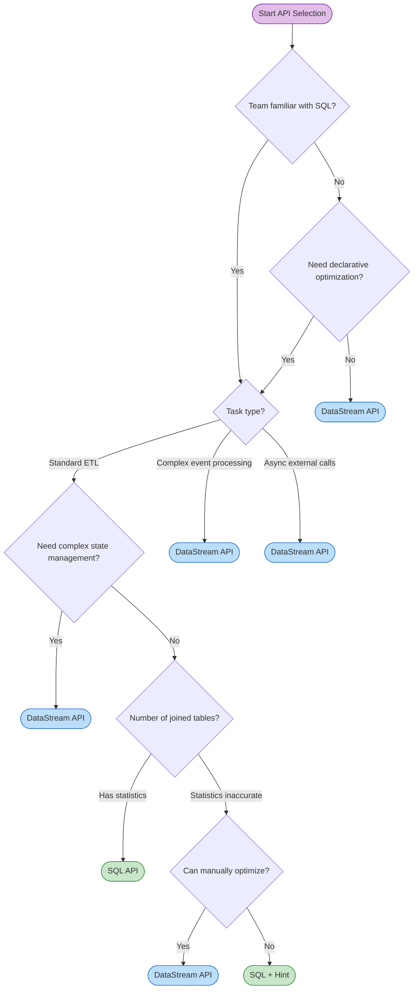
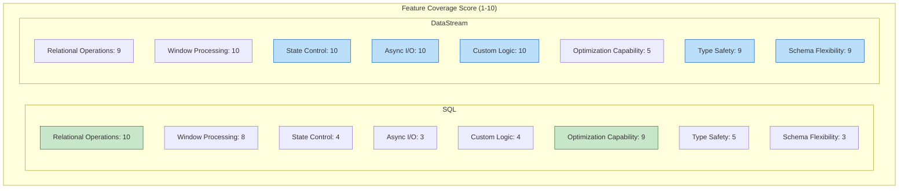
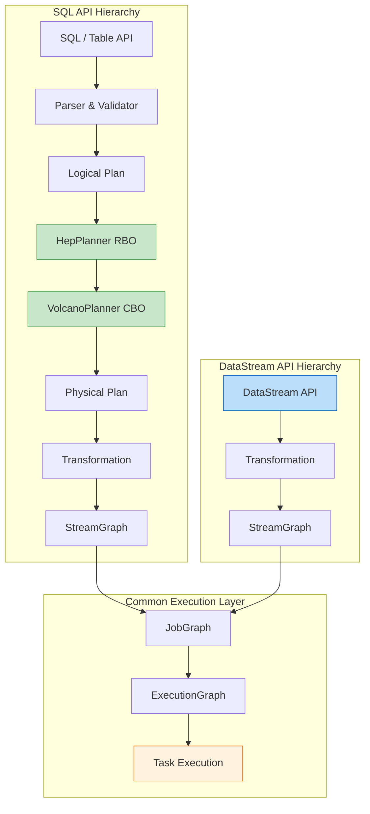
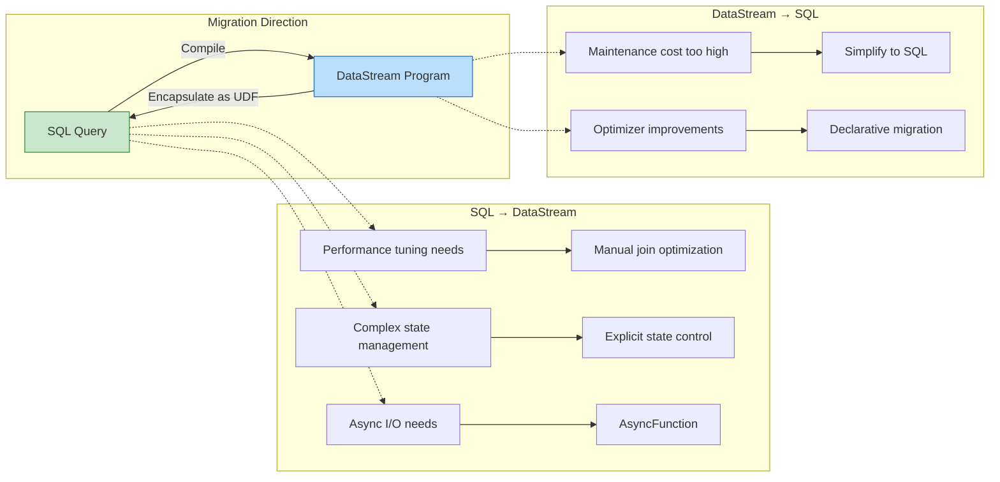

# Flink SQL vs DataStream API Comparison

> **Stage**: Flink/03-sql-table-api | **Prerequisites**: [Flink SQL Query Optimization Analysis](./query-optimization-analysis.md), [DataStream V2 API Semantic Analysis](../../01-concepts/datastream-v2-semantics.md) | **Formalization Level**: L4

---

## Table of Contents

- [Flink SQL vs DataStream API Comparison](#flink-sql-vs-datastream-api-comparison)
  - [Table of Contents](#table-of-contents)
  - [1. Definitions](#1-definitions)
    - [Def-F-03-01 (SQL API Abstraction)](#def-f-03-01-sql-api-abstraction)
    - [Def-F-03-02 (DataStream API Abstraction)](#def-f-03-02-datastream-api-abstraction)
    - [Def-F-03-03 (Expressiveness Relationship)](#def-f-03-03-expressiveness-relationship)
  - [2. Properties](#2-properties)
    - [Lemma-F-03-01 (Global Nature of SQL Optimization)](#lemma-f-03-01-global-nature-of-sql-optimization)
    - [Lemma-F-03-02 (Precision of DataStream State Control)](#lemma-f-03-02-precision-of-datastream-state-control)
    - [Prop-F-03-01 (Expressiveness–Optimization Trade-off)](#prop-f-03-01-expressivenessoptimization-trade-off)
  - [3. Relations](#3-relations)
    - [Relation 1: SQL API `↦` DataStream API (Encoding Relationship)](#relation-1-sql-api--datastream-api-encoding-relationship)
    - [Relation 2: SQL Plan Space `⊂` DataStream Plan Space](#relation-2-sql-plan-space--datastream-plan-space)
  - [4. Argumentation](#4-argumentation)
    - [4.1 Eight-Dimension Detailed Comparison Table](#41-eight-dimension-detailed-comparison-table)
    - [4.2 Performance Characteristics Comparison](#42-performance-characteristics-comparison)
    - [4.3 Usage Scenario Decision Matrix](#43-usage-scenario-decision-matrix)
  - [5. Proof / Engineering Argument](#5-proof--engineering-argument)
    - [Thm-F-03-01 (Quantifiable Performance Impact of API Choice)](#thm-f-03-01-quantifiable-performance-impact-of-api-choice)
    - [Engineering Argument: API Selection Decision Framework](#engineering-argument-api-selection-decision-framework)
  - [6. Examples](#6-examples)
    - [6.1 Window Aggregation Comparison](#61-window-aggregation-comparison)
    - [6.2 Dual-Stream Join Comparison](#62-dual-stream-join-comparison)
    - [6.3 DataStream Exclusive: Async I/O](#63-datastream-exclusive-async-io)
    - [6.4 Hybrid Usage Example](#64-hybrid-usage-example)
  - [7. Visualizations](#7-visualizations)
    - [7.1 API Selection Decision Tree](#71-api-selection-decision-tree)
    - [7.2 Feature Coverage Radar Chart (Conceptual)](#72-feature-coverage-radar-chart-conceptual)
    - [7.3 API Hierarchy Architecture Comparison](#73-api-hierarchy-architecture-comparison)
    - [7.4 Migration Path Diagram](#74-migration-path-diagram)
  - [8. References](#8-references)

## 1. Definitions

### Def-F-03-01 (SQL API Abstraction)

**Flink SQL API** is a declarative, unified batch/stream query interface based on relational algebra:

$$
\text{SQL API} = \langle \mathcal{Q}_{SQL}, \mathcal{C}_{Calcite}, \mathcal{P}_{opt}, \mathcal{T}_{plan} \rangle
$$

| Symbol | Semantics |
|--------|-----------|
| $\mathcal{Q}_{SQL}$ | Set of SQL query statements |
| $\mathcal{C}_{Calcite}$ | Apache Calcite optimization framework (RBO + CBO) |
| $\mathcal{P}_{opt}$ | Physical plan space (Broadcast/Shuffle/Sort-Merge Join) |
| $\mathcal{T}_{plan}$ | Plan translator (Physical Plan → StreamGraph) |

**Intuitive explanation**: The SQL API lets developers describe "what result is wanted" using declarative syntax, and the optimizer automatically selects the execution strategy[^1].

---

### Def-F-03-02 (DataStream API Abstraction)

**Flink DataStream API** is an imperative interface based on functional dataflow programming:

$$
\text{DataStream API} = \langle \mathcal{D}_{stream}, \mathcal{F}_{trans}, \mathcal{S}_{state}, \mathcal{O}_{op} \rangle
$$

| Symbol | Semantics |
|--------|-----------|
| $\mathcal{D}_{stream}$ | Typed data stream `DataStream<T>` |
| $\mathcal{F}_{trans}$ | Transformation functions (map/filter/keyBy/window/process) |
| $\mathcal{S}_{state}$ | Explicit state management (ValueState/ListState/MapState) |
| $\mathcal{O}_{op}$ | Operator-level control (parallelism, chaining, slot sharing) |

**Intuitive explanation**: The DataStream API provides precise control over computation logic, state maintenance, and parallel distribution[^2].

---

### Def-F-03-03 (Expressiveness Relationship)

**Key property**: $\mathcal{E}_{SQL} \subset \mathcal{E}_{DS}$ (SQL is a proper subset of DataStream)

- Any SQL query can be compiled into a DataStream program
- There exist DataStream programs that cannot be directly expressed in SQL (e.g., custom ProcessFunction, Async I/O)[^3]

---

## 2. Properties

### Lemma-F-03-01 (Global Nature of SQL Optimization)

**Statement**: For multi-table joins, the SQL optimizer can consider a globally optimal execution order, whereas DataStream programs usually adopt a fixed order.

**Derivation**:

1. SQL `SELECT * FROM A JOIN B JOIN C` does not specify join order
2. The CBO can enumerate a plan space at the level of Catalan numbers
3. DataStream `a.join(b).join(c)` fixes a left-deep tree structure `((A⋈B)⋈C)`
4. SQL has a global optimization advantage in multi-table join scenarios[^4]

---

### Lemma-F-03-02 (Precision of DataStream State Control)

**Statement**: DataStream allows precise control over state access patterns, while SQL state management is implicitly decided by the optimizer.

**Derivation**:

1. DataStream explicitly declares state via `ValueState<T>`, `MapState<K,V>`
2. Custom TTL, State Backend, and incremental Checkpoint are possible
3. SQL state is automatically derived by the Planner and may not be optimal[^5]

---

### Prop-F-03-01 (Expressiveness–Optimization Trade-off)

**Statement**: The more expressive the API (DataStream), the harder it is to optimize; the more restricted the API (SQL), the larger the optimizable space.

**Derivation**:

1. SQL's restricted syntax can be mapped to relational algebra, so the optimizer can safely apply equivalence transformations
2. DataStream's Turing-complete language contains programs with undecidable equivalence
3. There exists an inverse relationship: $|\mathcal{E}| \uparrow \Rightarrow |\mathcal{O}| \downarrow$ [^6]

---

## 3. Relations

### Relation 1: SQL API `↦` DataStream API (Encoding Relationship)

**Relationship type**: Surjective but not injective

**Argumentation**:

- SQL is compiled via Calcite into `RelNode` → `Transformation` → `StreamGraph`
- There exists an encoding function $encode: \mathcal{Q}_{SQL} \rightarrow \text{Program}_{DS}$
- Different DataStream programs may correspond to equivalent implementations of the same SQL query

**Inference [Model→Implementation]**: SQL declarative semantics ⟹ DataStream imperative execution. The optimizer translates declarative intent into an efficient imperative implementation.

---

### Relation 2: SQL Plan Space `⊂` DataStream Plan Space

**Argumentation**:

- SQL operators (Filter/Project/Join/Aggregate) are a subset of the DataStream API
- DataStream supports low-level operators such as `ProcessFunction`, `AsyncFunction`, `CoProcessFunction`
- These patterns cannot be directly expressed in SQL[^7]

---

## 4. Argumentation

### 4.1 Eight-Dimension Detailed Comparison Table

| Dimension | Flink SQL | DataStream API | Recommended Choice |
|-----------|-----------|----------------|--------------------|
| **Abstraction Level** | Declarative (What) | Imperative (How) | Based on team background |
| **Expressiveness** | Restricted (relational algebra subset) | Complete (Turing-complete) | Complex logic → DataStream |
| **Optimization Capability** | Global optimization (CBO + RBO) | Local optimization (chaining only) | Complex queries → SQL |
| **State Control** | Implicit (optimizer-managed) | Explicit (developer-controlled) | Large state → DataStream |
| **Learning Curve** | Gentle (SQL is widely known) | Steep (requires stream computing concepts) | Quick start → SQL |
| **Debugging Difficulty** | Medium (EXPLAIN plan) | High (requires understanding operators) | Frequent tuning → SQL |
| **Type Safety** | Runtime checking | Compile-time checking | Strong typing needs → DataStream |
| **Schema Evolution** | Requires DDL changes | Schema-on-Read | Frequent schema changes → DataStream |

---

### 4.2 Performance Characteristics Comparison

| Scenario | SQL | DataStream | Difference Analysis |
|----------|-----|------------|---------------------|
| Simple filter | ~5-10ms | ~5-10ms | No significant difference |
| Window aggregation | Depends on Watermark | Depends on Watermark | Depends on configuration |
| Multi-table join | Optimizer-chosen | Manual algorithm choice | DataStream more controllable |
| Async I/O | Lookup Join | AsyncFunction | DataStream more flexible [^8] |

---

### 4.3 Usage Scenario Decision Matrix

| Scenario | Recommended API | Reason |
|----------|-----------------|--------|
| Simple ETL | SQL | Less code, automatic optimization |
| Complex Event Processing (CEP) | DataStream | SQL cannot express pattern matching |
| Real-time reports / dashboards | SQL | Fast iteration, easy maintenance |
| Async external data enrichment | DataStream | AsyncFunction is more flexible |
| Machine learning inference | DataStream | Requires custom state management |
| Frequent schema changes | DataStream | Schema-on-Read [^9] |

---

## 5. Proof / Engineering Argument

### Thm-F-03-01 (Quantifiable Performance Impact of API Choice)

**Statement**: For task $T$, there is no universally superior API:

$$
\exists T: Perf_{SQL}(T) > Perf_{DS}(T) \land \exists T': Perf_{DS}(T') > Perf_{SQL}(T')
$$

**Proof**:

**Case 1: SQL is better than DataStream ($T$ = multi-table join)**

1. The SQL optimizer considers a plan space of $O(\text{Catalan}(n-1) \cdot n!)$
2. DataStream fixes the join order, plan space = 1
3. When CBO statistics are accurate, SQL selects the optimal plan with probability $\approx 1$

**Case 2: DataStream is better than SQL ($T'$ = complex event processing)**

1. SQL cannot directly express "A occurs, and within 5 minutes B appears and C does not"
2. DataStream `ProcessFunction` can precisely implement NFA pattern matching

**Conclusion**: The two APIs have their own applicable domains. ∎

---

### Engineering Argument: API Selection Decision Framework

```
ShouldUseSQL(task) ≡ (
    IsRelationalAlgebraExpressible(task) ∧
    HasAccurateStatistics(task) ∧
    NeedsRapidIteration(task)
)

ShouldUseDataStream(task) ≡ (
    NeedsCustomStateManagement(task) ∨
    NeedsAsyncIO(task) ∨
    NeedsComplexEventProcessing(task) ∨
    OptimizerMakesSuboptimalChoice(task)
)
```

**Comprehensive recommendations**:

- **SQL first**: New projects, teams familiar with SQL, standard ETL
- **DataStream first**: Complex event processing, large state management, poor optimizer choices
- **Hybrid usage**: SQL as primary, DataStream UDF for complex logic supplementation

---

## 6. Examples

### 6.1 Window Aggregation Comparison

**SQL**:

```sql
SELECT
    user_id,
    TUMBLE_START(event_time, INTERVAL '5' MINUTES) as window_start,
    SUM(amount) as total_amount
FROM orders
GROUP BY
    user_id,
    TUMBLE(event_time, INTERVAL '5' MINUTES);
```

**DataStream**:

```java

import org.apache.flink.api.common.functions.AggregateFunction;
import org.apache.flink.streaming.api.windowing.time.Time;

orders
    .assignTimestampsAndWatermarks(
        WatermarkStrategy.<Order>forBoundedOutOfOrderness(Duration.ofSeconds(30))
            .withTimestampAssigner((order, ts) -> order.getEventTime())
    )
    .keyBy(Order::getUserId)
    .window(TumblingEventTimeWindows.of(Time.minutes(5)))
    .aggregate(new OrderAggregateFunction())
    .print();
```

**Comparison**: SQL 7 lines vs DataStream ~20 lines; SQL automatically applies two-stage optimization, DataStream requires manual implementation[^10].

---

### 6.2 Dual-Stream Join Comparison

**SQL**:

```sql
SELECT o.*, p.payment_status
FROM orders o
JOIN payments p
    ON o.order_id = p.order_id
    AND o.event_time BETWEEN p.event_time - INTERVAL '5' MINUTE
                         AND p.event_time + INTERVAL '5' MINUTE;
```

**DataStream**:

```java

import org.apache.flink.streaming.api.windowing.time.Time;

orders
    .keyBy(Order::getOrderId)
    .intervalJoin(payments.keyBy(Payment::getOrderId))
    .between(Time.minutes(-5), Time.minutes(5))
    .process(new ProcessJoinFunction<>() {
        @Override
        public void processElement(Order o, Payment p, Context ctx, Collector<Result> out) {
            out.collect(new Result(o, p));
        }
    });
```

---

### 6.3 DataStream Exclusive: Async I/O

**Scenario**: Asynchronously query a user info service for data enrichment.

```java

import org.apache.flink.streaming.api.datastream.DataStream;

public class AsyncUserEnrichment extends AsyncFunction<Order, EnrichedOrder> {
    private transient AsyncHttpClient httpClient;

    @Override
    public void open(Configuration parameters) {
        httpClient = AsyncHttpClient.create().setMaxConnections(1000);
    }

    @Override
    public void asyncInvoke(Order order, ResultFuture<EnrichedOrder> resultFuture) {
        httpClient.get("/users/" + order.getUserId())
            .thenApply(resp -> new EnrichedOrder(order, resp.getUserLevel()))
            .whenComplete((result, err) -> {
                if (err != null) resultFuture.completeExceptionally(err);
                else resultFuture.complete(Collections.singletonList(result));
            });
    }
}

DataStream<EnrichedOrder> enriched = AsyncDataStream.unorderedWait(
    orders, new AsyncUserEnrichment(), 1000, TimeUnit.MILLISECONDS, 100
);
```

**Key advantage**: `AsyncFunction` allows releasing the compute thread while waiting for an external response, avoiding Backpressure[^11].

---

### 6.4 Hybrid Usage Example

```java
// Register DataStream as SQL table
tableEnv.createTemporaryView("orders", orderStream);

// Register DataStream UDF
tableEnv.createTemporarySystemFunction("CalculateScore", new CalculateScoreUDF());

// SQL handles main logic
Table result = tableEnv.sqlQuery(
    "SELECT userId, SUM(amount) as total, CalculateScore(userId, SUM(amount)) as score " +
    "FROM orders GROUP BY userId, TUMBLE(eventTime, INTERVAL '5' MINUTES)"
);

// Convert back to DataStream
tableEnv.toDataStream(result).addSink(new CustomSink());
```

---

## 7. Visualizations

### 7.1 API Selection Decision Tree



---

### 7.2 Feature Coverage Radar Chart (Conceptual)



| Dimension | SQL | DataStream | Description |
|-----------|-----|------------|-------------|
| Relational operations | 10 | 9 | Native SQL advantage |
| Window processing | 8 | 10 | DataStream supports custom windows |
| State control | 4 | 10 | DataStream explicit fine-grained control |
| Async I/O | 3 | 10 | DataStream native AsyncFunction |
| Custom logic | 4 | 10 | DataStream fully customizable |
| Optimization capability | 9 | 5 | SQL global CBO |
| Type safety | 5 | 9 | DataStream compile-time checking |
| Schema flexibility | 3 | 9 | DataStream Schema-on-Read |

---

### 7.3 API Hierarchy Architecture Comparison



---

### 7.4 Migration Path Diagram



---

## 8. References

[^1]: Apache Flink. "Apache Flink SQL Query Engine." <https://nightlies.apache.org/flink/flink-docs-stable/docs/dev/table/>

[^2]: Apache Flink. "DataStream API." <https://nightlies.apache.org/flink/flink-docs-stable/docs/dev/datastream/overview/>

[^3]: Carbone, P., et al. "Apache Flink: Stream and Batch Processing in a Single Engine." *IEEE Data Eng. Bull.*, 38(4), 2015.

[^4]: Graefe, G. "The Cascades Framework for Query Optimization." *IEEE Data Eng. Bull.*, 18(3), 1995.

[^5]: Apache Flink. "State Backends." <https://nightlies.apache.org/flink/flink-docs-stable/docs/ops/state/state_backends/>

[^6]: Selinger, P. G., et al. "Access Path Selection in a Relational Database Management System." *SIGMOD*, 1979.

[^7]: Apache Flink. "Table API & SQL." <https://nightlies.apache.org/flink/flink-docs-stable/docs/dev/table/common/>

[^8]: Apache Flink. "Asynchronous I/O." <https://nightlies.apache.org/flink/flink-docs-stable/docs/dev/datastream/operators/asyncio/>

[^9]: Kleppmann, M. *Designing Data-Intensive Applications*. O'Reilly, 2017.

[^10]: Apache Flink. "Aggregate Optimization." <https://nightlies.apache.org/flink/flink-docs-stable/docs/dev/table/tuning/>

[^11]: Akidau, T., et al. "The Dataflow Model." *PVLDB*, 8(12), 2015.

---

*Document Version: v1.0 | Update Date: 2026-04-02 | Specification Compliance: AGENTS.md Six-Section Template*
